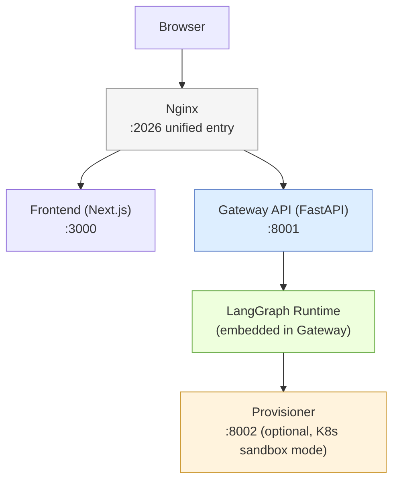

# Product Overview & Positioning

## Purpose

This note establishes what DeerFlow _is_ before any code is read. It covers the product's identity, its version history, how it differentiates from peer frameworks, and what the repository's non-code files reveal about team culture and contributor expectations.

## Key Files

- `README.md` — canonical product definition, quick-start, feature overview, security notice
- `README_zh.md` — Chinese translation (confirms ByteDance treats CN devs as first-class)
- `CONTRIBUTING.md` — development environment choices, CI structure, code-style toolchain
- `SECURITY.md` — supported branches, vulnerability reporting path
- `CODE_OF_CONDUCT.md` — Contributor Covenant v2.0, standard OSS governance
- `Install.md` — machine-readable setup instructions written for AI coding agents

## What DeerFlow Is

DeerFlow stands for **D**eep **E**xploration and **E**fficient **R**esearch **Flow**.
It is an open-source **super agent harness** from ByteDance, built on LangGraph and LangChain.
It orchestrates **sub-agents**, **memory**, and **sandboxes**, extended by **skills**.

The target user is a developer or team who wants an AI agent that can:

- Execute code inside an isolated sandbox
- Persist memory across sessions
- Decompose complex tasks into parallel sub-agents
- Integrate with IM platforms (Slack, Telegram, Feishu, DingTalk, etc.)
- Be driven by any OpenAI-compatible LLM

## Version History: v1 → v2

|                   | v1 (Deep Research)                      | v2 (Super Agent Harness)                                |
| ----------------- | --------------------------------------- | ------------------------------------------------------- |
| **Purpose**       | Structured multi-step research pipeline | General-purpose agent harness                           |
| **Code shared**   | None — complete rewrite                 | —                                                       |
| **Branch**        | `main-1.x` (still maintained)           | `main` (active development)                             |
| **Runtime model** | Framework you wire together             | Batteries-included runtime                              |
| **What changed**  | Research-only workflows                 | Code execution, memory, sub-agents, IM channels, skills |

**Why the rewrite?** Community usage of v1 extended far beyond research: data pipelines, slide decks, dashboards, content workflows. The team recognized DeerFlow was functioning as a harness, not a research tool. They rebuilt from scratch to match actual usage patterns.

This is significant: v2's architecture was shaped by _observing what users built_, not by upfront design. The implication is that DeerFlow's extensibility (skills, MCP, custom agents) is load-bearing, not decorative.

## Differentiation from Peer Frameworks

| Framework     | Model                                     | DeerFlow's difference                                                                     |
| ------------- | ----------------------------------------- | ----------------------------------------------------------------------------------------- |
| **AutoGen**   | Multi-agent conversation protocol         | DeerFlow: opinionated runtime with full infrastructure (sandbox, memory, skills built in) |
| **CrewAI**    | Role-based crew with task delegation      | DeerFlow: LangGraph graph-first, not role-based; harness owns the execution environment   |
| **OpenDevin** | Code-execution-focused agent with sandbox | DeerFlow: broader skill system + IM channels + memory; sandbox is one layer among many    |

The key framing from the README: _"It's a super agent harness — batteries included, fully extensible. Built on LangGraph and LangChain, it ships with everything an agent needs out of the box."_

The word "harness" is deliberate. A harness holds components together and transfers load. DeerFlow doesn't ask the developer to wire up an event loop, a tool registry, a stream handler, or a memory store — it ships all of these.

## Core Features (Product Surface)

### Skills & Tools

- **Skills** = YAML/Markdown-defined capability modules; loaded progressively (lazy) to protect context window
- Built-in skills: research, report generation, slide creation, web pages, image/video generation
- MCP servers = external tool server protocol (OAuth-aware for remote servers)
- Tool philosophy: swap anything, add anything

### Sub-Agents

- Lead agent spawns sub-agents on demand
- Sub-agents run in **parallel** where possible
- Each sub-agent has **isolated context** (cannot see lead agent's state)
- Token usage attributed back to the dispatching step for accounting

### Sandbox & File System

- **AioSandboxProvider**: Docker container isolation for shell execution
- **LocalSandboxProvider**: file tools work, but host bash disabled by default (not a secure boundary)
- Per-thread filesystem: `/mnt/user-data/{uploads, workspace, outputs}`

### Long-Term Memory

- Persistent per-user profile, preferences, accumulated knowledge
- Stored locally, under user control
- Deduplicates facts at apply time

### Context Engineering

- Summarizes completed sub-tasks to manage token budget
- Strips raw tool-call metadata on forced-stop messages to prevent malformed history errors (OpenAI-compatible reasoning model gotcha)

## System Topology (From README + CONTRIBUTING)

All traffic enters through **Nginx on port 2026** — the single browser-facing endpoint.

- Non-API paths → Frontend (Next.js)
- `/api/*` → Gateway API (FastAPI)
- `/api/langgraph/*` → Gateway's LangGraph-compatible API surface (same Gateway process, rewritten path)

The Gateway runs the LangGraph agent runtime _embedded inside the same process_. There is no separate LangGraph server — DeerFlow implements its own LangGraph-compatible HTTP protocol layer.

The **provisioner** container only starts in Kubernetes/AioSandbox mode. It schedules sandbox pods for code execution.

## LangGraph-Compatible API Surface

DeerFlow exposes a LangGraph-compatible API at `/api/langgraph/*`. This is an intentional design decision:

- It allows LangGraph ecosystem tooling (LangSmith tracing, SDK clients) to work against DeerFlow out of the box
- The Gateway translates these public LangGraph-compatible paths to its own internal `/api/*` routers
- IM channels use the LangGraph-compatible API internally when routing messages through the Gateway

This dual-surface design means DeerFlow can be used as a drop-in LangGraph server while running its own runtime implementation underneath.

## IM Channels

Seven messaging platform integrations ship out of the box:

| Platform      | Transport                  | Notes                                   |
| ------------- | -------------------------- | --------------------------------------- |
| Telegram      | Bot API (long-polling)     | Easiest setup                           |
| Slack         | Socket Mode (WebSocket)    | Requires app-level token                |
| Feishu / Lark | WebSocket                  | Two domains: CN + international         |
| WeChat        | Tencent iLink long-polling | QR bootstrap for first-time auth        |
| WeCom         | WebSocket                  | Uses WeCom AI Bot platform              |
| DingTalk      | Stream Push (WebSocket)    | AI Card streaming for typewriter effect |
| Discord       | (Section 19 detail)        | Mention-only mode, thread routing       |

IM channels run **inside the gateway container** in Docker Compose. They attach internal auth + CSRF tokens automatically when calling the Gateway API.

## Security Posture

The README's security notice (⚠️ callout box) is prominently placed before Contributing — unusual emphasis. Key points:

- DeerFlow is **designed for local trusted environments** (127.0.0.1 loopback)
- Dangerous capabilities: system command execution, resource operations, business logic invocation
- Risks if exposed publicly: unauthorized invocation, compliance liability
- Recommendations: IP allowlist, auth reverse proxy, VLAN isolation

This positioning has architectural consequences: the auth system exists but is not assumed to be the only defense layer. The README explicitly tells operators to add their own network controls.

## Developer Infrastructure

From `CONTRIBUTING.md`:

| Concern                     | Tool                    |
| --------------------------- | ----------------------- |
| Python linting + formatting | `ruff`                  |
| TypeScript linting          | ESLint                  |
| TypeScript formatting       | Prettier                |
| Python package management   | `uv`                    |
| Node.js package management  | `pnpm`                  |
| Backend tests               | pytest                  |
| Frontend unit tests         | Vitest                  |
| Frontend E2E tests          | Playwright              |
| CI triggers                 | GitHub Actions (per-PR) |

CI runs three workflows: backend unit, frontend unit, frontend E2E (Playwright, only when `frontend/` files change).

## `Install.md` — An Agent-Oriented Document

`Install.md` is written _for AI coding agents_ (Claude Code, Codex, Cursor, Windsurf), not humans. It is idempotent, prefers Docker, avoids `sudo`, and has explicit success criteria and a structured final response format.

This is a design signal: **DeerFlow treats AI agents as first-class operators of its own infrastructure**. The same system that powers DeerFlow can be used to install and configure DeerFlow itself.

## My Insights

**1. "Harness" is a deliberate break from "framework" thinking.**
A framework gives you primitives to build with. A harness gives you a working system that you can configure and extend. DeerFlow v2 chose the harness model because community users didn't want to assemble a research agent — they wanted to use one and extend it. This shapes every architectural decision downstream: opinionated defaults, progressive skill loading, batteries-included memory and sandbox.

**2. The v1→v2 rewrite is architecturally interesting because it was community-driven, not roadmap-driven.**
Most rewrites are driven by tech debt or scaling limits. This one was driven by use-case drift (users building things the authors didn't anticipate). The implication: DeerFlow's extensibility (skills, MCP, sub-agents) must be robust because it's literally the thesis of the product.

**3. Nginx as the single unified entry point is a deliberate simplicity choice.**
Every integration — browser, LangSmith, IM channels, embedded Python client — goes through one port (2026). This reduces the cognitive overhead of "which port does X use?" and makes same-origin API calls natural in the browser without CORS. The trade-off is that nginx config becomes a critical piece of the system to understand.

**4. LangGraph-compatible API surface is a strategic compatibility layer.**
By implementing the LangGraph wire protocol, DeerFlow doesn't have to rebuild an ecosystem of tooling (tracing, SDK clients, third-party integrations). This is the same strategy that led OpenAI-compatible APIs to proliferate: implement the popular interface, run your own backend.

**5. Security responsibility is explicitly placed on the operator, not the framework.**
DeerFlow's security model is: "we give you auth, you add network controls." This is honest but notable — it means the default setup (no IP restrictions, no VPN) is only safe on a local machine. Anyone deploying DeerFlow on a shared server needs to read the security notice carefully.

## Open Questions

- How does the LangGraph-compatible API surface map internally? Is it a thin routing layer in nginx, or does the Gateway implement the LangGraph HTTP protocol?
- What exactly does the provisioner container do? The README says it handles Kubernetes sandbox pods — what RPC protocol does it use?
- v1 Deep Research: what was its LangGraph graph structure? Understanding the baseline helps explain what v2 replaced.
- `DEER_FLOW_PROJECT_ROOT` vs `DEER_FLOW_HOME` — why two separate env vars? Is one for config and the other for runtime state?
- The README mentions "assistants" (`assistant_id: lead_agent`) in IM channel config. How does the LangGraph concept of "assistant" map to DeerFlow's agent model?

## Links to Related Sections

- [[02-system-architecture]] — full component map and traffic flow; builds directly on the topology introduced here
- [[03-project-setup]] — the Makefile targets, toolchain, and config system referenced throughout README Quick Start
- [[04-infrastructure-devops]] — Docker Compose, nginx config, provisioner — the infrastructure that makes port 2026 work
- [[05-gateway-api]] — the FastAPI Gateway at port 8001; the LangGraph-compatible API surface implementation
- [[19-channels]] — the IM channel implementations referenced in the feature overview
- [[27-security-design]] — deep dive on the security model hinted at in the README security notice
