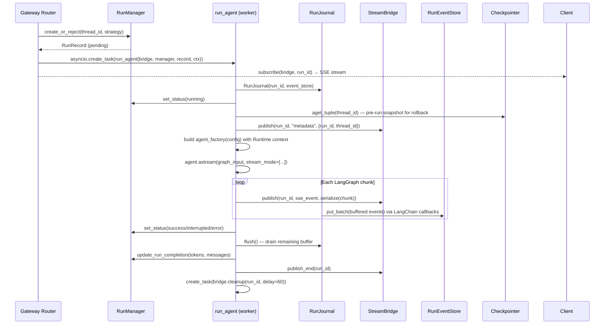
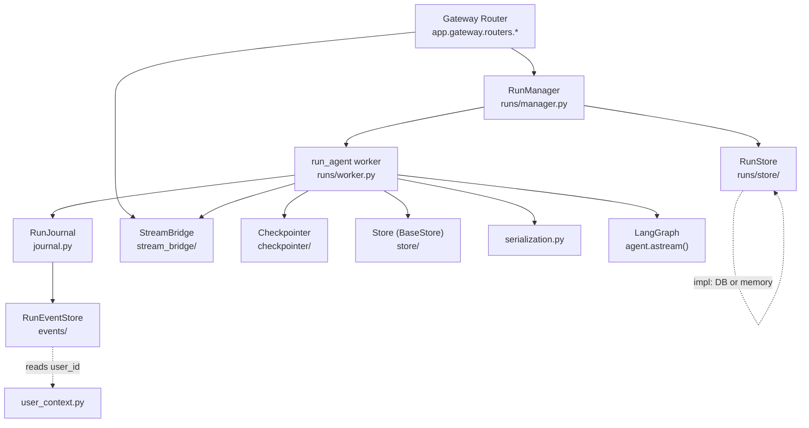
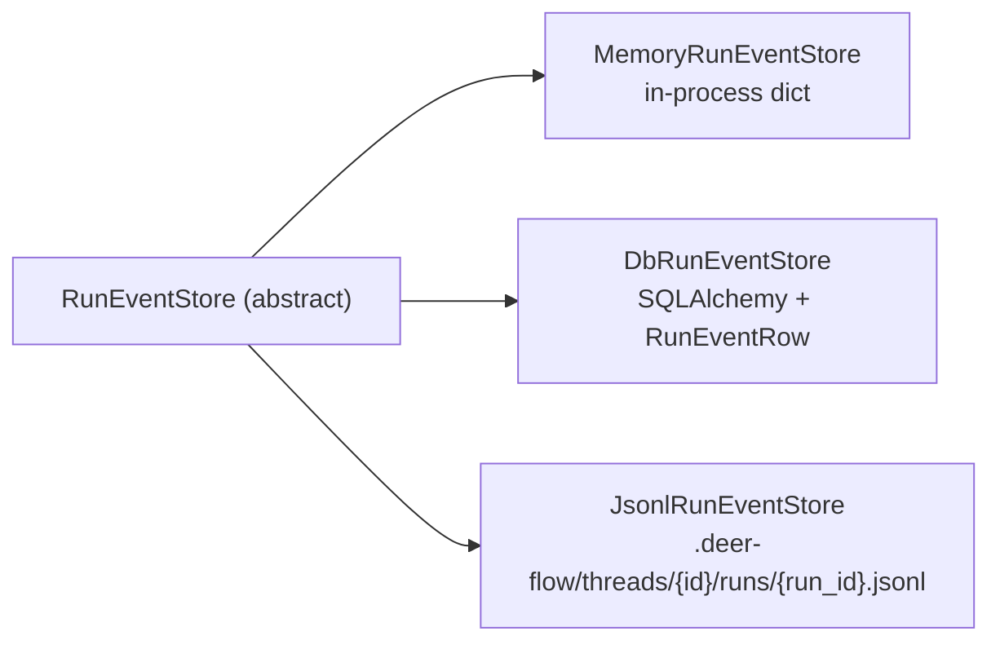
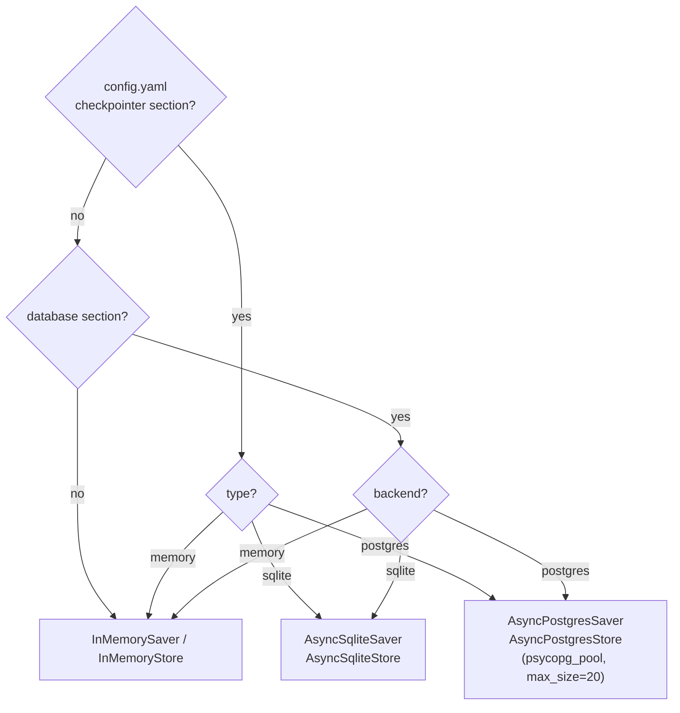

# System Architecture — Runtime Package

## Purpose

The `deerflow.runtime` package is the **engine room** of DeerFlow. It sits directly above LangGraph and below the FastAPI Gateway layer, providing everything needed to execute an agent run: lifecycle management, state persistence, event streaming, and observability. The Gateway delegates all agent work to this package via `RunManager` and `run_agent()`.

This note covers `backend/packages/harness/deerflow/runtime/` at overview depth, as surveyed during Section 02 (System Architecture). The detailed internals are revisited in Section 07 (LangGraph Runtime & Run Lifecycle).

## Key Files

- `__init__.py` — public API re-exports (checkpointer, runs, serialization, store, stream_bridge)
- `journal.py` — LangChain callback handler that captures run events to `RunEventStore`
- `converters.py` — LangChain → OpenAI Chat Completions format converters (not yet wired into journal)
- `serialization.py` — single source of truth for converting LangGraph objects to JSON
- `user_context.py` — asyncio ContextVar for request-scoped user identity
- `checkpointer/` — sync and async factories for LangGraph checkpointers
- `events/` — `RunEventStore` abstract interface + three concrete backends
- `runs/` — `RunManager`, `run_agent` worker, `RunStore`, schemas
- `store/` — LangGraph `BaseStore` factory (KV persistence for cross-thread agent state)
- `stream_bridge/` — producer/consumer bridge between agent worker and SSE endpoints

## Important Concepts

### The Five Subsystems and Their Roles

| Subsystem       | Role                              | Abstracting                          |
| --------------- | --------------------------------- | ------------------------------------ |
| `checkpointer`  | LangGraph graph state persistence | Thread conversation history          |
| `store`         | LangGraph cross-thread KV store   | Agent memory, custom data            |
| `runs`          | Run lifecycle + agent execution   | Concurrency, cancellation, streaming |
| `events`        | Structured event log per run      | Observability, message history       |
| `stream_bridge` | SSE decoupling layer              | Producer/consumer separation         |

### RunManager vs RunStore vs RunEventStore

Three "stores" exist in the runs path — their roles are distinct:

- **RunManager** — in-memory registry of _live_ `RunRecord` objects. Holds asyncio `Task` and `Event` handles. Not persisted directly; wraps a `RunStore`.
- **RunStore** — persists run _metadata_ (status, token counts, model name) across restarts. Backends: memory or database.
- **RunEventStore** — persists the _event stream_ for a run (LLM I/O, tool calls, lifecycle events). Backends: memory, SQLAlchemy DB, or JSONL files.

### user_context Three-State Semantics

Repository methods accept `user_id` with three distinct meanings:

```python
user_id=AUTO     # read from ContextVar; raise if unset (normal request path)
user_id="uuid"   # explicit override (test, admin flows)
user_id=None     # bypass isolation entirely (migration scripts, CLIs)
```

The `AUTO` sentinel is a singleton class instance. This pattern keeps repository method signatures simple while covering all three call contexts without conditional branching in callers.

### Caller Identification via LangChain Tags

`RunJournal` identifies which component produced each LLM call by reading LangChain callback tags:

- No tag → `"lead_agent"` (default; the main graph doesn't inject tags)
- `"subagent:general-purpose"` → subagent token bucket
- `"middleware:title"` → middleware token bucket

This lets the journal bucket token usage by caller without any direct import dependency on the agent or middleware code. It is a lightweight pub-sub tagging convention within LangChain's callback system.

### StreamBridge as Producer/Consumer Decoupler

The SSE endpoint never touches the LangGraph stream directly. Instead:

1. `run_agent()` (producer) calls `bridge.publish(run_id, event, data)`
2. The SSE handler (consumer) calls `bridge.subscribe(run_id)` → async iterator of `StreamEvent`
3. `MemoryStreamBridge` uses `asyncio.Condition` to coordinate — no polling

This design means the SSE endpoint can attach to a run that is already in progress (late subscriber), and SSE reconnection (`Last-Event-ID`) is handled by replaying the bounded event buffer.

## Execution Flow

How a run travels through the runtime package from request to SSE end:



### Walkthrough

1. **`create_or_reject`** — The Gateway calls `RunManager.create_or_reject()` with the thread ID and the multitask strategy (`reject` / `interrupt` / `rollback`). This is the concurrency gate: if a run is already in flight on that thread, the strategy decides whether the new request is rejected outright, the inflight run is cancelled, or the inflight run is cancelled and its checkpoint is rolled back. The lock is held across the entire check-and-insert to eliminate TOCTOU races.

2. **`RunRecord (pending)`** — `RunManager` returns a `RunRecord` dataclass holding the run metadata, an `asyncio.Event` (abort signal), and a `Task` slot (not yet filled). Status is `pending`.

3. **`asyncio.create_task(run_agent(...))`** — The Gateway schedules `run_agent()` as a background asyncio Task. It does **not** await it — control returns immediately so the SSE response can open before the agent starts.

4. **`subscribe(bridge, run_id) → SSE stream`** — The Gateway opens an SSE response by subscribing to the `StreamBridge` before any events are published. Late-arriving subscribers are handled via the bridge's bounded event replay buffer.

5. **`RunJournal(run_id, event_store)`** — The worker creates the `RunJournal` LangChain callback handler, which will intercept every LLM call, tool call, and chain event during the run, accumulating them in a buffer for async flush to `RunEventStore`.

6. **`set_status(running)` + pre-run snapshot** — The worker marks the run active in `RunManager` (making it visible to concurrency checks), then calls `checkpointer.aget_tuple()` to snapshot the thread's current checkpoint state. This snapshot is held in memory for rollback use only — it is not written back unless the run is cancelled with `action="rollback"`.

7. **`publish "metadata"`** — The first event pushed to the bridge carries `run_id` and `thread_id`. SSE clients use this to confirm which run they are watching.

8. **`build agent_factory` + `agent.astream()`** — The worker assembles a `RunContext` (frozen dataclass grouping checkpointer, store, event_store, and config), wraps it in a `Runtime` object, and injects it into the LangGraph config under `configurable.__pregel_runtime`. Then it calls `agent.astream(graph_input, stream_mode=[...])` to start the LangGraph streaming loop.

9. **Streaming loop** — For every chunk LangGraph produces, two things happen concurrently:
   - The worker calls `bridge.publish()` to push the serialised chunk to all SSE subscribers.
   - `RunJournal` fires (via LangChain's callback mechanism) to buffer the event. When the buffer reaches 20 events, or on `on_chain_end`, it schedules an async flush to `RunEventStore`.

10. **Terminal phase** — After the stream ends (or on exception/cancellation), the worker: sets the final status in `RunManager`, calls `journal.flush()` to drain any remaining buffered events, calls `update_run_completion()` to persist token counts and model name to `RunStore`, calls `bridge.publish_end()` to send the `__end__` sentinel (which closes all SSE subscriber iterators), and schedules a deferred `bridge.cleanup()` 60 seconds later to retain the event buffer for reconnecting clients.

## Architecture Diagrams

### Runtime Package Dependency Graph



### RunEventStore Backends



### Checkpointer and Store Backend Decision Tree



## My Insights

### Sync/Async Provider Pattern

Every subsystem (checkpointer, store, stream*bridge) exposes both a **sync singleton** (`get*_`) and an **async context manager** (`make\__`). The sync path serves the embedded `DeerFlowClient` and CLI scripts; the async path serves FastAPI lifespan. This dual-path design is a clean solution to the "same config, two execution contexts" problem — without forcing async on CLI users or maintaining two separate config paths.

### Config Co-location: Checkpointer and Store

The LangGraph `BaseStore` deliberately reads from the same `checkpointer:` section as the checkpointer. This enforces a constraint: you cannot use SQLite for checkpointing and Postgres for the store. The trade-off is simplicity over flexibility — and it's the right call because checkpointing and store data are equally critical. Divergence would create subtle split-brain scenarios.

### "events" Mode is a Known Gap

`run_agent` explicitly skips `events` stream mode with a log message explaining why: LangGraph's `astream_events()` (which produces that mode) cannot be combined with `astream(stream_mode=[...])`. The JS LangGraph Platform works around this using internal checkpoint callbacks that are not exposed in Python. This is an intentional limitation documented at the source, not an oversight.

### Rollback via Checkpoint Snapshot

Before streaming begins, `run_agent` snapshots the pre-run checkpoint (the `channel_values`, `metadata`, and `pending_writes` from the most recent checkpoint). If a run is cancelled with `action="rollback"`, the worker writes this snapshot back via `checkpointer.aput()` using a fresh checkpoint ID but the same channel state. This gives the system a true "undo" capability — the thread returns to its exact pre-run state, including any partial writes from the last checkpoint before the run started.

### RunJournal Flush Design

`RunJournal` is synchronous (it's a `BaseCallbackHandler`) but its store is async. The flush strategy:

1. Accumulate events in `_buffer` (a plain Python list)
2. At threshold (20 events) or on `on_chain_end`: call `_flush_sync()`
3. `_flush_sync()` grabs the running event loop and schedules a `create_task`
4. If no event loop (CLI / no-async context): leave in buffer, flush in `finally`
5. Track in-flight flush tasks; skip new flushes if one is already pending (prevents concurrent SQLite writes)

The one-in-flight-at-a-time guard is specifically to avoid concurrent writes to the same SQLite WAL file, documented directly in the code.

### Caller-Bucketed Token Accounting

Token usage is split into three buckets: `lead_agent`, `subagent`, `middleware`. Subagents can call further LLMs, and middleware can call LLMs for title generation or summarization. Bucketing reveals the true cost structure of a run — e.g., if 90% of tokens are in `subagent`, the lead agent barely consumed anything. This data flows through `RunJournal.get_completion_data()` → `RunManager.update_run_completion()` → `RunStore`, and surfaces via the token-usage API endpoint.

## Open Questions

- `converters.py` is not re-exported from `__init__.py` and not called by `RunJournal` (which uses `model_dump()` directly). Is it dead code, or used by consumers outside this folder?
- `make_stream_bridge` has a `"redis"` branch that raises `NotImplementedError` with "Phase 2". Is this on the roadmap?
- `DbRunEventStore` uses PostgreSQL advisory locks for monotonic `seq` assignment. Is there a concurrent-write regression test?
- `JsonlRunEventStore.list_messages()` scans all run files for a thread (O(runs)) while `list_events()` reads one file (O(1)). What's the expected scale — is this trade-off ever a problem in practice?
- The `run_events_config.track_token_usage` flag: which config file controls it, and what is the off-by-default rationale?

## Links to Related Sections

- Section 07 — LangGraph Runtime & Run Lifecycle (detailed deep-dive into `runs/manager.py`, `run_agent`, `StreamBridge`)
- Section 02 — System Architecture (other components: `backend/CLAUDE.md`, `ARCHITECTURE.md`, `langgraph.json`, `docker/nginx/`)
- Section 05 — Gateway API (caller of `RunManager` and `StreamBridge`)
- Section 18 — Persistence Layer (`DbRunEventStore` depends on `RunEventRow` ORM model)
- Section 20 — Tracing & Observability (`RunJournal` produces the audit trail consumed here)
