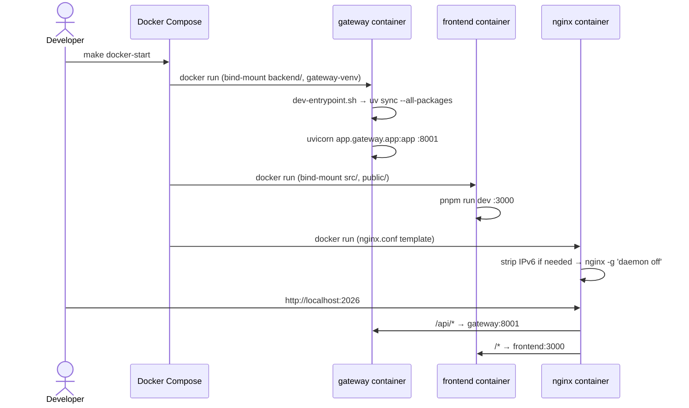
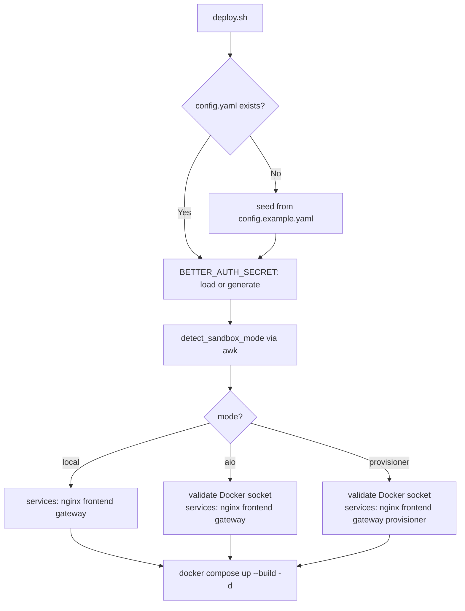
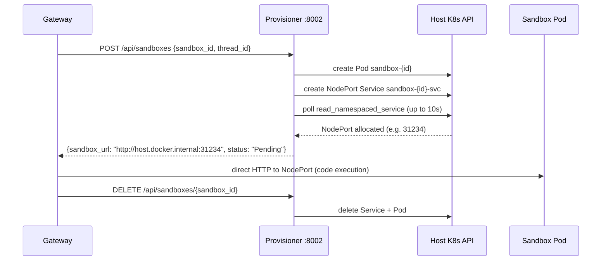

# Infrastructure & DevOps

## Purpose

Section 04 covers how DeerFlow is packaged, deployed, and maintained as a containerised
system. The infrastructure is built around Docker Compose (dev and prod variants), an Nginx
reverse proxy, an optional Kubernetes sandbox provisioner, a deployment shell script, and
five GitHub Actions CI/CD workflows. Together these components let a developer go from a
fresh clone to a running production stack with a single command.

## Key Files

- `docker/docker-compose-dev.yaml` — Five-service development stack with hot reload, DooD,
  and named volumes preserving the build-time `.venv`
- `docker/docker-compose.yaml` — Production stack: no bind mounts, multi-worker uvicorn,
  config paths injected via env vars
- `docker/nginx/nginx.conf` — Reverse proxy routing (see Section 02 notes)
- `docker/dev-entrypoint.sh` — Dev container bootstrap: UV_EXTRAS validation, `uv sync`,
  `.venv` self-heal, uvicorn handoff
- `docker/provisioner/app.py` — FastAPI microservice managing K8s sandbox Pod + Service
  lifecycle
- `scripts/deploy.sh` — Production deployment entry point: config seeding, secret
  management, sandbox mode detection, compose orchestration
- `.github/workflows/` — Five CI/CD workflows: lint, backend unit tests, frontend unit
  tests, E2E tests, container publishing

## Important Concepts

- **Docker Compose project name** — Both compose files use `-p deer-flow` as the compose
  project name. `docker compose -p deer-flow down` will stop the right containers regardless
  of which directory you're in.

- **Nested named volume trick** — In dev, `backend/` is bind-mounted for hot reload but
  `backend/.venv` is a separate named volume (`gateway-venv`). This prevents the host
  directory from shadowing the `.venv` built during the image layer. Without it, every
  container start would require `uv sync`.

- **Docker-out-of-Docker (DooD)** — The gateway container mounts `/var/run/docker.sock`
  from the host. This lets `AioSandboxProvider` inside the gateway spawn sibling sandbox
  containers directly via the host Docker daemon. It is a security trade-off acceptable in
  dev/trusted environments.

- **BETTER_AUTH_SECRET persistence** — The deploy script generates a 32-byte hex secret
  once and stores it at `$DEER_FLOW_HOME/.better-auth-secret` (chmod 600). On subsequent
  runs it is reloaded so frontend auth sessions survive container restarts.

- **Sandbox modes** — Three sandbox execution backends:
  - `local` — runs code directly in the gateway process filesystem
  - `aio` — Docker-out-of-Docker; gateway spawns sibling containers
  - `provisioner` — Kubernetes mode; provisioner creates a Pod+Service per sandbox

- **Selective service start** — `deploy.sh` only adds `provisioner` to the Docker Compose
  service list when `config.yaml` sets `sandbox.use` to `AioSandboxProvider` **and**
  `sandbox.provisioner_url` is set. Otherwise the provisioner container is never started.

## Execution Flow

### Dev stack startup



### Production deployment



### Provisioner sandbox lifecycle



## Architecture Diagrams

### Dev vs prod compose comparison

```
DEV                                    PROD
───────────────────────────────────    ─────────────────────────────────
nginx          :2026                   nginx          :${PORT:-2026}
frontend       :3000 (hot reload)      frontend       (static build)
gateway        :8001 (uv sync)         gateway        :8001 (4 workers)
postgres       :5432 (optional)        [no postgres — external DB]
provisioner    :8002 (optional K8s)    provisioner    :8002 (optional K8s)

Named volumes:                         Named volumes:
  gateway-venv  (preserves .venv)        [none — .venv baked in image]
  gateway-uv-cache
  postgres-data

Network: deer-flow-dev 192.168.200.0/24   Network: deer-flow (auto subnet)
```

### CI/CD pipeline

```
PR / push to main
├── lint-check.yml       — ruff + ESLint + typecheck + next build (all branches)
├── backend-unit-tests   — pytest unit suite (skip drafts, 15 min timeout)
├── frontend-unit-tests  — Vitest (skip drafts, 15 min timeout)
└── e2e-tests            — Playwright Chromium, frontend/** changes only

git tag v*
└── container.yaml       — build + push backend + frontend → ghcr.io
                           with SLSA build provenance attestations
```

## My Insights

**The nested volume trick is the most interesting Docker pattern here.** The standard advice
for hot reload is "bind-mount your source directory." But when the container build step
installs dependencies into a path _inside_ that directory (`.venv`), the bind mount will
shadow them with an empty host directory. The solution — a named volume mounted at the
nested path — is clean and rarely documented. The dev compose file is a good reference
for this pattern.

**The provisioner is designed as a narrow sidecar.** It only does lifecycle management;
it never touches code execution. Once the gateway has the NodePort URL, the provisioner
is out of the picture. This keeps the provisioner stateless, simple (one 580-line file),
and replaceable — you could swap it for a cloud function or a different API without
touching the gateway code.

**`deploy.sh` is doing first-run UX work that frameworks often push to a separate wizard.**
Config seeding, secret generation, Docker socket validation — all happen inline in the
deploy script. This is pragmatic: the deploy path is the natural first entry point, so
it's the right place to handle first-run state.

**The CI pipeline has a meaningful gap**: E2E tests run with `SKIP_ENV_VALIDATION=1` and
a mocked API, meaning no CI job validates the real backend+frontend integration. The SLSA
attestations on container images show security maturity, but the absence of integration
tests is notable given the system's complexity (SSE streaming, LangGraph runtime,
multi-worker uvicorn).

**Action SHA pinning in `container.yaml`** is a supply-chain security signal. The Docker
workflow pins to commit SHAs (`docker/login-action@74a5d14...`) while the simpler
workflows use semver tags. This asymmetry is common — the publishing workflow that writes
to the registry is hardened; the read-only test workflows are less risk-sensitive.

## Open Questions

See [[open-questions]] — Section 04 block:

- Is the sandbox image publicly pullable outside China?
- How does the gateway know when a sandbox Pod is ready after `POST /api/sandboxes`?
- Does the awk YAML parser in `deploy.sh` handle inline comments on the `use:` key?
- How does `RunManager` coordinate state across 4 uvicorn workers in production?
- How is full backend+frontend integration validated before a release tag is pushed?

## Links to Related Sections

- [[02-system-architecture-runtime-package]] — nginx routing config, port assignments
- [[07-langgraph-runtime]] (upcoming) — RunManager and multi-worker coordination
- [[15-sandbox]] (upcoming) — AioSandboxProvider implementation inside the gateway
- [[26-testing-strategy]] (upcoming) — E2E test structure and mock API strategy
