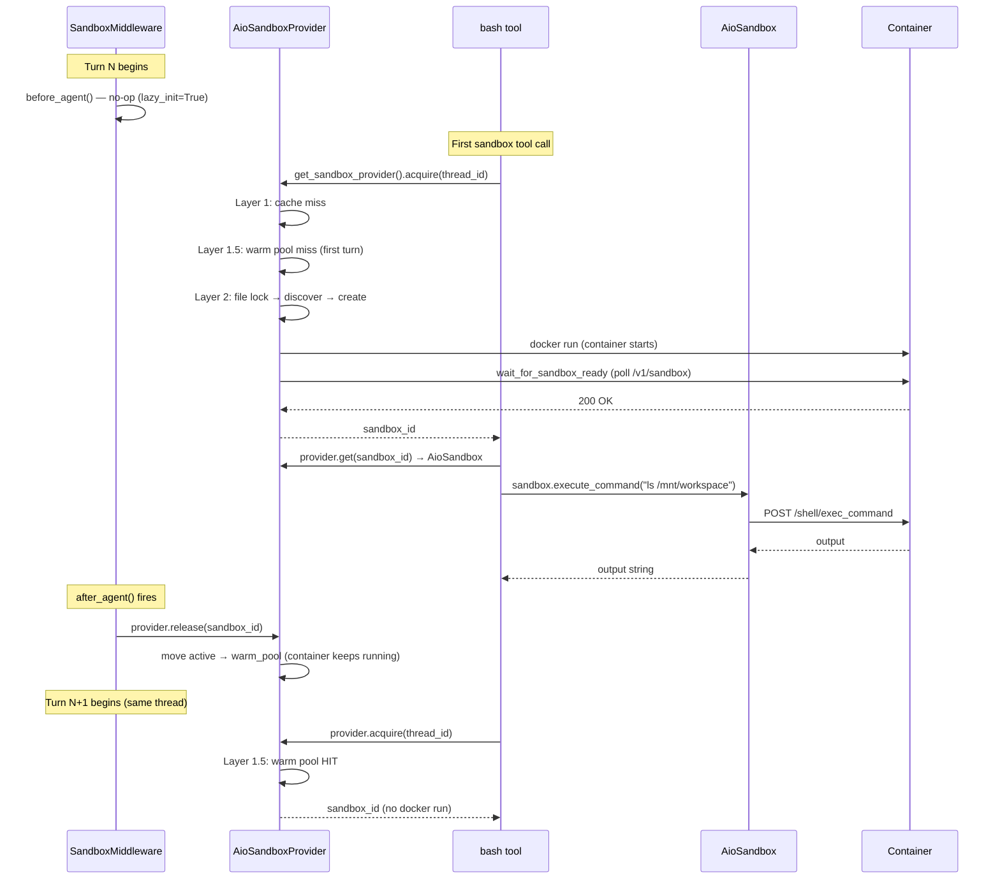
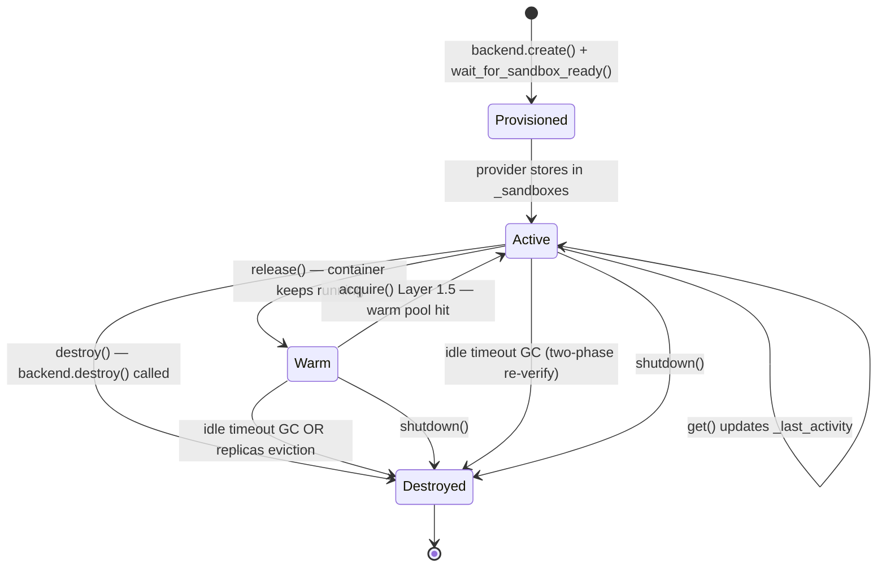

# AIO Sandbox Architecture — Technical Deep Dive

> **Scope:** AioSandbox subsystem only — `SandboxMiddleware`, `AioSandboxProvider`,
> `SandboxBackend` (Local + Remote), `AioSandbox`, virtual path system, volume mounts,
> and deployment configurations.
> For the local filesystem sandbox see `notes/modules/15b-local-sandbox.md`.

---

## 1. What the Sandbox Subsystem Does

Every agent run executes in an isolated environment where the model can run shell
commands and read/write files without touching the host directly. The sandbox
subsystem provides that environment as a Docker container (or K8s Pod) and manages
the full lifecycle: provision, pool, acquire, use, release, idle-evict, and destroy.

**Physical reality:** one sandbox = one Docker container. The agent never knows it is
talking to a container — it calls `sandbox.execute_command()` like any other API.

---

## 2. Layer Architecture

The subsystem is split into three distinct layers, each with a single concern:

```
┌─────────────────────────────────────────────────────────────────┐
│  Agent Tools  (bash, read_file, write_file, ls, grep, glob)     │
│  SandboxMiddleware                                              │
│         │ acquire / release                                      │
│         ▼                                                        │
│  SandboxProvider  ← the pool manager (1 instance per process)   │
│    AioSandboxProvider                                           │
│         │ create / destroy / discover / list_running            │
│         ▼                                                        │
│  SandboxBackend   ← the provisioning driver (internal to AIO)   │
│    LocalContainerBackend  OR  RemoteSandboxBackend              │
│         │ docker run / POST /api/sandboxes                       │
│         ▼                                                        │
│  Container  (Docker container or K8s Pod)                       │
│         │ HTTP API                                               │
│         ▼                                                        │
│  Sandbox  ← the session handle (one per active thread)          │
│    AioSandbox                                                   │
└─────────────────────────────────────────────────────────────────┘
```

| Layer             | Concern                                                   | Who calls it                    |
| ----------------- | --------------------------------------------------------- | ------------------------------- |
| `Sandbox`         | Execute commands, read/write files in a running container | Agent tools                     |
| `SandboxProvider` | Acquire/release sandbox sessions; pooling; lifecycle      | `SandboxMiddleware`, tools      |
| `SandboxBackend`  | Create/destroy/discover Docker containers or K8s Pods     | `AioSandboxProvider` internally |

`SandboxBackend` is an internal implementation detail of `AioSandboxProvider`. Nothing
outside the `community/aio_sandbox/` package knows it exists.

---

## 3. Activating the AIO Sandbox

`AioSandboxProvider` is resolved at runtime via the config, never imported directly:

```yaml
# config.yaml
sandbox:
  use: deerflow.community.aio_sandbox:AioSandboxProvider
  image: enterprise-public-cn-beijing.cr.volces.com/vefaas-public/all-in-one-sandbox:latest
  port: 8080
  container_prefix: deer-flow-sandbox
  idle_timeout: 600 # seconds; 0 = disable
  replicas: 3 # max active + warm containers combined
  mounts:
    - host_path: /data/shared
      container_path: /mnt/shared
      read_only: true
  environment:
    NODE_ENV: production
    API_KEY: $MY_API_KEY # $ prefix → resolved from host env at startup
```

**Singleton instantiation** — `sandbox_provider.py:get_sandbox_provider()`:

```python
# sandbox/sandbox_provider.py:63-68
cls = resolve_class(config.sandbox.use, SandboxProvider)   # reflection
_default_sandbox_provider = cls(**kwargs)                  # AioSandboxProvider()
```

The singleton is created on the **first** call to `get_sandbox_provider()`, which
happens when `SandboxMiddleware` first runs or when a tool first needs a sandbox.

---

## 4. SandboxProvider — The Pool Manager

### 4.1 In-process state

`AioSandboxProvider.__init__()` initialises five dictionaries and a warm pool:

```python
self._sandboxes:       dict[str, AioSandbox]               = {}  # active
self._sandbox_infos:   dict[str, SandboxInfo]               = {}  # metadata (for destroy)
self._thread_sandboxes: dict[str, str]                      = {}  # thread_id → sandbox_id
self._thread_locks:    dict[str, threading.Lock]            = {}  # per-thread serialiser
self._last_activity:   dict[str, float]                     = {}  # idle-GC timestamp
self._warm_pool:       dict[str, tuple[SandboxInfo, float]] = {}  # released but running
```

### 4.2 Two-tier container pool

```
Active pool (_sandboxes)      Warm pool (_warm_pool)
─────────────────────────     ─────────────────────────────────────
• Container is in use         • Container is still running
• _last_activity tracked      • release_timestamp tracked
• Never evicted               • Eligible for fast reclaim (Layer 1.5)
• thread_id → sandbox_id      • Eligible for LRU eviction when
  mapping maintained            replicas limit is reached
```

**`release(sandbox_id)`** — moves active → warm (container keeps running):

```python
# aio_sandbox_provider.py:636-647
self._sandboxes.pop(sandbox_id, None)
info = self._sandbox_infos.pop(sandbox_id, None)
# remove thread_id → sandbox_id mapping
self._last_activity.pop(sandbox_id, None)
if info and sandbox_id not in self._warm_pool:
    self._warm_pool[sandbox_id] = (info, time.time())  # park in warm pool
```

**`destroy(sandbox_id)`** — removes from both pools and stops the container:

```python
# aio_sandbox_provider.py:661-676
self._sandboxes.pop(sandbox_id, None)
info = self._sandbox_infos.pop(sandbox_id, None)
# remove from warm_pool if present
self._backend.destroy(info)   # docker stop / DELETE /api/sandboxes
```

### 4.3 Deterministic sandbox ID

```python
# aio_sandbox_provider.py:246
hashlib.sha256(thread_id.encode()).hexdigest()[:8]
```

The first 8 hex characters of SHA-256 give a 32-bit space. Every process derives the
**same** ID from the **same** `thread_id` with no coordination. This is what makes
cross-process discovery work — the container name `deer-flow-sandbox-{id}` is
predictable from any process that knows the `thread_id`.

### 4.4 Three-layer acquire

`acquire(thread_id)` is the hot path. Three layers are checked in order, stopping
at the first hit:

```
Layer 1     In-process cache      _thread_sandboxes + _sandboxes      No I/O
Layer 1.5   Warm pool             _warm_pool[sandbox_id]              No Docker call
Layer 2     Cross-process         file lock → discover → create       Docker / HTTP
```

**Layer 1** (fastest — no I/O):

```python
# aio_sandbox_provider.py:452-461
with self._lock:
    if thread_id in self._thread_sandboxes:
        existing_id = self._thread_sandboxes[thread_id]
        if existing_id in self._sandboxes:
            self._last_activity[existing_id] = time.time()
            return existing_id          # ← hot path: zero I/O
        else:
            del self._thread_sandboxes[thread_id]  # stale entry, clean up
```

**Layer 1.5** (warm pool — no cold-start):

```python
# aio_sandbox_provider.py:467-477
with self._lock:
    if sandbox_id in self._warm_pool:
        info, _ = self._warm_pool.pop(sandbox_id)
        sandbox = AioSandbox(id=sandbox_id, base_url=info.sandbox_url)
        self._sandboxes[sandbox_id] = sandbox
        self._sandbox_infos[sandbox_id] = info
        self._last_activity[sandbox_id] = time.time()
        self._thread_sandboxes[thread_id] = sandbox_id
        return sandbox_id               # ← warm hit: no docker run
```

**Layer 2** — cross-process file lock (slowest path, only for first turn):

```python
# aio_sandbox_provider.py:494-538
lock_path = paths.thread_dir(thread_id, user_id=user_id) / f"{sandbox_id}.lock"
with open(lock_path, "a") as lock_file:
    _lock_file_exclusive(lock_file)  # fcntl.flock on POSIX, msvcrt.locking on Windows
    # Re-check both caches (another in-process thread may have won while we waited)
    ...
    # Backend discovery: another process may have started the container
    discovered = self._backend.discover(sandbox_id)
    if discovered is not None:
        # Adopt the existing container
        ...
        return discovered.sandbox_id
    # Nobody has it — create a new container
    return self._create_sandbox(thread_id, sandbox_id)
```

The file lock is per-sandbox-id (stored in the thread's data directory). Two processes
racing to create the same sandbox serialise here; the second finds the container via
`discover()` instead of creating a duplicate.

### 4.5 Replicas cap (soft)

```python
# aio_sandbox_provider.py:577-588
replicas = self._config.get("replicas", DEFAULT_REPLICAS)  # default 3
with self._lock:
    total = len(self._sandboxes) + len(self._warm_pool)
if total >= replicas:
    evicted = self._evict_oldest_warm()   # LRU eviction from warm pool only
    if not evicted:
        # All slots are ACTIVE — never force-stop a live thread's container
        logger.warning(f"All {replicas} replica slots are in active use; "
                       f"creating sandbox {sandbox_id} beyond the soft limit")
```

The cap is soft: active containers are **never** evicted. Only warm-pool (idle)
containers are eligible. If all slots are active, the cap is exceeded with a warning.

### 4.6 Idle timeout GC

A daemon thread runs every `IDLE_CHECK_INTERVAL = 60` seconds. It destroys sandboxes
that have been idle for longer than `idle_timeout` (default 600 s). For **active**
sandboxes, a two-phase destroy is used to prevent a race condition:

```python
# aio_sandbox_provider.py: _cleanup_idle_sandboxes
# Phase 1: snapshot candidates under lock
with self._lock:
    for sandbox_id, last_activity in self._last_activity.items():
        if (current_time - last_activity) > idle_timeout:
            active_to_destroy.append(sandbox_id)

# Phase 2: re-verify EACH candidate under lock before destroying
for sandbox_id in active_to_destroy:
    with self._lock:
        last_activity = self._last_activity.get(sandbox_id)
        if last_activity is None:
            continue  # already destroyed by another path
        if (time.time() - last_activity) < idle_timeout:
            continue  # re-acquired between Phase 1 and Phase 2 — skip!
    self.destroy(sandbox_id)
```

Without Phase 2, a sandbox that was re-acquired between snapshot and destroy would
have its container stopped while a live thread is using it.

### 4.7 Orphan reconciliation

On startup, `_reconcile_orphans()` calls `backend.list_running()` and unconditionally
adopts every matching container into the warm pool:

```python
# aio_sandbox_provider.py:211-235
running = self._backend.list_running()
for info in running:
    with self._lock:
        if info.sandbox_id in self._sandboxes or info.sandbox_id in self._warm_pool:
            continue
        self._warm_pool[info.sandbox_id] = (info, current_time)
```

This closes the memory-loss gap: if the process crashes or is killed (`SIGKILL`), all
in-process state is gone but Docker containers keep running. Without reconciliation,
those containers would run forever (the idle checker only tracks in-process state).

All containers are adopted unconditionally because there is no way to distinguish
"orphaned" from "actively used by another process" — idle timeout handles both.

### 4.8 Graceful shutdown

Three shutdown triggers, all calling `self.shutdown()`:

```python
# aio_sandbox_provider.py:113-114 — atexit (normal process exit)
atexit.register(self.shutdown)

# aio_sandbox_provider.py:388-408 — signal handlers (SIGTERM, SIGINT, SIGHUP)
signal.signal(signal.SIGTERM, signal_handler)
signal.signal(signal.SIGINT, signal_handler)

# sandbox_provider.py:106-107 — explicit application shutdown
if hasattr(_default_sandbox_provider, "shutdown"):
    _default_sandbox_provider.shutdown()
```

Signal handlers chain to the original handler after calling `shutdown()`, so Python's
default `SIGINT` behaviour (`KeyboardInterrupt`) and uvicorn's `SIGTERM` handler still
fire after containers are cleaned up.

---

## 5. SandboxBackend — The Provisioning Driver

### 5.1 Interface

```python
# community/aio_sandbox/backend.py
class SandboxBackend(ABC):
    def create(thread_id, sandbox_id, extra_mounts) -> SandboxInfo: ...
    def destroy(info: SandboxInfo) -> None: ...
    def is_alive(info: SandboxInfo) -> bool: ...
    def discover(sandbox_id: str) -> SandboxInfo | None: ...
    def list_running() -> list[SandboxInfo]: ...   # default returns []
```

`discover()` is the cross-process reconnection method. It is distinct from `create()`:
`discover()` finds a container that already exists; `create()` starts a new one.

`is_alive()` is a lightweight probe (Docker `inspect`, not HTTP polling). It is used
by the idle checker for quick liveness checks, not for blocking until ready.

`wait_for_sandbox_ready()` — a module-level helper (not on the class) that polls
`GET /v1/sandbox` until the container responds HTTP 200 or times out:

```python
# community/aio_sandbox/backend.py:16-35
def wait_for_sandbox_ready(sandbox_url: str, timeout: int = 30) -> bool:
    start_time = time.time()
    while time.time() - start_time < timeout:
        try:
            response = requests.get(f"{sandbox_url}/v1/sandbox", timeout=5)
            if response.status_code == 200:
                return True
        except requests.exceptions.RequestException:
            pass
        time.sleep(1)
    return False
```

It is module-level (not a method) so both `LocalContainerBackend` (timeout=5, called
in `discover()`) and `AioSandboxProvider` (timeout=60, called in `_create_sandbox()`)
can import it independently with different timeouts.

### 5.2 Backend selection

```python
# aio_sandbox_provider.py:135-156
def _create_backend(self) -> SandboxBackend:
    provisioner_url = self._config.get("provisioner_url")
    if provisioner_url:
        return RemoteSandboxBackend(provisioner_url=provisioner_url)
    return LocalContainerBackend(
        image=..., base_port=..., container_prefix=...,
        config_mounts=..., environment=...,
    )
```

### 5.3 LocalContainerBackend

Manages Docker or Apple Container on the local machine. On macOS it probes
`container --version` and prefers Apple Container; falls back to Docker elsewhere.

**`create()` — port retry loop:**

```python
# local_backend.py:268-292
_next_start = self._base_port
for _attempt in range(10):
    port = get_free_port(start_port=_next_start)   # thread-safe global allocator
    try:
        container_id = self._start_container(container_name, port, extra_mounts)
        break
    except RuntimeError as exc:
        release_port(port)
        err_lower = str(exc).lower()
        if "port is already allocated" in err_lower or "address already in use" in err_lower:
            # Docker's port-release is async; skip this port and try next
            _next_start = port + 1
            continue
        if "is already in use by container" in err_lower:
            # Another process started this container — adopt it
            existing = self.discover(sandbox_id)
            if existing is not None:
                return existing
        raise
```

Two races are handled:

1. **Port race** — Docker's port release is asynchronous; `get_free_port()` may return
   a port Docker still considers allocated. Retry with the next port.
2. **Name race** — another process already started this deterministic container. Fall
   through to `discover()` to adopt it rather than failing.

**`_start_container()` — key flags:**

```python
# local_backend.py:504-553
cmd = [self._runtime, "run"]
if self._runtime == "docker":
    cmd.extend(["--security-opt", "seccomp=unconfined"])  # allow ptrace, etc.
cmd.extend(["--rm", "-d", "-p", port_mapping, "--name", container_name])
# env vars (values redacted in logs via _redact_container_command_for_log)
# config-level mounts
# thread-specific extra mounts
cmd.append(self._image)
```

`--security-opt seccomp=unconfined` is deliberate: the sandbox container needs
unrestricted syscall access (ptrace, mount namespaces, etc.) to run arbitrary user
code. Docker's default seccomp profile blocks these. Apple Container has its own
VM-level isolation and does not need this flag.

**Volume mount format:**

```python
# local_backend.py:78-87
if runtime == "docker":
    # Use --mount (not -v) to avoid Windows drive-letter colon ambiguity
    # e.g. "D:/path" — colon is both drive separator and volume separator in -v
    return ["--mount", f"type=bind,src={host_path},dst={container_path}"]
else:
    return ["-v", f"{host_path}:{container_path}"]
```

**`list_running()` — O(2) subprocess calls regardless of N:**

```python
# Step 1: docker ps --filter name=PREFIX --format {{.Names}}  (1 call)
# Step 2: docker inspect NAME1 NAME2 NAME3 ...                (1 batched call)
```

`docker inspect` returns `Name` with a leading `/` that must be stripped.
`docker ps --filter name=` does substring matching, so a secondary `startswith`
check is applied to exclude false-positive container names.

**Timestamp parsing:** Docker emits nanosecond-precision ISO 8601 with trailing `Z`
(e.g. `2026-04-08T01:22:50.123456789Z`). Python's `fromisoformat` (pre-3.11) accepts
at most microseconds and rejects bare `Z`. `_parse_docker_timestamp()` truncates
fractional seconds to 6 digits and replaces `Z` with `+00:00`. Returns `0.0` on
failure as an "unknown age" sentinel for the orphan GC.

### 5.4 RemoteSandboxBackend

A thin HTTP client that delegates all lifecycle operations to the Provisioner service:

```
this backend → HTTP → provisioner:8002 → K8s API → k3s:6443 → sandbox Pod
              ↑
              └── after Pod is running, backend connects directly
                  to the Pod via sandbox_url (k3s NodePort)
```

```python
# remote_backend.py: full interface implementation
def create(...)   → POST /api/sandboxes   → SandboxInfo(sandbox_url=data["sandbox_url"])
def destroy(...)  → DELETE /api/sandboxes/{id}   (best-effort, never raises)
def is_alive(...) → GET /api/sandboxes/{id}       → data["status"] == "Running"
def discover(...) → GET /api/sandboxes/{id}       → SandboxInfo or None on 404
def list_running()→ GET /api/sandboxes            → list[SandboxInfo]
```

`extra_mounts` passed to `create()` is silently dropped — K8s provisioner owns volume
configuration (PersistentVolumes, ConfigMaps) and callers cannot inject mounts at
request time.

`destroy()` is fire-and-forget: a failed `DELETE` logs a warning but never raises.
Orphan reconciliation at next startup cleans up any leaked Pods.

`is_alive()` and `discover()` hit the same endpoint but differ in return contract:
`is_alive()` extracts `status == "Running"` as a boolean; `discover()` returns a
full `SandboxInfo` and treats HTTP 404 as `None` (not an error).

### 5.5 SandboxInfo — the cross-process passport

```python
# community/aio_sandbox/sandbox_info.py
@dataclass
class SandboxInfo:
    sandbox_id:     str            # deterministic ID (sha256(thread_id)[:8])
    sandbox_url:    str            # http://localhost:8082 or http://k3s:30001
    container_name: str | None     # set by LocalContainerBackend; None in remote mode
    container_id:   str | None     # set by LocalContainerBackend; None in remote mode
    created_at:     float          # Unix timestamp; used by orphan GC age checks
```

`container_name` and `container_id` being `None` is a backend-type signal:

- Non-`None` → LocalContainerBackend (Docker on local host)
- Both `None` → RemoteSandboxBackend (K8s Pod, managed by Provisioner)

`from_dict()` has backward-compat for a field rename:

```python
sandbox_url=data.get("sandbox_url", data.get("base_url", ""))
```

---

## 6. AioSandbox — The Session Handle

`AioSandbox` wraps the third-party `agent_sandbox` SDK client and implements
DeerFlow's abstract `Sandbox` interface. One instance per active sandbox container.

```python
# community/aio_sandbox/aio_sandbox.py
from agent_sandbox import Sandbox as AioSandboxClient   # alias: avoids name collision
from deerflow.sandbox.sandbox import Sandbox             # abstract base class

class AioSandbox(Sandbox):
    def __init__(self, id: str, base_url: str, home_dir=None):
        super().__init__(id)
        self._base_url = base_url
        self._client = AioSandboxClient(base_url=base_url, timeout=600)
        self._home_dir = home_dir
        self._lock = threading.Lock()   # serialises shell commands within this process
```

### 6.1 Single persistent shell session + threading lock

The AIO sandbox container runs **one persistent shell session** across all requests.
Concurrent `exec_command` calls interleave session state and produce corrupt output
(the SDK returns `ErrorObservation` instead of real output — tracked as issue #1433).

`threading.Lock()` serialises all shell operations within a single process:

```python
# aio_sandbox.py:73-87
def execute_command(self, command: str) -> str:
    with self._lock:                # one shell call at a time within this process
        result = self._client.shell.exec_command(
            command=command,
            no_change_timeout=600,  # overrides SDK's 120s built-in default
        )
        output = result.data.output if result.data else ""
        if output and _ERROR_OBSERVATION_SIGNATURE in output:
            # Cross-process corruption detected despite in-process lock
            # (another process shares this container). Open a fresh shell session.
            fresh_id = str(uuid.uuid4())
            result = self._client.shell.exec_command(
                command=command, id=fresh_id, no_change_timeout=600
            )
            output = result.data.output if result.data else ""
        return output if output else "(no output)"
```

`_DEFAULT_NO_CHANGE_TIMEOUT = 600` overrides the SDK's built-in 120-second
`no_change_timeout` (time since last output byte). Without this override, long-running
commands that produce no output (e.g., a slow compilation) are prematurely killed.

**Cross-process corruption detection:**

```python
_ERROR_OBSERVATION_SIGNATURE = "'ErrorObservation' object has no attribute 'exit_code'"
```

This string appears in the SDK output when the persistent session is corrupted by
concurrent access from multiple processes sharing the same container. Detection is
by string match — brittle if the `agent_sandbox` SDK changes its error format.
Recovery: passing a new `id=uuid4()` forces the SDK to open a fresh shell session.

### 6.2 list_dir — shell-based

The AIO SDK has no native directory-listing API. `list_dir()` uses `exec_command`:

```python
# aio_sandbox.py:117
self._client.shell.exec_command(
    command=f"find {shlex.quote(path)} -maxdepth {max_depth} -type f -o -type d "
            f"2>/dev/null | head -500",
    no_change_timeout=600,
)
```

`2>/dev/null` suppresses permission errors. `head -500` caps the result size.
`shlex.quote()` prevents command injection via path values.

### 6.3 write_file append mode — non-atomic

```python
# aio_sandbox.py:136-140
if append:
    existing = self.read_file(path)          # read existing content
    if not existing.startswith("Error:"):
        content = existing + content          # prepend
self._client.file.write_file(file=path, content=content)   # write full content
```

This is a read-then-write, not an atomic append. `with self._lock` prevents concurrent
same-process appends. Cross-process appends to the same file can still race.
`startswith("Error:")` silently treats a missing file as an empty file.

### 6.4 grep — local regex validation

```python
# aio_sandbox.py:182-187
regex_source = _re.escape(pattern) if literal else pattern
_re.compile(regex_source, 0 if case_sensitive else _re.IGNORECASE)  # validate locally
regex = regex_source if case_sensitive else f"(?i){regex_source}"
# then: self._client.file.search_in_file(file=..., regex=regex)
```

The regex is compiled locally before the remote call. An invalid pattern raises
`re.error` by type — which the `grep_tool` caller catches. Without local validation,
an invalid pattern would raise an opaque `requests.HTTPError` or SDK exception that
the tool's `except re.error` clause would miss.

---

## 7. SandboxMiddleware — The Agent Lifecycle Bridge

`SandboxMiddleware` is position 3 in the lead-agent middleware chain. It is the only
middleware with both `before_agent` (acquire) and `after_agent` (release).

```python
# sandbox/middleware.py
class SandboxMiddleware(AgentMiddleware[SandboxMiddlewareState]):
    def __init__(self, lazy_init: bool = True): ...
```

### 7.1 lazy_init=True (default)

`before_agent()` is a complete no-op. The sandbox is acquired on the **first tool
call** that needs it, inside `_get_or_acquire_sandbox()` in `sandbox/tools.py`.
This avoids provisioning a container for runs that never use sandbox tools
(e.g., a purely conversational turn).

### 7.2 lazy_init=False (eager)

`before_agent()` acquires immediately, before the model is even called:

```python
# middleware.py:56-70
def before_agent(self, state, runtime) -> dict | None:
    if "sandbox" not in state or state["sandbox"] is None:
        thread_id = (runtime.context or {}).get("thread_id")
        sandbox_id = self._acquire_sandbox(thread_id)
        return {"sandbox": {"sandbox_id": sandbox_id}}  # written to LangGraph state
```

### 7.3 after_agent — release

`after_agent()` moves the sandbox from active to warm pool:

```python
# middleware.py:73-92
def after_agent(self, state, runtime) -> dict | None:
    sandbox = state.get("sandbox")
    if sandbox is not None:
        get_sandbox_provider().release(sandbox["sandbox_id"])
        return None
    # Fallback: sandbox_id in runtime.context (K8s pre-allocated mode)
    if runtime.context.get("sandbox_id") is not None:
        get_sandbox_provider().release(runtime.context["sandbox_id"])
        return None
```

`release()` does not stop the Docker container — it parks the container in the warm
pool so the next turn for the same thread can reclaim it instantly (Layer 1.5 acquire).

### 7.4 Full agent lifecycle



---

## 8. Virtual Path System

The agent sees a stable virtual filesystem regardless of how the host is laid out.
The mapping is defined in `deerflow/config/paths.py`.

### 8.1 Path table

| Virtual path (inside container)  | Host path                                                             | Mount type    |
| -------------------------------- | --------------------------------------------------------------------- | ------------- |
| `/mnt/user-data/workspace/`      | `{base_dir}/users/{user_id}/threads/{thread_id}/user-data/workspace/` | read-write    |
| `/mnt/user-data/uploads/`        | `{base_dir}/users/{user_id}/threads/{thread_id}/user-data/uploads/`   | read-write    |
| `/mnt/user-data/outputs/`        | `{base_dir}/users/{user_id}/threads/{thread_id}/user-data/outputs/`   | read-write    |
| `/mnt/acp-workspace/`            | `{base_dir}/users/{user_id}/threads/{thread_id}/acp-workspace/`       | **read-only** |
| `{container_path}` (from config) | `{skills_path}`                                                       | **read-only** |
| Config-level mounts              | `host_path` from `sandbox.mounts[]`                                   | per-config    |

`base_dir` defaults to `{project_root}/.deer-flow` (or `$DEER_FLOW_HOME` if set).

### 8.2 Path resolution

`paths.py` exposes two path families — **container paths** (for reading via the file
API) and **host paths** (for volume mount sources):

```python
# Container path (agent reads/writes via AioSandbox.read_file / write_file)
paths.sandbox_work_dir(thread_id, user_id=user_id)
# → Path(".deer-flow/users/u1/threads/t1/user-data/workspace")

# Host path (used as Docker bind-mount source)
paths.host_sandbox_work_dir(thread_id, user_id=user_id)
# → ".deer-flow/users/u1/threads/t1/user-data/workspace"  (raw string, preserves Windows style)
```

The separation matters in Docker-outside-Docker (DooD) mode — see Section 9.

### 8.3 Directory creation

`paths.ensure_thread_dirs()` creates all four directories before the container starts,
with mode `0o777`:

```python
# paths.py:260-280
for d in [workspace, uploads, outputs, acp_workspace]:
    d.mkdir(parents=True, exist_ok=True)
    d.chmod(0o777)   # must chmod after mkdir: mode= is subject to umask
```

`0o777` is required because the sandbox container may run as a different UID than the
host backend process. Without world-write permission, the container cannot write to the
bind-mounted directories and every file write fails with `Permission denied`.

### 8.4 Path traversal prevention

`paths.resolve_virtual_path()` validates before resolving:

```python
# paths.py:291-325
def resolve_virtual_path(self, thread_id, virtual_path, *, user_id=None):
    stripped = virtual_path.lstrip("/")
    prefix = "mnt/user-data"
    if not stripped.startswith(prefix + "/"):
        raise ValueError(f"Path must start with /{prefix}")
    base = self.sandbox_user_data_dir(thread_id, user_id=user_id).resolve()
    actual = (base / relative).resolve()
    actual.relative_to(base)   # raises ValueError on traversal attempt (../../etc)
    return actual
```

---

## 9. Deployment Configurations

### 9.1 Native (development)

```
Host machine runs:
  - DeerFlow backend process
  - Docker daemon

Config:
  sandbox:
    use: deerflow.community.aio_sandbox:AioSandboxProvider
    # No provisioner_url → LocalContainerBackend

Bind mounts:
  Docker daemon is on the same host as the backend process.
  sandbox_work_dir() paths are directly usable as -p mount sources.
  DEER_FLOW_HOST_BASE_DIR is NOT needed.
```

### 9.2 Docker-outside-Docker (DooD)

```
Docker container runs:
  - DeerFlow backend process (container A)
  - Mounts /var/run/docker.sock from host

Host machine runs:
  - Docker daemon

Problem:
  Container A sees .deer-flow/ at /app/.deer-flow
  Docker daemon (on host) resolves mount sources against the HOST filesystem.
  /app/.deer-flow does not exist on the host.

Solution:
  DEER_FLOW_HOST_BASE_DIR = /host/path/to/.deer-flow
  DEER_FLOW_SANDBOX_HOST  = host.docker.internal  (reach sibling containers)
  DEER_FLOW_HOST_SKILLS_PATH = /host/path/to/skills/
```

`paths.host_sandbox_work_dir()` returns `DEER_FLOW_HOST_BASE_DIR`-based paths when
the env var is set, so the Docker daemon receives host-valid mount sources.

`DEER_FLOW_SANDBOX_HOST` sets the hostname in the `sandbox_url` returned by `create()`:

```python
# local_backend.py:296-299
sandbox_host = os.environ.get("DEER_FLOW_SANDBOX_HOST", "localhost")
return SandboxInfo(
    sandbox_id=sandbox_id,
    sandbox_url=f"http://{sandbox_host}:{port}",
)
```

Docker bind host (for `-p` port publishing) is resolved separately:

```python
# local_backend.py:142-169
# DEER_FLOW_SANDBOX_BIND_HOST → explicit override
# loopback sandbox_host (localhost / 127.0.0.1 / ::1) → bind to 127.0.0.1
# non-loopback (host.docker.internal) → bind to 0.0.0.0 (expose on all interfaces)
```

### 9.3 K8s / Provisioner (production)

```
config.yaml:
  sandbox:
    use: deerflow.community.aio_sandbox:AioSandboxProvider
    provisioner_url: http://provisioner:8002

Architecture:
  DeerFlow → RemoteSandboxBackend → Provisioner:8002 → k3s:6443 → Pod
                                           ↑
                             DeerFlow connects directly to Pod
                             via NodePort URL in SandboxInfo.sandbox_url
                             (e.g. http://k3s:30001)
```

In this mode:

- Volume mounts are managed by the Provisioner (PersistentVolumes); `extra_mounts`
  passed by `AioSandboxProvider` is silently ignored.
- `list_running()` queries `GET /api/sandboxes` from the Provisioner (not Docker).
- Container cleanup (idle eviction) still uses the same `destroy()` path, which calls
  `DELETE /api/sandboxes/{id}` on the Provisioner.
- `uses_thread_data_mounts` returns `False`, signalling to the uploads router that
  files must be copied into the sandbox via API rather than read from a bind mount.

---

## 10. Concurrency Model

The subsystem has four distinct locking scopes:

| Lock                       | Scope                  | What it protects                                                       |
| -------------------------- | ---------------------- | ---------------------------------------------------------------------- |
| `AioSandboxProvider._lock` | In-process             | `_sandboxes`, `_warm_pool`, `_thread_sandboxes`, `_last_activity`      |
| `_thread_locks[thread_id]` | In-process, per-thread | Serialises concurrent `acquire()` calls for the same thread_id         |
| File lock (`fcntl.flock`)  | Cross-process          | Serialises Layer 2 acquire for the same sandbox_id across processes    |
| `AioSandbox._lock`         | In-process             | Serialises `exec_command` calls to the single persistent shell session |

**Lock order** (always acquired outermost → innermost to prevent deadlock):

```
_thread_locks[thread_id]
  └── _lock (provider-level)
        └── file lock (fs-level)
              └── AioSandbox._lock (session-level, independent)
```

**Cross-process dedup** relies on two complementary mechanisms:

1. File lock serialises the creation race (only one process calls `backend.create()`).
2. Container name conflict in `LocalContainerBackend.create()` falls through to
   `discover()` as a last-resort safety net for cases where the file lock is
   unavailable or bypassed.

---

## 11. Configuration Reference

```yaml
sandbox:
  use: deerflow.community.aio_sandbox:AioSandboxProvider # required

  # Container image
  image: enterprise-public-cn-beijing.cr.volces.com/vefaas-public/all-in-one-sandbox:latest

  # Port scanning start point for LocalContainerBackend (default: 8080)
  port: 8080

  # Container name prefix — determines docker ps filter and container name format
  # Container names: {container_prefix}-{sha256(thread_id)[:8]}
  container_prefix: deer-flow-sandbox

  # Idle timeout in seconds (default: 600 = 10 min). 0 = disable GC entirely.
  idle_timeout: 600

  # Soft cap on (active + warm) containers. Warm pool is LRU-evicted when exceeded.
  # Active containers are NEVER forcibly stopped.
  replicas: 3

  # Static volume mounts (applied to every container)
  mounts:
    - host_path: /data/models
      container_path: /mnt/models
      read_only: true

  # Environment variables injected into containers.
  # Values starting with $ are resolved from host env at AioSandboxProvider init time.
  environment:
    NODE_ENV: production
    OPENAI_API_KEY: $OPENAI_API_KEY

  # K8s/Provisioner mode — set this to switch from LocalContainerBackend to RemoteSandboxBackend
  provisioner_url: http://provisioner:8002 # omit for local Docker mode

  # Tool output truncation limits
  bash_output_max_chars: 20000 # middle-truncated (head + tail)
  read_file_output_max_chars: 50000
  ls_output_max_chars: 20000
```

**Deployment env vars:**

| Variable                      | Default                     | Purpose                                                       |
| ----------------------------- | --------------------------- | ------------------------------------------------------------- |
| `DEER_FLOW_HOME`              | `{project_root}/.deer-flow` | Base directory for all application data                       |
| `DEER_FLOW_HOST_BASE_DIR`     | (none)                      | Host-side base_dir for DooD volume mounts                     |
| `DEER_FLOW_SANDBOX_HOST`      | `localhost`                 | Hostname in sandbox_url (use `host.docker.internal` for DooD) |
| `DEER_FLOW_SANDBOX_BIND_HOST` | (auto)                      | Override Docker `-p` bind interface                           |
| `DEER_FLOW_HOST_SKILLS_PATH`  | (none)                      | Host-side skills path for DooD volume mounts                  |

---

## 12. Object Lifecycle Summary



---

## Links to Related Notes

- [15a-sandbox-primitives](../modules/15a-sandbox-primitives.md) — `Sandbox` abstract interface; exception types; security gate (`security.py` blocklist)
- [15b-local-sandbox](../modules/15b-local-sandbox.md) — `LocalSandbox` and `LocalSandboxProvider` (host filesystem alternative)
- [15c-sandbox-search-tools](../modules/15c-sandbox-search-tools.md) — `bash`, `read_file`, `write_file`, `ls`, `grep` tool implementations
- [15d-sandbox-provider-middleware](../modules/15d-sandbox-provider-middleware.md) — `SandboxProvider` base class; `sandbox_provider.py` singleton; `SandboxMiddleware` integration
- [15e-aio-sandbox](../modules/15e-aio-sandbox.md) — per-file study notes for all AIO sandbox files
- [09b-before-agent-middlewares](../modules/09b-before-agent-middlewares.md) — `SandboxMiddleware` (pos 3) in the full middleware chain
