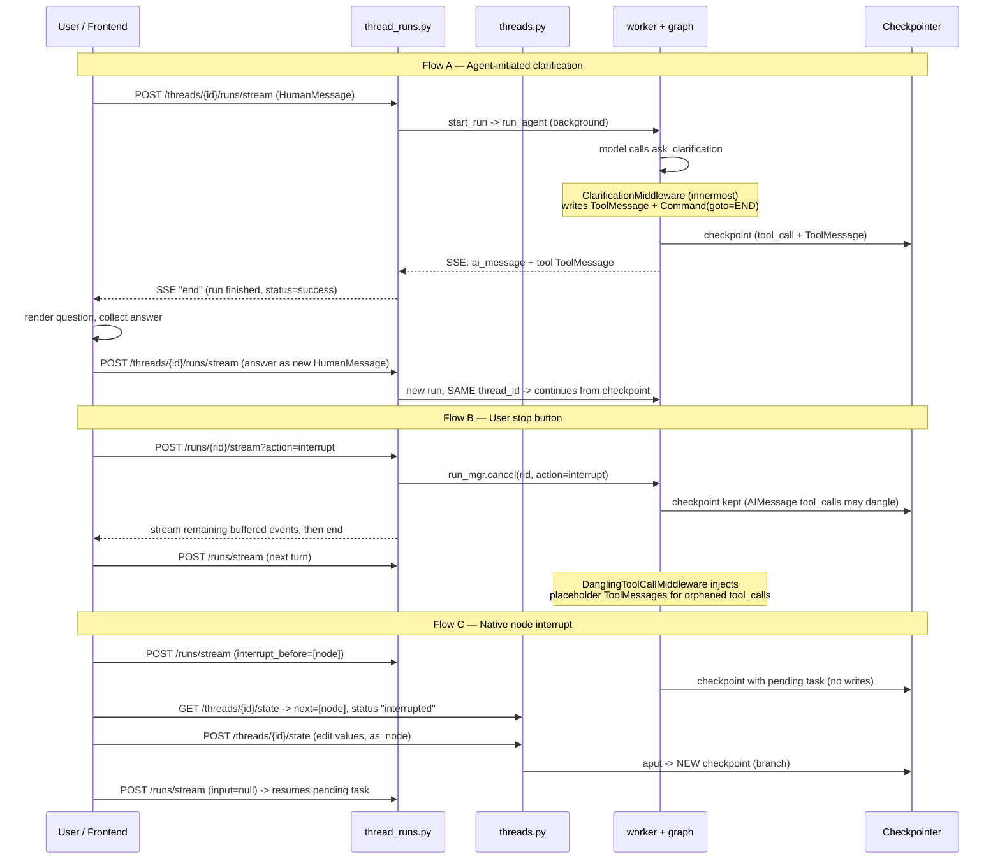
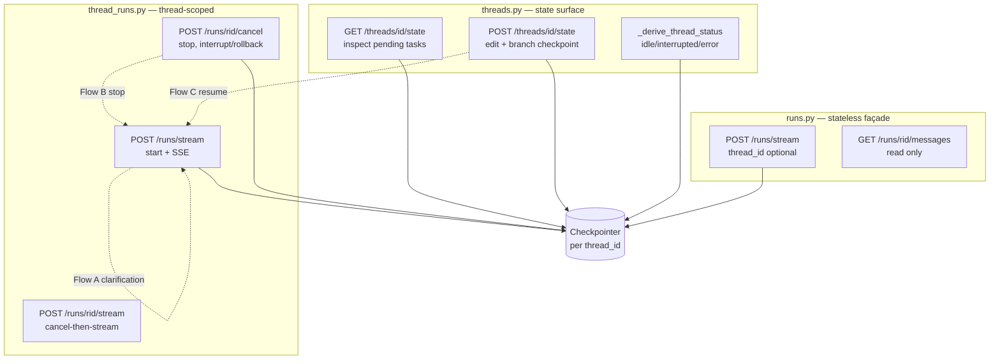

# Human-in-the-Loop (HITL) — Execution Flow

> Cross-cutting flow discovered during **Section 05** (Gateway API), spanning the
> `threads.py`, `thread_runs.py`, and `runs.py` routers plus the agent middleware chain.

## Purpose

DeerFlow has no dedicated "resume" endpoint. Human-in-the-loop is built on top of two
existing primitives: the **checkpointer** (state persisted per `thread_id`) and the
ordinary **"create a run"** path. A "pause" is just a run that ended while state still
has unfinished business; a "resume" is just _another run on the same `thread_id`_ that
picks up from the latest checkpoint. This note traces the three distinct HITL flows and
shows exactly which endpoints each one touches.

## Key Files

- `backend/app/gateway/routers/thread_runs.py` — thread-scoped run creation + the stop-button endpoints (`/runs/stream`, `/runs/{rid}/cancel`, `/runs/{rid}/stream`)
- `backend/app/gateway/routers/threads.py` — state inspection/editing (`GET`/`POST /threads/{id}/state`) and `_derive_thread_status` (the `"interrupted"` signal)
- `backend/app/gateway/routers/runs.py` — stateless façade over the same machinery (no `/state` endpoints)
- `backend/app/gateway/services.py` — `start_run` (fire-and-forget run launch) + `sse_consumer`
- `backend/packages/harness/deerflow/agents/middlewares/clarification_middleware.py` — `ask_clarification` → `Command(goto=END)` (Flow A)
- `backend/packages/harness/deerflow/agents/middlewares/dangling_tool_call_middleware.py` — repairs orphaned tool_calls after a user interrupt (Flow B)
- `backend/packages/harness/deerflow/runtime/runs/worker.py` — applies `interrupt_before` / `interrupt_after` to the graph (Flow C)

## Important Concepts

- **`thread_id` is the continuity key.** `thread_runs.py` puts it in the URL
  (`/api/threads/{id}/runs/...`); `runs.py` carries it in `config.configurable.thread_id`.
  Same thread → same checkpoint lineage → conversation continues.
- **The checkpointer is the backbone.** Final state and "where we paused" both live in the
  checkpoint, not in the `RunRecord`. `wait_run` / `stateless_wait` read final state straight
  from `checkpointer.aget_tuple`.
- **`Command(goto=END)` ≠ LangGraph `interrupt()`.** The clarification pause _ends the run
  cleanly_; it does not suspend a node mid-execution. Resume is "start a new run", not
  "send a resume Command".
- **`body.command` is dead on this path.** `RunCreateRequest` declares a `command` field for
  LangGraph-SDK wire compatibility, but `start_run` never reads it — DeerFlow does not use the
  native `Command(resume=...)` protocol. (See Open Questions.)
- **`_derive_thread_status`** returns `"interrupted"` when the checkpoint has pending tasks,
  `"error"` on a pending `__error__` write, else `"idle"` — this is how the UI knows a thread
  is waiting on a human (Flow C).

## Execution Flow

### Flow A — Agent-initiated clarification (the common case)

1. **Start:** `POST /api/threads/{id}/runs/stream` → `start_run` launches the background run; client streams SSE.
2. **Pause:** model calls `ask_clarification`. `ClarificationMiddleware` (pinned innermost) does **not** execute the tool — it writes a `ToolMessage` carrying the formatted question into state and returns `Command(goto=END)`. The run **ends normally**; SSE delivers the tool message then an `end` frame.
3. **Resume:** frontend renders the question, user answers, frontend **starts a new run** via the same `POST .../runs/stream` with the answer as the next `HumanMessage`. Same `thread_id` → the new run loads the prior checkpoint (already holding the tool_call + its ToolMessage), so history is valid and the agent continues.

Payoff: clarification needs **no special resume endpoint and no `Command` plumbing**.

### Flow B — User interrupts a running agent (the stop button)

1. **Stop:** `POST /api/threads/{id}/runs/{rid}/cancel` or `POST .../runs/{rid}/stream?action=interrupt`. The latter cancels _then_ streams remaining buffered events for a clean shutdown.
   - `action=interrupt` → stop, keep checkpoint (resumable). `action=rollback` → revert to the pre-run checkpoint.
2. **Dangling tool-call problem:** cancelling mid-flight can leave an `AIMessage` with `tool_calls` that have no matching `ToolMessage` — an invalid history most providers reject.
3. **Resume / repair:** on the next run (same `thread_id`), `DanglingToolCallMiddleware` injects placeholder `ToolMessage`s for the orphaned tool_calls so the conversation can legally continue.

### Flow C — Native node interrupts (the LangGraph-protocol path)

The only flow that touches `threads.py`'s state endpoints.

1. **Arm:** `POST .../runs/stream` with `interrupt_before` / `interrupt_after`. The worker applies them to the graph (`agent.interrupt_before_nodes = ...`). The graph halts before/after the node, leaving a **pending task** in the checkpoint.
2. **Inspect:** `GET /api/threads/{id}/state` returns `next` (pending task names) and `tasks`; `_derive_thread_status` reports `"interrupted"`.
3. **Edit (optional):** `POST /api/threads/{id}/state` merges `body.values` into channel values and writes a **new** checkpoint — it omits `checkpoint_id` so `aput` appends a fresh, branchable snapshot rather than editing in place; `as_node` stamps `metadata["writes"]` to attribute the edit.
4. **Resume:** start another run on the same thread (`input=null`); the graph executes the pending task from the (possibly edited) checkpoint.

### Where `runs.py` fits

`runs.py` (`POST /api/runs/stream`, `/wait`) is the **stateless façade**. Pass
`config.configurable.thread_id` and every flow above works identically (same checkpoint
lineage); omit it and it mints a fresh `thread_id`, so the run is one-shot and HITL-resume
is meaningless. It can _read_ a paused run's output via `/api/runs/{rid}/messages` but has
**no `/state` endpoints** — state inspection/editing (Flow C) lives only on `threads.py`.

## Architecture Diagram — which router owns which capability

## My Insights

- DeerFlow's HITL is a deliberate **simplification away from LangGraph's native interrupt/resume
  Command protocol** for the two most common cases. By modelling a pause as "end the run, persist
  state" and a resume as "start another run on the same thread", clarification and stop-button
  recovery reuse the _exact same_ `start_run` path as a normal turn. The only price is two small
  middlewares (`ClarificationMiddleware` to end cleanly, `DanglingToolCallMiddleware` to repair
  history) — far less surface area than threading `Command(resume=...)` through the whole stack.
- The native-interrupt path (Flow C) is retained for LangGraph-SDK fidelity and power users, and is
  the only one that needs `threads.py`'s `/state` endpoints. Notice the **router split mirrors the
  flow split**: ad-hoc HITL lives entirely in `thread_runs.py`; protocol HITL pulls in `threads.py`.
- **Append-only checkpoints** (`POST /state` omits `checkpoint_id`) mean every HITL edit is a new
  branchable snapshot, not a destructive edit — consistent with LangGraph's time-travel model and
  the `/history` endpoint.
- The unused `body.command` field is a small **protocol-mirror anti-corruption** artifact: the wire
  contract advertises a capability the server fulfils by a different mechanism.

## Open Questions

- `body.command` is declared on `RunCreateRequest` but never consumed by `start_run` — is native
  `Command(resume=...)` support planned, or is the field purely SDK-compat ballast? (Logged under
  Section 05 — `thread_runs.py` in `questions/open-questions.md`.)
- After a Flow A clarification ends with `goto=END`, what run **status** does the record carry —
  `success` or something HITL-specific? The frontend distinguishes "done" from "awaiting input"
  via the trailing `ask_clarification` ToolMessage, not the status. Verify in Section 07.
- Flow C resume with `input=null`: does `normalize_input(None) -> {}` correctly trigger a
  pending-task resume in `worker.astream`, or does an empty dict differ from `None` semantically
  for the graph? Verify in Section 07.

## Links to Related Sections

- [[05-api-endpoints-overview]] — the full endpoint index these flows draw from
- [[protocol-mirror-anti-corruption]] — the pattern behind the unused `command` field and LangGraph wire-compat
- [[09-middleware-pipeline]] — `ClarificationMiddleware` (pos last) and `DanglingToolCallMiddleware` (pos 4)
- [[07-langgraph-runtime]] — worker `astream`, checkpointer, run status semantics
