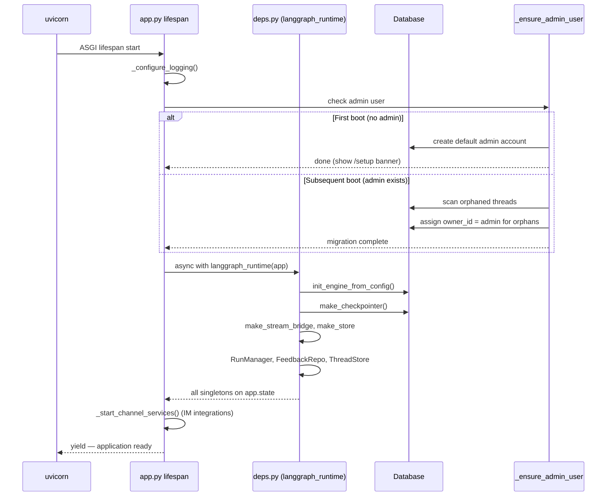
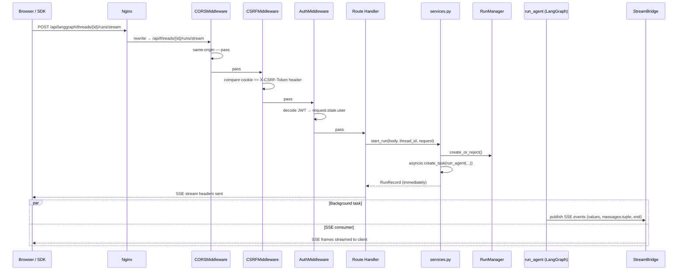

# Section 05 — Backend: Gateway API (FastAPI)

> **Covers**: `app.py`, `csrf_middleware.py`, `deps.py`, `services.py`, `path_utils.py`, `utils.py`, `config.py`
> **Excludes**: `routers/` (documented separately) · `auth/`, `auth_middleware.py`, `authz.py`, `langgraph_auth.py`, `internal_auth.py` (covered in Section 06)

---

## Overview

The Gateway is the single HTTP entry point for all DeerFlow operations. It runs as a FastAPI application on port 8001, reached from outside through Nginx on port 2026.

The Gateway has three simultaneous responsibilities:

1. **REST API** — serves all `/api/*` endpoints consumed by the frontend and IM channel clients.
2. **LangGraph-compatible runtime** — Nginx rewrites `/api/langgraph/*` to the Gateway's own `/api/*` routers, so the standard `langgraph-sdk` Python client and the frontend's `useStream` React hook work without modification against a non-standard server.
3. **Infrastructure host** — owns all runtime singletons (database sessions, checkpointer, stream bridge, run manager) and manages their full lifecycle.

### Layer Separation

The `app/gateway/` code sits in the **application layer** (`app.*`). It imports from the **harness package** (`deerflow.*`) but never the reverse. This one-way dependency boundary is enforced by CI:

```
app.gateway → deerflow.runtime, deerflow.agents, deerflow.config, ...
deerflow.* → (never imports app.*)
```

---

## Files Covered

| File                 | Lines | Role                                                                               |
| -------------------- | ----- | ---------------------------------------------------------------------------------- |
| `config.py`          | 27    | HTTP server settings (host, port, docs toggle)                                     |
| `app.py`             | ~380  | Application factory, startup/shutdown lifecycle, middleware stack, router mounting |
| `csrf_middleware.py` | ~260  | CSRF double-submit cookie protection + auth-path origin validation                 |
| `deps.py`            | ~262  | Runtime bootstrap (`langgraph_runtime`) + per-request dependency accessors         |
| `services.py`        | ~400  | Run lifecycle: SSE formatting, input normalization, config building, run dispatch  |
| `path_utils.py`      | 30    | Virtual → physical path resolution for file-serving endpoints                      |
| `utils.py`           | 7     | Log injection sanitizer                                                            |

---

## `config.py` — Gateway Server Settings

The simplest file in the gateway. Provides three deployment-time settings loaded from environment variables on first access (lazy singleton pattern).

```python
class GatewayConfig(BaseModel):
    host: str = "0.0.0.0"   # env: GATEWAY_HOST
    port: int = 8001          # env: GATEWAY_PORT
    enable_docs: bool = True  # env: GATEWAY_ENABLE_DOCS
```

**Why these are env-driven (not in `config.yaml`)**: `config.yaml` governs agent and model behaviour — things a developer configures once. `GatewayConfig` governs the HTTP server itself — things that vary between environments (local dev vs. Docker vs. production). Keeping them separate lets Ops change binding parameters without touching agent config.

**`GATEWAY_ENABLE_DOCS=false`**: Disables `/docs`, `/redoc`, and `/openapi.json`. The `create_app()` factory in `app.py` reads this and passes `docs_url=None` to the FastAPI constructor. Useful in production to reduce attack surface.

---

## `app.py` — Application Factory and Lifecycle

### The Application Factory Pattern

```python
def create_app() -> FastAPI:
    config = get_app_config()
    gateway_cfg = get_gateway_config()
    app = FastAPI(lifespan=lifespan, docs_url=..., ...)
    # register middleware, mount routers
    return app

app = create_app()  # module-level singleton — uvicorn entry point
```

Two uses of this factory:

- **Production**: `uvicorn app.gateway.app:app` uses the module-level singleton.
- **Tests**: Each test suite calls `create_app()` to get an isolated FastAPI instance with no shared module state.

### Startup/Shutdown — ASGI Lifespan

DeerFlow uses the modern ASGI lifespan protocol (a single async generator) rather than the older `@app.on_event("startup")` / `@app.on_event("shutdown")` hooks:

```python
@asynccontextmanager
async def lifespan(app: FastAPI):
    # ── STARTUP ──────────────────────────────────────
    _configure_logging(config)
    await _ensure_admin_user(app)          # first-boot setup / orphan migration
    async with langgraph_runtime(app):     # bootstrap all infrastructure singletons
        await _start_channel_services(app) # IM integrations (Feishu, Slack, etc.)
        yield  # ← application is now serving requests
    # ── SHUTDOWN (runs after yield) ──────────────────
    await asyncio.wait_for(
        _stop_channel_services(app),
        timeout=_SHUTDOWN_HOOK_TIMEOUT_SECONDS,  # 5.0 s
    )
```

Everything before `yield` runs at startup; everything after runs at shutdown. The `async with langgraph_runtime(app)` block is the largest startup piece — it initialises the entire infrastructure layer (see `deps.py`).

**Why the shutdown timeout (`5.0 s`)**: Uvicorn sends SIGTERM and then force-kills workers that don't exit within the shutdown window. Without a timeout, a stuck IM channel teardown (e.g., a platform API call that hangs) would block the entire worker process. The `TimeoutError` is silently swallowed — channel state may not flush cleanly, but the process exits cleanly. In-flight IM messages may be lost; the expectation is that platform retry mechanisms handle re-delivery.

### First-Boot vs. Subsequent-Boot: `_ensure_admin_user()`

This function runs on every boot but branches on state:

**Phase 1 — first ever boot** (no admin user in the DB):

1. Generates a default admin account.
2. Logs the credentials to stdout for the operator to capture.
3. Returns. The `/setup` banner prompts the operator to change the password.

**Phase 2 — subsequent boots** (admin already exists):
Runs the **orphan migration** — threads created before auth was enabled have `owner_id = None`. The migration claims them on behalf of the admin user:

```python
async def _iter_store_items(store, namespace, *, page_size: int = 500):
    """Paginate through all items, terminating early on a short page."""
    offset = 0
    while True:
        page = await store.asearch(namespace, ..., offset=offset, limit=page_size)
        for item in page:
            yield item
        if len(page) < page_size:  # short page = last page
            break
        offset += len(page)
```

The short-page termination avoids an extra empty `asearch()` round-trip on every paginated scan. When the last page has fewer items than `page_size`, we know there is no next page.

> **Open question**: The migration re-runs on every boot with no "already done" guard. On a large deployment with thousands of threads, this cold scan runs at every restart. A one-time migration flag would eliminate this cost.

### Logging Configuration: `_configure_logging()`

```python
def apply_logging_level(name: str, level: int) -> None:
    logger = logging.getLogger(name)
    logger.setLevel(level)
    for handler in logger.handlers:
        if handler.level > level:
            handler.setLevel(level)  # lower only — never raise
```

Python's logging has **two gatekeeping levels**: the logger level and each handler's level. Both must pass for a message to be emitted. This function adjusts the handler levels **downward only** when increasing verbosity. This prevents DeerFlow's debug configuration from inadvertently silencing third-party library handlers that were intentionally set to a high threshold. The rule: "we can open a door wider, but we won't close a door someone else set open."

### Middleware Stack

```python
# Registration order (add_middleware appends to the FRONT of the stack):
app.add_middleware(AuthMiddleware, ...)    # registered last → innermost
app.add_middleware(CSRFMiddleware, ...)    # registered second → middle
app.add_middleware(CORSMiddleware, ...)    # registered first → outermost
```

**FastAPI stacks middleware in reverse**: `add_middleware()` prepends each new middleware to the ASGI chain, so the last registered call becomes the innermost wrapper. The actual **request processing order** is:

```
Browser → CORSMiddleware → CSRFMiddleware → AuthMiddleware → Route Handler
                                                          ← Response
```

This order is intentional and must not be changed:

1. **CORS first (outermost)**: Handles browser preflight `OPTIONS` requests immediately. A rejected CORS request never reaches CSRF or auth logic.
2. **CSRF second**: Validates the double-submit token (see `csrf_middleware.py`). Auth paths are exempt here.
3. **Auth third (innermost)**: Decodes the session JWT cookie, resolves the user record, and stamps `request.state.user`. Route handlers read auth state from there.

**CORS and CSRF use the same origin list**:

```python
cors_origins = sorted(get_configured_cors_origins())
app.add_middleware(CORSMiddleware, allow_origins=cors_origins, ...)
app.add_middleware(CSRFMiddleware, allowed_origins=cors_origins, ...)
```

Both read from `GATEWAY_CORS_ORIGINS`. The getter lives in `csrf_middleware.py` and is imported by `app.py`. Co-locating it there means there is one definition of "what origins are trusted" — the CORS allowlist and the CSRF origin allowlist can never drift apart.

---

## `csrf_middleware.py` — CSRF Protection

### Strategy: Double Submit Cookie

DeerFlow uses the **double-submit cookie** pattern — a stateless CSRF defence that requires no server-side session state:

| Step      | Actor               | Action                                                                                                                                     |
| --------- | ------------------- | ------------------------------------------------------------------------------------------------------------------------------------------ |
| 1. Issue  | Server              | On every response, set a `X-CSRF-Token` cookie. Crucially: `httponly=False`.                                                               |
| 2. Mirror | Browser/frontend    | On every state-changing request (POST, PUT, DELETE, PATCH), read the cookie and copy its value into the `X-CSRF-Token` request **header**. |
| 3. Verify | Server (middleware) | Compare cookie value == header value using timing-safe equality.                                                                           |

**Why this defeats CSRF**: The Same-Origin Policy (SOP) prevents malicious cross-origin pages from reading cookies from the victim's domain. An attacker can forge a cross-origin form POST — the browser will attach the victim's cookies — but the attacker cannot read the cookie to copy it into the custom header. No header match → request rejected.

**Why `httponly=False` is correct here**: The CSRF cookie _must_ be readable by JavaScript so the frontend can copy it into the request header. This is the only intentional `httponly=False` cookie in DeerFlow; security depends entirely on SOP, not on protecting cookie content.

**Token entropy**: `CSRF_TOKEN_LENGTH = 64` bytes = 512 bits of entropy, well above OWASP's 128-bit minimum requirement.

### Auth Endpoints — Origin Validation Instead

Login, register, and setup endpoints cannot use the double-submit pattern: no CSRF token exists before a session is established. These paths are listed in an exemption set:

```python
_AUTH_EXEMPT_PATHS: frozenset[str] = frozenset({
    "/api/v1/auth/login",
    "/api/v1/auth/register",
    "/api/v1/auth/setup",
    "/api/v1/auth/refresh",
    # ...
})
```

For exempt paths, the middleware falls back to **Origin header validation**: it checks that the request's `Origin` header matches the configured allowed origins. This protects against **login CSRF / session fixation**: an attacker's page can POST credentials to DeerFlow using the victim's browser, but the browser will send the attacker's `Origin` — which won't match.

> **Open question**: `should_check_csrf` includes a hard-coded exemption for `/api/v1/auth/me` even though it's listed as a POST. It's unclear whether `auth/me` is actually a POST in the router today, or a vestigial exemption from an older API design.

### CSRF Check Decision Tree

```
Incoming request
  │
  ├─ Method is GET / HEAD / OPTIONS?
  │    └─ Skip (safe methods cannot change state)
  │
  ├─ Path matches _AUTH_EXEMPT_PATHS?
  │    └─ Origin check only (double-submit cookie not yet available)
  │
  ├─ No Origin header?
  │    └─ Allow (non-browser client: curl, mobile SDK, server-to-server)
  │         Browsers always send Origin on cross-origin requests.
  │         Absence implies same-origin browser or non-browser client.
  │
  ├─ Origin matches allowed origins list?
  │    └─ Allow (same-origin browser request — no forgery possible)
  │
  └─ Origin present but not in allowlist?
       ├─ CSRF cookie present AND matches X-CSRF-Token header?
       │    └─ Allow
       └─ Token missing or mismatch?
            └─ 403 Forbidden
```

### Origin Normalization

```python
def _normalize_origin(origin: str) -> str | None:
    # Rejects anything with a path, query, credentials, or non-http scheme.
    # Returns None if the string doesn't look like a browser Origin header.
```

A browser Origin header is always `scheme://host[:port]` — no path, no query string, no userinfo. The normalizer explicitly rejects URL-shaped strings (`http://example.com/path`) and credentialed strings (`http://user@example.com`). Real browsers never produce these forms; their presence signals a header injection attempt.

### Request Scheme and Host Detection

`_request_scheme()` checks the `Forwarded` header (RFC 7239) first, falls back to `X-Forwarded-Proto`, then falls back to `request.url.scheme`.

`_request_host()` checks `X-Forwarded-Host`, then falls back to `request.url.netloc`.

> **Note on DeerFlow's Nginx**: Neither `docker/nginx/nginx.conf` nor `nginx.local.conf` sets an `X-Forwarded-Host` header. Both use `proxy_set_header Host $http_host`, which preserves the client's original `Host` directly. The `X-Forwarded-Host` branch exists for deployments behind other reverse proxies (HAProxy, Traefik, etc.) but is never exercised in DeerFlow's own Docker setup.

### Timing-Safe Comparison

```python
if not secrets.compare_digest(cookie_token, header_token):
    return False
```

`secrets.compare_digest()` runs in constant time regardless of where the two strings first differ. A naive `==` comparison short-circuits on the first differing character, which in theory allows a timing side-channel attack: an adversary who can measure response latency could reconstruct the token one byte at a time. `compare_digest` eliminates that channel.

---

## `deps.py` — Dependency Injection

### Two Distinct Roles in One File

`deps.py` serves two completely different purposes that are easy to conflate:

| Role                      | Function                                  | Called when                         |
| ------------------------- | ----------------------------------------- | ----------------------------------- |
| **Runtime bootstrap**     | `langgraph_runtime(app)`                  | Once at startup from `app.py`       |
| **Per-request accessors** | `get_stream_bridge`, `get_run_manager`, … | Every HTTP request, via `Depends()` |

### `langgraph_runtime()` — Bootstrap Sequence

```python
@asynccontextmanager
async def langgraph_runtime(app: FastAPI) -> AsyncGenerator[None, None]:
    async with AsyncExitStack() as stack:
        # 1. Stream bridge (pub/sub event bus between agent tasks and SSE consumers)
        app.state.stream_bridge = await stack.enter_async_context(make_stream_bridge(config))

        # 2. Database engine (MUST be before checkpointer — tables may not exist yet)
        await init_engine_from_config(config.database)

        # 3. LangGraph checkpointer (reads/writes agent state to DB)
        app.state.checkpointer = await stack.enter_async_context(make_checkpointer(config))

        # 4. LangGraph store (cross-thread key-value memory — optional)
        app.state.store = await stack.enter_async_context(make_store(config))

        # 5. Session factory (shared by all repositories — one DB, no confusion)
        sf = get_session_factory()
        if sf is not None:
            app.state.run_store    = RunRepository(sf)
            app.state.feedback_repo = FeedbackRepository(sf)
        else:
            app.state.run_store    = MemoryRunStore()   # in-memory fallback
            app.state.feedback_repo = None

        # 6. Thread metadata store (SQL or LangGraph-store-backed)
        app.state.thread_store = make_thread_store(sf, app.state.store)

        # 7. Run event store (JSONL files or DB — configured via run_events section)
        app.state.run_event_store = make_run_event_store(run_events_config)

        # 8. Run manager (coordinates concurrent runs, holds run records)
        app.state.run_manager = RunManager(store=app.state.run_store)

        try:
            yield
        finally:
            await close_engine()
```

**Ordering constraint**: DB engine must initialise before the checkpointer. The checkpointer may need to create or migrate schema tables on its first operation, which requires the engine to already exist.

**No-DB fallback**: If `get_session_factory()` returns `None` (no `DATABASE_URL` configured), the system uses `MemoryRunStore`. Runs are lost on restart. This is the expected behaviour in local development with no database configured.

**`AsyncExitStack`**: All resources are registered with the stack via `enter_async_context()`. On exit — whether clean or due to an exception mid-startup — the stack tears everything down in reverse registration order. This prevents resource leaks even when initialization fails partway through.

### The `_require` Factory

```python
def _require(attr: str, label: str) -> Callable[[Request], T]:
    """Generate a FastAPI dependency function that reads app.state.<attr> or raises 503."""
    def dep(request: Request) -> T:
        val = getattr(request.app.state, attr, None)
        if val is None:
            raise HTTPException(status_code=503, detail=f"{label} not available")
        return cast(T, val)
    dep.__name__ = dep.__qualname__ = f"get_{attr}"  # FastAPI uses this for /docs display
    return dep

get_stream_bridge  = _require("stream_bridge",  "Stream bridge")
get_run_manager    = _require("run_manager",     "Run manager")
get_checkpointer   = _require("checkpointer",    "Checkpointer")
get_run_event_store = _require("run_event_store", "Run event store")
get_feedback_repo  = _require("feedback_repo",   "Feedback")
get_run_store      = _require("run_store",        "Run store")
```

This factory eliminates boilerplate: 6 typed FastAPI dependency functions from one template, all with identical 503-on-missing behaviour. The name assignment (`dep.__name__`) is not cosmetic — FastAPI uses the function's `__name__` when building the OpenAPI schema and when displaying dependencies in `/docs`.

**503 vs. 500**: HTTP 503 "Service Unavailable" is the correct status for "dependency not yet initialized". It signals to load balancers and callers that the service is temporarily unavailable (retry later), not that the server has a permanent bug (500).

### `get_store` — The One Optional Dependency

```python
def get_store(request: Request):
    return getattr(request.app.state, "store", None)  # Returns None, never raises 503
```

The LangGraph cross-thread store is the only genuinely optional singleton. The system runs without it — you lose persistent memory across threads, but everything else works. `get_store` is the only getter that doesn't use `_require`, precisely because `None` is a valid return value here.

### `get_run_context()` — Parameter Object Pattern

```python
def get_run_context(request: Request) -> RunContext:
    return RunContext(
        checkpointer    = get_checkpointer(request),
        store           = get_store(request),
        event_store     = get_run_event_store(request),
        run_events_config = getattr(config, "run_events", None),
        thread_store    = get_thread_store(request),
        app_config      = config,
    )
```

`RunContext` is a parameter object — a "value bag" that bundles 5+ infrastructure dependencies so that `run_agent()` receives one argument instead of an ever-growing kwarg list. Without this pattern, every new infrastructure dependency would require changing the signature of every call site. The pattern is analogous to Django's `HttpRequest` or Python's `logging.LogRecord`.

### Auth Singletons — Module-Level Globals

```python
_cached_local_provider: LocalAuthProvider | None = None
_cached_repo: SQLiteUserRepository | None = None
```

Auth singletons are **module-level globals**, not stored on `app.state`. This is a deliberate design choice:

- They have **no async teardown** (no database connection to close, just Python objects).
- They must be accessible from **non-request contexts** — specifically from `_ensure_admin_user()` in `app.py`, which runs during startup before any HTTP request exists and has no `Request` object to inject.

> **Test isolation risk**: These globals survive across `TestClient` instances within the same test process. If two test cases configure different session factories, the second may use the first test's cached repository. Tests that rely on a clean auth state should reset these globals between runs.

### Token Version Revocation

```python
if user.token_version != payload.ver:
    raise HTTPException(401, detail="Token revoked (password changed)")
```

When a user changes their password, `token_version` is incremented in the database. All pre-existing JWTs still carry the old `ver` claim. They fail this check on the next request — instant revocation across all sessions without maintaining a token blacklist. The trade-off: token invalidation is tightly coupled to password changes only; there is no general "log out all devices" mechanism beyond changing the password.

---

## `services.py` — Run Lifecycle Service Layer

### Role and Position

`services.py` sits between the HTTP routers and the LangGraph runtime:

```
Router (HTTP validation) → services.py (business logic) → run_agent() (LangGraph)
```

Routers validate HTTP concerns: authentication, request parsing, response formatting. `services.py` handles the run lifecycle: translating the HTTP request body into the exact shape `run_agent()` expects, managing the async task, and streaming events back to the client.

### SSE Formatting — `format_sse()`

```python
def format_sse(event: str, data: Any, *, event_id: str | None = None) -> str:
    payload = json.dumps(data, default=str, ensure_ascii=False)
    parts = [f"event: {event}", f"data: {payload}"]
    if event_id:
        parts.append(f"id: {event_id}")
    parts.append(""); parts.append("")
    return "\n".join(parts)
```

**Field order is wire-format-mandated**: `event:` → `data:` → `id:`. This is the order the LangGraph Platform uses in its SSE wire format, consumed by the `langgraph-sdk` Python decoder and the frontend's `useStream` React hook. Swapping `data` and `id` breaks the decoder silently — it produces malformed events rather than an error.

### Input Normalization — `normalize_input()`

Converts the LangGraph Platform HTTP wire format to the internal LangChain message format:

```python
# Wire format (from LangGraph Platform / SDK):
{"messages": [{"role": "user", "content": "Hello"}]}

# Internal LangChain state dict format:
{"messages": [HumanMessage(content="Hello")]}
```

```python
def normalize_input(raw_input):
    for msg in messages:
        role = msg.get("role", msg.get("type", "user"))
        if role in ("user", "human"):
            converted.append(HumanMessage(content=content))
        else:
            # [DL-WARN] Non-user types silently become HumanMessage — TODO
            converted.append(HumanMessage(content=content))
```

**Known limitation**: Non-user message types (system, ai, tool) are silently folded into `HumanMessage` with a TODO comment. This is harmless today because the current API only receives single human messages from the frontend. However, it would produce incorrect behaviour if a client sent a multi-turn conversation history containing mixed message types (e.g., a resumption scenario with prior AI messages).

### `_CONTEXT_CONFIGURABLE_KEYS` — The LangGraph Compatibility Shim

```python
_CONTEXT_CONFIGURABLE_KEYS: frozenset[str] = frozenset({
    "model_name", "mode", "thinking_enabled", "reasoning_effort",
    "is_plan_mode", "subagent_enabled", "max_concurrent_subagents",
    "agent_name", "is_bootstrap",
})
```

**Why this exists — the LangGraph 1.1.9 breaking change**: Before 1.1.9, keys in `config["configurable"]` were automatically mirrored into `runtime.context`. After the upgrade, these are separate containers with no automatic fallback. DeerFlow code written against the old behaviour (particularly the `setup_agent` tool, which reads `runtime.context["agent_name"]`) silently broke — it read `None` and wrote SOUL.md to the wrong directory.

**The fix — `merge_run_context_overrides()`**: Writes whitelisted keys into _both_ `config["configurable"]` and `config["context"]` so consumers of either container both work:

```python
def merge_run_context_overrides(config, context):
    configurable    = config.setdefault("configurable", {})
    runtime_context = config.setdefault("context", {})
    for key in _CONTEXT_CONFIGURABLE_KEYS:
        if key in context:
            configurable.setdefault(key, context[key])     # legacy consumers
            runtime_context.setdefault(key, context[key])  # LangGraph 1.1+ consumers
```

`setdefault` (not direct assignment) means explicitly set values in the existing config are never overridden by `body.context`.

**Security property of the whitelist**: Unknown keys sent in `body.context` — including `thread_id`, `user_id`, or any other field — are simply dropped. A client cannot inject system values through `body.context`.

### `build_run_config()` — Context vs. Configurable Mode

LangGraph >= 0.6.0 introduced `config["context"]` as the primary runtime container. Sending both `"configurable"` and `"context"` in the same request is a protocol violation that LangGraph rejects.

`build_run_config()` enforces a clear precedence rule: **if the caller sends `context`, use context mode exclusively and discard `configurable`**:

```python
if "context" in request_config:
    if "configurable" in request_config:
        logger.warning("client sent both 'context' and 'configurable'; preferring 'context'")
    config["context"] = dict(request_config["context"] or {})
else:
    configurable = {"thread_id": thread_id}
    configurable.update(request_config.get("configurable", {}))
    config["configurable"] = configurable
```

**Custom agent injection**: When `assistant_id` is not `"lead_agent"` or `None`, the normalized ID is injected as `agent_name` into whichever container is active. This is what `make_lead_agent()` reads to load the correct SOUL.md and per-agent configuration.

```python
normalized = assistant_id.strip().lower().replace("_", "-")
if re.fullmatch(r"[a-z0-9-]+", normalized):
    target["agent_name"] = normalized
```

### `resolve_agent_factory()` — One Graph, All Agents

```python
def resolve_agent_factory(assistant_id: str | None):
    from deerflow.agents.lead_agent.agent import make_lead_agent
    return make_lead_agent
```

**Always returns `make_lead_agent`**, regardless of `assistant_id`. There is no separate LangGraph graph compiled per custom agent. All custom agents run through the same `lead_agent` graph; they differ only in the `agent_name` key present in their run config. `make_lead_agent` reads `agent_name` at construction time to load the matching SOUL.md and per-agent configuration. Custom agents are a _configuration variation_, not a _code variation_.

### `inject_authenticated_user_context()` — Security Boundary

```python
def inject_authenticated_user_context(config, request):
    user = getattr(request.state, "user", None)     # set by AuthMiddleware
    user_id = getattr(user, "id", None)
    runtime_context = config.setdefault("context", {})
    runtime_context["user_id"] = str(user_id)
```

**Critical security property**: `user_id` is always sourced from `request.state.user`, which is set by `AuthMiddleware` after validating the session JWT cookie — server-side state that the client cannot influence. It is never read from `body.context` or any client-provided field. A malicious client cannot spoof another user's identity by injecting `"user_id"` into the request body.

### `start_run()` — Fire-and-Forget Dispatch

```python
async def start_run(body, thread_id, request) -> RunRecord:
    # 1. Validate model_name against config allowlist (if provided in body.context)
    # 2. run_mgr.create_or_reject() → RunRecord  (raises 409 on conflict, 501 on unsupported strategy)
    # 3. Upsert thread metadata (ensure thread appears in /threads/search)
    # 4. Resolve agent factory, normalize input, build config
    # 5. Merge context overrides + inject authenticated user
    # 6. asyncio.create_task(run_agent(...))  ← schedules background task
    record.task = task
    return record                            ← returns immediately, before run completes
```

`start_run()` returns the `RunRecord` as soon as the background task is scheduled. Actual agent execution runs asynchronously. The caller subscribes to events via `sse_consumer()` in a separate async generator — the run and the HTTP response are fully decoupled. This allows:

- Multiple clients to subscribe to the same run.
- A client to disconnect and reconnect without cancelling the run.
- The HTTP response headers to be sent before the run completes.

**Model allowlist validation**:

```python
if model_name:
    resolved = app_config.get_model_config(model_name)
    if resolved is None:
        raise HTTPException(400, detail=f"Model {model_name!r} is not in the configured model allowlist")
```

> **Known bypass**: `model_name` is validated only when supplied through `body.context`. A client that injects `model_name` directly into `body.config.configurable` bypasses this check entirely.

### `sse_consumer()` — Streaming Events to the Client

```python
async def sse_consumer(bridge, record, request, run_mgr):
    last_event_id = request.headers.get("Last-Event-ID")  # reconnect support
    try:
        async for entry in bridge.subscribe(record.run_id, last_event_id=last_event_id):
            if await request.is_disconnected():
                break
            if entry is HEARTBEAT_SENTINEL:
                yield ": heartbeat\n\n"   # SSE comment — resets proxy idle timers
                continue
            if entry is END_SENTINEL:
                yield format_sse("end", None, event_id=...)
                return
            yield format_sse(entry.event, entry.data, event_id=entry.id or None)
    finally:
        if record.on_disconnect == DisconnectMode.cancel:
            await run_mgr.cancel(record.run_id)
```

**`Last-Event-ID` — reconnect resumability**: If the browser reconnects after a network drop and includes this header, `bridge.subscribe()` replays all events published after that event ID. The client resumes mid-stream without restarting the run. This is a standard SSE feature (RFC 8895).

**Heartbeats**: The `": heartbeat"` line is an SSE comment (RFC 6455). SSE parsers ignore it, but it resets the idle-connection timer of any intervening proxy or CDN. Without heartbeats, a load balancer with a 30–60s idle timeout would close the connection during a long agent run before the first event is emitted.

**`on_disconnect` semantics** (set by the client via `on_disconnect` field in the run request):

- `"cancel"`: When the client disconnects, `run_mgr.cancel(record.run_id)` aborts the background agent task.
- `"continue"` (default): Let the run complete; events are discarded since no subscriber remains.

---

## `path_utils.py` — Virtual Path Resolution

```python
def resolve_thread_virtual_path(thread_id: str, virtual_path: str) -> Path:
    try:
        return get_paths().resolve_virtual_path(thread_id, virtual_path, user_id=get_effective_user_id())
    except ValueError as e:
        status = 403 if "traversal" in str(e) else 400
        raise HTTPException(status_code=status, detail=str(e))
```

A thin adapter between file-serving routers and `deerflow.config.paths`, which holds the actual resolution logic. The agent sees a virtual filesystem (`/mnt/user-data/outputs/file.txt`); this function translates that to the actual host path (`backend/.deer-flow/users/{user_id}/threads/{thread_id}/user-data/outputs/file.txt`).

**403 vs. 400 for traversal**: A path traversal attempt (e.g., `../../etc/passwd`) returns 403 Forbidden, not 400 Bad Request. This is a deliberate semantic choice — "you are trying to access a resource you're not permitted to access" is different from "your request was malformed". 403 also signals to security scanners that the server detected the attempt.

---

## `utils.py` — Log Injection Protection

```python
def sanitize_log_param(value: str) -> str:
    return value.replace("\n", "").replace("\r", "").replace("\x00", "")
```

Strips newlines and null bytes from user-controlled strings before they are written to the log. Without this, an attacker sending a carefully crafted `thread_id` like `abc\nINFO fake-admin-password: secret` could inject fake log entries that appear legitimate to monitoring systems or log parsers.

Used throughout the gateway wherever a user-controlled string (thread IDs, filenames, parameter values) appears in a `logger.*()` call.

---

## Architecture Diagrams

### Startup Sequence



### Request Lifecycle (State-Changing Request)



### Middleware Wrap Order

```
Registration (add_middleware call order):
  1. add_middleware(AuthMiddleware)    ← registered last  → innermost wrapper
  2. add_middleware(CSRFMiddleware)    ← registered second → middle wrapper
  3. add_middleware(CORSMiddleware)    ← registered first  → outermost wrapper

Actual request traversal order:
  Request:   CORSMiddleware → CSRFMiddleware → AuthMiddleware → Route Handler
  Response:  Route Handler  → AuthMiddleware → CSRFMiddleware → CORSMiddleware
```

---

## Key Design Insights

### 1. ASGI Lifespan over Event Hooks

The `lifespan` async generator puts startup and shutdown in a single function. Resource pairing is visually obvious (`async with langgraph_runtime` → starts on enter, cleans up on exit), and cleanup is guaranteed even when initialization fails partway through.

### 2. `app.state` vs. Module Globals for Singletons

Infrastructure singletons with async teardown (stream bridge, run manager, checkpointer) live on `app.state` — they are scoped to the FastAPI application instance and torn down by `langgraph_runtime`'s `AsyncExitStack`. Auth singletons with no teardown (`_cached_local_provider`) live as module globals — they need to be reachable before any HTTP request exists (during `_ensure_admin_user` at startup).

### 3. Middleware Order is Load-Bearing

FastAPI's reverse-stack `add_middleware` behaviour means registration order and execution order are opposite. CORS must be outermost (handles preflight before auth), CSRF second, Auth innermost. Changing this order breaks security properties.

### 4. Dual-Write as a Migration Shim

`_CONTEXT_CONFIGURABLE_KEYS` writing to both `configurable` and `context` is pure compatibility scaffolding introduced by the LangGraph 1.1.9 breaking change. It is not a permanent design — once all consumers migrate to reading `runtime.context`, the `configurable` write half can be removed.

### 5. Fire-and-Forget + SSE Subscription Decoupling

`start_run()` returns a `RunRecord` immediately after scheduling `run_agent()` as a background task. The SSE consumer subscribes separately via `bridge.subscribe()`. This decoupling enables: (a) the HTTP response to start streaming before any agent output is available, (b) multiple clients to subscribe to the same run, (c) reconnect resumability via `Last-Event-ID`.

### 6. All Custom Agents Share One Graph

`resolve_agent_factory()` always returns `make_lead_agent`. Custom "agents" in DeerFlow are config differences (different `agent_name` → different SOUL.md), not graph differences. This keeps the runtime simple: one graph to compile, one graph to checkpoint, one graph to debug.

### 7. Timing-Safe CSRF and Constant-Time Equality

`secrets.compare_digest()` prevents timing side-channel attacks on the CSRF token. This matters because the CSRF token comparison is the only user-controlled string comparison in a security-critical path — it is exactly the kind of comparison that timing attacks target.

---

## Open Questions

Full list in `notes/questions/open-questions.md`. Highlights:

| Question                                                                    | Why It Matters                                                               |
| --------------------------------------------------------------------------- | ---------------------------------------------------------------------------- |
| Orphan migration re-runs on every boot                                      | On large deployments, a full thread scan at every restart could be slow      |
| `auth/me` POST CSRF exemption — vestigial or intentional?                   | Could be an unneeded exemption silently skipping CSRF validation             |
| Auth module globals survive across `TestClient` instances                   | Could cause cross-test state pollution in unit tests                         |
| `normalize_input` silently converts all non-user messages to `HumanMessage` | Would produce wrong behaviour on multi-turn history with mixed message types |
| Model allowlist bypass via `body.config.configurable.model_name`            | Validation only checks `body.context`; `configurable` path is unguarded      |
| Shutdown timeout `TimeoutError` swallowed — impact on in-flight IM messages | Platform retry semantics are assumed but not verified                        |
