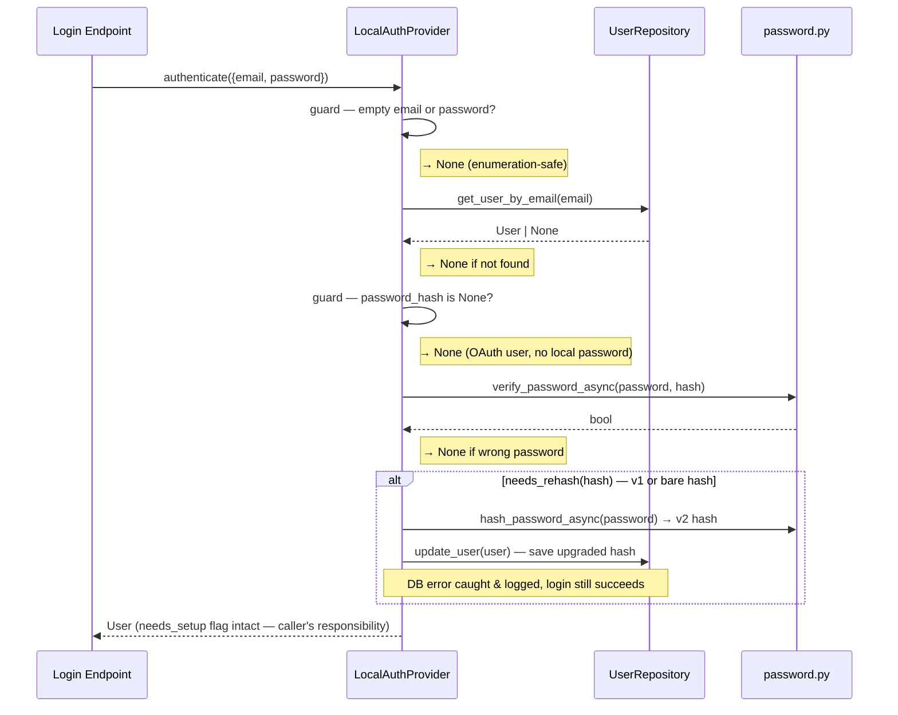
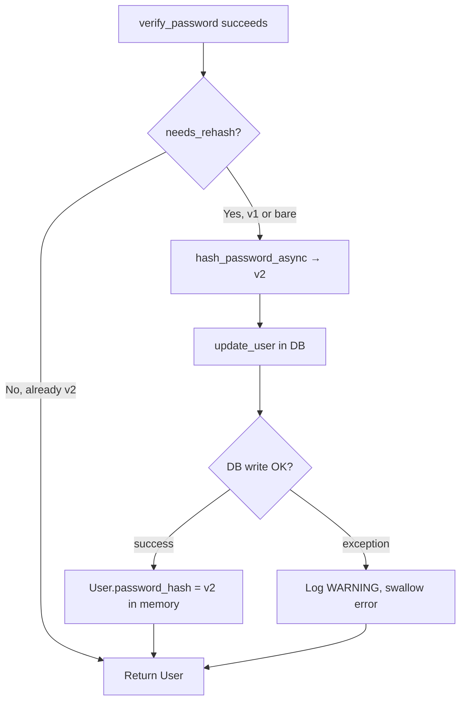
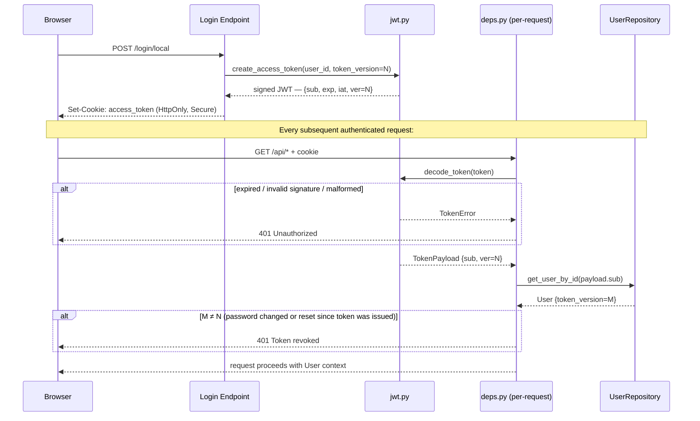
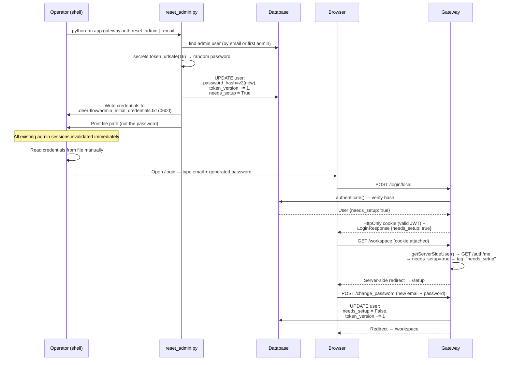

# Section 06a — Backend: Auth Internals (`auth/`)

> **Covers**: `auth/errors.py` · `auth/config.py` · `auth/models.py` · `auth/password.py` · `auth/jwt.py` · `auth/credential_file.py` · `auth/repositories/base.py` · `auth/repositories/sqlite.py` · `auth/providers.py` · `auth/local_provider.py` · `auth/reset_admin.py`
> **Excludes**: `auth_middleware.py` · `langgraph_auth.py` · `authz.py` · `internal_auth.py` (covered in Section 06b)

---

## Overview

The `auth/` folder is the identity machinery of the Gateway API. It handles the full local email/password authentication lifecycle from the inside out — error vocabulary, configuration, data shapes, password hashing, JWT token management, user storage, and the authentication provider abstraction.

The design follows a strict layered dependency order:

```
errors → config → models → password → jwt
      → credential_file
      → repositories/base → repositories/sqlite
      → providers → local_provider
      → reset_admin (CLI, depends on most of the above)
```

Nothing in this folder imports from `auth_middleware.py`, `authz.py`, or any other Gateway enforcement layer. The auth machinery produces and validates identity; enforcement lives outside.

---

## Files

| File                     | Role                                                                                     |
| ------------------------ | ---------------------------------------------------------------------------------------- |
| `errors.py`              | Typed error enums (`AuthErrorCode`, `TokenError`) and `AuthErrorResponse` Pydantic model |
| `config.py`              | `AuthConfig` — JWT secret bootstrap with auto-generate + persist logic                   |
| `models.py`              | `User` (internal) and `UserResponse` (public-safe) Pydantic models                       |
| `password.py`            | Versioned bcrypt hashing — v1 (plain), v2 (SHA-256 pre-hash) + async wrappers            |
| `jwt.py`                 | Token creation (`create_access_token`) and validation (`decode_token`)                   |
| `credential_file.py`     | Writes admin credentials to a `0600` file for operator recovery                          |
| `repositories/base.py`   | `UserRepository` abstract interface + `UserNotFoundError`                                |
| `repositories/sqlite.py` | `SQLAlchemyUserRepository` — works with SQLite and PostgreSQL                            |
| `providers.py`           | `AuthProvider` abstract base class                                                       |
| `local_provider.py`      | Concrete email/password provider — orchestrates repo, hashing, and JWT                   |
| `reset_admin.py`         | Operator CLI for admin account recovery — bypasses the HTTP layer entirely               |

---

## Core Concepts

### 1. Two-level error taxonomy

`TokenError` captures JWT-library-level failures: `EXPIRED`, `INVALID_SIGNATURE`, `MALFORMED`. `AuthErrorCode` is the HTTP-level vocabulary (8 codes). The two are kept separate because the JWT library's internal failure vocabulary is an implementation detail that should not leak into the HTTP API surface. `token_error_to_code()` is the single mapping between them.

Both enums use Python's `StrEnum` — enum values compare equal to plain strings and serialize to JSON without `.value`.

### 2. Stateless JWT invalidation via `token_version`

There is no token blacklist, no session store, no server-side revocation list. `User.token_version` is an integer counter, default `0`. Every JWT minted by `create_access_token()` embeds the user's current `token_version` as the `ver` claim. On every authenticated request, `deps.py` fetches the user from the DB and checks:

```python
if user.token_version != payload.ver:
    raise HTTPException(401, "Token revoked")
```

To invalidate all of a user's sessions — immediately, across all browsers and devices — callers increment `token_version` by 1 and save to the DB. The two places that do this:

- `local_provider.py` (via `routers/auth.py` change-password endpoint)
- `reset_admin.py` (CLI admin reset)

**Trade-off**: you cannot invalidate a single token — incrementing `token_version` kills all tokens at once.

### 3. Versioned password hash format

```
$dfv2$<bcrypt_hash>   ← current
$dfv1$<bcrypt_hash>   ← legacy
<bcrypt_hash>         ← bare, pre-versioning (treated as v1)
```

**The 72-byte bcrypt truncation problem**: bcrypt silently ignores all input past byte 72. Two passwords that share the same first 72 bytes produce the same hash — a silent security hole for long passphrases.

**v2 fix**: SHA-256 the password first (always 32 bytes), then base64-encode the digest (always 44 printable ASCII bytes, well within the 72-byte limit), then bcrypt the result. The base64 encoding also avoids potential null-byte issues in some bcrypt implementations.

**Migration is transparent** — `verify_password()` auto-detects the version. After a successful v1/bare login, `needs_rehash()` returns `True` and `local_provider.py` silently upgrades the hash to v2 on that request. No batch migration script exists or is needed.

### 4. User enumeration prevention

Every failure path in `authenticate()` returns `None` regardless of the specific reason:

- Empty credentials → `None`
- User not found → `None`
- OAuth user (no local password) → `None`
- Wrong password → `None`

A caller — including an attacker probing the API — cannot distinguish "this email is not registered" from "wrong password". This is a deliberate design choice.

### 5. `0o600` atomic file creation for secrets

Both `.jwt_secret` and `admin_initial_credentials.txt` are created with `os.open(..., O_WRONLY | O_CREAT | O_TRUNC, 0o600)`. This sets the file permissions **at creation time**, eliminating the race window that exists with `open()` + `chmod()` — where the file would exist with permissive permissions for one syscall before `chmod` runs.

`O_TRUNC` (not `O_EXCL`) allows overwriting an existing file atomically without a `unlink` + `create` dance that would create a window where the file doesn't exist.

### 6. Repository abstraction

`UserRepository` is an ABC with one concrete implementation. The name `SQLiteUserRepository` is a misnomer — it is a standard SQLAlchemy repository that works with any backend the engine is configured for:

| `database.backend` | Driver      | Notes                                                  |
| ------------------ | ----------- | ------------------------------------------------------ |
| `sqlite`           | `aiosqlite` | WAL mode enabled per-connection                        |
| `postgres`         | `asyncpg`   | Optional install via `uv sync --extra postgres`        |
| `memory`           | none        | Engine not initialized; session factory returns `None` |

The repository translates between `User` (Pydantic) and `UserRow` (SQLAlchemy ORM). One SQLite-specific workaround: SQLite strips `tzinfo` from `DateTime` columns on read; `_row_to_user` reattaches UTC via `.replace(tzinfo=UTC)`.

---

## Authentication Flow

### `authenticate()` — 5-step login sequence



### Password hash upgrade path



---

## Token Lifecycle



**The `ver` claim is the invalidation key.** When `token_version` is incremented in the DB (password change or admin reset), all tokens carrying the old `ver` value are rejected on the next request — without any blacklist lookup.

---

## Admin Recovery Workflow (`reset_admin.py`)

This is a standalone CLI, not part of the HTTP request path. It is the operator's emergency exit when the admin account is inaccessible.



**Key design decisions in this flow:**

- The password is **system-generated**, not operator-chosen. `secrets.token_urlsafe(16)` produces 128 bits of entropy. The operator accepts it and replaces it via the setup flow.
- The `needs_setup` flag is carried in the `LoginResponse` body, but the **login page ignores it** — it always redirects to the workspace. The **workspace layout** (`workspace/layout.tsx`) intercepts `needs_setup=true` from `GET /auth/me` and issues the server-side redirect to `/setup`. Enforcement is done server-side on every page render, not once at login.
- `token_version` is incremented **twice** during this flow: once in `reset_admin` (kills old sessions), once in `change_password` (kills the recovery session too, forcing a clean login with permanent credentials).

---

## My Insights

**The `token_version` trick is elegant but has an important limitation.** Stateless JWT invalidation without a blacklist is a classic trade-off: you save a DB lookup on every request but lose the ability to selectively revoke tokens. Incrementing `token_version` always invalidates _all_ tokens for that user. This is acceptable for password-reset scenarios (you want to kill all sessions), but it would be a problem for "logout from this device only". DeerFlow's current session model doesn't support that use case.

**`LocalAuthProvider` is simultaneously an `AuthProvider` and a repository facade.** It satisfies the two-method `AuthProvider` interface (for future swappability) but exposes 6 additional methods (`create_user`, `count_admin_users`, etc.) that routers access directly via `get_local_provider()`. The abstraction is more of an extension point than a real boundary — today's callers always know they're talking to `LocalAuthProvider`.

**The repository name `SQLiteUserRepository` is a misnomer that matters.** When reading code, the name implies SQLite-only — but the implementation is fully backend-agnostic. The only SQLite-specific code is a `tzinfo` workaround in `_row_to_user`. Renaming to `OrmUserRepository` would make the design intent clearer, but the cost of changing all call sites outweighs the benefit.

**Password hashing happens exactly once on the unhashed plaintext path**, and then the plaintext is never retained. In `create_user`, the plaintext is hashed before constructing the `User` object. In `authenticate`, the plaintext is passed to `verify_password_async` and immediately discarded. There's no intermediate step where the plaintext is assigned to a variable or logged.

**`needs_setup` enforcement is client-side**, not server-side. The backend issues a valid JWT to a `needs_setup=True` user — it does not block API access. The enforcement is that the Next.js workspace layout checks `needs_setup` on every page render and redirects to `/setup`. A client that ignores the redirect (e.g., a raw `curl` with the cookie) can use the API normally. This is intentional for the recovery flow: the setup page itself is served by the same authenticated session.

---

## Open Questions

- **GitHub OAuth fields in `AuthConfig`** (`oauth_github_client_id`, `oauth_github_client_secret`) — no consumer in `providers.py`, `local_provider.py`, or any router was found. Are these wired up somewhere not yet studied, or are they placeholder config for a future OAuth provider?
- **`iat` (issued-at) claim in `TokenPayload`** — stored in the JWT and parsed back into `TokenPayload`, but no code path in `deps.py` or `langgraph_auth.py` reads it. Is it purely a standards-compliance inclusion (`RFC 7519`), or is there a consumer not yet encountered?
- **`credential_file.py` `label="initial"` default** — no active caller passes `label="initial"`. The `initialize_admin` endpoint takes credentials from the request body and never calls `write_initial_credentials`. Is the "initial" label path dead code, or does a future auto-provisioning flow (e.g., headless first-boot) still reference it?

---

## Links to Related Sections

- [[05-gateway-api]] — `deps.py` contains `get_local_provider()` and `get_current_user_from_request()` — the per-request enforcement consumers of the auth machinery built here
- [[06b-auth-enforcement]] — `auth_middleware.py`, `authz.py`, `langgraph_auth.py`, `internal_auth.py` — the enforcement layer that sits on top of these internals
- [[07-langgraph-runtime]] — `langgraph_auth.py` bridges the Gateway auth context into LangGraph's identity system; `token_version` check is replicated there
- [[18-persistence-layer]] — `deerflow.persistence.engine` provides the shared SQLAlchemy session factory consumed by `SQLiteUserRepository`
