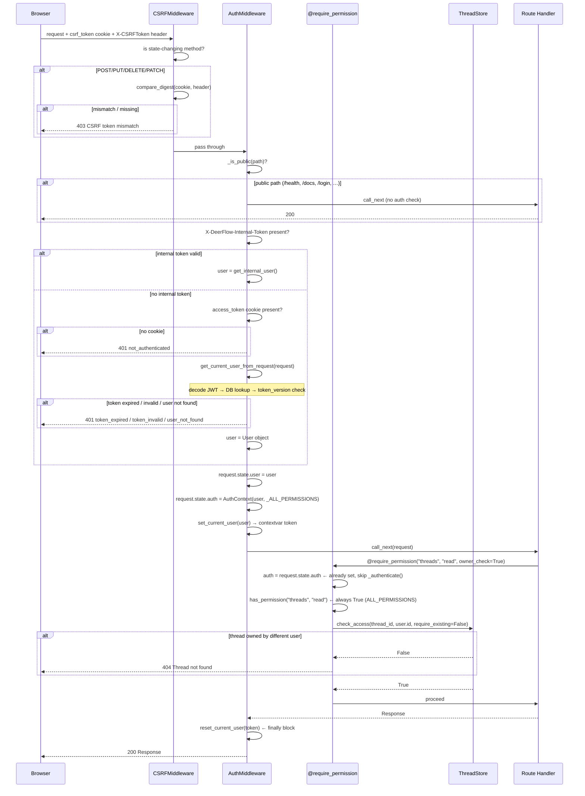
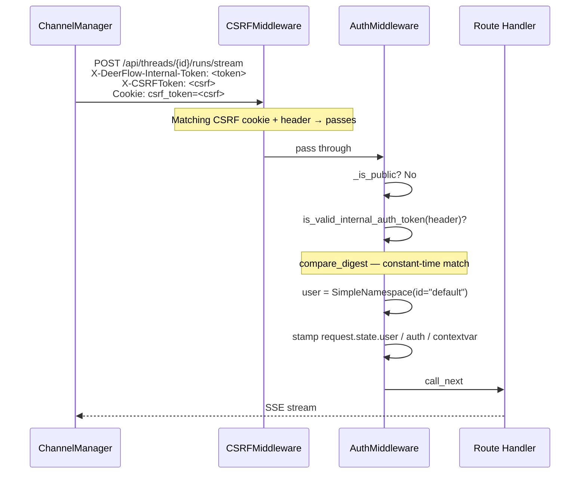
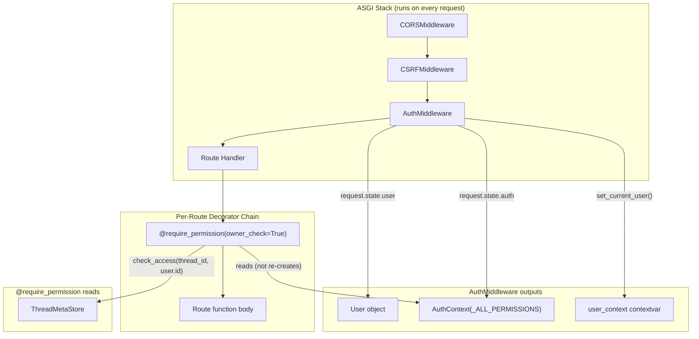
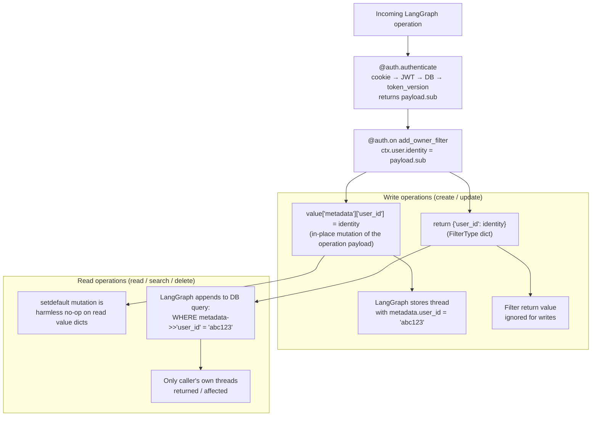

# Section 06b — Backend: Auth Enforcement Layer

> **Covers**: `auth_middleware.py` · `authz.py` · `internal_auth.py` · `langgraph_auth.py` <br />
> **Prerequisite**: [06a-auth-internals](/notes/modules/06a-auth-internals.md) — the auth machinery (JWT, password hashing, user repository) that this layer consumes <br />
> **Excludes**: `routers/auth.py` (annotated separately; HTTP surface for auth endpoints)

---

## Overview

The enforcement layer sits on top of the auth internals. Where `auth/` **produces** identity (hashes passwords, mints JWTs, stores users), this layer **consumes** identity and decides whether a given request is allowed to proceed.

The split is clean: nothing in `auth/` imports from any of these files. The dependency arrow goes one way — enforcement imports auth machinery, not the reverse.

Four files, four distinct responsibilities:

| File                 | Responsibility                                                                           |
| -------------------- | ---------------------------------------------------------------------------------------- |
| `auth_middleware.py` | Fail-closed gate — rejects every non-public request that lacks a valid session           |
| `authz.py`           | Per-route authorization — permission checks + thread ownership enforcement               |
| `internal_auth.py`   | Process-local trust channel — lets IM channels call the Gateway without a user JWT       |
| `langgraph_auth.py`  | LangGraph Server compatibility — re-implements the same rules for Studio/`langgraph dev` |

---

## Key Files

- `backend/app/gateway/auth_middleware.py` — Starlette `BaseHTTPMiddleware` that sits third in the ASGI stack (`CORSMiddleware → CSRFMiddleware → AuthMiddleware → handler`). Resolves every request to an authenticated user and stamps both `request.state.user` and the `user_context` contextvar before passing to the route handler.
- `backend/app/gateway/authz.py` — `AuthContext` data class, `@require_auth` decorator (unused in production), `@require_permission(resource, action, owner_check, require_existing)` decorator used on all 40+ protected route handlers.
- `backend/app/gateway/internal_auth.py` — 27-line module. Generates a 256-bit process-local token at import time and provides `create_internal_auth_headers()` / `is_valid_internal_auth_token()` / `get_internal_user()`.
- `backend/app/gateway/langgraph_auth.py` — `Auth()` instance wired via `langgraph.json`'s `"auth.path"`. Activated only in LangGraph Server mode; not loaded in the default Gateway-embedded deployment.

---

## Important Concepts

### 1. Fail-closed by default

`AuthMiddleware` applies a blocklist-of-exceptions model, not an allowlist-of-routes model. Every path is protected unless it appears in one of two explicit collections:

```python
_PUBLIC_PATH_PREFIXES = ("/health", "/docs", "/redoc", "/openapi.json")

_PUBLIC_EXACT_PATHS = frozenset({
    "/api/v1/auth/login/local",
    "/api/v1/auth/register",
    "/api/v1/auth/logout",
    "/api/v1/auth/setup-status",
    "/api/v1/auth/initialize",
})
```

Any new `/api/*` endpoint added to the codebase is automatically protected — there is no "forgot to add auth" failure mode. The `frozenset` provides O(1) membership lookup; the tuple with `startswith` covers prefix-matching for docs/health paths.

Trailing-slash tolerance: exact paths strip the trailing slash before matching (so `/api/v1/auth/login/local/` works), but prefix paths use the original `path` with `startswith` (which already handles trailing slashes naturally).

`/api/v1/auth/logout` is public even though it clears the session — the route needs to succeed whether or not the token is still valid. `/api/v1/auth/me` and `/api/v1/auth/change-password` are **not** public, even though they're under `/auth/`.

### 2. Two identity tracks

The middleware resolves identity through two parallel channels that merge at `request.state.user`:

```
Track A — Browser sessions (human users):
  access_token cookie → decode JWT → DB lookup → token_version check → User object

Track B — In-process callers (IM channels):
  X-DeerFlow-Internal-Token header → process-local HMAC match → synthetic SimpleNamespace user
```

Track B is implemented in `internal_auth.py`. The token is `secrets.token_urlsafe(32)` (256 bits), generated once at module import time and held only in process memory — never written to disk, never logged, regenerated on every restart.

`is_valid_internal_auth_token` uses `secrets.compare_digest` for constant-time comparison, preventing timing side-channel attacks even though the token only travels over localhost.

The synthetic user returned by `get_internal_user()` is `SimpleNamespace(id=DEFAULT_USER_ID, system_role="internal")`. All IM channel traffic (Feishu, Slack, Telegram, DingTalk) runs as `user_id = "default"` — **no per-channel user isolation**. Memory, threads, and artifacts created by IM-triggered runs share one user space.

### 3. The `request.state.auth` short-circuit

After resolving the user, `AuthMiddleware` stamps three things:

```python
request.state.user = user                                           # (1)
request.state.auth = AuthContext(user=user, permissions=_ALL_PERMISSIONS)  # (2)
token = set_current_user(user)                                      # (3)
```

These three stores serve different consumers:

- **(1)** `request.state.user` — route handlers that read the user directly
- **(2)** `request.state.auth` — `@require_permission` decorators in `authz.py`
- **(3)** `user_context` contextvar — repository-layer owner filters and the memory system, which may run after the request handler has returned

The critical insight is **(2)**. `@require_permission` checks `request.state.auth` before calling `_authenticate()`:

```python
auth = getattr(request.state, "auth", None)
if auth is None:                           # ← False in production: already set by middleware
    auth = await _authenticate(request)    # ← fallback path, only for bare FastAPI test apps
    request.state.auth = auth
```

In production, the decorator reads from state and skips the entire JWT-decode + DB-lookup pipeline. In a bare FastAPI unit test app (no middleware installed), the decorator falls back to authenticating itself — making `@require_permission` independently testable without the full middleware stack.

**The two `request.state.auth = auth` assignments are never both reached on a single request.** They are mutually exclusive: either the middleware sets it before the handler fires, or the decorator sets it on the first time the handler is entered without middleware.

### 4. Authentication ≠ Authorization

`AuthMiddleware` does **authentication only** — it verifies identity and stops there. Every authenticated user receives `_ALL_PERMISSIONS`:

```python
_ALL_PERMISSIONS = [
    "threads:read", "threads:write", "threads:delete",
    "runs:create", "runs:read", "runs:cancel",
]
```

This is a deliberate simplification documented with a comment in `authz.py`:

```python
# In future, permissions could be stored in user record
return AuthContext(user=user, permissions=_ALL_PERMISSIONS)
```

DeerFlow currently has one tier of authenticated user — no roles, no viewers vs. editors. The permission string check in `@require_permission` (`has_permission(resource, action)`) always passes for any authenticated user; it exists as a no-op placeholder for a future RBAC rollout.

The **real** per-resource gate is `owner_check=True`, which verifies thread ownership through `thread_store.check_access`.

### 5. Thread ownership enforcement

`@require_permission(owner_check=True)` adds a third check after authentication and permission string:

```python
allowed = await thread_store.check_access(
    thread_id,
    str(auth.user.id),
    require_existing=require_existing,
)
if not allowed:
    raise HTTPException(status_code=404, detail=f"Thread {thread_id} not found")
```

**`check_access` semantic** — "strict-deny, not strict-allow":

- Thread row missing from DB → `True` (untracked legacy thread, allow — migration tolerance)
- Thread row has `user_id = NULL` → `True` (shared pre-auth data, allow)
- Thread row has `user_id = other_user` → `False` (deny)

**`require_existing=True`** (used on DELETE and mutating PATCH routes) changes the first case: missing row → deny (404). This closes the "deleted-thread retargeting" path where a second user could target a thread that the first user deleted, because after deletion the row disappears and the missing-row allowance would otherwise let them in.

**404 not 403** — ownership denial is returned as "not found," not "forbidden." This is deliberate information hiding: a denied user should not learn that the thread exists for someone else.

### 6. `require_auth` is a dormant extension point

`authz.py` exports `require_auth` as a standalone decorator that enforces authentication without any resource-scoped permission. It has **no production callsites** — every router in the codebase uses `@require_permission` directly, which handles authentication internally. `require_auth` exists as a public API for future routes that need a simple "is logged in" gate without a resource model.

### 7. `BaseHTTPMiddleware` and the `HTTPException` catch

Starlette's `BaseHTTPMiddleware` catches all unhandled exceptions and converts them to 500 responses. FastAPI's `HTTPException` cannot propagate upward through middleware by default. This is why `dispatch` in `AuthMiddleware` explicitly catches it:

```python
try:
    user = await get_current_user_from_request(request)
except HTTPException as exc:
    return JSONResponse(status_code=exc.status_code, content={"detail": exc.detail})
```

Without this catch, a token-expired condition would become a 500, losing the fine-grained `token_expired` / `token_invalid` error codes that the frontend uses to show the right message.

The deferred import (`from app.gateway.deps import get_current_user_from_request` inside `dispatch`, not at module top) is a circular-dependency break: `deps.py` → `authz.py` creates a chain that would form a cycle if `auth_middleware.py` imported `deps` at module level.

### 8. LangGraph Server mode: `langgraph_auth.py`

This file is only active in **LangGraph Server mode** — when DeerFlow runs as a standalone LangGraph Server via `langgraph.json`'s `"auth.path": "./app/gateway/langgraph_auth.py:auth"`. The default Gateway-embedded deployment (dev, Docker, production) never loads it. It exists for LangGraph Studio, `langgraph dev`, and future standalone-server deployments.

Because the FastAPI middleware stack is absent in this mode, the file re-implements the same rules at the LangGraph level using the `Auth()` handler system from `langgraph_sdk`.

The `@auth.authenticate` handler mirrors `deps.get_current_user_from_request` exactly — cookie → JWT decode → DB lookup → `token_version` match — plus a CSRF check duplicated from `CSRFMiddleware` (see Open Questions).

The `@auth.on` handler implements ownership isolation through LangGraph's native filter mechanism, detailed in the next section.

### 9. The LangGraph `@auth.on` filter mechanism

`add_owner_filter` does two distinct things through two different channels in a single callback:

```python
@auth.on
async def add_owner_filter(ctx: Auth.types.AuthContext, value: dict):
    metadata = value.setdefault("metadata", {})
    metadata["user_id"] = ctx.user.identity          # ← Channel A: in-place mutation
    return {"user_id": ctx.user.identity}            # ← Channel B: filter return value
```

**Channel A — write-time ownership stamping (value mutation)**

`value` is a mutable dict that LangGraph Server passes by reference before executing the operation. For create/update operations, modifying `value["metadata"]` in place causes LangGraph to store the thread with `metadata.user_id = "abc123"` in the database. The LangGraph Server uses the mutated `value` dict as the actual write payload.

**Channel B — read-time ownership filtering (return value)**

The `HandlerResult` type accepted by `@auth.on` is `None | bool | FilterType`:

- `None` / `True` → accept the request unchanged
- `False` → reject with 403
- `FilterType` dict → **apply as a DB-level predicate** on the metadata column

`{"user_id": ctx.user.identity}` is `FilterType` shorthand for `{"user_id": {"$eq": ctx.user.identity}}`. LangGraph Server appends this to every read/search/delete query as a WHERE predicate on the thread's JSON metadata column — roughly:

```sql
WHERE metadata->>'user_id' = 'abc123'
```

The application code never sees threads it doesn't own; the filter is invisible to route handlers.

**Why both channels are necessary**

They form a write-then-read contract:

```
Write path:  value mutation stamps metadata.user_id into the DB
Read path:   return value predicates on metadata.user_id from the DB
```

If only the mutation existed (no return value), ownership would be recorded but reads would return all threads to all users. If only the return value existed (no mutation), the filter would correctly scope reads — but new threads would have no `user_id` in their metadata and would be excluded from all future reads by the same filter.

**The global handler trade-off**

DeerFlow registers `@auth.on` (global — fires for every resource and every action) rather than per-action handlers:

```python
# What the LangGraph docs recommend — separate per-action handlers:
@auth.on.threads.create   # stamp only
@auth.on.threads.read     # filter only
@auth.on.threads.search   # filter only
@auth.on.threads.delete   # filter only
```

The single global handler is simpler but does redundant work: on create operations it returns a filter dict that LangGraph ignores (filters are meaningless for non-query operations); on read operations it calls `value.setdefault("metadata", {})` which mutates the `value` dict with an extra key that LangGraph ignores for reads. Both are believed to be harmless, but they are not zero-cost (see Open Questions).

---

## Execution Flow

### Full authenticated request lifecycle (Gateway-embedded mode)



### Internal auth path (IM channels)



---

## Architecture Diagrams

### Middleware stack and decorator cooperation



### LangGraph `@auth.on` two-channel ownership mechanism



---

## My Insights

**The middleware + decorator design is a layered cache, not a layered check.** The way it reads from the outside, it looks like authentication happens twice — once in `AuthMiddleware` and once in `@require_permission`. In practice they never both execute on the same request. The middleware runs unconditionally for all routes; the decorator reads its result from state. The two paths exist so that each component is independently testable: the middleware can be tested with a bare app that has no decorators, and the decorators can be tested with a bare app that has no middleware.

**`_ALL_PERMISSIONS` is not a security oversight — it's a YAGNI decision.** The current permission model says "authenticated = authorized for all operations." The only meaningful authorization check is ownership (`owner_check=True`). The permission string system (`threads:read`, `threads:write`, etc.) is scaffolding for a future RBAC tier that may never arrive. Treating `has_permission()` as a real gate would be misleading when reading the code; the comment acknowledges this explicitly.

**The `require_existing` flag closes a TOCTOU gap on destructive routes.** Without it, a deleted thread's missing DB row would be treated as "untracked legacy thread — allow," enabling a second user to retarget the deleted thread. Adding `require_existing=True` only to destructive operations is precise: read-only routes still tolerate missing rows (migration tolerance), while mutating routes refuse to act on data that no longer exists.

**404 on ownership denial is an information-hiding contract across the entire codebase.** Every `@require_permission(owner_check=True)` route raises 404 on failure, not 403. A caller who guesses a thread UUID belonging to another user sees "not found" — they cannot distinguish "this thread exists but is not yours" from "this thread does not exist." This contract only holds if no other route leaks the existence of the thread (e.g., via a list endpoint that includes other users' threads). The `@auth.on` filter in `langgraph_auth.py` enforces the same contract at the DB query level for LangGraph Server mode.

**`internal_auth.py` is the third identity track that `AuthContext` knows nothing about.** `AuthContext` in `authz.py` has `user: User | None`. The internal user is a `SimpleNamespace`, not a `User`. It satisfies `request.state.user` but would `AttributeError` if any route accessed `user.email`, `user.token_version`, or `user.password_hash`. The system relies on an implicit contract: internal-auth paths (IM channel calls for thread creation and run streaming) never reach routes that access typed `User` fields. This contract is not enforced by the type system.

**`langgraph_auth.py` is the price of LangGraph Server compatibility.** The standard deployment embeds the LangGraph runtime inside the FastAPI Gateway — auth is handled by `AuthMiddleware` and `@require_permission`, and there is no separate LangGraph Server process. But `langgraph.json` also declares an `auth.path`, which means the file must exist and must be correct even though it is never loaded in the default deployment. Any change to the core auth logic (JWT algorithm, CSRF header name, `token_version` check) needs to be mirrored in two places: `deps.py` and `langgraph_auth.py`. This duplication is the ongoing maintenance cost of maintaining both deployment modes.

**The `@auth.on` global handler vs per-action handlers trade-off favours simplicity at the cost of correctness precision.** A global handler cannot distinguish between "I'm being called for a create, so stamp metadata" and "I'm being called for a read, so just filter." It does both on every call. The write-path mutation is harmless on reads (the metadata key gets added to a `value` dict that LangGraph ignores for reads). The read-path filter return is presumably ignored on writes. But this relies on LangGraph's undocumented behaviour rather than the explicit per-action handler design the SDK's own docs recommend.

---

## Open Questions

- **`AUTH_TEST_PLAN test 7.5.8`** — `auth_middleware.py` references a test plan document by test number. Where does this plan live in the repo, and what other identified security gaps are tracked in it?
- **Internal user `AttributeError` contract** — `get_internal_user()` returns a `SimpleNamespace` without `User` model fields. What prevents a route handler that accesses `user.email` from being hit by internal-auth requests? Is this enforced anywhere, or is it a silent assumption?
- **Dual state stamps** — `request.state.user` and the `user_context` contextvar both carry the user. Is there a path where one is present and the other is not, or are they always in sync after the middleware runs?
- **`require_auth` dead code** — no production router uses `@require_auth`. Is it kept for forward compatibility, or is it a candidate for removal?
- **CSRF duplication in `langgraph_auth.py`** — `_check_csrf` duplicates `CSRFMiddleware`. Could a shared utility be extracted without introducing a circular dependency between `app.gateway.csrf_middleware` and the LangGraph auth handler?
- **`@auth.on` mutation on reads** — `value.setdefault("metadata", {})` mutates the `value` dict on every call including reads. Is this guaranteed harmless by LangGraph Server, or could it cause unexpected side effects (e.g., a read operation's `value` dict being unexpectedly modified before some other hook runs)?

---

## Links to Related Sections

- [[06a-auth-internals]] — the JWT, password hashing, and user repository that this enforcement layer consumes
- [[05a-gateway-api]] — `app.py` registers `AuthMiddleware`; `deps.py` contains `get_current_user_from_request` which is called by the middleware and mirrored in `langgraph_auth.py`
- [[07-langgraph-runtime]] — `user_context.py`'s `set_current_user` / `reset_current_user` are called by `AuthMiddleware`; `resolve_runtime_user_id` is the authoritative user_id resolution for background tools
- [[18-persistence-layer]] — `ThreadMetaStore.check_access` is the ownership gate called by `@require_permission(owner_check=True)`
- [[19-channels]] — `ChannelManager` is the primary caller of `create_internal_auth_headers()` from `internal_auth.py`
