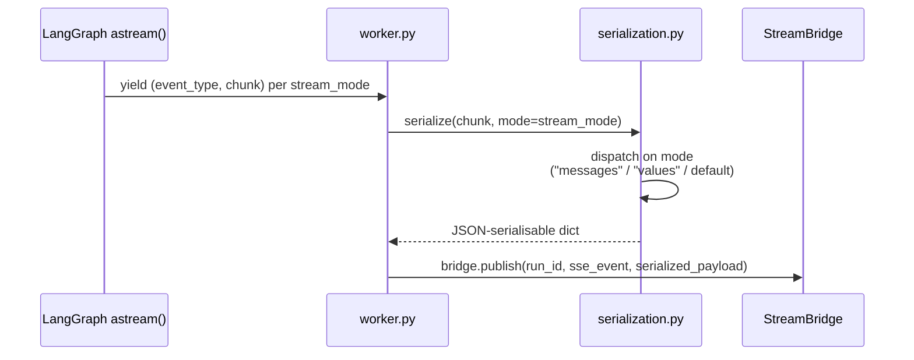
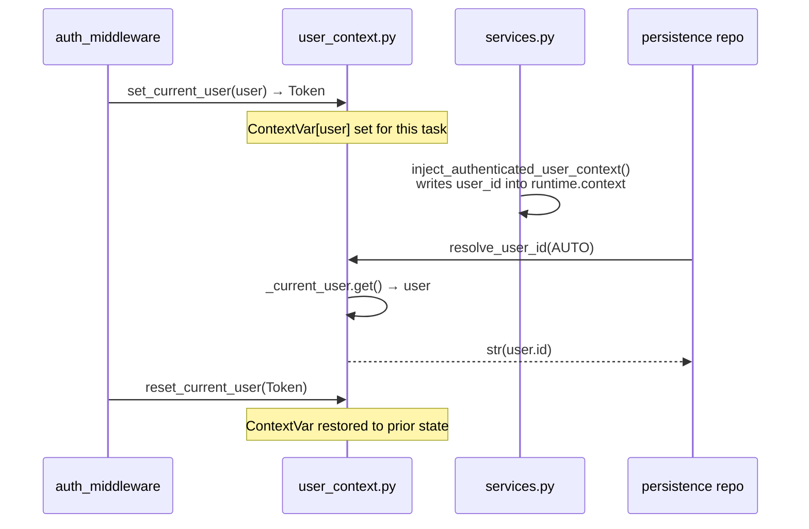
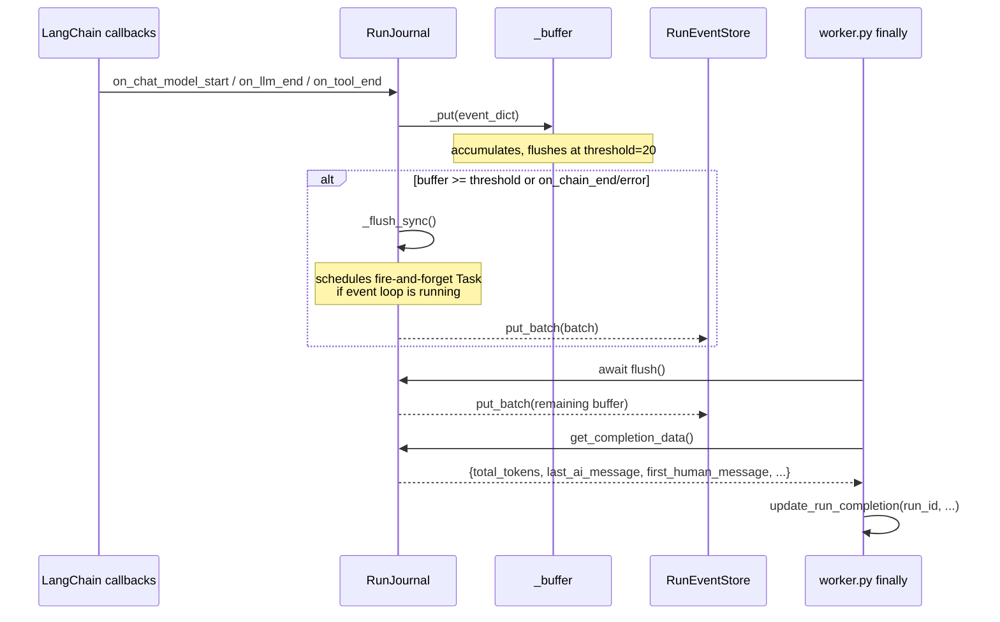
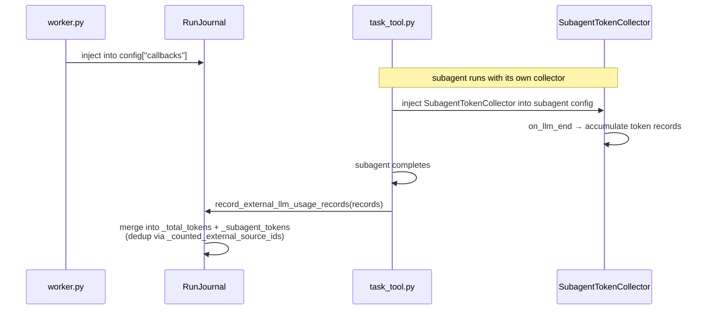
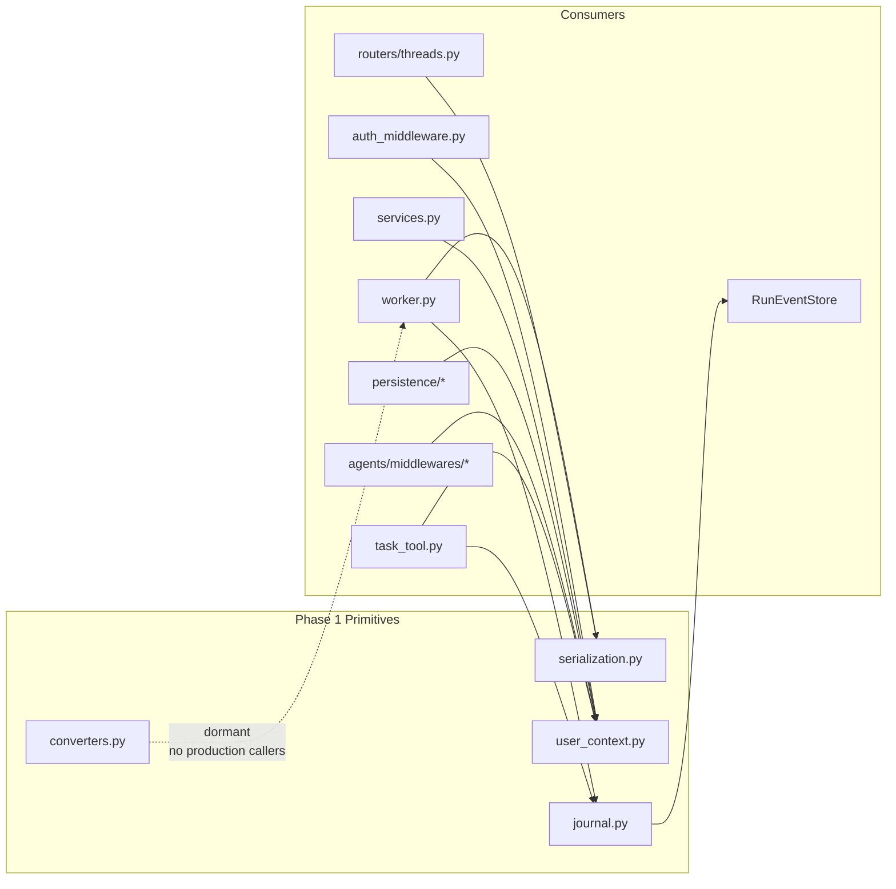

# Runtime Primitives (Section 07 — Phase 1)

Phase 1 of the runtime study covers the four foundation modules that every other runtime
component depends on. They have no intra-package dependencies — they can be read in isolation,
and their types and functions appear throughout the rest of the runtime.

## Purpose

These four files form the **bottom layer** of the `deerflow.runtime` package:

| File               | Role                                                                                                                           |
| ------------------ | ------------------------------------------------------------------------------------------------------------------------------ |
| `serialization.py` | Converts LangChain/LangGraph Python objects to JSON-serialisable dicts — the single serialization boundary for all wire output |
| `user_context.py`  | Request-scoped identity bus — holds the `ContextVar` that auth middleware sets and every downstream component reads            |
| `converters.py`    | Translates LangChain messages to OpenAI Chat Completions wire format — currently dormant                                       |
| `journal.py`       | LangChain callback handler that captures every LLM/tool event as structured audit records and accumulates token usage          |

## Key Files

- `backend/packages/harness/deerflow/runtime/serialization.py`
- `backend/packages/harness/deerflow/runtime/user_context.py`
- `backend/packages/harness/deerflow/runtime/converters.py`
- `backend/packages/harness/deerflow/runtime/journal.py`

---

## serialization.py

### What it does

Single source of truth for converting LangChain message objects, Pydantic models, and LangGraph
state dicts into plain JSON-serialisable Python structures. Two consumers use it in production:

| Consumer                         | How it uses it                                                            |
| -------------------------------- | ------------------------------------------------------------------------- |
| `runtime/runs/worker.py`         | Calls `serialize(chunk, mode=stream_mode)` for every SSE event            |
| `app/gateway/routers/threads.py` | Calls `serialize_channel_values(channel_values)` for REST state responses |

### Mode-dispatching entry point

`serialize(obj, *, mode="")` is the single entry point. The `mode` parameter maps **1:1 to
LangGraph's `stream_mode` strings** — `worker.py` passes the active `stream_mode` directly with
no translation layer:

| mode              | Delegates to               | Input contract                         |
| ----------------- | -------------------------- | -------------------------------------- |
| `"messages"`      | `serialize_messages_tuple` | `(message_chunk, metadata_dict)` tuple |
| `"values"`        | `serialize_channel_values` | Full LangGraph state dict              |
| _(anything else)_ | `serialize_lc_object`      | Any Python object                      |

### `__pregel_*` key stripping

`serialize_channel_values` removes `__pregel_*` and `__interrupt__` keys from the state dict.
This is intentional: it mirrors what the **LangGraph Platform API** returns, so clients work
identically against DeerFlow's embedded runtime and the hosted LangGraph service.

### Pydantic v1/v2 dual probe

`serialize_lc_object` probes for `model_dump()` (Pydantic v2) first, then `dict()` (Pydantic v1).
Both are wrapped in `try/except` — defensive against unusual subclasses whose `model_dump()`
raises. Final fallback: `str(obj)` → `repr(obj)`.

This is a **never-throw guarantee**: a serialization error in an SSE pipeline would silently drop
the event. The `str()` → `repr()` chain ensures something always comes out.

---

## user_context.py

### What it does

Request-scoped identity bus. Holds a single `ContextVar[CurrentUser | None]` that
`auth_middleware.py` sets after every authenticated request and resets in a `finally` block.
Every component that needs to know "who is the current user?" reads from this module — never
from the HTTP request object.

### CurrentUser as Protocol (dependency inversion)

`CurrentUser` is a `@runtime_checkable Protocol` with one attribute: `id: str`. It lives in
the **harness** (not in `app.gateway`) so the persistence layer can resolve user IDs without
importing across the harness/app boundary. `app.gateway.auth.models.User` satisfies the protocol
structurally — zero coupling.

### ContextVar is task-local, not thread-local

Each FastAPI request is its own asyncio task with an isolated context. `asyncio.create_task()`
and `asyncio.to_thread()` inherit the parent context automatically — child tasks see the same
user without any extra wiring.

> **Gotcha:** `threading.Timer` callbacks run on a thread-pool thread that does **not** inherit
> the asyncio context. `memory_middleware.py` handles this by capturing
> `user_id = get_effective_user_id()` eagerly at enqueue time (inside the request task) and
> storing it in the queue payload for the timer callback to use later.

### Token/reset pattern in auth_middleware

```python
# auth_middleware.py — per-request user context setup
token = set_current_user(user)
try:
    response = await call_next(request)
finally:
    reset_current_user(token)   # restores previous context — prevents cross-request leakage
```

### Four read functions in ascending strictness

| Function                           | Returns                           | Raises?                 | Use for                                       |
| ---------------------------------- | --------------------------------- | ----------------------- | --------------------------------------------- |
| `get_current_user()`               | `CurrentUser \| None`             | Never                   | Code that can proceed without a user          |
| `require_current_user()`           | `CurrentUser`                     | `RuntimeError` if unset | Repository code requiring authentication      |
| `get_effective_user_id()`          | `str` (falls back to `"default"`) | Never                   | Filesystem path resolution in no-auth mode    |
| `resolve_runtime_user_id(runtime)` | `str` (3-source chain)            | Never                   | Tools/middleware persisting user-scoped state |

### resolve_runtime_user_id: the three-source chain

`resolve_runtime_user_id(runtime)` is **preferred over `get_effective_user_id()`** for any code
that persists per-user state (uploads, custom agents, memory). It checks three sources in order:

1. `runtime.context["user_id"]` — set by `inject_authenticated_user_context` in `services.py`.
   The only source that survives thread-pool and future cross-process boundaries.
2. `_current_user` ContextVar — reliable for in-task work.
3. `DEFAULT_USER_ID = "default"` — last-resort fallback for no-auth / CLI / test paths.

### Three-state repository parameter semantics

Repository methods default to `user_id=AUTO`. `resolve_user_id(value)` maps three states:

| Value            | Behaviour                                            |
| ---------------- | ---------------------------------------------------- |
| `AUTO` (default) | Read ContextVar; raise `RuntimeError` if unset       |
| Explicit `str`   | Use verbatim (tests, admin override)                 |
| `None`           | Skip WHERE clause entirely (migration scripts / CLI) |

`AUTO` is a **singleton sentinel** (`_AutoSentinel.__new__` enforces one instance), making
`isinstance(value, _AutoSentinel)` reliable in `resolve_user_id`.

One subtle detail: `User.id` is typed as `UUID` at the API surface, but `aiosqlite` cannot bind
a raw UUID to a VARCHAR column. `resolve_user_id` coerces to `str` at this single boundary so
every repository caller is insulated from the type mismatch.

---

## converters.py

### What it does

Pure functions to translate LangChain `BaseMessage` objects into the OpenAI Chat Completions
wire format. Three functions:

| Function                                  | Output                                        |
| ----------------------------------------- | --------------------------------------------- |
| `langchain_to_openai_message(message)`    | Single OpenAI message dict                    |
| `langchain_to_openai_completion(message)` | Full `/v1/chat/completions` response envelope |
| `langchain_messages_to_openai(messages)`  | Batch list conversion                         |

### Three LangChain → OpenAI impedance mismatches

| Mismatch          | LangChain                       | OpenAI                               |
| ----------------- | ------------------------------- | ------------------------------------ |
| Role names        | `"human"`, `"ai"`               | `"user"`, `"assistant"`              |
| Tool call args    | `dict`                          | JSON-serialized `str` (`json.dumps`) |
| Token field names | `input_tokens`, `output_tokens` | `prompt_tokens`, `completion_tokens` |

### The OpenAI content:null rule

When an assistant message has `tool_calls`, OpenAI requires `content: null` if there is no
accompanying text. `langchain_to_openai_message` sets `content = None` when content is an empty
string or empty list, while preserving non-empty string content and non-empty list content
(multimodal messages).

### Duck-typed throughout

Every attribute access uses `getattr(message, attr, default)` rather than importing
`HumanMessage`, `AIMessage` etc. from LangChain. This means the functions work with any
object that has the right attributes — including the `MagicMock` objects used in tests.

### Dormant infrastructure

`converters.py` is not re-exported from `deerflow.runtime.__init__` and has **no production
callers** today. The module docstring acknowledges this: _"Not currently wired into RunJournal
(which uses message.model_dump() directly)"_. It exists as available-but-unused infrastructure,
likely built in anticipation of an OpenAI-compatible API surface.

---

## journal.py

### What it does

`RunJournal` extends LangChain's `BaseCallbackHandler`. When injected into a LangGraph run as
a callback handler, LangChain calls its methods automatically on every LLM call, tool call,
and chain lifecycle event. RunJournal normalises those raw callbacks into structured `RunEvent`
records and writes them in batches to a `RunEventStore`. It is the **audit log of record** for
every agent run.

### Lifecycle: how worker.py wires it up

```
worker.py try block
├── RunJournal(run_id, thread_id, event_store)   ← inside try so DB errors don't hang SSE
├── config["callbacks"].append(journal)           ← LangChain sees it as a callback handler
│
│   [LangGraph agent runs — callbacks fire automatically]
│
finally:
├── await journal.flush()                         ← drains remaining buffer
└── journal.get_completion_data() → run record    ← token totals + last AI message
```

Initialising the journal **inside** the `try` block is a deliberate choice: if a DB error occurs
during setup, it flows through the except/finally path that publishes an `"end"` event to the
SSE bridge. Initialising it before the try would leave the stream hanging with no terminator.

### Six callback methods

| Callback              | Captures                                                                     |
| --------------------- | ---------------------------------------------------------------------------- |
| `on_chain_start`      | Only root invocation (`parent_run_id=None`) → `run.start` trace              |
| `on_chain_end`        | `run.end` → immediate sync flush                                             |
| `on_chain_error`      | `run.error` → immediate sync flush                                           |
| `on_chat_model_start` | Structured LLM prompt → `llm.human.input`; canonical first-human-msg capture |
| `on_llm_end`          | LLM response → `llm.ai.response`; token accumulation + dedup                 |
| `on_tool_end`         | Tool output → `llm.tool.result`; handles `ToolMessage` and `Command`         |

`on_tool_start` is a no-op (debug logging only).

### Buffered batch writes + sync/async bridge

`BaseCallbackHandler` methods are **synchronous** by LangChain's contract. The `RunEventStore`
is async. `_flush_sync` bridges this:

- Events accumulate in `_buffer` (list of dicts)
- `_flush_sync` is called when: buffer hits `flush_threshold=20`, or `on_chain_end`/error fires
- If a loop is running: schedules a fire-and-forget `asyncio.Task`
- If no loop: events wait in buffer for `flush()` in `worker.py`'s `finally` block
- **Guard:** only one flush task runs at a time (`_pending_flush_tasks`) — prevents concurrent SQLite writes
- On task failure: events are returned to the front of the buffer for retry on next flush

### Triple dedup against double-counting

LangChain can fire `on_llm_end` multiple times for the same `run_id` (streaming batches,
callback propagation up the chain). Three independent sets prevent double-counting:

| Set                            | Guards                                               |
| ------------------------------ | ---------------------------------------------------- |
| `_counted_llm_run_ids`         | Token accumulation per LangChain `run_id`            |
| `_counted_message_llm_run_ids` | `_last_ai_msg` / `_msg_count` update                 |
| `_counted_external_source_ids` | Subagent token records from `SubagentTokenCollector` |

### Caller identification via LangChain tags

`_identify_caller(tags)` reads tags that each call site injects into the LangChain config:

| Caller           | Tag                                   |
| ---------------- | ------------------------------------- |
| Lead agent graph | _(none)_ → defaults to `"lead_agent"` |
| Middleware       | `"middleware:{name}"`                 |
| Subagent         | `"subagent:{name}"`                   |

Tags enable per-bucket token accounting: `_lead_agent_tokens`, `_subagent_tokens`,
`_middleware_tokens` are tracked separately and written to the run record.

### Subagent token handoff

Subagents run a separate `SubagentTokenCollector` callback handler — they do NOT write into
the parent `RunJournal`. After each subagent completes, `task_tool.py` calls:

```python
journal.record_external_llm_usage_records(records)
```

This merges the subagent's token records into the parent run's accumulator. The
`_counted_external_source_ids` set prevents re-merging the same records if the call happens
to fire more than once.

### Why on_chat_model_start captures first_human_message

`on_chain_start` fires on every graph node. `on_chat_model_start` fires only on real LLM
calls, and the messages there are fully structured — they are never compressed by checkpoint
trimming. The search scans batches in **reverse** to find the most recent human message, skips
messages named `"summary"` (checkpoint summaries, not user input), and only captures the first
one found per run.

### on_tool_end handles LangGraph's Command type

Some LangGraph tools return a `Command` (a state delta) instead of a `ToolMessage` directly.
`on_tool_end` checks `isinstance(output, Command)` and unpacks `Command.update["messages"]`
to extract `ToolMessage` objects for logging. Tools that return neither generate a warning but
do not raise.

### \_record_message_summary called on HumanMessage: what actually runs

`on_chat_model_start` calls `_record_message_summary(m)` on the captured `HumanMessage`. Only
**one line executes**: `self._msg_count += 1`. The `is_ai_message` check evaluates to `False`,
so the `_last_ai_msg` update is bypassed entirely. The method is a mild cohesion issue — it does
two unrelated things (count messages; update last AI text), and for HumanMessage callers the
second half is dead code.

---

## Execution Flow

### Serialization: SSE event publishing



### User context lifecycle: request → persistence



### Journal event lifecycle: callback → store → run record



### Subagent token handoff



## Architecture Diagrams

### Dependency map: Phase 1 primitives and their consumers



## My Insights

### The primitives layer is a deliberate dependency firewall

Grouping serialization, identity, format conversion, and event capture into zero-dependency
files is not accidental. It means the rest of the runtime can be read in any order without
circular imports, and the harness/app boundary is easy to enforce — these primitives are
the only channel through which app-layer concerns (like "which user is this?") flow into
the harness without an import in that direction.

### Two user_id channels create two conventions

The ContextVar approach means 95% of the codebase never passes `user_id` as a parameter.
But `resolve_runtime_user_id` reveals a crack: anything that crosses a thread boundary
can't rely on the ContextVar. DeerFlow solves this by injecting `user_id` into
`runtime.context` at the gateway level — but the two paths create two separate conventions
that callers must choose between. The migration from `get_effective_user_id()` to
`resolve_runtime_user_id()` appears to be in progress, not complete.

### RunJournal is event sourcing without the label

RunJournal is effectively an **event sourcing adapter** — it maps LangChain's callback events
into a normalised, append-only event log. The `RunEventStore` (Phase 4) is the write-ahead
log. Together they give DeerFlow a complete, queryable audit trail of every run without polling
or post-hoc reconstruction. The buffer-and-batch pattern reduces write pressure at the cost of
the sync/async bridge complexity.

### converters.py is a roadmap signal

The file is well-tested, structurally sound, and unused. Given that `serialize_channel_values`
already mimics the LangGraph Platform API shape, and that `langchain_to_openai_completion`
implements the `/v1/chat/completions` envelope, OpenAI API compatibility looks like a
near-complete feature waiting to be wired in — not an abandoned experiment.

## Open Questions

- `resolve_runtime_user_id` is only called by `summarization_hook.py` and `setup_agent_tool.py`
  today. `memory_middleware`, `uploads_middleware`, and `thread_data_middleware` still use
  `get_effective_user_id()` directly. Is this an intentional distinction (those middlewares are
  always in-task), or a gradual migration in progress?
- `on_tool_start` is a no-op (debug logging only). Given that `llm.tool.result` events exist,
  is a `llm.tool.call` event (capturing tool inputs) planned?
- Which middlewares actually call `journal.record_middleware()`? No callers were found in the
  initial grep of non-test files.
- `converters.py` has no production callers. Is an OpenAI-compatible chat completions endpoint
  on the DeerFlow roadmap?

## Links to Related Sections

- [[07b-runtime-checkpointer]] — Phase 2: async graph state persistence; uses user_context for scoping
- [[07c-runtime-store]] — Phase 3: KV store layer; similar async/sync bridge pattern as journal
- [[07d-runtime-events]] — Phase 4: RunEventStore implementations that journal writes to
- [[07g-runtime-orchestration]] — Phase 7: worker.py is where all four primitives are assembled for a single run
- [[06a-auth-internals]] — auth_middleware.py is the sole writer of the user_context ContextVar
- [[09-middleware-pipeline]] — middlewares read user_context and call journal.record_middleware()
