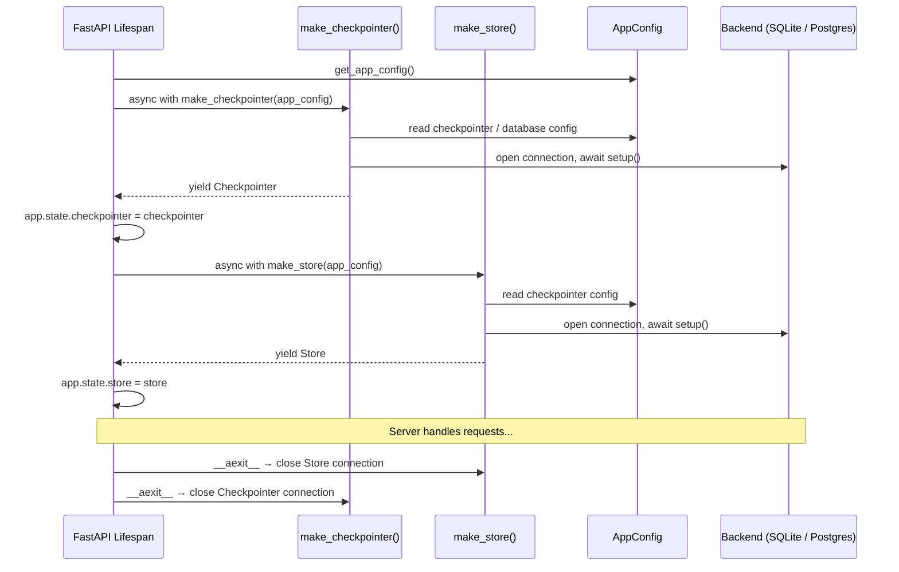
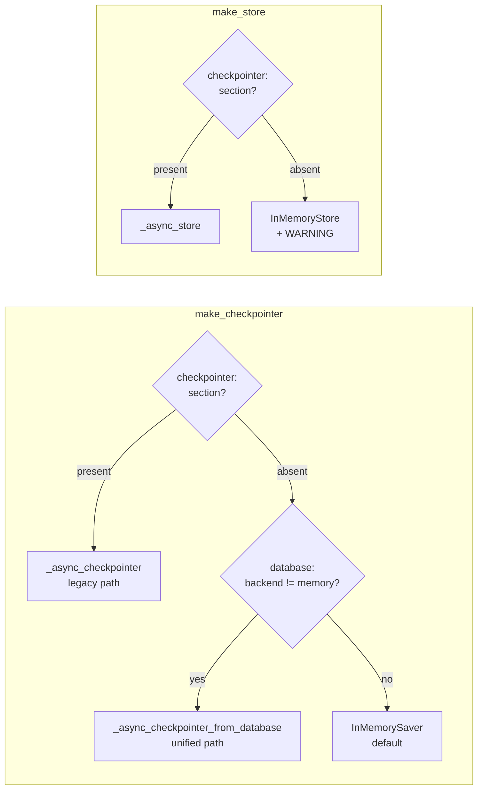
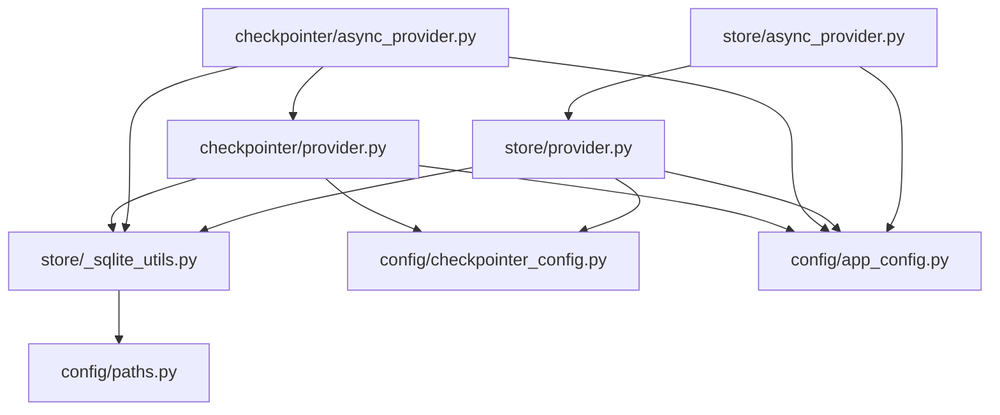

# Checkpointer & Store Subsystems (Section 07 — Phases 2 & 3)

Phases 2 and 3 of the runtime study cover the two persistence subsystems that sit just above
the primitive layer. They are designed as a **coupled pair**: same config section, same backend
technology, reset together on config change.

---

## Purpose

| Subsystem        | LangGraph type             | What it stores                                                                                     |
| ---------------- | -------------------------- | -------------------------------------------------------------------------------------------------- |
| **Checkpointer** | `Checkpointer` (langgraph) | Graph execution state — the snapshot between steps inside a single run                             |
| **Store**        | `BaseStore` (langgraph)    | Cross-thread key-value data — thread metadata, user memory, agent state that outlives a single run |

Both subsystems expose the same three-part access pattern:

| Access pattern                               | Type             | When to use                                            |
| -------------------------------------------- | ---------------- | ------------------------------------------------------ |
| `get_checkpointer()` / `get_store()`         | Sync singleton   | Embedded client (`DeerFlowClient`), CLI tools          |
| `checkpointer_context()` / `store_context()` | Sync one-shot CM | CLI scripts, tests that need deterministic teardown    |
| `make_checkpointer()` / `make_store()`       | Async CM         | FastAPI lifespan — server-lifetime resource management |

---

## Key Files

| File                                     | Role                                                                                             |
| ---------------------------------------- | ------------------------------------------------------------------------------------------------ |
| `runtime/checkpointer/provider.py`       | Sync checkpointer factory: singleton + one-shot CM; three backends (memory/SQLite/Postgres)      |
| `runtime/checkpointer/async_provider.py` | Async checkpointer factory: `make_checkpointer()` with three-tier config priority                |
| `runtime/store/_sqlite_utils.py`         | Shared SQLite helpers used by all four provider files: path resolution + parent-dir creation     |
| `runtime/store/provider.py`              | Sync store factory: structural mirror of checkpointer provider                                   |
| `runtime/store/async_provider.py`        | Async store factory: `make_store()` — simpler than `make_checkpointer()`, no unified config path |

---

## Important Concepts

### Checkpointer vs Store

Both are LangGraph abstractions backed by the same database, but they serve different scopes:

- **Checkpointer** — within a single run; LangGraph uses it to persist the graph state between
  node executions so a run can be interrupted and resumed. Implemented by `InMemorySaver`,
  `SqliteSaver`, `PostgresSaver` (sync) and their async counterparts.
- **Store** — across runs and threads; a generic key-value layer for data that must survive
  past any single execution. Implemented by `InMemoryStore`, `SqliteStore`, `AsyncSqliteStore`, etc.

### The Singleton Pattern (sync providers)

Both `provider.py` files use an identical two-global pattern:

```python
_checkpointer: Checkpointer | None = None
_checkpointer_ctx = None          # the open context manager
```

`_checkpointer_ctx` is kept alongside the instance so the backend connection can be closed
properly. When `get_checkpointer()` is first called, it enters `_sync_checkpointer_cm()` once
and stores the open CM object. The backend connection (SQLite file handle or Postgres pool)
stays alive until `reset_checkpointer()` manually calls `_checkpointer_ctx.__exit__(None, None, None)`.

### Store always follows the Checkpointer config

The store has no dedicated config section. `_sync_store_cm()` accepts a `CheckpointerConfig`
object — the same one the checkpointer uses. This is intentional: the docs explicitly state that
store and checkpointer always use the same persistence technology. Changing backends requires only
one `config.yaml` change, and the coupling is enforced in `app_config.py` which calls
`reset_store()` alongside `reset_checkpointer()` whenever the config changes.

### `saver.setup()` / `store.setup()`

Every non-memory backend requires an explicit `setup()` call after construction. This creates
the LangGraph schema tables if they do not exist. Forgetting this call results in
`OperationalError: no such table` on the first graph execution.

### WARNING vs INFO on memory fallback

When no `checkpointer:` section is configured, both subsystems fall back to an in-memory
implementation — but at different log levels:

- Checkpointer → **INFO**: losing graph execution state is invisible to users (they just lose
  the ability to resume an interrupted run).
- Store → **WARNING**: losing the store means users lose their thread list on restart, which is
  immediately visible in the UI.

---

## Execution Flow — FastAPI Lifespan

Both CMs are opened in the FastAPI lifespan and attached to `app.state`. They stay open for
the lifetime of the server process and are closed (in reverse order) on shutdown.



---

## Config Priority — `make_checkpointer()` vs `make_store()`

`make_checkpointer()` has a three-tier priority cascade to support a migration from the legacy
`checkpointer:` section to the new unified `database:` section. `make_store()` has not yet been
updated to support the unified path — it reads only from `app_config.checkpointer`.



**Implication:** A deployment that configures only the `database:` section (no `checkpointer:`
section) gets a real SQLite/Postgres checkpointer but an in-memory store — data loss on restart
for thread metadata and user memory, with only a WARNING log to indicate it.

---

## Module Dependency Graph



Note: `store/async_provider.py` imports `ensure_sqlite_parent_dir` and `resolve_sqlite_conn_str`
from `store/provider.py` (not from `_sqlite_utils` directly), making it an indirect dependent
of `provider`. `checkpointer/async_provider.py` imports from `_sqlite_utils` directly — the
two packages are inconsistent.

---

## My Insights

### The Singleton Pattern Is Manually Managed Lifetime

Python context managers are designed for deterministic scope (`with` block). Here the checkpointer
and store invert that: the CM is entered once at process start but never exited by a `with` block —
instead, `reset_checkpointer()` calls `__exit__` manually when needed (config change, test teardown).

This is an explicit trade-off: the server lifetime cannot be expressed as a single `with` block at
the module level, so the CM's `__enter__`/`__exit__` protocol is used as a resource lifecycle API.
It is an unusual but correct use of the protocol.

### `_sync_checkpointer_cm` Is the Real Constructor

The private `_sync_checkpointer_cm()` / `_sync_store_cm()` functions do the actual work.
`get_checkpointer()` and `checkpointer_context()` are both just different lifetime policies
layered on top — one caches, one doesn't. The backend code is written once and reused by both.

### Two Config-Reading Paths in the Sync Providers

`get_checkpointer()` reads from the module-global `_checkpointer_config` (set by
`set_checkpointer_config()`), while `checkpointer_context()` reads `app_config.checkpointer`
from the `AppConfig` Pydantic object. These can diverge: a test that calls
`set_checkpointer_config()` will affect `get_checkpointer()` but not `checkpointer_context()`.
The test suite for `checkpointer_context()` mocks `get_app_config` directly because of this.
The store provider has the same asymmetry.

### The Test-Isolation Gate

```python
if config is None and _app_config is None:
    try:
        get_app_config()
    except FileNotFoundError:
        pass
```

This guard in `get_checkpointer()` is subtle but important. A test that calls
`set_checkpointer_config(CheckpointerConfig(type="memory"))` sets `_checkpointer_config`
directly. When `get_checkpointer()` runs, `config` is not `None` (it was just set), so the
`if` branch is skipped and `config.yaml` on disk is never touched. Without this guard, the
test could silently pick up a developer's local SQLite or Postgres config — passing in CI but
failing on anyone's machine that has a real config.

### Postgres Pool Configuration Is LangGraph-Mandated

For the async checkpointer's Postgres backend, DeerFlow must build a pool manually:

```python
AsyncConnectionPool(
    conninfo=config.connection_string,
    max_size=20,
    kwargs={"autocommit": True, "prepare_threshold": 0},
)
```

- `autocommit=True` — required by LangGraph's `AsyncPostgresSaver`; it manages transaction
  boundaries internally and cannot work inside an externally-started transaction.
- `prepare_threshold=0` — disables psycopg3's automatic server-side statement preparation.
  With `autocommit=True`, psycopg3's prepared statement caching causes errors on repeated
  checkpointer calls because cached statement identifiers become invalid across connections.

The store's `AsyncPostgresStore` encapsulates these requirements behind `from_conn_string` —
the caller does not need to configure the pool manually.

### Async Hygiene Gap: Three Out of Four

Only one of the four async providers correctly offloads `ensure_sqlite_parent_dir` to a thread:

| File                             | Path                                                 | `asyncio.to_thread`? |
| -------------------------------- | ---------------------------------------------------- | -------------------- |
| `checkpointer/async_provider.py` | legacy SQLite (`_async_checkpointer`)                | ✅                   |
| `checkpointer/async_provider.py` | unified SQLite (`_async_checkpointer_from_database`) | ❌                   |
| `store/async_provider.py`        | SQLite (`_async_store`)                              | ❌                   |

`mkdir(parents=True, exist_ok=True)` on a local filesystem is almost instantaneous, so this is
unlikely to cause real latency. But it is technically a blocking syscall on the event loop.

---

## Open Questions

- **`make_store()` missing `database:` path** — If a deployment uses only `database:` (no
  `checkpointer:` section), the checkpointer gets a real backend but the store falls back to
  `InMemoryStore`. Is this intentional or an incomplete migration?
- **Two config sources for sync providers** — `get_checkpointer()` reads `_checkpointer_config`
  (module global), `checkpointer_context()` reads `AppConfig.checkpointer` (Pydantic field).
  Is this asymmetry intentional, or should both read the same source?
- **`POSTGRES_CONN_REQUIRED` error message** — says `"checkpointer.connection_string is required"`
  even when raised from the store code. A misleading error for store-only users.
- **Blocking `ensure_sqlite_parent_dir`** — three async paths call it without `asyncio.to_thread`.
  Intentional (the operation is fast enough) or a gradual oversight?

---

## Links to Related Sections

- [[07a-runtime-primitives]] — Phase 1 primitives; `user_context.py` is consumed by every component that needs `user_id`, including the async providers indirectly
- [[07c-events]] — Run event store (Phase 4); uses a separate storage layer, not the checkpointer or store
- [[07-langgraph-runtime]] — Parent index (to be created when all phases are complete)
- [[17-config-system]] — `checkpointer_config.py`, `database_config.py`, `app_config.py` — the config objects these providers consume
