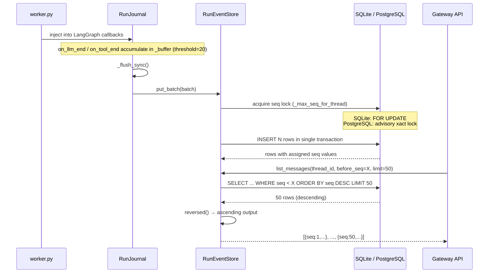
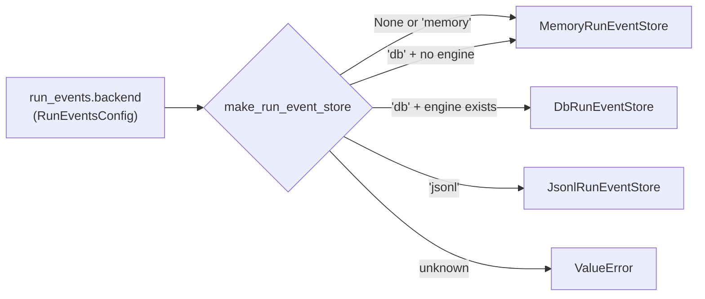
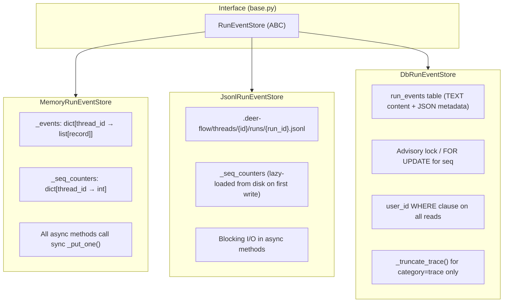

# Runtime Event Store (Section 07 — Phase 4)

Phase 4 covers the event sourcing layer for a DeerFlow run. `RunJournal` (Phase 1) writes
into this layer; the Gateway API reads from it to serve message history, pagination, and run
traces.

## Purpose

`RunEventStore` is the **append-only event log** for every agent run. Every LLM call, tool
execution, and agent lifecycle transition is written here as a structured record. The store
serves two consumers through a single unified interface:

| Consumer                | What it reads                                           | Interface method  |
| ----------------------- | ------------------------------------------------------- | ----------------- |
| Frontend (chat history) | `category="message"` events across all runs in a thread | `list_messages()` |
| Developer Tools / API   | Full execution trace for one run                        | `list_events()`   |

A single store with a `category` filter keeps `seq` globally ordered across both uses —
a message from run 1 at seq=3 and a trace event from run 1 at seq=4 are adjacent in the log
and can be addressed by the same cursor.

## Key Files

- `runtime/events/store/base.py` — abstract interface and contract
- `runtime/events/store/memory.py` — in-memory implementation (default, all tests)
- `runtime/events/store/jsonl.py` — file-backed implementation (lightweight single-node)
- `runtime/events/store/db.py` — SQLAlchemy implementation (production)
- `runtime/events/store/__init__.py` — `make_run_event_store()` factory

## Important Concepts

### The `category` Discriminator

Every event carries one of three categories:

| Category      | Meaning                                | Who reads it                 |
| ------------- | -------------------------------------- | ---------------------------- |
| `"message"`   | User/AI chat turns visible in the UI   | Frontend, thread history API |
| `"trace"`     | LLM prompts, model responses, tool I/O | Developer Tools, debugging   |
| `"lifecycle"` | Run start/end, errors                  | Audit, monitoring            |

`list_messages()` filters to `category="message"` only. `list_events()` returns all categories
for one run. In the DB backend, trace content is truncated at `max_trace_content` bytes
(default 10 KB) to prevent large LLM prompt dumps from bloating the database — message content
is **never** truncated, regardless of size.

### Thread-Scoped `seq`

`seq` is monotonically increasing **per thread**, not per run. Two runs executing within the
same thread share one counter. This is what makes `list_messages()` return a unified,
cross-run conversation history in correct chronological order without any secondary sort.

The `UniqueConstraint("thread_id", "seq")` in `RunEventRow` enforces this at the DB level.
**Gaps in `seq` are legal** — run deletion removes rows without rewinding the counter. No
consumer should assume contiguous values.

### Two Logical Views, One Physical Store

The interface exposes two read shapes over the same data:

```
Thread view  → list_messages(thread_id)             — across ALL runs, messages only
Run view     → list_events(thread_id, run_id)        — ONE run, all categories
             → list_messages_by_run(thread_id, run_id) — ONE run, messages only
```

The thread view is the slow path in the JSONL backend (must scan all run files); the run
view is always fast (single file or index-covered DB query).

### Pagination: Bidirectional Cursor with `seq`

All list methods support bidirectional cursor pagination using `before_seq` and `after_seq`:

| Cursor         | Semantics                          | Typical use               |
| -------------- | ---------------------------------- | ------------------------- |
| `after_seq=N`  | First `limit` records with seq > N | Forward ("load more")     |
| `before_seq=N` | Last `limit` records with seq < N  | Backward ("load history") |
| neither        | Latest `limit` records             | Initial page load         |

All results are returned in **ascending `seq` order** regardless of which cursor is used.
In the DB backend, "latest" and `before_seq` pages use a DESC-then-`reversed()` trick:
`ORDER BY seq DESC LIMIT n` fetches the right rows cheaply, then Python `reversed()` restores
ascending order — avoiding the O(offset) cost of `ORDER BY seq ASC OFFSET k`.

### Structured Content Round-Trip (DB Backend)

The `content` DB column is `TEXT`. Structured content (dicts, lists) is serialised by
`_content_to_db()` on write and deserialised by `_row_to_dict()` on read. The metadata
column carries flags that tell the deserialiser what to expect:

| Content type written | Flags stored                                    | Restored as |
| -------------------- | ----------------------------------------------- | ----------- |
| `str`                | _(none)_                                        | `str`       |
| `list`               | `content_is_json=True`                          | `list`      |
| `dict`               | `content_is_json=True` + `content_is_dict=True` | `dict`      |

Memory and JSONL backends skip this entirely — they pass content through unchanged with no
serialisation step.

### Monotonic `seq` Under Concurrency (DB Backend)

`put()` and `put_batch()` must atomically read the current max `seq` and reserve the next
value. Two different strategies are used depending on the SQL dialect:

```
SQLite / other:   SELECT max(seq) FOR UPDATE
                  → locks scanned rows, serialises writers

PostgreSQL:       SELECT pg_advisory_xact_lock(hashtext(thread_id)::bigint)
                  SELECT max(seq)
                  → advisory lock serialises all writers for the same thread_id
```

PostgreSQL rejects `FOR UPDATE` on an aggregate result, so an advisory lock is used instead.
The lock is transaction-scoped (`xact_lock`) — released automatically on commit or rollback,
no cleanup code required.

`hashtext()` maps an arbitrary string to a `bigint` lock key. This is the standard PostgreSQL
pattern for string-keyed advisory locks.

### Per-User Data Isolation (DB Backend Only)

`DbRunEventStore` extends the base interface with a `user_id` parameter on all four read
methods. When resolved to a non-None value (always in HTTP request context), a
`WHERE user_id = ?` clause is added to every query. Users cannot read each other's events
even if they know a `thread_id`.

Write path: `_user_id_from_context()` is a **soft read** — returns `None` if no user is in
context. Background worker writes get `user_id=NULL`. Rows with `NULL` user_id are accessible
only through `user_id=None` admin/migration paths (`resolve_user_id(None)` skips the WHERE
clause entirely).

Memory and JSONL backends have no user isolation — they are single-process and have no shared
database to isolate against.

## Execution Flow

### Journal → Store → HTTP Response



### Factory Selection



The `db + no engine → memory` fallback deserves attention: if `database.backend=memory` but
`run_events.backend=db`, the factory silently falls back rather than crashing. The system
works but events are not persisted — a misconfiguration, not a fatal error.

## Architecture Diagrams

### Backend Comparison



### JSONL File Layout

```
.deer-flow/
└── threads/
    └── {thread_id}/
        └── runs/
            ├── {run_id_1}.jsonl   ← one line per event, all categories
            └── {run_id_2}.jsonl
```

`list_events()` and `list_messages_by_run()` read **one file** (fast path).
`list_messages()` and `count_messages()` read **all files** (slow path) — necessary because
messages from multiple runs share one seq space and there is no cross-run index.

### `RunEventRow` Schema

```
run_events
├── id            INTEGER  PK autoincrement  (stripped in _row_to_dict)
├── thread_id     VARCHAR(64)  NOT NULL
├── run_id        VARCHAR(64)  NOT NULL
├── user_id       VARCHAR(64)  NULLABLE  (NULL for pre-auth / background-worker rows)
├── event_type    VARCHAR(32)  NOT NULL
├── category      VARCHAR(16)  NOT NULL    "message" | "trace" | "lifecycle"
├── content       TEXT         default=""  (JSON string for structured content)
├── event_metadata JSON        default={}  (flags + optional truncation info)
├── seq           INTEGER      NOT NULL
└── created_at    DATETIME(tz)

UniqueConstraint: (thread_id, seq)
Index: (thread_id, category, seq)  ← serves list_messages()
Index: (thread_id, run_id, seq)    ← serves list_events(), list_messages_by_run()
```

The column is named `event_metadata` (not `metadata`) to avoid colliding with SQLAlchemy
internals. `_row_to_dict()` renames it to `metadata` at the DB boundary — the interface
always sees `metadata`.

## My Insights

### One Interface, Three Deployment Tiers

The three implementations form a clean deployment tier progression:

|                   | Memory        | JSONL             | DB            |
| ----------------- | ------------- | ----------------- | ------------- |
| Restart-safe      | No            | Yes               | Yes           |
| User isolation    | No            | No                | Yes           |
| True async I/O    | Yes (trivial) | **No** (blocking) | Yes           |
| Cross-run queries | Fast          | O(n_runs)         | Index-covered |
| Suitable for      | Tests, dev    | Single-node       | Production    |

The interface completely hides these differences from `RunJournal` and the Gateway API —
the same write and read calls work against all three backends.

### The "Async Wrapper Over Sync Core" Pattern

`MemoryRunEventStore` is the clearest example. The real work happens in `_put_one()`, a
synchronous function. `put()` and `put_batch()` are `async def` only because the interface
requires it — there are no `await` points, no I/O, no executors. The event loop's cooperative
scheduling is the only "thread safety" guarantee, and it is sufficient: Python's GIL and
single-threaded async dispatch mean no two coroutines can execute `_put_one()` simultaneously.

The JSONL backend follows the same pattern but crosses the line into real blocking I/O inside
those wrappers. It works only because JSONL is a "lightweight single-node" deployment — if you
care about event-loop latency, you use the DB backend.

### Why `sorted()` in `_read_thread_events` Is Mostly Redundant

`_read_thread_events` in the JSONL backend calls `sorted(thread_dir.glob("*.jsonl"))` to
iterate files in alphabetical order, then calls `events.sort(key=seq)` at the end. The second
sort fully determines the output order — the file iteration order has no effect on the result
under normal conditions.

`sorted()` on files matters only in the degenerate case where **two events share the same
`seq` value** (corruption or bug). Python's `sort()` is stable: ties are broken by the order
events were appended to the list, which depends on file iteration order. With `sorted()`,
tie-breaking is at least deterministic across platforms (`Path.glob()` returns hash-table
order on Linux ext4 but alphabetical on macOS HFS+). In practice: `sorted()` is defensive
noise for normal operation and a stability hedge for the corrupt-data edge case.

### The `list_messages_by_run` Cursor Asymmetry

`list_messages()` uses `if/elif` for cursor selection — only one cursor applies per call.
`list_messages_by_run()` uses two separate `if` statements — both `before_seq` and `after_seq`
can apply simultaneously, producing a closed-range filter: `seq > after_seq AND seq < before_seq`.

This divergence is consistent across all three backends (memory, JSONL, DB all replicate it)
but is not documented in `base.py`. No test exercises the simultaneous-cursor case. It is
either an undocumented feature (range queries are valid) or an oversight that was never caught
because no caller uses both cursors at once.

### `DbRunEventStore` Extends the Interface With User Isolation — and That Is Acceptable

The `user_id` parameter on `DbRunEventStore`'s read methods is absent from `RunEventStore`.
This is deliberate: per-user isolation only makes sense in a shared-database multi-user
context. Callers that use only the `RunEventStore` interface get the common read behaviour;
callers that need isolation reference `DbRunEventStore` directly. The Liskov trade-off is
acceptable because the extension is additive (new optional parameter with a safe default)
and the concrete type is known at the one injection site (`make_run_event_store`).

### Advisory Locks Are the Right Call for PostgreSQL Seq Assignment

The PostgreSQL seq-assignment problem has three common solutions:

- **Auto-increment + separate counter table** — schema complexity, extra round-trip
- **Application-level lock** (Redis `SETNX`) — requires an external system
- **Advisory lock** — cheap, transactional, no external dependencies, self-releasing

Advisory locks are the right choice here. `hashtext()` maps the `thread_id` string to a
`bigint` lock key using PostgreSQL's internal hash function — standard practice for
string-keyed advisory locks. The `xact_lock` variant releases on transaction end with no
manual cleanup, making the code as simple as the SQLite `FOR UPDATE` path while being
correct on PostgreSQL.

### `put_batch` Acquires the Lock Once — That Is the Performance Design

`put()` opens one transaction per event: read max seq → INSERT → commit. For a
`RunJournal` flush of 20 events that means 20 sequential lock round-trips.

`put_batch()` opens one transaction for the entire batch: read max seq once → assign 20
consecutive seq values in-memory → INSERT all 20 in one commit. The lock is held for the
duration of the batch, but since `RunJournal` is the only writer for a given run and batches
are small (≤20 events), contention is negligible. The saving is the difference between 20
lock acquisitions and 1.

The load-bearing assumption — all events in a batch belong to the same thread — is maintained
by `RunJournal` (which is always scoped to one run, hence one thread) but is not enforced
at the call site.

### `__init__.py` Encodes the Intended Dependency Direction

Only `RunEventStore` and `MemoryRunEventStore` appear in `__all__`. `DbRunEventStore` and
`JsonlRunEventStore` are reachable by direct import but are not part of the public API signal.
The lazy imports inside `make_run_event_store()` enforce that SQLAlchemy is never loaded
on test-only paths — an important property in a test suite that runs hundreds of tests
without a database.

## Open Questions

- **`list_messages_by_run` range query** — the if/if pattern allows `before_seq + after_seq`
  simultaneously (range query), while `list_messages` uses if/elif (one cursor only). Is this
  intentional contract or an oversight replicated across all three backends? No test covers
  both cursors at once.

- **`list_events` 500-item hard limit** — returned without a `has_more` signal. A long run
  with heavy tool use could silently truncate the trace. Should there be a `has_more` bool
  or a paginated/streaming trace read path?

- **`put_batch` cross-thread assumption** — uses `events[0]["thread_id"]` for the seq lock
  with no validation that all events share the same thread. `RunJournal` upholds this today
  but there is nothing in the interface stopping a future caller from batching across threads.

- **`_ensure_seq_loaded` cold-start cost (JSONL)** — on first write after a process restart,
  the store scans all `.jsonl` files for the thread to find the max seq. For a thread with
  hundreds of runs this could block the event loop for a noticeable duration. No cap or async
  offload exists.

- **`delete_by_run` seq gap behaviour** — all three backends leave seq gaps after run
  deletion without resetting the counter. The `UniqueConstraint` confirms gaps are
  intentional, but it should be stated explicitly in `base.py` that seq is not required to be
  contiguous.

- **`_max_seq_for_thread` under concurrent writes** — the test
  `test_postgres_max_seq_uses_advisory_lock_without_for_update` verifies the advisory-lock
  code path is taken, but does not verify correctness under actual concurrent writes.
  Is there a race test for the SQLite `FOR UPDATE` path?

## Links to Related Sections

- [[07a-runtime-primitives]] — `RunJournal` is the sole writer into this store; `user_context`
  feeds the `user_id` isolation used by `DbRunEventStore`
- [[07b-checkpointer-store]] — Phases 2 & 3: the other persistence layers in the runtime
  package; all three share the async-wrapper-over-sync-provider pattern
- [[07g-runtime-orchestration]] — `worker.py` constructs `RunJournal` + `RunEventStore`
  together and wires them for a single run
- [[18-persistence-layer]] — `RunEventRow` ORM model, `Base.to_dict()`, and the SQLAlchemy
  engine live here; `DbRunEventStore` depends on both
