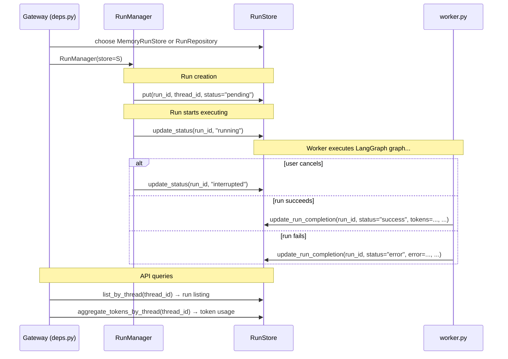
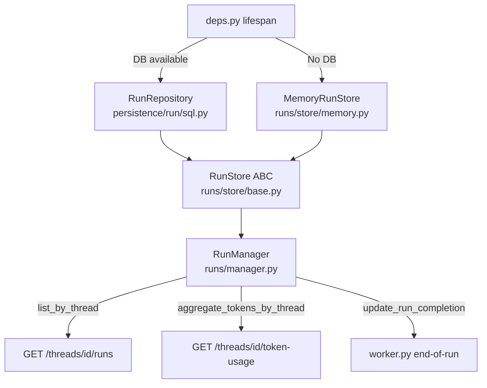
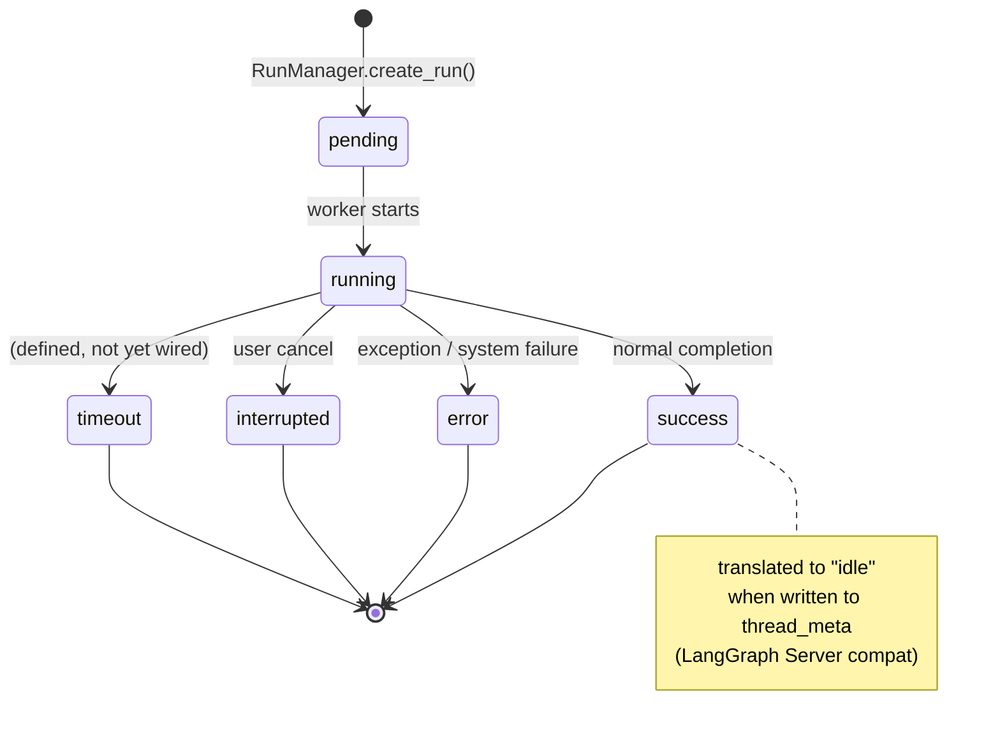

# 07d — Run Storage (Phase 5)

## Purpose

The run storage layer provides the **persistent identity record** for every agent run. Where the run event store (Phase 4) is the run's diary — a granular, append-only stream of what happened — the run store is the run's **ID card**: a single mutable record per run tracking lifecycle status, token totals, and convenience fields like first/last message previews.

Three files make up this layer:

- `runtime/runs/schemas.py` — vocabulary: the enums that describe a run's state and SSE disconnect behaviour
- `runtime/runs/store/base.py` — the abstract `RunStore` interface that `RunManager` depends on
- `runtime/runs/store/memory.py` — the in-memory implementation (default backend; used in tests)

The SQLAlchemy-backed implementation (`persistence/run/sql.py` → `RunRepository`) is the production backend and is covered in Section 18.

---

## Key Files

- `backend/packages/harness/deerflow/runtime/runs/schemas.py` — `RunStatus` and `DisconnectMode` enums
- `backend/packages/harness/deerflow/runtime/runs/store/base.py` — abstract `RunStore` ABC
- `backend/packages/harness/deerflow/runtime/runs/store/memory.py` — in-memory `MemoryRunStore`
- `backend/packages/harness/deerflow/persistence/run/sql.py` — SQLAlchemy `RunRepository` (Section 18)
- `backend/packages/harness/deerflow/runtime/runs/manager.py` — consumes `RunStore`; holds live state

---

## Important Concepts

### RunStatus — the run lifecycle state machine

`RunStatus` is a `StrEnum` with six values:

```
pending → running → success
                  → error
                  → timeout
                  → interrupted
```

- `interrupted` = user-requested stop (deliberate); `error` = system/exception failure. They are tracked separately for UI display and metrics.
- `timeout` is defined and exported but **no current callsite in `worker.py` or `manager.py` writes it**. It may be set externally (e.g., by the channels system via a `runs.wait()` deadline), or it is reserved infrastructure.
- `StrEnum` means enum values compare equal to raw strings: `RunStatus.success == "success"`. This eliminates `.value` calls when serialising to JSON or writing to the database.

### DisconnectMode — SSE consumer behaviour on disconnect

```python
cancel    # terminate the background LangGraph task
continue_ # keep the run alive even after the SSE client drops
```

- The default in both `manager.py` and `services.py` is `cancel`.
- The trailing `_` on `continue_` avoids shadowing Python's `continue` keyword. The wire value is `"continue"` (no underscore).
- `services.py:273` maps incoming HTTP string `"cancel"/"continue"` to this enum at the API boundary.

### RunStatus.success → `"idle"` translation

When a successful run writes its outcome to `thread_meta`, `RunStatus.success` is remapped:

```python
# worker.py:397
final_status = "idle" if record.status == RunStatus.success else record.status.value
await thread_store.update_status(thread_id, final_status)
```

This translates `"success"` to `"idle"` to match the **LangGraph Server API's thread-status vocabulary**. So `RunStatus` is a run-internal status; the thread-level status exposed externally speaks a different dialect.

### RunManager / RunStore split

`RunManager` and `RunStore` are deliberately separated:

|              | RunManager                                                | RunStore                                                |
| ------------ | --------------------------------------------------------- | ------------------------------------------------------- |
| **Holds**    | Live mutable state                                        | Serialisable metadata                                   |
| **Contents** | `asyncio.Task`, `asyncio.Event`, abort flags, `RunRecord` | run_id, status str, token counts, error message         |
| **Lifetime** | In-process only                                           | Survives restarts (with DB backend)                     |
| **Optional** | No — always exists                                        | Yes — `RunManager(store=None)` works (loses durability) |

`RunStore` is passed into `RunManager` at startup by `deps.py`, which picks the right implementation based on whether a DB session factory is available.

### The `RunStore` interface — 7 methods

| Method                       | Purpose                                                              | Timing                              |
| ---------------------------- | -------------------------------------------------------------------- | ----------------------------------- |
| `put`                        | Create a new run record                                              | Run creation (`pending`)            |
| `get`                        | Fetch a single record by run_id                                      | Any read                            |
| `list_by_thread`             | All runs for a thread (newest-first, optional user filter)           | Thread run listing                  |
| `update_status`              | Lightweight status mutation                                          | Each status transition during a run |
| `delete`                     | Remove a run record                                                  | Thread deletion                     |
| `update_run_completion`      | Final write — status + full token breakdown + message previews       | Once, at run end                    |
| `list_pending`               | Crash-recovery query: "all pending runs before timestamp X"          | Not yet triggered in production     |
| `aggregate_tokens_by_thread` | Sum token usage across a thread's completed runs by model and caller | `GET /threads/{id}/token-usage`     |

### `status` is a raw `str`, not `RunStatus`

Every `RunStore` method takes `status: str` rather than `RunStatus`. This is intentional — the store layer has no dependency on `runtime.runs.schemas`. Conversion happens at the callsite: `worker.py:377` passes `record.status.value`.

### `update_run_completion` — the run's final observability record

The richest method in the interface. Called once by `worker.py` at run end:

```python
await run_manager.update_run_completion(
    run_id,
    status=record.status.value,
    total_input_tokens=...,
    total_output_tokens=...,
    total_tokens=...,
    llm_call_count=...,
    lead_agent_tokens=...,   # ← per-caller breakdown
    subagent_tokens=...,
    middleware_tokens=...,
    message_count=...,
    first_human_message=..., # ← UI preview fields
    last_ai_message=...,
)
```

Token attribution at three granularities (`lead_agent`, `subagent`, `middleware`) lets you debug where tokens went in a multi-agent run — it's observability, not just billing. The `first_human_message` / `last_ai_message` fields enable conversation previews without re-fetching the message stream.

### `list_pending` — crash-recovery infrastructure

```python
async def list_pending(self, *, before: str | None = None) -> list[dict[str, Any]]:
```

The `before` ISO timestamp is designed for the query: _"give me all pending runs that existed before the process restarted."_ Both `MemoryRunStore` and `RunRepository` implement it, and it is fully tested — but **no production code path calls it from outside the store**. The crash-recovery orchestration in `RunManager` is not yet wired up.

---

## RunEventStore vs RunStore — the key distinction

These two stores are often confused. They serve complementary but distinct roles:

|                 | RunEventStore                                               | RunStore                                                  |
| --------------- | ----------------------------------------------------------- | --------------------------------------------------------- |
| **Unit**        | One record per **event** during a run                       | One record per **run**                                    |
| **Cardinality** | Many per run (every tool call, token event, message delta…) | Exactly one per run                                       |
| **Mutability**  | Append-only (events never change)                           | Mutable (status transitions throughout lifetime)          |
| **Written**     | Continuously during execution                               | At creation and at termination                            |
| **Answers**     | _"What happened step by step?"_                             | _"What is this run and how did it end?"_                  |
| **Powers**      | `GET /runs/{id}/events`, `GET /runs/{id}/messages`          | `GET /threads/{id}/runs`, `GET /threads/{id}/token-usage` |
| **Backends**    | Memory, JSONL, DB                                           | Memory, SQLAlchemy                                        |

**Their relationship** — RunStore holds the compressed result of what RunEventStore tracked:

```
RunEventStore                           RunStore
──────────────────────────────          ─────────────────────────────────
event: token_usage(lead, 120)   ──→
event: token_usage(subagent, 80)──→     update_run_completion(
event: tool_call: bash          ──→       lead_agent_tokens=120,
event: tool_result              ──→       subagent_tokens=80,
event: message_delta × 40       ──→       total_tokens=200, ...
                                 ──→     )
```

RunEventStore is the **diary**; RunStore is the **summary on the cover**.

---

## MemoryRunStore — implementation notes

The in-memory implementation is a plain `dict[run_id → record_dict]`. No lock needed — all methods are `async` with no `await` inside the hot path, so asyncio's single-threaded event loop prevents concurrent mutations.

**Behaviours to know:**

- **`put` always overwrites** — calling `put` twice on the same `run_id` reinitialises the entire record. `created_at` is preserved only if the caller explicitly provides it.

- **`list_by_thread` is newest-first** — `reverse=True` sort. `user_id=None` bypasses user filtering (single-user / no-auth mode).

- **`update_run_completion` silently drops `None` kwargs** — you cannot clear a field to `None` via this method. `None` values are dropped rather than written. This is asymmetric with `put`, which stores `None` for absent fields.

- **`list_pending` is oldest-first (FIFO)** — ascending `created_at` sort, the opposite of `list_by_thread`. The `before` timestamp comparison works because ISO 8601 strings sort lexicographically when all timestamps are UTC.

- **`aggregate_tokens_by_thread` excludes `interrupted` and `timeout` runs** — only `success` and `error` runs contribute to token counts. Tokens consumed by a run that was interrupted or timed out are silently dropped from thread-level reporting.

### The dict schema (canonical definition from `put`)

`MemoryRunStore.put()` is the canonical definition of the `RunStore` record schema — there is no Pydantic model:

```python
{
    "run_id": str,
    "thread_id": str,
    "assistant_id": str | None,
    "user_id": str | None,
    "model_name": str | None,
    "status": str,              # "pending" | "running" | "success" | "error" | ...
    "multitask_strategy": str,  # "reject" | "enqueue" | "interrupt"
    "metadata": dict,
    "kwargs": dict,
    "error": str | None,
    "created_at": str,          # ISO 8601 UTC
    "updated_at": str,          # ISO 8601 UTC
}
# Fields added by update_run_completion:
# total_tokens, total_input_tokens, total_output_tokens, llm_call_count,
# lead_agent_tokens, subagent_tokens, middleware_tokens,
# message_count, first_human_message, last_ai_message
```

`RunRepository` (SQLAlchemy) explicitly remaps its ORM columns to match these key names — the dict layout is the implicit cross-implementation contract.

---

## Execution Flow



---

## Architecture Diagrams

### RunStore implementations and wiring



### RunStatus state machine



---

## My Insights

**The `RunStore` / `RunManager` split is clean but has a subtle seam.** `RunManager` holds the live `RunRecord` dataclass (with `asyncio.Task` etc.); `RunStore` holds a plain dict shadow of it. When a run ends, `worker.py` reads from the live `RunRecord` and writes a compressed version to the store. There is no automatic sync — the two representations can diverge if a code path updates one but forgets the other.

**`StrEnum` is doing quiet heavy lifting.** The fact that `RunStatus.success == "success"` is True means the same value flows from the in-memory `RunRecord`, through `worker.py`'s `.value` call, into the store's `status: str` column, and back out in JSON responses — all without explicit serialisation. The only exception is the `success → "idle"` translation for `thread_meta`, which is the one place the two vocabularies diverge.

**`list_pending` is a confidence signal.** Its presence — fully implemented and tested in both backends — tells you that crash recovery was designed-for, not an afterthought. The infrastructure is complete; what's missing is the orchestration layer in `RunManager` that would call it on startup and re-queue stale pending runs.

**Token exclusion for `interrupted`/`timeout` is a silent data loss.** A user who cancels a long-running subagent chain will have consumed real tokens, but those tokens won't appear in the thread-level token usage report. Whether this is intentional (incomplete runs shouldn't count) or an oversight is worth clarifying before building billing or quota features on top of `aggregate_tokens_by_thread`.

---

## Open Questions

- `RunStatus.timeout` is defined but never written. Which system component is expected to set it?
- `list_pending` is fully implemented but never called in production. Is crash-recovery on the roadmap, or is this vestigial?
- Token counts for `interrupted`/`timeout` runs are excluded from `aggregate_tokens_by_thread`. Is this intentional?
- `RunStore` returns `dict[str, Any]` with no formal schema. Should this be formalised as a Pydantic model?

---

## Links to Related Sections

- [[07c-runtime-events]] — RunEventStore (the run's diary); compare and contrast with RunStore (the run's ID card)
- [[07b-checkpointer-store]] — LangGraph graph state persistence; orthogonal to run metadata
- [[07a-runtime-primitives]] — `RunJournal`, `user_context`, `serialization` — primitives consumed by the run system
- Section 18 (Persistence Layer) — `RunRepository` SQLAlchemy implementation of `RunStore`
- Section 07 Phase 7 — `manager.py` and `worker.py` — the callers that drive `RunStore` mutations
