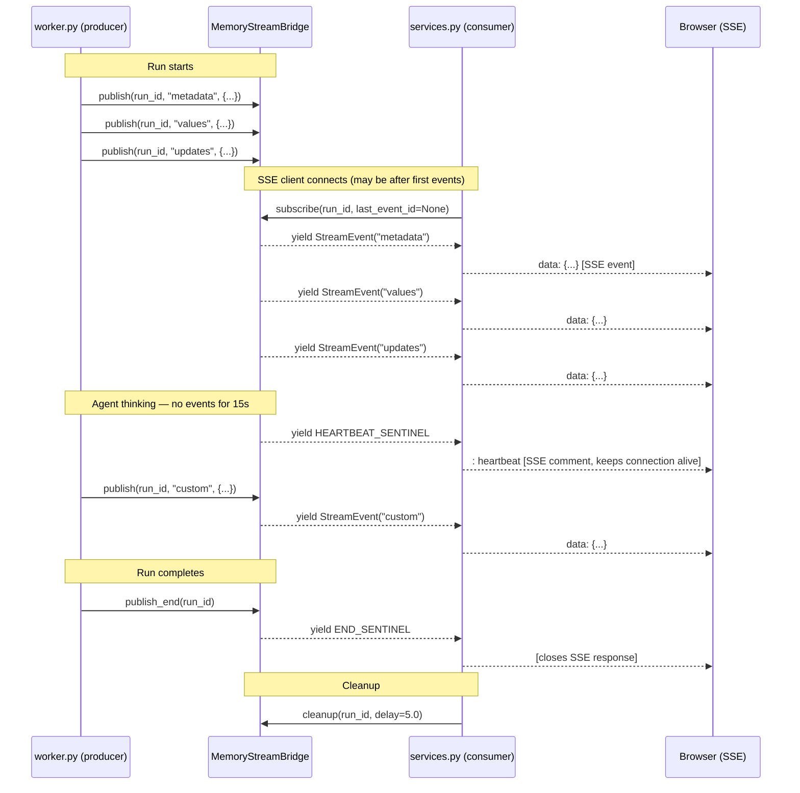
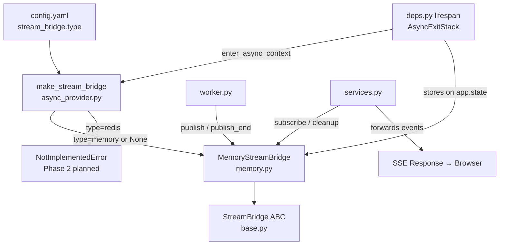
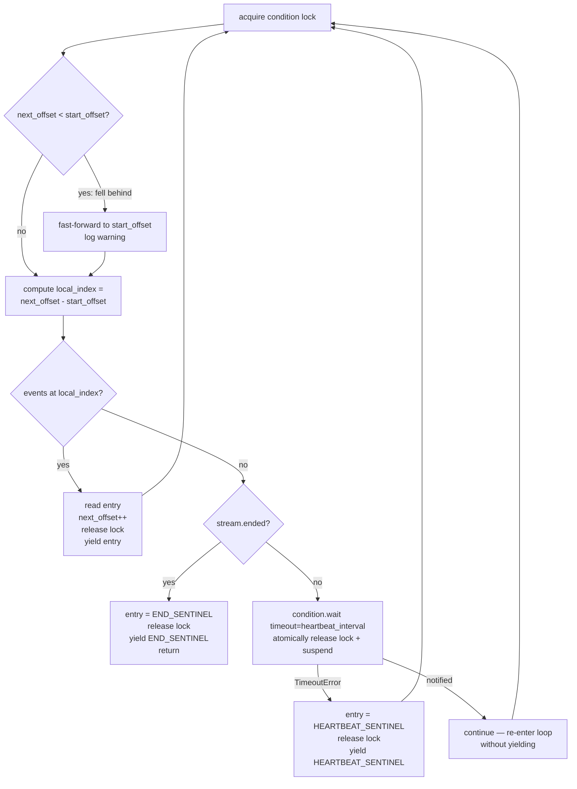

# 07e — Stream Bridge (Phase 6)

## Purpose

The StreamBridge is the **async decoupling layer between agent workers and SSE endpoints**. When a user submits a chat message, the Gateway starts two independent coroutines: a background agent worker that runs the LangGraph graph and produces events, and an SSE HTTP handler that reads those events and forwards them to the browser. StreamBridge is the queue that sits between them.

Without StreamBridge, the producer and consumer would be tightly coupled — the agent would have to know about the HTTP connection, the HTTP handler would have to drive the agent directly, and reconnections would be impossible. StreamBridge makes them fully independent: the agent publishes into a named channel (`run_id`), the SSE handler subscribes to that channel, and neither knows anything about the other.

The design is explicitly modelled after **LangGraph Platform's Queue + StreamManager architecture**.

Three files make up this subsystem:

- `runtime/stream_bridge/base.py` — the abstract protocol: `StreamBridge` ABC, `StreamEvent` dataclass, and the two sentinel values
- `runtime/stream_bridge/memory.py` — the concrete in-process implementation backed by an `asyncio.Condition`-guarded event log
- `runtime/stream_bridge/async_provider.py` — the async context manager factory that owns the bridge's lifecycle

---

## Key Files

- `backend/packages/harness/deerflow/runtime/stream_bridge/base.py` — `StreamBridge` ABC, `StreamEvent`, `HEARTBEAT_SENTINEL`, `END_SENTINEL`
- `backend/packages/harness/deerflow/runtime/stream_bridge/memory.py` — `MemoryStreamBridge` and `_RunStream`
- `backend/packages/harness/deerflow/runtime/stream_bridge/async_provider.py` — `make_stream_bridge()` factory
- `backend/packages/harness/deerflow/config/stream_bridge_config.py` — `StreamBridgeConfig` (type, redis_url, queue_maxsize)
- `backend/app/gateway/deps.py` — wires `make_stream_bridge()` into the Gateway lifespan via `AsyncExitStack`
- `backend/app/gateway/services.py` — the SSE consumer that calls `bridge.subscribe()` and interprets sentinels
- `backend/packages/harness/deerflow/runtime/runs/worker.py` — the agent worker that calls `bridge.publish()` and `bridge.publish_end()`
- `backend/tests/test_stream_bridge.py` — 12 unit tests covering publish/subscribe, heartbeat, eviction, reconnect, and concurrent runs

---

## Important Concepts

### StreamEvent — the envelope

```python
@dataclass(frozen=True)
class StreamEvent:
    id: str    # monotonically increasing "{timestamp_ms}-{seq}"
    event: str # "metadata" | "updates" | "values" | "events" | "error" | "end"
    data: Any  # JSON-serialisable payload
```

`frozen=True` matters: events travel from the producer into the ring buffer and out to the consumer — immutability removes any need for a mutex around the event object itself. Only the container (`stream.events` list) needs synchronisation.

The `id` field maps to the SSE `id:` header. The browser uses it as `Last-Event-ID` when reconnecting, so the server knows which events to replay.

### Sentinels — in-band signals

```python
HEARTBEAT_SENTINEL = StreamEvent(id="", event="__heartbeat__", data=None)
END_SENTINEL       = StreamEvent(id="", event="__end__",       data=None)
```

These are module-level singletons. They are **never forwarded to the browser as data events** — the SSE consumer in `services.py` intercepts them:

- `HEARTBEAT_SENTINEL` → sends an SSE comment `": heartbeat"` to keep the connection alive through proxies
- `END_SENTINEL` → breaks out of the subscriber loop and closes the SSE response

Both have `id=""` so they don't advance the client's `Last-Event-ID` cursor. The dunder naming (`__heartbeat__`, `__end__`) prevents collision with real LangGraph event names like `"metadata"` or `"updates"`.

### The abstract interface — five methods

```python
class StreamBridge(abc.ABC):
    async def publish(run_id, event, data)          # producer side
    async def publish_end(run_id)                   # signal: no more events
    def subscribe(run_id, *, last_event_id, heartbeat_interval) -> AsyncIterator[StreamEvent]
    async def cleanup(run_id, *, delay=0)           # release per-run resources
    async def close()                               # release all resources (no-op by default)
```

**`publish` vs `publish_end` are separate methods** so implementations can close the underlying queue channel on end, rather than just enqueue another named event. The worker calls `publish_end()` when the LangGraph graph finishes.

**`subscribe` is `def`, not `async def`** — the abstract declares a synchronous factory that returns an `AsyncIterator`. This lets concrete implementations be either async generators (the memory impl uses `async def` + `yield`) or objects implementing `__aiter__`/`__anext__`. The concrete `MemoryStreamBridge.subscribe` is `async def`, which works because calling an async generator function returns an `AsyncGenerator`, a subtype of `AsyncIterator`.

**`cleanup(delay=)` has a delay parameter** to handle the race between producer and consumer: the worker calls `cleanup()` immediately after `publish_end()`, but the SSE consumer may still be draining remaining events. A non-zero delay (e.g. 5 seconds) holds the resources open for late consumers.

### `_RunStream` — per-run state bundle

```python
@dataclass
class _RunStream:
    events:       list[StreamEvent]  # retained ring buffer
    condition:    asyncio.Condition  # producer notifies, consumer waits
    ended:        bool               # set by publish_end()
    start_offset: int                # absolute position of events[0] in run history
```

`start_offset` is the key to understanding the ring buffer. It is the **absolute position of `events[0]` in the run's total event history**. Every time an event is evicted from the front of the buffer, `start_offset` increments by the number of evicted events. This lets the subscriber express its position as an absolute run-wide offset (`next_offset`) and convert it to a slice index with:

```python
local_index = next_offset - stream.start_offset
```

If `next_offset < stream.start_offset`, the subscriber has fallen so far behind that the buffer evicted events it hadn't read yet. The implementation logs a warning and fast-forwards to `stream.start_offset`.

### SSE reconnection — `_resolve_start_offset`

When a browser disconnects and reconnects, it sends the `Last-Event-ID` header. `subscribe(last_event_id=...)` passes it to `_resolve_start_offset`:

```python
def _resolve_start_offset(stream, last_event_id):
    if last_event_id is None:
        return stream.start_offset          # start from earliest retained

    for index, entry in enumerate(stream.events):
        if entry.id == last_event_id:
            return stream.start_offset + index + 1  # resume from NEXT event

    # not found — evicted from the ring buffer
    logger.warning("last_event_id not found; replaying from earliest retained")
    return stream.start_offset
```

Linear scan through the retained buffer. If found, the subscriber resumes from the event immediately after the last-seen one. If the event was evicted (buffer overflowed since the disconnect), it falls back to the earliest retained event — best-effort replay, no crash.

### Why the lock is needed even for reads — the lost-wakeup problem

`subscribe` acquires `stream.condition` on every iteration even when it's only reading. This is not about protecting writes — it's about making **check-then-wait atomic**.

Without the lock:

```
Consumer: checks events → empty, not ended → decides to wait
                 ↕  ← asyncio switches coroutines here
Producer: appends event → calls notify_all() → nobody waiting → notify is lost
                 ↕
Consumer: calls wait() → suspends forever even though the event is there
```

This is the **lost-wakeup bug**. The `asyncio.Condition` prevents it by making the transition from "I checked and found nothing" to "I am now waiting" a single uninterruptible operation:

```
Consumer: acquire lock
Consumer: check events → empty
Consumer: call wait() → atomically release lock + suspend  (no gap)
Producer: acquire lock (now possible)
Producer: append event, notify_all()
Producer: release lock
Consumer: woken → re-acquire lock → check again → finds event
```

`condition.wait()` requires the lock to be held before calling. It then atomically releases the lock and suspends. Because the producer's `notify_all()` also requires the lock, it can only fire after the consumer has fully entered the wait state.

The multi-field read (`start_offset` + `events[local_index]`) also benefits from the lock. A producer evicting events updates both `start_offset` and the `events` list. Reading them in separate lock acquisitions could produce an inconsistent view — e.g., a stale `start_offset` with a freshly-trimmed `events`, giving an out-of-bounds `local_index`.

---

## Concrete Dry Run

**Setup:** `bridge = MemoryStreamBridge(queue_maxsize=3)`, `run_id = "run-abc"`.
The buffer is intentionally tiny (3 events) to show eviction.

### Step 0 — Construction

```python
bridge._maxsize  = 3
bridge._streams  = {}
bridge._counters = {}
```

No runs yet. The bridge is an empty registry.

---

### Step 1 — `publish("run-abc", "metadata", {...})`

`_get_or_create_stream("run-abc")` creates a fresh `_RunStream`:

```
events       = []
condition    = asyncio.Condition()
ended        = False
start_offset = 0
```

`_next_id("run-abc")` generates `"1717000000000-0"` (`{timestamp_ms}-{seq}`).

Under the condition lock: append E0, len=1 ≤ 3 so no eviction, `notify_all()` (nobody is waiting yet — no-op).

```
events       = [E0("1717000000000-0", "metadata")]
start_offset = 0
```

---

### Steps 2–3 — Two more publishes: buffer fills

```python
await bridge.publish("run-abc", "values",  {...})   # → E1
await bridge.publish("run-abc", "updates", {...})   # → E2
```

```
events       = [E0("metadata"), E1("values"), E2("updates")]
start_offset = 0
len = 3 = maxsize, no eviction
```

---

### Step 4 — `publish()`: fourth event triggers ring buffer eviction

```python
await bridge.publish("run-abc", "custom", {"text": "Hello"})  # → E3
```

Inside the lock:

```python
stream.events.append(E3)
# len = 4, maxsize = 3 → overflow = 1
del stream.events[:1]     # removes E0 ("metadata")
stream.start_offset += 1  # 0 → 1
```

```
events       = [E1("values"), E2("updates"), E3("custom")]
start_offset = 1      ← E1 is now at absolute position 1
```

E0 is gone. A reconnecting client whose `Last-Event-ID` was E0's id would get a warning and be replayed from E1.

---

### Step 5 — `subscribe("run-abc", last_event_id=None)`: SSE endpoint connects

`subscribe` is an async generator. Calling it returns a generator object; execution begins at the first `async for` iteration.

**Initial offset resolution** (under the lock):

```python
next_offset = _resolve_start_offset(stream, None)
# last_event_id is None → return stream.start_offset = 1
```

**Loop iteration 1** (acquire lock):

```python
local_index = 1 - 1 = 0   # → events[0] = E1
entry = E1("values")
next_offset = 2
```

Release lock. **Yield E1** to the SSE consumer.

**Loop iteration 2:**

```python
local_index = 2 - 1 = 1   # → events[1] = E2
entry = E2("updates")
next_offset = 3
```

**Yield E2.**

**Loop iteration 3:**

```python
local_index = 3 - 1 = 2   # → events[2] = E3
entry = E3("custom")
next_offset = 4
```

**Yield E3.**

**Loop iteration 4 — subscriber catches up, nothing to read:**

```python
local_index = 4 - 1 = 3   # 3 < len(events) (3)? NO
# stream.ended? NO
# → wait branch:
await asyncio.wait_for(stream.condition.wait(), timeout=15.0)
# condition.wait() atomically RELEASES the lock and SUSPENDS this coroutine
```

The consumer is now suspended. The event loop is free to run other coroutines.

---

### Step 6 — `publish()` while consumer is waiting

The agent emits another event:

```python
await bridge.publish("run-abc", "updates", {"step": 2})  # → E4
```

`len(events)` becomes 4, overflow=1 → evicts E1:

```
events       = [E2("updates"), E3("custom"), E4("updates/step2")]
start_offset = 2
```

`notify_all()` **wakes the subscriber**.

**Back in the wait branch** — `condition.wait()` returns (notified, not timed out):

```python
else:
    continue   # re-enter loop WITHOUT yielding
```

**Next iteration** (re-check under the lock):

```python
# next_offset (4) < start_offset (2)? No
local_index = 4 - 2 = 2   # → events[2] = E4
entry = E4("updates/step2")
next_offset = 5
```

**Yield E4.**

> The `continue` on notify (not timeout) is critical. The subscriber must re-enter the lock and re-check state before yielding — the notify could have come from either `publish()` (new event) or `publish_end()` (stream over). Yielding blindly without re-checking would be wrong.

---

### Step 7 — Heartbeat: agent is thinking, nothing arrives for 15 seconds

```python
await asyncio.wait_for(stream.condition.wait(), timeout=15.0)
# TimeoutError raised
entry = HEARTBEAT_SENTINEL
```

Release lock. `entry is END_SENTINEL`? No. **Yield `HEARTBEAT_SENTINEL`.**

`services.py` receives it, sends `": heartbeat"` SSE comment to the browser — keeps the connection alive through load balancers. Does not forward the sentinel as a data event.

---

### Step 8 — `publish_end("run-abc")`: agent finishes

```python
async with stream.condition:
    stream.ended = True
    stream.condition.notify_all()
```

**Back in subscribe** — notified → `continue` → next iteration:

```python
local_index = 5 - 2 = 3   # 3 < 3? NO
# stream.ended? YES
entry = END_SENTINEL
```

Release lock.

```python
if entry is END_SENTINEL:
    yield END_SENTINEL   # outside the lock
    return               # terminates the async generator
```

The SSE consumer receives `END_SENTINEL`, breaks its loop, closes the HTTP response.

---

### Step 9 — `cleanup("run-abc", delay=5.0)`

```python
await asyncio.sleep(5.0)          # give late subscribers time to drain
self._streams.pop("run-abc", None)
self._counters.pop("run-abc", None)
```

State after cleanup:

```
bridge._streams  = {}
bridge._counters = {}
```

The event log is gone. Any reconnect after this point starts a fresh `_RunStream`.

---

### Step 10 — `close()`: app shutdown

`make_stream_bridge()`'s `finally` block fires:

```python
self._streams.clear()
self._counters.clear()
```

Clears all remaining runs in one shot — equivalent to cleanup on every run without per-run delays.

---

### Full Lifecycle

```
bridge = MemoryStreamBridge()

publish("run-abc", ...)   ─┐
publish("run-abc", ...)    ├─ producer (agent worker)
publish_end("run-abc")    ─┘

subscribe("run-abc")      ─┐
  ← yields events           ├─ consumer (SSE handler)
  ← yields HEARTBEAT        │
  ← yields END_SENTINEL     │
  returns                  ─┘

cleanup("run-abc", delay=5)
close()   # on app shutdown
```

---

## Execution Flow



---

## Architecture Diagrams

### Component wiring



### Subscribe loop state machine



---

## My Insights

**The sentinel interception pattern is elegantly simple.** Rather than adding a separate signalling channel (a separate queue, a boolean flag passed through the iterator), the bridge uses in-band sentinel objects. The consumer can tell them apart with an `is` identity check — no string comparison, no type check. Because `StreamEvent` is frozen and the sentinels are module-level singletons, identity is guaranteed: `entry is END_SENTINEL` will never produce a false positive from a look-alike event.

**The ring buffer `start_offset` design handles the inevitable late-subscriber case correctly.** In production, the agent worker starts before the browser's SSE connection arrives. By the time the SSE handler calls `subscribe()`, there may already be several events in the buffer. The absolute-offset design means the subscriber can start from the earliest retained event seamlessly, without the producer knowing or caring that it started late.

**The `continue` on notify (not yield) is subtle but essential.** When `condition.wait()` returns because the producer called `notify_all()`, the subscriber loops again without yielding anything. This is the correct behaviour: the notify might have come from `publish()` (a new event) or from `publish_end()` (the stream ended). By re-entering the lock and re-checking both conditions, the subscriber handles both cases correctly with one code path. A naive implementation that yielded on every wake-up would produce spurious or incorrect events.

**The lock protects check-then-wait, not just writes.** The counter-intuitive insight is that the `asyncio.Condition` lock is held during reads too — not to prevent data races on individual reads (asyncio is single-threaded), but to make the sequence "I checked and found nothing → I am now waiting" atomic. Without this atomicity, a producer notification can fire in the gap between check and wait, and the subscriber sleeps forever even though there's an event waiting. This is the **lost-wakeup bug**, and `asyncio.Condition` exists specifically to prevent it.

**The Redis placeholder is a scaling signal.** The config type enum has `"memory" | "redis"`, and `StreamBridgeConfig` already has a `redis_url` field. The architecture was designed for multi-process horizontal scaling from the start. `MemoryStreamBridge` is single-process — if the Gateway runs multiple worker processes (e.g. under Gunicorn), an SSE subscriber on worker-2 cannot see events published by the agent running on worker-1. Redis Streams would solve this. The current default is single-process, making the in-memory bridge sufficient.

**The stale docstring in `async_provider.py`** shows a pre-refactor import path: `from deerflow.agents.stream_bridge import make_stream_bridge`. The module was moved from `agents/` to `runtime/` at some point. The correct path is `from deerflow.runtime import make_stream_bridge`. This is a minor but navigating hazard.

---

## Open Questions

- Redis backend is "Phase 2" — is it on the active roadmap? What's the target deployment topology that would require it (K8s multi-pod, Gunicorn multi-worker)?
- `cleanup(delay=5.0)` — the 5-second default is a magic number. What is it calibrated against? Is there an upper bound on how long the SSE consumer might take to drain after `publish_end()`?
- `notify_all()` is used throughout even though there's typically only one subscriber per run. Is multiple-subscriber-per-run a supported or tested scenario (e.g. `GET /runs/{id}/join` while the original SSE stream is still open)?
- The `_resolve_start_offset` fallback (evicted ID → replay from earliest retained) silently skips events. Should this be surfaced to the client as an error event so it knows the stream is incomplete?

---

## Links to Related Sections

- [[07d-run-storage]] — `RunStore` tracks the run's identity and final status; StreamBridge delivers the run's real-time event stream
- [[07c-runtime-events]] — `RunEventStore` persists all run events to DB/JSONL for replay; StreamBridge delivers them live to the current SSE consumer
- [[07b-checkpointer-store]] — orthogonal persistence layer for LangGraph graph state checkpoints
- [[07a-runtime-primitives]] — `user_context`, `serialization`, `converters` — primitives consumed by the worker that publishes to StreamBridge
- Section 07 Phase 7 — `worker.py` (the producer that calls `publish`/`publish_end`) and `manager.py` (the coordinator that wires worker + bridge)
- Section 05 — `services.py` and `routers/thread_runs.py` — the SSE consumer that calls `bridge.subscribe()`
