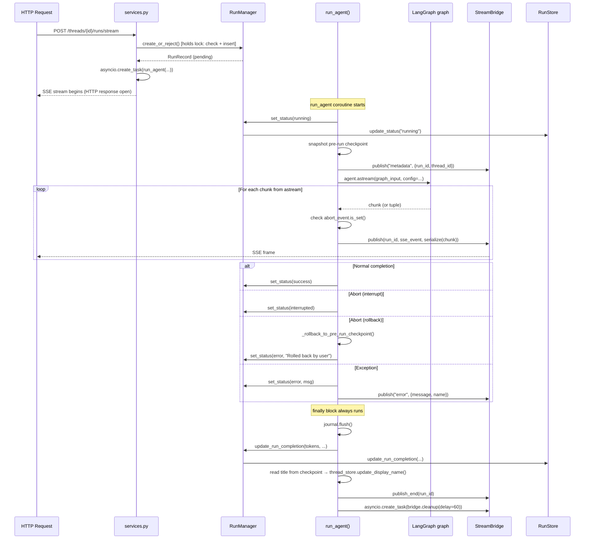
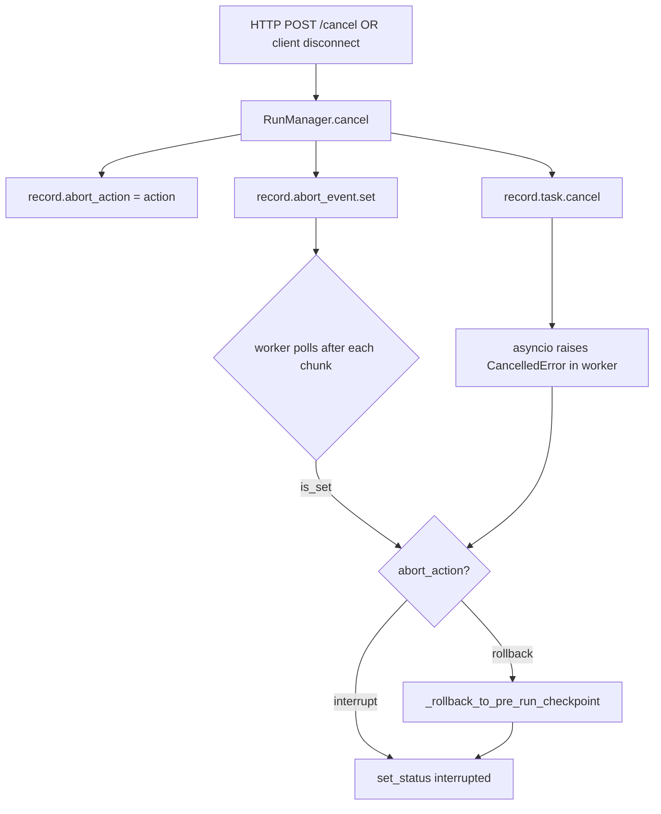
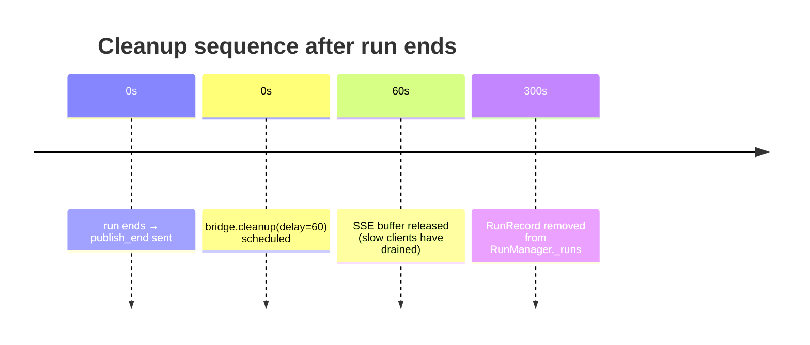

# Run Orchestration — `runtime/runs/`

## Purpose

This is the top of the runtime call stack. `RunManager` tracks every agent run that is alive in the process (pending, running, or recently completed), while `run_agent()` is the coroutine that actually executes a single run inside LangGraph. Together they implement the full lifecycle: create → stream → abort/complete → persist → clean up.

## Key Files

- `manager.py` — In-memory run registry (`RunManager`) with optional `RunStore` backing; owns `RunRecord` which holds both live state (asyncio.Task, asyncio.Event) and serialisable metadata.
- `worker.py` — `run_agent()` coroutine: fires the LangGraph agent, routes streamed chunks to the SSE bridge, handles cooperative abort and checkpoint rollback, and flushes the journal in `finally`.

## Important Concepts

### RunRecord — the live run object

`RunRecord` is a mutable dataclass that merges two kinds of state that can never both live in the database:

| Field          | Type            | Notes                                                                         |
| -------------- | --------------- | ----------------------------------------------------------------------------- |
| `task`         | `asyncio.Task`  | The background coroutine handle; `repr=False` to keep logs clean              |
| `abort_event`  | `asyncio.Event` | Worker polls this between chunks for cooperative cancellation                 |
| `abort_action` | `str`           | `"interrupt"` or `"rollback"` — what to do when the event fires               |
| `status`       | `RunStatus`     | Mirrored to the store on every transition                                     |
| `model_name`   | `str \| None`   | Updated post-construction if the agent's allowlist resolves a different model |

### RunContext — DI container for worker infrastructure

`RunContext` is a frozen dataclass that bundles everything `run_agent` needs: `checkpointer`, `store`, `event_store`, `run_events_config`, `thread_store`, and `app_config`. It keeps `run_agent`'s call signature stable as new singletons are added. `deps.py` builds one per request from `app.state`.

### Two-tier persistence design

`RunManager` is the authoritative source of truth for live runs. `RunStore` (an abstract interface) is an optional mirror of serialisable fields only. This split exists because asyncio.Task and asyncio.Event cannot be serialised — they must stay in-process. The consequence: if the process restarts, all in-flight run state is lost; only the metadata that reached the store survives.

Persistence is always best-effort: every store call is wrapped in `try/except` and logs a warning on failure. A DB hiccup must never crash a live run.

### create_or_reject — atomic multitask enforcement

`services.py` always calls `create_or_reject` (not `create`) for HTTP-triggered runs. It holds the `asyncio.Lock` across both the inflight-check and the insert, eliminating the TOCTOU race that two concurrent requests would produce with separate check+insert steps.

Three strategies:

- `reject` — raises `ConflictError` if any pending/running run exists for the thread
- `interrupt` — cancels inflight runs (checkpoint kept), then inserts
- `rollback` — cancels inflight runs with rollback action, then inserts

### Cooperative cancellation and rollback

Abort is not preemptive. The worker polls `record.abort_event.is_set()` after each LangGraph chunk. A long LLM call cannot be interrupted mid-generation. Two outcomes when abort fires:

- `abort_action="interrupt"` → sets `RunStatus.interrupted`; checkpoint is kept (conversation state is preserved)
- `abort_action="rollback"` → calls `_rollback_to_pre_run_checkpoint()` to restore the checkpoint snapshot captured before the run started, effectively undoing the run

The pre-run snapshot (deep copy of the checkpoint tuple including `pending_writes`) is captured inside `run_agent` before `graph.astream()` starts. Rollback writes it back to the checkpointer with a fresh ID + timestamp so it becomes the unambiguously latest checkpoint.

If the thread had no checkpoint before the run, rollback calls `adelete_thread` to reset the thread to the empty state.

### Stream mode normalisation

`run_agent` normalises the requested `stream_modes` list:

- `"events"` is silently dropped — `graph.astream()` cannot produce events + values snapshots simultaneously; that requires `astream_events()` plus internal checkpoint callbacks only exposed in the JS LangGraph Platform server
- `"messages-tuple"` is remapped to LangGraph's internal `"messages"` mode

Two streaming paths:

- **Single mode, no subgraphs**: `astream()` yields raw chunks (not tuples) — cheaper unpacking
- **Multi-mode or subgraphs**: `astream()` yields `(mode, chunk)` or `(ns, mode, chunk)` tuples routed through `_unpack_stream_item()`

### LangGraph Runtime construction

`run_agent` must build the `langgraph.runtime.Runtime(context=…, store=store)` object manually and inject it via `config["configurable"]["__pregel_runtime"]`. LangGraph CLI does this automatically, but DeerFlow drives the graph directly via `agent.astream(config=…)` — bypassing the CLI path entirely.

`_build_runtime_context` assembles the context dict (`thread_id`, `run_id`, `app_config`, any caller-provided keys). `setdefault` is used throughout so a caller's `config["context"]` can extend but never override the worker-assigned `thread_id`/`run_id` — a security invariant with a dedicated unit test.

### Journal as a LangChain callback

`RunJournal` is attached to `config["callbacks"]`, not to a custom event bus. This means LangChain's standard callback mechanism (`on_llm_end`, `on_chain_start/end`) delivers token usage and lifecycle events to it automatically — no changes needed to agent or tool code.

### Two-stage cleanup

| Stage      | Trigger                   | Delay           | What is released                    |
| ---------- | ------------------------- | --------------- | ----------------------------------- |
| SSE bridge | worker `finally`          | 60 s            | In-memory event buffer for the run  |
| Run record | not yet wired in services | 300 s (default) | `RunRecord` from `RunManager._runs` |

The 60-second gap lets slow SSE clients drain the buffer before it is released. The 300-second gap lets clients poll `GET /runs/{id}` for run status after streaming ends — the record must outlive the buffer.

### Title sync

`TitleMiddleware` writes an auto-generated title to `channel_values["title"]` inside LangGraph state. The worker's `finally` block reads this from the post-run checkpoint and calls `thread_store.update_display_name(thread_id, title)` to surface it in the UI.

## Execution Flow

## Architecture Diagrams

### Abort signal flow

### cleanup timing

## My Insights

**The asymmetry between `cancel()` and `set_status()`**: `cancel()` updates `record.status` in-memory under the lock but deliberately skips the store write. It relies on the worker's `finally` block (via `set_status`) to do that write. This is intentional: cancel is a signal to the worker, not a final state. The worker — the only actor that knows whether abort was cooperative or via `CancelledError` — is the right place to record the final status.

**`list_by_thread` bug**: The docstring claims "newest first" and the comment describes a reversal, but the list comprehension does not reverse. The actual behaviour is oldest-first (dict insertion order). The unit tests confirm this. This is a documentation bug, not a code bug — callers relying on "newest first" would be silently getting oldest-first.

**`_extract_human_message` in worker.py is dead code**: Defined but never called in `run_agent` or any callers. It appears to be a leftover from when the journal manually recorded the initial human message event. Now that `RunJournal` operates as a LangChain callback, this helper is unreachable. Safe to remove.

**Why asyncio.Lock for an asyncio-only registry?**: Since all callers are on the same event loop thread, reads between `await` points are already safe without a lock. The lock's value is at mutations: `create_or_reject` must hold the lock across the inflight-check + insert as a single atomic unit to prevent TOCTOU races when two concurrent HTTP requests hit the same thread simultaneously.

## Open Questions

- `list_by_thread` ordering bug: should it return newest-first as documented? Does any caller depend on the current oldest-first behaviour?
- `_extract_human_message` in `worker.py`: when was it orphaned and is it safe to delete?
- The `"events"` stream_mode gap: is there a tracking issue for exposing this in the Python runtime without needing the internal checkpoint callback mechanism?
- `RunManager.cleanup` is not wired in `services.py` — the 300-second cleanup is never scheduled. Is run record cleanup handled elsewhere (e.g., a periodic sweep) or do records accumulate for the process lifetime?

## Links to Related Sections

- [[07d-run-storage]] — `RunStore` interface and `MemoryRunStore` that `RunManager` delegates persistence to
- [[07e-stream-bridge]] — `StreamBridge` that `run_agent` publishes chunks to
- [[07b-checkpointer-store]] — checkpointer that `run_agent` snapshots and restores for rollback
- [[07c-runtime-events]] — `RunJournal` and event store that `run_agent` initialises and flushes
- [[07a-runtime-primitives]] — `serialize()`, `user_context`, `converters` used within `run_agent`
