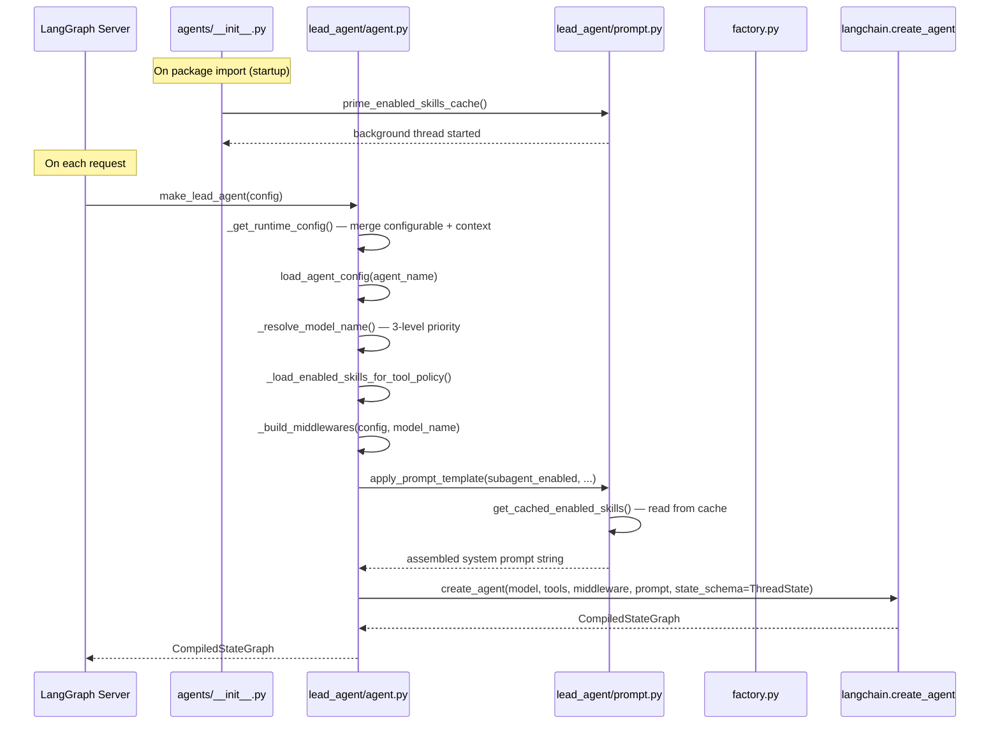
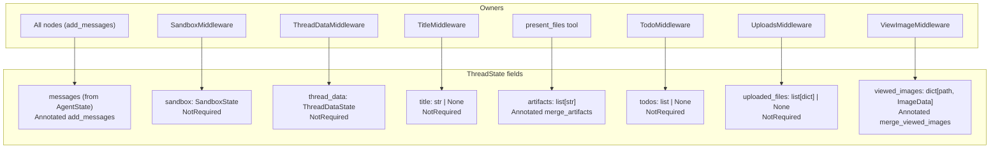
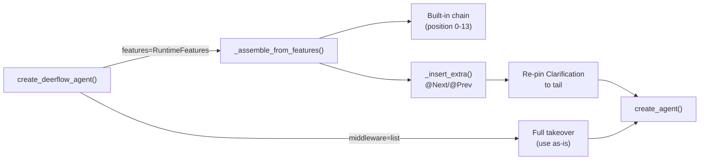

# Section 08a — Backend: Lead Agent (Index)

## Purpose

The lead agent is the core AI system of DeerFlow: the LangGraph graph that receives user messages, calls the LLM, executes tools, and returns responses. This section covers the full stack from the state schema that flows through the graph, to the feature flags and system prompt, to the agent factory and the SDK-level entry point.

The six files studied form a layered system:

```
__init__.py          ← import-time cache priming, public API surface
factory.py           ← SDK factory (config-free, argument-driven)
lead_agent/agent.py  ← LangGraph ABI factory (reads config.yaml, per-request)
lead_agent/prompt.py ← system prompt assembly + skills cache management
features.py          ← RuntimeFeatures dataclass + @Next/@Prev decorators
thread_state.py      ← ThreadState schema (shared by all graph nodes)
```

## Sub-files

- **[[08a-lead-agent]]** — this file: architecture overview, key concepts, execution flow, insights
- **[[08b-skills-cache-pipeline]]** — deep dive: how the two-level skills cache works, with full dry-run walkthroughs of startup, cache miss, and invalidation-under-load scenarios

## Key Files

- `backend/packages/harness/deerflow/agents/thread_state.py` — the LangGraph state schema: defines all fields visible to the lead agent, middlewares, and subagent executor during a run
- `backend/packages/harness/deerflow/agents/features.py` — `RuntimeFeatures` declarative feature flags and `@Next`/`@Prev` middleware-positioning decorators
- `backend/packages/harness/deerflow/agents/lead_agent/prompt.py` — system prompt assembly, thread-safe skills cache, and the prefix-cache optimization that keeps the prompt identical across users
- `backend/packages/harness/deerflow/agents/lead_agent/agent.py` — `make_lead_agent` (LangGraph ABI), `_build_middlewares`, model resolution, bootstrap vs. normal agent paths
- `backend/packages/harness/deerflow/agents/factory.py` — `create_deerflow_agent` (SDK entry point), `_assemble_from_features`, `_insert_extra` topological insertion
- `backend/packages/harness/deerflow/agents/__init__.py` — public API re-exports and import-time skills cache priming

## Important Concepts

### ThreadState — the shared state contract

`ThreadState` extends LangChain's `AgentState` (which provides `messages: Annotated[list, add_messages]`) and adds seven DeerFlow-specific fields. The key design decisions:

- **`NotRequired` vs `Annotated[T, reducer]`** — `NotRequired` fields use last-write-wins (owned by exactly one middleware); `Annotated` fields have explicit reducers for fields where multiple nodes can append concurrently (`artifacts`, `viewed_images`).
- **Sub-states as ownership boundaries** — `SandboxState` and `ThreadDataState` are nested TypedDicts that give each middleware a named slice, preventing field-name collisions across the 17-middleware chain.
- **The `merge_viewed_images` clear signal** — returning `viewed_images={}` is an in-band protocol: `ViewImageMiddleware` uses it to flush base64 blobs from state after injecting them into the model call, preventing accumulation across turns.
- **No `user_id` in state** — user identity flows through `runtime/user_context.py`'s async context variable, not the graph state. This prevents `user_id` from appearing in LangGraph checkpoints.

### Three-layer agent factory stack

```
langchain.agents.create_agent        ← raw primitive (model, tools, middleware list)
       ↑
deerflow.agents.factory.create_deerflow_agent  ← SDK layer (pure Python args, no config files)
       ↑
deerflow.agents.lead_agent.agent.make_lead_agent  ← app layer (reads config.yaml, LangGraph ABI)
```

Each layer adds a different kind of value:

- `create_agent` — the LangChain graph compilation primitive
- `create_deerflow_agent` — declarative feature assembly, tool deduplication, `@Next`/`@Prev` middleware positioning
- `make_lead_agent` — config resolution, model selection, per-user isolation, LangGraph server ABI

### `make_lead_agent` is called per-request

LangGraph calls `make_lead_agent(config)` on every graph invocation — not once at startup. A new agent graph is compiled per run. This enables per-request config injection (model, plan mode, subagent count, agent name) without any request-scoped state leaking between users. The performance cost is amortized by caching at lower layers (skills cache, MCP tools, prompt LRU cache).

The single-parameter `(config: RunnableConfig)` signature is the LangGraph Server ABI contract; a test asserts it explicitly. All runtime parameters (model name, feature flags) are carried inside the `RunnableConfig` dict, merged from `config["configurable"]` (LangGraph standard) and `config["context"]` (DeerFlow extension for the embedded client path).

### System prompt architecture — static by design

The system prompt assembled by `apply_prompt_template()` is kept **identical across all users and sessions**. Memory and the current date are excluded and instead injected per-turn by `DynamicContextMiddleware` as a `<system-reminder>` in the first HumanMessage.

This is a deliberate prefix-cache optimization: if the system prompt were unique per user (by embedding their memory or name), every user would bust every other user's LLM provider cache entry. By keeping the prompt identical, Anthropic prompt caching and OpenAI automatic caching hit on every request across all users.

### Skills cache — non-blocking with background refresh

The skills list (read from disk) is needed for every system prompt assembly. A naive implementation would block on disk I/O per request. Instead, a two-level cache keeps the request path completely non-blocking:

1. `prime_enabled_skills_cache()` fires at package import time (in `__init__.py`) — starts a background thread immediately
2. The background thread loads skills from disk asynchronously
3. `get_cached_enabled_skills()` returns `[]` on miss and fires the loader — never blocks the caller
4. `warm_enabled_skills_cache()` (called at startup) blocks up to 5 seconds to ensure the first request sees a warm cache

Cache invalidation uses a monotonic version counter with a compare-and-swap retry loop: if a new invalidation arrives while a load is in flight, the worker detects the version mismatch and reloads rather than committing a stale result.

A second level — `@lru_cache` on `_get_cached_skills_prompt_section` — caches the formatted XML string so the same skill list is never re-serialised between requests.

> For a full walkthrough with dry-run examples of all three scenarios (normal startup, cache miss, invalidation under load), see **[[08b-skills-cache-pipeline]]**.

### `RuntimeFeatures` + `@Next`/`@Prev` — declarative middleware assembly

`RuntimeFeatures` is a dataclass where each feature accepts `True` (use built-in default), `False` (skip), or an `AgentMiddleware` instance (custom override). `summarization` and `guardrail` use `Literal[False] | AgentMiddleware` — no built-in default exists, so `True` is rejected at the type level.

`@Next(AnchorClass)` and `@Prev(AnchorClass)` are class decorators that stamp `_next_anchor` / `_prev_anchor` as a class attribute. The factory reads these via `getattr` and uses a topological insertion algorithm to place `extra_middleware` relative to built-in middlewares. Cross-external anchoring is supported (A `@Next(B)` where B is also an extra) via an iterative multi-round approach.

### Bootstrap vs. normal agent path

`make_lead_agent` dispatches to one of two paths based on `is_bootstrap`:

|                  | Bootstrap                               | Normal                                                     |
| ---------------- | --------------------------------------- | ---------------------------------------------------------- |
| Purpose          | One-time custom agent creation          | All regular conversations                                  |
| Tool set         | `get_available_tools()` + `setup_agent` | `get_available_tools()` + `update_agent` (if custom agent) |
| Available skills | `{"bootstrap"}` only                    | Agent's configured skills, or all                          |
| Prompt           | No `agent_name`                         | Includes agent identity if custom                          |

### Skill policy — fail-closed

Before assembling tools, `_load_enabled_skills_for_tool_policy()` loads the skill list. `filter_tools_by_skill_allowed_tools()` then strips any tools not whitelisted in those skills' `allowed_tools` frontmatter. If skill metadata cannot be loaded, the exception propagates and `make_lead_agent` fails entirely rather than defaulting to unrestricted tool access.

## Execution Flow



## Architecture Diagrams





## My Insights

**The per-request factory is the right trade-off.** Caching a compiled graph as a singleton would make per-request config injection (model selection, feature flags, plan mode) impossibly complex — you'd need thread-local state or a completely different architecture. Recompiling the graph per-request, with caching at the right levels (skills, MCP, prompt), is cleaner and more flexible. The cost is acceptable because LangGraph's graph compilation is fast.

**The prefix-cache optimization is architecturally load-bearing.** At scale, every user request hitting the LLM provider would be a cache miss if memory were in the system prompt. The `DynamicContextMiddleware` injection pattern is an elegant solution: from the LLM provider's perspective, the system prompt is always the same token sequence; from the user's perspective, their memory is always present. The indirection through `<system-reminder>` in the first HumanMessage is the mechanism that makes both true simultaneously.

**`@Next`/`@Prev` is a better extension API than list indexing.** Telling a developer "insert your middleware at index 7" is fragile — any change to the built-in chain breaks all integrations. "Insert after `DanglingToolCallMiddleware`" is stable across reorderings of other middlewares. This mirrors how CSS z-index and flexbox order work: relative positioning is more maintainable than absolute.

**The fail-closed skill policy is a security property, not just error handling.** If skill metadata load fails (disk error, corrupted file), DeerFlow refuses to create the agent rather than silently giving it unrestricted tool access. This is the right default for a system that uses skill `allowed_tools` as a sandboxing mechanism for custom agents.

**The `__init__.py` import-time priming is a clever lifecycle hook** that avoids needing an explicit application startup event. The trade-off is that importing `deerflow.agents` now has a side effect (starts a thread). Tests that need to control this must be careful — this is why some tests mock `sys.modules` entries to avoid triggering the prime.

## Open Questions

- Why is `DynamicContextMiddleware` imported lazily inside `_build_middlewares` when all other middlewares are imported at the module top? Circular import issue?
- `get_enabled_skills_for_config()` caches by `id(app_config)`. If the config object is GC'd and a new object gets the same memory address (CPython), would the cache serve a stale entry? Is this handled anywhere?
- `_make_lead_agent` mutates `config["metadata"]` in-place. Is LangGraph's `RunnableConfig` effectively immutable per invocation, or can mutations propagate between nodes?
- `create_deerflow_agent` docstring says "Full config-free runtime is a Phase 2 goal" — is there a tracking issue or design doc for this?
- Why is `todos` typed as `NotRequired[list | None]` (untyped list) rather than a TypedDict? Every other collection field is typed.

## Links to Related Sections

- **[[08b-skills-cache-pipeline]]** — dry-run deep dive into the two-level skills cache system
- [[07-runtime-orchestration]] — `RunManager` calls `make_lead_agent` via the `run_agent()` worker; this is the upstream caller
- [[09-middleware-pipeline]] — the 17 middlewares that wrap the lead agent; `_build_middlewares` wires them together
- [[10-memory-system]] — `MemoryMiddleware` + `DynamicContextMiddleware` together implement the memory injection flow described here
- [[13-skills-system]] — the skills cache (`prime_enabled_skills_cache`, `get_cached_enabled_skills`) depends on the skills storage layer
