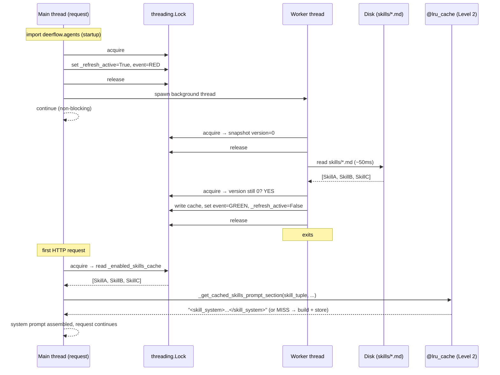

# Section 08b — Skills Cache Pipeline: How It Works

> Deep dive into `lead_agent/prompt.py` lines 18–171 and 600–631.
> For the broader lead agent overview, see **[[08a-lead-agent]]**.

## The Problem

Every HTTP request that creates a run needs a system prompt. The system prompt includes the list of enabled skills. Skills live on disk (YAML files). Reading disk on every request would add 50–200ms of latency and block the request thread.

The solution is a **two-level non-blocking cache**:

- **Level 1** — a module-level list of `Skill` objects, loaded once by a background thread
- **Level 2** — a formatted XML string derived from that list, cached by `@lru_cache`

The request thread **never touches disk**. It reads from the cache or returns `[]` and moves on.

---

## The Shared State — Six Global Variables

Think of these as a shared whiteboard that every thread in the process can read and write.

```python
_enabled_skills_cache: list[Skill] | None = None
_enabled_skills_lock = threading.Lock()
_enabled_skills_by_config_cache: dict[int, tuple[object, list[Skill]]] = {}
_enabled_skills_refresh_active = False
_enabled_skills_refresh_version = 0
_enabled_skills_refresh_event = threading.Event()
```

| Variable | Type | What it holds |
|---|---|---|
| `_enabled_skills_cache` | `list[Skill] \| None` | The loaded skills. `None` = "not ready yet" |
| `_enabled_skills_lock` | `Lock` | A mutex — only one thread can modify the whiteboard at a time |
| `_enabled_skills_by_config_cache` | `dict` | Secondary cache keyed by config object identity |
| `_enabled_skills_refresh_active` | `bool` | `True` while a worker thread is loading |
| `_enabled_skills_refresh_version` | `int` | A counter that bumps on every invalidation |
| `_enabled_skills_refresh_event` | `Event` | A signal light — GREEN means the cache is ready |

### Two threading primitives explained

**`threading.Lock()`** — a mutex (mutual exclusion). Only one thread can be inside `with _enabled_skills_lock:` at a time. Any other thread that tries is **paused** until the first thread exits the `with` block. This prevents two threads from reading and writing the same variable simultaneously (a data race).

**`threading.Event()`** — a simple signal flag.
- `.set()` → turns it GREEN
- `.clear()` → turns it RED
- `.wait(timeout)` → the calling thread **pauses** until the event is GREEN, or until the timeout expires

---

## Dry Run 1 — Normal Startup (Happy Path)

**Initial state (before anything runs):**
```
_enabled_skills_cache   = None
_enabled_skills_active  = False
_enabled_skills_version = 0
_enabled_skills_event   = RED
Worker thread           = not started
```

### Step 1 — `agents/__init__.py` is imported → `prime_enabled_skills_cache()` fires

This happens the first time anything imports `deerflow.agents` — at LangGraph Server startup, or on the first request in embedded Gateway mode.

```python
def prime_enabled_skills_cache():
    _ensure_enabled_skills_cache()      # delegates immediately
```

Inside `_ensure_enabled_skills_cache()`:

```python
with _enabled_skills_lock:              # lock the whiteboard
    if _enabled_skills_cache is not None:   # None → skip
        ...
    if _enabled_skills_refresh_active:      # False → skip
        ...
    _enabled_skills_refresh_active = True   # mark "loading in progress"
    _enabled_skills_refresh_event.clear()   # signal light → RED
# unlock

_start_enabled_skills_refresh_thread()     # spawn background worker
return _enabled_skills_refresh_event        # return the signal light
```

**State after Step 1:**
```
_enabled_skills_cache   = None          (still empty)
_enabled_skills_active  = True          (worker is running)
_enabled_skills_version = 0
_enabled_skills_event   = RED
Worker thread           = RUNNING
```

The main thread continues immediately — it does not wait for the worker.

---

### Step 2 — Worker thread runs `_refresh_enabled_skills_cache_worker()`

This runs **concurrently** with the main thread, on a separate OS thread.

```python
def _refresh_enabled_skills_cache_worker():
    while True:
        # --- snapshot the current version ---
        with _enabled_skills_lock:
            target_version = _enabled_skills_refresh_version   # snapshots 0
        # unlock

        # --- DISK I/O — only this thread touches disk, takes ~50ms ---
        # main thread is free to handle requests while this runs
        skills = _load_enabled_skills_sync()
        # → [Skill("web-research"), Skill("code-review"), Skill("bash-expert")]

        # --- write back ---
        with _enabled_skills_lock:
            if _enabled_skills_refresh_version == target_version:   # 0 == 0 → YES
                _enabled_skills_cache = skills       # store the data
                _enabled_skills_refresh_active = False
                _enabled_skills_refresh_event.set()  # signal light → GREEN
                return                               # worker exits
```

**State after Step 2:**
```
_enabled_skills_cache   = [Skill("web-research"), Skill("code-review"), Skill("bash-expert")]
_enabled_skills_active  = False
_enabled_skills_event   = GREEN
Worker thread           = DEAD (exited)
```

---

### Step 3 — First HTTP request assembles the system prompt → `get_cached_enabled_skills()`

```python
def get_cached_enabled_skills():
    with _enabled_skills_lock:
        cached = _enabled_skills_cache    # reads the list (GREEN state)
    # unlock

    if cached is not None:                # True → cache is warm
        return list(cached)               # returns a copy instantly
```

No disk access. No blocking. The request thread reads the result the worker already loaded.

---

## Dry Run 2 — Cache Miss (Worker Too Slow)

**Scenario:** Disk is slow. The first HTTP request arrives before the worker finishes loading.

**State when request arrives:**
```
_enabled_skills_cache   = None          (worker still loading)
_enabled_skills_active  = True
```

`get_cached_enabled_skills()` runs:

```python
with _enabled_skills_lock:
    cached = _enabled_skills_cache    # None

if cached is not None:                # False — miss

# don't start a second thread:
_ensure_enabled_skills_cache()
#   → with lock: _refresh_active is True → early return, no new thread

return []                             # return empty list IMMEDIATELY
```

**Result:** This one request gets a system prompt with no skills listed. A minor degraded experience, but the server never hangs. The worker keeps running in the background, and the next request will see the warm cache.

---

## Dry Run 3 — Invalidation While Worker Is Loading (The Tricky Case)

This is the scenario the compare-and-swap version counter exists to handle.

**Scenario:** An admin enables a new skill through the API at the same moment the worker is already mid-read loading the old skill list.

**State at T=0:**
```
_enabled_skills_cache   = None
_enabled_skills_active  = True         (worker is running)
_enabled_skills_version = 0
Worker: has snapshotted target_version = 0, is reading disk
```

---

**T=1: Admin API fires → `_invalidate_enabled_skills_cache()` runs (on main thread):**

```python
_get_cached_skills_prompt_section.cache_clear()   # wipe the Level 2 LRU too

with _enabled_skills_lock:
    _enabled_skills_cache = None                   # already None
    _enabled_skills_by_config_cache.clear()        # wipe secondary cache
    _enabled_skills_refresh_version += 1           # 0 → 1   ← KEY CHANGE
    _enabled_skills_refresh_event.clear()          # RED again
    if _enabled_skills_refresh_active:             # True → don't spawn second thread
        return _enabled_skills_refresh_event       # return early
```

**State at T=1:**
```
_enabled_skills_version = 1            (bumped)
_enabled_skills_active  = True         (same worker still running)
Worker: still has target_version = 0 in its local variable
```

---

**T=2: Worker finishes reading disk — but the data is stale (loaded before the new skill was enabled):**

```python
        with _enabled_skills_lock:
            if _enabled_skills_refresh_version == target_version:   # 1 == 0 → NO
                ...                                                  # SKIPPED

            # version mismatch: someone invalidated while we were loading
            _enabled_skills_cache = None    # discard the stale result
            # fall through to `while True` and loop again
```

---

**T=3: Worker loops and starts a fresh load:**

```python
        with _enabled_skills_lock:
            target_version = _enabled_skills_refresh_version   # now snapshots 1
        # unlock

        skills = _load_enabled_skills_sync()
        # → [Skill("web-research"), Skill("code-review"), Skill("bash-expert"), Skill("new-skill")]

        with _enabled_skills_lock:
            if _enabled_skills_refresh_version == target_version:   # 1 == 1 → YES
                _enabled_skills_cache = skills       # correct, up-to-date data
                _enabled_skills_refresh_active = False
                _enabled_skills_refresh_event.set()  # GREEN
                return
```

**Result:** The cache reflects the new skill. No stale data was ever committed. The version counter is the "did the world change while I was working?" check — the same idea as a database optimistic lock or a CPU compare-and-swap instruction.

### Why one worker, not two?

Notice that `_invalidate_enabled_skills_cache()` checks `_refresh_active` and returns early if it's `True`. It does **not** start a second worker thread when one is already running. The running worker will detect the version bump when it finishes and loop to reload. This avoids:
- Two threads both reading from disk simultaneously (wasted I/O)
- Two threads both trying to write `_enabled_skills_cache` at the same time (race condition)

---

## The `@lru_cache` Layer — Level 2

Once the skill objects are in `_enabled_skills_cache`, the request still needs to format them into the `<skill_system>` XML block for the system prompt. This is pure string work — no I/O — but it's still redundant to repeat on every request with the same skill list.

```python
@lru_cache(maxsize=32)
def _get_cached_skills_prompt_section(
    skill_signature: tuple[tuple[str, str, str, str], ...],
    available_skills_key: tuple[str, ...] | None,
    container_base_path: str,
    skill_evolution_section: str,
) -> str:
    filtered = [
        (name, description, category, location)
        for name, description, category, location in skill_signature
        if available_skills_key is None or name in available_skills_key
    ]
    # ... build and return <skill_system>...</skill_system> XML string
```

### Why tuples, not lists?

`@lru_cache` stores results in a dictionary keyed by the arguments. Dictionary keys must be **immutable** (hashable). A Python `list` can be mutated, so it cannot be a key. A `tuple` is immutable, so it can.

The skill list is therefore converted to `tuple[tuple[str, str, str, str], ...]` before being passed in — a tuple of 4-tuples, one per skill.

### Dry run of Level 2

```
Request A — default agent, 3 skills enabled, no filter
  skill_signature      = (("web-research", "...", "public", "/mnt/..."),
                          ("code-review",  "...", "custom", "/mnt/..."),
                          ("bash-expert",  "...", "public", "/mnt/..."))
  available_skills_key = None
  → LRU MISS: builds XML string (3 skills listed)
  → stores result under this key combination
  → returns "<skill_system>...web-research, code-review, bash-expert...</skill_system>"

Request B — same default agent, same 3 skills
  skill_signature      = (same tuple)
  available_skills_key = None
  → LRU HIT: returns cached string instantly, zero work

Request C — custom agent "researcher", only allowed to see "web-research"
  skill_signature      = (same tuple — ALL enabled skills)
  available_skills_key = ("web-research",)   ← different key!
  → LRU MISS: builds filtered XML (1 skill listed)
  → stores as a second LRU entry
  → returns "<skill_system>...web-research only...</skill_system>"

Admin enables "new-skill" → _invalidate_enabled_skills_cache() fires
  → _get_cached_skills_prompt_section.cache_clear()
  → BOTH LRU entries wiped
  → next requests miss and rebuild with the new skill included
```

The LRU holds up to 32 entries. In practice the key space is small (a handful of distinct skill sets across all active agents), so it rarely evicts.

---

## The Complete Two-Level Picture



```
[Disk: skills/*.md files]
        │
        │  read once by worker thread (~50ms, async)
        ▼
_enabled_skills_cache      ← Level 1: raw Skill objects
   threading.Lock              guarded by mutex
   version counter             invalidation safety
   threading.Event             ready signal for warm_enabled_skills_cache()
        │
        │  converted to hashable tuple, passed to:
        ▼
@lru_cache (maxsize=32)    ← Level 2: formatted XML string
   keyed by (skill_tuple, available_skills_key, path, evolution_section)
   cleared on every invalidation
        │
        ▼
System prompt string       ← returned to apply_prompt_template(), zero I/O cost
```

---

## Why This Design?

| Requirement | Mechanism |
|---|---|
| Request path must never block on disk | Worker thread + non-blocking `get_cached_enabled_skills()` returns `[]` on miss |
| First request should see warm cache | `warm_enabled_skills_cache()` at startup blocks up to 5s |
| Enabling/disabling a skill must be reflected quickly | `_invalidate_enabled_skills_cache()` bumps version + clears both levels |
| Mid-load invalidation must not commit stale data | Compare-and-swap version check in worker loop |
| Only one disk read at a time | `_refresh_active` flag prevents spawning a second worker |
| Same skill list must not be re-serialised every request | `@lru_cache` on the XML formatter |
| Different agents see only their allowed skills | `available_skills_key` is part of the LRU key — separate cache entry per agent |

## Links to Related Sections

- **[[08a-lead-agent]]** — lead agent overview; the broader context this cache operates within
- [[13-skills-system]] — the skills storage layer that `_load_enabled_skills_sync()` calls into
