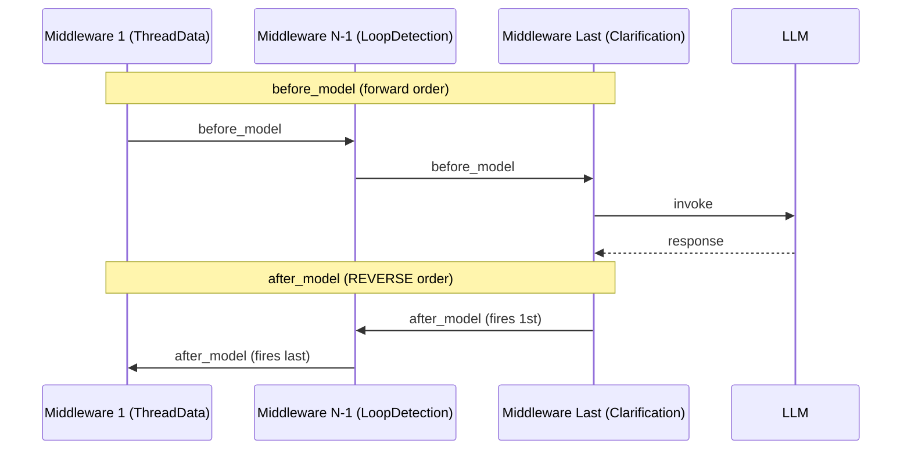

# Middleware Pipeline — Overview & Chain Wiring

## Purpose

DeerFlow wraps every agent invocation in a chain of middleware that transforms inputs, intercepts model calls, guards tool execution, and processes model outputs. The middleware system is the primary mechanism for adding cross-cutting concerns (logging, error recovery, memory, context injection) without modifying the core LangGraph node. This file documents the **assembly mechanics** — how the chain is wired, ordered, and extended — before diving into individual middleware implementations.

## Key Files

- `agents/middlewares/tool_error_handling_middleware.py` — Stage 1 assembly: `_build_runtime_middlewares()` and its two public facades `build_lead_runtime_middlewares()` / `build_subagent_runtime_middlewares()`
- `agents/lead_agent/agent.py` — Stage 2 assembly: `_build_middlewares()` merges Stage 1 output with config-driven behavioral middlewares
- `agents/middlewares/__init__.py` — empty; no public registry, each middleware is imported directly from its own module
- `client.py` — the only caller that passes `custom_middlewares` into `_build_middlewares()`

## Two-Stage Assembly

The chain is built in two discrete stages. This separation keeps infrastructure concerns (sandbox, uploads, error recovery) decoupled from AI-behavioural concerns (memory, titles, loop detection).

```mermaid
flowchart TD
    subgraph Stage1["Stage 1 — _build_runtime_middlewares()"]
        direction TB
        TD[ThreadDataMiddleware]
        UP[UploadsMiddleware<br />— lead agent only]
        SB[SandboxMiddleware]
        DC[DanglingToolCallMiddleware]
        LE[LLMErrorHandlingMiddleware]
        GR["GuardrailMiddleware<br />— optional"]
        SA[SandboxAuditMiddleware]
        TE[ToolErrorHandlingMiddleware]
    end

    subgraph Stage2["Stage 2 — _build_middlewares()"]
        direction TB
        DY[DynamicContextMiddleware]
        SU["SummarizationMiddleware<br />— if enabled"]
        TODO["TodoMiddleware<br />— if plan_mode"]
        TU["TokenUsageMiddleware<br />— if enabled"]
        TI[TitleMiddleware]
        ME[MemoryMiddleware]
        VI["ViewImageMiddleware<br />— if vision model"]
        DF["DeferredToolFilterMiddleware<br />— if tool_search.enabled"]
        SL["SubagentLimitMiddleware<br />— if subagent_enabled"]
        LD["LoopDetectionMiddleware<br />— if enabled"]
        CM["custom_middlewares<br />— DeerFlowClient only"]
        CL[ClarificationMiddleware]
    end

    Stage1 --> Stage2
```



### Stage 1 — `_build_runtime_middlewares()`

Located in `tool_error_handling_middleware.py`. Builds the **infrastructure layer** — concerns that apply to every agent regardless of configuration.

```python
def _build_runtime_middlewares(*, app_config, include_uploads, include_dangling_tool_call_patch, lazy_init=True):
    middlewares = [
        ThreadDataMiddleware(lazy_init=lazy_init),   # always pos 1
        SandboxMiddleware(lazy_init=lazy_init),       # always pos 2 (or 3 if uploads)
    ]
    if include_uploads:
        middlewares.insert(1, UploadsMiddleware())   # shifts Sandbox to pos 3
    if include_dangling_tool_call_patch:
        middlewares.append(DanglingToolCallMiddleware())
    middlewares.append(LLMErrorHandlingMiddleware(app_config=app_config))
    if guardrails_config.enabled and guardrails_config.provider:
        provider = resolve_variable(guardrails_config.provider.use)(...)
        middlewares.append(GuardrailMiddleware(provider, ...))
    middlewares.append(SandboxAuditMiddleware())
    middlewares.append(ToolErrorHandlingMiddleware())
    return middlewares
```

Two public facades wrap this function with agent-type-specific flags:

| Facade                                 | include_uploads | include_dangling | Extra                                                  |
| -------------------------------------- | --------------- | ---------------- | ------------------------------------------------------ |
| `build_lead_runtime_middlewares()`     | `True`          | `True`           | —                                                      |
| `build_subagent_runtime_middlewares()` | `False`         | `True`           | Appends `ViewImageMiddleware` if model supports vision |

The lead agent Stage 1 always produces (when Guardrail disabled):

```
ThreadDataMiddleware → UploadsMiddleware → SandboxMiddleware →
DanglingToolCallMiddleware → LLMErrorHandlingMiddleware →
SandboxAuditMiddleware → ToolErrorHandlingMiddleware
```

### Stage 2 — `_build_middlewares()`

Located in `lead_agent/agent.py`. Takes the Stage 1 list and appends **config-driven behavioral middlewares** in a strict order determined by semantic constraints.

```python
def _build_middlewares(config, model_name, agent_name=None, custom_middlewares=None, *, app_config=None):
    middlewares = build_lead_runtime_middlewares(app_config=resolved_app_config)

    # --- always ---
    middlewares.append(DynamicContextMiddleware(agent_name=agent_name, app_config=resolved_app_config))

    # --- config-driven optional ---
    if summarization.enabled:
        middlewares.append(DeerFlowSummarizationMiddleware(...))
    if is_plan_mode:
        middlewares.append(TodoMiddleware(...))
    if token_usage.enabled:
        middlewares.append(TokenUsageMiddleware())

    # --- always ---
    middlewares.append(TitleMiddleware(app_config=resolved_app_config))
    middlewares.append(MemoryMiddleware(agent_name=agent_name, ...))

    # --- model-dependent ---
    if model_config.supports_vision:
        middlewares.append(ViewImageMiddleware())

    # --- config-driven optional ---
    if tool_search.enabled:
        middlewares.append(DeferredToolFilterMiddleware())
    if subagent_enabled:
        middlewares.append(SubagentLimitMiddleware(max_concurrent=...))
    if loop_detection.enabled:
        middlewares.append(LoopDetectionMiddleware.from_config(loop_detection_config))

    # --- extension point ---
    if custom_middlewares:
        middlewares.extend(custom_middlewares)

    # --- sentinel: always last ---
    middlewares.append(ClarificationMiddleware())
    return middlewares
```

## Complete Chain Reference

| Position | Middleware                   | Stage | Always?              | Hook Type(s)                           |
| -------- | ---------------------------- | ----- | -------------------- | -------------------------------------- |
| 1        | ThreadDataMiddleware         | 1     | Yes                  | before_agent                           |
| 2        | UploadsMiddleware            | 1     | Lead only            | before_agent                           |
| 3        | SandboxMiddleware            | 1     | Yes                  | before_agent, after_agent              |
| 4        | DanglingToolCallMiddleware   | 1     | Yes (lead+sub)       | before_model                           |
| 5        | LLMErrorHandlingMiddleware   | 1     | Yes                  | wrap_model_call                        |
| 6        | GuardrailMiddleware          | 1     | Optional             | wrap_tool_call                         |
| 7        | SandboxAuditMiddleware       | 1     | Yes                  | wrap_tool_call                         |
| 8        | ToolErrorHandlingMiddleware  | 1     | Yes                  | wrap_tool_call                         |
| 9        | DynamicContextMiddleware     | 2     | Yes                  | before_agent                           |
| 10       | SummarizationMiddleware      | 2     | Optional             | before_model                           |
| 11       | TodoMiddleware               | 2     | Optional (plan_mode) | before_model, after_model, after_agent |
| 12       | TokenUsageMiddleware         | 2     | Optional             | after_model                            |
| 13       | TitleMiddleware              | 2     | Yes                  | after_model                            |
| 14       | MemoryMiddleware             | 2     | Yes                  | after_agent                            |
| 15       | ViewImageMiddleware          | 2     | Optional (vision)    | before_model                           |
| 16       | DeferredToolFilterMiddleware | 2     | Optional             | wrap_model_call, wrap_tool_call        |
| 17       | SubagentLimitMiddleware      | 2     | Optional (subagent)  | after_model                            |
| 18       | LoopDetectionMiddleware      | 2     | Optional             | after_model                            |
| 19\*     | custom_middlewares           | 2     | DeerFlowClient only  | any                                    |
| Last     | ClarificationMiddleware      | 2     | Yes                  | wrap_tool_call                         |

> \*Position 19 is approximate: actual position shifts with enabled/disabled optional middlewares.

## Execution Semantics: Forward vs Reverse

The LangChain `AgentMiddleware` protocol differentiates hooks by direction of traversal:

- **`before_agent` / `before_model` / `wrap_model_call` / `wrap_tool_call`** — fire in **forward** (list) order (pos 1 → last)
- **`after_model` / `after_agent`** — fire in **reverse** (stack) order (last → pos 1)



**Why `ClarificationMiddleware` must be last:** `ClarificationMiddleware` uses `wrap_tool_call`, not `after_model`. For `wrap_tool_call`, the chain is ordered outer (pos 1) → inner (Last). Being last makes it the **innermost** tool wrapper — it sits directly around actual tool execution. When `ask_clarification` is called, it intercepts by returning `Command(goto=END)` _without_ calling `handler(request)`, so the tool never executes. The outer wrappers (GuardrailMiddleware, SandboxAuditMiddleware, ToolErrorHandlingMiddleware) receive the `Command` as the return value and pass it through to LangGraph.

**Why `LoopDetectionMiddleware` is second-to-last:** It uses `after_model` and issues a hard-stop when a loop is detected. Placing it just before Clarification in list order means its `after_model` fires second in the reverse pass — immediately after any `after_model` hooks that need to run first.

## Custom Middleware Extension

### The Only Official Extension Point: `DeerFlowClient`

Custom middlewares can **only** be injected via the embedded Python client `DeerFlowClient`. The HTTP/LangGraph Server path (`make_lead_agent`) does not support custom middleware injection.

```python
from deerflow.client import DeerFlowClient
from langchain.agents.middleware import AgentMiddleware

class MyMiddleware(AgentMiddleware[ThreadState]):
    def before_model(self, state, ...):
        # inject context or mutate state
        ...

    def after_model(self, state, response, ...):
        # process model output
        ...

client = DeerFlowClient(
    middlewares=[MyMiddleware()]
)
```

### Placement in the Chain

Custom middlewares are injected by `_build_middlewares()` at the end of the list, **after `LoopDetectionMiddleware` and before `ClarificationMiddleware`**:

```python
# in _build_middlewares()
if custom_middlewares:
    middlewares.extend(custom_middlewares)   # injected here

middlewares.append(ClarificationMiddleware())   # always last
```

This placement means:

| Hook           | Custom middleware behavior                                                                                      |
| -------------- | --------------------------------------------------------------------------------------------------------------- |
| `before_agent` | Runs near the end of the forward pass (almost last, before only Clarification)                                  |
| `before_model` | Runs near the end — after DeferredToolFilter and SubagentLimit                                                  |
| `after_model`  | Runs **before all other built-in middlewares** in the reverse pass (but after Clarification, which fires first) |
| `after_agent`  | Runs near the start of the teardown reverse pass                                                                |

### Ordering Within Multiple Custom Middlewares

When multiple custom middlewares are passed, they are `extend()`ed — preserving the caller's list order. In `before_model`, they run in that order. In `after_model`, they run in **reverse** of that order (innermost wrapping = last-passed fires first).
The actual order of the custom middleware are managed using `Next` and `Prev` decorator. See: `_insert_extra()` in `backend/packages/harness/deerflow/agents/factory.py`.

### Custom Agents Cannot Inject Middlewares

Custom agents defined via SOUL.md + `config.yaml` (the `AgentConfig` schema) do not have a `middlewares` field. The `AgentConfig` schema only supports: `name`, `description`, `model`, `tool_groups`, `skills`. A custom agent called via the LangGraph Server HTTP path uses the same fixed middleware chain as the default lead agent, with no extension mechanism.

## Ordering Constraints (The Semantic Rules)

The comments in `agent.py` encode the rationale behind Stage 2 ordering:

| Constraint                               | Reason                                                                                                        |
| ---------------------------------------- | ------------------------------------------------------------------------------------------------------------- |
| ThreadData before Sandbox                | Sandbox `acquire()` needs the thread directory to already exist                                               |
| UploadsMiddleware after ThreadData       | Uploads path resolution requires the thread dir                                                               |
| DanglingToolCall before LLMErrorHandling | Must patch gaps in message history before any model invocation attempt                                        |
| Summarization early in Stage 2           | Reduce context _before_ per-model hooks see it (cheaper downstream)                                           |
| TodoList before Clarification            | Allow todo management to run before clarification interrupts the turn                                         |
| TitleMiddleware after first exchange     | Auto-generate title from the first complete turn; placed after optional middlewares that might abort the turn |
| MemoryMiddleware after TitleMiddleware   | Memory update is lower priority — read after title generation                                                 |
| ViewImage before Clarification           | Image base64 must be injected before the model call, not after                                                |
| ToolErrorHandling before Clarification   | Tool errors must be converted to ToolMessages before Clarification intercepts                                 |
| **ClarificationMiddleware always last**  | Innermost `wrap_tool_call`; returns `Command(goto=END)` without executing `ask_clarification`                 |

## My Insights

### Composition Over Inheritance

The middleware chain is the central example of DeerFlow's preference for composition. Each middleware is a single-responsibility unit. Adding a new concern (e.g., rate limiting, tracing) means writing one new class and appending it to the chain — no modification of existing code required.

### Infrastructure vs Behaviour Split

The two-stage separation is not just organisational. Stage 1 builds the same infrastructure chain for both lead agents and subagents (with minor flag variations). Stage 2 is lead-agent-specific. This means subagents share the same low-level error handling and sandbox machinery, but have a simpler behavioral layer. It's a clean boundary between "what the runtime needs" and "what the lead agent experience needs."

### The Clarification Sentinel Pattern

`ClarificationMiddleware` uses `wrap_tool_call`, not `after_model`. It is placed **last** in the chain, making it the **innermost** `wrap_tool_call` wrapper (the framework builds `wrap_tool_call` outer-to-inner from pos 1 to Last). As innermost, it intercepts `ask_clarification` by returning `Command(goto=END)` directly, without ever calling `handler(request)` — the tool never executes and no outer tool guard (GuardrailMiddleware, SandboxAuditMiddleware, ToolErrorHandlingMiddleware) processes it as a normal tool result. The `Command` propagates outward through the outer wrappers to LangGraph, which raises `GraphBubbleUp` to jump the graph to `END`.

### LangGraph Server vs DeerFlowClient: Two Assembly Paths

There are two consumers of `_build_middlewares()`:

1. `make_lead_agent()` (called by LangGraph Server on every HTTP request): never passes `custom_middlewares`
2. `DeerFlowClient._ensure_agent()`: passes `self._middlewares` from the constructor

This means the extension point is **only for programmatic/embedded use**. Operators running DeerFlow via HTTP API get a fixed chain. This is a deliberate design choice — it keeps the chain predictable for the server path and reserves extensibility for SDK consumers.

### Lazy Init Flag

Stage 1 middlewares that need I/O (thread directory creation, sandbox acquisition) accept `lazy_init=True`. When `True`, the expensive setup is deferred until the first actual invocation. This allows `_build_middlewares()` to be called at agent-creation time (per LangGraph Server request) without incurring I/O at compile time.

## Open Questions

- What exactly is `AgentMiddleware` in LangChain? What hooks does it define beyond `before_model`, `after_model`, `wrap_tool_call`, `before_agent`, `after_agent`?
- Does `DeferredToolFilterMiddleware` interact with `SubagentLimitMiddleware`? If a deferred tool is the `task` tool, does the filter affect subagent count enforcement?
- Is there any mechanism for Phase 2 middlewares to share state (e.g., can `LoopDetectionMiddleware` communicate with `ClarificationMiddleware` during the same turn)?
- The `build_subagent_runtime_middlewares()` appends `ViewImageMiddleware` in Stage 1 (not Stage 2). Is this intentional — meaning subagents get vision earlier in their chain than lead agents? What's the implication?

## Links to Related Sections

- [[08-lead-agent]] — `make_lead_agent()` and `_make_lead_agent()` are the callers that trigger Stage 2 assembly
- [[07-langgraph-runtime]] — `RunManager` drives the agent; the middleware chain wraps each node invocation
- [[15-sandbox]] — `SandboxMiddleware` in Stage 1 acquires/releases the sandbox that tools use
- [[10-memory-system]] — `MemoryMiddleware` (pos 14) queues conversation data for async memory updates
