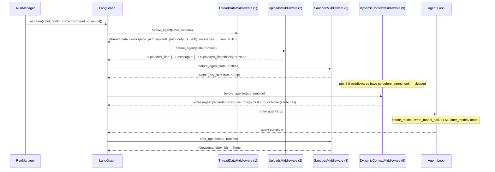

# Middleware Pipeline — Phase 2: Before-Agent Middlewares

## Purpose

This file covers the four middlewares whose `before_agent` hook fires once at the start of every agent invocation, in forward chain order (pos 1 → 9). Together they form the **session setup layer**: they create the filesystem environment, surface uploaded files, acquire the sandbox, and inject dynamic context (memory + date) before the model loop begins.

The `before_agent` hooks in this phase run **once per user turn**, not once per LLM call within a turn. This is the right place for setup work that should happen exactly once on entry.

## Key Files

- `agents/middlewares/thread_data_middleware.py` — pos 1; creates per-thread directories, stamps HumanMessage with run_id + timestamp
- `agents/middlewares/uploads_middleware.py` — pos 2; reads uploaded file metadata, scans historical uploads, injects `<uploaded_files>` block
- `sandbox/middleware.py` — pos 3; acquires sandbox via provider; releases in `after_agent`
- `agents/middlewares/dynamic_context_middleware.py` — pos 9; injects memory + current date as a frozen `<system-reminder>` HumanMessage

## Important Concepts

### `AgentMiddleware` and the async hook protocol

LangChain (1.2.15, confirmed from installed package) defines both sync and async variants for every hook directly on `AgentMiddleware`:

| Sync              | Async              |
| ----------------- | ------------------ |
| `before_agent`    | `abefore_agent`    |
| `before_model`    | `abefore_model`    |
| `after_model`     | `aafter_model`     |
| `after_agent`     | `aafter_agent`     |
| `wrap_model_call` | `awrap_model_call` |
| `wrap_tool_call`  | `awrap_tool_call`  |

Default implementations are empty no-ops for all hooks **except** `wrap_model_call` / `awrap_model_call`, which raise `NotImplementedError`. The rationale: a missing `before_agent` is safely ignored; a missing model-call wrapper in the wrong sync/async context produces silent wrong behaviour, so it is made a hard crash instead.

The factory (`factory.py`) wraps each middleware in a `RunnableCallable(sync_fn, async_fn)`. When the agent runs via `astream()` / `ainvoke()`, the async variant is selected automatically. DeerFlow provides explicit `abefore_agent` / `abefore_model` overrides because it is a fully async system (all invocations go through `astream()`).

### `Runtime` object — how it is injected

`Runtime` is a frozen dataclass (`langgraph/runtime.py`):

```python
@dataclass(frozen=True, slots=True)
class Runtime(Generic[ContextT]):
    context: ContextT = None      # dict passed by the run initiator
    store: BaseStore | None = None
    stream_writer: StreamWriter = ...
    execution_info: ExecutionInfo | None = None
    server_info: ServerInfo | None = None
```

The injection flow:

1. `RunManager.run_agent()` calls `graph.astream(input, config, context={"thread_id": ..., "run_id": ...})`
2. LangGraph constructs a `Runtime` from that `context=` argument and stores it in the execution config at `config["__pregel_config"]["__pregel_runtime"]`
3. When a graph node is executed, LangGraph introspects its signature; if it sees `runtime: Runtime`, it retrieves the object from config and passes it
4. Inside `before_agent`, `runtime.context` is the dict the run initiator passed

DeerFlow's middlewares always try `runtime.context.get("thread_id")` first. If absent, they fall back to `get_config()["configurable"]["thread_id"]` — this is the older LangGraph API and is kept for backward compatibility with callers that don't use the `context=` argument.

### Hook type precedence — different hooks never compete

A common source of confusion: `DanglingToolCallMiddleware` (pos 4, `wrap_model_call`) is appended to the list before `DynamicContextMiddleware` (pos 9, `before_agent`). Which takes precedence?

**Neither — they fire at completely different moments:**

```
Invocation start
│
├── before_agent (forward order, once per turn)
│     pos 1 ThreadDataMiddleware
│     pos 2 UploadsMiddleware
│     pos 3 SandboxMiddleware
│     pos 9 DynamicContextMiddleware   ← pos 4 DanglingToolCall is SKIPPED here
│                                         (has no before_agent hook)
└── Agent loop
      ├── wrap_model_call (forward order, every LLM call)
      │     pos 4 DanglingToolCallMiddleware   ← pos 9 DynamicContext is SKIPPED here
      │     pos 5 LLMErrorHandlingMiddleware      (has no wrap_model_call hook)
      └── [LLM call]
```

List position determines ordering only **within the same hook type**. Cross-hook ordering is meaningless because the hooks fire at entirely different points in the graph lifecycle.

### `additional_kwargs` on LangChain messages

`HumanMessage` (and all LangChain messages) carry a `dict[str, Any]` field called `additional_kwargs`. It is an escape hatch for metadata that doesn't fit the standard fields (`content`, `id`, `name`, `response_metadata`). It is:

- **Not sent to the LLM** — only `content` is seen by the model
- **Preserved through serialization** — survives checkpointer round-trips
- **Used by DeerFlow infrastructure** for: file metadata (`files`), run metadata (`run_id`, `timestamp`), UI hints (`hide_from_ui`), and injection flags (`dynamic_context_reminder`)

---

## Per-Middleware Deep Dive

### ThreadDataMiddleware — pos 1

**Responsibility:** Create (or locate) the three per-thread directories on the host filesystem, publish their paths into state, and stamp the current `HumanMessage` with run metadata.

**Directory layout written to state:**

```
{base_dir}/users/{user_id}/threads/{thread_id}/user-data/
    workspace/    → state["thread_data"]["workspace_path"]
    uploads/      → state["thread_data"]["uploads_path"]
    outputs/      → state["thread_data"]["outputs_path"]
```

**`lazy_init=True` (default):** `before_agent` only computes path strings — no filesystem I/O. Directories are created on demand later (SandboxMiddleware or the first tool call). Used in production because `_build_middlewares()` is called at chain-compile time (once per incoming HTTP request), not at execution time.

**`lazy_init=False`:** Creates directories immediately in `before_agent`. Used in tests and embedded contexts where explicit initialization is preferred.

**HumanMessage augmentation:** As a secondary concern, `before_agent` reconstructs the last `HumanMessage` with `run_id` and a UTC ISO timestamp added to `additional_kwargs`. These fields tie the message to a specific DeerFlow run record for audit and debugging.

**Path safety:** `Paths` validates `thread_id` and `user_id` against `[A-Za-z0-9_\-]+` before using them in filesystem paths. This rejects directory-traversal inputs (e.g. `../../etc`) that could arrive from external HTTP requests.

**`ensure_thread_dirs()` creates with `chmod(0o777)`:** `mkdir(mode=0o777)` alone is subject to the process umask (e.g. umask `0o022` reduces it to `0o755`). The explicit `chmod()` call bypasses the umask, guaranteeing world-writable directories. This is necessary for Docker DooD (Docker-outside-of-Docker) mode where the sandbox container spawned by the backend may run as a different UID than the backend process itself.

**Docker DooD explained:** The backend container mounts the host's `/var/run/docker.sock`. When it calls `docker run`, it talks to the _host_ Docker daemon, which spawns a _sibling_ container on the host (not nested inside the backend). That sibling needs to write to volume-mounted thread directories. Because the sibling's UID differs from the backend's UID, `0o777` is required to allow writes across UID boundaries.

---

### UploadsMiddleware — pos 2

**Responsibility:** Read file metadata from the current `HumanMessage`'s `additional_kwargs.files`, scan the thread's `uploads/` directory for historically uploaded files, enrich all entries with document outlines, and prepend an `<uploaded_files>` block to the message so the model immediately knows what it has to work with.

**Two-pass strategy:**

- **Pass 1 — new files:** parsed from `additional_kwargs.files` on the current message. Each entry is existence-checked against the physical `uploads/` directory. Phantom files (uploaded but deleted, or race conditions) are silently dropped.
- **Pass 2 — historical files:** all files currently in the `uploads/` directory that are not in the new-file set, scanned via `iterdir()`. These represent files from previous conversation turns.

**Virtual path enforcement:** `_files_from_kwargs` always overwrites the frontend-provided `path` with `/mnt/user-data/uploads/{filename}`. The frontend can send any path string, but the middleware fixes it to match the sandbox's `/mnt/` namespace. This prevents the model from seeing paths that don't correspond to actual sandbox mounts.

**Path traversal guard:** `Path(filename).name != filename` rejects any filename containing directory separators (e.g. `../../etc/passwd`). Only bare filenames like `report.pdf` pass through.

**Outline extraction pipeline:** The upload conversion pipeline (`markitdown`) produces a sibling `{stem}.md` alongside every uploaded document. `extract_outline` parses this `.md` for three heading styles:

1. Standard Markdown headings (`# H1`, `## H2`)
2. SEC-style bold headings (`**PART II**`, `**ITEM 1. BUSINESS**`)
3. Split-bold headings (`**3.2** **Attention**`) — common in academic PDFs

The extracted `{title, line}` entries are injected as navigation anchors in the `<uploaded_files>` block, allowing the model to call `read_file(path, start_line=N, end_line=M)` to jump directly to a section without scanning the entire file.

**Fallback preview:** When no headings are found (flat prose, CSV files), the first 5 non-empty lines of the `.md` are shown as "document begins with:" context. When no `.md` exists at all, a `grep` hint is provided as a last resort.

**Content format handling:** `before_agent` handles both `str` content (simple prepend) and `list` content (multimodal messages with image blocks — prepend as a new text block at index 0).

**`additional_kwargs` preservation:** The updated `HumanMessage` copies all original `additional_kwargs` verbatim. The frontend reads structured file metadata from the streamed LangGraph message. Stripping `additional_kwargs` would break the UI's file display.

**`get_config()` fallback wrapped in `try/except RuntimeError`:** `get_config()` raises `RuntimeError` when called outside a LangGraph runnable context (e.g. in unit tests calling `before_agent` directly). The swallow keeps `thread_id=None`, which disables the physical uploads scan and existence checks — a safe degraded mode.

---

### SandboxMiddleware — pos 3

**Responsibility:** Acquire a sandbox environment at agent entry and release it at agent teardown. It is the only Stage 1 middleware with both a `before_agent` (acquire) and an `after_agent` (release) hook, bracketing the entire run.

**`lazy_init=True` (default) — `before_agent` is a no-op:** `super().before_agent()` is called, which returns `None`. The sandbox is not acquired here; it is acquired lazily on the first tool call. The `after_agent` hook still handles cleanup.

**`lazy_init=False` — eager acquisition:** If `state["sandbox"]` is absent or `None`, `_acquire_sandbox(thread_id)` is called, and `{"sandbox": {"sandbox_id": "..."}}` is written into state.

**`SandboxState` is minimal:** Just `{sandbox_id: str | None}`. The actual `Sandbox` object lives inside the provider's registry. Downstream tools call `get_sandbox_provider().get(sandbox_id)` to retrieve the live object. The state only carries the opaque key.

**`get_sandbox_provider()` is a lazy singleton:** Resolved from `config.sandbox.use` via `resolve_class()` on first call. Switching sandbox providers requires only a `config.yaml` change.

**`LocalSandboxProvider.acquire()`:** Creates a process-wide `LocalSandbox` singleton (if not alive) and always returns `"local"`. The `thread_id` argument is ignored — the local sandbox is shared across all threads and turns.

**`LocalSandboxProvider.release()`:** Deliberate no-op. The local sandbox persists for the process lifetime. Calling `release()` is harmless.

**`after_agent` dual-path release:**

```python
# Primary: sandbox was acquired via the normal state path
if state["sandbox"] is not None:
    get_sandbox_provider().release(sandbox_id)

# Fallback: sandbox was pre-allocated externally (provisioner/Kubernetes mode)
elif runtime.context.get("sandbox_id") is not None:
    get_sandbox_provider().release(runtime.context["sandbox_id"])
```

The fallback path covers provisioner mode (Kubernetes/Docker orchestration) where a sandbox container is pre-allocated before the agent starts and its ID is injected via `runtime.context`.

**Provider polymorphism:** `release()` is a no-op for local; for Docker-based providers (AioSandbox), it destroys the container. The middleware is provider-agnostic — it always calls `release()` and the provider decides what that means.

**Why pos 3 must follow pos 1 and 2:** SandboxMiddleware's `acquire()` (in Docker mode) mounts the thread directories as container volumes. `ThreadDataMiddleware` (pos 1) must have created those directories first, or the Docker volume mount source won't exist. This is an ordering constraint with physical consequences in Docker mode.

---

### DynamicContextMiddleware — pos 9

**Responsibility:** Inject the user's memory and the current date as a `<system-reminder>` block, delivered as a synthetic `HumanMessage`, once per session. The system prompt is kept fully static to maximize LLM prefix-cache reuse; this middleware handles all the dynamic parts.

**Three-state logic in `_inject`:**

| Condition                         | Action                                                                               |
| --------------------------------- | ------------------------------------------------------------------------------------ |
| No prior injected date in history | First turn — inject full reminder (memory + date) before the first user HumanMessage |
| `last_injected_date == today`     | Same day — return `None` (frozen history is sufficient)                              |
| `last_injected_date != today`     | Midnight crossing — inject date-only update before the current HumanMessage          |

**The ID-swap technique:** `_make_reminder_and_user_messages` splits one `HumanMessage` into two:

- `reminder_msg` takes the original message's `id` → LangGraph's `add_messages` reducer **replaces** the existing message in-place
- `user_msg` gets `{id}__user` → `add_messages` **appends** it after (new ID = new entry)

One message slot becomes two in the correct order, without direct list surgery on the state. This exploits the `add_messages` reducer's deduplication semantics.

**Why `before_agent`, not `before_model`:** `before_model` fires before every LLM call within a turn. `before_agent` fires once per user turn at the outer level. Injecting memory once at session start (and freezing it) is the correct pattern — re-injecting on every LLM call would be redundant and wasteful.

**Prefix-cache optimisation:** After injection, subsequent turns find `last_date is not None` and the same date → `_inject` returns `None`. The checkpointed history already contains the frozen reminder. The LLM's prefix-cache sees: static system prompt + frozen reminder + frozen user message + ... new conversation turns. The prefix is stable across all subsequent turns, maximising cache hits.

**Midnight crossing:** If a conversation starts on Monday and the user sends a message Tuesday, `_last_injected_date` returns Monday's date. The middleware injects a date-only update before the current message. This correction is persisted in the checkpointer, so the next turn sees Tuesday's date without re-injecting.

**Flag-based detection vs substring match:** `is_dynamic_context_reminder()` reads `additional_kwargs["dynamic_context_reminder"]`. A user could type `<system-reminder>` as message content — substring matching would produce a false positive. The flag approach is robust against adversarial or accidental content.

**`hide_from_ui: True`:** The reminder `HumanMessage` carries this in `additional_kwargs`. The frontend message renderer skips any message with this flag, so users never see the `<system-reminder>` block in the chat UI.

**Deferred import in `_build_full_reminder`:**

```python
from deerflow.agents.lead_agent.prompt import _get_memory_context
```

This is inside the method, not at module level. `prompt.py` imports from the memory system, which must be fully initialized before this runs. A top-level import would trigger premature initialization.

**`_is_user_injection_target` guard:** Prevents injecting a reminder into:

- Already-injected reminder messages (the flag check)
- Summarization messages (`name == "summary"`) — these are synthetic messages produced by `SummarizationMiddleware` and must not be prepended to

---

## Execution Flow



---

## Architecture Diagram — State Shape After Phase 2

```
ThreadState after before_agent phase:
{
  messages: [
    HumanMessage(id="X", additional_kwargs={run_id, timestamp}),       ← ThreadDataMiddleware
      → becomes after DynamicContext:
    HumanMessage(id="X",  content="<system-reminder>...", hide_from_ui=True),  ← DynamicContext
    HumanMessage(id="X__user", content="<uploaded_files>...\n\nUser text"),    ← Uploads + DynamicContext
  ],
  thread_data: {
    workspace_path: "/path/to/workspace",   ← ThreadDataMiddleware
    uploads_path:   "/path/to/uploads",
    outputs_path:   "/path/to/outputs",
  },
  uploaded_files: [...],                    ← UploadsMiddleware
  sandbox: null,                            ← SandboxMiddleware (lazy; set later by tools)
}
```

---

## My Insights

### The setup layer is a pipeline, not a stack

These four middlewares form a strict pipeline where each one depends on the previous:

1. `ThreadDataMiddleware` creates the directories
2. `UploadsMiddleware` reads from those directories to verify file existence
3. `SandboxMiddleware` (in Docker mode) mounts those directories as container volumes
4. `DynamicContextMiddleware` reads from the in-memory user cache — no filesystem dependency, but must be last in `before_agent` so the message list is already in its final shape before the reminder is prepended

The dependency direction only flows forward. This is why the ordering constraint is enforced in the assembly code and not negotiable.

### `additional_kwargs` as middleware's private channel

All four middlewares use `additional_kwargs` to communicate metadata without polluting the LangChain message schema:

- `ThreadDataMiddleware` → `run_id`, `timestamp`
- `UploadsMiddleware` → `files` (file metadata list)
- `DynamicContextMiddleware` → `hide_from_ui`, `dynamic_context_reminder`

This is intentional: DeerFlow-specific metadata belongs in `additional_kwargs`, not in new fields on `HumanMessage`. This keeps the middleware system's data out of the LangChain type system.

### Lazy init is the performance contract for production

Both `ThreadDataMiddleware` and `SandboxMiddleware` accept `lazy_init=True`. This matters because `_build_middlewares()` (which instantiates the middleware list) is called by `make_lead_agent()` — which LangGraph Server calls on **every incoming HTTP request**, not once on startup. If middlewares performed I/O in `__init__` or eagerly in `before_agent`, every request would incur filesystem and sandbox setup costs even for conversations that never execute a tool.

### DynamicContextMiddleware solves the prefix-cache vs dynamism tension

The central problem: the model needs to know today's date and the user's memory, but modifying the system prompt on every turn breaks prefix caching (cache misses on every request). DeerFlow's solution:

- Keep system prompt 100% static (never changes between turns or users)
- Inject dynamic content _once_, as a `HumanMessage` that gets frozen in the checkpointer
- The LLM's prefix-cache sees: static-prefix + frozen-reminder + rest of history

After the first turn, the full prefix (system prompt + reminder) is identical for all subsequent turns of the same conversation → maximum cache utilisation.

---

## Open Questions

- When `lazy_init=True` for `SandboxMiddleware`, who actually calls `provider.acquire(thread_id)` on the first tool call? The middleware's `before_agent` is a no-op, so the acquisition must happen inside the tool execution path — likely in the `SandboxProvider.get()` call from a sandbox tool. Needs confirmation when reading `sandbox/tools.py`.
- `SandboxProvider.uses_thread_data_mounts: bool = False` is declared on the ABC. Does `AioSandboxProvider` (Docker mode) set this to `True`? If so, is it read anywhere to enforce the ordering constraint programmatically, or is the ordering only enforced by convention?
- `_get_memory_context` is called synchronously from `_build_full_reminder`. Is the memory cache always warm (in-memory) when `DynamicContextMiddleware` runs? If memory is loaded lazily from disk on first access, this call could block the event loop.
- The `_SUMMARY_MESSAGE_NAME = "summary"` guard in `_is_user_injection_target` — is `"summary"` the exact `name` attribute written by `SummarizationMiddleware`? Confirming this when reading `summarization_middleware.py`.
- For multi-user concurrent requests: `_get_memory_context` calls `get_effective_user_id()` which reads from a contextvar. Does this correctly scope memory to the current request's user, or is there any risk of cross-user memory leakage in a concurrent async context?
- The historical files scan in `UploadsMiddleware` uses `iterdir()` directly. If `uploads/` contains companion `.md` files (produced by the conversion pipeline), they would appear as `historical_files` alongside the originals. Is this intentional, or are `.md` files filtered out somewhere?

---

## Links to Related Sections

- [[09a-middleware-pipeline-overview]] — chain assembly, complete middleware list, execution direction (forward vs reverse), ordering constraints table
- [[08-lead-agent]] — `_build_middlewares()` assembles the full chain; `make_lead_agent()` is the entry point that calls it per request
- [[07-langgraph-runtime]] — `RunManager.run_agent()` is the caller that passes `context={thread_id, run_id}` into `astream()`, populating `runtime.context`
- [[15-sandbox]] — `SandboxMiddleware` delegates to the provider defined there; `sandbox/tools.py` is where lazy sandbox acquisition happens
- [[10-memory-system]] — `DynamicContextMiddleware._build_full_reminder()` calls `_get_memory_context()` which reads from the memory system
