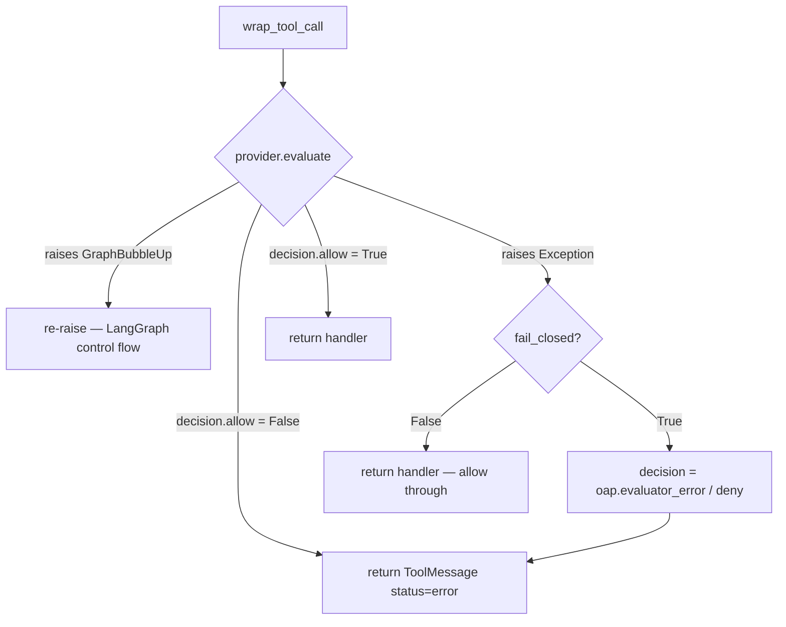
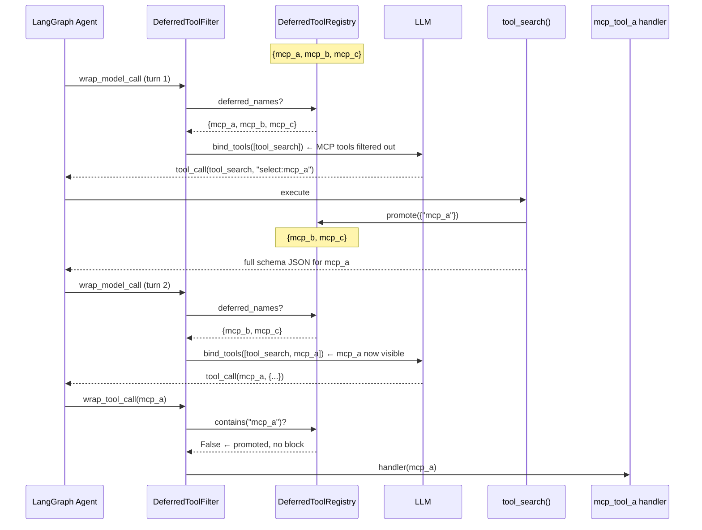
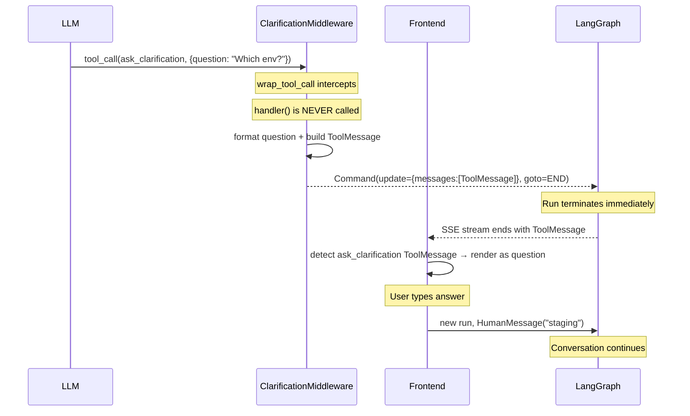

# Middleware Pipeline — Phase 4: Tool-Call Wrappers

## Purpose

Phase 4 covers the five middlewares that implement `wrap_tool_call` — the hook that surrounds every individual tool invocation. Together they form a layered gate: authorization (Guardrail), content analysis (SandboxAudit), exception recovery (ToolErrorHandling), schema gating (DeferredToolFilter), and run termination (Clarification). Each sits at a specific position in the chain; their nesting order determines exactly which concerns each one can observe.

## Key Files

- `guardrails/provider.py` — `GuardrailProvider` Protocol + data structures (`GuardrailRequest`, `GuardrailDecision`, `GuardrailReason`)
- `guardrails/builtin.py` — `AllowlistProvider`: the zero-dependency built-in provider
- `guardrails/middleware.py` — `GuardrailMiddleware` [pos 6]: pre-execution authorization
- `agents/middlewares/sandbox_audit_middleware.py` — `SandboxAuditMiddleware` [pos 7]: bash command analysis + audit logging
- `agents/middlewares/tool_error_handling_middleware.py` — `ToolErrorHandlingMiddleware` [pos 8]: converts tool exceptions to ToolMessages
- `agents/middlewares/deferred_tool_filter_middleware.py` — `DeferredToolFilterMiddleware` [pos 16]: hides deferred MCP schemas from model binding
- `agents/middlewares/clarification_middleware.py` — `ClarificationMiddleware` [pos Last]: intercepts `ask_clarification` and terminates the run
- `tools/builtins/tool_search.py` — `DeferredToolRegistry` + `tool_search` tool (companion to DeferredToolFilter)
- `tools/builtins/clarification_tool.py` — `ask_clarification_tool` (placeholder body — never executes)

---

## Nesting Order and the `wrap_tool_call` Rule

From the LangChain middleware docs: **`wrap_*` hooks nest first→outermost, last→innermost.** The middleware list is built in append order; being first means you wrap everything below you.

For `wrap_tool_call` specifically, the five Phase 4 middlewares are appended at positions 6, 7, 8, 16, and Last (18). Their nesting:

```
pos 6  GuardrailMiddleware        ← outermost tool-call guard
  pos 7  SandboxAuditMiddleware
    pos 8  ToolErrorHandlingMiddleware   ← innermost Stage 1 guard
      pos 16  DeferredToolFilterMiddleware
        pos Last  ClarificationMiddleware   ← innermost of all
          → actual tool handler()
```

**What this means in practice:**

- `GuardrailMiddleware` can deny a call and short-circuit before anything else runs.
- `SandboxAuditMiddleware` can block a call and receives `ToolErrorHandling`'s output (not exceptions) on the way back up.
- `ToolErrorHandlingMiddleware` wraps the actual tool and the two Stage-2 guards below it. It catches exceptions from the tool itself and from `DeferredToolFilter`/`ClarificationMiddleware`.
- `ClarificationMiddleware` wraps only the actual `ask_clarification_tool` handler — and never calls it.

---

## GuardrailMiddleware (pos 6)

### What it does

Pre-execution authorization for every tool call. Delegates the allow/deny decision to a pluggable `GuardrailProvider`. On deny, returns a `ToolMessage(status="error")` — the agent loop continues with the denial reason rather than aborting.

### GuardrailProvider Protocol

`GuardrailProvider` is a `@runtime_checkable` structural Protocol — any class with `name`, `evaluate(request)`, and `aevaluate(request)` satisfies it without inheritance. This enables third-party OAP providers to implement the interface without depending on the DeerFlow package.

```
GuardrailRequest                   GuardrailDecision
─────────────────                  ─────────────────────────
tool_name: str                     allow: bool
tool_input: dict                   reasons: list[GuardrailReason]
agent_id: str | None  ← passport   policy_id: str | None
thread_id: str | None              metadata: dict
is_subagent: bool
timestamp: str                     GuardrailReason
                                   ─────────────────
                                   code: str    ← OAP standard codes
                                   message: str
```

`agent_id` carries the passport reference (file path or hosted agent ID). OAP providers use it to look up per-agent policy from the passport document.

### Three provider options

| Option                                       | What it is                            | Dependencies     |
| -------------------------------------------- | ------------------------------------- | ---------------- |
| `AllowlistProvider`                          | Built-in allowlist/denylist           | None             |
| OAP Provider (e.g. `aport-agent-guardrails`) | Policy-based, reads OAP passport JSON | External package |
| Custom Provider                              | Any class with `evaluate`/`aevaluate` | Your own code    |

### AllowlistProvider evaluation order

Allowlist check runs before denylist. A tool in **both** lists is denied — denylist always wins.

```python
# _allowed = None  → no restriction (permissive default)
# _allowed = set() → would deny all (but empty list → None at init, so this can't happen)

if self._allowed is not None and name not in self._allowed:  # allowlist fails → deny
    return deny
if name in self._denied:                                      # denylist hits → deny
    return deny
return allow
```

**When does `except Exception` in `GuardrailMiddleware.wrap_tool_call` fire?**
Never for `AllowlistProvider` — it's purely in-memory. Only third-party/custom providers can raise: a network call times out, a passport file is missing, a provider has a bug. `fail_closed=True` (default) blocks the call on any such error; `fail_closed=False` allows it through.

### Error handling flow



**`GraphBubbleUp` must always re-raise.** LangGraph uses exceptions as control-flow signals (interrupt, pause, resume). Catching it would corrupt the graph's execution state. All three Phase 4 `wrap_tool_call` middlewares that do error handling (Guardrail, SandboxAudit, ToolErrorHandling) share this rule.

### Denial as ToolMessage, not exception

The denial is returned as `ToolMessage(status="error", content="Guardrail denied: ... Choose an alternative approach.")`. This is the core design choice: the agent loop continues. The LLM reads the denial reason and can adapt — try a different tool, rephrase, or ask for clarification. An exception would abort the run entirely.

---

## SandboxAuditMiddleware (pos 7)

### What it does

Content-based security analysis for `bash` tool calls only. Three stages: input sanitisation → command classification → audit log. High-risk commands are blocked; medium-risk commands execute with a warning appended; safe commands pass through.

### bash-only guard

```python
if request.tool_call.get("name") != "bash":
    return handler(request)  # all other tools: zero overhead
```

Other sandbox tools (`write_file`, `str_replace`, `read_file`, `ls`) operate on explicit path/content arguments — not arbitrary shell commands — so content-based regex analysis is not needed.

### Two-pass classification

```
_classify_command(command):

Pass 1 — whole-command high-risk scan
  → catches multi-statement attacks like fork bombs:
    :(){ :|:& };:   (spans ; delimiter — splitting first destroys the pattern)
    while true; do bash & done

Pass 2 — split on &&, ||, ; → classify each sub-command
  → catches injections hidden after safe prefix:
    "cd /workspace && rm -rf /"  →  sub[0]="cd /workspace" (pass), sub[1]="rm -rf /" (block)
  → worst verdict wins (block > warn > pass)
```

### Quote-aware splitting

`_split_compound_command` manually tracks single-quote, double-quote, and escape state. Operators inside quotes are ignored.

```
"echo 'a && b' && rm -rf /"
→ ['echo \'a && b\'',  'rm -rf /']   (the && inside quotes is NOT a separator)

"echo 'hello"   (unclosed quote)
→ ["echo 'hello"]   (fail-closed: return whole command unsplit)
```

Fail-closed on unclosed quotes: safer to classify the unsplit string than to miss a dangerous sub-command by mis-splitting.

### Double-classification for high-risk

`_classify_single_command` runs high-risk patterns twice:

1. Against whitespace-normalized raw string
2. Against `shlex.split()` re-joined tokens — catches evasion via unusual whitespace (`rm  -rf  /`)
3. `shlex.split()` failure (unclosed quote) → block (fail-closed)

### Input sanitisation — three guards

| Guard                 | Why                                                           |
| --------------------- | ------------------------------------------------------------- |
| Empty/whitespace-only | No legitimate command is empty                                |
| > 10,000 chars        | Blocks base64-encoded payload injection via oversized strings |
| Null byte (`\x00`)    | Can terminate strings in C contexts, confuse parsers          |

`_MAX_COMMAND_LENGTH = 10_000` is the execution guard. `_AUDIT_COMMAND_LIMIT = 200` is the separate audit-log truncation limit — prevents log amplification when oversized commands are blocked.

### Medium-risk: execute + warn

`pip install`, `sudo`, `chmod 777`, `PATH=` etc. are not blocked. They can be legitimate. The middleware executes the command and appends a warning to the result:

```
⚠️ Warning: `pip install requests` is a medium-risk command that may modify the runtime environment.
```

The LLM sees the warning in the next turn and can assess appropriateness.

### Relationship to GuardrailMiddleware

These are complementary, not redundant:

|                   | GuardrailMiddleware        | SandboxAuditMiddleware         |
| ----------------- | -------------------------- | ------------------------------ |
| Decision basis    | Policy (external provider) | Content (command string regex) |
| Scope             | Any tool                   | `bash` only                    |
| Configured by     | `config.yaml guardrails`   | Always active                  |
| Can be customized | Yes (provider swap)        | No (fixed rules)               |

Guardrail answers "is this tool allowed at all?"; SandboxAudit answers "is this specific bash command safe to run?". A `bash` call passes through both.

### Benchmark contract

`test_sandbox_audit_middleware.py::TestBenchmarkSummary` enforces a formal precision/recall invariant:

- High-risk block rate: **100%** (zero false negatives on the corpus)
- Medium-risk warn rate: **≥ 90%**
- False-positive rate on safe commands: **0%**

---

## ToolErrorHandlingMiddleware (pos 8)

### What it does

The innermost `wrap_tool_call` guard in Stage 1. Catches every exception from the tool execution and the two Stage-2 guards nested below it (`DeferredToolFilter`, `ClarificationMiddleware`), converting them to `ToolMessage(status="error")`. The run continues rather than aborting.

### Why innermost, not outermost

`wrap_*` hooks nest first→outermost, last→innermost. `ToolErrorHandlingMiddleware` is appended last in Stage 1 (pos 8), so it sits directly around the actual tool handler and the Stage-2 guards. It does NOT catch exceptions from `GuardrailMiddleware` (pos 6) or `SandboxAuditMiddleware` (pos 7) — those are more outer.

```
Guardrail(6)        ← outer: catches GuardrailMiddleware bugs
  SandboxAudit(7)   ← middle: catches SandboxAuditMiddleware bugs
    ToolErrorHandling(8) ← wraps actual execution; catches tool + Stage-2 exceptions
      DeferredToolFilter(16)
        Clarification(Last)
          → actual handler()
```

### Error message design

```python
content = f"Error: Tool '{tool_name}' failed with {exc.__class__.__name__}: {detail}. " \
           "Continue with available context, or choose an alternative tool."
```

Detail is truncated at 500 chars — prevents a large stack trace from consuming the agent's token budget on the next turn.

The phrasing is deliberately actionable: "choose an alternative tool" gives the LLM clear recovery guidance rather than just a raw error dump.

---

## DeferredToolFilterMiddleware (pos 16)

### Why deferred tools exist

MCP tools have verbose JSON schemas (~300 tokens each). With 100+ MCP tools from multiple servers, loading all schemas into `bind_tools` on every turn costs ~30,000 tokens per call — before conversation history or the system prompt. This eats context budget and dilutes the LLM's attention with schemas for tools it will never use in the current task.

The deferred system solves this: tool names appear in the system prompt under `<available-deferred-tools>` (near zero cost), and full schemas are fetched on-demand via `tool_search`.

### Two hooks, two jobs

This middleware is unusual in implementing **both** `wrap_model_call` and `wrap_tool_call`:

- **`wrap_model_call`** — fires before every `model.bind_tools()` call. Strips still-deferred tools from `request.tools`. Once `tool_search` promotes a tool, it's removed from the registry and no longer filtered. The filter is self-retiring.
- **`wrap_tool_call`** — safety net for LLM hallucination. If the LLM calls a deferred tool directly (using only the name it saw in the system prompt, without a valid schema), returns an error ToolMessage rather than routing to the handler.

### The promotion lifecycle



### ContextVar isolation — critical for correctness (issue #2884)

The registry is stored in a `ContextVar`, not a module-level global. Each async LangGraph run gets its own isolated registry instance. This was the root cause of bug #2884:

**Before the fix:** `get_available_tools()` called `reset_deferred_registry()` unconditionally. When `task_tool` spawned a subagent (calling `get_available_tools()` again in the same async context), the parent agent's promoted tools were wiped. The next `bind_tools` call re-hid all promoted tools.

**Fix:** Only initialise the registry if none exists in the current context. Re-entrant calls find the existing registry and preserve promotions.

```python
# get_available_tools() — pseudocode of the fix
existing = get_deferred_registry()
if existing is None:
    registry = DeferredToolRegistry()
    set_deferred_registry(registry)
else:
    registry = existing   # preserve promotions already made this run
```

### Registry state transitions

```
                registry state      LLM sees in bind_tools
                ──────────────      ────────────────────────
Start           {A, B, C}           [tool_search]
After search(A) {B, C}              [tool_search, A]
After search(B) {C}                 [tool_search, A, B]
Registry empty  {}                  [tool_search, A, B, C]  ← early-exit, no filtering
```

---

## ClarificationMiddleware (pos Last)

### What it does

Intercepts `ask_clarification` tool calls and terminates the LangGraph run immediately, surfacing the question to the user. The actual `ask_clarification_tool` function body is a placeholder and **never executes**.

### Command(goto=END) — not a ToolMessage

This is the defining design choice. A `ToolMessage` would continue the agent loop — the LLM would receive the question as a tool result and try to respond to it. `Command(goto=END)` terminates the current run immediately.



### Why it must be last (innermost)

All outer middlewares — `ToolErrorHandlingMiddleware` (pos 8), `GuardrailMiddleware` (pos 6), `DeferredToolFilterMiddleware` (pos 16) — receive the `Command(goto=END)` return value and pass it up the chain without interference. `Command` is a valid `wrap_tool_call` return type; no outer middleware reacts to it specially.

If `ClarificationMiddleware` were positioned earlier, it could intercept non-clarification tool calls flowing through the same wrap path.

### Stable message ID — idempotency

```python
f"clarification:{tool_call_id}"       # primary: deterministic from tool_call_id
f"clarification:{sha256_digest[:16]}" # fallback: hash of formatted content
```

Same clarification triggered twice (network retry, hot-reload) → same message ID → frontend/message store replaces rather than appends. Prevents duplicate question rendering.

### options normalization — bug #1995

`Qwen3-Max` serializes list parameters as JSON strings rather than native arrays. The middleware normalises `options` through three cases before rendering:

| Input                                | Normalised to              |
| ------------------------------------ | -------------------------- |
| `'["dev", "staging"]'` (JSON string) | `["dev", "staging"]`       |
| `"development"` (plain string)       | `["development"]`          |
| `None`                               | `[]` (no options rendered) |

Without this, a JSON-encoded list would be iterated character-by-character, producing `1. [`, `2. "`, etc. in the rendered message.

---

## My Insights

### The tool-call guard triangle (pos 6, 7, 8)

The three Stage-1 `wrap_tool_call` middlewares form a specific nesting that's worth internalizing:

```
Guardrail (outer) → can deny before execution; blocks both bash and any other tool
  SandboxAudit (middle) → can block bash by content; receives ToolErrorHandling's result on way back
    ToolErrorHandling (inner) → catches tool-level exceptions; returns ToolMessage not exception
      → actual tool handler()
```

The ordering is intentional:

- Guardrail must be outer so a denied call never reaches SandboxAudit or the tool.
- SandboxAudit must be outer to ToolErrorHandling so a blocked command never reaches the tool.
- ToolErrorHandling must be inner to catch the tool's own exceptions before they escape.

### Denial as ToolMessage is the system's resilience philosophy

Every Phase 4 middleware that can block a tool call returns `ToolMessage(status="error")` rather than raising an exception. This is consistent across Guardrail, SandboxAudit, ToolErrorHandling, and DeferredToolFilter. The agent loop stays alive regardless of what any individual tool call does. The LLM receives the error, reads the reason, and can adapt. This is the "communicative failure" pattern: make every failure legible to the LLM, not just to the system.

The only exception is `ClarificationMiddleware`, which returns `Command(goto=END)` — but that's intentional run termination (the question needs a human answer), not an error.

### `GraphBubbleUp` is the universal carve-out

Every `wrap_tool_call` implementation that does error handling re-raises `GraphBubbleUp` unconditionally. This is LangGraph's mechanism for interrupt/pause/resume control flow — an exception that must propagate to the graph runtime, not be absorbed by application-level error handlers. It appears in `GuardrailMiddleware`, `ToolErrorHandlingMiddleware`, and implicitly through SandboxAudit (which doesn't catch exceptions at all).

### Deferred tools: the right-sizing principle

The deferred tool system is fundamentally about right-sizing context: don't pay 30,000 tokens for tool schemas the LLM will never use. The solution delegates schema discovery to the LLM itself — it reads tool names in the system prompt, fetches schemas for the ones it needs, and proceeds. One extra round-trip per new tool, zero waste on unused tools. The ContextVar pattern ensures this optimization doesn't break under the concurrent-run and re-entrant-call scenarios that would corrupt a naive global registry.

### ClarificationMiddleware and the "position as semantics" principle

The fact that `ClarificationMiddleware` is pinned last is not just convention — it's enforced semantics. Its position means it wraps the actual tool body directly, so it intercepts before any other middleware can process the call. If it were positioned earlier, outer `wrap_tool_call` handlers could interfere. The code comment in `agent.py` explicitly records this constraint: `"ClarificationMiddleware should always be last"`.

---

## Open Questions

- `ClarificationMiddleware._is_chinese()` detects CJK characters but is never called in the current implementation. Was it part of a removed bilingual formatting branch?
- `SandboxAuditMiddleware` writes a JSON audit log entry on every `bash` call with no rate limiting or sampling. In high-throughput deployments with many bash-heavy runs, this could generate substantial log volume. Is there a plan for structured log aggregation?
- `GuardrailRequest.is_subagent` and `thread_id` fields are defined but `_build_request()` in `GuardrailMiddleware` never populates them (they remain `False`/`None`). A future OAP provider could apply stricter policies to subagent tool calls — is populating these on the roadmap?

---

## Links to Related Sections

- [[09a-middleware-pipeline-overview]] — chain assembly; how these middlewares are appended in `_build_runtime_middlewares()` and `_build_middlewares()`
- [[09b-before-agent-middlewares]] — Phase 2 (ThreadData, Uploads, Sandbox, DynamicContext)
- [[09c-model-call-wrappers]] — Phase 3 (DanglingToolCall pos 4, LLMErrorHandling pos 5)
- [[15-sandbox]] — SandboxMiddleware (pos 3) is the infrastructure that GuardrailMiddleware and SandboxAuditMiddleware sit above
- [[17-config]] — `GuardrailsConfig`, `ToolSearchConfig` — the config layer that enables/disables Guardrail and DeferredToolFilter
