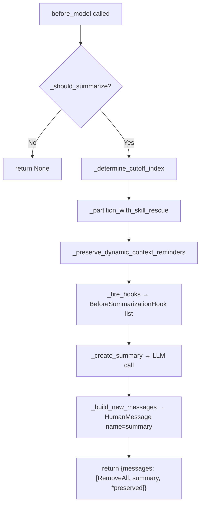
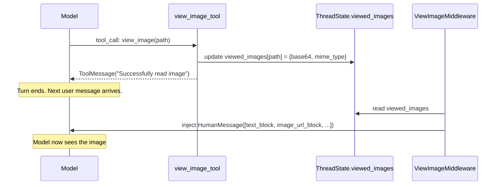
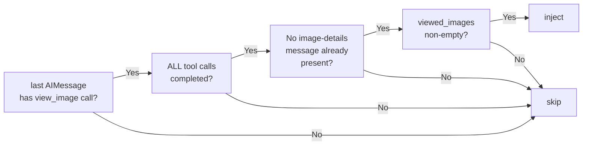
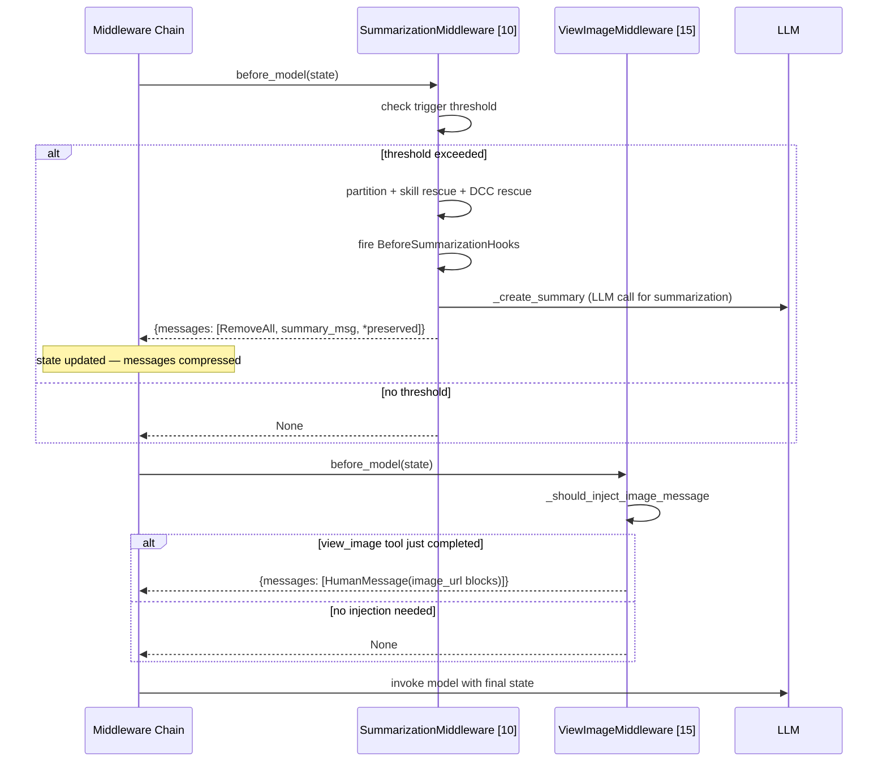

# Middleware Pipeline — Phase 5: Before-Model Middlewares

## Purpose

Phase 5 covers the two middlewares that implement `before_model` — the hook that fires **before every LLM call** within a single agent run. Unlike `before_agent` (which runs once at run start) or `wrap_tool_call` (which runs per-tool), `before_model` can fire many times per run — once per model invocation in the turn loop.

The two middlewares here solve orthogonal problems:

- **SummarizationMiddleware** [pos 10] — keeps the conversation context from overflowing the model's token limit by compressing old history into a summary.
- **ViewImageMiddleware** [pos 15] — makes base64-encoded image data available to vision-capable models on the turn immediately after a `view_image` tool call completes.

Both inject content into the message list rather than mutating agent logic, keeping them composable with the rest of the chain.

## Key Files

- `agents/middlewares/summarization_middleware.py` — `DeerFlowSummarizationMiddleware` [pos 10]: extends LangChain's base with hook dispatch, skill rescue, and DCC preservation
- `config/summarization_config.py` — `SummarizationConfig`: Pydantic config for summarization feature (disabled by default)
- `agents/middlewares/view_image_middleware.py` — `ViewImageMiddleware` [pos 15]: injects base64 image payloads before LLM call
- `tools/builtins/view_image_tool.py` — `view_image_tool`: the first half of the vision pipeline (reads file, stores in state)
- `agents/memory/summarization_hook.py` — `memory_flush_hook`: plugs into `BeforeSummarizationHook` to flush about-to-be-summarized messages into the memory queue

---

## SummarizationMiddleware [pos 10]

### Architecture

`DeerFlowSummarizationMiddleware` extends LangChain's `SummarizationMiddleware`. The base class handles everything about _when_ and _how_ to summarize: trigger evaluation, cutoff finding, message partitioning, trimming, and LLM invocation. DeerFlow adds three concerns on top without modifying the base logic:

1. **`BeforeSummarizationHook` dispatch** — notifies registered hooks before any messages are compressed.
2. **Skill bundle rescue** — prevents skill file contents from being summarized away.
3. **Dynamic-context reminder preservation** — keeps `DynamicContextMiddleware`'s hidden system reminders in the correct position.



### Trigger Evaluation — Two Paths

`_should_summarize` has two independent paths. Both must be checked on every call:

**Path 1 — Approximation counter:**

```python
total_tokens = self.token_counter(messages)
if total_tokens >= threshold:
    return True
```

Fast, uses local approximation (character-based heuristic). May under-count multimodal content.

**Path 2 — Provider-reported tokens (`_should_summarize_based_on_reported_tokens`):**

```python
last_ai_message.usage_metadata.get("total_tokens") >= threshold
```

Reads the actual billing count from the last AIMessage's `usage_metadata`. This is the fallback when the approximation says "you're fine" but the provider has already charged past the threshold.

**Why only the last AIMessage?**
`total_tokens` in provider `usage_metadata` is not the cost of that single response — it is the **running total of the entire context window** fed into the model for that call (all prior messages + system prompt + response). The last AIMessage therefore already represents the current context size. Earlier AIMessages would give stale, smaller readings from when the conversation was shorter.

**Provider identity guard:**
The method also checks `last_ai_message.response_metadata["model_provider"] == self.model._get_ls_params()["ls_provider"]`. If the user switched models mid-conversation (e.g. from GPT-4o → Claude), the earlier message's token count was counted by a different tokenizer — applying it as a threshold for the new model would be meaningless. The guard prevents that.

### Configuration

`SummarizationConfig` (disabled by default, `enabled: False`) wraps LangChain's `ContextSize` tuple format in a Pydantic model:

```python
class ContextSize(BaseModel):
    type: Literal["fraction", "tokens", "messages"]
    value: int | float

    def to_tuple(self):  # bridges to LangChain's (type, value) tuple
        return (self.type, self.value)
```

Three trigger types:

- `messages` — trigger at N messages
- `tokens` — trigger at N tokens (also uses the provider-reported fallback path)
- `fraction` — trigger at X% of model's `max_input_tokens` profile

The `keep` field controls how much history survives after summarization (default: 20 messages).

**DeerFlow-only fields** (not in LangChain's base):

| Field                                    | Default                                | Purpose                                       |
| ---------------------------------------- | -------------------------------------- | --------------------------------------------- |
| `preserve_recent_skill_count`            | 5                                      | Max skill bundles to rescue                   |
| `preserve_recent_skill_tokens`           | 25,000                                 | Total token budget for all rescued bundles    |
| `preserve_recent_skill_tokens_per_skill` | 5,000                                  | Per-bundle cap (large skills are not rescued) |
| `skill_file_read_tool_names`             | `["read_file", "read", "view", "cat"]` | Tool names that count as skill reads          |

### Skill Bundle Rescue — Full Dry Run

**Problem:** Skill content lives in `ToolMessage` bodies. If the `ToolMessage` for `read_file(/mnt/skills/alpha/SKILL.md)` gets summarized away, the model loses the operational instructions for that skill mid-conversation.

**Solution:** `_partition_with_skill_rescue` identifies AIMessage + ToolMessage pairs that loaded skill files and moves them from `messages_to_summarize` to `preserved_messages`, respecting count and token budgets.

#### Dry-run example

Starting state — 8 messages, trigger at 8, keep last 2:

```
[0] HumanMessage:  "use the alpha skill and check my notes"
[1] AIMessage:     content="I'll read the skill file and your notes"
                   tool_calls=[
                     {id:"t1", name:"read_file", path:"/mnt/skills/alpha/SKILL.md"},  ← skill
                     {id:"t2", name:"read_file", path:"/mnt/user-data/notes.md"}       ← non-skill
                   ]
[2] ToolMessage:   "Alpha skill body: do X then Y", tool_call_id="t1"
[3] ToolMessage:   "Notes: meeting at 3pm",         tool_call_id="t2"
[4] HumanMessage:  "ok do it"
[5] AIMessage:     content="Doing it now..."
[6] HumanMessage:  "follow-up question"
[7] AIMessage:     content="Final answer"
```

After parent `_partition_messages` (keep last 2):

```
to_summarize = [0..5]
preserved    = [6, 7]
```

`_find_skill_bundles` finds one bundle: `ai_index=1`, `skill_tool_indices=(2,)`, `skill_tool_call_ids={"t1"}`.

`_select_bundles_to_rescue` keeps it (within budget). The split loop:

```
i=0  HumanMessage          → remaining
i=1  AIMessage (mixed)     → SPLIT:
       clone A → rescued:   tool_calls=[t1], content=""
       clone B → remaining: tool_calls=[t2], content="I'll read the skill file and your notes"
i=2  ToolMessage t1        → rescued (in rescue_tool_indices)
i=3  ToolMessage t2        → remaining
i=4  HumanMessage          → remaining
i=5  AIMessage             → remaining
```

Final return:

```
messages_to_summarize = [msg0, cloneB, msg3, msg4, msg5]
preserved_messages    = [cloneA, msg2, msg6, msg7]
                         ↑ rescued ↑    ↑ tail ↑
```

What the model sees after summarization:

```
[summary: "User asked to use alpha skill and check notes..."]
[AIMessage:  content="",  tool_calls=[t1]]       ← structural stub
[ToolMessage: "Alpha skill body: do X then Y"]   ← skill context preserved
[HumanMessage: "follow-up question"]
[AIMessage:   "Final answer"]
```

#### Why `content=""` on the rescued AIMessage clone?

When an AIMessage mixes skill and non-skill tool calls, it is split into two clones:

- **Clone A (rescued):** skill calls only, `content=""`
- **Clone B (remaining):** non-skill calls, original content

The original text content (e.g. `"I'll read the skill file and your notes"`) belongs logically with clone B — it described the combined intent. Keeping it on clone A would:

1. Duplicate the prose: the model sees it both verbatim in the preserved section and paraphrased in the summary.
2. Create a lying AIMessage: it says "I'll read the skill file **and your notes**" but the notes ToolMessage was summarized away.

Clone A is a **silent structural stub** — its only job is to anchor the ToolMessage for graph validity. No prose needed.

**Special case — all tool calls are skill reads, non-empty content:**
If `remaining_tool_calls == []` but `msg.content` is truthy, clone B is still emitted with `tool_calls=[]` and the original content, so the prose reaches the summarizer. Content is never silently dropped when it existed.

### `_build_new_messages` Override

The base class creates:

```python
HumanMessage(content="Here is a summary...", additional_kwargs={"lc_source": "summarization"})
```

DeerFlow overrides to add `name="summary"`:

```python
HumanMessage(content="Here is a summary...", name="summary")
```

The `name="summary"` attribute is the frontend's signal to hide this message from the chat UI. Without it, the summary would render as a plain user turn.

### Dynamic-Context Reminder Preservation

`DynamicContextMiddleware` (pos 9) injects a hidden `HumanMessage` before the first real user turn carrying the current date and user memory. If summarization removes it, `DynamicContextMiddleware` will identify the summary `HumanMessage` as the "first user turn" and re-inject the reminder in the wrong position.

`_preserve_dynamic_context_reminders` rescues all messages tagged with `_DYNAMIC_CONTEXT_REMINDER_KEY` from `messages_to_summarize` and prepends them to `preserved_messages`. Simple but essential cross-middleware coordination.

### BeforeSummarizationHook — Memory Integration

The `BeforeSummarizationHook` protocol receives an immutable `SummarizationEvent` snapshot before any messages are removed:

```python
@dataclass(frozen=True)
class SummarizationEvent:
    messages_to_summarize: tuple[AnyMessage, ...]
    preserved_messages: tuple[AnyMessage, ...]
    thread_id: str | None
    agent_name: str | None
    runtime: Runtime
```

`memory_flush_hook` (in `agents/memory/summarization_hook.py`) plugs in here. Without it, turns that get summarized would never reach the memory updater — they'd be permanently lost from the memory queue. The hook filters the about-to-be-summarized messages (user + final AI responses only) and pushes them into the memory queue before they disappear.

Hook error handling: each hook is called in a `try/except`; a broken hook logs the exception but never blocks summarization from completing.

---

## ViewImageMiddleware [pos 15]

### The Two-Step Vision Pattern

Putting full base64 image data directly in a `ToolMessage` body would bloat the message history on every turn. Instead, DeerFlow splits image handling into two stages:



**Step 1 — `view_image_tool`:** Reads the file, base64-encodes it, stores in `state["viewed_images"]`, returns a minimal `"Successfully read image"` ToolMessage. The base64 payload never pollutes the tool result history.

**Step 2 — `ViewImageMiddleware.before_model`:** Reads `viewed_images` and injects a multimodal `HumanMessage` with `image_url` content blocks before the next LLM call. The injection fires exactly when needed, not on every turn.

### Injection Gate — `_should_inject_image_message`

Four conditions must all pass:



**Why ALL tools must complete (not just view_image ones):** If the AIMessage called `view_image` and `bash` together, the model hasn't seen the `bash` result yet when it only has one ToolMessage. Injecting image data at that point would interleave image context with incomplete tool state. The gate waits until the full turn is resolved.

**Why all images, not just new ones:** `viewed_images` is an accumulating dict (via `merge_viewed_images` reducer in `ThreadState`). The middleware re-injects the full set on every qualifying turn — the model always has the complete image context, not just the most recent image.

### Content Block Format

```python
# Per image, two blocks are added:
{"type": "text",  "text": f"\n- **{image_path}** ({mime_type})"}
{"type": "image_url", "image_url": {"url": f"data:{mime_type};base64,{base64_data}"}}
```

This is the **OpenAI `image_url` with data URI format** — the de facto cross-provider standard in LangChain. Provider adapters normalize it:

| Provider adapter         | Handling                                             |
| ------------------------ | ---------------------------------------------------- |
| `langchain_openai`       | Passes through as-is                                 |
| `langchain_anthropic`    | Converts data URI → Anthropic `source.base64` format |
| `langchain_google_genai` | Converts internally                                  |

Using the Anthropic native format (`type: image, source: {type: base64, ...}`) would break portability. DeerFlow's choice of `image_url` here is intentional — the `supports_vision` flag in `config.yaml` allows swapping models, and the middleware must work regardless of which provider is active.

### Deduplication

The already-injected check uses a string scan:

```python
if "Here are the images you've viewed" in str(msg.content):
    return False
```

`str(msg.content)` is called because the injected content is a `list[dict]`, not a plain string. Python's `str()` on a list of dicts renders consistently enough for this check. A legacy marker (`"Here are the details of the images you've viewed"`) is also recognised for backward compatibility.

This is pragmatic but fragile: a user message that contains this exact phrase would silently suppress injection. No structured flag (e.g. `additional_kwargs` marker) is used.

### `ViewImageMiddlewareState`

```python
class ViewImageMiddlewareState(ThreadState):
    """Reuse the thread state so reducer-backed keys keep their annotations."""
```

Empty subclass. Exists purely to give the middleware a typed lens over `ThreadState` (specifically `viewed_images`) without redefining any fields. The runtime state IS `ThreadState`; this is a type annotation convenience.

---

## Phase 5 — Combined Execution Flow

Both middlewares fire on `before_model`. In chain order (pos 10 before pos 15), summarization runs first:



If both fire on the same turn (summarization + new image), the model sees: `[summary message] [rescued skill bundles] [recent tail] [image injection message]`. The image injection sits after the summary because ViewImageMiddleware runs after SummarizationMiddleware.

---

## My Insights

**Summarization as a first-class concern, not an afterthought.** Most agent frameworks leave context management to the user. DeerFlow makes it a pluggable middleware with three DeerFlow-specific extensions (hooks, skill rescue, DCC preservation). Each extension exists because the base LangChain summarizer has no awareness of DeerFlow's domain objects.

**Skill rescue solves the "model forgets how to use its tools" problem.** Without it, a long conversation where the agent loaded skill files early would eventually summarize those skill instructions away, and the model would start hallucinating tool usage or failing tool calls. The token-budget approach (per-bundle cap + total cap) ensures the rescue doesn't itself blow up the preserved context.

**The `content=""` on rescued AIMessage clones.** This is the subtlest part of skill rescue. When an AIMessage has both skill and non-skill calls, it must be split. The rescued clone gets `content=""` to avoid: (1) duplicating the prose across preserved + summarized sections, and (2) creating a lying AIMessage that mentions context ("your notes") that was summarized away. The rescued clone is a structural stub — it only exists to satisfy the AIMessage → ToolMessage pairing invariant in LangGraph.

**`_should_summarize_based_on_reported_tokens` only reads the last AIMessage.** This is correct because `total_tokens` in provider `usage_metadata` is a running total of the entire context fed into that call — not just the cost of that response. The last AIMessage gives the most recent reading of "how big is the context right now?" Earlier readings are stale.

**ViewImageMiddleware is the consumer, view_image_tool is the producer.** The tool stores base64 in state (cheap, always); the middleware injects it before the model call (expensive in tokens, conditional). This split means the base64 payload never permanently inflates the message history — it gets injected fresh when needed, not stored in a ToolMessage forever.

**`image_url` data URI is the cross-provider standard.** Using Anthropic's native `{type: image, source: {type: base64}}` format would lock the middleware to a single provider. The `image_url` format is normalized by every major LangChain provider adapter, so it works regardless of which model is configured.

---

## Open Questions

- **`viewed_images` re-injection cost:** The middleware re-injects ALL accumulated images on every qualifying turn. In a long session with many images, this could add significant tokens per model call. Is there a `max_images` cap or a "clear viewed_images after injection" mechanism? Check `merge_viewed_images` reducer for a clear signal.
- **Deduplication fragility:** The `"Here are the images you've viewed"` string scan could be defeated by user input that contains this phrase. Should a structured marker (e.g. `additional_kwargs={"_view_image_injected": True}`) be used instead?
- **SummarizationMiddleware + ViewImageMiddleware ordering:** If summarization runs and compresses old turns that included image injections, the model loses awareness that those images were ever seen. On the next qualifying `view_image` turn, the full set is re-injected from `viewed_images` state — but the intermediate turns where the model analysed them are gone. Is this an issue for multi-image workflows?

---

## Links to Related Sections

- [[09a-middleware-pipeline-overview]] — chain assembly; how `before_model` hooks are wired
- [[09b-before-agent-middlewares]] — `DynamicContextMiddleware` [pos 9]: the reminder that `_preserve_dynamic_context_reminders` rescues
- [[10-memory-system]] — `memory_flush_hook` is the primary consumer of `BeforeSummarizationHook`; the memory queue that receives pre-compression messages
