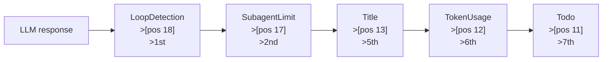
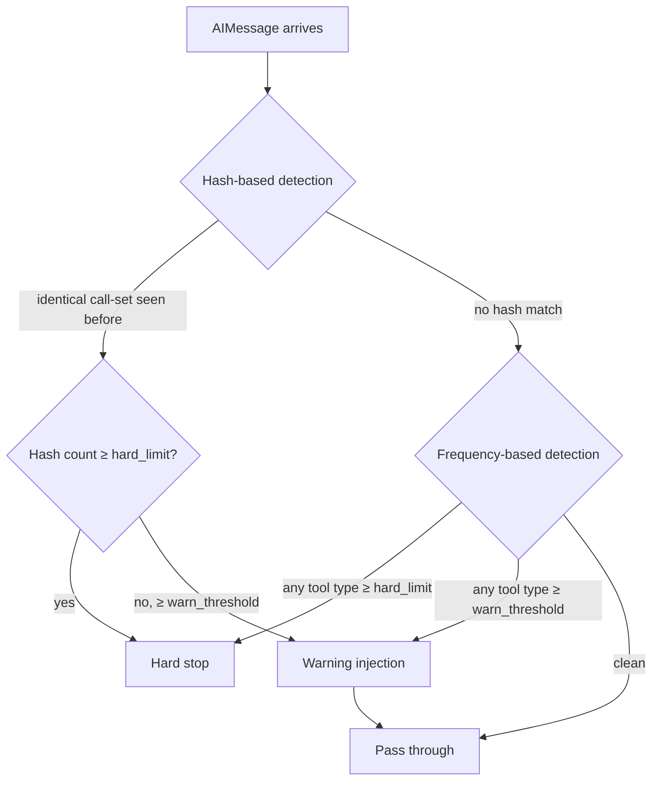
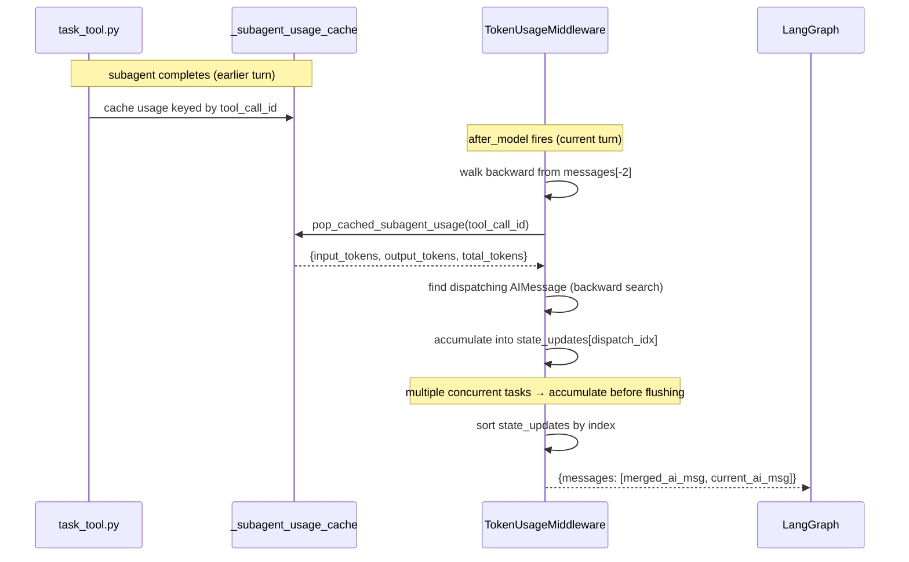
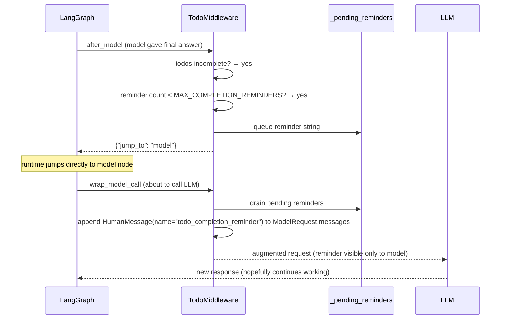

# Middleware Pipeline — Phase 6: After-Model Middlewares

## Purpose

After-model middlewares fire once per LLM response, in **reverse** chain order (highest position first). They form the post-processing layer: they validate the model output, enforce limits, enrich messages with metadata, and in one case redirect control flow back to the model. This file covers the five Phase 6 middlewares in the order they actually fire at runtime.

## Key Files

| File                                                                                  | Pos | Fires order             |
| ------------------------------------------------------------------------------------- | --- | ----------------------- |
| `agents/middlewares/loop_detection_middleware.py` + `config/loop_detection_config.py` | 18  | 1st                     |
| `agents/middlewares/subagent_limit_middleware.py`                                     | 17  | 2nd                     |
| `agents/middlewares/title_middleware.py` + `config/title_config.py`                   | 13  | 5th                     |
| `agents/middlewares/token_usage_middleware.py` + `config/token_usage_config.py`       | 12  | 6th                     |
| `agents/middlewares/todo_middleware.py`                                               | 11  | 7th                     |
| `agents/middlewares/tool_call_metadata.py`                                            | —   | Shared helper (no hook) |

## Firing Order — Why Reverse?

`after_model` fires in reverse list order because the middleware chain is modelled as a stack: the outermost wrapper (lowest position) is the last to process the model response. This is the standard middleware/decorator pattern — the layer that goes on first comes off last.



Positions 16, 15, 14 are occupied by middlewares with no `after_model` hook (DeferredToolFilter, ViewImage, Memory) — they are skipped silently.

---

## 1. LoopDetectionMiddleware (pos 18, fires 1st)

### What it does

Detects repetitive tool call patterns and either warns the model or hard-stops the run. It fires first in the reverse pass so it can abort before any downstream middleware spends effort on a response that's going to be discarded.

### Two-Layer Detection

Loop detection operates at two independent levels simultaneously:



**Hash-based (call-set fingerprinting):** hashes the full _set_ of tool calls in an AIMessage (order-independent) and tracks how many times the same set has appeared in the current thread. Two responses calling `{read_file, web_search}` in different orders produce the same hash.

**Frequency-based (per-tool-type):** tracks how many times each tool _type_ (e.g., `read_file`, `web_search`) has appeared across all calls in the thread, regardless of which response they appeared in. This catches slow-building loops where no single response repeats but the model keeps reaching for the same tool.

### `_stable_tool_key` — Tool-Specific Fingerprinting

The hash-based detector normalises each tool call into a "stable key" before hashing. The normalisation is tool-specific:

| Tool            | Key includes                                       |
| --------------- | -------------------------------------------------- |
| `read_file`     | `path` + **line bucket** (200-line range)          |
| `write_file`    | full args hash                                     |
| `str_replace`   | full args hash                                     |
| everything else | salient fields only (tool name + primary argument) |

The bucket for `read_file` is: `bucket = (start_line - 1) // 200`.

**Worked example:**

```
read_file(path="foo.py", start_line=1, end_line=50)   → bucket 0  (lines 1–200)
read_file(path="foo.py", start_line=150, end_line=200) → bucket 0  (same bucket — same key)
read_file(path="foo.py", start_line=201, end_line=250) → bucket 1  (lines 201–400)
```

Two reads of the same file in the same 200-line window look identical. Reads of different windows produce different keys. This prevents false positives when the model is reading a file sequentially (different windows = distinct keys) while still catching true loops (same window, same file, called again).

The full hash is computed over sorted stable keys — order-independent, so calling `{A, B}` and `{B, A}` in different responses both hash to the same value.

### LRU Cache for Per-Thread Tracking

All tracking dicts are protected by `threading.Lock()`. Even though data is logically per-thread, the middleware is a **shared singleton** — multiple threads (conversation sessions) share one physical data structure. The lock prevents concurrent write races.

A `_call_set_cache: OrderedDict[str, int]` acts as an LRU: when the cache exceeds the configured maximum, the oldest-accessed entry is evicted. This bounds memory for long-lived agents serving many concurrent users.

**Thread = conversation session.** `thread_id` maps to one user's conversation. Tracking accumulates within a thread across multiple agent runs (multiple user turns) so slow-building loops — where the pattern builds over several exchanges — are still caught.

### Warning vs Hard Stop

**Warning branch:** appends an instruction to the AIMessage content asking the model to try a different approach. This is deliberately an AIMessage mutation, not a new HumanMessage injection. Adding a HumanMessage between an AIMessage and its ToolMessages would break OpenAI and Moonshot's strict tool-call pairing validation — the provider expects `AIMessage(tool_calls=[...])` to be immediately followed by corresponding `ToolMessage`s.

> RFC #2517 tracks a proper fix: move the warning injection to `wrap_model_call` (a system prompt addition) instead of mutating the AIMessage.

**Hard stop branch:** patches the AIMessage to remove all tool calls in three representations simultaneously:

- `message.tool_calls` — structured list used by LangChain
- `message.additional_kwargs["tool_calls"]` — raw provider payload
- `message.additional_kwargs["function_call"]` — legacy OpenAI function-calling format
- `response_metadata["finish_reason"]` patched to `"stop"` — so downstream code treats it as a final answer

All three must be cleared or the LangGraph runtime will attempt to execute the tool calls from the raw payload even when `tool_calls` is empty.

### Config: `LoopDetectionConfig`

```python
class LoopDetectionConfig(BaseModel):
    enabled: bool = True
    hash_warn_threshold: int = 2
    hash_hard_limit: int = 3
    freq_warn_threshold: int = 10
    freq_hard_limit: int = 15
    tool_freq_overrides: list[ToolFreqOverride] = []

    @model_validator(mode="after")
    def validate_thresholds(self):
        assert self.hash_hard_limit >= self.hash_warn_threshold
        assert self.freq_hard_limit >= self.freq_warn_threshold
        # also checks each override: hard >= warn
```

`ToolFreqOverride` lets operators set per-tool frequency limits (e.g., `web_search` might be allowed more repetition than `bash`).

---

## 2. SubagentLimitMiddleware (pos 17, fires 2nd)

### What it does

Truncates excess `task` tool calls when the model dispatches more concurrent subagents than `max_concurrent` allows (default 3, clamped to [2, 4]). Stateless — no lock needed because it reads only the current AIMessage, not accumulated history.

### `_truncate_task_calls` — Dry Run

```
Input: 5 tool calls, max_concurrent=3

  [0] {"id": "c1", "name": "web_search", "args": {"query": "..."}}
  [1] {"id": "c2", "name": "task", "args": {"description": "Research A"}}
  [2] {"id": "c3", "name": "task", "args": {"description": "Research B"}}
  [3] {"id": "c4", "name": "task", "args": {"description": "Research C"}}
  [4] {"id": "c5", "name": "task", "args": {"description": "Research D"}}

Step 1 — separate task from non-task:
  task_calls     = [c2, c3, c4, c5]
  non_task_calls = [c1]

Step 2 — keep only first max_concurrent task calls:
  kept_task_calls = [c2, c3, c4]   (c5 dropped)

Step 3 — rebuild list:
  result = [c1, c2, c3, c4]   (non-task calls preserved, tasks truncated)

Step 4 — sync raw provider payload:
  kept_ids = {"c1", "c2", "c3", "c4"}
  additional_kwargs["tool_calls"] filtered to only those IDs
  finish_reason patched to "tool_calls"
```

Non-task tool calls are always preserved regardless of how many there are. The limit applies only to `task` calls. `clone_ai_message_with_tool_calls()` from `tool_call_metadata.py` handles the raw payload sync.

### `tool_call_metadata.py` — The Three-Representation Problem

`AIMessage` holds tool calls in three places simultaneously:

1. `message.tool_calls` — structured list (LangChain's canonical form)
2. `message.additional_kwargs["tool_calls"]` — raw provider payload (list of dicts, keyed by `id`)
3. `message.additional_kwargs["function_call"]` — legacy OpenAI format (single dict, first call only)

Modifying only one representation breaks the runtime. `clone_ai_message_with_tool_calls(message, kept_ids)` is the shared helper that keeps all three in sync:

- Filters raw payload to `kept_ids`
- Clears `function_call` if `kept_ids` is empty
- Patches `finish_reason` appropriately

This helper is used by both `SubagentLimitMiddleware` and `LoopDetectionMiddleware`'s hard-stop branch.

---

## 3. TitleMiddleware (pos 13, fires 5th)

### What it does

Auto-generates a thread title after the first complete exchange. Fires only on the turn where `user_messages == 1` — exactly once per thread.

### First-Turn Detection

```python
user_messages = [m for m in messages if _is_user_message_for_title(m)]
assistant_messages = [m for m in messages if m.type == "ai"]
return len(user_messages) == 1 and len(assistant_messages) >= 1
```

`== 1` (not `>= 1`) ensures the title is generated exactly once. Once `state["title"]` is set, the short-circuit at the top of `_should_generate_title` prevents all future calls from reaching this check.

`>= 1` assistant messages allows for multi-step first turns: the model may make tool calls before giving a final answer. All those intermediate AIMessages count — the title generates as soon as any assistant message is present, even if it's a tool-call-only response.

`_is_user_message_for_title` filters out `DynamicContextMiddleware` injections (flagged with `additional_kwargs["dynamic_context_reminder"]`). Without this filter, injected HumanMessages would count as "user messages" and break the `== 1` detection.

### Sync vs Async Split

| Path                   | Implementation                                                                         |
| ---------------------- | -------------------------------------------------------------------------------------- |
| `after_model` (sync)   | Local truncation of the user message — NO LLM call                                     |
| `aafter_model` (async) | Full LLM call with `thinking_enabled=False`, falls back to local truncation on failure |

The sync path is a **safe degradation**, not a real implementation. All production calls go through the async path (`astream()`). The sync path exists only for tests and callers that can't await.

`thinking_enabled=False` is set explicitly on the title model call. Reasoning models emit `<think>...</think>` blocks before their actual response. `_strip_think_tags()` removes these at two points:

1. From the **assistant message** before it's sent as context to the title model (prevents leaking internal traces)
2. From the **title model's response** before the title is parsed

### Telemetry Tag

```python
config["run_name"] = "title_agent"
config["tags"] = [*(config.get("tags") or []), "middleware:title"]
```

The `middleware:title` tag separates this LLM call from lead agent calls in RunJournal and billing attribution. Without it, the title generation cost would be charged to the lead agent's run.

---

## 4. TokenUsageMiddleware (pos 12, fires 6th)

### What it does

Two independent responsibilities in one `after_model` call:

1. **Step attribution** — builds a `token_usage_attribution` dict in each AIMessage's `additional_kwargs` describing what kind of step it was and what tools ran
2. **Subagent token merging** — walks backward through completed `ToolMessage`s, pops their cached subagent usage, and\ merges the token counts back into the dispatching AIMessage

### Cross-Message Token Accumulation

When a subagent task completes, `task_tool.py` caches its token usage in a module-level dict keyed by `tool_call_id`. On the next `after_model` call, `TokenUsageMiddleware` walks backward through the message list to find and merge these cached values.

The walk starts at `messages[-2]` (not `messages[-1]`) because `messages[-1]` is the **current AIMessage** — the one the model just produced. The ToolMessages from completed subagent tasks sit before it.



**Key:** when one AIMessage dispatches multiple concurrent `task` calls, their tokens must all accumulate into `state_updates[dispatch_idx]` before any write is committed. The dict accumulation pattern ensures this:

```python
existing_update = state_updates.get(dispatch_idx)
prev = existing_update.usage_metadata if existing_update else candidate.usage_metadata
merged = {**prev, "input_tokens": prev.get(...) + subagent_usage["input_tokens"], ...}
state_updates[dispatch_idx] = candidate.model_copy(update={"usage_metadata": merged})
```

### Step Attribution Schema

```python
{
    "version": 1,
    "kind": "tool_batch" | "subagent_dispatch" | "todo_update" | "final_answer" | "thinking",
    "shared_attribution": True,   # True when actions > 1 → cost split across multiple tools
    "tool_call_ids": ["call_1", "call_2"],
    "actions": [
        {"kind": "search", "tool_name": "web_search", "query": "...", "tool_call_id": "call_1"},
        {"kind": "subagent", "description": "...", "subagent_type": "...", "tool_call_id": "call_2"},
    ]
}
```

`version: 1` makes the schema additive-forward-compatible: older frontends can ignore unknown keys and fall back to a generic label. New fields must never be breaking changes.

`shared_attribution: True` tells the frontend that token costs can't be cleanly split — the total cost should be displayed as shared across all tools in the step, not attributed fully to each one.

### `_build_todo_actions` — Diff Algorithm

`write_todos` is special: one tool call may start a task, complete another, and add a third. The middleware diffs `previous_todos` vs `next_todos`:

1. **Content-first:** scan for a previous todo with the same text → same task, status may have changed
2. **Position fallback:** if no content match, pair by list index → treat as an edited/replaced task
3. **Unmatched previous entries** → `todo_remove`

```
previous_todos:  [A:pending, B:in_progress, C:pending]
next_todos:      [A:completed, D:pending, C:in_progress]

Step 1 — content-first matches:
  A:completed matched to A:pending (same content) → todo_complete
  C:in_progress matched to C:pending (same content) → todo_start

Step 2 — position fallback:
  D:pending at index 1 → index 1 in previous is B:in_progress (already unmatched) → todo_update

Step 3 — unmatched previous entries:
  B:in_progress was consumed by the position fallback → matched, no remove

Result: [todo_complete("A"), todo_update("D"), todo_start("C")]
```

### Lazy Import — Circular Dependency Break

```python
# Inside _apply(), NOT at module level:
from deerflow.tools.builtins.task_tool import pop_cached_subagent_usage
```

`task_tool.py` imports from `deerflow.subagents`, which is initialised by the same agent factory that imports `token_usage_middleware` at module level. A module-level import would form a circular dependency. The lazy import inside `_apply()` defers resolution until the first actual `after_model` call — by then all modules are fully initialised.

---

## 5. TodoMiddleware (pos 11, fires 7th)

### What it does

Extends `TodoListMiddleware` with two safety mechanisms not present in the base class:

1. **Context-loss detection** (`before_model`) — re-injects the todo list when `SummarizationMiddleware` has truncated the original `write_todos` call out of the message window
2. **Premature exit prevention** (`after_model`) — when the model tries to give a final answer while todos are still incomplete, queues a reminder and jumps control back to the model

### The State vs Messages Asymmetry

This is the architectural insight that makes both mechanisms possible:

```
state["todos"]    → [{"content": "...", "status": "in_progress"}]   ← persisted; survives summarization
state["messages"] → [summary_HumanMessage, ...]                      ← write_todos call truncated away
```

`state["todos"]` is a first-class graph state key — it's saved separately from `state["messages"]`. When `SummarizationMiddleware` compresses old messages into a summary, the todo list in `state["todos"]` remains intact. The model loses awareness of it, but the data isn't gone.

`_todos_in_messages()` detects the gap: todos exist in state but no `write_todos` call is visible in messages. When the gap is detected, a `HumanMessage(name="todo_reminder")` is injected. Three guard conditions prevent double-injection:

- `todos` must be non-empty
- No `write_todos` visible in messages
- No `todo_reminder` already present in messages

### Two-Phase Completion Reminder

This is the most architecturally interesting mechanism in Phase 6. When the model tries to exit early (no tool calls, but todos are incomplete):



**Why `wrap_model_call` and not a state update?**

The reminder must NOT be persisted to `state["messages"]`. If it were, it would:

- Appear in the user-facing transcript
- Get picked up by `SummarizationMiddleware` in future turns
- Potentially confuse `TitleMiddleware`'s user-message detection

By injecting into `ModelRequest` (a transient view of messages for one LLM call), the reminder is ephemeral. It exists only during the single model call and then disappears.

**Completion reminder cap:** `_MAX_COMPLETION_REMINDERS = 2`. After two reminders, `after_model` allows the model to exit even with incomplete todos. Without this cap, a model that can't make further progress would loop forever.

### State Management — (thread_id, run_id) Keying

Three in-memory dicts, all keyed by `(thread_id, run_id)`:

```python
_pending_completion_reminders: dict[tuple[str, str], list[str]]   # queued strings
_completion_reminder_counts:   dict[tuple[str, str], int]         # total sent (cap check)
_completion_reminder_touch_order: dict[tuple[str, str], int]      # LRU eviction order
```

Scoped per `(thread_id, run_id)` because:

- One thread can have multiple runs (user sends next message mid-run)
- Each run needs independent reminder state
- `before_agent`: clears stale state from other runs on the same thread (a new run invalidates any pending reminders from the previous abandoned run)
- `after_agent`: clears current run's state on clean exit

`_MAX_COMPLETION_REMINDER_KEYS = 4096` caps the total number of keys across all threads. When exceeded, the LRU eviction prunes the least-recently-touched keys.

### `_has_tool_call_intent_or_error` — Four-Field Defensive Check

Before treating an AIMessage as a "clean final answer", four independent signals are checked:

```python
if message.tool_calls:                                   # modern structured tool calls
    return True
if getattr(message, "invalid_tool_calls", None):         # parse failures
    return True
if additional_kwargs.get("tool_calls"):                  # raw provider payload
    return True
if additional_kwargs.get("function_call"):               # legacy OpenAI format
    return True
if response_metadata.get("finish_reason") in _TOOL_CALL_FINISH_REASONS:
    return True                                          # provider-level signal
```

The comment explicitly names the sentinel test `TestToolCallIntentOrError.test_langchain_ai_message_tool_fields_are_explicitly_handled` and says it must be updated on every LangChain upgrade. This is a known fragility — LangChain's internal representation of tool-call intent has drifted across versions.

---

## Cross-Cutting Patterns

### hide_from_ui — Injected Control Prompts

Both the context-loss reminder and the completion reminder set `additional_kwargs={"hide_from_ui": True}`:

```python
HumanMessage(name="todo_reminder", additional_kwargs={"hide_from_ui": True}, content=...)
HumanMessage(name="todo_completion_reminder", additional_kwargs={"hide_from_ui": True}, content=...)
```

This flag signals to the frontend that the message is a system control prompt and should not be rendered in the chat transcript. DeerFlow uses this pattern consistently for injected context: DynamicContext reminders, todo reminders, and completion reminders are all hidden.

### The Three-Representation Problem

A recurring concern across Phase 6: when an AIMessage is modified, all three representations of its tool calls must stay in sync. `clone_ai_message_with_tool_calls()` in `tool_call_metadata.py` is the shared solution. It's used by `SubagentLimitMiddleware` (truncation) and `LoopDetectionMiddleware` (hard stop). The pattern is:

```python
kept = clone_ai_message_with_tool_calls(message, kept_ids={tc["id"] for tc in kept_calls})
return {"messages": [kept]}
```

### Process-Global Caches Require Careful Design

Several Phase 6 middlewares use process-global (module-level) state:

| Middleware                         | Global state                        | Risk                                              |
| ---------------------------------- | ----------------------------------- | ------------------------------------------------- |
| `LoopDetectionMiddleware`          | `_call_set_cache`, 4 tracking dicts | LRU eviction bounded by config                    |
| `TokenUsageMiddleware` (task_tool) | `_subagent_usage_cache`             | No TTL — leaks if subagent never returns          |
| `TodoMiddleware`                   | 3 `(thread_id, run_id)` dicts       | Bounded by `_MAX_COMPLETION_REMINDER_KEYS = 4096` |

All three use `threading.Lock()` to guard concurrent access.

---

## Open Questions

- **`LoopDetectionMiddleware` warning + AIMessage downstream consumers**: the warning branch mutates AIMessage content by appending text. `MemoryMiddleware` and `TitleMiddleware` both read message content downstream. The warning text leaks into whatever they consume. RFC #2517 tracks the proper fix (inject via `wrap_model_call` system prompt instead).

- **`_subagent_usage_cache` no-TTL leak**: the module-level dict in `task_tool.py` has no eviction policy. If a subagent task times out and never produces a `ToolMessage`, the cache entry is never popped and grows indefinitely. This could be a memory concern in high-traffic deployments.

- **`_completion_reminder_count` dead code**: the module-level function `_completion_reminder_count(messages)` scans message history by name. The class's cap check uses the in-memory dict (`_completion_reminder_counts`), not this function. It appears unused — may be dead code or used only in tests.

- **jump_to model and before_model re-entry**: when `after_model` returns `{"jump_to": "model"}`, the LangGraph runtime jumps directly to the model node. Does it re-run all `before_model` middlewares in the chain? If so, `TodoMiddleware.before_model` could inject a second `todo_reminder` on the same turn as a pending `todo_completion_reminder` — both would be visible to the model simultaneously.

- **Non-ToolMessage between ToolMessage groups in TokenUsageMiddleware**: the backward walk stops at the first non-ToolMessage. If DynamicContextMiddleware or TodoMiddleware injected a HumanMessage between two groups of ToolMessages (e.g., a context reminder injected mid-run), the walk would stop prematurely and miss subagent tokens above the injection point.

---

## Links to Related Sections

- [[09a-middleware-pipeline-overview]] — chain assembly, complete position table, firing direction rules
- [[09b-before-agent-middlewares]] — before_agent hooks (ThreadData, Uploads, Sandbox, DynamicContext)
- [[08-lead-agent]] — `_build_middlewares()` assembles Phase 6 middlewares in Stage 2
- [[10-memory-system]] — `MemoryMiddleware` (pos 14) fires in `after_agent`, not `after_model` — covered in Phase 7
- [[15-sandbox]] — `SandboxMiddleware` and `SandboxAuditMiddleware` covered in Phase 2/4
