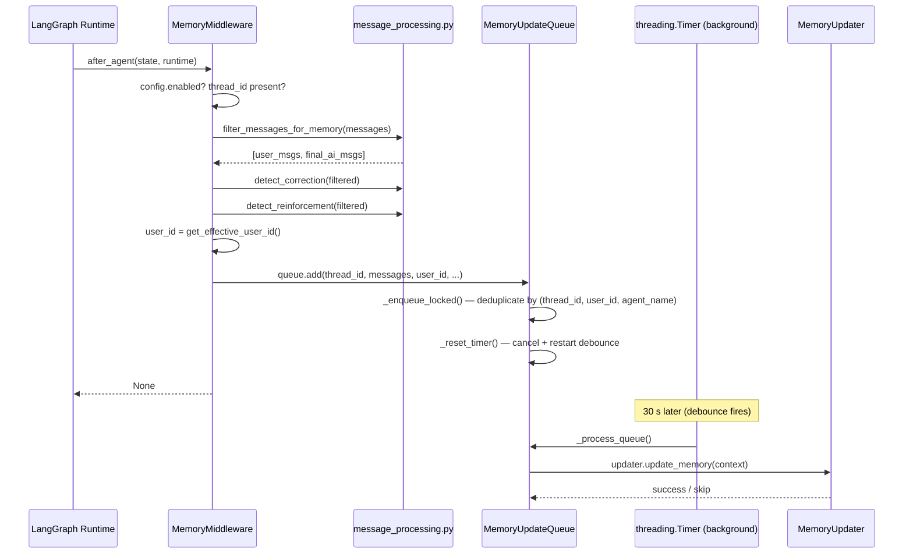
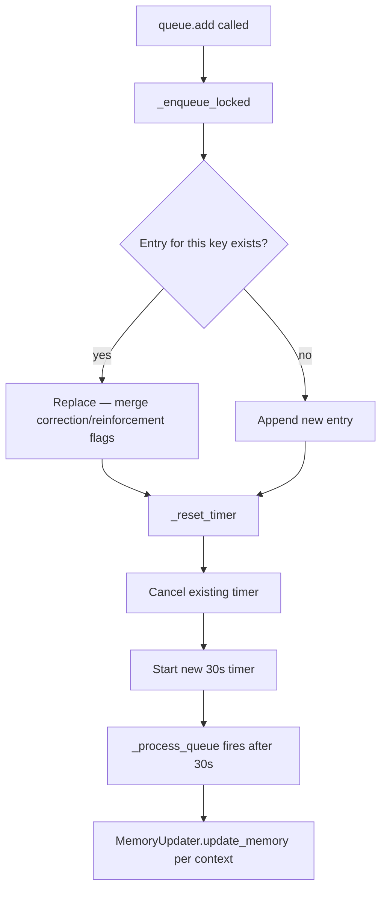

# Middleware Pipeline — Phase 7: After-Agent Teardown

## Purpose

After-agent middlewares fire **once**, after the entire agent run completes (all turns, all tool calls). They are the last code to run before the run is considered finished. This phase has two participants:

- **`SandboxMiddleware`** — releases the acquired sandbox (covered in [[09b-before-agent-middlewares]] where its `before_agent` acquire is documented)
- **`MemoryMiddleware`** — filters the completed conversation and enqueues it for async LLM-based memory extraction

This file covers `MemoryMiddleware` exclusively.

## Key Files

| File                                      | Pos | Hook                                             |
| ----------------------------------------- | --- | ------------------------------------------------ |
| `agents/middlewares/memory_middleware.py` | ~14 | `after_agent` only                               |
| `agents/memory/message_processing.py`     | —   | Shared filtering + signal detection helpers      |
| `agents/memory/queue.py`                  | —   | Debounce queue + `ConversationContext` dataclass |
| `config/memory_config.py`                 | —   | `MemoryConfig` Pydantic model + global accessor  |

## What MemoryMiddleware Does

`MemoryMiddleware` implements only `after_agent`. It never modifies state — it always returns `None`. Its job is entirely a side effect: hand the conversation off to the memory subsystem for background processing.



## The Four Guard Conditions

Before any enqueue happens, `after_agent` checks four conditions in order. If any fails, it returns `None` immediately:

1. `config.enabled` — master memory switch
2. `thread_id` resolvable — two-step fallback: `runtime.context["thread_id"]` → `get_config()["configurable"]["thread_id"]`
3. `state["messages"]` non-empty
4. Filtered messages contain at least one user message **and** one AI message

Condition 4 is the semantic guard. A thread that only contains upload confirmations or tool-call intermediaries produces no meaningful exchange worth remembering.

## Message Filtering — What Gets Into Memory

`filter_messages_for_memory()` in `message_processing.py` applies two rules:

| Message type              | Rule                                                                                                                                                                      |
| ------------------------- | ------------------------------------------------------------------------------------------------------------------------------------------------------------------------- |
| `human`                   | Included, with uploaded-file blocks stripped. If stripping leaves empty content, the message is dropped and its paired AI response is also skipped (`skip_next_ai` flag). |
| `ai` with `tool_calls`    | Dropped. Intermediate reasoning steps don't belong in memory.                                                                                                             |
| `ai` without `tool_calls` | Included. This is the final answer text.                                                                                                                                  |
| `tool` (ToolMessage)      | Always dropped. Tool results are scaffolding, not conversation.                                                                                                           |

**Why this matters:** The memory LLM only sees the human-readable exchange — question and final answer. Tool invocations, file reads, web search results, and subagent outputs are invisible to it. This keeps facts extracted from memory grounded in the actual conversation, not operational noise.

## Correction and Reinforcement Signals

Before enqueuing, the middleware checks for two mutually exclusive signals in the last 6 user messages:

```python
correction_detected = detect_correction(filtered_messages)
reinforcement_detected = not correction_detected and detect_reinforcement(filtered_messages)
```

**Correction patterns** (English + Chinese): `"that's wrong"`, `"you misunderstood"`, `"try again"`, `"不对"`, `"重试"`, `"换一种"`, etc.

**Reinforcement patterns**: `"yes, exactly"`, `"perfect"`, `"that's right"`, `"keep doing that"`, `"对，就是这样"`, `"继续保持"`, etc.

These signals are stored in `ConversationContext` and forwarded to `MemoryUpdater.update_memory()`. The updater uses them to modulate how aggressively it rewrites existing facts. They do not change whether memory runs — only how it runs.

The mutual exclusion (`not correction_detected and ...`) is intentional: a turn cannot simultaneously be a correction and a reinforcement. Checking correction first means a message like `"wrong, redo — actually no, keep that"` is treated as a correction.

## The threading.Timer / ContextVar Hazard

This is the most important implementation detail in the file:

```python
# Capture user_id HERE — on the request thread — before enqueue.
# threading.Timer fires on a separate thread where ContextVar values
# are NOT propagated.
user_id = get_effective_user_id()
queue.add(..., user_id=user_id, ...)
```

`get_effective_user_id()` reads a `ContextVar` that is set per-request. When the debounce timer fires (30 seconds later, on a background thread), that `ContextVar` no longer exists. If `user_id` were resolved inside `_process_queue()`, it would always return `"default"` — breaking per-user memory isolation for every user except the default one.

The fix: capture the string value at enqueue time and store it in `ConversationContext`. The timer thread reads the stored string, not the ContextVar.

## The Debounce Queue

`MemoryUpdateQueue` (singleton via `get_memory_queue()`) uses a `threading.Timer` to batch rapid updates:



**Deduplication key:** `(thread_id, user_id, agent_name)`. If the same thread sends two messages within 30 seconds (rapid back-and-forth), only the latest conversation snapshot is processed — the earlier one is replaced. This avoids redundant LLM calls for the same thread.

**Correction/reinforcement merging:** when replacing an existing entry, the merged flags are `OR`-ed: `merged_correction = new_correction OR existing_correction`. A correction signal is never lost even if the deduplication replaces the entry.

## Per-Agent vs Global Memory

```python
MemoryMiddleware(agent_name=agent_name, memory_config=resolved_app_config.memory)
```

- `agent_name=None` (lead agent path): memory stored at `users/{user_id}/memory.json`
- `agent_name="my-agent"` (custom agent path in `factory.py`): memory stored at `users/{user_id}/agents/my-agent/memory.json`

The queue deduplication key includes `agent_name`, so a user chatting with two different agents concurrently will have independent debounce timers and independent memory files.

## Config Injection — Testability Design

`MemoryMiddleware.__init__` accepts an optional `memory_config` parameter. In production (`_build_middlewares` in `lead_agent/agent.py`), it is always passed explicitly:

```python
middlewares.append(MemoryMiddleware(agent_name=agent_name, memory_config=resolved_app_config.memory))
```

When `memory_config` is provided, `after_agent` uses it directly and never calls `get_memory_config()`. This means the middleware can be tested without touching global config state — a test can pass `MemoryConfig(enabled=False)` and assert that `after_agent` returns `None` without any global side effects.

A regression test in `test_lead_agent_model_resolution.py` verifies this: it monkeypatches `get_memory_config` to raise `AssertionError`, then calls `after_agent` with an explicit config and asserts no exception is raised.

## My Insights

`MemoryMiddleware` is the architecturally cleanest middleware in the chain. It does one thing (enqueue), has no state of its own, and returns `None` always. Its complexity is entirely pushed into the queue and updater — the middleware is just the trigger.

The threading hazard with `ContextVar` and `threading.Timer` is a subtle gotcha that affects any middleware that captures request-scoped context for use in a background thread. DeerFlow's solution (capture the string value immediately, store it in a dataclass) is the right approach and is clearly documented with a comment at the capture site.

The mutual exclusion between correction and reinforcement signals is a pragmatic design choice. Modelling user feedback as a binary signal (correct/reinforce/neither) is simple but may miss nuanced turns. A more sophisticated system might pass raw feedback signals to the LLM and let it interpret them — at the cost of more complexity in the updater prompt.

The message filtering design (strip tool calls, keep only user text + final AI text) is intentional minimalism. The memory LLM doesn't need to understand tool execution sequences — it only needs the conversational layer. This also limits the token cost of memory updates, since the filtered message list is much shorter than the full state.

## Open Questions

- **What happens if the agent run is cancelled mid-turn?** `after_agent` only fires on clean completion. If the user cancels a run, is memory updated at all? If not, partial conversations are silently dropped — which may be the right choice but worth verifying.

- **No `after_agent` ordering guarantee?** `SandboxMiddleware.after_agent` (release) and `MemoryMiddleware.after_agent` both fire in the same phase. Do they fire in chain order or reverse? If sandbox is released before memory enqueues, that's fine. If memory enqueues after sandbox is gone, does that cause any issue? (Probably not, since memory only reads `state["messages"]`.)

- **`add_nowait` is unused from this middleware.** `MemoryUpdateQueue.add_nowait()` starts processing immediately with a 0-second delay — useful for graceful shutdown or tests. `MemoryMiddleware` only ever calls `queue.add()` (debounced). No caller currently uses `add_nowait` in the normal flow.

## Links to Related Sections

- [[09a-middleware-pipeline-overview]] — chain assembly; position table; firing phase rules
- [[09b-before-agent-middlewares]] — `SandboxMiddleware.after_agent` (sandbox release) is the other after-agent participant
- [[09f-after-model-middlewares]] — Phase 6; `LoopDetectionMiddleware` note about memory fact leakage from warning injection
- [[10-memory-system]] — the full memory subsystem: updater, queue internals, prompt design, storage isolation
