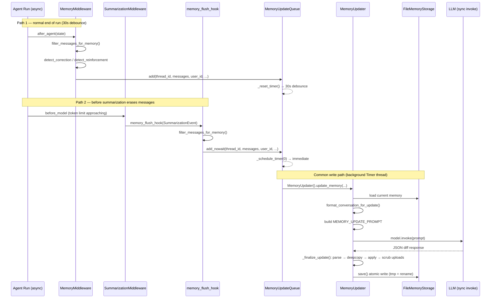
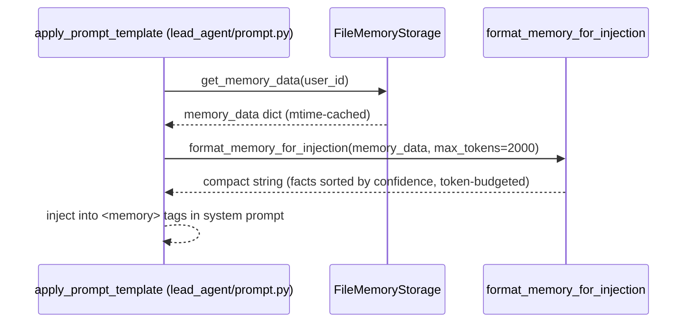
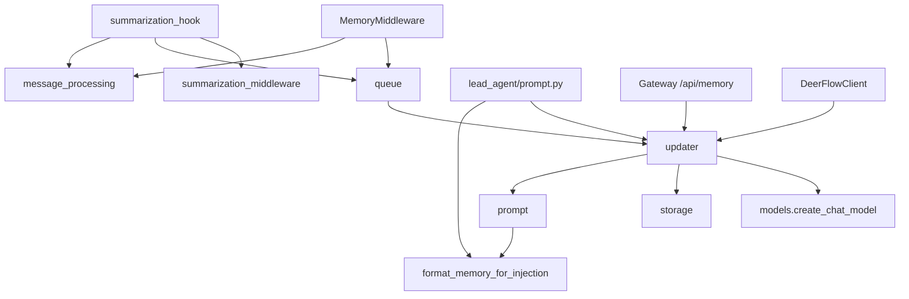
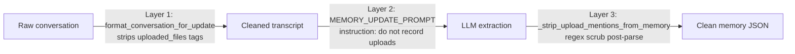

# Memory System

## Purpose

DeerFlow's memory system builds a persistent, per-user knowledge profile that survives across conversation sessions. After every agent run (and before summarization erases old messages), the system extracts structured facts and context summaries from the conversation using an LLM, stores them in a JSON file isolated per user, and injects the top-ranked facts back into the system prompt at the start of the next interaction.

The design goal is personalisation: the agent should remember that Alice prefers `make dev`, works on a Go service, and corrected the agent about deployment commands — without Alice needing to repeat herself.

## Key Files

- `agents/memory/prompt.py` — LLM prompt templates and the two formatting utilities that feed into and out of the extraction call
- `agents/memory/storage.py` — File-backed storage provider with per-user isolation, mtime caching, and atomic writes
- `agents/memory/message_processing.py` — Pre-processes raw conversation messages: strips uploads, filters to final exchanges, detects correction/reinforcement signals
- `agents/memory/queue.py` — Debounce queue; collapses rapid updates per thread and dispatches to a background Timer thread
- `agents/memory/updater.py` — Top-level coordinator; builds the prompt, calls the LLM (sync path only), applies the diff, and exposes the CRUD API used by Gateway and `DeerFlowClient`
- `agents/memory/summarization_hook.py` — Intercepts messages just before `SummarizationMiddleware` erases them so they can still be queued for memory extraction

## Important Concepts

- **Per-user isolation** — Memory lives at `{base_dir}/users/{user_id}/memory.json`. Per-agent memory is at `users/{user_id}/agents/{name}/memory.json`. Absolute `storage_path` in config opts out of isolation (all users share one file).
- **Two trigger paths** — `MemoryMiddleware.after_agent` queues with a 30s debounce; `memory_flush_hook` fires before summarization with immediate processing (`add_nowait`).
- **`shouldUpdate` gate** — The LLM must set `shouldUpdate: true` for a section to be written. Unchanged sections are no-ops, protecting existing high-quality summaries.
- **Fact quality gates** — Facts below `fact_confidence_threshold` (default 0.7) are rejected at entry. When `max_facts` (default 100) is exceeded, the list is sorted by confidence and the lowest-ranked facts are evicted.
- **Three-layer upload defense** — (1) Prompt instruction; (2) `<uploaded_files>` tag stripping in `format_conversation_for_update()`; (3) `_strip_upload_mentions_from_memory()` post-parse regex scrub.
- **Sync-only LLM path** — All extraction calls use `model.invoke()`, never `model.ainvoke()`, to avoid the cross-loop httpx connection-pool bug (issue #2615).

## Data Structure

Stored in `{base_dir}/users/{user_id}/memory.json`:

```json
{
  "version": "1.0",
  "lastUpdated": "2025-01-01T00:00:00Z",
  "user": {
    "workContext": { "summary": "...", "updatedAt": "..." },
    "personalContext": { "summary": "...", "updatedAt": "..." },
    "topOfMind": { "summary": "...", "updatedAt": "..." }
  },
  "history": {
    "recentMonths": { "summary": "...", "updatedAt": "..." },
    "earlierContext": { "summary": "...", "updatedAt": "..." },
    "longTermBackground": { "summary": "...", "updatedAt": "..." }
  },
  "facts": [
    {
      "id": "fact_a1b2c3d4",
      "content": "User prefers make dev over npm start",
      "category": "correction",
      "confidence": 0.95,
      "createdAt": "...",
      "source": "thread-abc123",
      "sourceError": "The agent previously suggested npm start."
    }
  ]
}
```

`workContext`/`personalContext`/`topOfMind` are concise current-state summaries. `recentMonths`/`earlierContext`/`longTermBackground` are temporal history paragraphs. Facts carry a 6-category taxonomy: `preference`, `knowledge`, `context`, `behavior`, `goal`, `correction`.

## Execution Flow

Two trigger paths feed the same write pipeline:



Injection path (read side, at inference time):



## Architecture Diagrams

### Module dependency map



### Three-layer upload defense



## My Insights

**The ContextVar / Timer thread boundary is the central threading challenge.** Python's `ContextVar` propagates to async child tasks but not to raw OS threads. `threading.Timer` creates a raw thread. The solution is to capture `user_id` eagerly (as a plain string) before crossing the boundary — `ConversationContext.user_id` exists for exactly this reason. The `summarization_hook` uses a different strategy: `resolve_runtime_user_id(event.runtime)` reads from the LangGraph `Runtime` context object (which is a dict, not a ContextVar), so it's safe inside the synchronous hook.

**The sync-only LLM path is a deliberate architectural constraint, not a limitation.** Issue #2615 traced crashes to langchain caching a single async httpx client per event loop. Memory extraction was originally async; the fix was to route all extraction through `model.invoke()` (a separate sync connection pool). The `_SYNC_MEMORY_UPDATER_EXECUTOR` thread pool exists to offload this blocking call when the caller is inside a running asyncio loop.

**`add_nowait()` vs `add()` reflects the two trigger contexts.** Normal agent runs end cleanly — the 30s debounce collapses bursts and gives the user time to send a follow-up before the LLM extraction fires. Summarization is urgent — the messages are about to be erased, so the debounce would result in a permanent loss of conversational context.

**The fact store is append-with-dedup, not upsert.** New facts are added if their case-folded content is not already in `existing_fact_keys`. There's no update-in-place for an existing fact by content. The `factsToRemove` list handles removals, but those are only generated when the LLM identifies a contradiction. Practically, high-confidence facts accumulate until the `max_facts` cap triggers an eviction sweep.

**`FACT_EXTRACTION_PROMPT` is exported but unused in the live runtime.** Only `MEMORY_UPDATE_PROMPT` is called by `updater.py`. `FACT_EXTRACTION_PROMPT` appears to be reserved for a potential real-time single-message extraction path that hasn't been wired in.

## Technical Deep Dives

### The Cross-Loop httpx Connection-Pool Bug (Issue #2615)

#### The problem: `AsyncClient` is loop-bound

When langchain calls `model.ainvoke()` the first time, it creates an `httpx.AsyncClient` internally and caches it (via `@lru_cache` or a module-level variable). That client is permanently bound to whichever asyncio event loop was running at creation time — it holds connections, background read tasks, and semaphores all registered on that loop.

If any code later touches the same cached client from a different event loop, httpx raises:

```
RuntimeError: Event loop is closed
# or
RuntimeError: Task attached to a different loop
```

#### How it happened in DeerFlow

The original async memory path looked roughly like:

```python
# Timer thread fires (no event loop)
def _process_queue(self):
    asyncio.run(                          # ← creates a NEW loop L2
        updater.aupdate_memory(messages)
    )

# inside aupdate_memory
async def aupdate_memory(self, messages):
    response = await model.ainvoke(prompt) # ← tries to use AsyncClient
                                           #   but client was bound to L1
                                           #   L1 is still running in the main process
                                           #   CRASH
```

The chain of events:

```
Main process (loop L1 running)
  Lead agent calls model.ainvoke()
  → langchain creates AsyncClient C1, caches it, bound to L1

30 seconds later...
  threading.Timer fires on a raw OS thread
  asyncio.run() spins up a new loop L2
  aupdate_memory() calls model.ainvoke()
  → langchain returns the CACHED C1 (still bound to L1)
  → C1 tries to schedule work on L1
  → L1 is a different loop than L2
  → RuntimeError: attached to a different loop
```

The cached client is shared across both callers but can only serve one loop.

#### Why `asyncio.run()` made it worse

`asyncio.run()` is a complete lifecycle manager — it creates a new loop, runs the coroutine to completion, then **closes and destroys the loop**. Closing a loop invalidates every async resource registered on it: open sockets, background read tasks, semaphores. If langchain's `AsyncClient` happened to be created inside one `asyncio.run()` call, the next `asyncio.run()` would find a closed-loop client and crash immediately — even without a second concurrent loop.

```python
# First call
asyncio.run(some_coroutine())
    # langchain creates AsyncClient C1, caches it, registered on loop L1
# asyncio.run() exits → L1 is CLOSED. C1 is now a zombie.

# Timer fires 30s later
asyncio.run(update_memory())
    # New loop L2 created
    # langchain returns the CACHED C1 (points at dead L1)
    # C1 tries to schedule a read task on L1
    # → RuntimeError: Event loop is closed
```

#### The fix: never touch the async client from the memory path

`model.invoke()` (sync) uses a completely separate `httpx.Client` (blocking, not async). It has no event loop dependency — it blocks the calling thread, does its HTTP, and returns. The cached `AsyncClient` is never touched.

```python
# Now: always sync
def _do_update_memory_sync(self, messages, ...):
    response = model.invoke(prompt)   # ← blocking HTTP, separate sync client
    ...                               #   no event loop involved, no cache collision
```

But `model.invoke()` blocks the calling thread. If called from inside a running asyncio loop (e.g. a LangGraph node), that would stall the entire loop. The `_SYNC_MEMORY_UPDATER_EXECUTOR` thread pool handles the handoff:

```python
def update_memory(self, messages, ...):
    try:
        loop = asyncio.get_running_loop()
    except RuntimeError:
        loop = None

    if loop is not None and loop.is_running():
        # Inside the main loop — offload to a worker thread
        future = _SYNC_MEMORY_UPDATER_EXECUTOR.submit(
            self._do_update_memory_sync, messages=messages, ...
        )
        return future.result()   # blocks the WORKER thread, not the loop

    # No loop running (e.g. the Timer thread) — call directly
    return self._do_update_memory_sync(messages=messages, ...)
```

#### The full picture

```
Main process (loop L1)              Worker thread pool
──────────────────────              ──────────────────
Lead agent: model.ainvoke()  →  langchain AsyncClient C1 (bound to L1)
                                   ↑ only ever touched from L1

Memory update (Timer thread, no loop):
  model.invoke() → httpx.Client C2 (sync, no loop binding)

Memory update (from LangGraph node, inside L1):
  submit _do_update_memory_sync to thread pool
  → thread runs model.invoke() → httpx.Client C2
  → L1 stays unblocked, C1 never touched
```

`aupdate_memory()` still exists on `MemoryUpdater` — it wraps the sync path via `asyncio.to_thread()` for callers in an async context that want to await it. But it still routes through `model.invoke()`, not `model.ainvoke()`. The async wrapper keeps the caller's event loop unblocked; it never lets the async HTTP client near the extraction call.

#### Why `TitleMiddleware.ainvoke()` does not cause the same crash

`TitleMiddleware._agenerate_title_result` is `async def` and called with `await` from inside LangGraph's execution pipeline. LangGraph runs on the main event loop (L1). So when `model.ainvoke()` fires it runs on L1, touches the `AsyncClient` that was created and cached on L1, and caller and client share the same loop — no collision.

```text
TitleMiddleware (async def, awaited from LangGraph):
  L1 → model.ainvoke() → AsyncClient C1 (bound to L1) ✓ same loop

Memory update (original, from threading.Timer):
  no loop → asyncio.run() → L2 → model.ainvoke() → AsyncClient C1 (bound to L1) ✗ wrong loop
```

The bug only bites when you cross a loop boundary. `TitleMiddleware` never does — it is already inside L1 when it calls the model. The memory Timer thread had no loop and was forced to create one via `asyncio.run()`, which is what introduced the second loop and the collision.

## Open Questions

- Does the 30s debounce window on `add()` mean that if a user ends a session abruptly (browser close), the timer fires but the process has already exited (daemon thread)? Is there a shutdown hook that calls `flush()`?
- `aupdate_memory()` is defined on `MemoryUpdater` but never called — is it dead code or a future async API?
- The `-6` message window in `detect_correction` / `detect_reinforcement` is hardcoded. Should it be configurable, or could a long multi-step task push a correction outside the window before the debounce fires?
- `max_facts` eviction preserves high-confidence facts indefinitely regardless of age. A confident-but-stale fact (e.g. "User's job title is X") has no expiry mechanism — should there be a `confidence_decay` or `ttl` for context facts?

## Links to Related Sections

- [[09-middleware-pipeline]] — `MemoryMiddleware` (pos 14) and `SummarizationMiddleware` (pos 9/10) are where the two trigger paths originate
- [[08-lead-agent]] — `apply_prompt_template` in `lead_agent/prompt.py` is where `format_memory_for_injection` is called at inference time
- [[07-langgraph-runtime]] — `user_context.py` defines `get_effective_user_id()` and `resolve_runtime_user_id()`, the two user ID resolution strategies
