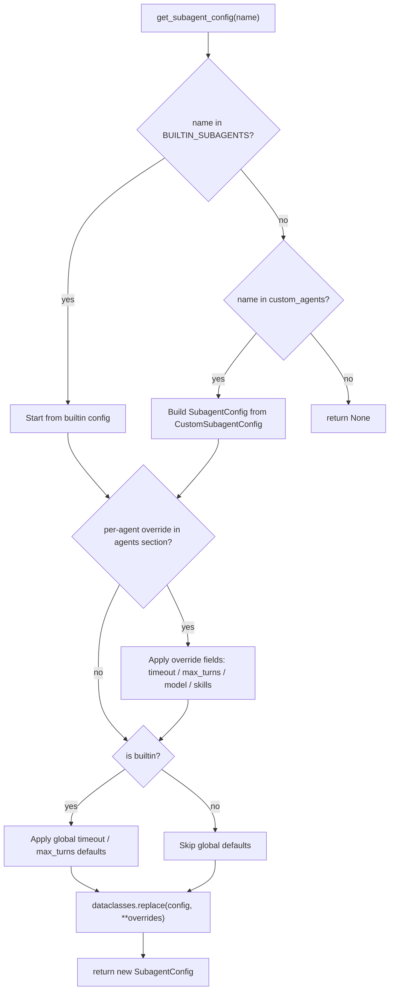
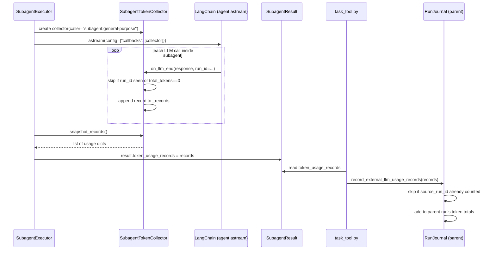
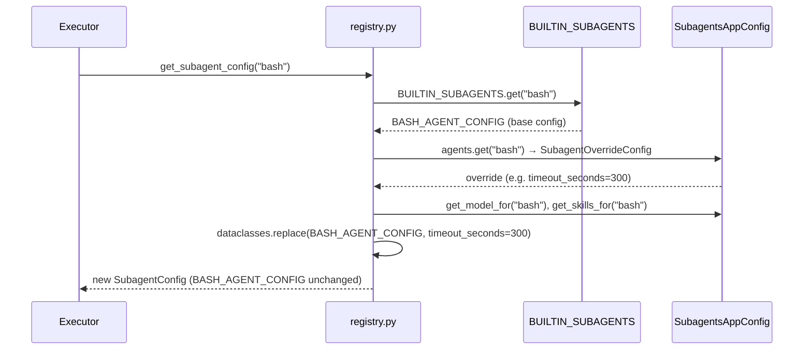

# Subagents — Phase 1: Primitives (Config, Token Collector, Registry)

## Purpose

The subagent system lets the lead agent delegate work to isolated specialised agents via the
`task` tool. This note covers the primitive layer — the data shapes, token accounting, and
agent discovery logic — that the executor and built-in agents are built on top of.

## Key Files

- `deerflow/subagents/config.py` — `SubagentConfig` dataclass + `resolve_subagent_model_name`; the canonical runtime shape for every subagent
- `deerflow/subagents/token_collector.py` — `SubagentTokenCollector` LangChain callback; accumulates LLM token usage inside a subagent run
- `deerflow/subagents/registry.py` — lookup and override resolution; merges builtins, custom agents, and config.yaml overrides into a final `SubagentConfig`
- `deerflow/subagents/builtins/__init__.py` — `BUILTIN_SUBAGENTS` dict (read during registry study)
- `deerflow/subagents/builtins/general_purpose.py` — `general-purpose` builtin definition (read during registry study)
- `deerflow/subagents/builtins/bash_agent.py` — `bash` builtin definition (read during registry study)

## Important Concepts

### SubagentConfig field taxonomy

| Group       | Fields                                             | Notes                                                                                                 |
| ----------- | -------------------------------------------------- | ----------------------------------------------------------------------------------------------------- |
| Identity    | `name`, `description`                              | `description` is what the lead agent reads to decide when to delegate                                 |
| Behavior    | `system_prompt`, `max_turns`                       | `system_prompt=None` means the executor supplies one; `max_turns` becomes LangChain `recursion_limit` |
| Tool access | `tools` (allowlist), `disallowed_tools` (denylist) | Complementary; `None` on `tools` = inherit all                                                        |
| Skills      | `skills`                                           | Three states: `None` = inherit all, `[]` = none, `["x"]` = only "x"                                   |
| Model       | `model`                                            | Sentinel string `"inherit"`, never `None`                                                             |
| Limits      | `timeout_seconds`                                  | Default 900 s (15 min)                                                                                |

### Three-state `skills` semantics

`None` and `[]` are intentionally distinct:

- `None` — the subagent inherits all skills that the lead agent has enabled
- `[]` — explicitly load no skills (skill-free execution)
- `["web-search"]` — load only the named skills

The downstream consumer converts this with `set(skills) if skills is not None else None` — a `None` set means "pass all through"; an empty set means "filter all out".

### Anti-recursion default

`disallowed_tools` defaults to `["task"]`. Subagents cannot spawn further subagents unless a
custom configuration explicitly removes this restriction. The `lambda: ["task"]` factory avoids
Python's mutable-default-argument pitfall in dataclasses.

The two built-in agents go further: both `general-purpose` and `bash` also block
`ask_clarification` and `present_files`, so they can never interrupt the user or surface
files directly.

### Model resolution cascade

`resolve_subagent_model_name` implements a three-level fallback:

```
config.model != "inherit"  →  use it directly
      ↓
parent_model is not None   →  inherit from lead agent
      ↓
app_config.models[0].name  →  first model in config.yaml
```

`model` is always a `str` (never `Optional`) because the sentinel `"inherit"` eliminates the
need for `None` checks downstream.

### Token accounting transfer chain

Each subagent run creates one `SubagentTokenCollector`, injected into LangChain's callback chain.
The collector is passive — the subagent's own code never calls it.

```
LangChain on_llm_end (fires once per LLM call, final chunk)
    └── SubagentTokenCollector._records.append(record)
          └── collector.snapshot_records()  ← called by executor after run
                └── SubagentResult.token_usage_records
                      └── task_tool.py finds parent RunJournal via callbacks
                            └── journal.record_external_llm_usage_records(records)
```

Dual deduplication guards against double-counting:

1. Collector's `_counted_run_ids` — one record per LangChain `run_id`
2. Journal's `_counted_external_source_ids` — rejects records already merged

### Registry resolution cascade



### Sandbox capability gate

`get_available_subagent_names()` filters the full name list before the names are exposed to the lead agent:

- Local sandbox without `sandbox.allow_host_bash=true` → `bash` excluded
- Docker/provisioner sandbox → `bash` always included
- Exception during check → fail-open, all names exposed (logged at debug)

## Execution Flow

**Token collection inside a subagent run:**



**Registry lookup with override:**



## My Insights

**The dual allowlist/denylist on tools is more expressive than either alone.** `tools=None` with
`disallowed_tools=["task"]` is the general-purpose pattern — inherit everything, block just
recursion. `tools=["bash", "ls", ...]` with `disallowed_tools=["task"]` is the bash-agent
pattern — restrict to a fixed capability set. You can compose both: narrow the allowlist AND
block specific tools within it.

**`dataclasses.replace` as an immutability primitive.** The built-in configs are module-level
constants, importable from anywhere. Using `replace` instead of mutating fields means
concurrent requests for the same agent (which happens routinely with `MAX_CONCURRENT_SUBAGENTS=3`)
never see each other's config modifications. This is the same pattern used in functional
programming's persistent data structures — share the base, copy on write.

**The `bash` subagent is capability-gated at the registry level, not the executor level.**
This is the right place — the lead agent's tool system calls `get_available_subagent_names()`
at tool-assembly time, so `bash` never appears in the agent's tool list if the sandbox won't
allow it. It's excluded before the model even sees the option, not after it tries to call it.

**Token attribution across agent boundaries is a hard problem.** The three-hop transfer
(collector → result → task_tool → journal) with two independent deduplication sets is a
deliberate belt-and-suspenders design. The async boundary (subagent runs on a background thread)
means the parent's LangChain callback context is not available inside the subagent. The plain
list-of-dicts transfer through `SubagentResult` is the simplest structure that crosses that
boundary without any async or LangChain coupling.

## Open Questions

- The fail-open in `get_available_subagent_names` (exception → expose all agents including `bash`)
  could allow bash in a sandbox that can't support it. When would `is_host_bash_allowed` actually
  raise? → Investigate in §15 (Sandbox).
- `CustomSubagentConfig` Pydantic validation fires at config-load time via `load_subagents_config_from_dict`.
  What happens if `custom_agents` is modified at runtime via the Gateway API without going through
  Pydantic? → Check §17 (Config System) and the Gateway MCP/agents routers.
- The `bash` subagent has `max_turns=60` vs `general-purpose` at `max_turns=100`. The bash agent
  is structurally simpler (pure command executor), but is 60 always enough for a long build/test
  pipeline? → No guard in the code — it's a configuration choice, not a hard limit per se.

## Links to Related Sections

- [[07-langgraph-runtime]] — `RunJournal.record_external_llm_usage_records` is where token records land; already annotated in §07
- [[09-middleware-pipeline]] — `SubagentLimitMiddleware` caps concurrent `task` calls at `MAX_CONCURRENT_SUBAGENTS=3` before they ever reach the executor
- [[15-sandbox]] — `is_host_bash_allowed` gates the bash subagent; sandbox security model
- [[17-config-system]] — `SubagentsAppConfig`, `SubagentOverrideConfig`, `CustomSubagentConfig` live in `config/subagents_config.py`
