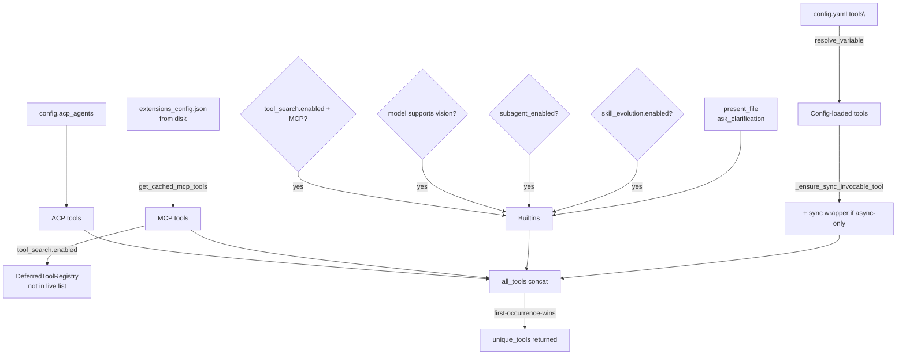
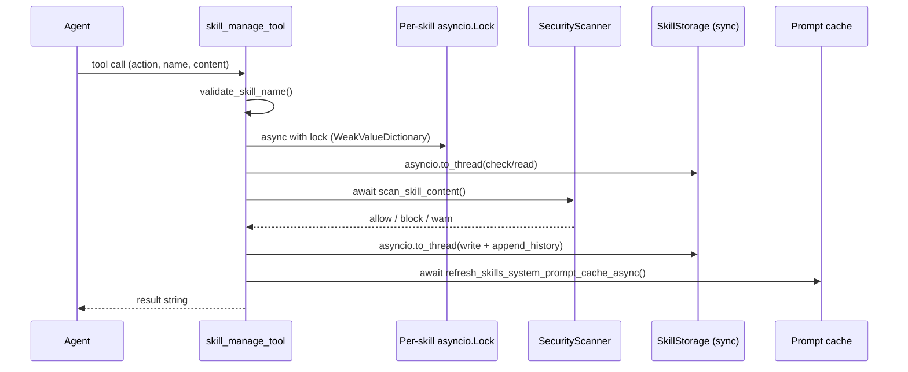
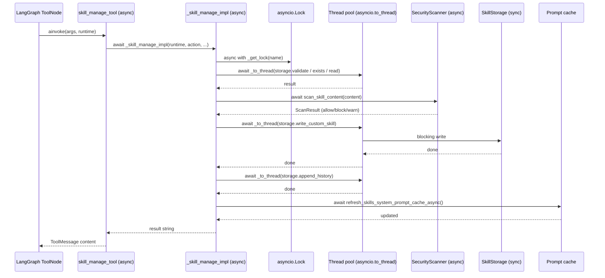

# Tools System — Primitives, Registry & Skill Evolution (Phases 1–2)

## Purpose

The tools system is DeerFlow's mechanism for assembling the exact set of callable functions
that the lead agent sees on each run. It bridges four sources — config-loaded tools, built-ins,
MCP tools, and ACP agents — applies security and capability filters, deduplicates by name, and
returns a single ordered list that LangGraph's `ToolNode` binds to the model.

Phases 1–2 cover the type contract (`types.py`, `__init__.py`), the assembly pipeline
(`tools.py`), the sync-compatibility shim (`sync.py`), and the skill evolution tool
(`skill_manage_tool.py`).

---

## Key Files

- `deerflow/tools/types.py` — `Runtime` type alias: `ToolRuntime[dict[str, Any], ThreadState]`
- `deerflow/tools/__init__.py` — public API; lazy-loads `skill_manage_tool` via PEP 562 `__getattr__`
- `deerflow/tools/tools.py` — `get_available_tools()`: the per-run assembly function
- `deerflow/tools/sync.py` — `make_sync_tool_wrapper()`: bridges async tools to sync callers
- `deerflow/tools/skill_manage_tool.py` — agent-facing tool for creating/evolving custom skills

---

## Important Concepts

### 1. `Runtime` — the per-tool injection container

```python
Runtime = ToolRuntime[dict[str, Any], ThreadState]
```

`ToolRuntime` is LangChain's dependency-injection object. Any tool function that declares
a `runtime: Runtime` parameter receives it automatically from the framework. It carries:

| Attribute        | Type             | Contents                                                         |
| ---------------- | ---------------- | ---------------------------------------------------------------- |
| `.state`         | `ThreadState`    | LangGraph graph state — **checkpoint-persisted**, survives turns |
| `.context`       | `dict[str, Any]` | Per-run transient dict — `thread_id`, `user_id`, `sandbox_id`    |
| `.config`        | `RunnableConfig` | LangGraph run config                                             |
| `.stream_writer` | callable         | Emits custom SSE events                                          |
| `.store`         | KV store         | Runtime key-value store reference                                |

**Critical distinction — `.state` vs `.context`**

`.state` is the checkpointed LangGraph graph state: it survives across turns, is persisted by
the checkpointer, and is shared across all tool calls within one graph step. `.context` is
transient: it is built fresh by `worker.py` at run startup (from the auth layer, run config,
etc.), is NOT persisted, and disappears when the run ends. This is why `user_id` lives in
`.context` — it's injected per-run from the auth layer, not stored in the graph.

**Why `dict[str, Any]` instead of the unbound TypeVar**

`ToolRuntime`'s generic parameter `ContextT` defaults to an unbound TypeVar (`None`). When
LangChain auto-generates an `args_schema` for a tool that declares `runtime: ToolRuntime`,
Pydantic's `model_dump()` emits `PydanticSerializationUnexpectedValue` warnings on every tool
call because the actual context is a `dict` but the type spec says `None`. Binding to
`dict[str, Any]` aligns Pydantic's expectation with reality and silences the warning. A
regression test (`test_tool_args_schema_no_pydantic_warning.py`) verifies this on every tool.

---

### 2. Lazy package API (`__init__.py`)

```python
from .tools import get_available_tools          # eager

def __getattr__(name: str):
    if name == "skill_manage_tool":
        from .skill_manage_tool import skill_manage_tool   # lazy
        return skill_manage_tool
```

`get_available_tools` is imported eagerly (its own dependencies are lightweight). But
`skill_manage_tool` is deferred via PEP 562 module `__getattr__`: on first access it triggers
the import of the entire skills subsystem — `security_scanner`, `skill_storage`, `prompt`
cache — which is expensive. Deferring avoids paying that cost for every code path that imports
`deerflow.tools` but never touches skill management.

---

### 3. Tool assembly pipeline (`get_available_tools`)

Assembly runs in four stages; deduplication by `.name` at the end keeps the first occurrence.



**Priority:** config-loaded → builtins → MCP → ACP. If two tools share a name, the earlier
source wins and a `logger.warning` is emitted (root cause of issue #1803 where silent
duplicates produced mangled LLM schemas).

**Host-bash security gate** — `_is_host_bash_tool()` detects bash by both `group == "bash"`
and `use == "deerflow.sandbox.tools:bash_tool"`. Renamed aliases (e.g., `shell` with
`group="bash"`) are also blocked when `LocalSandboxProvider` is active.

**MCP config reads from disk directly** — `ExtensionsConfig.from_file()` is called on every
invocation rather than using `config.extensions`. Gateway API writes to
`extensions_config.json`; since Gateway and LangGraph share one process, reading the cached
singleton would give stale data after an API update. The disk read (with mtime-based caching
inside `get_cached_mcp_tools`) ensures changes are visible without restart.

**`app_config` kwarg** — `DeerFlowClient` (embedded mode) passes its own parsed config as a
kwarg-only argument (`*` separator) instead of calling `get_app_config()`. This is the only
caller-override path.

---

### 4. DeferredToolRegistry and tool_search

When `tool_search.enabled` is true, the model receives MCP tool **names only** (in
`<available-deferred-tools>` in the system prompt). It must call `tool_search` to retrieve
full schemas before it can invoke those tools. `DeferredToolFilterMiddleware` enforces this
by stripping deferred tool schemas from every `bind_tools` call.

**Promote** is the one-way gate: once a tool is promoted (found via `tool_search`), it is
removed from the registry and never re-added mid-run. The model sees its schema on every
subsequent turn.

**The registry is source-agnostic by design** — `DeferredToolRegistry` stores any `BaseTool`.
Today only MCP tools are registered (because they can number in the dozens and would exhaust
model context). The module docstring explicitly states "Source-agnostic: no mention of MCP or
tool origin." Any future large tool pool could be deferred through the same mechanism.

**Re-entry guard (issue #2884):**

Suppose the lead agent has 10 MCP tools, `tool_search` is enabled, and the agent has promoted
`tavily_search`:

```
Run starts
  → get_available_tools()         # called once at agent build time
    → DeferredToolRegistry built: [tavily, brave, firecrawl, ... 10 tools]
    → set_deferred_registry(registry)

Turn 1: agent calls tool_search("web search")
  → registry.promote("tavily_search")
    → "tavily_search" removed from registry → 9 tools remain deferred
  → next model call: DeferredToolFilterMiddleware sees tavily NOT in registry
    → passes tavily schema through → model can see it ✓

Turn 2: agent decides to spawn a subagent → calls task_tool(...)
  → task_tool calls get_available_tools() for the child agent's toolset

     ┌─ WITHOUT the guard ──────────────────────────────────────────────────┐
     │ registry = DeferredToolRegistry()                                    │
     │ for t in mcp_tools: registry.register(t)   ← all 10 back in         │
     │ set_deferred_registry(registry)             ← overwrites ContextVar  │
     └──────────────────────────────────────────────────────────────────────┘

Turn 3: back in the lead agent, DeferredToolFilterMiddleware runs
  → reads ContextVar → sees the NEW registry with 10 tools, including tavily
  → tavily is deferred again → strips its schema from the model call
  → agent tries to call tavily (it remembers the name) → "not a valid tool" ✗
```

The subagent's `get_available_tools` call clobbers the parent's `ContextVar` because both run
inside the same asyncio task context. Promoted tools get re-classified as deferred.

With the guard:

```python
existing_registry = get_deferred_registry()
if existing_registry is None:
    # First call in this run — build a fresh registry
    registry = DeferredToolRegistry()
    for t in mcp_tools:
        registry.register(t)
    set_deferred_registry(registry)
else:
    # Re-entrant call (subagent) — leave the registry alone
    still_deferred = len(existing_registry)           # e.g. 9
    promoted_count = max(0, len(mcp_tools) - still_deferred)  # = 1
    logger.info(f"... {still_deferred} deferred, {promoted_count} promoted")
```

The `else` branch does **nothing** to the registry — no `set_deferred_registry()` call. The
parent's promotion state survives untouched.

**Why `ContextVar` gives exactly the right scope:**

- Each new graph run (asyncio task) starts with the `ContextVar` at its default `None` — different
  users and different runs never share a registry.
- Re-entrant calls within the same run (e.g. `task_tool → get_available_tools`) inherit the
  same `ContextVar` value. `get_deferred_registry()` returns non-`None` precisely because we're
  inside an existing run — that is what the guard exploits.

**The `promoted_count = max(0, ...)` subtlety:**
`promote()` deletes entries; there is no separate "promoted" list. The count is inferred:
`total MCP tools − still deferred = promoted`. The `max(0, ...)` guard handles a narrow race
where the MCP cache refreshes between the parent and subagent calls, producing a smaller
`mcp_tools` list than the registry still holds, which would otherwise give a negative number.

---

### 5. Sync-wrapper pattern (`sync.py`)

Async-only tools (MCP tools, community tools, `skill_manage_tool`) have a `coroutine` on
their `BaseTool` object but no `func`. `BaseTool.invoke()` needs a `func`. The sync wrapper
manufactures one:

```python
def sync_wrapper(*args, **kwargs):
    loop = asyncio.get_running_loop()   # None if no loop running

    if loop is not None and loop.is_running():
        # Cannot call asyncio.run() inside a running loop — it raises RuntimeError.
        # Escape: spin up asyncio.run() in a worker thread, block this thread.
        future = _SYNC_TOOL_EXECUTOR.submit(asyncio.run, coro(*args, **kwargs))
        return future.result()           # blocks the calling thread, not the event loop
    else:
        return asyncio.run(coro(*args, **kwargs))
```

**Why this vs `asyncio.run_coroutine_threadsafe`?**

|              | `asyncio.run()` in thread            | `run_coroutine_threadsafe(coro, loop)` |
| ------------ | ------------------------------------ | -------------------------------------- |
| Creates loop | Yes — fresh per call                 | No — submits to existing loop          |
| Returns      | After coroutine completes (blocking) | `Future` immediately (non-blocking)    |
| Requires     | Thread with no running loop          | A running loop in another thread       |
| Shared state | None — fully isolated                | Yes — coroutines share the target loop |
| Used for     | One-shot tool execution (sync.py)    | Subagent lifecycle (executor.py)       |

The subagent executor needs a persistent shared loop because subagents have complex lifecycle
(task queues, 15-minute timeouts, concurrency limits). The sync tool wrapper needs none of
that — each tool call is isolated.

A shared thread pool (`_SYNC_TOOL_EXECUTOR`, max 10 workers) prevents unbounded thread
creation under concurrent subagent execution. `wait=False` at atexit keeps process exit fast.

Three call sites use `make_sync_tool_wrapper`: `tools/tools.py` (config-loaded tools),
`mcp/tools.py` (MCP tools), and `tools/skill_manage_tool.py` (skill manage).

---

### 6. Skill evolution tool (`skill_manage_tool.py`)

When `skill_evolution.enabled`, the agent can create, modify, and delete skills at runtime —
a self-improving loop where the agent authors its own tools.

**Six actions:**

| Action        | Target              | Requires          | Editability check  | Security scan            | Prompt cache refresh |
| ------------- | ------------------- | ----------------- | ------------------ | ------------------------ | -------------------- |
| `create`      | New `SKILL.md`      | `content`         | ✗ (must NOT exist) | Non-executable           | ✓                    |
| `edit`        | Existing `SKILL.md` | `content`         | ✓                  | Non-executable           | ✓                    |
| `patch`       | Existing `SKILL.md` | `find`, `replace` | ✓                  | Non-executable           | ✓                    |
| `delete`      | Entire skill dir    | —                 | ✗                  | None                     | ✓                    |
| `write_file`  | Supporting file     | `path`, `content` | ✓                  | Executable if `scripts/` | ✗                    |
| `remove_file` | Supporting file     | `path`            | ✓                  | None                     | ✗                    |

`edit` replaces the whole `SKILL.md`; `patch` does bounded substring replacement with an
optional `expected_count` guard (same safe-edit pattern as `str_replace` in the sandbox).

Only `create`/`edit`/`patch`/`delete` refresh the skills prompt cache — they change the
skill list injected into the system prompt. `write_file`/`remove_file` touch support files
only, so no cache refresh is needed.

**Safety layers on every write:**



**Per-skill async lock** — `WeakValueDictionary[str, asyncio.Lock]` prevents concurrent writes
to the same skill across two agent turns. Weak refs mean locks for idle skills are GC'd
automatically — no unbounded accumulation.

**Two-tier security scan** — non-executables need "not block"; `scripts/` paths need an
explicit "allow" because they can run arbitrary shell commands. Every write path goes through
this gate before touching the filesystem.

**Why `_to_thread` on every storage call:**
`_skill_manage_impl` is a coroutine — it runs on the asyncio event loop thread. The event loop
is single-threaded: any blocking call inside a coroutine freezes the entire runtime (no SSE
events, no other agent turns, no LangGraph state updates). Every `SkillStorage` method is
synchronous filesystem I/O, so each one must be offloaded with `asyncio.to_thread()`.

**How to confirm a coroutine runs on the event loop thread:**

1. `async def` + plain `await` never cross a thread boundary — the callee runs on the same
   thread as the caller.
2. Trace the call chain: `LangGraph ToolNode (async)` → `await skill_manage_tool` → `await
_skill_manage_impl`. Each `await` stays on the event loop thread.
3. `asyncio.to_thread()` usage inside the function is self-confirming: it only makes sense to
   call it from the event loop thread; offloading from a worker thread to another thread
   would be pointless.

**Dual entry point** — `_skill_manage_impl` (raw async impl) and `skill_manage_tool`
(`@tool`-decorated LangChain wrapper) are separated so the sync wrapper can be attached
cleanly: `skill_manage_tool.func = make_sync_tool_wrapper(_skill_manage_impl, ...)`. Pointing
at the raw impl skips LangChain's `@tool` dispatch layer, avoiding double-dispatch overhead.

---

## Execution Flow

Full path from agent tool call to skill file on disk:



---

## My Insights

**The `state` vs `context` distinction is foundational.** Every tool in the system reads either
`runtime.state` (LangGraph checkpoint — durable) or `runtime.context` (per-run dict —
transient). Getting this wrong means either reading stale data or expecting persistence that
doesn't exist. `user_id` in `context` is the canonical example: it's injected per-run from
auth, not something the graph checkpoints.

**Tool assembly is a policy engine, not just a list.** `get_available_tools` applies five
distinct filters/policies in sequence: group filter, host-bash security gate, sync-wrapper
attachment, conditional feature gates (vision, subagent, skill_evolution, tool_search), and
name deduplication. The result is a run-specific tool surface tuned to the current model,
config, and sandbox mode.

**The DeferredToolRegistry is source-agnostic by deliberate design.** Today it only holds MCP
tools, but the mechanism is generic. This separation of concerns mirrors how good interfaces
should work: the "what gets deferred" policy lives in `tools.py`; the "how deferred tools
behave" mechanism lives in `tool_search.py`. Neither knows about the other's concerns.

**`asyncio.run` in a thread vs `run_coroutine_threadsafe` is a fundamental asyncio pattern.**
Use `asyncio.run` in a worker thread when you need isolated, one-shot execution with no shared
loop state. Use `run_coroutine_threadsafe` when you need to submit to a persistent shared loop
(subagent executor). The sync.py shim implements the former; executor.py implements the latter.

**Skill evolution is the agent self-improvement loop.** When enabled, the agent can author its
own tools (SKILL.md defines a new tool). The security gate, per-skill lock, and audit history
are what make this safe enough to enable in production. The prompt cache refresh after every
write is what makes it live: the agent's next turn immediately sees the skill it just created.

---

## Open Questions

- `patch` always replaces the first N occurrences (`replace(find, replace, replacement_count)`
  where `replacement_count = expected_count or 1`). If `expected_count` is not given and the
  string appears 5 times, only the first occurrence is replaced — is this intentional or a
  footgun for agents that don't pass `expected_count`?

- `delete` skips `ensure_custom_skill_is_editable` — is a public-skill deletion path
  intentionally unguarded at the action level, relying on `delete_custom_skill` to fail when
  it can't find the skill in `skills/custom/`?

- Who calls `reset_deferred_registry()`? The function exists in `tool_search.py` but wasn't
  seen called in the assembly path — is it used for cleanup between runs, or only in tests?

---

## Links to Related Sections

- [[07f-run-orchestration]] — `worker.py` builds the `ToolRuntime.context` dict injected into
  every tool call; user_id and sandbox_id flow from there
- [[08a-lead-agent]] — `get_available_tools()` is called inside `make_lead_agent()` to bind
  tools to the LangGraph graph at construction time
- [[09d-tool-call-wrappers]] — `DeferredToolFilterMiddleware` reads the `DeferredToolRegistry`
  ContextVar to strip hidden tool schemas from `bind_tools`
- [[11b-subagents-builtins-executor]] — `task_tool` calls `get_available_tools()` again when
  spawning a child agent; the re-entry guard in tools.py exists specifically for this
- [[13-skills-system]] — `skill_manage_tool` is the runtime write path into the skills system;
  section 13 covers the read path (parser, loader, storage, security scanner)
