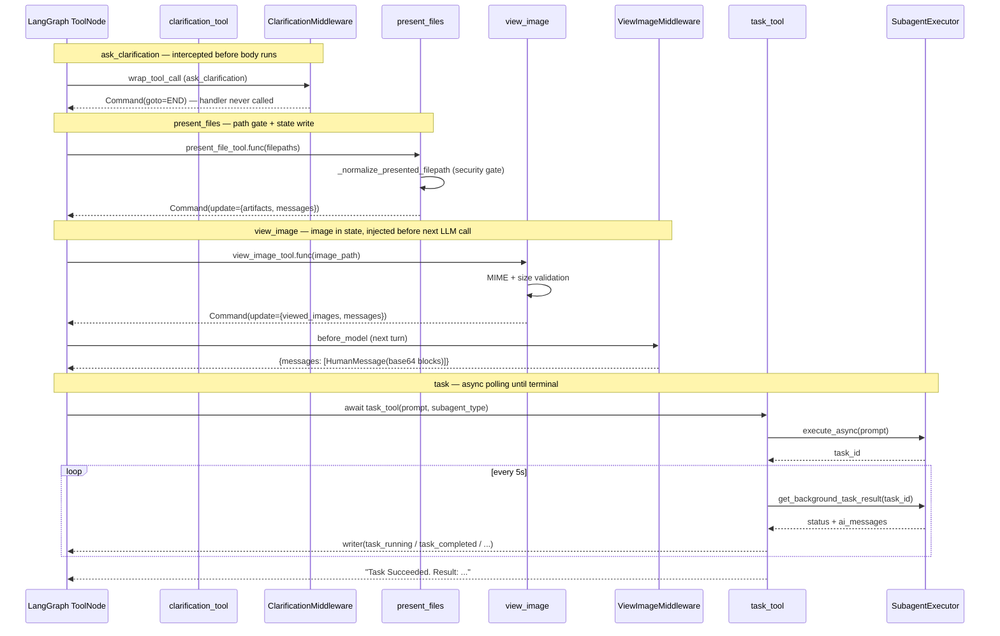

# Tools System — Built-in Tools (Phase 3)

## Purpose

Phase 3 covers the four concrete built-in tools that ship with every DeerFlow run.
Together they form the agent's core interaction surface:

| Tool                | Recipient            | What it does                                                                                |
| ------------------- | -------------------- | ------------------------------------------------------------------------------------------- |
| `ask_clarification` | User (via interrupt) | Pauses the agent and surfaces a question to the user                                        |
| `present_files`     | User's browser       | Writes file paths to state so the frontend renders download/preview links                   |
| `view_image`        | The model            | Reads image bytes, base64-encodes them, stores in state for `ViewImageMiddleware` to inject |
| `task`              | Subagent             | Launches a `SubagentExecutor` in the background and polls it to completion                  |

`present_files` and `view_image` are often confused — they have different audiences and different
state fields. `present_files` is for the user; `view_image` is for the model. A file can be both
presented and viewed if the agent needs to reason about it _and_ show it to the user.

---

## Key Files

- `deerflow/tools/builtins/clarification_tool.py` — `ask_clarification` tool definition (schema only; body never runs)
- `deerflow/tools/builtins/present_file_tool.py` — `present_files` tool; path normalization + security gate
- `deerflow/tools/builtins/view_image_tool.py` — `view_image` tool; MIME validation + base64 encoding
- `deerflow/tools/builtins/task_tool.py` — `task` tool; subagent delegation + polling loop + token accounting

---

## Important Concepts

### 1. Tool construction pattern: `parse_docstring=True`

All four tools use `@tool("name", parse_docstring=True)`. This tells LangChain to parse the
Google-style `Args:` section of the docstring to auto-generate the Pydantic `args_schema` —
no manual Pydantic model needed. The docstring is simultaneously developer documentation and
the model-facing schema description.

```python
@tool("ask_clarification", parse_docstring=True, return_direct=True)
def ask_clarification_tool(question: str, clarification_type: Literal[...]) -> str:
    """...
    Args:
        question: The clarification question to ask the user.
        clarification_type: The type of clarification needed.
    """
```

### 2. `InjectedToolCallId` — hidden parameter pattern

`present_files` and `view_image` both declare:

```python
tool_call_id: Annotated[str, InjectedToolCallId]
```

`InjectedToolCallId` is a LangChain marker that strips this parameter from the LLM-visible
schema. The model never sees or fills it — LangChain auto-injects it from the dispatching
tool call at runtime. This allows the tool to construct a `ToolMessage` with the correct
`tool_call_id` without the model knowing about it.

### 3. `return_direct=True` — what it actually means

`ask_clarification` is decorated with `return_direct=True`. This flag tells LangGraph to stop
the agent loop and return the tool's output as the final response, bypassing any additional
model call.

**Edge case:** if the model calls multiple tools in a single turn, `return_direct` only takes
effect when **all** called tools have `return_direct=True`. A mixed turn (one `return_direct`
tool + one normal tool) does not short-circuit.

In practice, `return_direct=True` on `ask_clarification` is belt-and-suspenders — `ClarificationMiddleware`
intercepts the tool call _before_ `ToolNode` even executes and returns `Command(goto=END)` directly.
The flag would still work correctly if the middleware were ever removed.

### 4. `Command` as multi-field state write

`present_files` and `view_image` both return `Command` instead of a plain string:

```python
return Command(
    update={
        "artifacts": normalized_paths,          # frontend picks this up
        "messages": [ToolMessage("...", tool_call_id=tool_call_id)],
    }
)
```

Returning `Command` lets a tool write to multiple LangGraph state fields atomically. A plain
return value is wrapped into a `ToolMessage` by `ToolNode` and only updates `messages`.

---

## `ask_clarification` — Ghost Body Pattern

The function body is intentionally dead code:

```python
@tool("ask_clarification", parse_docstring=True, return_direct=True)
def ask_clarification_tool(question: str, clarification_type: Literal[...], ...) -> str:
    # This line is never reached
    return "Clarification request processed by middleware"
```

`ClarificationMiddleware` is the innermost `wrap_tool_call` in the chain. When the model calls
`ask_clarification`, the middleware fires **before** the handler is called, emits a `ToolMessage`
with the question content, and returns `Command(goto=END)` to interrupt the agent's turn. The
function body never executes.

**Idempotency (test coverage):** The middleware stamps every clarification `ToolMessage` with
`"clarification:{tool_call_id}"` as its message ID. LangGraph's `add_messages` reducer
deduplicates by ID — if the same `ask_clarification` call is replayed (e.g. on reconnect),
the message is merged, not duplicated.

**Options coercion (bug #1995):** Models occasionally serialise `options: list[str]` as a JSON
string (`"[\"dev\",\"prod\"]"`) instead of a proper list. The middleware JSON-parses it before
rendering. This is a known LLM failure mode even against well-typed schemas.

---

## `present_files` — Path Normalization & Security Gate

### The normalization function

`_normalize_presented_filepath(runtime, filepath)` is a security gate as much as a normalizer.
It accepts two input formats and rejects anything outside the outputs directory:

```
Input A: Virtual path   → /mnt/user-data/outputs/report.md
Input B: Host abs path  → /app/.deer-flow/users/u1/threads/t1/user-data/outputs/report.md
```

Both converge to the same canonical virtual path: `/mnt/user-data/outputs/report.md`.

**Security enforcement:** `Path.relative_to(outputs_dir)` raises `ValueError` if the resolved
path is not inside `outputs_dir`. Only `present_files` is outputs-restricted.

### Dry-run walkthrough

```
thread_id    = "thread-abc"
outputs_path = "/app/.deer-flow/users/u1/threads/thread-abc/user-data/outputs"
outputs_dir  = Path(outputs_path).resolve()
virtual_prefix = "mnt/user-data"   ← VIRTUAL_PATH_PREFIX.lstrip("/")
```

**Case 1 — virtual path (happy path)**

```
filepath  = "/mnt/user-data/outputs/report.md"
stripped  = "mnt/user-data/outputs/report.md"
startswith("mnt/user-data/") → True  →  virtual branch
actual_path = resolve_virtual_path("thread-abc", "/mnt/user-data/outputs/report.md")
           = /app/.deer-flow/users/u1/threads/thread-abc/user-data/outputs/report.md
relative_path = PosixPath("report.md")  ✓
return "/mnt/user-data/outputs/report.md"
```

**Case 2 — host absolute path**

```
filepath  = "/app/.deer-flow/users/u1/threads/thread-abc/user-data/outputs/chart.png"
stripped  = "app/.deer-flow/..."   →  host-path branch
actual_path = Path(filepath).expanduser().resolve()
relative_path = PosixPath("chart.png")  ✓
return "/mnt/user-data/outputs/chart.png"
```

**Case 3 — workspace path (rejected)**

```
filepath  = "/app/.deer-flow/users/u1/threads/thread-abc/user-data/workspace/notes.txt"
actual_path = .../user-data/workspace/notes.txt
relative_to(outputs_dir) → ValueError  ✗
→ "Only files in /mnt/user-data/outputs can be presented: ..."
→ tool returns Command with error ToolMessage, no "artifacts" key
```

**Edge case — bare virtual prefix**

`filepath = "/mnt/user-data"` (no subdirectory): `stripped == virtual_prefix` is True
(matches the `==` branch), routes to the virtual resolver, then `relative_to(outputs_dir)`
raises `ValueError` anyway. The `==` check prevents the bare prefix from silently falling
through to the host-path branch and resolving to a real host directory.

### Three-tier thread_id fallback

`_get_thread_id(runtime)` tries three sources in order:

1. `runtime.context.get("thread_id")` — primary (injected by `worker.py`)
2. `runtime.config.get("configurable", {}).get("thread_id")` — embedded mode fallback
3. `get_config().get("configurable", {}).get("thread_id")` — LangGraph contextvar (guarded with `try/except RuntimeError` for non-LangGraph callers)

---

## `view_image` — Two-Step Vision Delivery

### Path policy

`view_image` allows **three** virtual roots (broader than `present_files`):

- `/mnt/user-data/workspace` — agent's working area
- `/mnt/user-data/uploads` — user-uploaded files
- `/mnt/user-data/outputs` — generated outputs

The agent may need to inspect an uploaded image before deciding what to do with it.
`present_files` is outputs-only because it surfaces files to the user — intermediate workspace
files should not be visible in the UI.

### MIME validation — two-layer defence

```
Step 1: Extension check   → _EXTENSION_TO_MIME.get(path.suffix.lower())
        Rejects unknown extensions before reading the file

Step 2: Magic-byte sniff  → _detect_image_mime(image_data)
        JPEG: b"\xff\xd8\xff"
        PNG:  b"\x89PNG\r\n\x1a\n"
        WebP: starts RIFF + bytes[8:12] == WEBP

Both must agree — catches extension spoofing (e.g. a PDF renamed to .png)
```

Size check (`path.stat().st_size > 20 MB`) runs **before** reading the file to avoid
allocating a large buffer that gets immediately discarded.

### The two-step delivery flow

```
Agent turn N:
  model calls view_image("img.png")
  → tool validates, reads, base64-encodes
  → Command(update={"viewed_images": {"img.png": {base64, mime_type}}, "messages": [...]})
  → ToolMessage says only "Successfully read image" (small, no base64)

ViewImageMiddleware.before_model (turn N+1):
  → last AI message had view_image tool calls
  → all tool calls completed (ToolMessages exist for all)
  → injects HumanMessage([
        {"type": "text",      "text": "Here are the images you've viewed:"},
        {"type": "text",      "text": "\n- **img.png** (image/png)"},
        {"type": "image_url", "image_url": {"url": "data:image/png;base64,..."}}
    ])
  → model now sees the image on this LLM call
```

The base64 payload travels in state (`viewed_images`), not in the `ToolMessage`. This keeps
the ToolMessage small (no base64 in conversation history) and puts the full payload exactly
where it's needed: before the next model call.

### Multiple images in one turn

The model issues **parallel tool calls** — one `view_image` per image in a single AIMessage.
`merge_viewed_images` merges each `Command`'s update into the accumulating dict. The middleware
fires once all tool calls complete, and `_create_image_details_message` iterates the full dict:

```
Turn N AIMessage tool_calls:
  [view_image("img1.png"), view_image("img2.png"), view_image("img3.png")]

After all three Commands apply:
  viewed_images = {"img1.png": {...}, "img2.png": {...}, "img3.png": {...}}

before_model turn N+1:
  HumanMessage with all three ImageBlocks
```

The docstring note "For multiple files at once (use present*files instead)" refers to the
tool \_signature* — `view_image` takes one path per call. For the _user's UI_, `present_files`
accepts a list. They serve different audiences and do not overlap.

### The clear-signal correction

`merge_viewed_images` supports an in-band `{}` clear: if `new == {}`, the reducer returns `{}`
(clears accumulated images). The docstring says "this allows middlewares to clear viewed_images
after processing."

**But `ViewImageMiddleware` never uses it.** The middleware returns only `{"messages": [human_msg]}`
— it never writes to `viewed_images`. The state dict accumulates across the entire conversation.

Re-injection is prevented by a message-content substring check in `_should_inject_image_message`:

```python
if "Here are the images you've viewed" in str(msg.content):
    return False   # already injected for this AI turn
```

This is fragile in theory (any HumanMessage with that phrase would block injection), but
reliable in practice because the phrase only appears in middleware-generated messages.

**Implication:** `viewed_images` grows as the conversation progresses. Each injection delivers
_all_ images accumulated so far, not just the newest one.

---

## `task` — Subagent Delegation with Polling Loop

### Structure

`task_tool` is `async def` and occupies its LangGraph turn for the full subagent lifetime.
Unlike the other three built-ins, it does not return immediately — it polls until the
background task reaches a terminal state.

```
task_tool (async, holds the agent turn)
  │
  ├── executor.execute_async(prompt)  →  background thread (SubagentExecutor)
  ├── writer(task_started)
  │
  └── while True:
        result = get_background_task_result(task_id)
        if new AI messages → writer(task_running)   ← one per message
        if COMPLETED  → cache usage + report → writer(task_completed) → return
        if FAILED     → writer(task_failed)   → return
        if CANCELLED  → writer(task_cancelled) → return
        if TIMED_OUT  → writer(task_timed_out) → return
        else          → await asyncio.sleep(5)      ← yields without blocking event loop
```

**Polling timeout** (`max_poll_count = (config.timeout_seconds + 60) // 5`) is a safety net in
case the thread-pool timeout that should stop the executor doesn't fire — an edge case, not the
normal termination path.

### `tool_call_id` as `task_id`

```python
task_id = executor.execute_async(prompt, task_id=tool_call_id)
```

Every SSE event carries `task_id`. The frontend already knows the `tool_call_id` of the `task`
call it dispatched — so events can be correlated to the exact conversation turn without any
additional mapping.

### Recursion guard

```python
available_tools_kwargs = {
    "subagent_enabled": False,   # ← task tool excluded from child's toolset
    ...
}
tools = get_available_tools(**available_tools_kwargs)
```

`subagent_enabled=False` is passed when building the child agent's tool list. The child never
receives the `task` tool, making lead→subagent→subagent nesting structurally impossible.

### Skill scope inheritance

```python
def _merge_skill_allowlists(parent, child):
    if parent is None: return child           # parent unrestricted → child keeps own config
    if child is None:  return list(parent)    # child unrestricted → bounded by parent
    return [s for s in child if s in set(parent)]  # intersection
```

The parent's skill allowlist upper-bounds the child's. A subagent cannot see skills the parent
was not allowed to use, regardless of its own config.

### Cross-boundary token accounting

The subagent runs in an isolated background thread with its own LangGraph graph and token
counters. The `_subagent_usage_cache` dict is the only cross-boundary channel:

```
task_tool:
  on COMPLETED/FAILED → _cache_subagent_usage(tool_call_id, usage)

TokenUsageMiddleware (parent agent, after_model):
  → pop_cached_subagent_usage(tool_call_id)
  → write back to the triggering AIMessage's usage_metadata
```

Without this, the subagent's LLM costs would be invisible to the parent's token tracking.

### Graceful cancellation with `asyncio.shield()`

When the user cancels (hits stop), LangGraph cancels the `task_tool` coroutine, raising
`CancelledError` at the current `await asyncio.sleep(5)` in the polling loop.

```python
except asyncio.CancelledError:
    request_cancel_background_task(task_id)   # signal background thread to stop
    try:
        terminal_result = await asyncio.shield(_await_subagent_terminal(task_id, max_polls))
    except asyncio.CancelledError:
        pass   # second cancel — we still fall through to usage reporting below
    final_result = terminal_result or get_background_task_result(task_id)
    _report_subagent_usage(runtime, final_result)
    ...
    raise
```

**Why `asyncio.shield()`:**

`asyncio.shield(coro)` creates an independent Task B running `coro`. When the outer task
receives a **second** cancellation while awaiting the shield:

- `CancelledError` is raised at the `await` site in the outer task (caught by the inner `except`)
- **Task B keeps running** — it is not cancelled

```
Single cancel:   shield() starts Task B → awaits to completion → terminal_result set ✓
Double cancel:   shield() starts Task B → second cancel at await → CancelledError caught
                 terminal_result = None → fallback: get_background_task_result() (sync) ✓
                 Task B still polls independently (background cleanup) ✓
```

Without the shield, a second rapid cancel would abort `_await_subagent_terminal` before the
subagent's token usage records were written, silently dropping costs from the parent journal.

---

## Execution Flow



---

## My Insights

**The tool body is just a schema.** `ask_clarification` makes this explicit — the body is dead
code. But the principle applies to all tools: the model sees the `@tool` decorator's schema, not
the implementation. A well-designed tool docstring is a contract between the developer and the
model.

**`present_files` vs `view_image` is an audience split, not a feature split.** They're often
confused because both deal with files. The mental model: `present_files` sends a path to the
browser; `view_image` sends bytes to the next LLM call. A file can go through both — the agent
can inspect it and also surface it to the user.

**`viewed_images` is a leaky accumulator.** The `{}` clear signal exists in the reducer but is
never triggered. Over a long conversation with many image views, this dict grows without bound,
and every `ViewImageMiddleware` injection delivers the full history. This is a correctness choice
(model always has full context) that trades off against state size.

**`task_tool` is the only built-in that holds its turn open.** The others return in microseconds.
`task_tool` can hold its turn for 15 minutes (default timeout). This shapes how the rest of the
agent system works: `SubagentLimitMiddleware` caps concurrent subagents at 3 precisely because
each one occupies a full agent turn.

**`asyncio.shield()` is the graceful-cancellation primitive.** The pattern of `request_cancel + shield + report + raise` is a clean template for any async tool that owns a background resource
and must flush data before its cancellation propagates.

---

## Open Questions

- `_subagent_usage_cache` has no TTL or size cap. If a subagent completes but the parent run
  crashes before `pop_cached_subagent_usage` is called, that entry leaks indefinitely. Is there
  a sweep or restart-time clear?

- The `viewed_images` `{}` clear path exists in `merge_viewed_images` but nothing calls it.
  Was clearing intended and deferred, or is the message-dedup approach considered sufficient?

---

## Links to Related Sections

- [[09d-tool-call-wrappers]] — `ClarificationMiddleware` is the innermost `wrap_tool_call`; the
  intercept mechanism is documented there
- [[09e-before-model-middlewares]] — `ViewImageMiddleware.before_model` is where `viewed_images`
  state is consumed and injected as a HumanMessage
- [[11b-subagents-builtins-executor]] — `SubagentExecutor` that `task_tool` launches; the
  background thread lifecycle, `SubagentStatus` enum, and token_collector are documented there
- [[12a-tools-primitives-registry]] — `get_available_tools()` assembly where all four built-ins
  are conditionally included; `DeferredToolRegistry` and the re-entry guard
