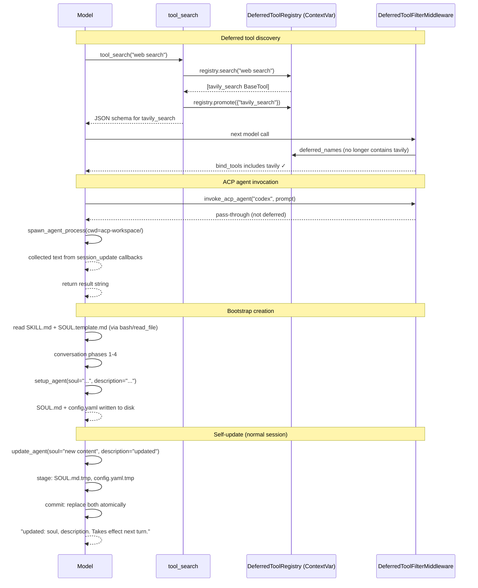

# Tools System — Agent-Lifecycle Built-ins (Phase 3, Part 2)

## Purpose

This file covers the four built-in tools that manage deferred discovery and agent identity.
They are more architecturally complex than the core interaction tools in `12b` because each
one owns a cross-request subsystem rather than just responding to a single model call.

| Tool               | Purpose                                                               | Bound when                                |
| ------------------ | --------------------------------------------------------------------- | ----------------------------------------- |
| `tool_search`      | Fetch full JSON schemas for deferred (MCP) tools                      | `tool_search.enabled` + MCP tools present |
| `invoke_acp_agent` | Spawn an external ACP subprocess agent and collect its result         | `acp_agents` configured in `config.yaml`  |
| `setup_agent`      | Create a new custom agent's `SOUL.md` + `config.yaml` on disk         | `is_bootstrap=True` in `RunnableConfig`   |
| `update_agent`     | Partially update an existing custom agent's `SOUL.md` / `config.yaml` | `agent_name` set + `is_bootstrap=False`   |

---

## Key Files

- `deerflow/tools/builtins/tool_search.py` — `DeferredToolRegistry`, `tool_search` tool, `_registry_var` ContextVar
- `deerflow/tools/builtins/invoke_acp_agent_tool.py` — `build_invoke_acp_agent_tool()`, `_CollectingClient`, ACP subprocess integration
- `deerflow/tools/builtins/setup_agent_tool.py` — `setup_agent` bootstrap tool, SOUL.md + config.yaml creation
- `deerflow/tools/builtins/update_agent_tool.py` — `update_agent` partial-update tool, two-phase atomic commit

---

## Important Concepts

### 1. Deferred Tool Discovery (`tool_search`)

When `tool_search.enabled` is true, MCP tools are registered in a `DeferredToolRegistry` at
run startup rather than being bound to the model directly. The agent sees tool **names only**
in `<available-deferred-tools>` in the system prompt and must call `tool_search` to fetch full
JSON schemas before invoking them.

**Three-form query language** (mirrors Claude Code's `ToolSearch` interface):

| Prefix    | Semantics                                                    |
| --------- | ------------------------------------------------------------ |
| `select:` | Exact name match — `"select:Read,Edit,Grep"`                 |
| `+`       | Name must contain keyword, remainder ranks — `"+slack send"` |
| _(none)_  | Case-insensitive regex against name + description            |

**Promotion is one-way and atomic.** `tool_search` both returns the schema JSON and calls
`registry.promote(matched_names)` in the same step. Once promoted, a tool is removed from the
registry and `DeferredToolFilterMiddleware` stops stripping it from `bind_tools`. There is no
window where the schema is visible but the tool is still blocked.

**`DeferredToolFilterMiddleware` enforces the contract at two points:**

1. `wrap_model_call` — strips deferred schemas from `request.tools` before each `bind_tools`
2. `wrap_tool_call` — returns an error `ToolMessage` if the model hallucinated a call to a
   still-deferred tool (safety net)

**`_registry_var` ContextVar — per-run isolation:**

Each LangGraph graph run lives in its own asyncio task; the ContextVar defaults to `None` in a
new task, giving each run its own isolated `DeferredToolRegistry`. Python copies the ContextVar
context to `run_in_executor` worker threads, so synchronous tool callbacks also see the correct
registry.

**Re-entry guard (issue #2884):** `get_available_tools()` is called again when `task_tool`
spawns a subagent. Before the fix, this unconditionally rebuilt the registry, wiping the parent
agent's promotions. The fix: check `get_deferred_registry()` first and skip initialisation if a
registry already exists in the current async context. See `12a-tools-primitives-registry.md`
§4 for a full annotated trace.

**`reset_deferred_registry()` is only called by tests.** Production code never calls it. Calling
it inside an active run re-introduces the issue #2884 bug.

---

### 2. ACP Agent Integration (`invoke_acp_agent`)

`invoke_acp_agent` bridges the lead agent to external **ACP (Agent Client Protocol)**-compatible
subprocess agents (e.g. Codex). The tool factory generates a single `invoke_acp_agent` tool
whose description dynamically embeds the configured agent list — the LLM knows its options
without a separate discovery call.

**Key design points:**

- **Dynamic description at build time** — `build_invoke_acp_agent_tool(agents)` bakes the
  available agent list into the tool description at construction time. Unlike MCP tools (deferred
  via `tool_search`), ACP agents are always visible in the model's schema because there are few
  of them and they have high-level descriptions, not dozens of low-level schemas.

- **Per-thread workspace isolation** — Each thread gets `{base_dir}/users/{user_id}/threads/{thread_id}/acp-workspace/`
  as its working directory. The lead agent reads results at the virtual path `/mnt/acp-workspace/`
  (read-only). Mirrors the sandbox's per-thread `user-data/` isolation pattern.

- **MCP passthrough** — `_build_acp_mcp_servers()` converts DeerFlow's `extensions_config.json`
  MCP server definitions into the ACP wire format and passes them to the child agent via
  `conn.new_session(mcp_servers=...)`. The ACP agent inherits the lead agent's MCP tools.

- **`InjectedToolArg` for `RunnableConfig`** — The `config` parameter is invisible to the model
  (stripped from `bind_tools`) but injected by LangChain at execution time, carrying `thread_id`
  in `config.configurable`.

- **Permission model** — ACP agents can request permission before privileged operations.
  DeerFlow either auto-approves (`allow_once` preferred over `allow_always`) or denies (cancels)
  based on `auto_approve_permissions` in `ACPAgentConfig`. Never blocks on user input.

- **`$VAR` env expansion** — `agent_config.env` values starting with `$` are resolved from the
  host environment, letting credentials pass through without hardcoding them in `config.yaml`.

- **Actionable error messages** — `_format_invocation_error()` detects the common mistake of
  having `codex` CLI instead of `codex-acp` and returns the exact `npx` command to fix it.

**`_CollectingClient` pattern:**

```python
class _CollectingClient(Client):
    def __init__(self): self._chunks: list[str] = []

    async def session_update(self, session_id, update, **kwargs):
        # accumulate streamed text chunks
        if isinstance(update.content, TextContentBlock):
            self._chunks.append(update.content.text)

    async def request_permission(self, options, session_id, tool_call, **kwargs):
        return _build_permission_response(options, auto_approve=agent_config.auto_approve_permissions)
```

The client collects streaming text updates from the ACP session and handles permission
requests without pausing for user input.

---

### 3. Bootstrap Agent Creation (`setup_agent`)

`setup_agent` is the **bootstrap-only** tool for creating a new custom agent from scratch.
It is bound exclusively when `is_bootstrap=True` in `RunnableConfig.configurable`.

**The bootstrap flow:**

```
Frontend /workspace/agents/new
  → sends message with RunnableConfig { is_bootstrap: true, agent_name: "my-agent" }
  → make_lead_agent() sees is_bootstrap=True
    → _available_skill_names() returns {"bootstrap"}  ← only this skill
    → tools = get_available_tools() + [setup_agent]   ← setup_agent added
    → system prompt uses minimal bootstrap template

Bootstrap session:
  → Agent reads bootstrap/SKILL.md from /mnt/skills/public/bootstrap/SKILL.md
  → Reads templates/SOUL.template.md
  → Runs 4-phase conversation (5-8 rounds) to extract user info
  → Generates SOUL.md from template
  → Calls setup_agent(soul="...", description="...")

setup_agent:
  → validate_agent_name(agent_name)
  → user_id = resolve_runtime_user_id(runtime)
  → agent_dir = {base_dir}/users/{user_id}/agents/{agent_name}/
  → write config.yaml (name, description, skills)
  → write SOUL.md
  → return Command(update={created_agent_name, messages: [ToolMessage]})
```

After bootstrap completes, subsequent chats routed to `agent_name="my-agent"` run in normal mode:
the persisted `SOUL.md` is loaded as system-prompt identity, and `update_agent` is bound instead
of `setup_agent`. `setup_agent` is never visible to normal or custom-agent runs.

**SOUL.template.md drives generation quality.** The template (at `skills/public/bootstrap/templates/SOUL.template.md`)
is not baked into the prompt — it is a physical file the agent reads via `read_file` during the
conversation. Five required sections: Identity, Core Traits, Communication, Growth, Lessons Learned.
All under 300 words. Always generated in English regardless of conversation language.

**Cleanup on failure:** `is_new_dir` is captured before `mkdir`. On exception, only
newly-created directories are removed — pre-existing agent directories are never touched.

---

### 4. Partial Agent Updates (`update_agent`)

`update_agent` is the self-update tool for an **already-running** custom agent. It is bound when
`agent_name` is set and `is_bootstrap=False`. Partial update semantics: only the fields explicitly
passed are written; omitted fields keep their existing on-disk values.

**Two-phase atomic commit:**

```
Stage phase:
  config.yaml → write to config.yaml.tmp (sibling, same filesystem)
  SOUL.md     → write to SOUL.md.tmp

Commit phase:
  config.yaml.tmp → Path.replace(config.yaml)   ← atomic rename on POSIX
  SOUL.md.tmp     → Path.replace(SOUL.md)       ← atomic rename on POSIX
```

`Path.replace()` is atomic per file on POSIX. Staging both temps first means a staging failure
(e.g. disk full) leaves the existing files intact. A commit failure between the two renames
(process crash) leaves one file updated and one stale — the error message reports exactly which
files were committed so the user knows what to retry.

`_stage_temp` uses `BaseException` (not `Exception`) to ensure temp cleanup even on
`KeyboardInterrupt` or `SystemExit`. The temp file is created in `dir=path.parent` so
`Path.replace()` stays within the same filesystem (required for atomic rename).

**Pre-commit model validation:**

```python
if model is not None and get_app_config().get_model_config(model) is None:
    return _err(f"Unknown model '{model}'...")
```

Validates the model name against `config.yaml` BEFORE touching the filesystem. Without this,
`_resolve_model_name` would silently fall back to the default on every subsequent turn, producing
confusing repeated warnings.

**Legacy layout guard:**

```python
if not agent_dir.exists() and paths.agent_dir(agent_name).exists():
    return _err("... Run scripts/migrate_user_isolation.py ...")
```

Refuses to update agents that only exist in the pre-user-isolation shared layout
`{base_dir}/agents/{name}/`. Directs the user to the migration script rather than silently
writing to the wrong location.

**`name` normalization:**

```python
config_data: dict[str, Any] = {"name": agent_name}
```

The `name` field is always written from the directory name (not from `existing_cfg.name`) to
keep the filesystem directory and YAML field in sync after manual edits.

---

## Execution Flow



---

## Architecture Diagram

```mermaid
graph TD
    subgraph "tools.py — get_available_tools()"
        MCP[MCP tools] -->|tool_search.enabled| DR[DeferredToolRegistry]
        DR -->|set ContextVar| CV[_registry_var]
        MCP -->|not deferred| LL[live tool list]
        TS[tool_search tool] --> LL
        IA[invoke_acp_agent] --> LL
        SA[setup_agent] -->|is_bootstrap=True only| LL
        UA[update_agent] -->|agent_name set, not bootstrap| LL
    end

    subgraph "Run (per-request)"
        CV -->|read| DTFM[DeferredToolFilterMiddleware]
        DTFM -->|strip deferred from bind_tools| LLM[Model]
        LLM -->|call tool_search| TS
        TS -->|promote| DR
    end

    subgraph "Filesystem"
        SA -->|write| SOUL[users/{user}/agents/{name}/SOUL.md]
        SA -->|write| CFG[users/{user}/agents/{name}/config.yaml]
        UA -->|atomic replace| SOUL
        UA -->|atomic replace| CFG
        IA -->|cwd| WS[users/{user}/threads/{tid}/acp-workspace/]
    end
```

---

## My Insights

**`DeferredToolRegistry` is source-agnostic by deliberate design.** The module docstring says
"no mention of MCP or tool origin." The registry stores any `BaseTool`. Today only MCP tools are
deferred (they can number in the dozens), but the mechanism is fully generic. Any future large
tool pool can be deferred through the same path.

**Deferred discovery solves a real scalability problem.** MCP servers can expose 30–100 tools.
Binding all of them to every `bind_tools` call would burn thousands of context tokens per turn.
The deferred pattern lets the agent pay that cost only when it actually needs those tools —
often never for a given run.

**`setup_agent` and `update_agent` implement a clean lifecycle gate.** Bootstrap is one-time and
creates files. Update is ongoing and only patches existing files. The two tools are never visible
at the same time: `is_bootstrap` determines which one is bound. This prevents the agent from
calling `setup_agent` to overwrite an existing agent's identity mid-conversation.

**The two-phase atomic commit in `update_agent` is production-quality file I/O.** The pattern
(stage temp → rename into place) is how databases implement WAL-like durability for small files.
`Path.replace()` is atomic on POSIX precisely because it uses the `rename(2)` syscall.

**The bootstrap skill's SOUL.template.md is runtime-loaded, not baked in.** The LLM reads it
as a file (via `read_file` tool) during the conversation. This means the template can be improved
without any Python code change — just edit `skills/public/bootstrap/templates/SOUL.template.md`
and restart. This is the same principle as skills in general: plain text files the agent treats
as living documentation.

---

## Open Questions

- **`created_agent_name` in state has no known consumer.** `setup_agent` writes `Command(update={"created_agent_name": agent_name, ...})`. No Python code or frontend TypeScript reads this field from LangGraph state. Possible explanations: vestigial from a prior feature, or a debug signal visible in LangGraph state inspector tools.

- **`proc` in ACP invocation is unused.** `spawn_agent_process` yields `(conn, proc)` but `proc`
  is never referenced. Could it be used for SIGTERM on timeout? The async context manager owns
  process lifetime, but an explicit kill handle may be needed for long-running ACP agents.

- **No timeout on ACP `conn.prompt()`.** A misbehaving or slow ACP agent (e.g. a 60-minute
  coding task) blocks the lead agent's turn indefinitely. Is there a timeout at the ACP protocol
  level, or does the outer LangGraph run timeout eventually propagate?

---

## Links to Related Sections

- [[12a-tools-primitives-registry]] — `get_available_tools()` assembly where all four tools are
  conditionally wired; the deferred tool registry re-entry guard (issue #2884) is traced in full
- [[12b-tools-builtins]] — core interaction built-ins (ask_clarification, present_files,
  view_image, task); the `InjectedToolArg` and `Command` patterns are introduced there
- [[09d-tool-call-wrappers]] — `DeferredToolFilterMiddleware` consumes `DeferredToolRegistry`;
  both `wrap_model_call` (strip schemas) and `wrap_tool_call` (block direct invocation) documented there
- [[08a-lead-agent]] — `make_lead_agent()` is where `is_bootstrap` is read and `setup_agent` is
  conditionally added to the tool list; `_available_skill_names()` pins to `{"bootstrap"}`
- [[13-skills-system]] — the `bootstrap` skill (`skills/public/bootstrap/`) drives the
  setup_agent conversation; its `SKILL.md` instructions and `SOUL.template.md` are not code
