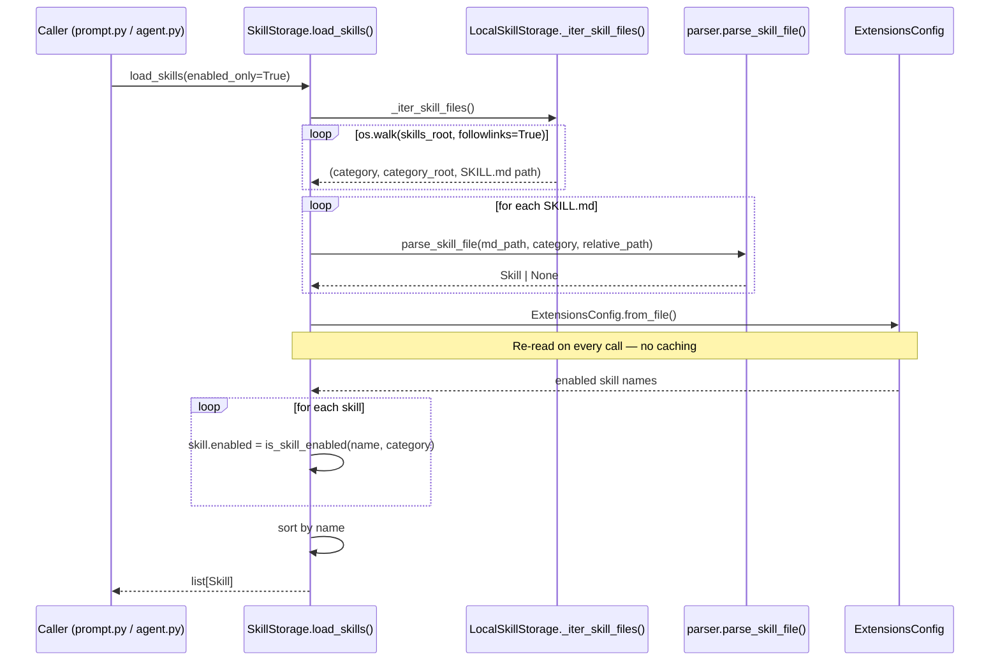
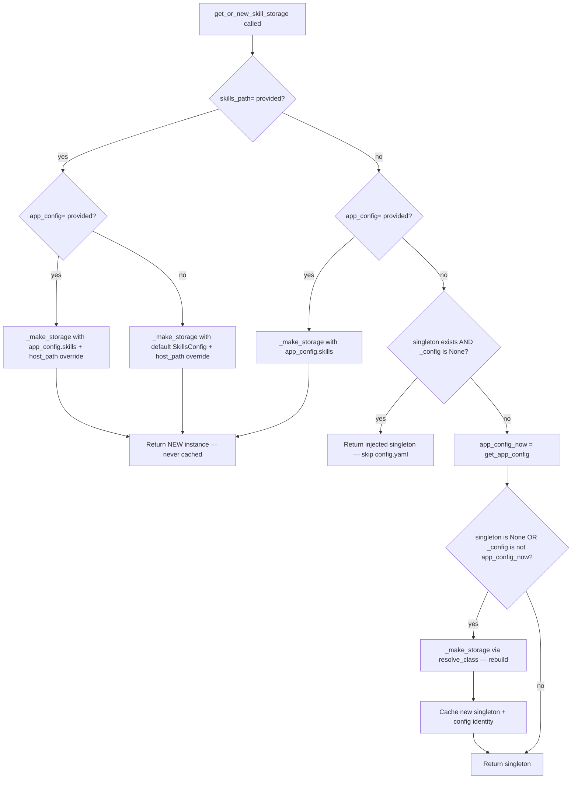

# Skills System — Primitives & Storage (Phases 1–2)

## Purpose

The skills system is DeerFlow's plugin layer. A skill is a directory containing a `SKILL.md`
file with YAML frontmatter (name, description, allowed tools) plus optional scripts and assets.
The lead agent receives the paths to all _enabled_ skills in its system prompt; the sandbox can
then execute those scripts directly by path.

Phases 1–2 cover the data vocabulary (`types.py`, `__init__.py`), the abstract storage
contract (`storage/skill_storage.py`), the filesystem implementation
(`storage/local_skill_storage.py`), and the singleton factory (`storage/__init__.py`).

---

## Key Files

- `deerflow/skills/types.py` — `Skill` dataclass, `SkillCategory` enum, `SKILL_MD_FILE` constant; the type vocabulary used by every other file in the subsystem
- `deerflow/skills/__init__.py` — narrow public API for the App layer; internal harness code bypasses it and imports from submodules directly
- `deerflow/skills/storage/skill_storage.py` — abstract `SkillStorage` base: Template Method pattern with static validators, concrete path helpers, and final orchestration flows
- `deerflow/skills/storage/local_skill_storage.py` — filesystem-backed implementation; all disk I/O lives here
- `deerflow/skills/storage/__init__.py` — singleton factory `get_or_new_skill_storage()`; reflection-based class loading; config-identity hot-reload detection

---

## Important Concepts

### 1. The `Skill` Dataclass — two views of the same file

```python
@dataclass
class Skill:
    name: str
    description: str
    license: str | None
    skill_dir: Path          # host: deer-flow/skills/public/chart-visualization/
    skill_file: Path         # host: deer-flow/skills/public/chart-visualization/SKILL.md
    relative_path: Path      # from category root: chart-visualization
    category: SkillCategory  # "public" or "custom"
    allowed_tools: list[str] | None = None
    enabled: bool = False
```

Every `Skill` instance carries two coordinate systems simultaneously:

| View                                        | Example                                        |
| ------------------------------------------- | ---------------------------------------------- |
| **Host path** (`skill_dir`, `skill_file`)   | `deer-flow/skills/public/chart-visualization/` |
| **Container path** (`get_container_path()`) | `/mnt/skills/public/chart-visualization`       |

The conversion is in `get_container_path()`:

```python
f"{container_base_path}/{self.category}/{self.skill_path}"
# → /mnt/skills/public/chart-visualization
```

This dual-path design is consistent across DeerFlow: the sandbox uses `/mnt/user-data` vs
`.deer-flow/users/{uid}/threads/{tid}/user-data`; ACP workspaces use `/mnt/acp-workspace` vs
the physical path. The agent always sees virtual paths; the host filesystem has the real ones.

---

### 2. `SkillCategory` — `StrEnum` as path segment

```python
class SkillCategory(StrEnum):
    PUBLIC = "public"
    CUSTOM = "custom"
```

`StrEnum` is chosen so `SkillCategory.PUBLIC == "public"` — the enum value is the string
directly. This means:

```python
self._host_root / category.value / normalized_name
# is the same as:
self._host_root / "public" / "chart-visualization"
```

No `.value` conversion needed at path-construction sites. Prevents a class of bugs where a
developer forgets `.value` and gets `SkillCategory.PUBLIC/chart-visualization` as a path.

---

### 3. `allowed_tools` — three-way semantics

The `allowed-tools` YAML key has three meaningful states, enforced by `tool_policy.py`:

| Value                   | Meaning                | Origin                             |
| ----------------------- | ---------------------- | ---------------------------------- |
| `None`                  | All tools unrestricted | Key absent in frontmatter          |
| `[]` (empty list)       | No tools permitted     | `allowed-tools: []`                |
| `["bash", "read_file"]` | Explicit allowlist     | `allowed-tools: [bash, read_file]` |

`None` and `[]` are distinct: a skill that declares no tools at all (`None`) can invoke
anything the sandbox offers; a skill that explicitly declares an empty list can invoke nothing.
This matters for security: custom skills should declare an explicit list to limit blast radius.

---

### 4. Template Method in `SkillStorage`

`SkillStorage` is an abstract base class where the base provides orchestration flows and
subclasses supply storage-specific atomics:

```
SkillStorage (abstract base)
├── Validators (static, no I/O):
│   ├── validate_skill_name()
│   ├── validate_relative_path()
│   └── validate_skill_markdown_content()
│
├── Abstract atomics (subclass implements):
│   ├── get_skills_root_path()
│   ├── _iter_skill_files()
│   ├── read_custom_skill() / write_custom_skill()
│   ├── ainstall_skill_from_archive()
│   ├── delete_custom_skill()
│   ├── custom_skill_exists() / public_skill_exists()
│   └── append_history() / read_history()
│
├── Concrete path helpers (protocol-level, shared):
│   ├── get_custom_skill_dir()
│   ├── get_custom_skill_file()
│   └── get_skill_history_file()
│
└── Final template flows (orchestrate atomics):
    ├── load_skills()
    └── ensure_custom_skill_is_editable()
```

The docstring on each abstract method includes an **Origin** comment pointing to the legacy
function the method was extracted from. Useful for navigating the git history.

---

### 5. Atomic Write — same-directory temp file

`write_custom_skill` uses a temp-file-then-rename idiom:

```python
with tempfile.NamedTemporaryFile("w", delete=False, dir=str(target.parent)) as tmp:
    tmp.write(content)
tmp_path.replace(target)
```

**Dry run** — writing `SKILL.md` for `chart-visualization`:

```
Step 1: validate_relative_path("SKILL.md", ".../custom/chart-visualization")
        → resolves to .../custom/chart-visualization/SKILL.md  ✓

Step 2: target.parent.mkdir(parents=True, exist_ok=True)
        → creates .../custom/chart-visualization/ if missing

Step 3: NamedTemporaryFile(dir=".../custom/chart-visualization")
        → creates .../custom/chart-visualization/tmp_abc123
        → writes full content to tmp_abc123
        → file closed (context manager exit), NOT deleted (delete=False)

Disk state now:
  custom/chart-visualization/
    SKILL.md     ← old content, still intact
    tmp_abc123   ← new content, fully written

Step 4: tmp_path.replace(target)
        → POSIX rename(".../tmp_abc123", ".../SKILL.md")
        → atomic: readers see either old or new, never partial

Disk state after:
  custom/chart-visualization/
    SKILL.md     ← new content (tmp_abc123 is gone)
```

**Why `dir=target.parent` is load-bearing:** if the temp file were in `/tmp` (the default),
`Path.replace()` would cross filesystem boundaries, triggering a non-atomic copy+delete.
A reader could observe a zero-byte or half-written file during the copy phase. By placing
the temp file in the same directory as the target, `rename()` is a single kernel syscall.

This is DeerFlow's standard atomic write idiom — also used in `agents/memory/updater.py`
for `memory.json` updates.

---

### 6. Install Pipeline — staging for atomic directory install

Installing a `.skill` ZIP archive is more complex than writing a single file, because the
result is a whole directory. `ainstall_skill_from_archive` uses a **staged install**:

```
.skill ZIP → temp extract dir → validate → security scan → staging dir → atomic rename
```

The staging directory is created inside `custom/` with a dot prefix:
`custom/.installing-chart-visualization-{random}/`. This is significant for two reasons:

1. **Same filesystem** as the final target → `_move_staged_skill_into_reserved_target` can
   do an atomic rename rather than a cross-directory copy.
2. **Dot prefix** → `_iter_skill_files` skips it (pruned by the `not name.startswith(".")` filter),
   so a partially installed skill is never visible to a concurrent `load_skills()` call.

---

### 7. Config-Identity Singleton Invalidation

The `get_or_new_skill_storage()` factory caches a process-level singleton keyed by the
**identity** of the `AppConfig` object, not its value:

```python
if _default_skill_storage is None or _default_skill_storage_config is not app_config_now:
    _default_skill_storage = _make_storage(app_config_now.skills)
    _default_skill_storage_config = app_config_now
```

`get_app_config()` returns a _new object_ whenever `config.yaml` is modified (mtime check).
The `is not` comparison detects the new object and rebuilds the storage instance with the
updated `skills.path` or `skills.use`. This is hot-reload detection by Python object identity.

```
config.yaml unchanged → same AppConfig object → _config is app_config_now → singleton reused
config.yaml edited    → new AppConfig object  → _config is not app_config_now → rebuild
```

---

### 8. Reflection-Based Factory

`_make_storage` loads the implementation class from a dotted config path:

```python
cls = resolve_class(skills_config.use, SkillStorage)
# skills_config.use = "deerflow.skills.storage.local_skill_storage:LocalSkillStorage"
```

Changing `skills.use` in `config.yaml` swaps the storage backend (filesystem → database → S3)
without any code changes. This is the same pattern used by the sandbox:
`resolve_class(config.sandbox.use, SandboxProvider)` in `sandbox_provider.py`.

The skills storage factory also has three distinct call modes:

```
skills_path= provided  → new instance, no cache (explicit path override, avoids config.yaml read)
app_config= provided   → new instance, no cache (per-request config, e.g. Gateway Depends)
neither                → process singleton (hot-reload aware via config identity)
```

---

## Execution Flow — `load_skills()`



---

## Architecture Diagram — Storage Factory Decision Tree



---

## My Insights

**The dual-path design is DeerFlow's universal virtual-filesystem pattern.** Every subsystem
that needs to expose paths to the agent uses the same split: a host path for I/O and a
container/virtual path for agent-facing references. Skills (`/mnt/skills`), sandbox user data
(`/mnt/user-data`), ACP workspaces (`/mnt/acp-workspace`) — all follow the same idiom. The
`Skill` dataclass makes both explicit on the same object, which is cleaner than having the
translation scattered across call sites.

**`StrEnum` is a quiet but important choice.** Making the enum value be the string eliminates
a whole class of `.value` bugs at path-construction sites. It also makes the category directly
serializable to JSON without conversion. In a system that stores enabled/disabled state in a
JSON file keyed by skill name and reads categories from directory names, this pays off
repeatedly.

**The Template Method pattern in `SkillStorage` is the right shape for this problem.** The
alternative — passing a storage object as a parameter to free functions — would require every
caller (`load_skills`, `write_custom_skill`, `delete_custom_skill`) to take a `storage`
argument. Instead, every storage backend automatically inherits the full orchestration: path
computation, validation, history management, and the `load_skills` template flow. Swapping
backend = subclass once.

**History as JSONL is a pragmatic choice.** JSONL is append-only, requires no schema
migrations, and is trivially readable with `readlines()` + `json.loads()`. The tradeoff is
that there's no indexed query — reading the full history is a linear scan. For the expected
volume (a few dozen edits per custom skill over its lifetime), this is the right call.

**The staged install pattern solves two problems at once.** Installing a directory atomically
is harder than installing a file: you can't `rename()` a directory over a non-empty one on
most filesystems. DeerFlow's solution — stage in the same parent dir then move — achieves
atomicity by exploiting same-filesystem rename semantics. The dot prefix of the staging
directory makes it invisible to concurrent discovery without any additional coordination.

---

## Open Questions

- What happens when `allowed_tools = []` (explicit empty list) in `tool_policy.py`? The
  `if not skill.allowed_tools:` branch (line 30) appears to treat it as "no tools permitted"
  — needs confirmation when reading `tool_policy.py`.
- Are nested skill directories supported? (`skills/public/category/skill-name/SKILL.md`)
  `_iter_skill_files` walks recursively, so the answer appears to be yes — but does the
  `relative_path` correctly capture `category/skill-name` as the segment?
- Why is `_validate_skill_frontmatter` exported with a leading underscore from `__init__.py`?
  The skills router presumably needs it for inline validation (pre-install check or live edit
  preview) without going through the full `parse_skill_file` path.

---

## Links to Related Sections

- [[12a-tools-primitives-registry]] — `filter_tools_by_skill_allowed_tools` in `tool_policy.py`
  enforces the `allowed_tools` policy against the tool list assembled here
- [[08b-skills-cache-pipeline]] — `load_skills()` from storage is called during the agents
  `__init__` eager cache priming; the cache is keyed by `extensions_config` mtime
- [[09a-middleware-pipeline-overview]] — sandbox middleware acquires the same virtual-path
  mount that skill container paths reference (`/mnt/skills`)
