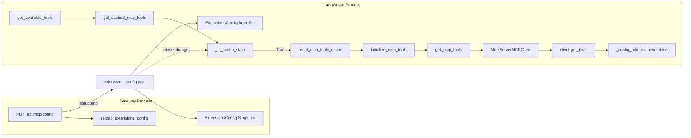
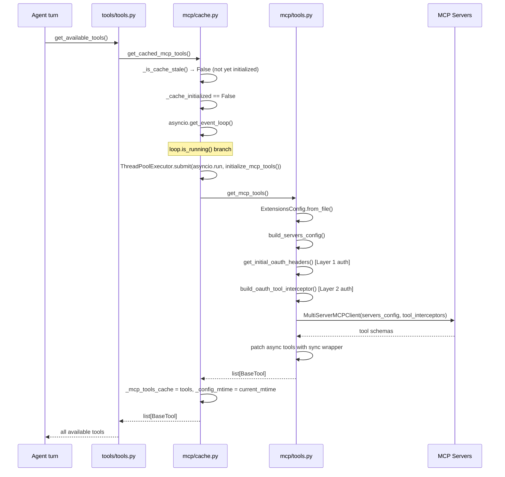
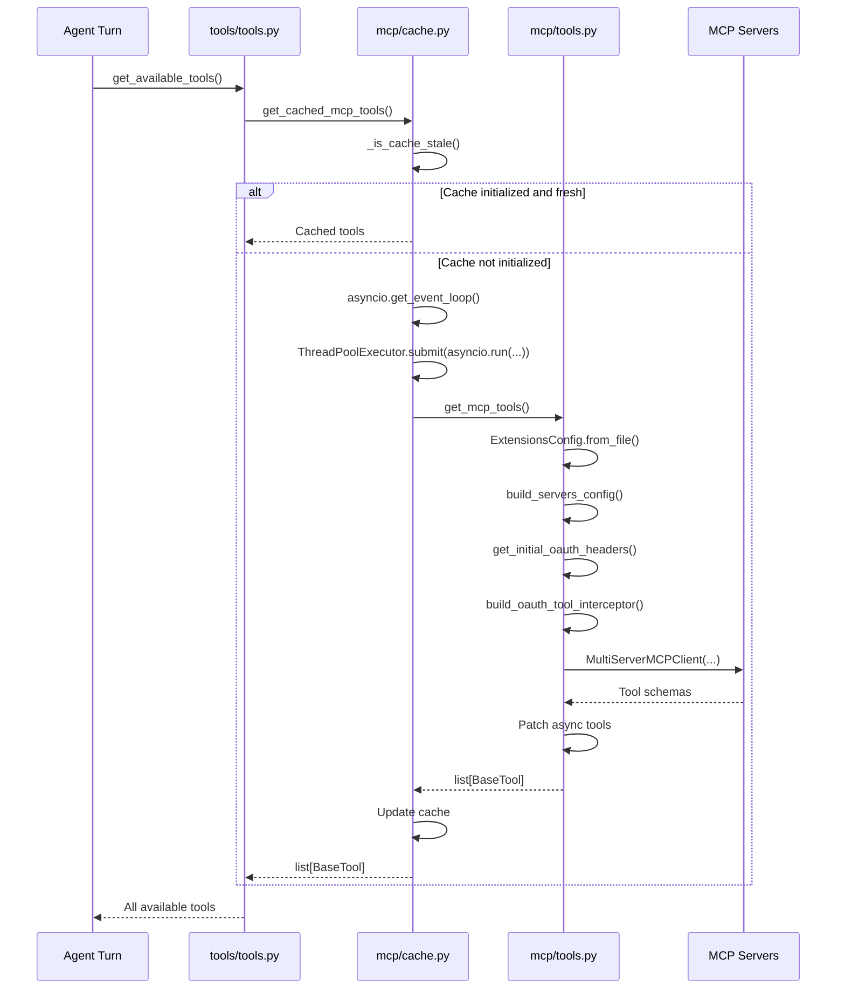

# MCP Integration

## Purpose

The `mcp/` package connects DeerFlow to external Model Context Protocol (MCP) servers —
processes that expose tools to LLM agents over a defined protocol. When enabled, MCP tools
are fetched at startup, cached for the process lifetime, and injected alongside built-in tools
into every agent turn. The Gateway API provides HTTP endpoints to read and write the MCP
server registry at runtime; the LangGraph server detects those changes passively via filesystem
mtime polling rather than any direct notification.

---

## Key Files

| File                         | Role                                                                    |
| ---------------------------- | ----------------------------------------------------------------------- |
| `deerflow/mcp/cache.py`      | Module-singleton cache; mtime-based invalidation; sync/async bridge     |
| `deerflow/mcp/oauth.py`      | OAuth token acquisition, caching, and per-call injection                |
| `deerflow/mcp/client.py`     | Translates `McpServerConfig` → `MultiServerMCPClient` params dict       |
| `deerflow/mcp/tools.py`      | Opens MCP connections, fetches tool schemas, patches for sync use       |
| `app/gateway/routers/mcp.py` | `GET`/`PUT /api/mcp/config` — reads and writes `extensions_config.json` |

---

## Important Concepts

- **MCP (Model Context Protocol)** — A protocol for exposing tools from an external server
  (stdio subprocess, SSE endpoint, or HTTP endpoint) to an LLM agent. DeerFlow uses
  `langchain-mcp-adapters`' `MultiServerMCPClient` to manage multiple servers simultaneously.

- **`extensions_config.json`** — The single file that stores both MCP server configs and skill
  enabled/disabled states. Both the Gateway API and the LangGraph server read from it.
  It is the only IPC channel between the two processes for config updates.

- **Process split** — Gateway API (port 8001) and the LangGraph runtime are separate Python
  processes. Each has its own in-memory config singleton and MCP tools cache. There is no shared
  memory or message queue between them.

- **Tool interceptors** — Async callables `(request, handler) → response` that wrap each MCP
  tool invocation. Used for OAuth token injection, custom auth, logging, rate-limiting, etc.

---

## Architecture



---

## Execution Flow

### MCP Initialization (cold start)



### Cross-Process Config Update



---

## Per-File Insights

### `mcp/cache.py` — The cache layer

**Module-singleton pattern.** Four module-level globals act as the cache:

```python
_mcp_tools_cache: list[BaseTool] | None = None
_cache_initialized = False
_initialization_lock = asyncio.Lock()
_config_mtime: float | None = None
```

These are process-local. Gateway and LangGraph each have their own independent copy.

**Why `asyncio.Lock` is necessary.**
`initialize_mcp_tools()` is async. Without the lock, two coroutines on the same event loop
could both check `_cache_initialized`, both see `False`, and both call `get_mcp_tools()`:

```python
# Without lock — two concurrent callers race:
# Coroutine A checks: _cache_initialized is False → proceeds
# Coroutine B checks: _cache_initialized is False → also proceeds (race!)
_mcp_tools_cache = await get_mcp_tools()  # A runs this
_mcp_tools_cache = await get_mcp_tools()  # B also runs this, overwrites A's result
```

The lock makes this sequential. B blocks on `async with _initialization_lock` until A finishes.
When B enters the lock body, it sees `_cache_initialized = True` and returns early.

**The sync/async bridge in `get_cached_mcp_tools()`.**
`get_cached_mcp_tools()` is synchronous (called from `tools.py` which is sync), but
`initialize_mcp_tools()` is async. The bridge handles three event-loop scenarios:

```python
loop = asyncio.get_event_loop()
if loop.is_running():
    # Case 1: inside a running loop (LangGraph Studio)
    # Cannot call asyncio.run() here — it raises RuntimeError.
    # Escape by spawning a thread with its own event loop.
    with concurrent.futures.ThreadPoolExecutor() as executor:
        future = executor.submit(asyncio.run, initialize_mcp_tools())
        future.result()  # blocks this thread only, not the outer event loop
else:
    # Case 2: loop exists but not running
    loop.run_until_complete(initialize_mcp_tools())
# Case 3: RuntimeError → no loop exists
asyncio.run(initialize_mcp_tools())
```

**The `[DL-WARN]` about the ThreadPoolExecutor path.**
The spawned thread calls `asyncio.run()`, which creates a _brand new_ event loop.
`asyncio.Lock` is not thread-safe — it has no OS mutex internally; it relies on the
single-threaded nature of asyncio. Two separate threads with two separate event loops both
accessing the same `_initialization_lock` object get no mutual exclusion:

```
Thread 1 → asyncio.run(initialize_mcp_tools()) on Loop C
Thread 2 → asyncio.run(initialize_mcp_tools()) on Loop D
  → both access _initialization_lock, but from different loops
  → Lock provides no cross-thread protection
  → both can enter the lock body simultaneously
```

In practice this race does not occur because the startup pre-warm (Gateway lifespan
calls `initialize_mcp_tools()` before any traffic) ensures `_cache_initialized = True`
by the time any concurrent agent turns start. The only real window would be two subagent
threads simultaneously hitting a stale cache after a config update — extremely unlikely
given the subagent execution ordering (lead agent always runs first).

**Mtime-based invalidation (not TTL).**
`_is_cache_stale()` does one `stat()` syscall per `get_cached_mcp_tools()` call:

```python
current_mtime = os.path.getmtime(config_path)
if current_mtime > _config_mtime:
    return True  # Gateway wrote to the file
```

No timer, no background thread. Staleness is detected lazily at the point of use.

**Lazy imports break circular dependencies.**
Both `_get_config_mtime()` and `initialize_mcp_tools()` defer their imports to inside
the function body:

```python
# Inside _get_config_mtime():
from deerflow.config.extensions_config import ExtensionsConfig

# Inside initialize_mcp_tools():
from deerflow.mcp.tools import get_mcp_tools
```

Without the lazy imports: `cache.py` → `tools.py` → `client.py` → `cache.py` would be
a circular import at module load time.

---

### `mcp/oauth.py` — Token management

**`OAuthTokenManager` — one lock per server.**
Each OAuth-enabled server gets its own `asyncio.Lock`:

```python
self._locks = {name: asyncio.Lock() for name in oauth_by_server}
```

This means concurrent calls for `server-A` and `server-B` proceed in parallel; only
concurrent calls for the _same_ server are serialized. The correct granularity.

**Double-checked locking in `get_authorization_header()`.**

```python
# Fast path: no lock, no I/O (most calls return here)
token = self._tokens.get(server_name)
if token and not self._is_expiring(token, oauth):
    return f"{token.token_type} {token.access_token}"

# Slow path: re-check inside the lock to prevent duplicate fetches
async with lock:
    token = self._tokens.get(server_name)
    if token and not self._is_expiring(token, oauth):   # ← second check
        return f"{token.token_type} {token.access_token}"
    fresh = await self._fetch_token(oauth)
    ...
```

Without the second check inside the lock: two coroutines that both see an expiring token
race to acquire the lock; the winner refreshes the token; the loser also refreshes it
unnecessarily (double HTTP request to the token endpoint).

**Proactive refresh window.**
`_is_expiring()` treats a token as expired `refresh_skew_seconds` (default 60s) _before_
its actual expiry:

```python
return token.expires_at <= now + timedelta(seconds=max(oauth.refresh_skew_seconds, 0))
```

This prevents the window where the token is valid at check time but expired by the time
the MCP server receives the tool call.

**Defensive token response parsing in `_fetch_token()`.**

```python
# extra_token_params spread first — required fields added after always win
data = {"grant_type": oauth.grant_type, **oauth.extra_token_params}
data["client_id"] = oauth.client_id   # overwrites any collision from extra_token_params

# token_type: double fallback
# `or` handles present-but-null/empty; str() handles non-string type
token_type = str(payload.get(token_type_field, default_token_type) or default_token_type)

# expires_in: some OAuth servers return a string
try:
    expires_in = int(expires_in_raw)
except (TypeError, ValueError):
    expires_in = 3600
```

**Two separate `OAuthTokenManager` instances.**
`get_initial_oauth_headers()` creates one manager; `build_oauth_tool_interceptor()` creates
another. They do not share a token cache. This means two token requests are made at startup
per OAuth server — a minor inefficiency. The interceptor's manager is then the long-lived
one, serving all per-call refreshes for the session.

---

### `mcp/client.py` — Config translator

Pure synchronous data transformation. No I/O, no state.

**Output formats per transport:**

```python
# stdio
{"transport": "stdio", "command": "npx", "args": [...], "env": {...}}

# http or sse
{"transport": "http", "url": "https://...", "headers": {...}}
```

OAuth config is intentionally absent — it is handled separately by `oauth.py`.

`args` is always included for stdio (even as `[]`) because the adapter requires the key.
`env` and `headers` are only included when non-empty (falsy dict check).

**Partial-failure tolerance.** One misconfigured server is logged and skipped; valid servers
still load. This is explicitly tested in `test_mcp_client_config.py`.

---

### `mcp/tools.py` — The assembly point

This is the only file that actually opens MCP server connections. Everything else supports it.

**Two-layer OAuth for SSE/HTTP servers:**

```
Layer 1 — connection-time (transport handshake):
  get_initial_oauth_headers()
  → injects Authorization header into servers_config[name]["headers"]
  → used by MultiServerMCPClient when establishing the connection

Layer 2 — per-call (token refresh):
  build_oauth_tool_interceptor()
  → closure captured in tool_interceptors list
  → called on every MCP tool invocation; fetches a fresh token if the cached one is expiring
```

SSE transports negotiate auth at the HTTP connection level. Without Layer 1, the connection
itself would fail before any tool call is made. Without Layer 2, a token that expires mid-session
would cause all subsequent tool calls to fail.

**`tool_name_prefix=True`** namespaces each tool as `{server-name}__{tool-name}`.
Without this, two servers exposing a tool named `read_file` would silently collide.

**Custom interceptors via `mcpInterceptors` (undocumented extension point).**
`ExtensionsConfig` uses `ConfigDict(extra="allow")`, so unknown JSON keys land in
`model_extra`. Any user can add an interceptor (logging, rate-limiting, custom auth) by
declaring it in `extensions_config.json` without touching DeerFlow source:

```json
{
  "mcpServers": { ... },
  "mcpInterceptors": ["my_package.auth:build_interceptor"]
}
```

DeerFlow loads the builder via `resolve_variable()`, calls it, and appends the returned
interceptor after the OAuth one (OAuth is always first — outermost wrapper).

**Sync patching.** `langchain-mcp-adapters` produces async-only tools (`coroutine` set,
`func=None`). DeerFlowClient's streaming path is synchronous. Each async-only tool gets a
`make_sync_tool_wrapper()` assigned to `tool.func`, backed by a shared 10-worker
`ThreadPoolExecutor` in `tools/sync.py` that escapes the running event loop safely.

---

### `app/gateway/routers/mcp.py` — HTTP surface

Two endpoints; the file is entirely in the `app/` layer (not harness).

**`GET /api/mcp/config`** — reads from `get_extensions_config()`, the Gateway's in-process
cached singleton. No disk I/O on the hot path.

**`PUT /api/mcp/config`** — update flow:

```
1. resolve config path (create at project root if none exists)
2. read current_config to capture existing skill states
3. merge: new MCP servers + preserved skill states → config_data
4. json.dump(config_data) → extensions_config.json (mtime advances)
5. reload_extensions_config() → Gateway's in-memory cache updated
```

**Why skills must be preserved.**
`extensions_config.json` stores both MCP servers and skill enabled/disabled states in one file.
The `skills` field is NOT a skill definition — it is a tiny state record:

```json
{ "skills": { "chart-visualization": { "enabled": true } } }
```

Actual skill definitions live under `skills/public/` and `skills/custom/` on the filesystem.
Without the re-merge, every `PUT /api/mcp/config` would silently wipe all skill toggle states.
The same merge logic applies in the skills router (it preserves `mcpServers` when updating skills).

**Response models strip extra fields.**
`McpServerConfigResponse` mirrors `McpServerConfig` but has no `ConfigDict(extra="allow")`.
Fields like `mcpInterceptors` that live in `model_extra` on the domain model never appear in
API responses, giving the HTTP contract a stable surface.

---

## The Config Update Dry-Run

User enables a new MCP server in the frontend:

```
1. Frontend sends PUT /api/mcp/config with new mcpServers payload
2. Gateway: resolve_config_path() → /project/extensions_config.json
3. Gateway: current_config = get_extensions_config()
            current_config.skills = {"chart-visualization": {"enabled": true}}
4. Gateway: config_data = {
               "mcpServers": {"github": {"enabled": true, "command": "npx", ...},
                              "new-server": {"enabled": true, ...}},
               "skills": {"chart-visualization": {"enabled": true}}  ← preserved
            }
5. Gateway: json.dump → disk; file mtime advances from T1 to T2
6. Gateway: reload_extensions_config() → Gateway's own cache now has "new-server"
7. Gateway: return McpConfigResponse

--- user sends next message ---

8. LangGraph: get_available_tools() → get_cached_mcp_tools()
9. LangGraph: _is_cache_stale():
              os.path.getmtime() = T2 > _config_mtime (T1) → True
10. LangGraph: reset_mcp_tools_cache()
              → _cache_initialized = False, _mcp_tools_cache = None, _config_mtime = None
11. LangGraph: initialize_mcp_tools()
              → get_mcp_tools()
              → ExtensionsConfig.from_file() reads new config (github + new-server)
              → MultiServerMCPClient connects to both
              → client.get_tools() fetches schemas from both
              → sync wrappers patched
              → _config_mtime = T2
12. Agent has tools from both servers on this turn
```

---

## Open Questions

- **`Path.cwd()` fragility.** `update_mcp_configuration()` creates the config at
  `Path.cwd().parent` on first use, assuming the Gateway runs from `backend/`. If started
  from a different working directory, the path would be wrong. Worth checking the Makefile
  `make dev` target to confirm the assumed cwd.

- **Two `OAuthTokenManager` instances at startup.** `get_initial_oauth_headers()` and
  `build_oauth_tool_interceptor()` each create their own manager. The first fetch at startup
  therefore issues two token requests per OAuth server. A unified manager passed to both
  functions would halve the startup token traffic.

- **Mtime polling frequency.** `_is_cache_stale()` calls `os.path.getmtime()` on every
  `get_cached_mcp_tools()` call, which fires on every agent turn. On high-traffic deployments
  this is one `stat()` syscall per turn — negligible individually but worth noting.

- **The `asyncio.Lock` cross-thread gap.** The lock does not protect concurrent initialization
  from two separate threads (each with their own `asyncio.run()` loop). Documented as a known
  theoretical gap. In practice, the startup pre-warm eliminates the race window.

---

## Links to Related Sections

- [[07-langgraph-runtime]] — RunManager and `get_available_tools()` call that triggers the cache
- [[12-tools-primitives-registry]] — `tools/tools.py` assembles MCP tools alongside built-in tools; `tools/sync.py` provides `make_sync_tool_wrapper`
- [[13-skills-processing-install]] — Skills and MCP share `extensions_config.json`; PUT handlers preserve each other's state
- [[17-config-system]] — `ExtensionsConfig`, `get_extensions_config()`, `reload_extensions_config()` live here
