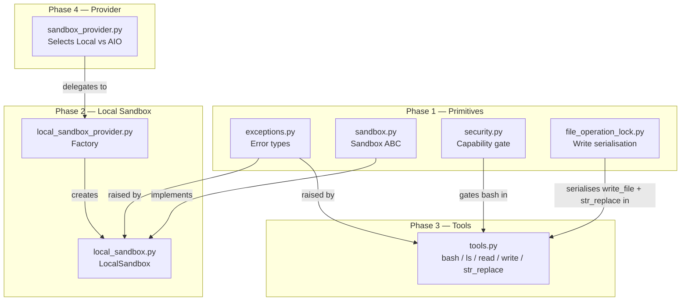

# Section 15a — Sandbox Primitives

## Purpose

Phase 1 of the sandbox study covers the foundational layer: the exception hierarchy, the abstract interface contract, the security gate, and the file concurrency lock. These four files contain no execution logic of their own — they define the vocabulary, the safety envelope, and the synchronisation primitives that every other sandbox file builds on.

## Key Files

- `sandbox/exceptions.py` — Two-level exception hierarchy for all sandbox error types
- `sandbox/sandbox.py` — Abstract `Sandbox` base class: the 7-method interface every implementation satisfies
- `sandbox/security.py` — Capability gate: decides whether bash execution is permitted based on provider type
- `sandbox/file_operation_lock.py` — Per-file, per-sandbox write serialisation using `WeakValueDictionary`

---

## Important Concepts

### 1. Exception Hierarchy

The hierarchy is deliberately two levels deep, mirroring Python's own `OSError` tree:

```
SandboxError (base)
├── SandboxNotFoundError    — a specific sandbox instance cannot be found by ID
├── SandboxRuntimeError     — the sandbox infrastructure itself is broken/misconfigured
├── SandboxCommandError     — a command execution failed (carries command + exit_code)
└── SandboxFileError        — a file operation failed (carries path + operation)
    ├── SandboxPermissionError
    └── SandboxFileNotFoundError
```

This mirrors `OSError → PermissionError / FileNotFoundError`, giving callers a familiar catch surface: `except SandboxFileError` catches both permission and not-found failures; `except SandboxPermissionError` is selective.

**`SandboxError.details` — structured error context**

Every exception carries a `details: dict` that subclasses populate with contextual fields. `__str__` flattens the dict into `key=value` pairs appended to the message:

```python
raise SandboxCommandError("Command failed", command="cat /etc/passwd", exit_code=1)
# str() → "Command failed (command=cat /etc/passwd, exit_code=1)"
```

This is structured logging baked into the exception: human-readable in log output, machine-parsable via `.details` in code.

**Command truncation in `SandboxCommandError`**

The `command` field in `details` is truncated to 100 characters. Agent-generated shell commands can be very long (multi-line Python piped through bash). Without truncation, a single exception could flood structured log aggregators. The full command is preserved in `self.command` for callers that need it.

**`SandboxNotFoundError` vs `SandboxRuntimeError`**

| Exception              | Meaning                                                       |
| ---------------------- | ------------------------------------------------------------- |
| `SandboxNotFoundError` | A specific sandbox _instance_ (by `sandbox_id`) was not found |
| `SandboxRuntimeError`  | The sandbox _system_ is unavailable or misconfigured          |

Callers can target each independently. `SandboxRuntimeError` maps to "infrastructure is broken"; `SandboxNotFoundError` maps to "that run's sandbox has been released or never existed."

---

### 2. The Sandbox Interface Contract

`Sandbox` is a pure abstract class (`ABC`) with 7 methods:

| Method                                    | I/O                         | Notes                                                              |
| ----------------------------------------- | --------------------------- | ------------------------------------------------------------------ |
| `execute_command(command)`                | `→ str`                     | Returns merged stdout+stderr; failures raise `SandboxCommandError` |
| `read_file(path)`                         | `→ str`                     | Text read                                                          |
| `write_file(path, content, append=False)` | `→ None`                    | Text write or append                                               |
| `update_file(path, content: bytes)`       | `→ None`                    | Binary write — distinct from `write_file`                          |
| `list_dir(path, max_depth=2)`             | `→ list[str]`               | Tree listing                                                       |
| `glob(path, pattern, *, …)`               | `→ (list[str], bool)`       | File pattern search                                                |
| `grep(path, pattern, *, …)`               | `→ (list[GrepMatch], bool)` | Text search                                                        |

**`glob` and `grep` return `(list, truncated_bool)`**

The boolean is an explicit overflow signal. Rather than silently returning a partial list or raising an exception, the interface lets callers decide how to respond:

```python
matches, truncated = sandbox.glob(path, "**/*.py")
if truncated:
    return "Results were cut off — please narrow your search."
```

This is a deliberate UX choice that shows up at the tool surface the agent sees.

**`update_file` is the binary counterpart to `write_file`**

`write_file` takes `str` — for text content the agent generates. `update_file` takes `bytes` — for raw binary outputs (images, compiled files) where encoding to UTF-8 would corrupt data. The text/binary split lives at the interface level, not buried in implementation details.

**`str_replace` is intentionally absent**

The agent-visible `str_replace` tool (defined in `sandbox/tools.py`) is not a `Sandbox` primitive. It is composed at the tools layer using `read_file` + `write_file`. The `Sandbox` interface is deliberately minimal: only atomic, non-composable operations belong here.

**Virtual path translation lives above this layer**

The agent works with virtual paths like `/mnt/user-data/workspace/output.py`. The physical path on disk is something like `backend/.deer-flow/users/u1/threads/t42/user-data/workspace/output.py`. That translation happens in `sandbox/tools.py`, not in any `Sandbox` method. This keeps the interface clean: implementations receive pre-translated paths.

Two implementations satisfy the contract:

- `LocalSandbox` — filesystem-based, directly on the host
- `AioSandbox` — Docker container-based (community package)

---

### 3. Security Gate: `sandbox/security.py`

**The core safety model**

`LocalSandboxProvider` executes commands directly on the host OS — no process isolation, no filesystem boundary. The Python process and the agent's bash commands run as the same OS user. A prompt injection attack could read arbitrary host files or exfiltrate data.

`AioSandboxProvider` runs commands inside a Docker container. There is a genuine isolation boundary. Bash is always safe there.

**`is_host_bash_allowed` logic**

```python
def is_host_bash_allowed(config=None) -> bool:
    sandbox_cfg = getattr(config, "sandbox", None)
    if sandbox_cfg is None:
        return False                              # no config → block
    if not uses_local_sandbox_provider(config):
        return True                               # Docker/AIO → always safe
    return bool(getattr(sandbox_cfg, "allow_host_bash", False))  # local → explicit opt-in
```

**Why `if not uses_local_sandbox_provider` and not the reverse?**

This is a "fast path for the trusted case" pattern common in security code. Reading it linearly:

1. No sandbox config → `False` (safe default)
2. **Not local** (i.e. Docker/AIO) → `True` immediately — "get out of the way for the safe case"
3. Local → fall through to the restrictive check

If written as `if uses_local_sandbox_provider: check_flag; else: return True`, the implicit default becomes "return True" — bash allowed — with a restrictive exception. That inverts the mental model. The chosen form keeps the fallthrough as the restrictive path:

> **The dangerous case is the default. Escape hatches must be explicit.**

New sandbox providers added in the future automatically inherit `return True` (since they aren't `LocalSandboxProvider`) — which is correct if they provide real isolation.

**Defense in depth: four enforcement points**

`is_host_bash_allowed` is not called once — it is called at every layer that could surface bash:

| Callsite                          | Effect                                                          |
| --------------------------------- | --------------------------------------------------------------- |
| `tools/tools.py:78`               | Hides `bash` from the tool registry — agent never sees the tool |
| `sandbox/tools.py:1239`           | Blocks execution inside the bash tool itself                    |
| `subagents/registry.py:163`       | Disables the `bash` built-in subagent                           |
| `tools/builtins/task_tool.py:226` | Blocks `bash` subagent dispatch at the task level               |

The first two together mean bash is both _hidden_ (layer 1) and _blocked if somehow invoked_ (layer 2). The last two extend the same gate to the subagent system.

**Provider detection is defensively broad**

`uses_local_sandbox_provider` checks three forms:

```python
# Exact match against two canonical paths
"deerflow.sandbox.local:LocalSandboxProvider"
"deerflow.sandbox.local.local_sandbox_provider:LocalSandboxProvider"

# Fallback for any other variant
sandbox_use.endswith(":LocalSandboxProvider") and "deerflow.sandbox.local" in sandbox_use
```

A user configuring an unusual module path variant in `config.yaml` still triggers the security gate.

---

### 4. File Operation Lock: `sandbox/file_operation_lock.py`

Provides per-file, per-sandbox write serialisation using a global registry of `threading.Lock` objects.

**The concurrency problem**

The subagent system runs multiple agents in parallel threads. Two agents targeting the same output file in the same sandbox would interleave their `write_file` calls without coordination, producing corrupted content. The lock serialises them.

**`WeakValueDictionary` — automatic memory cleanup**

```python
_FILE_OPERATION_LOCKS: weakref.WeakValueDictionary[_LockKey, threading.Lock] = weakref.WeakValueDictionary()
```

A regular `dict` would hold a _strong_ reference to each `Lock` — keeping it alive in memory even after every thread has finished using it. A server processing 100,000 unique file paths over its lifetime would accumulate 100,000 dead `Lock` objects.

`WeakValueDictionary` holds only _weak_ references to values. The strong reference is the local variable returned to the caller. The moment the caller exits the `with lock:` block and the local variable goes out of scope, the strong reference count drops to zero, Python destroys the `Lock`, and the `WeakValueDictionary` automatically removes the entry.

**Strong vs weak reference — the lifecycle**

```
Thread calls get_file_operation_lock(sandbox, path)
  Lock created
  WeakValueDictionary: weak ref ···> Lock
  Caller holds:        strong ref ──> Lock     [ref count = 1]

Inside `with lock:` block
  Lock is alive because caller holds the strong ref   [ref count = 1]

Caller exits `with lock:` block
  Local variable `lock` goes out of scope
  ref count drops to 0 → Lock is destroyed
  WeakValueDictionary entry is automatically removed  ✓

Next call to get_file_operation_lock() for same path
  dict.get(key) → None (entry was cleaned up)
  New Lock is created fresh
```

The test `test_file_operation_lock_memory_cleanup` proves this exactly: a lock created and released inside a helper function is gone from `_FILE_OPERATION_LOCKS` after `gc.collect()`.

**Why a guard lock is necessary**

`_FILE_OPERATION_LOCKS_GUARD = threading.Lock()`

`WeakValueDictionary` is not thread-safe for concurrent check-and-create. Without the guard, two threads racing on the same path could both call `.get(key)`, both see `None`, and both independently create a new `Lock`. They would each hold different `Lock` objects for the same path — serialisation is defeated entirely.

The guard makes the check-and-create atomic:

```python
with _FILE_OPERATION_LOCKS_GUARD:
    lock = _FILE_OPERATION_LOCKS.get(lock_key)
    if lock is None:
        lock = threading.Lock()
        _FILE_OPERATION_LOCKS[lock_key] = lock
    return lock
```

**Key is `(sandbox_id, path)` not just `path`**

Two sandboxes serving different users both use the virtual path `/mnt/user-data/workspace/out.py`, but those map to physically different directories on disk. If the lock key were just the path, one user's write would block the other's unrelated operation. The `(sandbox_id, path)` tuple scopes each lock to its specific sandbox instance. This matches what CLAUDE.md documents: "same-path serialisation is scoped to `(sandbox.id, path)` so isolated sandboxes do not contend on identical virtual paths inside one process."

**Only writes are locked, not reads**

`get_file_operation_lock` is called at:

- `sandbox/tools.py:1520` — `write_file`
- `sandbox/tools.py:1564` — `str_replace`

`read_file` is not locked. Reads are idempotent — locking them would add contention with no correctness benefit.

---

## Execution Flow

How the four Phase 1 primitives relate to each other and to the rest of the sandbox system:



---

## My Insights

**The interface is minimal by design.** `Sandbox` has exactly the operations that cannot be composed from other operations. `str_replace` is absent because it can be built from `read_file + write_file`. `glob` and `grep` are present because they require filesystem traversal that cannot be efficiently faked from the other primitives. This minimalism makes alternative implementations (Docker, remote, mock) tractable.

**`security.py` is a cross-cutting concern, not a sandbox module.** Despite living in the `sandbox/` package, its logic touches the tool registry (`tools/tools.py`), the subagent registry (`subagents/registry.py`), and the task tool (`tools/builtins/task_tool.py`). It is the one place where the question "is this deployment trusted?" is answered, and everything that could expose bash defers to it.

**The WeakValueDictionary pattern is re-usable.** The `file_operation_lock.py` module is a textbook example of the "lazy resource pool with automatic cleanup" pattern. The same design could be applied anywhere DeerFlow needs per-key resources that should live only as long as they're actively used — e.g., per-thread database connections, per-sandbox file handles.

**The two-level exception hierarchy is a UX decision.** These exceptions are caught at the tools layer and converted to error strings that the _agent model_ reads. The granularity (permission vs not-found vs command failure) matters because the model can give the user different advice for each. A "file not found" suggests a wrong path; a "permission denied" suggests a sandbox security rule; a "command error with exit_code=1" suggests a bug in the generated script.

---

## Open Questions

- Does `execute_command` genuinely merge stdout and stderr at the `Sandbox` interface level, or does `LocalSandbox` pick one? Verify in `local/local_sandbox.py`.
- For `str_replace`, does the lock in `tools.py` cover the entire read-modify-write sequence, or only the final `write_file` call? A TOCTOU race exists if two threads both read before either writes.
- What calls `update_file` in practice? Is it a specific tool, or only the AIO sandbox's binary output path?
- The fallback `id(sandbox)` in `get_file_operation_lock_key` uses the object's memory address as a key. If a sandbox instance is garbage collected and a new one is created, could the new instance get the same `id()`, causing a key collision? Only a risk if the GC and a new allocation race — worth verifying.

---

## Links to Related Sections

- [[09d-tool-call-wrappers]] — `SandboxAuditMiddleware` wraps the sandbox tools for security logging before each tool call
- [[09b-before-agent-middlewares]] — `SandboxMiddleware` is pos 3 in the middleware chain; it acquires the sandbox before the agent runs and releases it in `after_agent`
- [[11b-subagents-builtins-executor]] — `bash` subagent availability is gated by `is_host_bash_allowed` from `security.py`
- [[12a-tools-primitives-registry]] — `tools/tools.py` filters `bash` from the tool registry using `is_host_bash_allowed`
