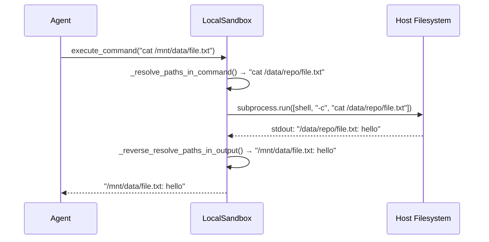
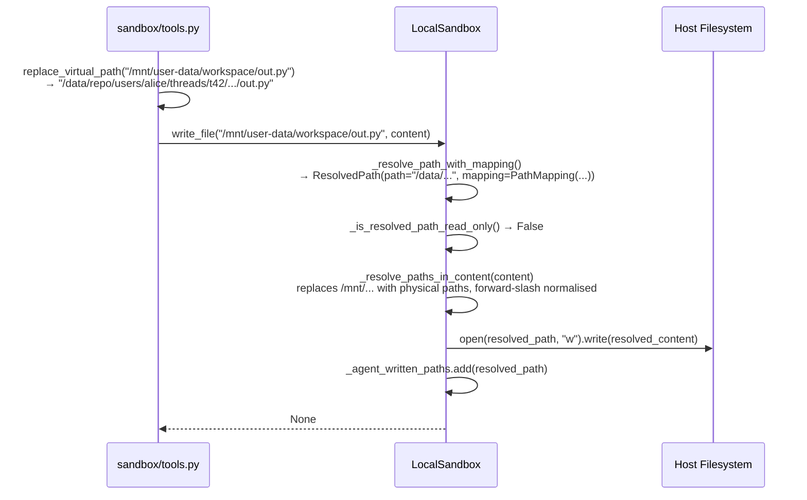
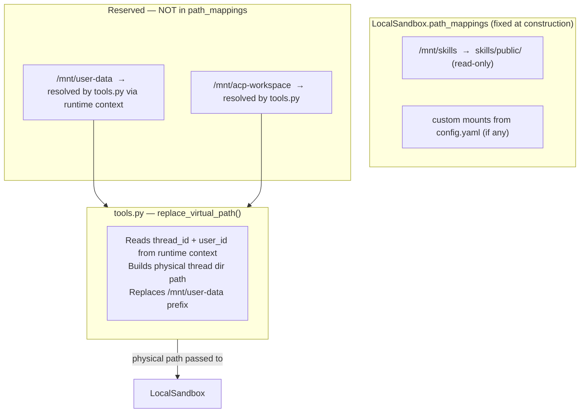

# Section 15b — Local Sandbox

## Purpose

Phase 2 covers the concrete filesystem-based sandbox implementation: the directory listing helper, the full `LocalSandbox` class, and its factory/lifecycle provider. Together they form the **virtual-path translation layer** — the mechanism that lets the agent believe it is writing to `/mnt/user-data/workspace/output.py` while the file actually lands in `backend/.deer-flow/users/alice/threads/t42/user-data/workspace/output.py`. The agent never sees a host path.

## Key Files

- `sandbox/local/list_dir.py` — bounded, symlink-safe directory traversal helper
- `sandbox/local/local_sandbox.py` — `LocalSandbox`: the concrete `Sandbox` implementation for local filesystem execution
- `sandbox/local/local_sandbox_provider.py` — `LocalSandboxProvider`: factory, singleton lifecycle, and mount config

---

## Important Concepts

### 1. `list_dir` — Bounded Directory Traversal

`list_dir(path, max_depth=2)` is a standalone function (not a method) that performs a recursive directory walk with three safety properties:

**Symlink escape prevention**

Every symlink is resolved with `item.resolve()` and checked against the sandbox root using `Path.relative_to(root_path)`. If the resolved target falls outside the root, the symlink is silently skipped:

```python
item_resolved = item.resolve()
if not _is_within_root(item_resolved):
    continue   # escape attempt dropped silently
```

**Symlink names are erased from the output**

When a symlink is valid (within root), the code appends the **resolved target path**, not the symlink path itself. A symlink `dir-link → nested/linked-dir` produces `nested/linked-dir/` in the result, not `dir-link/`. The test `test_list_dir_formats_internal_directory_symlink_like_directory` explicitly asserts this:

```python
assert "/mnt/data/nested/linked-dir/" in entries
assert "/mnt/data/dir-link" not in entries   # symlink name gone
```

From the agent's perspective, symlinks do not exist — only resolved paths appear.

**Depth semantics**

`_traverse(root_path, 1)` starts at depth 1. The recursion guard is `current_depth > max_depth`, and recursion is triggered only when `current_depth < max_depth`. With the default `max_depth=2`:

| Depth | What is visited |
|---|---|
| 1 | Direct children of root |
| 2 | Their children (grandchildren of root) |
| 3 | Would trigger `current_depth > max_depth` → return immediately |

**`should_ignore_name` coupling**

`list_dir` imports `should_ignore_name` from `sandbox/search.py`, which holds the centralised 37-pattern `IGNORE_PATTERNS` list (`.git`, `__pycache__`, `node_modules`, etc.). The same pattern list governs both directory listing and grep/glob search — a single definition, two consumers.

**Known limitation: no deduplication**

`result` is a plain `list`. If multiple symlinks point to the same resolved path, or if a symlink's resolved target is also reachable via normal traversal at a deeper depth, that path appears multiple times in the output. `sorted(result)` only sorts — it does not deduplicate. Example:

```
sandbox_root/
├── real_file.txt
├── link_a  →  real_file.txt
└── link_b  →  real_file.txt
```

Result: `["real_file.txt", "real_file.txt", "real_file.txt"]`.

---

### 2. The Virtual-Path Translation Sandwich

Every `LocalSandbox` operation follows the same three-step pattern:

```
1. Translate container path → physical path   (_resolve_path)
2. Execute the operation on the physical path
3. Translate physical paths → container paths in any output (_reverse_resolve_*)
```

The agent sends `/mnt/user-data/workspace/script.py`. The sandbox resolves it to `/home/user/.deer-flow/users/alice/threads/t42/user-data/workspace/script.py`, runs the operation, then scrubs any physical path strings from the output before returning. The agent never sees a host path.



---

### 3. PathMapping and Mount Resolution

`PathMapping` is a frozen dataclass linking one container path to one local path:

```python
@dataclass(frozen=True)
class PathMapping:
    container_path: str   # e.g. "/mnt/skills"
    local_path: str       # e.g. "/home/user/deer-flow/skills/public"
    read_only: bool = False
```

**Longest-prefix-first matching**

`_find_path_mapping` sorts mappings by `container_path` length descending before iterating. The most specific mount wins:

```
Mappings:
  /mnt/repo          → /data/repo       (read-only)
  /mnt/repo/writable → /data/repo/work  (read-write)

/mnt/repo/writable/out.txt  → matched by /mnt/repo/writable  (longer, wins)
/mnt/repo/README.md         → matched by /mnt/repo            (only match)
```

The same longest-prefix logic applies in reverse: `_reverse_resolve_path` sorts by `local_path` length descending, so the most-specific physical prefix wins when translating output back to container paths.

**Escape check on resolution**

After joining the local root with the relative path and calling `.resolve()`, `_resolve_path_with_mapping` verifies the result stays inside the mount:

```python
resolved_path.relative_to(local_root)   # raises ValueError on escape
```

`ValueError` → `PermissionError(EACCES)`. This single line blocks both `..` traversal and symlink-following escapes.

---

### 4. The Three-Layer Security Model

Read/write security is enforced independently at three points, each catching a different class of attack:

| Layer | Where | What it blocks |
|---|---|---|
| **Escape check** | `_resolve_path_with_mapping` | `..` traversal and symlink-following out of a mount root |
| **Dual read-only check** | `_is_resolved_path_read_only` | Symlink re-entry into a read-only mount; unmapped path access |
| **Output scrubbing** | `_reverse_resolve_paths_in_output` | Host path leakage through command stdout/stderr |

#### The dual read-only check in detail

```python
def _is_resolved_path_read_only(self, resolved: ResolvedPath) -> bool:
    return bool(resolved.mapping and resolved.mapping.read_only) or self._is_read_only_path(resolved.path)
```

Two independent checks, OR'd together:

- **Check 1** — `resolved.mapping.read_only`: the flag on the container mapping that *matched the original request*. If the agent's path routed through a read-only mount, the write is denied regardless of where the path physically resolved.
- **Check 2** — `_is_read_only_path(resolved.path)`: checks the *physical path* against all mappings' `local_path` prefixes using longest-prefix matching.

They are needed because they catch different threats:

**Scenario A — symlink bypass (only Check 1 saves it)**

```
Mappings:
  /mnt/repo          → /data/repo    (read-only)
  /mnt/repo/writable → /data/repo/w  (read-write)

Filesystem: /data/repo/link  →  symlink to /data/repo/w

Agent writes to: /mnt/repo/link/file.txt
  → routes through /mnt/repo mapping  (read-only)
  → symlink followed → resolves to /data/repo/w/file.txt

Check 1: resolved.mapping.read_only = True  → BLOCKED ✓
Check 2: _is_read_only_path("/data/repo/w/file.txt")
         → longest prefix: /data/repo/w (read-write) → False  ← would allow it
```

Check 2 alone would pass the write. Check 1 is the only thing stopping it.

**Scenario B — unmapped path (only Check 2 is active)**

```
Agent writes to: /tmp/scratch/file.txt  (no container mapping covers this)
  → resolved.mapping = None

Check 1: None and ... → False (short-circuits)
Check 2: _is_read_only_path("/tmp/scratch/file.txt") → no match → False
         → allowed
```

Check 1 contributes nothing here. Check 2 is the fallback.

**Scenario C — normal writable path (both agree)**

```
Agent writes to: /mnt/repo/writable/file.txt
  → routes through /mnt/repo/writable (read-write)

Check 1: resolved.mapping.read_only = False
Check 2: _is_read_only_path("/data/repo/w/file.txt") → False
Result: allowed ✓
```

---

### 5. Selective Reverse-Resolution: `_agent_written_paths`

`write_file` translates container paths in file content to physical paths before writing to disk. On `read_file`, those physical paths must be translated back to container paths. But not all files should get this treatment — user-uploaded files may contain legitimate references to host paths that should be returned as-is.

The solution: `_agent_written_paths: set[str]` tracks the resolved physical paths of every file the agent has written. `read_file` only reverse-resolves for paths in this set:

```python
if resolved_path in self._agent_written_paths:
    content = self._reverse_resolve_paths_in_output(content)
```

This means:

| File origin | `read_file` behaviour |
|---|---|
| Agent wrote it via `write_file` | Physical paths → container paths on read |
| User uploaded it | Returned verbatim |
| External tool output | Returned verbatim |

See PR #1935 discussion referenced in the code. The `write_then_read_roundtrip` test validates that container paths survive through a full write/read cycle.

---

### 6. The Two-Level Singleton Architecture

`LocalSandboxProvider` introduces two stacked singletons:

```
sandbox_provider.py      →  _default_sandbox_provider: SandboxProvider | None
local_sandbox_provider.py →  _singleton: LocalSandbox | None
```

On config reload or test teardown, both must be cleared. `reset_sandbox_provider()` in `sandbox_provider.py` calls `provider.reset()` before nulling out the provider — `LocalSandboxProvider.reset()` then clears `_singleton`. Without this chain, the new provider picks up the old `LocalSandbox` with stale path mappings.

The test `test_reset_sandbox_provider_clears_local_singleton` specifically guards this:

```python
reset_sandbox_provider()
assert lsp_module._singleton is None   # must be None, not the old instance
```

---

### 7. Thread Isolation Without Per-Thread Sandboxes

`LocalSandboxProvider.acquire(thread_id)` ignores `thread_id` and always returns the same singleton `LocalSandbox("local", ...)` with fixed path mappings. All threads share one sandbox instance.

So where does per-thread isolation come from? Two places:

- **`ThreadDataMiddleware`** creates the per-thread directories on disk: `backend/.deer-flow/users/{user_id}/threads/{thread_id}/user-data/{workspace,uploads,outputs}`.
- **`tools.py` virtual path translation** (`replace_virtual_path()`) resolves `/mnt/user-data/...` to the current thread's physical directory using runtime context — not via `LocalSandbox.path_mappings`.

This is why `/mnt/user-data` is listed in `_RESERVED_CONTAINER_PREFIXES` and never added to `LocalSandbox.path_mappings`: the local sandbox doesn't need a mapping for it. The translation happens one layer up, in the tools layer.

Contrast with `AioSandboxProvider`: it creates a Docker container per run and volume-mounts the thread directory into the container at `/mnt/user-data`. There, the mapping is real and the container enforces isolation at the OS level.

The `uses_thread_data_mounts` flag encodes which strategy a provider uses:

| Flag | Provider | Upload strategy |
|---|---|---|
| `True` | `LocalSandboxProvider` | Write directly to thread dir on host filesystem |
| `False` | `AioSandboxProvider` | Push through sandbox write API into container |

---

### 8. Shell Detection and Windows Support

`LocalSandbox._get_shell()` auto-detects the best available shell:

```
Unix:    /bin/zsh → /bin/bash → /bin/sh → sh (PATH)
Windows: pwsh → pwsh.exe → powershell → powershell.exe → cmd.exe
```

The subprocess is always called with `shell=False` — the shell is explicitly listed as the first argument. This avoids double-interpretation: the command string is already resolved and should not be re-parsed by the OS shell layer.

For Git Bash/MSYS on Windows, `MSYS_NO_PATHCONV=1` and `MSYS2_ARG_CONV_EXCL=*` are injected into the subprocess environment. Without these, MSYS silently converts Unix-style paths (e.g., `/mnt/data`) back into Windows form before the subprocess sees them, corrupting the resolved physical paths.

---

## Execution Flow

Full path of a `write_file` call from agent tool invocation to disk:



---

## Architecture Diagrams

### Mount resolution — what is and isn't in `LocalSandbox.path_mappings`



---

## My Insights

**The virtual-path sandwich is a clean abstraction boundary.** `LocalSandbox` works entirely in physical paths internally; the container-path translation is a thin in/out layer at each public method. This makes the implementation easy to test (no runtime context needed) and keeps the security logic (escape checks, read-only enforcement) independent of the virtual/physical mapping.

**`list_dir` erasing symlink names is a subtle but correct choice.** The agent should reason about files as stable, unambiguous locations. Exposing symlink names would require the agent to understand that `dir-link/file.txt` and `nested/linked-dir/file.txt` are the same thing — an unnecessary and confusing detail. Resolved paths only means the agent's mental model stays consistent with what the sandbox's security checks enforce.

**The dual read-only check encodes a conservative security principle:** *the container access path governs permissions, not the physical resolution target.* This is essentially the same principle as discretionary access control: you check credentials at the door, not at the destination. A symlink that routes through a read-only door is denied even if it leads somewhere writable.

**Architectural decision discussed: should symlink writes be prohibited entirely?**

The current model *allows* writes through symlinks when the symlink target is within the same mount and the path was routed through a writable container mapping. The argument for prohibiting all symlink writes:

- Removes the entire `_is_resolved_path_read_only` dual-check complexity
- Consistent with `list_dir`'s philosophy of erasing symlinks from the agent's view
- Blocks confused-deputy attacks where external content (downloaded zips, cloned repos) plants malicious symlinks

The argument against:
- User-created symlinks (e.g., `ln -s project-2026 current`) would silently break agent writes
- Build tooling (pnpm, virtualenv) relies on symlink structures

**Recommended middle path:** prohibit writes where a *directory component* of the path is a symlink (check `naive_path != naive_path.resolve()` after the local root join, before the final filename), while allowing new file creation in real directories. Scope this check to writes only, not reads.

**The two-level singleton is a fragile pattern that the team recognised and tested.** Having `_singleton` at module scope means it outlives any specific `LocalSandboxProvider` instance. The explicit test `test_reset_sandbox_provider_clears_local_singleton` exists because this burned the team — a config reload replaced the provider but left the old `LocalSandbox` (with stale path mappings) alive. The fix was `provider.reset()` in `reset_sandbox_provider()`. The lesson: module-level singletons always need an explicit invalidation contract.

**`uses_thread_data_mounts` is a capability advertisement, not a security flag.** It exists because the uploads router needs to know *where* to put files — either directly on the host filesystem (local sandbox: yes, shared with the sandbox) or through the sandbox API (Docker: the container has its own filesystem). This is an example of a provider advertising a capability to the application layer without the application needing to know the provider's type.

---

## Open Questions

- `acquire(thread_id)` silently ignores `thread_id`. Is there a plan to support per-thread `LocalSandbox` instances (each with their own `_agent_written_paths` and path mappings)? The current model means `_agent_written_paths` is shared across all threads — could thread A's written paths cause thread B to get unexpected reverse-resolution on read?
- The 600-second subprocess timeout in `execute_command` is hardcoded. Is there a `sandbox_config` field that controls it, or is it intentionally fixed?
- `_resolve_paths_in_content` uses boundary `[^\w./-]` while `_resolve_paths_in_command` uses `[\s\"';&|<>()]`. Are there edge cases — e.g., a container path adjacent to `(` in Python source — where the command boundary is too narrow and the path goes unreplaced?
- If two threads call `list_dir` on the same path simultaneously and one thread's agent has just created a symlink, is there a TOCTOU window between the `is_symlink()` check and the `_is_within_root(item_resolved)` check? The symlink target could be replaced between the two calls.

---

## Links to Related Sections

- [[15a-sandbox-primitives]] — Phase 1: the abstract `Sandbox` interface this file implements, and the exception types `LocalSandbox` raises
- [[09b-before-agent-middlewares]] — `SandboxMiddleware` calls `acquire()` and `release()` on `LocalSandboxProvider`
- [[12a-tools-primitives-registry]] — `tools.py` performs the `replace_virtual_path()` step that precedes every `LocalSandbox` method call
- [[11b-subagents-builtins-executor]] — subagents share the same singleton `LocalSandbox`; `file_operation_lock.py` serialises their concurrent writes
