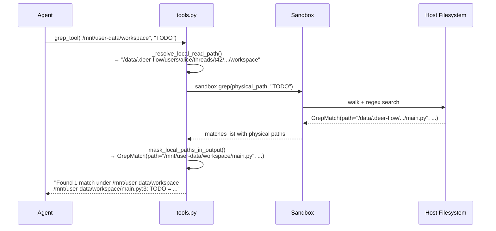
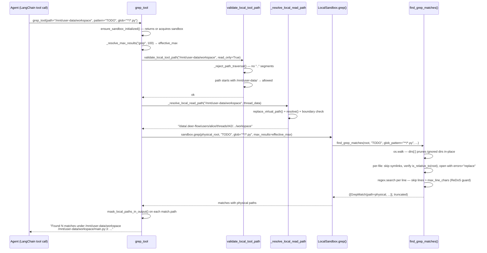
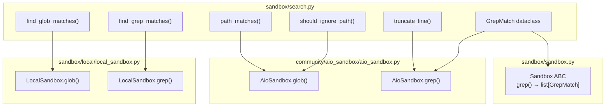
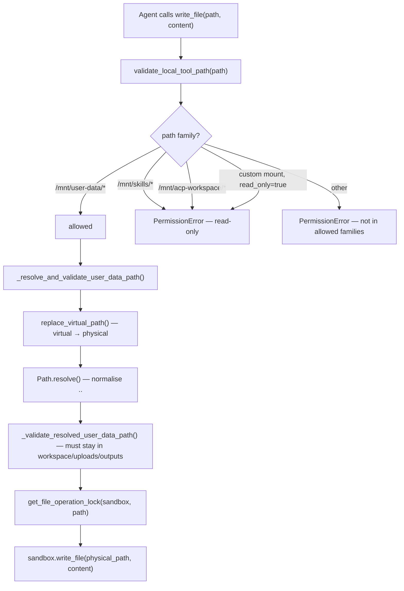

# Section 15c — Sandbox Search & Tools Layer

## Purpose

Phase 3 covers the two files that sit between the agent and the sandbox implementation:
`search.py` is a self-contained filesystem search library shared by both the local and remote sandbox;
`tools.py` is the full adapter layer that defines the seven agent-facing LangGraph tools, owns the
virtual↔physical path translation system, enforces security policies, and sanitises every response
before it reaches the agent.

Together these files answer a single question: _how does the agent navigate and manipulate a
filesystem it can never directly observe?_

## Key Files

- `sandbox/search.py` — filesystem search primitives: `find_glob_matches`, `find_grep_matches`, and
  the shared utilities (`GrepMatch`, `path_matches`, `should_ignore_path`, `truncate_line`) reused
  by the AIO sandbox
- `sandbox/tools.py` — seven LangGraph tools (`bash`, `ls`, `glob`, `grep`, `read_file`,
  `write_file`, `str_replace`), the virtual path translation system, bash command security
  validation, and output sanitisation

---

## Important Concepts

### 1. `search.py` — a shared search library, not just a local-sandbox detail

`search.py` has two distinct consumer groups:

**Local sandbox** (`local_sandbox.py`) uses the high-level traversal functions:

```python
matches, truncated = find_glob_matches(resolved_path, pattern, ...)
matches, truncated = find_grep_matches(resolved_path, pattern, ...)
```

**AIO sandbox** (`community/aio_sandbox/aio_sandbox.py`) implements its own traversal (over a
remote HTTP client) but reuses the lower-level utilities:

```python
from deerflow.sandbox.search import GrepMatch, path_matches, should_ignore_path, truncate_line
```

The boundary is clean: filesystem-agnostic utilities live in `search.py`; filesystem traversal
belongs to each sandbox's own implementation.

**`IGNORE_PATTERNS` is cross-ecosystem by design.** The 37-pattern list covers Python (`.venv`,
`__pycache__`), JavaScript (`node_modules`, `.next`), Java (`target`), VCS (`.git`, `.svn`, `.hg`),
IDE artifacts (`.idea`, `.vscode`), and OS detritus (`.DS_Store`, `*.log`). A single list governs
`find_glob_matches`, `find_grep_matches`, and `list_dir` (which imports `should_ignore_name`
from `search.py`). One definition, three consumers.

---

### 2. Right-anchoring in `path_matches` and the `**/` fallback

```python
def path_matches(pattern: str, rel_path: str) -> bool:
    path = PurePosixPath(rel_path)
    if path.match(pattern):
        return True
    if pattern.startswith("**/"):
        return path.match(pattern[3:])
    return False
```

**Why right-anchoring?** Without it, a pattern like `"*.py"` would mean "a `.py` file at the root
only." With right-anchoring, `PurePosixPath.match()` treats the pattern as a suffix constraint on
components: `"*.py"` matches `"bar.py"`, `"src/bar.py"`, and `"a/b/c/bar.py"` equally. The agent
can write `"*.py"` and get every Python file at any depth, without knowing the directory structure.

**The `**/`problem.**`"**/\*.py"` is the canonical recursive-glob form: two pattern components
(`**`and`_.py`) matched right-to-left. For a nested file `"src/bar.py"`, `_.py`matches`bar.py`and`**`absorbs`src`— works. For a top-level file`"bar.py"`, `\*.py`matches`bar.py`but`**`
has no component left to absorb — native match fails.

**The fix.** If the native match fails and the pattern starts with `"**/"`', strip the prefix and
retry `path.match("*.py")`. Right-anchoring handles the top-level case:

| Path           | `"**/*.py"` native | `"*.py"` fallback | result             |
| -------------- | ------------------ | ----------------- | ------------------ |
| `"src/bar.py"` | ✓                  | —                 | match              |
| `"bar.py"`     | ✗                  | ✓                 | match via fallback |
| `"bar.js"`     | ✗                  | ✗                 | no match           |

**`should_ignore_path` checks every segment.** Unlike `should_ignore_name` (single component),
`should_ignore_path` splits on `/` and rejects the entire path if _any_ segment matches the ignore
list. This means `"foo/node_modules/bar.js"` is rejected at the `node_modules` segment. This is
what lets `AioSandbox.glob()` correctly filter remote file listings even when the remote backend
returns deeply nested ignored paths.

---

### 3. The two-layer path traversal guard in `find_grep_matches`

```python
if candidate_path.is_symlink():
    continue
file_path = candidate_path.resolve()
if not file_path.is_relative_to(root):
    continue
```

Two independent guards, two different attack surfaces:

**Layer 1 — symlink skip.** `os.walk` includes symlinked _files_ in its `files` list. A symlink
inside the workspace pointing to `/etc/passwd` would, without this check, be opened and its content
returned to the agent. The skip is unconditional — even internal symlinks are excluded. Classifying
"safe" versus "escape" symlinks at runtime is fragile and unnecessary.

**Layer 2 — resolved-path boundary check.** After the symlink skip, the path is guaranteed
non-symlink. However, `resolve()` normalises `..` components, and bind mounts or overlay filesystems
can make a directory inside the workspace physically resolve to a path outside the sandbox root.
`is_relative_to(root)` is the catch-all invariant: _regardless of how the file got into the
`os.walk` listing, if its resolved path escapes root, it is never opened._

The test `test_find_grep_matches_skips_symlink_outside_root` validates layer 1 with a concrete
symlink. Layer 2 exists as belt-and-suspenders for cases no test has yet imagined.

**ReDoS guard.** Lines exceeding `line_summary_length × 10` characters are skipped before the
regex is applied. Minified JS/CSS files have no newlines — a single "line" can be hundreds of KB.
A pathological regex on such a line causes catastrophic backtracking. The 10× multiplier is the
heuristic: allow up to 2000 chars before declaring a line untestable.

---

### 4. Virtual paths are fictional in the local sandbox

The agent always uses virtual paths: `/mnt/user-data/workspace`, `/mnt/user-data/uploads`,
`/mnt/user-data/outputs`, `/mnt/skills`, `/mnt/acp-workspace`. What those paths mean depends
entirely on which sandbox mode is active.

**AIO sandbox (Docker).** The host's per-thread directory is bind-mounted into the container at
exactly the virtual path. `/mnt/user-data/workspace` is a _real_ filesystem path inside the
container. The OS handles the translation. `tools.py` needs no application-level rewriting — the
`is_local_sandbox()` branches are skipped entirely.

**Local sandbox.** `/mnt/user-data/workspace` **does not exist on the host filesystem.** It is a
pure fiction maintained by `tools.py`. Every tool call translates inbound:

```
/mnt/user-data/workspace/script.py
  → backend/.deer-flow/users/alice/threads/t42/user-data/workspace/script.py
```

And translates outbound — scanning every character of command output, error messages, and file
contents returned to the agent for any occurrence of the physical path, replacing it back with the
virtual form.

This is why the same agent prompt and skill instructions work in both modes: the virtual path
namespace was deliberately designed to match Docker container mount points. Switching from local to
Docker mode requires zero changes to the agent's behaviour.

---

### 5. Bidirectional path translation in `tools.py`

Translation happens at exactly two points in the tool execution lifecycle:

```
INBOUND  (before execution):   virtual path → physical path
OUTBOUND (after execution):    physical path → virtual path
```



**Longest-prefix-first matching** governs both directions. `replace_virtual_path()` sorts the
virtual-to-actual mapping table by key length descending before iterating. This prevents
`/mnt/user-data` from matching before `/mnt/user-data/workspace`, which would produce a broken
concatenated path. `mask_local_paths_in_output()` applies the same longest-prefix logic in reverse.

**`_path_variants()` handles Windows separators.** The output masking generates three forms of each
base path (`/`, `\`, mixed) and applies all three patterns. This ensures physical paths leaked
through error messages are masked even on Windows hosts where `subprocess` might produce backslash
paths.

---

### 6. How the agent knows to use `/mnt/*` paths

Two layers teach the agent the virtual path convention:

**Tool docstrings** (parsed directly into the JSON schema the LLM receives):

```python
@tool("bash", parse_docstring=True)
def bash_tool(...):
    """Execute a bash command in a Linux environment.
    - Prefer a thread-local virtual environment in `/mnt/user-data/workspace/.venv`.
    command: The bash command to execute. Always use absolute paths for files and directories.
    """
```

`/mnt/user-data/workspace` appears as a concrete example in the schema for every conversation turn
in which the model considers using `bash`. LLMs treat examples in tool descriptions as strong
signals for what to produce.

**The lead agent system prompt** (`agents/lead_agent/prompt.py`) teaches the agent the workspace
contract at a higher level — what it's operating in and why. The `DynamicContextMiddleware` (pos 9)
injects a `<reminder>` block before every model call that can reinforce path conventions per-turn.

Neither layer alone is sufficient. Tool docstring examples without a system prompt leave the agent
without conceptual grounding for _why_ these paths exist. A system prompt without docstring examples
requires the agent to recall path conventions from memory rather than seeing them reinforced in the
schema on every tool call.

---

### 7. Bash command security is best-effort, not a boundary

`validate_local_bash_command_paths()` applies a multi-pass check to every bash command in local
sandbox mode:

1. Block `file://` URL bypass (can exfiltrate local files without an absolute path)
2. Shell-tokenise with `shlex` and reject `..` segments, unsafe `cd`/`pushd` targets, and
   `$()` substitution containing cwd-change commands
3. Regex-scan all absolute paths and check against an allowlist (virtual paths, skills, ACP
   workspace, common system path prefixes like `/bin/`, `/dev/`)
4. Collect all violations and report them together (not fail-fast)

**The explicit disclaimer is important.** The function docstring says:

> _"This validation is only a best-effort guard for the `sandbox.allow_host_bash: true` opt-in.
> It is not a secure sandbox boundary."_

The local sandbox runs commands directly on the host OS, in the same process account as DeerFlow.
No application-level path validation can be complete against a sufficiently motivated agent — shell
interpretation is Turing-complete, and `shlex` parsing is not `bash` parsing. The Docker AIO sandbox
is the actual isolation boundary. Local mode with `allow_host_bash: true` is an explicit trust
decision, not a defended perimeter.

The fallback in `_split_shell_tokens` makes this concrete:

```python
except ValueError:
    # The shell will reject malformed quoting later; keep validation
    # best-effort instead of turning syntax errors into security messages.
    return command.split()
```

A crafted command with unterminated quotes might bypass `shlex` tokenisation and fall through to
`command.split()` — which skips all token-level checks — while still executing successfully in bash.

---

### 8. Truncation strategies differ by tool

Each tool truncates its output differently, and the reason is the shape of the content:

| Tool        | Strategy                                | Why                                                                                                                      |
| ----------- | --------------------------------------- | ------------------------------------------------------------------------------------------------------------------------ |
| `bash`      | **Middle-truncate** (50/50 head + tail) | `stderr`/`stdout` ordering is non-deterministic; errors can appear at either end of the buffer                           |
| `read_file` | **Head-truncate**                       | Source code is read top-to-bottom; imports, class definitions, and function signatures at the top carry the most context |
| `ls`        | **Head-truncate**                       | Directory listings are read top-down; the most relevant structure is at the root                                         |

All three truncation functions compute the marker length first to guarantee the total output
(content + marker) never exceeds `max_chars`:

```python
# bash middle-truncate — tight upper bound on marker size
marker_max_len = len(f"\n... [middle truncated: {total_len} chars skipped] ...\n")
kept = max(0, max_chars - marker_max_len)
```

`max_chars=0` is the off switch: pass zero to disable truncation and return the full output.

---

### 9. Lazy sandbox acquisition — `ensure_sandbox_initialized`

The old pattern (`sandbox_from_runtime`) required `SandboxMiddleware` to have already acquired a
sandbox before any tool call. This fails in reduced middleware stacks — for example, a subagent
invoked without the full `build_lead_runtime_middlewares()` chain.

`ensure_sandbox_initialized()` acquires lazily:

```python
# 1. Check runtime state for an existing sandbox_id
sandbox_state = runtime.state.get("sandbox")
if sandbox_state is not None:
    sandbox = get_sandbox_provider().get(sandbox_state["sandbox_id"])
    if sandbox is not None:
        return sandbox
    # sandbox was released — fall through

# 2. Acquire a new one from the provider
sandbox_id = provider.acquire(thread_id)
runtime.state["sandbox"] = {"sandbox_id": sandbox_id}  # persists across tool calls in this turn
return provider.get(sandbox_id)
```

Writing the acquired `sandbox_id` back into `runtime.state` makes subsequent tool calls in the same
turn find the existing sandbox without re-acquiring. `sandbox_from_runtime` remains as a deprecated
alias for callers that pre-date this pattern.

---

### 10. Two-level `max_results` cap

`_resolve_max_results()` enforces independent limits from two sources:

```python
effective = min(
    _clamp_max_results(requested, default=..., upper_bound=...),  # agent's request
    _clamp_max_results(configured, default=..., upper_bound=...),  # operator's config
)
```

The agent can request _fewer_ results than the config allows, but cannot _exceed_ the operator cap.
Default caps: glob 200 (max 1000), grep 100 (max 500). This is a "operator overrides agent" policy
— the config.yaml value is the hard ceiling, regardless of what the agent passes.

---

## Execution Flow

### Full lifecycle of a `grep` tool call in local sandbox mode



---

## Architecture Diagrams

### `search.py` consumers — who uses what



### `tools.py` security layers for a write operation



---

## My Insights

**`search.py` is a utility library, not a module.** It has no class, no constructor, no state. It
is a collection of pure functions that can be imported and composed independently of any sandbox
lifecycle. The AIO sandbox's use of just the lower-level helpers (`path_matches`,
`should_ignore_path`) without using the traversal functions is proof of this design: the module has
a clear composition seam in the middle.

**Virtual paths are a stable API contract, not a filesystem fact.** In local mode, `/mnt/user-data`
does not exist anywhere on the host. The "container path" nomenclature (used in config fields like
`sandbox.mounts[].container_path` and `skills.container_path`) names the agent-visible namespace,
not a real mount point. The Docker mode happens to make this namespace real by coincidence of
bind-mount location. Treating container path as "path inside Docker" is correct for AIO mode but
misleading for local mode — it is more accurately "path the agent sees."

**Bash validation exists to catch honest mistakes, not to contain malicious agents.** The explicit
disclaimer in the docstring is notable design documentation: the team made a deliberate choice to
leave the door open for `allow_host_bash: true` while being transparent that it is not a security
boundary. This is the correct tradeoff — a false security claim is worse than an honest opt-in.
Users who need actual isolation should use the Docker AIO sandbox.

**Truncation strategy encodes assumptions about content shape.** Middle-truncating `bash` output,
head-truncating file content — these are not arbitrary choices. They reflect a model of where useful
information lives in each type of output. Middle-truncation acknowledges that `stderr` and `stdout`
are merged and interleaved non-deterministically; head-truncation acknowledges that source code
follows an inverted pyramid (most important context at the top). These design decisions are normally
buried in code comments or lost to time; the fact that each truncation function has a docstring
explaining the rationale makes them discoverable.

**`ensure_sandbox_initialized` resolves an architectural tension.** The middleware chain was the
original "sandbox lifecycle owner" — `SandboxMiddleware` acquired before the agent, released after.
But subagents run in their own context with a potentially reduced middleware stack. Lazy acquisition
in `ensure_sandbox_initialized` is the reconciliation: tools can always get a sandbox regardless of
which middleware ran, and the first acquire is idempotent with subsequent calls in the same turn.

**The function-attribute caching pattern (`fn._cached`) is a Python-specific pattern worth knowing.**
Used in `_get_skills_container_path`, `_get_skills_host_path`, `_get_custom_mounts`. It avoids a
separate module-level `_cached_value: X | None = None` variable by hanging the cached result
directly on the function object. The "success-only caching" variant (failures return without caching
so the next call can retry) is a good pattern for any config-reading lazy loader where transient
unavailability should not permanently disable the feature.

---

## Open Questions

- `_split_shell_tokens` falls back to `command.split()` on `ValueError` from `shlex`. A crafted
  command with unterminated quotes would bypass all token-level security checks (`..'` detection,
  `cd` target validation) while still executing in bash. Is this a known accepted risk, or is
  there a deeper reason this can't produce a false-negative?

- `_get_mcp_allowed_paths()` grants bash access to any path that a `server-filesystem` MCP server
  is configured to allow. Could a misconfigured MCP server inadvertently expose `/home` or `/etc`
  to the agent's bash tool?

- `ensure_sandbox_initialized` writes `sandbox_id` into `runtime.state["sandbox"]`. If the sandbox
  is subsequently released (e.g., by `SandboxMiddleware.after_agent`) and then a later tool call in
  the same turn re-acquires a new sandbox, do the two `sandbox_id` values diverge? Could a tool
  call see a released sandbox ID in state while `ensure_sandbox_initialized` creates a new one?

- The `mask_local_paths_in_output` function handles user-data paths, skills paths, and ACP workspace
  paths, but the comment notes "Custom mount host paths are masked by
  `LocalSandbox._reverse_resolve_paths_in_output()`". Does this mean there's a gap: if a custom
  mount path appears in error output from a non-bash tool (e.g., a `FileNotFoundError` raised and
  caught in `read_file`), it would be sanitised by `_sanitize_error` calling
  `mask_local_paths_in_output`, which does _not_ cover custom mounts — potentially leaking the host
  path to the agent?

---

## Links to Related Sections

- [[15a-sandbox-primitives]] — `GrepMatch` originates in `search.py` but is declared as part of the
  `Sandbox` ABC's return type; the lock from `file_operation_lock.py` is called inside `tools.py`
  for `write_file` and `str_replace`
- [[15b-local-sandbox]] — `LocalSandbox.glob()` and `.grep()` delegate directly to
  `find_glob_matches` / `find_grep_matches` from `search.py`; the path translation described here
  in `tools.py` wraps every `LocalSandbox` method call
- [[09b-before-agent-middlewares]] — `SandboxMiddleware` (pos 3) acquires the sandbox before the
  agent runs; `ensure_sandbox_initialized` is the lazy fallback for when it hasn't
- [[09d-tool-call-wrappers]] — `SandboxAuditMiddleware` (pos 7) wraps each tool call from `tools.py`
  for security logging before execution
- [[11b-subagents-builtins-executor]] — subagents share the same sandbox instance; `tools.py`'s
  `get_file_operation_lock` serialises their concurrent writes
- [[08a-lead-agent]] — the system prompt assembly in `prompt.py` and the tool schema docstrings in
  `tools.py` together teach the agent the `/mnt/*` virtual path convention
