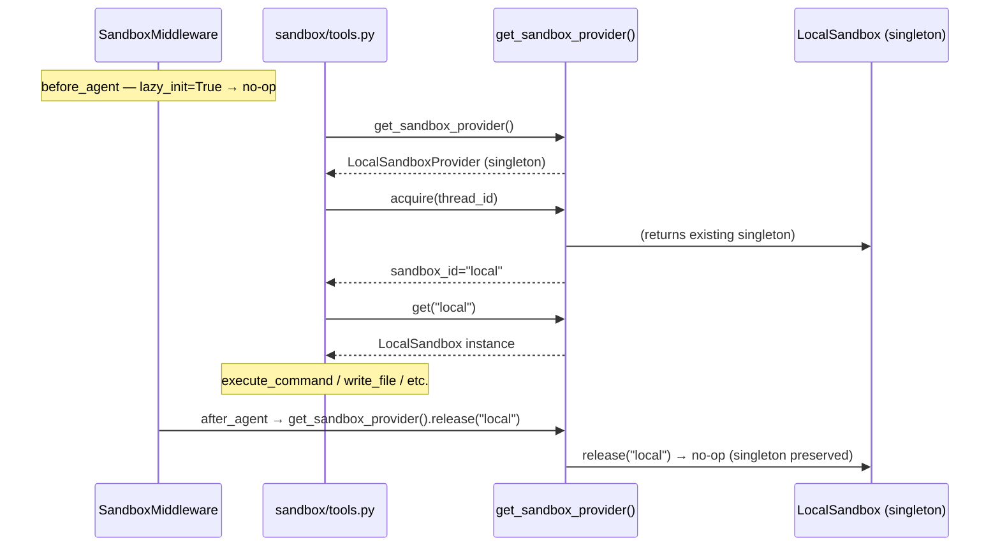
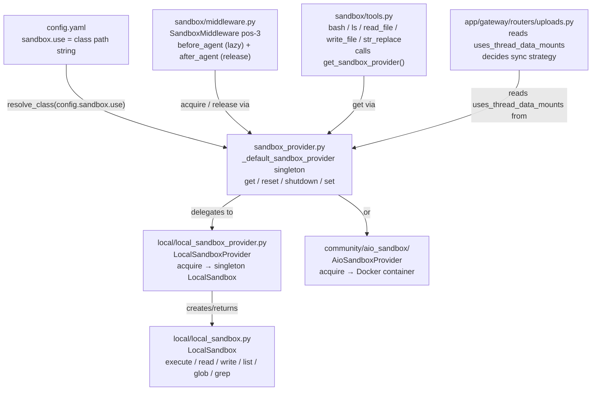

# Section 15d — Sandbox Provider & Middleware

## Purpose

Phase 4 is the **assembly layer**: two files that bind every previous sandbox concept into the running
system. `sandbox_provider.py` manages a process-level singleton that makes a specific implementation
(local or AIO) available everywhere without callers knowing which one they have.
`sandbox/middleware.py` wires that provider into the LangGraph middleware chain so each agent run
acquires a sandbox before its first tool call and releases it when it finishes.

Together they answer: _how does a sandbox get created for a run, how does it persist across turns
within that run, and how is it cleaned up?_

## Key Files

- `sandbox/sandbox_provider.py` — `SandboxProvider` ABC and the four management functions
  (`get_sandbox_provider`, `reset_sandbox_provider`, `shutdown_sandbox_provider`, `set_sandbox_provider`)
- `sandbox/middleware.py` — `SandboxMiddleware` (position 3 in the agent middleware chain): acquires
  sandbox in `before_agent` / lazy on first tool call; releases in `after_agent`

---

## Important Concepts

### 1. `SandboxProvider` — the three-method lifecycle contract

The ABC defines three required operations:

| Method                | Signature            | Notes                                                                                           |
| --------------------- | -------------------- | ----------------------------------------------------------------------------------------------- |
| `acquire(thread_id?)` | `→ str` (sandbox_id) | Create or retrieve a sandbox for this run; thread_id used by some providers for directory setup |
| `get(sandbox_id)`     | `→ Sandbox \| None`  | Look up a live sandbox by its ID                                                                |
| `release(sandbox_id)` | `→ None`             | Return or destroy the sandbox after a run                                                       |

`acquire` returns an ID (a string handle), not the `Sandbox` object itself. The ID goes into
`ThreadState.sandbox.sandbox_id`, flows through LangGraph's state machine across turns, and is used
to look up the live object later via `get()`. The separation is intentional: IDs are serialisable;
`Sandbox` objects are not.

`LocalSandboxProvider` returns `"local"` from every `acquire()` call — the ID is a fixed constant
because it always returns the same singleton sandbox regardless of thread.

`AioSandboxProvider` generates a real UUID per acquisition and maps it to a Docker container. The
ID is meaningful there.

---

### 2. `reset()` — the fourth method, not in the ABC

The ABC also declares a no-op `reset()`:

```python
def reset(self) -> None:
    """Clear cached state that survives provider instance replacement."""
    pass
```

This is **not the same as `release()`**. It exists to break a layered singleton problem:
`LocalSandboxProvider` keeps its own module-level singleton (`_singleton: LocalSandbox | None`).
When the global provider is replaced (e.g., after a config change), that inner singleton must also
be cleared — otherwise the new provider inherits the old `LocalSandbox` with stale path mappings.

```
sandbox_provider.py  →  _default_sandbox_provider: SandboxProvider | None
local_sandbox_provider.py  →  _singleton: LocalSandbox | None
```

`reset_sandbox_provider()` calls `provider.reset()` **before** nulling the global reference:

```python
_default_sandbox_provider.reset()   # must happen first
_default_sandbox_provider = None    # then null
```

If the order were reversed, the reference would be lost and `reset()` could never reach the inner
singleton. The test `test_reset_sandbox_provider_clears_local_singleton` is a direct regression
guard for this exact sequence.

---

### 3. The three cleanup functions — `release`, `reset`, `shutdown`

Three distinct operations with three distinct scopes:

| Function                      | Scope                       | When to call                                                |
| ----------------------------- | --------------------------- | ----------------------------------------------------------- |
| `release(sandbox_id)`         | One sandbox instance        | End of a run (called by `SandboxMiddleware.after_agent`)    |
| `reset_sandbox_provider()`    | Provider-level cached state | After a config change or in tests; orphans active sandboxes |
| `shutdown_sandbox_provider()` | All managed resources       | Application shutdown; calls `provider.shutdown()` first     |

`shutdown()` is deliberately not part of the ABC — it is duck-typed via `hasattr`:

```python
if hasattr(_default_sandbox_provider, "shutdown"):
    _default_sandbox_provider.shutdown()
```

`LocalSandboxProvider` does not implement `shutdown()` because it has nothing to destroy —
local filesystem directories are intentionally durable. `AioSandboxProvider` implements it to
terminate Docker containers. The asymmetry is correct: only providers managing external processes
need a full teardown hook.

---

### 4. The reflection pattern — `config.sandbox.use`

`get_sandbox_provider()` does not import either `LocalSandboxProvider` or `AioSandboxProvider`
directly. It reads a **class path string** from config and resolves it at runtime:

```python
config = get_app_config()
cls = resolve_class(config.sandbox.use, SandboxProvider)
_default_sandbox_provider = cls(**kwargs)
```

`config.sandbox.use` is a string like `"deerflow.sandbox.local:LocalSandboxProvider"`.
`resolve_class()` splits on `:`, imports the module, and validates the class against the
`SandboxProvider` base class before returning it.

This is the same reflection pattern used throughout DeerFlow for pluggable implementations
(models, tools, skills). The result: adding a new sandbox backend requires only a new class and a
config line — no changes to the provider management code.

The docker mode detection script (`scripts/docker.sh`) reads `config.sandbox.use` with a regex
to decide which Docker Compose services to start:

```
deerflow.sandbox.local:LocalSandboxProvider  →  local mode
deerflow.community.aio_sandbox:AioSandboxProvider  →  aio or provisioner mode
```

---

### 5. `uses_thread_data_mounts` — a capability advertisement

The `SandboxProvider` ABC declares:

```python
uses_thread_data_mounts: bool = False
```

`LocalSandboxProvider` overrides this to `True` as a class-level constant.
`AioSandboxProvider` makes it a property computed at runtime:

```python
@property
def uses_thread_data_mounts(self) -> bool:
    return isinstance(self._backend, LocalContainerBackend)
```

The **sole consumer** is the uploads router (`app/gateway/routers/uploads.py`):

```python
sync_to_sandbox = not _uses_thread_data_mounts(sandbox_provider)
if sync_to_sandbox:
    sandbox_id = sandbox_provider.acquire(thread_id)
    sandbox = sandbox_provider.get(sandbox_id)
    # push file through sandbox API
```

When `True`, the host thread-data directory is bind-mounted into the sandbox. A file written to
`.deer-flow/users/{user_id}/threads/{thread_id}/user-data/uploads/` on the host is immediately
visible inside the sandbox at `/mnt/user-data/uploads/`. No API call needed.

When `False` (remote AIO backend), the sandbox runs on a different machine with no shared
filesystem. The upload router acquires a sandbox handle and pushes the file explicitly through the
sandbox's write API.

> **Clarification from initial study:** the first annotation incorrectly named `ThreadDataMiddleware`
> as the consumer. `ThreadDataMiddleware` creates the per-thread directories on disk but never
> reads `uses_thread_data_mounts`. The flag is specific to file upload routing.

| Provider                              | `uses_thread_data_mounts` | Upload behaviour                                |
| ------------------------------------- | ------------------------- | ----------------------------------------------- |
| `LocalSandboxProvider`                | `True` (class constant)   | Write to host path; sandbox sees it immediately |
| `AioSandboxProvider` + local Docker   | `True` (property)         | Same — bind-mounted                             |
| `AioSandboxProvider` + remote backend | `False` (property)        | Acquire sandbox, push file explicitly           |

---

### 6. `SandboxMiddleware` — lazy acquisition by default

`SandboxMiddleware` sits at **position 3** in the 18-middleware chain. It has two hooks:
`before_agent` (acquire) and `after_agent` (release). It is the only middleware in Stage 1
with both hooks — all others have one or the other.

**Lazy init (default)**

With `lazy_init=True`, `before_agent` is a complete no-op:

```python
if self._lazy_init:
    return super().before_agent(state, runtime)  # does nothing
```

The sandbox is not acquired until the first actual tool call. This avoids spinning up a Docker
container (or allocating any resource) for runs that complete entirely in model reasoning without
ever hitting a tool. If the model answers in one turn without using bash or file tools, no sandbox
is ever created.

**Eager init (legacy)**

With `lazy_init=False`, `before_agent` checks whether a sandbox already exists in state and
acquires one if not. This was the original behaviour — lazy init was introduced as a performance
optimisation.

**The sandbox persists across turns**

The sandbox is stored in `ThreadState.sandbox.sandbox_id` — a field in the LangGraph state that
survives between graph invocations. A multi-turn conversation with the same `thread_id` reuses the
same sandbox. File artifacts the agent wrote in turn 1 are still there in turn 5.

`release()` is called in `after_agent`, not between turns. For `LocalSandboxProvider`, `release()`
is a deliberate no-op anyway (the singleton persists for the process lifetime). For
`AioSandboxProvider`, the container is destroyed at run end.

---

### 7. The two sandbox acquisition paths in `after_agent`

`after_agent` has two distinct code paths for releasing a sandbox:

**Path 1 — state-based (normal case)**

```python
sandbox = state.get("sandbox")
if sandbox is not None:
    sandbox_id = sandbox["sandbox_id"]
    get_sandbox_provider().release(sandbox_id)
    return None
```

The sandbox was acquired by this middleware (or on a prior turn), its ID is in the state, and
release is straightforward.

**Path 2 — context-based (provisioner/Kubernetes mode)**

```python
if (runtime.context or {}).get("sandbox_id") is not None:
    sandbox_id = runtime.context.get("sandbox_id")
    get_sandbox_provider().release(sandbox_id)
    return None
```

In provisioner mode (Kubernetes deployment), a sandbox container is pre-allocated by the
provisioner service before the run even starts. Its ID is injected into `runtime.context` rather
than flowing through `SandboxMiddleware.before_agent`. This path cleans it up at run end without
the normal state-based acquisition having occurred.

This is the only place in the middleware that reads `runtime.context` for a sandbox ID. It acts as
a safety catch for an externally-managed lifecycle that bypasses the standard acquire path.

---

## Execution Flow

Full lifecycle of a sandbox for a single agent run, lazy-init mode:



---

## Architecture Diagram

How Phase 4 sits in the full sandbox dependency stack:



---

## My Insights

**The singleton is a feature, not a compromise.** Singletons are usually a code smell, but here the
global `_default_sandbox_provider` is load-bearing design. Every tool call in every middleware reads
`get_sandbox_provider()` without threading a provider reference through the call stack. The
alternative — dependency injection all the way down to `execute_command` — would require every
middleware and every tool to carry a provider handle. The singleton is the right call given how
widely the provider is consumed.

**Lazy init flips the performance contract.** Eager init pays sandbox startup cost for every run,
even zero-tool-call runs. Lazy init pays it only if the agent actually uses a tool. For Docker-based
sandboxes (AioSandboxProvider), container startup takes seconds. A reasoning-only turn that answers
without tools avoids that cost entirely. Lazy init is the correct default for production; eager init
exists as a compatibility option for tests that pre-configure state.

**The `shutdown()` duck-typing is an intentional asymmetry.** The ABC defines the minimal contract
all providers need (`acquire`, `get`, `release`, `reset`). Shutdown is deliberately excluded because
it is not a _per-sandbox_ operation — it is a _provider-level_ teardown that only resource-heavy
providers (AIO, Kubernetes) need. Putting it in the ABC would force `LocalSandboxProvider` to stub
out a method that means nothing for a process-local filesystem. Duck-typing with `hasattr` keeps the
interface minimal while allowing rich cleanup where it matters.

**`uses_thread_data_mounts` is a capability advertisement, not a security flag.** The name suggests
it might be about whether the sandbox _needs_ ThreadDataMiddleware to run first. It does not. The
flag is a signal to the upload router about _where_ to put files — on the host filesystem (if the
sandbox can see it via a mount) or through the sandbox API (if it cannot). This is an example of a
provider advertising a behavioural property to the application layer without the application needing
to know the provider's concrete type.

**The two-level singleton is a design smell the team acknowledged.** The pattern
`_default_sandbox_provider → LocalSandboxProvider → _singleton: LocalSandbox` creates a
chain of globals that must be cleared in the right order. The test
`test_reset_sandbox_provider_clears_local_singleton` exists specifically because this
_burned the team_: a config reload that replaced the outer provider left the inner `LocalSandbox`
alive with stale path mappings. The fix (`provider.reset()` before nulling the global) is
non-obvious enough to warrant a regression test. Lesson: module-level singletons always need an
explicit invalidation contract documented at the point they're created.

**The provisioner/context path in `after_agent` is a seam for a different deployment model.** The
normal flow is: middleware acquires → stores in state → releases from state. The context path is:
_external system_ acquires → injects into `runtime.context` → middleware releases from context.
This is how Kubernetes-based provisioners pre-warm a container before the run starts. The
middleware stays unaware of how the sandbox was created — it just cleans up whatever it finds.

---

## Open Questions

- `get_sandbox_provider(**kwargs)` accepts kwargs but nothing in the current codebase passes them.
  What future extension is this reserved for? Per-run provider configuration?
- When the lazy-init path acquires the sandbox on the first tool call, it writes `sandbox_id` into
  the state. Does the state update propagate back to the middleware chain before the tool call
  completes, or could a second concurrent tool call in the same turn also trigger `acquire()` and
  create a second sandbox?
- `after_agent` checks `state.get("sandbox")` but then separately checks
  `runtime.context.get("sandbox_id")`. Is there a case where _both_ are set? If the provisioner
  injects a `sandbox_id` into context AND middleware also acquired one and stored it in state,
  which gets released and which gets orphaned?

---

## Links to Related Sections

- [[15a-sandbox-primitives]] — `SandboxProvider.ABC` depends on the `Sandbox` interface defined in `sandbox.py`
- [[15b-local-sandbox]] — `LocalSandboxProvider` and the inner `_singleton: LocalSandbox`; the two-level singleton problem described in concept 2
- [[15c-sandbox-search-tools]] — `sandbox/tools.py` calls `get_sandbox_provider()` on every tool invocation
- [[09b-before-agent-middlewares]] — `SandboxMiddleware` is position 3 in the Stage 1 middleware chain
- [[09d-tool-call-wrappers]] — `SandboxAuditMiddleware` (pos 7) wraps tool calls that go through the sandbox
