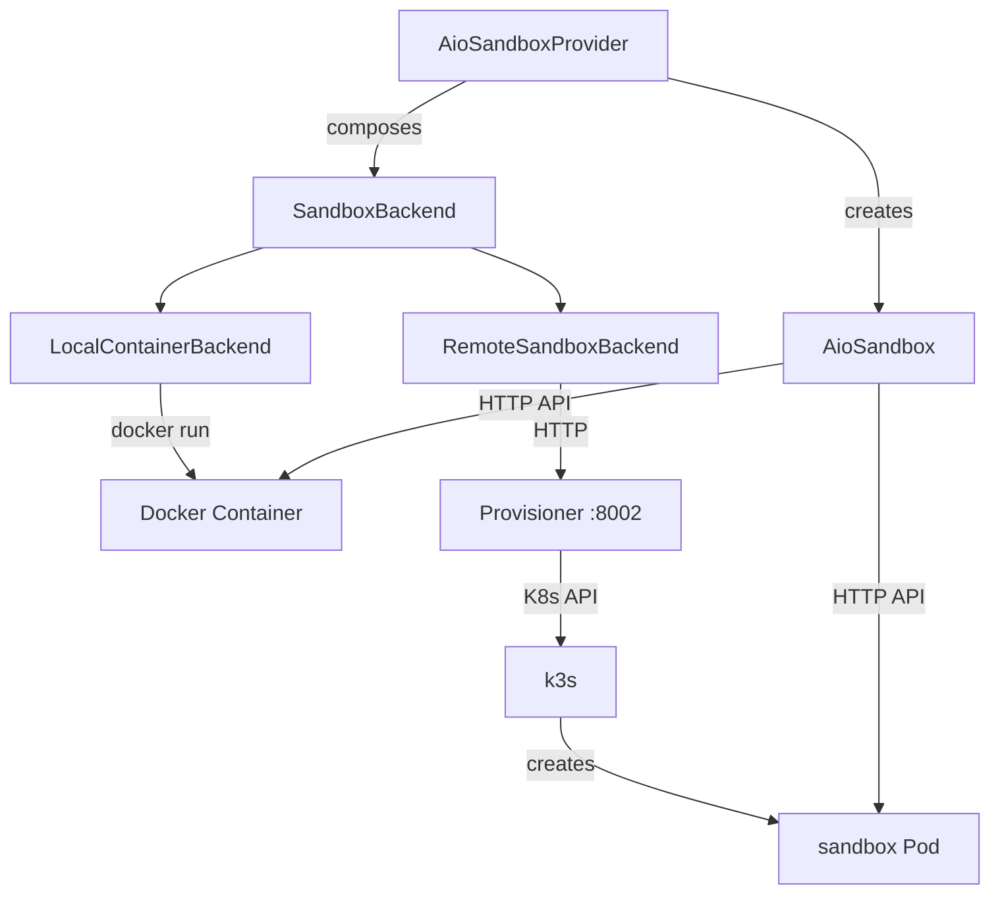
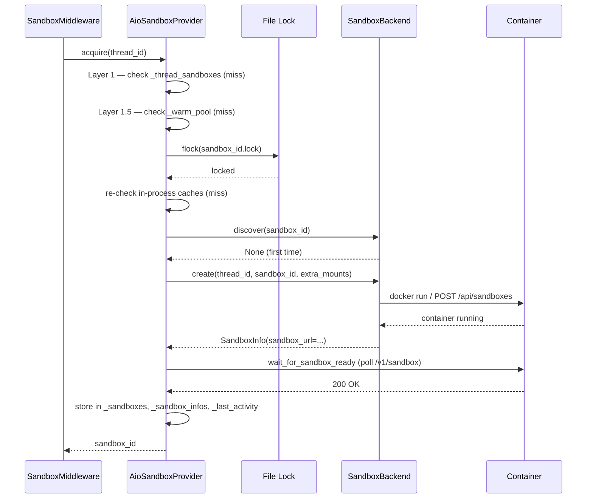
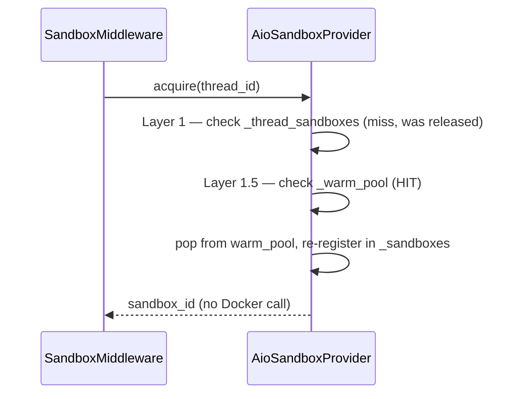

# AIO Sandbox — Community Module

## Purpose

The AIO (All-In-One) sandbox is DeerFlow's container-based alternative to the local filesystem sandbox. Where the local sandbox runs shell commands directly on the host, the AIO sandbox runs them inside a dedicated Docker container (or K8s Pod) that is isolated per thread. It is the sandbox used in Docker deployments and production K8s environments.

The module lives in `deerflow/community/aio_sandbox/` — under `community/` because it depends on an optional third-party SDK (`agent_sandbox`) and an external provisioner service, rather than being a core harness primitive.

## Key Files

- `sandbox_info.py` — `SandboxInfo` dataclass: the cross-process passport for a sandbox (id, URL, container refs, created_at)
- `backend.py` — `SandboxBackend` abstract interface + `wait_for_sandbox_ready()` utility
- `local_backend.py` — `LocalContainerBackend`: manages Docker/Apple Container on the local machine
- `remote_backend.py` — `RemoteSandboxBackend`: delegates to the Provisioner HTTP service for K8s deployments
- `aio_sandbox.py` — `AioSandbox`: the `Sandbox` implementation that speaks to a running container via HTTP
- `aio_sandbox_provider.py` — `AioSandboxProvider`: the top-level coordinator; owns caching, warm pool, idle GC, orphan reconciliation

## Architecture Overview



The provider selects the backend at startup based on config: `provisioner_url` set → `RemoteSandboxBackend`; otherwise → `LocalContainerBackend`.

## Important Concepts

### SandboxInfo — the cross-process passport

`SandboxInfo` is a plain dataclass holding everything needed to reconnect to a running sandbox from any process:

- `sandbox_id` — deterministic identifier (derived from `thread_id` via SHA-256)
- `sandbox_url` — the HTTP base URL of the sandbox container (e.g. `http://localhost:8082`)
- `container_name` / `container_id` — set by `LocalContainerBackend` only; `None` in remote mode
- `created_at` — Unix timestamp for orphan GC age checks

The `from_dict()` method has backward compat: `data.get("sandbox_url", data.get("base_url", ""))` — the field was renamed from `base_url` at some point.

### Deterministic sandbox ID

```python
hashlib.sha256(thread_id.encode()).hexdigest()[:8]
```

Any process that knows the `thread_id` can derive the same 8-char hex ID independently. This is the foundation of cross-process sandbox discovery — no shared database or state file needed. The container name (`deer-flow-sandbox-{id}`) is predictable, so `backend.discover()` can find it by name.

### Three-tier container pool

```
Active (_sandboxes)   ← in use by a live thread; never evicted
       ↓ release()
Warm pool (_warm_pool) ← container still running; eligible for fast reclaim or eviction
       ↓ idle timeout / replicas eviction
Destroyed             ← backend.destroy() called; container stopped
```

`release()` moves a sandbox to the warm pool. The container keeps running so the next turn for the same thread can reclaim it instantly (Layer 1.5 in acquire) without paying Docker cold-start. `destroy()` stops the container and removes it from all state.

### Three-layer acquire

```
Layer 1:   in-process cache (_thread_sandboxes + _sandboxes)   — no I/O
Layer 1.5: warm pool (_warm_pool)                               — no Docker call
Layer 2:   cross-process file lock → discover → create          — may call Docker/provisioner
```

The file lock (`fcntl.flock` / `msvcrt.locking` on a `.lock` file in the thread directory) serializes concurrent processes racing to create a sandbox for the same thread_id. After acquiring the file lock, both in-process caches are re-checked — another thread in this process may have won while waiting.

## Execution Flow

### Acquire (first turn for a thread)



### Acquire (subsequent turn — warm pool hit)



### Release vs Destroy

```
release(sandbox_id)                destroy(sandbox_id)
  → remove from _sandboxes           → remove from _sandboxes
  → remove from _sandbox_infos       → remove from _sandbox_infos
  → remove from _thread_sandboxes    → remove from _thread_sandboxes
  → add to _warm_pool                → remove from _warm_pool
  → container keeps running          → backend.destroy() → container stopped
```

## Local Container Backend

`LocalContainerBackend` manages Docker or Apple Container directly:

- **Runtime detection** — macOS probes `container --version`; prefers Apple Container, falls back to Docker.
- **Port allocation** — thread-safe `get_free_port()` with a retry loop (up to 10 attempts) for async Docker port-release races.
- **Volume mounts** — Docker uses `--mount type=bind,...` (not `-v`) to avoid Windows drive-letter colon ambiguity.
- **Security** — `--security-opt seccomp=unconfined` for Docker, allowing the sandbox to run arbitrary syscalls (ptrace, etc.) needed for code execution. Apple Container has its own VM-level isolation.
- **Credential redaction** — `_redact_container_command_for_log()` strips env var values from log output.
- **Batch inspect** — `list_running()` costs exactly 2 subprocess calls regardless of container count: `docker ps` then `docker inspect NAME1 NAME2 ...`. The naive approach would be 2N+1.
- **Docker Name convention** — `docker inspect` returns `Name` with a leading `/` that must be stripped before matching against `docker ps` names.
- **Timestamp parsing** — Docker emits nanosecond-precision ISO 8601 with trailing `Z`; Python `fromisoformat` (pre-3.11) can't parse either. `_parse_docker_timestamp()` normalizes to microseconds and `+00:00`.

## Remote (K8s/Provisioner) Backend

`RemoteSandboxBackend` is a thin HTTP client over the Provisioner service:

- **Architecture** — `backend → provisioner:8002 → k3s:6443 → sandbox Pod`. The backend never calls Kubernetes directly.
- **`create()`** — `POST /api/sandboxes`; `extra_mounts` is silently dropped (K8s provisioner owns volume config).
- **`destroy()`** — best-effort: warns on failure, never raises. Orphan reconciler handles failures at next startup.
- **`is_alive()` vs `discover()`** — same endpoint (`GET /api/sandboxes/{id}`), different intent: `is_alive()` returns `status=="Running"` as bool; `discover()` returns `SandboxInfo` and treats 404 as `None`.
- **`list_running()`** — overrides the parent's no-op default (both backends do). Without this, process restarts would permanently orphan K8s Pods.

## AioSandbox (the Sandbox implementation)

`AioSandbox` wraps the `agent_sandbox` SDK client:

- **Single persistent shell session** — the container runs one shell that persists across calls. Concurrent `exec_command` calls corrupt it. `threading.Lock()` serializes shell ops within a process.
- **Cross-process corruption recovery** — if `ErrorObservation` appears in output (string match on `_ERROR_OBSERVATION_SIGNATURE`), a fresh UUID session is opened. This is fragile: the detection string is internal to the `agent_sandbox` SDK.
- **`_DEFAULT_NO_CHANGE_TIMEOUT = 600`** — overrides the SDK's 120s built-in `no_change_timeout` to prevent long-running silent commands from timing out.
- **`list_dir`** — implemented via `shell.exec_command("find ...")`, not a file API — the SDK has no native list_dir.
- **`write_file` append** — read-then-write, not atomic. Protected within a process by the lock, but cross-process appends can race.
- **`grep`** — validates regex locally before sending to the container so invalid patterns raise typed `re.error` (caught by the tool's except clause) rather than opaque API errors.

## Idle Timeout & Orphan Reconciliation

### Idle checker

Daemon thread runs every 60s. For active sandboxes, uses two-phase destroy: snapshot candidates under lock, then re-verify each one before destroying (a re-acquired sandbox would be destroyed prematurely without the re-check). For warm-pool sandboxes, removes from the pool under lock and destroys in a separate pass.

### Orphan reconciliation

On startup, `_reconcile_orphans()` calls `backend.list_running()` and unconditionally adopts every running container into the warm pool. The reconciler cannot distinguish "orphaned" from "actively used by another process" based on age — idle timeout handles both. This closes the fundamental gap where process crashes leave containers running forever.

## My Insights

**The warm pool is the key performance optimization.** Agent turns are short and frequent (seconds each). Without warm containers, every turn would pay Docker cold-start (2-10 seconds). With the warm pool, subsequent turns on the same thread return in milliseconds from Layer 1.5. The replicas cap exists to prevent unbounded container accumulation — only warm (idle) containers are evicted, never active ones.

**Deterministic IDs make cross-process consistency free.** Most distributed systems need a shared registry or coordinator to discover shared resources. Here, the deterministic ID (`sha256(thread_id)[:8]`) is the registry. Any process can derive the correct container name from just the `thread_id`. The file lock prevents the duplicate-creation race that would otherwise arise from this.

**Two error domains, two recovery strategies.** The AIO sandbox handles two independent failure modes: (1) session corruption (within container, recoverable by fresh UUID) and (2) process restart (cross-process, recovered by orphan reconciliation). Each has its own mechanism and neither interferes with the other.

**DooD (Docker-outside-Docker) awareness is pervasive.** Several path computations distinguish between host paths (used for volume mounts, visible to the Docker daemon) and container-internal paths (used for reading/writing via the API). The `DEER_FLOW_HOST_SKILLS_PATH` and `host_base_dir` conventions carry this distinction through the codebase.

## Open Questions

- `_deterministic_sandbox_id` uses 8 hex chars = 32-bit space. Could two different thread_ids produce the same prefix? Unlikely in practice with O(10) concurrent threads, but not impossible.
- `_thread_locks` grows unboundedly — one lock per thread_id is created and never removed. In long-lived processes with many threads, is there a cleanup path or does memory growth matter in practice?
- `_ERROR_OBSERVATION_SIGNATURE` is a string match against an internal SDK error message. If the `agent_sandbox` SDK changes this string, the corruption recovery silently breaks. Is there a structured error type available?

## Links to Related Sections

- [[15a-sandbox-primitives]] — `Sandbox` abstract interface that `AioSandbox` implements; `exceptions.py` error types
- [[15b-local-sandbox]] — `LocalSandbox` (host filesystem); contrast with AIO's container-based isolation
- [[15d-sandbox-provider-middleware]] — `SandboxProvider` base class; `sandbox_provider.py` that selects local vs AIO; `SandboxMiddleware` that calls `acquire`/`release`
- [[09b-before-agent-middlewares]] — `SandboxMiddleware` (pos 3) in the middleware chain; `before_agent` acquires, `after_agent` releases
