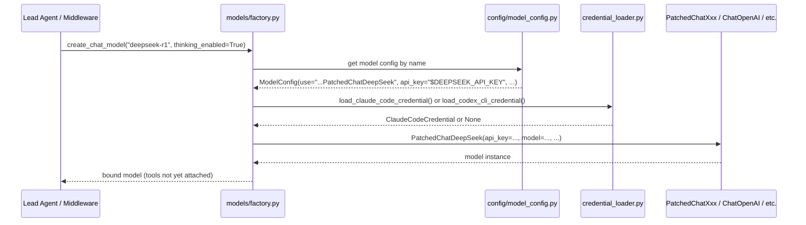
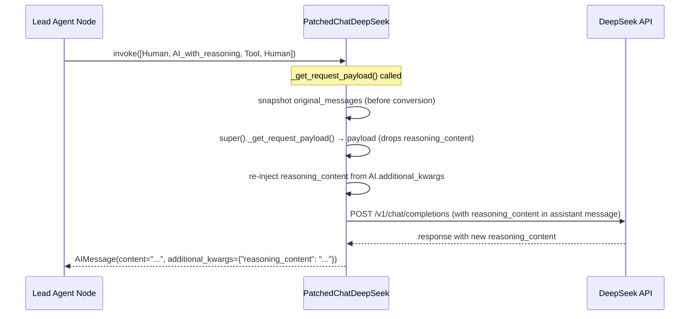
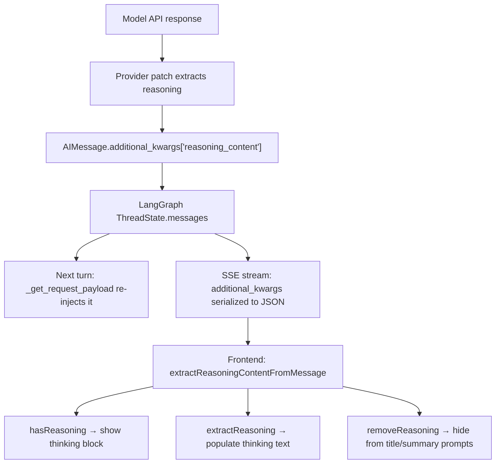

# Model Layer — Phase 1 & 2: Package API, Credentials, and Provider Patches

## Purpose

The `deerflow.models` package is DeerFlow's LLM abstraction layer. It exposes a single factory
function (`create_chat_model`) that hides all provider selection, credential loading, and
compatibility patching behind one call. Callers — the lead agent, subagents, title middleware,
memory updater — never import a provider directly.

Phases 1–2 cover the package surface, credential loading, and the three patched OpenAI-compatible
adapters (Gemini, DeepSeek, MiniMax).

## Key Files

- `models/__init__.py` — single re-export; the entire public contract is `create_chat_model`
- `models/credential_loader.py` — auto-loads OAuth tokens from Claude Code CLI and Codex CLI
- `models/patched_openai.py` — fixes `thought_signature` field dropping for Gemini via OpenAI gateway
- `models/patched_deepseek.py` — fixes `reasoning_content` field dropping for DeepSeek thinking models
- `models/patched_minimax.py` — full request+response adapter for MiniMax reasoning output

## Important Concepts

### Single-symbol public API

```python
# models/__init__.py
from .factory import create_chat_model
__all__ = ["create_chat_model"]
```

The entire package collapses to one factory function. All provider wiring, credential loading, and
patch selection are implementation details. The same pattern appears in `tools/__init__.py` and
`skills/__init__.py` — DeerFlow consistently keeps package surfaces minimal.

### The `additional_kwargs["reasoning_content"]` convention

All provider patches (DeepSeek, MiniMax, vLLM, Codex) funnel reasoning/thinking output into the
same key: `AIMessage.additional_kwargs["reasoning_content"]`. This is DeerFlow's internal
convention — it's not a LangChain standard.

The frontend (`frontend/src/core/messages/utils.ts`) then reads this key via a three-format
fallback (see Downstream Flow section below).

### Why patches are needed at all

LangChain's `ChatOpenAI._get_request_payload()` serializes messages to HTTP dicts but only
preserves standard fields (`id`, `type`, `function` on tool calls; `role`, `content` on
messages). Vendor-specific fields stored in `additional_kwargs` are silently dropped.

Two separate problems:

| Problem                                                                       | Which providers                                                   | Fix                                          |
| ----------------------------------------------------------------------------- | ----------------------------------------------------------------- | -------------------------------------------- |
| Vendor field dropped **on the way out** (multi-turn history re-serialization) | DeepSeek (`reasoning_content`), Gemini (`thought_signature`)      | Override `_get_request_payload` to re-inject |
| Vendor field **never extracted** from the response in the first place         | MiniMax (`reasoning_details`, `<think>` tags), vLLM (`reasoning`) | Override response-parsing hooks              |

### Credential loader: borrowing from CLI tools

`credential_loader.py` enables DeerFlow to re-use existing Claude Code CLI or Codex CLI
sessions. Users who already have `claude` or `codex` installed don't need to separately
configure API keys — DeerFlow finds and uses their existing credential files.

```
Claude Code OAuth lookup chain (priority order):
  1. $CLAUDE_CODE_OAUTH_TOKEN or $ANTHROPIC_AUTH_TOKEN   (env var direct)
  2. $CLAUDE_CODE_OAUTH_TOKEN_FILE_DESCRIPTOR            (open FD, more secure)
  3. $CLAUDE_CODE_CREDENTIALS_PATH                       (override file)
  4. ~/.claude/.credentials.json                         (default install location)

Codex CLI:
  ~/.codex/auth.json (or $CODEX_AUTH_PATH)
```

## Execution Flow

### Request: `create_chat_model(name, thinking_enabled)` → model instance



### Multi-turn conversation with thinking (DeepSeek example)



### Reasoning content downstream flow



Frontend reads `reasoning_content` via a three-format fallback (in priority order):

1. `additional_kwargs.reasoning_content` — MiniMax / DeepSeek / vLLM / Codex
2. `content[0].thinking` — Anthropic Claude's thinking block format
3. `splitInlineReasoning(content).reasoning` — fallback for unstripped `<think>` tags

## Patch Comparison

| Patch                 | Parent         | Field                                     | Direction                                        | Methods overridden                                                                  |
| --------------------- | -------------- | ----------------------------------------- | ------------------------------------------------ | ----------------------------------------------------------------------------------- |
| `PatchedChatOpenAI`   | `ChatOpenAI`   | `thought_signature` on tool-call objects  | Re-inject on outgoing turn                       | `_get_request_payload`                                                              |
| `PatchedChatDeepSeek` | `ChatDeepSeek` | `reasoning_content` on assistant message  | Re-inject on outgoing turn                       | `_get_request_payload`                                                              |
| `PatchedChatMiniMax`  | `ChatOpenAI`   | `reasoning_details` → `reasoning_content` | Extract from response + inject `reasoning_split` | `_get_request_payload`, `_convert_chunk_to_generation_chunk`, `_create_chat_result` |

## My Insights

### The snapshot-before-super pattern

All three patches use the same technique for working around LangChain's serialization:

```python
original_messages = self._convert_input(input_).to_messages()  # snapshot BEFORE parent
payload = super()._get_request_payload(...)                      # parent drops vendor fields
# now re-inject from original_messages into payload
```

You must snapshot before calling the parent because `_get_request_payload` converts
LangChain message objects to plain dicts, losing all non-standard fields. The snapshot
is the only way to access `additional_kwargs` content after the parent runs.

### `thought_signature` needs per-tool-call ID matching; `reasoning_content` doesn't

`thought_signature` is a field on each individual tool-call object inside an `AIMessage`.
Multiple tool calls can have different signatures. The Gemini patch must match each
payload tool-call to its original by `id` (then positional fallback).

`reasoning_content` is a single string on the assistant message itself. One message,
one field — no matching needed. This is why `patched_deepseek.py` is simpler.

### MiniMax is in API transition

MiniMax sends reasoning in two formats simultaneously during their migration from inline
`<think>` tags (legacy) to structured `reasoning_details` (current). `PatchedChatMiniMax`
handles both — extracts from `reasoning_details` AND strips `<think>` tags — then
deduplicates with `_merge_reasoning`. The `_merge_reasoning` deduplication is specifically
to handle the case where both formats carry the same text.

### `preserve_whitespace=True` in streaming

During streaming, `reasoning_content` is built chunk-by-chunk. The chunks must be stored
raw (no stripping/normalization) because LangChain's `AIMessageChunk.__add__` concatenates
`additional_kwargs` strings via `merge_dicts`. Stripping whitespace mid-stream would fuse
words across chunk boundaries:

```
chunk A: "We need to isolate "   →  strip → "We need to isolate"
chunk B: "x. 3x=15, x=5"

merged: "We need to isolatex. 3x=15, x=5"   ← broken
```

`preserve_whitespace=True` keeps the trailing space intact so concatenation is correct.
The non-streaming path receives a complete string and can afford to strip and deduplicate.

### `lc_secrets` dual-key mapping (DeepSeek)

`PatchedChatDeepSeek` declares:

```python
lc_secrets = {"api_key": "DEEPSEEK_API_KEY", "openai_api_key": "DEEPSEEK_API_KEY"}
```

`ChatDeepSeek` inherits from `ChatOpenAI` (OpenAI-compatible client), so the actual API key
can end up stored under either `api_key` or `openai_api_key` depending on how the instance
is constructed. Both map to the same env var so LangChain redacts the right attribute in
traces/checkpoints — and restores the right value when deserializing.

### FD-based secrets in credential_loader

`CLAUDE_CODE_OAUTH_TOKEN_FILE_DESCRIPTOR` passes a secret via an open OS file descriptor
instead of an env var string. This is more secure: the secret doesn't appear in
`/proc/{pid}/environ` (readable by any process with the right permissions). The parent
process opens a pipe, writes the token, and the child reads by FD number.

## Dry Run: PatchedChatOpenAI with Gemini tool call

```
Turn 1 — Gemini responds with thought_signature:
  AIMessage(
    additional_kwargs={"tool_calls": [{"id": "tc_abc", "thought_signature": "AXr7k==", ...}]}
  )

Turn 2 — agent sends history back:
  _get_request_payload called
    original_messages snapshot: [Human, AIMessage(with thought_signature)]
    super()._get_request_payload() → drops thought_signature from payload
    _restore_tool_call_signatures:
      raw_by_id = {"tc_abc": {..."thought_signature": "AXr7k=="}}
      payload tool_call matched by id → payload_tc["thought_signature"] = "AXr7k=="

  Result: payload includes thought_signature → Gemini accepts
  Without patch: HTTP 400 INVALID_ARGUMENT
```

## Dry Run: PatchedChatMiniMax — both reasoning formats at once

```
MiniMax response:
  content = "<think>\nLet me reason.\n</think>\nThe answer is 42."
  reasoning_details = [{"type": "text", "text": "Let me reason."}]

_create_chat_result:
  _strip_inline_think_tags(content)
    → ("The answer is 42.", "Let me reason.")      ← inline tag extracted

  _extract_reasoning_text(reasoning_details)
    → "Let me reason."                              ← structured field extracted

  _merge_reasoning("Let me reason.", "Let me reason.")
    → "Let me reason."                              ← deduplication prevents doubling

  Final AIMessage:
    content = "The answer is 42."                   ← <think> stripped
    additional_kwargs = {"reasoning_content": "Let me reason."}
```

## Dry Run: PatchedChatMiniMax — streaming reasoning chunk by chunk

Each SSE event is passed to `_convert_chunk_to_generation_chunk` individually. Accumulation
happens later inside LangChain's streaming machinery via `AIMessageChunk.__add__`, which calls
`merge_dicts` on `additional_kwargs`. `merge_dicts` concatenates string values, so each chunk's
`reasoning_content` fragment is joined in order to produce the final string.

```
Chunk A — Responses-API duplicate (dropped):
  {"type": "content.delta", "delta": {"content": "x"}}

  chunk.get("type") == "content.delta"  →  return None   ← skipped entirely
  (MiniMax sends the same content in two SSE formats; this drops the duplicate)


Chunk B — standard choices delta WITH reasoning_details:
  {"choices": [{"delta": {"content": "x",
                           "reasoning_details": [{"type": "text",
                                                  "text": "We need to isolate "}]},
                "finish_reason": null}]}

  _convert_delta_to_message_chunk(delta, ...)
    → AIMessageChunk(content="x")

  _extract_reasoning_text([...], strip_parts=False)
    → "We need to isolate "
    # strip_parts=False: raw, no .strip() on partial chunks — preserves trailing space

  _with_reasoning_content(chunk, "We need to isolate ", preserve_whitespace=True):
    existing = None   (fresh AIMessageChunk from _convert_delta_to_message_chunk)
    → additional_kwargs["reasoning_content"] = "We need to isolate "

  yields ChatGenerationChunk:
    AIMessageChunk(content="x", additional_kwargs={"reasoning_content": "We need to isolate "})


Chunk C — next delta:
  {"choices": [{"delta": {"content": " = 5",
                           "reasoning_details": [{"type": "text",
                                                  "text": "x. So 3x=15, x=5"}]}}]}

  AIMessageChunk(content=" = 5")
  _extract_reasoning_text → "x. So 3x=15, x=5"

  _with_reasoning_content(..., "x. So 3x=15, x=5", preserve_whitespace=True):
    existing = None on this fresh chunk object
    → additional_kwargs["reasoning_content"] = "x. So 3x=15, x=5"

  yields ChatGenerationChunk:
    AIMessageChunk(content=" = 5", additional_kwargs={"reasoning_content": "x. So 3x=15, x=5"})


Chunk D — finish_reason, no content:
  {"choices": [{"delta": {}, "finish_reason": "stop"}]}
  yields ChatGenerationChunk: AIMessageChunk(content="", additional_kwargs={})


───────────────────────────────────────────────────────────────────
LangChain internal reduction: B + C + D

  B + C:
    content:           "x" + " = 5"  =  "x = 5"
    additional_kwargs: merge_dicts(
      {"reasoning_content": "We need to isolate "},
      {"reasoning_content": "x. So 3x=15, x=5"}
    )
    → both are strings → concatenated
    → {"reasoning_content": "We need to isolate x. So 3x=15, x=5"}

  (B+C) + D:
    merge_dicts({reasoning_content: "..."}, {})  →  unchanged

  Final AIMessage:
    content = "x = 5"
    additional_kwargs = {"reasoning_content": "We need to isolate x. So 3x=15, x=5"}
```

**Why `preserve_whitespace=True` matters here:**
If `_with_reasoning_content` had used `_merge_reasoning` (which calls `.strip()` on each value),
chunk B's trailing space would be stripped: `"We need to isolate"`. After concatenation by
`merge_dicts`: `"We need to isolatex. So 3x=15, x=5"` — word fusion. The `preserve_whitespace`
flag bypasses stripping so raw chunk boundaries survive the merge intact.

**Where accumulation happens:**
`model.invoke(messages)` internally calls `_generate()`, which calls `_stream()` and reduces via
`chunk = chunk + next_chunk`. This is inside LangChain, before the result reaches the agent node.
LangGraph's `stream_mode=["messages-tuple"]` separately re-emits each raw chunk to the frontend
as it's yielded — so the frontend sees deltas, while the graph state receives the accumulated
final `AIMessage`.

## Open Questions

- Does `PatchedChatMiniMax` need multi-turn `reasoning_content` re-injection (like DeepSeek)? The file doesn't override `_get_request_payload` for that purpose — only to inject `reasoning_split=True`. If MiniMax's API requires `reasoning_content` echoed back, this would be a gap.
- Where exactly is `is_oauth_token()` called in `claude_provider.py`? Does the Claude provider handle token refresh via `refresh_token`, or does it expect the user to run `claude` manually to refresh?
- `_read_secret_from_file_descriptor` reads up to 1 MB (`os.read(fd, 1024 * 1024)`). OAuth tokens are much shorter — is this just a safe upper bound?

## Links to Related Sections

- [[16b-model-layer-providers-factory]] — `claude_provider.py`, `vllm_provider.py`, `mindie_provider.py`, `openai_codex_provider.py`, `factory.py`, `model_config.py` (phases 3–4)
- [[09c-model-call-wrappers]] — `LLMErrorHandlingMiddleware` wraps the model call; errors from providers surface here
- [[08a-lead-agent]] — `create_chat_model()` is called inside `make_lead_agent` with `thinking_enabled` from runtime config
- [[10-memory-system]] — memory updater calls `create_chat_model` for a separate extraction model
