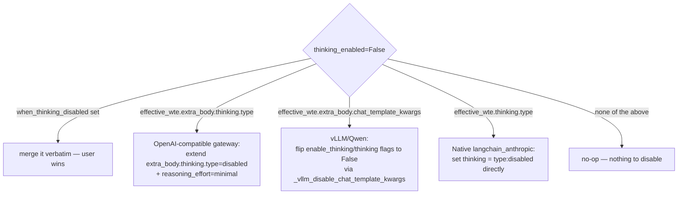
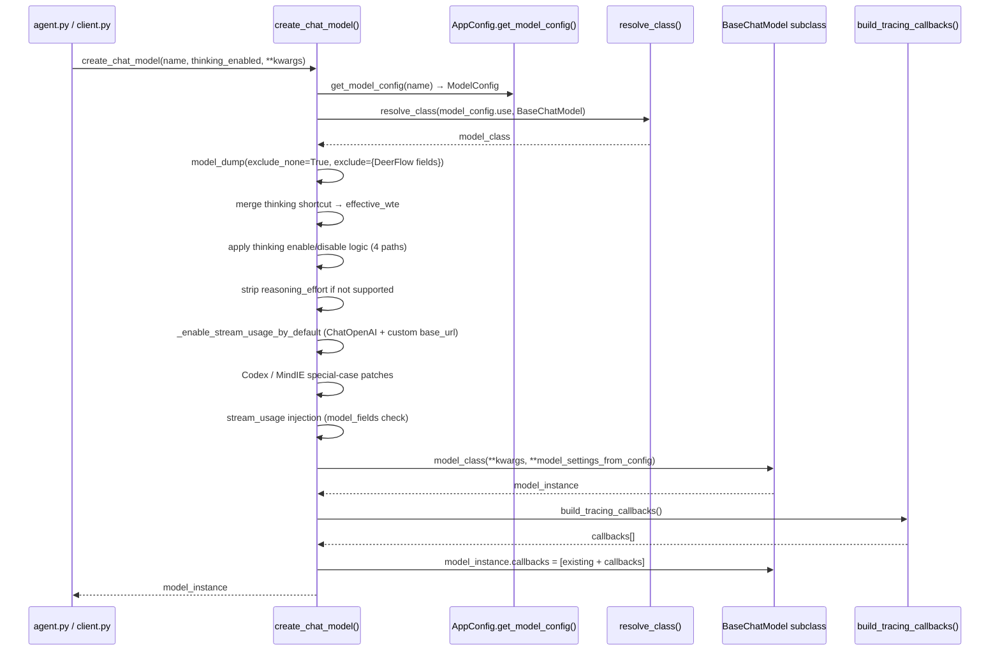

# Model Layer — Phase 4: Config Schema & Factory

## Purpose

This note covers the two "assembly" files in the model layer: the config schema that binds user-written YAML to the factory, and the factory itself that turns that schema into live LLM instances. Together they are the entire bridge between `config.yaml` and a `BaseChatModel` object that the agent can call.

## Key Files

- `backend/packages/harness/deerflow/config/model_config.py` — Pydantic schema for a single model entry in `config.yaml`; declares DeerFlow-specific fields and lets everything else pass through to the provider constructor
- `backend/packages/harness/deerflow/models/factory.py` — `create_chat_model()` plus three private helpers; resolves the provider class, applies thinking-mode toggles, and attaches tracing callbacks

## Important Concepts

### ModelConfig: schema-as-contract + open passthrough

`ModelConfig` declares only the fields DeerFlow cares about (capability flags, thinking toggle dicts, display metadata). Everything else in a `config.yaml` model entry — `api_key`, `base_url`, `temperature`, `max_tokens`, `timeout`, `max_retries`, any provider-specific field — is stored as an extra field because `model_config = ConfigDict(extra="allow")`.

The factory then calls:

```python
model_settings_from_config = model_config.model_dump(
    exclude_none=True,
    exclude={"use", "name", "display_name", "description",
             "supports_thinking", "supports_reasoning_effort",
             "when_thinking_enabled", "when_thinking_disabled",
             "thinking", "supports_vision"},
)
```

The `exclude` set strips every DeerFlow-only field. Everything else — including all the user-specified extra fields — falls through to `model_class(**model_settings_from_config)`. This means the schema can accommodate every LLM provider without ever listing provider-specific parameters.

### Declarative provider selection via reflection

The `use` field is a dotted class path (`langchain_openai:ChatOpenAI`, `deerflow.models.vllm_provider:VllmChatModel`, etc.). The factory resolves it via `resolve_class(model_config.use, BaseChatModel)` — a dynamic import that also validates the result is a `BaseChatModel` subclass. There is no `if provider == "openai"` branching anywhere; adding support for a new provider requires zero changes to this file.

### Thinking mode: four-path disable logic

When `thinking_enabled=False` and the model config declares thinking settings, the factory must inject a "disable thinking" signal. The challenge is that different backends use completely different mechanisms — and the factory must detect which backend is in use without importing the provider classes (to avoid circular deps and optional-dependency issues).

Detection is done by inspecting the _shape_ of `when_thinking_enabled`:



When `thinking_enabled=True`, the logic is simpler: merge `effective_wte` into the settings dict and validate `supports_thinking=True` is set.

### `thinking` shortcut field — legacy compat

`ModelConfig.thinking` is a shortcut for `when_thinking_enabled["thinking"]`. The factory merges them:

```python
effective_wte = dict(model_config.when_thinking_enabled) if model_config.when_thinking_enabled else {}
if model_config.thinking is not None:
    merged_thinking = {**(effective_wte.get("thinking") or {}), **model_config.thinking}
    effective_wte = {**effective_wte, "thinking": merged_thinking}
```

This handles configs that were written with the old Anthropic-style `thinking: {type: enabled, budget_tokens: N}` directly, before `when_thinking_enabled` was introduced. New configs should use `when_thinking_enabled`.

### stream_usage — two overlapping fixes

Token usage data is only available in streaming responses if `stream_usage=True` is set on the model. LangChain's default only enables this for official OpenAI endpoints (no custom `base_url`). DeerFlow frequently points `ChatOpenAI` at third-party OpenAI-compatible gateways.

There are two mechanisms to fix this, applied in sequence:

1. `_enable_stream_usage_by_default(model_use_path, ...)` — targeted fix for `langchain_openai:ChatOpenAI` with a custom `base_url` or `openai_api_base`
2. Lines 146–148 — broader fix: for any model class that declares `stream_usage` in its Pydantic `model_fields`, enable it unless explicitly configured otherwise

The second fix covers providers like `langchain_deepseek:ChatDeepSeek` that extend `BaseChatOpenAI` under the hood.

### Provider-specific special cases

**Codex (`CodexChatModel`)**: Detected via `issubclass` check (deferred import to avoid circularity). Maps thinking mode to `reasoning_effort` string values (`none` / `low..high` / `medium` default). Also strips `max_tokens`, which the Codex endpoint rejects.

**MindIE (`MindIEChatModel`)**: Detected via `getattr(model_class, "__name__", "") == "MindIEChatModel"` — a name-string check to avoid importing an optional hardware dependency. Enforces a conservative `max_retries` default to prevent cascading timeouts.

### Tracing attachment

After the model instance is created, `build_tracing_callbacks()` returns LangSmith/Langfuse callbacks from the tracing factory. These are appended to `model_instance.callbacks` post-instantiation. The factory is the right place for this because it is the only path through which model instances are created.

## Execution Flow



## My Insights

**`extra="allow"` is the model layer's killer feature.** Because `ModelConfig` accepts and preserves arbitrary fields, every LLM provider on earth is automatically supported: just write its constructor kwargs directly in `config.yaml`. No plugin system, no adapter interface, no registration step needed. The only required DeerFlow-specific fields are `name`, `use`, and `model`.

**The four-path thinking-disable logic encodes provider fingerprinting without importing providers.** The factory doesn't know which provider it's dealing with at the disable step — it infers it by inspecting the structure of the user-provided `when_thinking_enabled` dict. This is elegant: the user already configured the backend by choosing the enable format; the factory just mirrors it for the disable case. The cost is that the branching logic is subtle and the test suite must cover each path explicitly (and it does).

**There are two `stream_usage` fixes because the problem was discovered twice.** The first fix (`_enable_stream_usage_by_default`) was added for `ChatOpenAI` with a custom gateway. The second fix (lines 146–148) was added later when providers like DeepSeek that subclass `BaseChatOpenAI` were found to have the same issue. The two coexist without conflict because the second fix checks `"stream_usage" not in model_settings_from_config` before injecting.

**The deferred `CodexChatModel` import at line 122 is a deliberate architectural choice.** Top-level imports of provider subclasses would create a hard dependency on optional packages. A deferred import inside the function means the module loads cleanly even if `langchain-openai` isn't installed with the Codex extensions.

## Open Questions

- None from this session. The test suite (`test_model_factory.py`) covers every branch exhaustively and confirmed all edge cases.

## Links to Related Sections

- [[16a-model-layer-credential-patches]] — credential_loader and OpenAI-compatible patches (phases 1–2)
- [[16b-model-layer-providers]] — claude_provider, vllm_provider, mindie_provider, openai_codex_provider (phase 3)
- [[17-config-system]] — app_config.py hosts `get_model_config()` and the full config schema; section 17 covers the config system in full
- [[20-tracing-observability]] — `build_tracing_callbacks()` comes from the tracing factory; section 20 covers LangSmith/Langfuse integration
