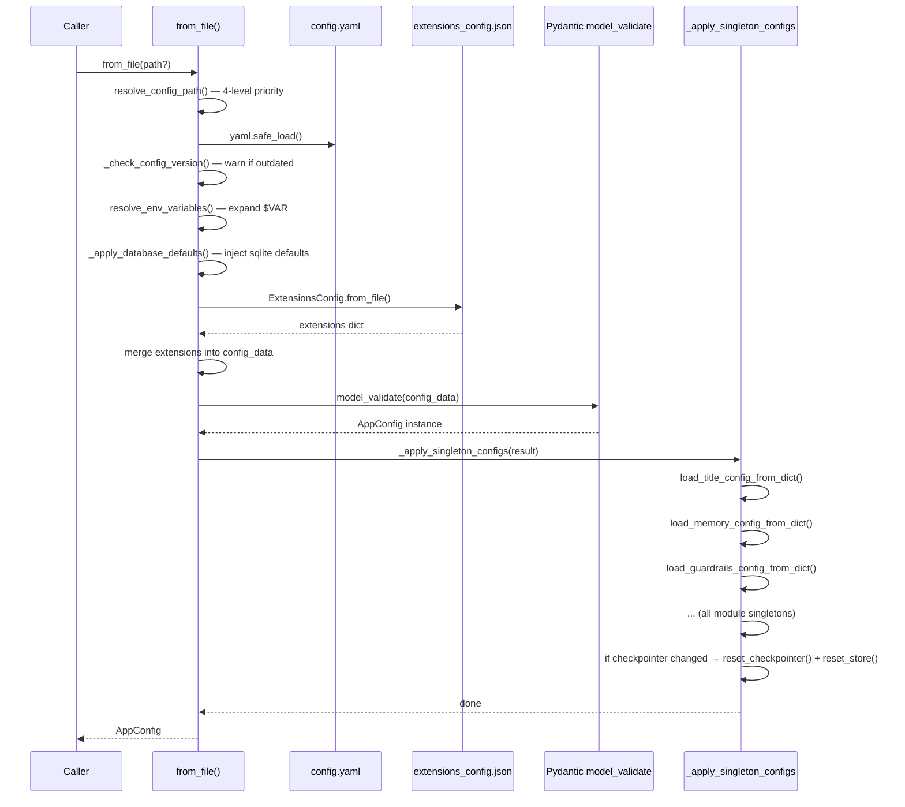
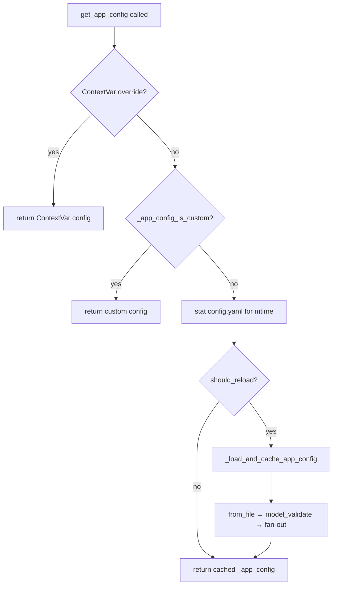
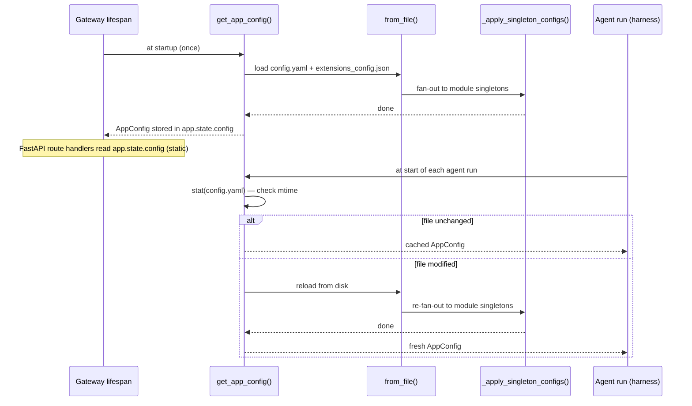

# Config System — `app_config.py` (Section 17, Phase 1)

## Purpose

`app_config.py` is the root of DeerFlow's configuration system. It has two jobs:

1. **Load and validate** `config.yaml` into a single `AppConfig` Pydantic model that aggregates every sub-config (models, sandbox, tools, memory, etc.).
2. **Keep module-level singletons in sync** — after every load, it fans out each sub-config into the module-level `get_*_config()` accessors that the rest of the harness calls directly.

It also provides the process-wide cached singleton (`get_app_config()`) with mtime-based hot-reload, and a ContextVar stack for per-async-task config overrides (used in testing and per-request scoping).

---

## Key Files (this note)

- `backend/packages/harness/deerflow/config/app_config.py` — root config loader, Pydantic model, singleton layer, hot-reload, ContextVar push/pop stack

---

## Important Concepts

### `AppConfig` — the root Pydantic model

`AppConfig` is a `BaseModel` that aggregates every sub-config as a typed field:

```python
class AppConfig(BaseModel):
    models: list[ModelConfig]
    sandbox: SandboxConfig           # only required field — no default_factory
    tools: list[ToolConfig]
    skills: SkillsConfig
    memory: MemoryConfig
    guardrails: GuardrailsConfig
    circuit_breaker: CircuitBreakerConfig
    database: DatabaseConfig
    checkpointer: CheckpointerConfig | None   # None = use harness default
    stream_bridge: StreamBridgeConfig | None
    extensions: ExtensionsConfig
    ...
    model_config = ConfigDict(extra="allow")  # unknown YAML keys silently pass
```

`sandbox` is the only field with no `default_factory` — missing it from `config.yaml` causes a Pydantic `ValidationError` at startup. All other fields have safe defaults.

`extra="allow"` means new config keys added to `config.example.yaml` don't break old harness installations that don't know about them yet — forward-compat by design.

---

### Two config files, one model

DeerFlow splits configuration across two files:

| File                     | Contains                                                         |
| ------------------------ | ---------------------------------------------------------------- |
| `config.yaml`            | Models, sandbox, tools, skills, memory, guardrails, agents, etc. |
| `extensions_config.json` | MCP server definitions and skill enabled/disabled state          |

`from_file()` loads both and merges them into a single dict before calling `model_validate`. The split exists because `extensions_config.json` is written at runtime by the Gateway API (when the user enables/disables MCP servers or skills) and is treated as mutable state, while `config.yaml` is the operator-managed static config.

---

### The `from_file()` loading pipeline

```python
@classmethod
def from_file(cls, config_path: str | None = None) -> Self:
    resolved_path = cls.resolve_config_path(config_path)
    config_data = yaml.safe_load(open(resolved_path))

    cls._check_config_version(config_data, resolved_path)   # warn if outdated
    config_data = cls.resolve_env_variables(config_data)    # expand $VAR strings
    cls._apply_database_defaults(config_data)               # inject sqlite defaults

    extensions_config = ExtensionsConfig.from_file()        # separate JSON file
    config_data["extensions"] = extensions_config.model_dump()  # merge in

    result = cls.model_validate(config_data)                # Pydantic validation
    acp_agents = cls._validate_acp_agents(...)              # dynamic dict schema
    cls._apply_singleton_configs(result, acp_agents)        # fan-out to singletons
    return result
```



---

### Config path resolution — 4-level priority

```python
@classmethod
def resolve_config_path(cls, config_path: str | None = None) -> Path:
    # 1. Explicit argument
    if config_path: return Path(config_path)
    # 2. Environment variable
    elif os.getenv("DEER_FLOW_CONFIG_PATH"): return Path(os.getenv(...))
    # 3. Project root (current working directory search via existing_project_file)
    elif (p := existing_project_file(("config.yaml",))): return p
    # 4. Legacy monorepo: backend/config.yaml or repo-root/config.yaml
    else: search _legacy_config_candidates()
```

`_legacy_config_candidates()` uses `Path(__file__).resolve().parents[4]` — climbing exactly 4 levels from `config/app_config.py` to reach `backend/`. This hard-codes the harness package depth and is fragile if the package is relocated.

---

### `_apply_singleton_configs()` — the fan-out bridge

After every load, `AppConfig` is a pure Pydantic value object. But much of the older harness code accesses config via module-level `get_X_config()` accessors (e.g. `get_title_config()`, `get_memory_config()`). `_apply_singleton_configs()` bridges the two patterns by pushing each sub-config into its corresponding module-level singleton immediately after load.

```python
def _apply_singleton_configs(cls, config, acp_agents):
    previous_checkpointer = get_checkpointer_config()   # snapshot before update

    load_title_config_from_dict(config.title.model_dump())
    load_summarization_config_from_dict(config.summarization.model_dump())
    load_memory_config_from_dict(config.memory.model_dump())
    load_agents_api_config_from_dict(config.agents_api.model_dump())
    load_subagents_config_from_dict(config.subagents.model_dump())
    load_tool_search_config_from_dict(config.tool_search.model_dump())
    load_guardrails_config_from_dict(config.guardrails.model_dump())
    load_checkpointer_config_from_dict(...)
    load_stream_bridge_config_from_dict(...)
    load_acp_config_from_dict(...)

    if previous_checkpointer != config.checkpointer:
        # lazy import to break cycle: runtime.checkpointer imports get_app_config
        from deerflow.runtime.checkpointer import reset_checkpointer
        from deerflow.runtime.store import reset_store
        reset_checkpointer()
        reset_store()
```

The cycle-breaking lazy import is required because `runtime.checkpointer` and `runtime.store` both import `get_app_config()` at their module level. A top-level import here would create a circular dependency at import time.

---

### Environment variable resolution — strict, not lenient

`resolve_env_variables()` does a recursive walk of the config dict. Any string starting with `$` is expanded:

```python
if config.startswith("$"):
    env_value = os.getenv(config[1:])
    if env_value is None:
        raise ValueError(f"Environment variable {config[1:]} not found ...")
    return env_value
```

Missing env vars raise at load time — a `$TYPO_API_KEY` in `config.yaml` blocks startup entirely. This is intentional: fail-fast at boot rather than fail at first use.

---

### Config versioning — warn-only

`_check_config_version()` compares the user's `config_version` in `config.yaml` against `config.example.yaml`. It walks up to 5 directory levels to find `config.example.yaml`. A mismatch emits a `logger.warning()` (never an error) and suggests `make config-upgrade`. Old configs continue to load.

---

### The singleton layer and mtime hot-reload

```python
# Module-level globals
_app_config: AppConfig | None = None
_app_config_path: Path | None = None
_app_config_mtime: float | None = None
_app_config_is_custom: bool = False
```

`get_app_config()` is the main accessor for the rest of the codebase. It checks the file's `st_mtime` on **every call** via `stat()` — a cheap kernel call. If the mtime changed since last load, it reloads:

```python
def get_app_config() -> AppConfig:
    # 1. ContextVar override (per-async-task scope) wins unconditionally
    runtime_override = _current_app_config.get()
    if runtime_override is not None:
        return runtime_override

    # 2. Custom/injected config (set_app_config) bypasses mtime checks
    if _app_config is not None and _app_config_is_custom:
        return _app_config

    # 3. File-based singleton with mtime hot-reload
    resolved_path = AppConfig.resolve_config_path()
    current_mtime = _get_config_mtime(resolved_path)
    should_reload = (
        _app_config is None                       # first call
        or _app_config_path != resolved_path      # path changed
        or _app_config_mtime != current_mtime     # file was edited
    )
    if should_reload:
        _load_and_cache_app_config(str(resolved_path))
    return _app_config
```



---

### FastAPI vs harness — who actually hot-reloads?

This is the most important operational insight about `app_config.py`:

**FastAPI route handlers do NOT hot-reload.** The lifespan handler calls `get_app_config()` once at startup and stores the result on `app.state.config`:

```python
# app/gateway/app.py — lifespan, runs ONCE at startup
app.state.config = get_app_config()
```

Every FastAPI route handler gets config via `Depends(get_config)` which reads from `app.state.config` — the frozen startup snapshot:

```python
# app/gateway/deps.py — called on every HTTP request
def get_config(request: Request) -> AppConfig:
    return request.app.state.config   # no stat(), no reload
```

**The harness/agent code DOES hot-reload.** The agent middleware pipeline, model factory, and tool loader call `get_app_config()` directly at the start of each agent run. That is where the mtime check fires:

```
HTTP request → FastAPI handler
  └─ Depends(get_config) → app.state.config        [frozen at startup]

Agent invocation (LangGraph run)
  └─ get_app_config() directly in harness code     [mtime-checked on every run]
```

A config change takes effect **on the next agent run**, not on the next HTTP request to a Gateway route handler.

| Call site                         | Access pattern                             | Hot-reload?                  |
| --------------------------------- | ------------------------------------------ | ---------------------------- |
| FastAPI route handlers            | `Depends(get_config)` → `app.state.config` | No — frozen at startup       |
| Agent / middleware / harness code | `get_app_config()` directly                | Yes — mtime checked each run |

---

### ContextVar push/pop — per-async-task config override stack

Two ContextVars implement a LIFO stack of config overrides that are scoped to the current asyncio task:

```python
_current_app_config: ContextVar[AppConfig | None]         # active override
_current_app_config_stack: ContextVar[tuple[...]]          # saved previous values
```

Because ContextVar mutations are local to the current asyncio `Task`, each task has its own independent stack. A push in Task A doesn't affect Task B.

#### Dry run — two nested overrides

**Initial state:**

```
_current_app_config       = None
_current_app_config_stack = ()
```

**`push(config_A)`:**

```python
stack = ()                                          # get stack
_current_app_config_stack.set(() + (None,))         # save current (None) → (None,)
_current_app_config.set(config_A)                   # activate config_A
```

```
_current_app_config       = config_A
_current_app_config_stack = (None,)
```

**`push(config_B)` — nested inner override:**

```python
stack = (None,)
_current_app_config_stack.set((None,) + (config_A,))  # save config_A → (None, config_A)
_current_app_config.set(config_B)
```

```
_current_app_config       = config_B
_current_app_config_stack = (None, config_A)
```

`get_app_config()` returns **config_B** here.

**`pop()` — exit inner override:**

```python
stack    = (None, config_A)
previous = stack[-1]                    # config_A
_current_app_config_stack.set((None,)) # drop last
_current_app_config.set(config_A)      # restore
```

```
_current_app_config       = config_A
_current_app_config_stack = (None,)
```

**`pop()` — exit outer override:**

```python
stack    = (None,)
previous = stack[-1]                    # None
_current_app_config_stack.set(())
_current_app_config.set(None)
```

```
_current_app_config       = None        ← back to initial state
_current_app_config_stack = ()
```

`get_app_config()` now falls through to the file-based singleton again.

The key design: the stack itself is stored in a ContextVar (not a plain list). Each asyncio Task inherits a snapshot of the ContextVar at creation time — so Task B inheriting Task A's `config_A` override can push its own `config_B` without touching Task A's stack.

---

### `database` defaults — file-only, not model-defaults

```python
CONFIG_FILE_DATABASE_DEFAULTS = {
    "backend": "sqlite",
    "sqlite_dir": ".deer-flow/data",
}
```

These are injected into the raw dict **before** `model_validate`, not declared as `Field(default=...)` on `DatabaseConfig`. This means:

- `AppConfig.from_file()` → sqlite defaults always present
- `AppConfig()` constructed directly (e.g. in unit tests) → **no** sqlite defaults applied

---

## Gotchas and Surprises

**The no-op at `from_file()` line ~165:**

```python
if "circuit_breaker" in config_data:
    config_data["circuit_breaker"] = config_data["circuit_breaker"]  # dead assignment
```

This is a leftover placeholder — likely copy-pasted from the pattern used for subsystems that have a custom loader. `CircuitBreakerConfig` reaches `model_validate` unchanged. It has no `load_circuit_breaker_config_from_dict()` counterpart and is not pushed into a module-level singleton.

**No lock on the mtime reload:**
`get_app_config()` checks `st_mtime` and reloads with no mutex. Two concurrent agent runs could both detect a changed mtime and both call `_load_and_cache_app_config()` simultaneously. In practice this is idempotent (loading the same file twice gives the same result), but it means the module-level globals could be written concurrently.

**`parents[4]` is a hard-coded depth:**
`_legacy_config_candidates()` walks 4 levels up from `app_config.py` to locate `backend/`. If the harness package is ever relocated or the directory structure changes, this silently finds the wrong path.

---

## Execution Flow



---

## My Insights

**The singleton duality is a migration artifact.** The comment in the source explicitly says the module-level globals are a "compatibility layer for code paths that have not yet been migrated to explicit `AppConfig` threading." The intended end state is to pass `AppConfig` down explicitly (constructor injection), but the codebase is mid-migration. The `_apply_singleton_configs()` fan-out exists to keep the old `get_X_config()` call sites working during this transition.

**Two config systems, one model.** The split between `config.yaml` (operator config) and `extensions_config.json` (runtime-mutable state) is a meaningful design boundary. Extensions are written by the Gateway API at runtime; merging them at load time inside `from_file()` means `AppConfig` is always a complete, unified view — callers don't need to know about the split.

**Hot-reload is scoped to the agent layer, not the HTTP layer.** This is the most operationally important insight: you can edit `config.yaml` (change a model, adjust memory settings) and the next agent run picks it up — no restart needed. But Gateway route handlers (list models, update MCP config, etc.) read from `app.state.config` which is frozen at startup. This asymmetry is intentional: agent runs are the hot path that benefits from live config; route handlers rarely need fresh config.

**ContextVar stack enables test isolation without thread-locals.** The push/pop pair lets tests inject a mock `AppConfig` for a specific asyncio task without affecting the process-wide singleton. Because ContextVar copies are task-local, a test helper can push a config, run an agent, and pop — the agent's sub-tasks inherit the test config, while the rest of the process is unaffected.

---

## Open Questions

- Is the no-lock mtime reload safe in the asyncio context? Two coroutines on the same event loop could both see a stale mtime and both call `_load_and_cache_app_config()`. The GIL prevents torn writes to Python globals, but the fan-out to module singletons (11+ `load_*_config_from_dict()` calls) isn't atomic.
- Why is `CircuitBreakerConfig` not pushed into a module-level singleton like every other sub-config? Is circuit breaker logic accessed differently (directly from an `AppConfig` instance passed by caller)?
- The `parents[4]` path assumption — does anything validate this at startup, or is an incorrect path silently swallowed and fall through to the legacy candidates?
- What triggers `app.state.config` to update after a hot-reload for Gateway route handlers? Is there a `reload_app_config` endpoint, or do Gateway handlers always require a restart to pick up config changes?

---

## Links to Related Sections

- [[16c-model-layer-factory-config]] — `model_config.py` is one of the sub-configs assembled by `AppConfig`; `factory.py` calls `get_app_config()` directly on every model creation
- [[07b-checkpointer-store]] — `reset_checkpointer()` and `reset_store()` are called by `_apply_singleton_configs()` when the checkpointer config changes
- [[05a-gateway-api]] — `lifespan()` in `app.py` calls `get_app_config()` once at startup; `deps.py::get_config()` reads the frozen `app.state.config`
- Phase 2 of Section 17 will cover `paths.py`, `runtime_paths.py`, `database_config.py`, `checkpointer_config.py`, `run_events_config.py`
