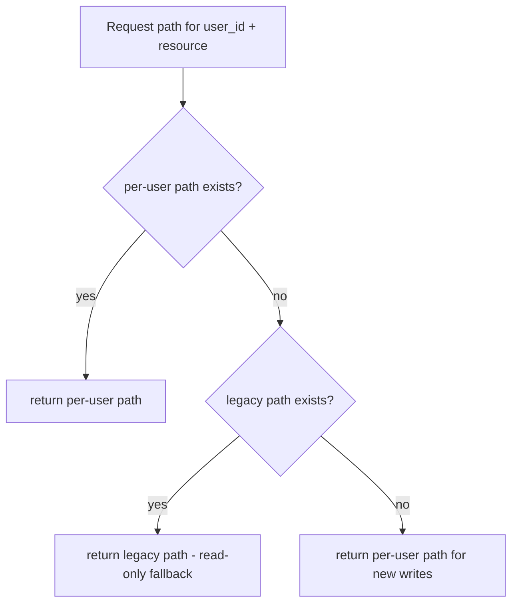
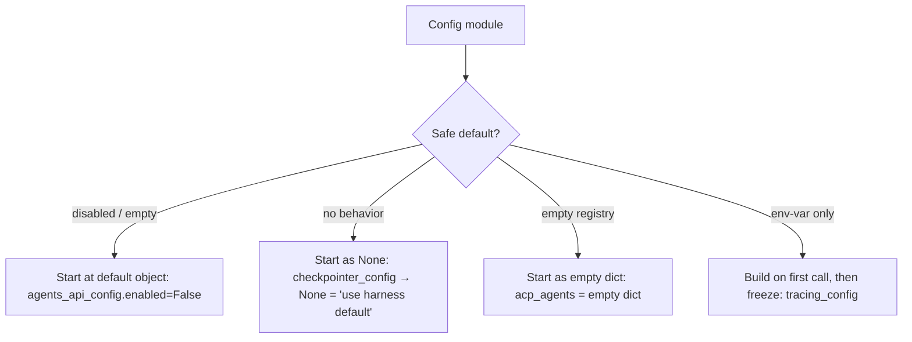

# Config System — Paths, Persistence, and Agent Ecosystem (Section 17, Phases 2–4)

## Scope

This note covers ten config modules processed across three study phases:

| Phase                             | Files                                                                                                  |
| --------------------------------- | ------------------------------------------------------------------------------------------------------ |
| 2 — Path & persistence primitives | `paths.py`, `runtime_paths.py`, `database_config.py`, `checkpointer_config.py`, `run_events_config.py` |
| 3 — Cross-cutting concerns        | `tracing_config.py`                                                                                    |
| 4 — Agent ecosystem               | `agents_config.py`, `agents_api_config.py`, `subagents_config.py`, `acp_config.py`                     |

`model_config.py` was annotated in Section 16 and is not re-documented here. See [[16c-model-layer-factory-config]].

---

## Architectural Theme: Module-Level Singletons vs Explicit Threading

Every config module in this phase follows the same pattern: a Pydantic `BaseModel` class holds validated fields, a `_module_level_singleton` starts at a safe default, a `load_*_from_dict()` function mutates it, and a `get_*()` function returns the current value. This mirrors the explicit-vs-singleton duality documented in [[17a-config-app-config]] — `app_config.py` drives all the `load_*()` calls on every reload.

The recurring design question is: _what is the safe default when a config section is absent from `config.yaml`?_ The answers vary:

| Module                   | Default when absent                                                   |
| ------------------------ | --------------------------------------------------------------------- |
| `database_config.py`     | SQLite (injected by `_apply_database_defaults` before model_validate) |
| `checkpointer_config.py` | `"memory"` (no persistence)                                           |
| `run_events_config.py`   | `"memory"` (no persistence)                                           |
| `agents_api_config.py`   | `enabled=False` (HTTP API disabled)                                   |
| `acp_config.py`          | `{}` (no ACP agents registered)                                       |
| `tracing_config.py`      | env-var probe at call time (never in `AppConfig`)                     |

---

## Phase 2 — Path and Persistence Primitives

### `config/runtime_paths.py` — The Lowest Layer

[`runtime_paths.py`](../../backend/packages/harness/deerflow/config/runtime_paths.py) has exactly two responsibilities:

1. `project_root()` — locate the DeerFlow project root
2. `runtime_home()` — return `{project_root}/.deer-flow`

```python
def project_root() -> Path:
    marker = Path.cwd()           # CWD is the primary signal
    if not marker.exists():
        raise RuntimeError(...)   # only if CWD is gone (process error)
    return marker

def runtime_home() -> Path:
    return project_root() / ".deer-flow"
```

**CWD as project root.** Unlike a typical "walk up until you find a marker file" approach, DeerFlow simply trusts that the process is launched from the right directory. When running from `backend/`, `project_root()` returns `backend/` and `runtime_home()` is `backend/.deer-flow`. This is why a fresh install has `.deer-flow/` inside `backend/`.

**Why a separate module?** `paths.py` imports `runtime_paths.py` but not vice versa. Keeping CWD/env-var resolution isolated makes it easy to unit-test path logic without needing a full `Paths` object or a real filesystem layout.

---

### `config/paths.py` — The Filesystem Address Book

[`paths.py`](../../backend/packages/harness/deerflow/config/paths.py) is the single source of truth for every directory and file path the harness touches. Every other module that needs a path calls `get_paths()` and uses a method on the returned `Paths` object — no ad-hoc string concatenation elsewhere.

```python
VIRTUAL_PATH_PREFIX = "/mnt/user-data"

class Paths:
    def __init__(self, base_dir: Path, host_base_dir: Path | None = None): ...

    @property
    def agents_dir(self) -> Path: ...
    @property
    def threads_dir(self) -> Path: ...

    def user_agent_dir(self, user_id: str, name: str) -> Path: ...
    def thread_dir(self, thread_id: str, user_id: str) -> Path: ...
    def ensure_thread_dirs(self, thread_id: str, user_id: str) -> None: ...
    def resolve_virtual_path(self, virtual_path: str, ...) -> Path: ...

    # host_* variants — for Docker-out-of-Docker bind-mount sources
    def host_thread_dir(self, ...) -> Path: ...
    def host_base_dir(self) -> Path: ...
```

#### The Virtual Path System

Agents operate inside a sandbox container and see paths like `/mnt/user-data/workspace/`. The host filesystem has those files at a completely different location: `backend/.deer-flow/users/{user_id}/threads/{thread_id}/user-data/workspace/`. `resolve_virtual_path` bridges the two:

```
Agent's view:                         Host filesystem:
/mnt/user-data/workspace/file.txt  →  .deer-flow/users/alice/threads/t123/user-data/workspace/file.txt
/mnt/user-data/uploads/doc.pdf     →  .deer-flow/users/alice/threads/t123/user-data/uploads/doc.pdf
/mnt/user-data/outputs/report.md   →  .deer-flow/users/alice/threads/t123/user-data/outputs/report.md
```

**Dry run — `resolve_virtual_path("/mnt/user-data/workspace/notes.txt", thread_id="t42", user_id="alice")`:**

```
1. Check: path starts with VIRTUAL_PATH_PREFIX ("/mnt/user-data")? YES
2. Strip prefix → suffix = "/workspace/notes.txt"
3. Construct base:  thread_dir("t42", "alice") = .deer-flow/users/alice/threads/t42/user-data/
4. Join: base / "workspace/notes.txt"
         → .deer-flow/users/alice/threads/t42/user-data/workspace/notes.txt
5. Resolve (symlink/.. canonicalization)
6. Check: result.relative_to(base) → "workspace/notes.txt"  (no ".." escape)
7. Return resolved path
```

Step 6 is the path traversal guard. A path like `/mnt/user-data/../../../etc/passwd` would resolve to `/etc/passwd`, and `relative_to(base)` would raise `ValueError` — caught and re-raised as a security error.

#### Path Traversal: Two-Layer Defense

```python
_SAFE_THREAD_ID_RE = re.compile(r"^[A-Za-z0-9_\-]+$")
_SAFE_USER_ID_RE   = re.compile(r"^[A-Za-z0-9_\-]+$")
```

**Layer 1 — allowlist on inputs.** `thread_id` and `user_id` are validated against these regexes before being joined into paths. This blocks `../` in the ID itself.

**Layer 2 — post-resolve check.** `resolve_virtual_path` resolves the final path and calls `relative_to(base)`. Even if Layer 1 were bypassed (e.g. an ID containing `..` smuggled via a different code path), Layer 2 would still catch the escape.

#### The DooD Problem — Why `host_*` Paths Exist

In Docker-out-of-Docker mode, the DeerFlow container and the Docker daemon it's talking to both see the same bind-mount, but at different filesystem paths. The container might have the workspace at `/app/.deer-flow/threads/t42/` while the host daemon needs to refer to that same directory as `/home/user/deer-flow/.deer-flow/threads/t42/` when creating a child container with `docker run -v /home/user/...`.

```
DeerFlow container:    /app/.deer-flow/threads/t42/user-data/workspace/
Host Docker daemon:    /home/user/deer-flow/.deer-flow/threads/t42/user-data/workspace/
```

`DEER_FLOW_HOST_BASE_DIR` is set to the host-side base directory. `host_base_dir()` reads this env var; all `host_*` path methods are built on top of it. When DeerFlow's `SandboxMiddleware` calls `docker run -v {source}:{target}`, it uses `host_thread_dir(...)` — the host-side path — as the bind-mount source.

If `DEER_FLOW_HOST_BASE_DIR` is not set (non-DooD deployment), `host_base_dir()` returns `base_dir` (the container path), which is correct for local-filesystem sandbox mode.

#### `chmod(0o777)` on Thread Directories

```python
def ensure_thread_dirs(self, thread_id: str, user_id: str) -> None:
    dir = self.thread_dir(thread_id, user_id)
    dir.mkdir(parents=True, exist_ok=True)
    dir.chmod(0o777)    # explicit chmod, not mode= on mkdir
```

`mkdir(mode=0o777)` is masked by the process umask (typically `0o022` → effective `0o755`). The `chmod()` call bypasses the umask. The intent: sandbox containers run as a different UID than the host backend process, so the backend must grant world-write before handing the directory to the container.

#### ACP Workspace Pre-creation

`ensure_thread_dirs()` also pre-creates `acp-workspace/` inside each thread directory. This happens in `ThreadDataMiddleware.before_agent`, which fires _before_ `SandboxMiddleware.before_agent`. The reason: Docker volume mounts are declared at `docker run` time (when `SandboxMiddleware` creates the container). The directory must exist on the host before the container is started — a Docker bind-mount target doesn't create the source directory automatically.

#### Per-User vs Legacy Layout — Three-Step Fallback

```
Resolution order for any path involving a user:
  1. {base_dir}/users/{user_id}/...    ← per-user (current layout)
  2. {base_dir}/...                    ← legacy (pre-migration)
  3. (neither exists) → return path 1  ← new writes go to new layout
```

This pattern appears in `paths.py` (`thread_dir`), `agents_config.py` (`resolve_agent_dir`), and `memory/storage.py`. The design preserves backward compatibility for installations that haven't run `scripts/migrate_user_isolation.py` yet. Once the new-layout path exists, the legacy path is permanently shadowed.



---

### `config/database_config.py` — Unified Persistence Config

[`database_config.py`](../../backend/packages/harness/deerflow/config/database_config.py) configures **both** the app's SQLAlchemy ORM (for run events, feedback, message history) and the LangGraph checkpointer's SQLite/PostgreSQL backend. Both clients read from the same `DatabaseConfig` — same backend type, same connection string.

```python
class DatabaseConfig(BaseModel):
    backend: Literal["memory", "sqlite", "postgres"] = "memory"
    sqlite_dir: str | None = None    # relative to project root
    connection_string: str | None = None  # for postgres

    @property
    def app_sqlalchemy_url(self) -> str | None:
        # auto-upgrades postgresql:// → postgresql+asyncpg://
        ...

    @property
    def checkpointer_connection_string(self) -> str | None:
        # same connection string, different accessor name for clarity
        ...
```

**Three backends:**

| `backend`    | What it means                                                                           |
| ------------ | --------------------------------------------------------------------------------------- |
| `"memory"`   | No persistence; app ORM and checkpointer both use in-process RAM                        |
| `"sqlite"`   | `{sqlite_dir}/{thread_id}.db` (per-thread files or a shared `.db` — harness convention) |
| `"postgres"` | Full PostgreSQL via connection string                                                   |

**The `+asyncpg` auto-upgrade.** Python's async SQLAlchemy requires `postgresql+asyncpg://` not `postgresql://`. If a user writes a plain `postgresql://` connection string in `config.yaml`, `app_sqlalchemy_url` silently rewrites it. This avoids a confusing error at connection time.

**Dry run:**

```python
cfg = DatabaseConfig(backend="postgres", connection_string="postgresql://user:pw@host/db")
cfg.app_sqlalchemy_url
# → "postgresql+asyncpg://user:pw@host/db"

cfg2 = DatabaseConfig(backend="postgres", connection_string="postgresql+asyncpg://user:pw@host/db")
cfg2.app_sqlalchemy_url
# → "postgresql+asyncpg://user:pw@host/db"  (already correct, no double-prefix)
```

**SQLite WAL mode — where it actually lives.** WAL mode is not configured in `DatabaseConfig`. It's set in `persistence/engine.py` via a SQLAlchemy `"connect"` event listener that fires on every new connection:

```python
# persistence/engine.py ~line 115
@event.listens_for(_engine.sync_engine, "connect")
def _enable_sqlite_wal(dbapi_conn, _record):
    cursor = dbapi_conn.cursor()
    cursor.execute("PRAGMA journal_mode=WAL;")
    cursor.execute("PRAGMA synchronous=NORMAL;")
    cursor.execute("PRAGMA foreign_keys=ON;")
```

This per-connection approach is correct for SQLite: PRAGMA settings are connection-scoped, not database-scoped. Setting it once at startup wouldn't cover reconnections.

**Busy timeout.** Python's `sqlite3.connect()` defaults to a 5-second busy timeout. DeerFlow doesn't override this — the comment at line ~110 in `engine.py` confirms this is intentional: let the default handle it rather than setting `PRAGMA busy_timeout` manually.

**`DatabaseConfig` ≠ `CheckpointerConfig`.** They are fully independent modules with independent `backend` fields. You could run the app ORM on PostgreSQL while the LangGraph checkpointer uses SQLite, or vice versa. The shared `DatabaseConfig` is a _default_ — `app_config.py` can override `checkpointer.connection_string` separately.

---

### `config/checkpointer_config.py` — LangGraph State Persistence

[`checkpointer_config.py`](../../backend/packages/harness/deerflow/config/checkpointer_config.py) is the simplest of the persistence configs — it just specifies _where_ LangGraph saves its graph state (the full message history + ThreadState fields between turns).

```python
class CheckpointerConfig(BaseModel):
    backend: Literal["memory", "sqlite", "postgres"] = "memory"
    connection_string: str | None = None
```

The module-level singleton starts as `None` (not a default `CheckpointerConfig()`). `get_checkpointer_config()` returns `None` if never loaded — callers interpret `None` as "use harness default" (which is memory). `app_config.py`'s `_apply_singleton_configs()` only calls `load_checkpointer_config_from_dict()` when `config.yaml` has a `checkpointer` section.

**Why a separate config from `DatabaseConfig`?** LangGraph's checkpointer and the app's ORM are different clients with different connection lifetimes and different schema requirements. Separating them lets operators fine-tune each independently — e.g. heavy write load on run events gets Postgres while the checkpointer uses SQLite (lower concurrency, but simpler state).

**The hot-reload reset.** When `_apply_singleton_configs()` detects that the checkpointer config changed:

```python
# app_config.py ~line 200
previous = get_checkpointer_config()
# ... load all singletons ...
if previous != config.checkpointer:
    from deerflow.runtime.checkpointer import reset_checkpointer
    from deerflow.runtime.store import reset_store
    reset_checkpointer()
    reset_store()
```

The lazy import (`from deerflow.runtime...`) inside the function is required to break a circular dependency: `runtime.checkpointer` imports `get_app_config()` at its module level, so a top-level import here would create a cycle at import time.

---

### `config/run_events_config.py` — Event Stream Storage

[`run_events_config.py`](../../backend/packages/harness/deerflow/config/run_events_config.py) controls where run events (SSE stream events, token usage, trace content) are stored. It's the third independent persistence layer:

```python
class RunEventsConfig(BaseModel):
    backend: Literal["memory", "db", "jsonl"] = "memory"
    max_trace_content: int | None = None    # DB backend only: byte limit per trace event
    track_token_usage: bool = True
```

**Three-layer persistence summary:**

```
DatabaseConfig     → app ORM (run events, feedback, messages)     default: sqlite (via app_config defaults)
CheckpointerConfig → LangGraph graph state (ThreadState between turns)  default: memory
RunEventsConfig    → event stream storage (SSE events for each run)     default: memory
```

All three default to `"memory"` if not configured. SQLite is the practical default for DatabaseConfig because `app_config.py` injects SQLite defaults via `CONFIG_FILE_DATABASE_DEFAULTS`.

**Graceful degradation.** `make_run_event_store()` in `runtime/events/store/__init__.py` handles the `backend="db"` case with no ORM engine:

```python
def make_run_event_store(config=None) -> RunEventStore:
    if config is None or config.backend == "memory":
        return MemoryRunEventStore()
    if config.backend == "db":
        sf = get_session_factory()
        if sf is None:
            return MemoryRunEventStore()   # silent fallback — no log warning
        return DbRunEventStore(sf, max_trace_content=config.max_trace_content)
    if config.backend == "jsonl":
        return JsonlRunEventStore()
```

If someone sets `run_events.backend: db` but the ORM engine hasn't been initialized (e.g. `database.backend: memory`), the store silently falls back to memory. No exception, no log warning — the behavior is quiet degradation.

**`max_trace_content`.** For the `db` backend, large trace events (model outputs, tool results) can be truncated to this byte limit before storage:

```python
# DbRunEventStore — conceptual
content = event.content
if max_trace_content and len(content) > max_trace_content:
    content = content[:max_trace_content].encode("utf-8", errors="ignore").decode("utf-8")
    event.metadata["content_truncated"] = True
```

`errors="ignore"` avoids a `UnicodeDecodeError` if the byte limit cuts mid-character. A `content_truncated: True` flag is written to `metadata` so callers know they're seeing partial content.

**`track_token_usage`.** When `False`, `RunJournal`'s `on_llm_end` skips all token accumulation — the gate is a single `if self.config.track_token_usage:` check. Disabling it reduces write volume for deployments that don't need per-run token analytics.

---

## Phase 3 — Cross-Cutting Concerns

### `config/tracing_config.py` — Env-Var Only Config

[`tracing_config.py`](../../backend/packages/harness/deerflow/config/tracing_config.py) is the only config module that does **not** appear in `AppConfig` and is never loaded via `load_*_from_dict()`. It reads exclusively from environment variables (`LANGSMITH_*`, `LANGCHAIN_*`) and is frozen at first call.

```python
@dataclass
class TracingConfig:
    langsmith: LangSmithConfig
    langfuse: LangfuseConfig

    @property
    def is_configured(self) -> bool:
        return any(p.flag for p in [self.langsmith, self.langfuse])

    def validate(self) -> None:
        for p in self.explicitly_enabled_providers:
            if not p.keys_present:
                raise ValueError(f"{p.name} is enabled but API keys are missing")

    @property
    def explicitly_enabled_providers(self) -> list[...]:
        return [p for p in providers if p.flag is True]    # flag set to True, regardless of keys

    @property
    def enabled_providers(self) -> list[...]:
        return [p for p in providers if p.flag and p.keys_present]  # flag AND keys
```

**Two "enabled" concepts.** This is a deliberate distinction:

- `explicitly_enabled_providers` — flag set to `True` regardless of whether keys are present. Used by `validate()` to catch the "user said enable but forgot the API key" case.
- `enabled_providers` — flag `True` **and** all API keys present. Used by the tracer creation code to decide which tracers to actually instantiate.

```
LANGSMITH_TRACING=true (no LANGSMITH_API_KEY set)

explicitly_enabled_providers → [LangSmith]   (flag=True, even without keys)
enabled_providers            → []            (flag=True but keys_present=False)
validate()                   → raises ValueError("LangSmith is enabled but API keys are missing")
```

This separation means validation and activation are separate concerns: you can check for misconfiguration (`validate`) without needing to also ask "would the tracer actually work."

**Double-checked locking.** The module-level singleton uses a two-level check around a threading lock:

```python
_tracing_config: TracingConfig | None = None
_tracing_config_lock = threading.Lock()

def get_tracing_config() -> TracingConfig:
    global _tracing_config
    if _tracing_config is not None:          # outer check — skip lock on hot path
        return _tracing_config
    with _tracing_config_lock:
        if _tracing_config is not None:      # inner check — prevent double-init from racing thread
            return _tracing_config
        _tracing_config = _build_tracing_config()
    return _tracing_config
```

The outer `if` avoids acquiring the lock on every call (the common case after first init). The inner `if` prevents two threads that both passed the outer check from both calling `_build_tracing_config()`.

**Dry run — race scenario:**

```
Thread A: outer check → None (not initialized yet) → waits for lock
Thread B: outer check → None → acquires lock → inner check → None → builds config → releases lock
Thread A: acquires lock → inner check → config IS now set → returns existing → releases lock
```

Without the inner check, both threads would build and overwrite the config. With it, the second thread to acquire the lock skips the build.

**Why not hot-reload?** Tracing config changes require a process restart. The rationale (inferred): tracing providers are initialized by external SDK side effects (LangChain's `tracing_v2_enabled` global, Langfuse's SDK init). These can't be cleanly torn down and re-initialized at runtime. Freezing at first call is safer than partial re-initialization.

---

## Phase 4 — Agent Ecosystem Configs

### `config/agents_config.py` — Filesystem-Based Agent Definitions

[`agents_config.py`](../../backend/packages/harness/deerflow/config/agents_config.py) is fundamentally different from every other config module in this phase: it does **not** load from `config.yaml`. Custom agent definitions live on the filesystem as directories, and `agents_config.py` reads them on demand.

```
{base_dir}/users/{user_id}/agents/{name}/
    config.yaml       ← AgentConfig fields (name, description, model, skills)
    SOUL.md           ← agent personality injected into system prompt
    memory.json       ← per-agent memory (managed by memory subsystem)
    USER.md           ← user profile (optional)
```

Each custom agent is a directory. `load_agent_config(name)` opens `config.yaml` inside that directory and returns an `AgentConfig`. No caching — every call reads from disk.

**`skills` — three-way semantics:**

```python
skills: list[str] | None = None
```

| Value                | Meaning                           |
| -------------------- | --------------------------------- |
| `None` (or absent)   | Load all enabled skills           |
| `[]`                 | Disable all skills for this agent |
| `["search", "code"]` | Load only these specific skills   |

This three-way distinction is significant: `None` and `[]` are not the same. An agent with no `skills` key gets everything; an agent with `skills: []` gets nothing.

**SOUL.md — personality injection.** `load_agent_soul(agent_name)` reads the agent's `SOUL.md` file. The result is injected into the lead agent's system prompt. When `agent_name=None`, it reads from `{base_dir}/SOUL.md` — the global user profile that applies to all agents.

**Unknown-field stripping for forward compatibility:**

```python
known_fields = set(AgentConfig.model_fields.keys())
data = {k: v for k, v in data.items() if k in known_fields}
AgentConfig(**data)
```

A config.yaml with a field that AgentConfig doesn't know about (added in a future version) is silently stripped rather than raising a Pydantic `ValidationError`. This is the opposite of `AppConfig`'s `extra="allow"` approach but achieves the same forward-compat goal.

**`list_custom_agents` — shadow semantics:**

```python
for root in (user_root, legacy_root):    # user first
    for entry in sorted(root.iterdir()):
        if entry.name in seen:
            continue                      # per-user shadows legacy with same name
        ...
        seen.add(entry.name)
```

Iterating user_root before legacy_root means a per-user agent named `"researcher"` silences any legacy `"researcher"` agent. New writes always go to the per-user layout even when listing shows both.

---

### `config/agents_api_config.py` — The On/Off Switch for Agent HTTP Routes

[`agents_api_config.py`](../../backend/packages/harness/deerflow/config/agents_api_config.py) is the smallest config module: a single boolean field.

```python
class AgentsApiConfig(BaseModel):
    enabled: bool = Field(default=False)

_agents_api_config: AgentsApiConfig = AgentsApiConfig()   # never None; starts disabled
```

**Routes are registered unconditionally at startup.** The 403 gate fires at request time, not at boot time. This means changing `agents_api.enabled: true` in `config.yaml` takes effect on the next agent run (hot-reload via `AppConfig`) without a restart — the route has always been there, it was just gating at the handler.

**Why default False?** The agent management API exposes SOUL.md, config.yaml, and USER.md read/write operations — effectively filesystem access within the user's agent directory. Opt-in avoids accidentally exposing this surface in a deployment that doesn't expect it.

---

### `config/subagents_config.py` — Two Extension Points

[`subagents_config.py`](../../backend/packages/harness/deerflow/config/subagents_config.py) is the most feature-rich config in Phase 4. It defines two distinct extension mechanisms:

```python
class SubagentsAppConfig(BaseModel):
    timeout_seconds: int = 900          # global default for builtin agents
    max_turns: int | None = None        # global default; None = keep builtin defaults

    agents: dict[str, SubagentOverrideConfig]    # override builtins (tune existing)
    custom_agents: dict[str, CustomSubagentConfig]  # define new agent types in YAML
```

**Two extension points with different scopes:**

| Field           | What it does                                                                                                            | Who it applies to |
| --------------- | ----------------------------------------------------------------------------------------------------------------------- | ----------------- |
| `agents`        | Override timeout/max*turns/model/skills on \_existing* builtin agent types (`general-purpose`, `bash`)                  | Builtins only     |
| `custom_agents` | Define _new_ agent types entirely in config.yaml (description, system_prompt, tools, skills, model, max_turns, timeout) | New types         |

Global `timeout_seconds` and `max_turns` apply **only to builtins**. Custom agents define their own per their `CustomSubagentConfig` fields — the global settings don't reach them.

**Four resolver methods with consistent priority:**

All four resolvers (`get_timeout_for`, `get_max_turns_for`, `get_model_for`, `get_skills_for`) follow the same priority pattern:

```
1. Per-agent override (if set in `agents[name]`)
2. Global default on SubagentsAppConfig (if not None)
3. Builtin default (passed in as argument by the registry)
```

`get_max_turns_for` makes the three levels explicit:

```python
def get_max_turns_for(self, agent_name: str, builtin_default: int) -> int:
    override = self.agents.get(agent_name)
    if override is not None and override.max_turns is not None:
        return override.max_turns        # level 1: per-agent
    if self.max_turns is not None:
        return self.max_turns            # level 2: global
    return builtin_default               # level 3: builtin
```

**The `"inherit"` sentinel.** `CustomSubagentConfig.model` is a non-optional `str` field with default `"inherit"`. The registry checks `model == "inherit"` to decide whether to inherit the parent agent's model or use the literal string as a model name.

Why not `Optional[str] = None`? Because `None` on `model` means different things in different contexts (missing vs "use parent"). An explicit sentinel avoids the ambiguity at the cost of making the type slightly misleading (`str` that isn't always a model name).

**`disallowed_tools` default:**

```python
disallowed_tools: list[str] | None = Field(
    default_factory=lambda: ["task", "ask_clarification", "present_files"]
)
```

Three tools are blocked from custom subagents by default:

- `task` — prevents recursive subagent nesting (a subagent spawning its own subagents)
- `ask_clarification` — UI-only tool; subagents run headless with no user to ask
- `present_files` — output display tool; meaningless inside a subagent execution context

Custom subagents can override this by setting `disallowed_tools: []` in their config section.

**Diagnostic logging on reload:**

```python
# load_subagents_config_from_dict
overrides_summary = {"bash": "timeout=300s, model=claude-haiku"}   # example
custom_agents_names = ["reviewer", "formatter"]
logger.info("Subagents config loaded: ..., per-agent overrides=%s, custom_agents=%s", ...)
```

The detailed log fires on every config reload. This means you can change `config.yaml` (e.g. adjust a subagent timeout), trigger an agent run, and see the new configuration confirmed in the log without a debug breakpoint.

---

### `config/acp_config.py` — External Agent Subprocess Config

[`acp_config.py`](../../backend/packages/harness/deerflow/config/acp_config.py) registers external ACP (Agent Collaboration Protocol) agents — separate processes that DeerFlow's lead agent can invoke as tools.

```python
class ACPAgentConfig(BaseModel):
    command: str               # binary to execute
    args: list[str] = []
    env: dict[str, str] = {}  # raw strings; $VAR resolved at spawn time by invoke_acp_agent_tool.py
    description: str          # shown in lead agent's tool description
    model: str | None = None  # hint passed to subprocess; advisory only
    auto_approve_permissions: bool = False   # True = allow_once; False = deny all

_acp_agents: dict[str, ACPAgentConfig] = {}   # empty, not None
```

**ACP vs DeerFlow subagents — key difference:**

|                 | DeerFlow subagents              | ACP agents                                |
| --------------- | ------------------------------- | ----------------------------------------- |
| Process model   | Same process, new asyncio task  | External subprocess, separate binary      |
| Communication   | In-process Python function call | Agent Collaboration Protocol (stdio/HTTP) |
| Config          | `subagents_config.py`           | `acp_config.py`                           |
| Lead agent tool | `task`                          | `invoke_acp_agent`                        |
| State sharing   | Shared LangGraph runtime        | None — fully isolated                     |

**`$VAR` resolution is deferred.** The `env` dict stores raw strings like `"$OPENAI_API_KEY"`. The actual env var lookup happens in `invoke_acp_agent_tool.py` at spawn time. `ACPAgentConfig` is a pure data bag — no side effects at load time.

**`auto_approve_permissions` — least-privilege by default.** ACP agents can request permissions from the orchestrator during execution. By default (`False`), all permission requests are denied outright — the agent must be designed to operate without needing approvals. When set to `True`, DeerFlow responds with `allow_once` (not `allow_always`), so even the permissive path avoids persistent grants.

**Three callsites:**

```
lead_agent/prompt.py:729    → injects available ACP agents into lead agent system prompt
tools/tools.py:205          → builds the `invoke_acp_agent` tool from the registry
invoke_acp_agent_tool.py    → executor: spawns the subprocess, resolves $VAR env, handles ACP protocol
```

**`acp_agents` is a top-level dict in AppConfig, not a nested model.** This is a structural outlier. Every other sub-config in `AppConfig` is a typed Pydantic `BaseModel` field. `acp_agents` is a `dict[str, ACPAgentConfig]` — Pydantic can't auto-coerce raw YAML dicts into typed values inside an arbitrary dict without a custom validator. This is why `app_config.py` has a special `_validate_acp_agents()` method separate from the main `model_validate` call.

**Dry run — loading two ACP agents from config.yaml:**

```yaml
acp_agents:
  codex:
    command: 'npx'
    args: ['-y', '@zed-industries/codex-acp']
    env:
      OPENAI_API_KEY: '$OPENAI_API_KEY'
    description: 'OpenAI Codex for code generation'
    model: 'gpt-4o'
    auto_approve_permissions: false
  search-agent:
    command: './bin/search-acp'
    description: 'Semantic search over internal docs'
    auto_approve_permissions: true
```

```python
load_acp_config_from_dict({
    "codex": {"command": "npx", "args": [...], "env": {"OPENAI_API_KEY": "$OPENAI_API_KEY"}, ...},
    "search-agent": {"command": "./bin/search-acp", ...},
})
# _acp_agents = {
#   "codex": ACPAgentConfig(command="npx", env={"OPENAI_API_KEY": "$OPENAI_API_KEY"}, ...),
#   "search-agent": ACPAgentConfig(command="./bin/search-acp", auto_approve_permissions=True, ...)
# }
# logger.info("ACP config loaded: 2 agent(s): ['codex', 'search-agent']")
```

At spawn time, `invoke_acp_agent_tool.py` resolves `"$OPENAI_API_KEY"` → `os.environ["OPENAI_API_KEY"]` before calling `subprocess.Popen`.

---

## Cross-Cutting Patterns

### Singleton Default Strategies



### How `app_config.py` Drives All Singletons

Every `load_*_from_dict()` function is called by `_apply_singleton_configs()` in `app_config.py` after every config reload. The flow for a config change:

```
edit config.yaml
    ↓
next agent run calls get_app_config()
    ↓
mtime changed → _load_and_cache_app_config()
    ↓
from_file() → model_validate() → new AppConfig
    ↓
_apply_singleton_configs(new_config)
    ↓
load_agents_api_config_from_dict(...)
load_subagents_config_from_dict(...)
load_acp_config_from_dict(...)
load_checkpointer_config_from_dict(...)
... etc ...
    ↓
if checkpointer changed: reset_checkpointer() + reset_store()
```

Each singleton is replaced atomically (single assignment to module global). No locking — the GIL makes the assignment itself atomic, but the 11+ sequential fan-out calls are not collectively atomic.

---

## Gotchas and Surprises

**`run_events.backend: db` silently falls back to memory if ORM isn't initialized.** There's no log warning. If you set `run_events.backend: db` but leave `database.backend: memory`, events quietly go to RAM. The only symptom is that run history isn't persisted between restarts.

**Tracing config is the only config that ignores `config.yaml` entirely.** If you try to add a `tracing:` section to `config.yaml`, it'll be loaded into `AppConfig` via `extra="allow"` but never routed to `TracingConfig`. The only way to configure tracing is env vars.

**`chmod(0o777)` is not a security hole.** Thread directories are under `{base_dir}`, which is itself under `~/.deer-flow` or `backend/.deer-flow`. The world-write permission is needed because sandbox containers run as different UIDs. The threat model assumes `base_dir` itself is protected (not world-accessible).

**Custom agents have no caching.** Every `load_agent_config("name")` call opens and parses `config.yaml` from disk. For a chatty agent that checks its own config frequently, this is repeated filesystem I/O. The trade-off: simplicity and always-fresh config without an invalidation mechanism.

**`acp_agents` is the only `AppConfig` field that goes through a custom validator instead of `model_validate`.** If you add a top-level `dict[str, SomeModel]` field to `AppConfig`, it needs the same treatment — raw Pydantic model_validate won't coerce the inner dicts automatically.

---

## Open Questions

- Why does `make_run_event_store` not emit a `logger.warning` when falling back from `db` to `memory`? Silent degradation could mask a misconfiguration for a long time. Is this intentional or an oversight?
- `tracing_config.py` freezes on first call and never hot-reloads. If a user sets `LANGSMITH_TRACING=true` after startup, does the tracer ever activate without a restart? Is there a way to force re-initialization for testing?
- `agents_config.py` strips unknown fields rather than using `extra="ignore"` on the Pydantic model. Is there a reason the explicit strip was chosen over just setting `model_config = ConfigDict(extra="ignore")`?
- `acp_agents` in `AppConfig` requires a custom validator because Pydantic can't coerce `dict[str, ACPAgentConfig]`. Has there been discussion of wrapping it in a proper `ACPConfig(BaseModel)` with `agents: dict[str, ACPAgentConfig]` to align with every other sub-config's pattern?
- What happens if `DEER_FLOW_HOST_BASE_DIR` is set but points to the wrong directory? Is there any validation at startup, or does the mismatch only surface at the `docker run` step when the bind-mount source doesn't exist?

---

## Links to Related Notes

- [[17a-config-app-config]] — root loader that drives all `load_*_from_dict()` calls in this file
- [[16c-model-layer-factory-config]] — `model_config.py` (already annotated in §16, not repeated here)
- [[07b-checkpointer-store]] — `reset_checkpointer()` and `reset_store()` called by `_apply_singleton_configs()`
- [[15a-sandbox-system]] — `SandboxMiddleware.before_agent` depends on `ensure_thread_dirs()` from `paths.py`
- [[13a-skills-system]] — `skills_config.py` and `skill_evolution_config.py` (annotated in §13)
