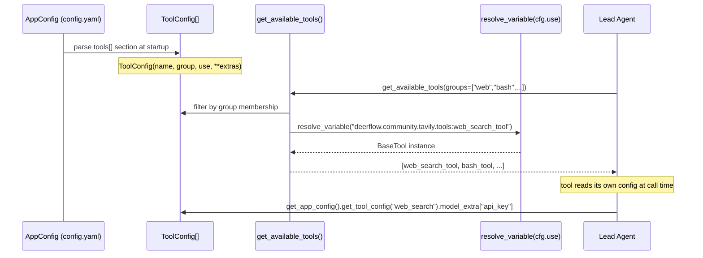
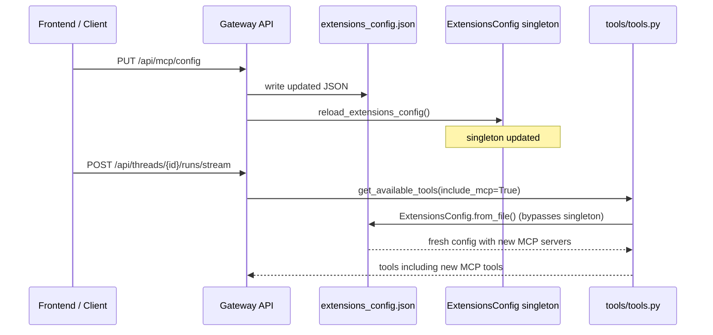

# Config System — Phases 5 & 6: Tool, Skill, and Runtime Feature Configs

## Purpose

Phases 5 and 6 of Section 17 cover the config modules that control DeerFlow's
tool assembly pipeline, the skills and extensions registry, and the four
runtime-feature subsystems: sandbox, guardrails, memory, and stream bridge.

Together they reveal a single recurring design: **one flat Pydantic model per
subsystem, all wired into `AppConfig` at startup, each backed by a module-level
singleton for call-site convenience.**

## Key Files

**Phase 5 — Tool and skill configs:**

- `config/tool_config.py` — `ToolConfig` + `ToolGroupConfig`; open-schema shapes for `config.yaml`'s `tools[]` and `tool_groups[]`
- `config/tool_search_config.py` — single `enabled` flag controlling deferred MCP tool loading
- `config/skills_config.py` — skills directory path resolution and storage backend class
- `config/skill_evolution_config.py` — agent self-evolution gate (annotated in §13, re-read here)
- `config/extensions_config.py` — `ExtensionsConfig`; the MCP/skill registry loaded from `extensions_config.json`

**Phase 6 — Runtime feature configs:**

- `config/sandbox_config.py` — `SandboxConfig`; one flat schema covering both LocalSandboxProvider and AioSandboxProvider
- `config/guardrails_config.py` — pre-tool-call auth middleware config; fail_closed posture
- `config/memory_config.py` — dual-switch memory subsystem; debounce, thresholds, injection budget
- `config/stream_bridge_config.py` — SSE event buffer per run; only `memory` backend implemented

## Important Concepts

### The Open-Schema Pattern (`extra="allow"`)

`ToolConfig`, `ToolGroupConfig`, `McpServerConfig`, `McpOAuthConfig`, `ExtensionsConfig`, and `SandboxConfig` all declare `model_config = ConfigDict(extra="allow")`.

Any YAML key beyond the declared fields is captured in Pydantic's `model_extra` dict. Each community tool reads its own extras via:

```python
config = get_app_config().get_tool_config("web_search")
api_key = config.model_extra.get("api_key")
```

This means `tool_config.py` never needs to know about Tavily API keys, Serper max_results, or InfoQuest time ranges — those are owned by the tools themselves. The config schema is stable; the per-tool surface is unbounded.

The same pattern applies to `SandboxConfig`: `provisioner_url` (used by the Kubernetes/provisioner mode) is not a declared field — it lives in `model_extra` and is accessed via `getattr(sandbox_config, "provisioner_url", None)`.

### Tool Groups as Capability Buckets

The four built-in groups and which tools they contain:

| Group        | Tools                                     |
| ------------ | ----------------------------------------- |
| `web`        | `web_search`, `web_fetch`, `image_search` |
| `file:read`  | `ls`, `read_file`, `glob`, `grep`         |
| `file:write` | `write_file`, `str_replace`               |
| `bash`       | `bash`                                    |

`get_available_tools(groups=["web"])` in `tools/tools.py:75` filters `config.tools` by group. Subagents use this: `bash_agent` receives only `["bash", "file:read", "file:write"]`. Groups are purely data-driven — no hardcoded list in source code.

### Two Config Files, Different Update Semantics

DeerFlow splits configuration across two files:

| File                     | Format | Hot-reload                            | Updated by             |
| ------------------------ | ------ | ------------------------------------- | ---------------------- |
| `config.yaml`            | YAML   | mtime-based (automatic)               | Operator only          |
| `extensions_config.json` | JSON   | Manual (`reload_extensions_config()`) | Gateway API at runtime |

`extensions_config.json` can be written by the Gateway API (e.g. `PUT /api/mcp/config`, `PUT /api/skills/{name}`) without restarting the server. The MCP tool assembly path (`tools/tools.py:134`) bypasses the `ExtensionsConfig` singleton entirely and calls `ExtensionsConfig.from_file()` directly — this is how MCP changes made via the API are picked up on the next agent turn without an explicit reload.

### Skill Evolution: Config Gates, Agent Decides

Both the skill evolution prompt section and `skill_manage_tool` are gated by the same `skill_evolution.enabled` flag — they are always in sync. However, the flag controls **availability**, not **invocation**. The agent still decides at runtime whether to call `skill_manage_tool`.

The real risk surfaced during study: the agent could reason "I should create a skill" and then write YAML/scripts directly via `bash` or `write_file`, bypassing the validation pipeline in `skills/installer.py` (parser → validator → security scanner → storage).

The system prompt guidance at `prompt.py:176-186` uses soft language ("consider", "prefer") — it signals when to evolve skills but does not name `skill_manage` as the mandatory mechanism. Adding an explicit constraint in the `skill_manage_tool` docstring is more reliable than a system prompt note, because tool descriptions fire at the moment the model is choosing between tools — the highest-salience point for the constraint.

### SandboxConfig: One Schema, Two Backends

`SandboxConfig` is a flat Pydantic model that serves two very different sandbox implementations. Fields like `image`, `port`, `replicas`, and `idle_timeout` are Docker-specific and silently ignored by `LocalSandboxProvider`. Fields like `allow_host_bash` are local-specific and irrelevant to AioSandboxProvider.

The output truncation fields (`bash_output_max_chars`, `read_file_output_max_chars`, `ls_output_max_chars`) are neither local nor Docker concerns — they are **LLM context-window budget controls** that apply regardless of which sandbox is active. `sandbox/tools.py` reads them at call time to middle-truncate (bash) or head-truncate (read_file, ls) tool output before it enters the model context.

### Memory: Two Independent Switches

`MemoryConfig` has two separate boolean flags:

- `enabled` — gates the **collection pipeline**: MemoryMiddleware queues conversations, the debouncer fires, and the updater LLM runs
- `injection_enabled` — gates **prompt injection**: stored facts appear in the `<memory>` block of the system prompt

These are independent. You can set `enabled=True, injection_enabled=False` to run silent background learning (accumulating facts) without spending context tokens on injection. The reverse (`enabled=False, injection_enabled=True`) would inject nothing — there is nothing collected to inject.

### Singleton Initialization Patterns

Three different initialization strategies are used across the config singletons:

| File                      | Initial state                                    | Why                                                                            |
| ------------------------- | ------------------------------------------------ | ------------------------------------------------------------------------------ |
| `memory_config.py`        | `MemoryConfig()` (eager default)                 | Called from 7 modules; must be safe before AppConfig loads                     |
| `tool_search_config.py`   | `None` → lazy `ToolSearchConfig()` on first call | Safe default; AppConfig wires it at startup                                    |
| `guardrails_config.py`    | `None` → lazy `GuardrailsConfig()` on first call | Same pattern; has `reset_` for test isolation                                  |
| `stream_bridge_config.py` | `None` (stays None if section absent)            | Entire section is optional; callers check for None and use hardcoded fallbacks |

## Execution Flow

How a tool gets assembled per run, from config to bound LangChain tool:



How `extensions_config.json` changes reach the next agent turn without a restart:



## My Insights

**The open-schema pattern is a deliberate extensibility choice.** `ToolConfig` never needs to know about Tavily API keys or Exa `search_type` — those concerns belong to each community tool. This keeps the config schema stable as new tool providers are added. The trade-off is that typos in extra fields fail silently (Pydantic just stores them in `model_extra` without validation).

**Two files, two update semantics is the right split.** Operator-owned settings (models, sandbox, feature flags) go in `config.yaml` with automatic hot-reload. Runtime-mutable settings (which MCP servers and skills are active) go in `extensions_config.json` with API-driven updates. Mixing them would either force a restart on every MCP toggle or make core config writeable by the agent — neither is acceptable.

**`fail_closed=True` on guardrails is a meaningful security default.** The alternative (fail-open) would let every tool call pass if the policy evaluator is down. For an agent that can execute bash commands and write files, that's a significant exposure. The default assumes the policy infrastructure is more reliable than an unchecked agent.

**The redis stream bridge stub is a design commitment.** The `Literal["memory", "redis"]` type and `redis_url` field were added before the implementation exists. This reserves the config namespace and makes the future migration non-breaking — operators can already write `type: redis` in their config without a schema error. The actual backend switch in `async_provider.py` is not yet wired.

## Open Questions

- `stream_bridge_config.py` declares `redis` as a valid type but `async_provider.py` has no branch for it. If an operator sets `type: redis`, what actually happens? Does it silently use memory? Should there be a startup warning?
- `memory_config.py` uses manual `rsplit(".", 1)` + `importlib` for `storage_class` reflection, while the rest of the harness uses `resolve_class()`. Is this intentional (different error handling) or an oversight?

## Links to Related Sections

- [[17a-config-app-config]] — root loader that wires all these singletons at startup
- [[17b-config-paths-persistence-agents]] — Phases 2–4: paths, database, checkpointer, agents
- [[12a-tools-primitives-registry]] — `get_available_tools()` consumes `ToolConfig`
- [[13b-skills-processing-install]] — skill installer pipeline that `skill_manage_tool` must go through
- [[15d-sandbox-provider-middleware]] — SandboxProvider factories that read `SandboxConfig`
- [[10-memory-system]] — memory subsystem that reads `MemoryConfig`
- [[07e-stream-bridge]] — `MemoryStreamBridge` that reads `StreamBridgeConfig`
