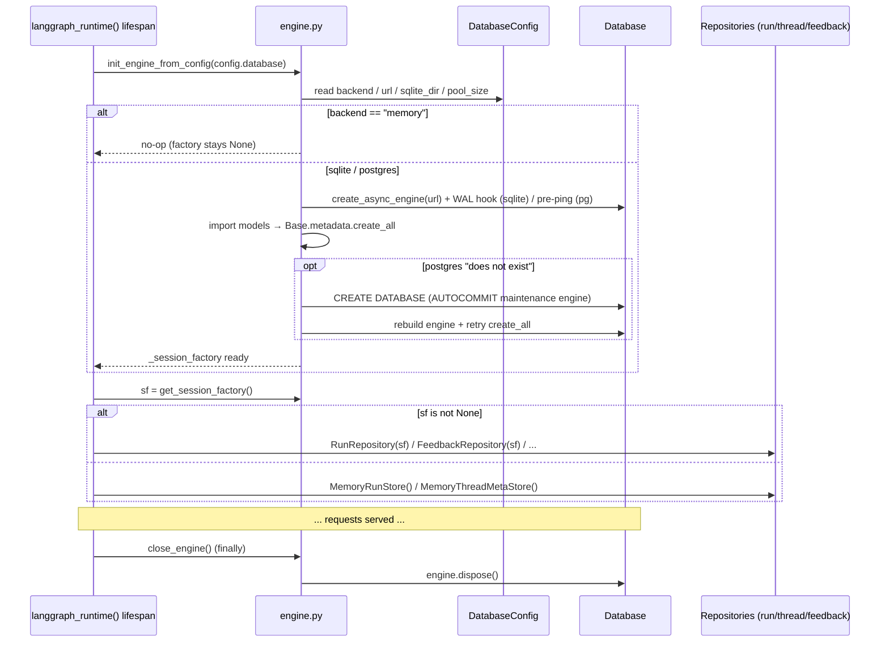
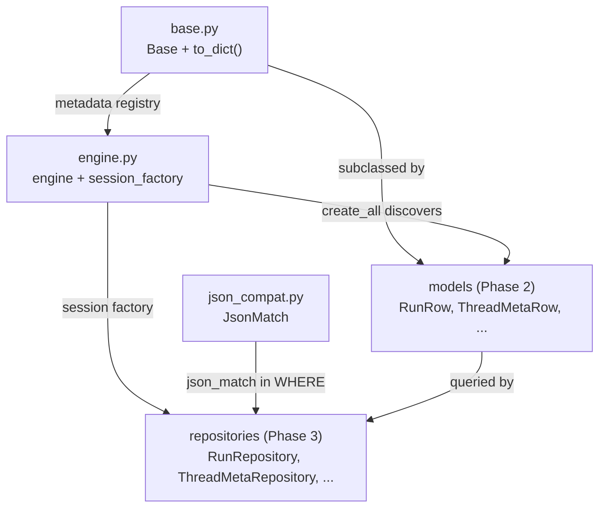

# Section 18a — Persistence: Foundation (Phase 1)

## Purpose

Phase 1 of the persistence layer is the three-file foundation every ORM model and
repository sits on: the async SQLAlchemy **engine lifecycle** (`engine.py`), the shared
**declarative base** (`base.py`), and the dialect-portable **JSON matching** layer
(`json_compat.py`). Together they answer three infrastructure questions before any table
or query exists:

1. _How does DeerFlow connect to a database, and how is that connection's lifetime managed?_
   → `engine.py` (one process-wide engine + session factory, created at Gateway startup,
   disposed at shutdown).
2. _What do all ORM models share for free?_ → `base.py` (a generic `to_dict()` + `__repr__`
   via column inspection).
3. _How do we filter inside a JSON column without picking SQLite **or** Postgres?_ →
   `json_compat.py` (a custom compiled SQL expression that emits correct, injection-safe,
   type-aware SQL on **both**).

The throughline is the same one that runs through all of Section 18: **stay portable, push
correctness to the boundary, and keep the database layer deliberately thin.** This note
documents each file, the execution flow, verified dry-run SQL, and the confusions that
surfaced while studying them.

> Companion notes:
>
> - [[18b-orm-models]] — Phase 2: the five ORM models built on this foundation
> - [[18c-repositories]] — Phase 3: the repositories that consume the session factory + `json_match`
> - [[soft-references-repository-pattern]] — the no-FK / repository-navigation pattern

## Key Files

| File                         | Role                                                                            |
| ---------------------------- | ------------------------------------------------------------------------------- |
| `persistence/engine.py`      | Async engine + session-factory singletons; backend selection; table auto-create |
| `persistence/base.py`        | `DeclarativeBase` subclass giving every model `to_dict()` + `__repr__`          |
| `persistence/json_compat.py` | `JsonMatch` — dialect-portable, injection-safe `column[key] == value` for JSON  |
| `persistence/__init__.py`    | Public surface: re-exports `init_engine`, `close_engine`, `get_session_factory` |

## Important Concepts

- **Three backends, one code path** — `memory` (no-op; everything falls back to in-memory
  stores), `sqlite` (single-node default), `postgres` (multi-node prod). The same
  `init_engine()` handles all three, and `json_compat.py` makes queries behave identically
  on the two real ones.

- **Module-level singletons** — `_engine` and `_session_factory` are process-global,
  initialized exactly once inside the `langgraph_runtime()` lifespan (`app/gateway/deps.py`),
  shared by every repository. `get_session_factory()` returning `None` is the contract that
  signals "no DB — use in-memory."

- **`expire_on_commit=False` is load-bearing for async** — without it, accessing an ORM
  attribute after commit triggers an implicit lazy-load SQL round-trip, which raises
  `MissingGreenlet` in async SQLAlchemy. This single flag is what makes `base.py`'s
  `to_dict()` safe to call on a row whose session has already closed.

- **`to_dict()` is mechanical; repos adapt** — `base.py` does a pure column→value mapping
  (no relationships, so no lazy loads). Each repository wraps it in `_row_to_dict()` to remap
  `*_json` columns back to clean API names and ISO-format datetimes. Two clean layers.

- **The key/value security asymmetry** — in `json_compat.py`, filter **values** flow through
  parameterized `bindparam` (driver-escaped, injection-proof), but filter **keys** are
  string-interpolated into the JSONPath (`$."key"` / `-> 'key'`) because they're structural.
  That asymmetry is _why_ keys get a strict `[A-Za-z0-9_-]+` charset gate and values only get
  a type/range gate.

## Per-File Deep Dive

### 1. `engine.py` — async engine lifecycle

```python
_engine: AsyncEngine | None = None            # process-wide singletons
_session_factory: async_sessionmaker | None = None

init_engine(backend, *, url, echo, pool_size, sqlite_dir)  # create + auto-create tables
init_engine_from_config(config)                            # convenience wrapper over DatabaseConfig
get_session_factory() -> async_sessionmaker | None         # None when backend == "memory"
get_engine() -> AsyncEngine | None
close_engine()                                             # dispose on shutdown
```

Key mechanisms and the _why_ behind each:

- **`memory` backend is an early-return no-op.** No engine, no factory. Every repository must
  handle `get_session_factory() is None` and fall back to an in-memory implementation
  (`MemoryRunStore`, `MemoryThreadMetaStore`). This is the seam that lets the whole system run
  with zero persistence in dev/tests.

- **SQLite WAL via a per-connection event listener.** PRAGMA settings in SQLite are
  **per-connection, not per-database** — so running PRAGMA once at startup would only configure
  the first pooled connection. The `@event.listens_for(_engine.sync_engine, "connect")` hook
  re-applies `journal_mode=WAL`, `synchronous=NORMAL`, `foreign_keys=ON` on _every_ new
  connection. WAL gives concurrent readers + one writer without blocking — the standard
  production SQLite posture.

- **`pool_pre_ping=True` (Postgres).** Sends a lightweight `SELECT 1` before each checkout to
  detect stale connections after a DB restart, instead of surfacing a broken-connection error
  to the caller.

- **`_json_serializer` with `ensure_ascii=False`.** The default JSON serializer escapes
  non-ASCII as `\uXXXX`; this preserves CJK characters as-is in JSON columns.

- **Table auto-create with a models-import dance.** `Base.metadata.create_all` only knows about
  tables whose model classes have been imported into the registry, so `init_engine` imports
  `deerflow.persistence.models` (the import hub) first. Both `Base` and the models are imported
  **inside** the function (deferred) to keep `engine.py` a dependency-free leaf module.

- **Postgres auto-create-on-first-run.** If `create_all` fails with `"does not exist"`,
  `_auto_create_postgres_db()` connects to the `postgres` _maintenance_ database with
  `isolation_level="AUTOCOMMIT"` (mandatory — `CREATE DATABASE` cannot run inside a
  transaction), issues `CREATE DATABASE`, disposes that engine, then **rebuilds the primary
  engine from scratch** and retries. The full rebuild is required because the original engine
  was bound to a database that didn't exist yet.

#### Dry-run: `sqlite_dir` vs the DB file path (a genuine point of confusion)

A natural question reading `init_engine`: _if it just does `os.makedirs(sqlite_dir or ".")`,
how does SQLite know the actual file path?_

Answer: **they're two independent parameters.** `os.makedirs` only ensures the parent
**directory** exists; the **file** path is carried entirely in `url`.

```python
# database_config.py
sqlite_path        = os.path.join(_resolved_sqlite_dir, "deerflow.db")   # full file path
app_sqlalchemy_url = f"sqlite+aiosqlite:///{sqlite_path}"                # url carries it

# init_engine_from_config(...)
init_engine(backend="sqlite",
            url=config.app_sqlalchemy_url,   # ← file path lives here
            sqlite_dir=config.sqlite_dir)    # ← parent dir to pre-create
```

So `create_async_engine(url, ...)` already has the file path baked into `url`. The
`os.makedirs` call just guarantees the directory exists first (SQLite won't create missing
parent dirs). The `sqlite_dir or "."` fallback is a no-op safety net: "if nothing was passed,
makedirs the CWD, which already exists." It has **zero** effect on where the DB lands.

### 2. `base.py` — the shared declarative base

```python
class Base(DeclarativeBase):
    def to_dict(self, *, exclude=None) -> dict:
        exclude = exclude or set()
        return {c.key: getattr(self, c.key)
                for c in sa_inspect(type(self)).mapper.column_attrs
                if c.key not in exclude}
    def __repr__(self) -> str: ...
```

- **`column_attrs`, not `attrs`** — deliberately iterates only **mapped columns**, excluding
  relationships. The consequence: `to_dict()` never triggers a lazy-load query and is safe on a
  detached row. This dovetails exactly with `engine.py`'s `expire_on_commit=False` — together
  they let you serialize a committed row after its session closes without a greenlet error.
- **`Base.metadata` is the registry** `engine.py`'s `create_all` walks — the architectural
  reason every model must be imported before table creation.
- **Two-layer serialization** — `to_dict()` is purely mechanical; repos add the schema→API
  translation in `_row_to_dict()` (remap `metadata_json`→`metadata`, ISO-format datetimes).
- The docstring draws the key boundary: **LangGraph's checkpointer tables are NOT managed by
  this Base.** DeerFlow's app data and LangGraph's graph state are separate schemas.

### 3. `json_compat.py` — dialect-portable JSON matching

The most intricate file in the layer. `JsonMatch` is a custom SQLAlchemy `ColumnElement` that
lets `ThreadMetaRepository.search()` express `WHERE metadata_json[key] == value` and have it
compile to correct SQL on both dialects.

- **`@compiles(JsonMatch, "sqlite" | "postgresql")`** registers two dialect-specific SQL
  emitters; a default `@compiles` raises `NotImplementedError` for anything else (fail-closed).
  SQLite uses JSON1 functions (`json_type` / `json_extract`, JSONPath `$."key"`); Postgres uses
  operators (`json_typeof`, `->`, `->>`).

- **`_Dialect` frozen dataclass** factors out every per-dialect string (type names, cast
  targets, the optional int guard) so `_build_clause` stays dialect-agnostic.

- **`inherit_cache = True` + `_traverse_internals`** plug the element into SQLAlchemy's
  statement cache. `dp_plain_obj` for `value` requires the value to be **hashable** — which is
  the _real_ reason `validate_metadata_filter_value` rejects `list`/`dict`, beyond type safety.

- **Three cross-dialect footguns handled explicitly:**
  - **bool-before-int ordering** — Python `bool` subclasses `int`, so the bool branch must
    precede the int branch or `True`/`False` would compile as `1`/`0` and mismatch JSON
    booleans. Load-bearing order.
  - **Postgres `int_guard` regex** — PG's `json_typeof` returns `'number'` for ints _and_
    floats, so a `CASE WHEN ... ~ '^-?[0-9]+$'` guard ensures the `BIGINT` cast only fires on
    integer text. SQLite's `json_type` already distinguishes `integer` from `real`, so
    `int_guard=None` there.
  - **int64 range check** — rejected at validation time because SQLite overflows on bind and
    Postgres overflows during the `BIGINT` cast.

- **NULL-value vs missing-key** — `value is None` compiles to `json_type(...) = 'null'`, which
  matches a JSON `null` but **not** an absent key (an absent key makes `json_type` return SQL
  `NULL`, so the equality is false). The two are correctly distinguished.

#### Dry-run: verified compiled SQL for every value type

Empirically compiled (`expr.compile(dialect=...)`) for
`json_match(metadata_json, key, value)`:

**SQLite**

| Input                | Compiled SQL                                                                                                            |
| -------------------- | ----------------------------------------------------------------------------------------------------------------------- |
| `project="deerflow"` | `(json_type(metadata_json, '$."project"') = 'text' AND json_extract(metadata_json, '$."project"') = ?)`                 |
| `n=42`               | `(json_type(metadata_json, '$."n"') = 'integer' AND CAST(json_extract(metadata_json, '$."n"') AS INTEGER) = ?)`         |
| `flag=True`          | `json_type(metadata_json, '$."flag"') = 'true'`                                                                         |
| `x=None`             | `json_type(metadata_json, '$."x"') = 'null'`                                                                            |
| `r=1.5`              | `(json_type(metadata_json, '$."r"') IN ('integer', 'real') AND CAST(json_extract(metadata_json, '$."r"') AS REAL) = ?)` |

**PostgreSQL**

| Input                | Compiled SQL                                                                                                                                                         |
| -------------------- | -------------------------------------------------------------------------------------------------------------------------------------------------------------------- |
| `project="deerflow"` | `(json_typeof(metadata_json -> 'project') = 'string' AND (metadata_json ->> 'project') = %(param_1)s)`                                                               |
| `n=42`               | `(CASE WHEN json_typeof(metadata_json -> 'n') = 'number' AND (metadata_json ->> 'n') ~ '^-?[0-9]+$' THEN CAST((metadata_json ->> 'n') AS BIGINT) END = %(param_1)s)` |
| `flag=True`          | `(json_typeof(metadata_json -> 'flag') = 'boolean' AND (metadata_json ->> 'flag') = 'true')`                                                                         |
| `x=None`             | `json_typeof(metadata_json -> 'x') = 'null'`                                                                                                                         |
| `r=1.5`              | `(json_typeof(metadata_json -> 'r') = 'number' AND CAST((metadata_json ->> 'r') AS DOUBLE PRECISION) = %(param_1)s)`                                                 |

Observations worth keeping:

- The `?` (SQLite) / `%(param_1)s` (Postgres) placeholders prove the **value** is always a
  bound parameter — never interpolated. Only the **key** appears inline (gated by the charset
  validator).
- The `str` value branch is the only one with no type guard beyond the `text`/`string` type
  check, because string equality needs no cast.
- The `float` SQLite branch accepts `integer` _or_ `real` (`num_types`), so `r=1.5` matching a
  JSON value stored as `1.5` works regardless of how SQLite typed it.

#### Dry-run: how the consumer degrades gracefully

`ThreadMetaRepository.search()` applies each filter in a `try/except`; unsafe keys/values are
logged and skipped, and only if **every** filter is rejected does it raise
`InvalidMetadataFilterError` (surfaced as a 400):

```python
for key, value in metadata.items():
    try:
        stmt = stmt.where(json_match(ThreadMetaRow.metadata_json, key, value))
        applied += 1
    except (ValueError, TypeError) as exc:
        logger.warning("Skipping metadata filter key %s: %s", ascii(key), exc)
if applied == 0:
    raise InvalidMetadataFilterError(...)
```

So `{"project": "deerflow", "bad key!": 1}` filters on `project` and silently drops the
malformed key — a partial-valid filter still works.

## Execution Flow

### Engine lifecycle (startup → repositories → shutdown)



### How the three files relate



## My Insights

**The foundation's entire personality is "thin and portable."** `engine.py` supports three
backends through one path; `base.py` gives models exactly two free behaviors and nothing more;
`json_compat.py` exists solely so the query layer never has to know which database it's talking
to. None of the three encodes business rules — they're pure infrastructure that keeps the door
open for both SQLite and Postgres. This is the same philosophy [[18b-orm-models]] shows in the
schema (no FKs, no enums, no CHECKs): the database stays dumb so the architecture stays
flexible.

**`expire_on_commit=False` and `column_attrs` are a hidden matched pair.** Read in isolation
each looks like a minor flag. Together they encode one decision: _ORM rows must be safely
usable after their session closes._ The first stops post-commit attribute access from issuing
SQL; the second stops `to_dict()` from walking relationships that would. In async SQLAlchemy,
forgetting either turns an innocent `row.to_dict()` into a `MissingGreenlet` crash. The
foundation gets this right once so no repository has to think about it.

**`json_compat.py` is the most "real engineering" file in the section.** It's the one place
where the portability promise is actually _hard_ — JSON typing differs between the two
databases in three separate, non-obvious ways (bool-as-int, number-vs-integer, overflow
bounds), and each is handled with a specific, tested mechanism. The `@compiles` +
`_traverse_internals` machinery is advanced SQLAlchemy most codebases never reach for. If a
Medium article wants one "this is the clever bit" file from Section 18, this is it.

**Security here is structural, not bolted on.** The injection defense isn't a sanitizer pass —
it's the _shape_ of the code: values are bound (provably safe), keys are validated against a
charset because they _must_ be interpolated. Once you see that values can be parameters and
keys cannot, every validation decision in the file is forced rather than chosen.

## Confusions & Corrections (from the study session)

1. **`os.makedirs(sqlite_dir or ".")` does not locate the DB file.** First glance suggests the
   directory creation is how SQLite finds the database. It isn't — the file path lives entirely
   in `url` (`sqlite+aiosqlite:///{sqlite_path}`), assembled in `database_config.py`. `makedirs`
   only ensures the parent directory exists; `sqlite_dir or "."` is a no-op fallback with no
   effect on the file location. (Full trace in the Dry-run above.)

2. **The "list/dict rejected" rule is about hashability, not just types.** Reading
   `validate_metadata_filter_value`, it's tempting to conclude lists/dicts are rejected purely
   because the SQL builder doesn't know how to compile them. The deeper reason is the
   `dp_plain_obj` cache-traversal contract requiring the value to be hashable — an unhashable
   value would break SQLAlchemy's statement-cache fingerprinting. Both reasons hold; the cache
   one is the non-obvious half.

3. **bool/int and number/integer are two _different_ ordering hazards, not one.** The
   bool-before-int branch order (Python-level: `bool` ⊂ `int`) and the Postgres `int_guard`
   regex (SQL-level: `json_typeof` returns `'number'` for both) both stem from "ints aren't
   cleanly separable," but they're solved in different layers — one by branch ordering in
   Python, the other by a `CASE`/regex guard in emitted SQL.

## Open Questions

- **`"does not exist" in str(exc)` is a substring match, not a typed-exception catch.** The
  Postgres auto-create fallback keys off the error _text_. Could this match unrelated errors
  (a missing table, a missing schema, a role error that happens to contain the phrase)? Worth
  checking whether asyncpg raises a typed `InvalidCatalogName` that could be matched precisely
  instead. Low risk in practice (it only runs on the very first boot) but fragile.

- **`create_all` vs schema evolution.** `engine.py` auto-creates tables but the comment says
  "Production should use Alembic." `create_all` is a no-op on existing tables, so adding a
  column to a model will **not** alter a live DB — the new column silently won't exist until a
  migration runs. There _are_ Alembic migrations in `persistence/migrations/`; how is their
  state kept consistent with the dev-time `create_all` path? (Defer to Phase 3 / migrations.)

- **Default `@compiles` is currently unreachable.** Only `memory`/`sqlite`/`postgres` are
  supported, so the `NotImplementedError` branch can't fire today. It's a clean fail-closed
  guard if a fourth backend (e.g. MySQL) is ever added — no action, just noting the intent.

## Links to Related Sections

- [[18b-orm-models]] — the five models that subclass `Base` and rely on `create_all` discovery
- [[18c-repositories]] — consume `get_session_factory()` and `json_match`; add the
  `_row_to_dict()` adaptation layer over `base.to_dict()`
- [[soft-references-repository-pattern]] — why the schema has no FKs and navigation lives in repos
- [[07-langgraph-runtime]] — owns the separate checkpointer schema this Base explicitly does NOT manage
- [[17-config-system]] — `DatabaseConfig` (`app_sqlalchemy_url`, `sqlite_dir`, `pool_size`) feeding `init_engine_from_config`
