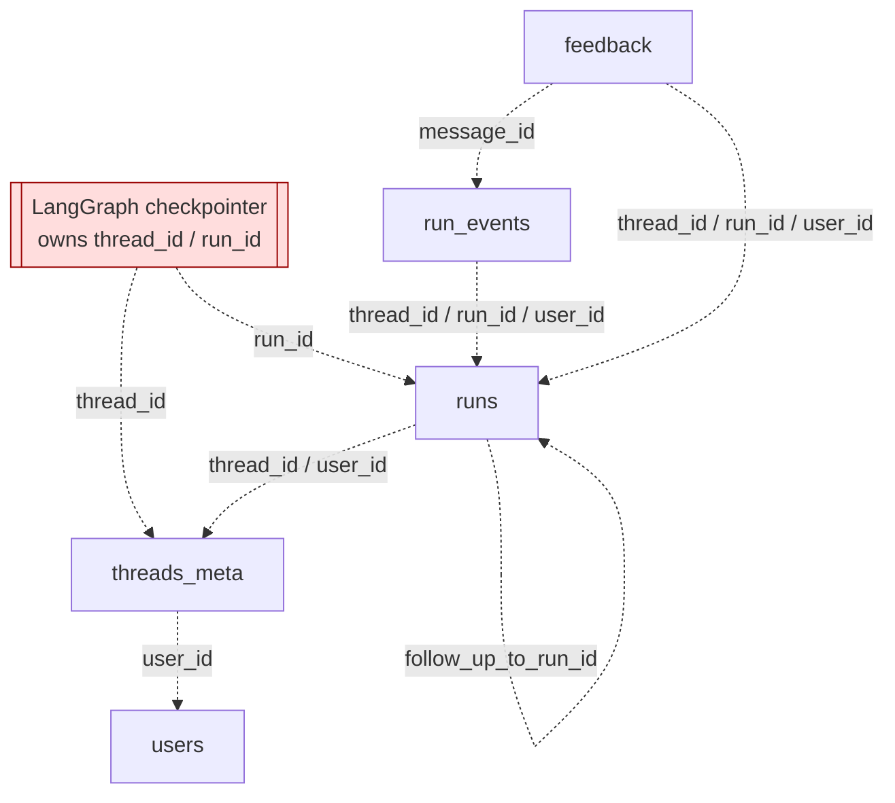
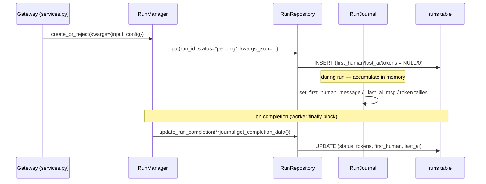

# Section 18b — Persistence: ORM Models (Phase 2)

## Purpose

Phase 2 of the persistence layer is the five SQLAlchemy ORM models that define every
durable table DeerFlow owns: `run_events`, `threads_meta`, `runs`, `feedback`, and
`users`. They sit on top of the Phase-1 foundation (`engine.py`, `base.py`,
`json_compat.py`) and underneath the Phase-3 repositories that read and write them.

Read together, the five models reveal a consistent **modeling philosophy**: a permissive,
portable schema with no foreign keys, no DB enums, and no CHECK constraints — invariants
are pushed _up_ to the application boundary, and relationships are expressed as
soft-reference columns navigated by repository queries. This note documents each model,
the shared conventions, and the design questions/corrections that surfaced while studying
them.

> Companion notes:
>
> - [[soft-references-repository-pattern]] — the cross-cutting "no FK / no relationship()" pattern
> - Phase 1 foundation note (engine/base/json_compat) — `18a`
> - Phase 3 repositories — `18c` (pending)

## Key Files

| File                               | Table          | One-line role                                                       |
| ---------------------------------- | -------------- | ------------------------------------------------------------------- |
| `persistence/models/run_event.py`  | `run_events`   | Append-only event log; messages + traces in one table               |
| `persistence/thread_meta/model.py` | `threads_meta` | Mutable sidecar projection of a LangGraph thread                    |
| `persistence/run/model.py`         | `runs`         | Mutable run record with denormalized summaries + token rollups      |
| `persistence/feedback/model.py`    | `feedback`     | Per-user 👍/👎 rating on a run/message                              |
| `persistence/user/model.py`        | `users`        | Identity/auth anchor for every `user_id` reference                  |
| `persistence/models/__init__.py`   | —              | Import hub so `Base.metadata` sees all five tables for `create_all` |

## Important Concepts

- **The four-shape modeling taxonomy** — the five tables fall into clearly different
  archetypes:

  | Model         | PK style                             | Mutable?         | Distinctive trait                                |
  | ------------- | ------------------------------------ | ---------------- | ------------------------------------------------ |
  | `run_event`   | synthetic `id` + thread-scoped `seq` | append-only      | partition-by-`category`                          |
  | `thread_meta` | natural (`thread_id`)                | yes (`onupdate`) | shared-ownership via NULL `user_id`              |
  | `run`         | natural (`run_id`)                   | yes              | denormalized rollups, write-once tokens          |
  | `feedback`    | **surrogate** (`uuid4`)              | yes (via upsert) | surrogate PK + natural unique key                |
  | `user`        | surrogate (`uuid4`-as-text)          | yes              | boundary inversion (table here, logic in `app/`) |

- **The `*_json` naming idiom** — `event_metadata`, `metadata_json`, `kwargs_json`. The
  word `metadata` is reserved on `DeclarativeBase` (`Base.metadata` is the table registry),
  so every JSON blob is renamed and remapped back to its API name in the repository's
  `_row_to_dict`.

- **The nullable + indexed `user_id` owner column** — present on `run_event`,
  `thread_meta`, `run`, `feedback`. `NULL` means "shared / pre-auth / background-worker
  write"; a concrete value means "owned." Every repository applies
  `WHERE user_id == resolved` for isolation. This is the spine of per-user data isolation.

- **Soft references, not foreign keys** — `thread_id`, `run_id`, `message_id`,
  `follow_up_to_run_id` are plain indexed `String` columns. No `ForeignKey()`, no
  `relationship()` anywhere in the package. See [[soft-references-repository-pattern]].

- **Invariants at the boundary** — `system_role` is a Pydantic `Literal`, not a DB enum;
  `rating` is checked `±1` in Python, not a DB CHECK. The schema stays portable; the app
  enforces correctness.

## Per-Model Deep Dive

### 1. `run_event.py` — `RunEventRow` (append-only log)

```python
id            int  PK autoincrement      # synthetic surrogate
thread_id     str(64)                     # soft ref
run_id        str(64)                     # soft ref
user_id       str(64) NULL, index         # owner
event_type    str(32)
category      str(16)                     # "message" | "trace" | "lifecycle"
content       Text  default ""
event_metadata JSON default dict          # renamed to dodge Base.metadata
seq           int                         # thread-scoped monotonic ordering
created_at    datetime tz
__table_args__ = (
  UniqueConstraint(thread_id, seq),
  Index(thread_id, category, seq),
  Index(thread_id, run_id, seq),
)
```

- **`category` is a partition key**, not a label. One physical table serves two logical
  stores: `category="message"` = the frontend display log; `"trace"/"lifecycle"` =
  debug/audit. `db.py` filters on it and truncates _only_ trace content.
- **`seq` is thread-scoped** (not global, not run-scoped). Two concurrent runs in one
  thread share a `seq` counter, producing a single ordered cross-run conversation view.
  `db.py` assigns `max(seq)+1` under a per-thread lock; the `UniqueConstraint(thread_id, seq)`
  is the DB backstop against racing writers.
- **The three `__table_args__` mirror the three read paths** in `runtime/events/store/db.py`
  exactly (proof below).

#### Dry-run: proving the indexes match the queries

| `__table_args__`                   | Query it serves                        | Evidence (`db.py`)                                                               |
| ---------------------------------- | -------------------------------------- | -------------------------------------------------------------------------------- |
| `UniqueConstraint(thread_id, seq)` | seq assignment                         | `select(func.max(seq)).where(thread_id==...)` then `seq = max+1`                 |
| `Index(thread_id, category, seq)`  | `list_messages`                        | `.where(thread_id==, category=="message")` + `.seq</> cursor` + `.order_by(seq)` |
| `Index(thread_id, run_id, seq)`    | `list_events` / `list_messages_by_run` | `.where(thread_id==, run_id==)` + `.order_by(seq)`                               |

Caveat: `user_id` filtering (`.where(user_id==resolved)`) is _not_ covered by these three;
it rides the standalone `index=True` on the `user_id` column. So "mirror exactly" is true
for the primary access pattern, with `user_id` served by its own index.

### 2. `thread_meta/model.py` — `ThreadMetaRow` (mutable sidecar)

- **Natural primary key**: `thread_id` _is_ the PK — the LangGraph-issued id, no synthetic
  autoincrement. A thread is a single mutable row, so the external id maps cleanly to the PK.
  This is the sharpest contrast with `run_event`'s append-only `(id, seq)`.
- **`user_id` nullable = shared/pre-auth**. `check_access` treats `row.user_id is None` as
  accessible to everyone — the genuine orphan-tolerance path.
- **`updated_at` has `onupdate`** as a safety net, but `sql.py` _also_ sets it explicitly
  in every `.values(...)`. So `onupdate` only matters for code paths that forget the column.
- **`metadata_json`** — same reserved-name dodge as `event_metadata`.

### 3. `run/model.py` — `RunRow` (the richest model)

- **Denormalization is the headline**: `message_count`, `first_human_message`,
  `last_ai_message` are copied _out of_ `run_events` so the run-listing page renders without
  a per-row event query. Write-time duplication traded for read-time speed.
- **Token rollups are write-once-on-completion, not incremental**: `RunJournal` accumulates
  in memory during the run; `update_run_completion` flushes all seven token fields in one
  UPDATE. **A run that crashes mid-flight leaves these at 0** — they're a completion
  artifact, not live counters.
- **Composite `Index(thread_id, status)`** is tuned for `aggregate_tokens_by_thread` (the
  only query filtering both columns). `list_by_thread` rides the `thread_id` prefix;
  `list_pending` (status-only, no thread_id) **can't** use it.
- **`follow_up_to_run_id`** is a self-reference _by convention_ — a plain `String`, not a
  `ForeignKey`. No cascade; the link lives in app code.

#### Dry-run: what `kwargs_json` actually holds

`kwargs_json` stores the LangGraph run invocation parameters, set at
[`services.py`] as `kwargs={"input": body.input, "config": body.config}`. Example value:

```json
{
  "input": { "messages": [{ "role": "human", "content": "Summarize the report." }] },
  "config": {
    "configurable": {
      "thinking_enabled": true,
      "model_name": "claude-opus-4-8",
      "is_plan_mode": false,
      "subagent_enabled": true
    }
  }
}
```

So `kwargs_json` = the run's _execution recipe_ (reproduce/resume), while `metadata_json` =
arbitrary client tags (queried via `json_match`). Consequence: the full prompt input is
durably persisted in the `runs` table, not just the `run_events` log.

#### Dry-run: the write chain for `first_human_message` / `last_ai_message`

Both columns are **NULL at INSERT** and written exactly once, at completion:

1. INSERT (`RunRepository.put`) does not set them → default `NULL`.
2. During the run, `RunJournal` accumulates in memory:
   - `first_human_message`: first `HumanMessage` (excluding `name=="summary"`) →
     `set_first_human_message(content[:2000])`.
   - `last_ai_message`: each lead-agent AI message with text →
     `_last_ai_msg = text[:2000]`. Guarded by `caller == "lead_agent"` so subagent/middleware
     replies don't clobber the user-facing answer.
3. At run end, `worker.py` calls `journal.get_completion_data()` →
   `update_run_completion(run_id, **completion)` → one `UPDATE` (`sql.py`, truncates to
   `[:2000]` again — redundant but harmless).

A crash before that final UPDATE leaves both columns `NULL` — same failure mode as token
rollups.

### 4. `feedback/model.py` — `FeedbackRow` (surrogate PK + natural unique key)

- **Surrogate PK**: `feedback_id` is a server-minted `uuid4` (unlike the externally-issued
  `run_id`/`thread_id`). Used for `get`/`delete` by stable identity.
- **Natural unique key** `UniqueConstraint(thread_id, run_id, user_id)` enforces the
  business rule and makes `upsert` correct: `sql.py` selects on this exact triple, and the
  constraint turns a concurrent double-upsert (both see no row, both insert) into an
  `IntegrityError` instead of two duplicate rows.
- **`rating` invariant is Python-only** (`±1` validated in `sql.py`; no DB CHECK). A direct
  DB write of `rating=5` would persist and `aggregate_by_run`'s `case()` counts it as
  _neither_ positive nor negative → `total ≠ positive + negative` silently.
- **`created_at` doubles as last-modified** — no `updated_at`; `upsert` re-stamps
  `created_at` on every edit.

### 5. `user/model.py` — `UserRow` (boundary inversion)

- **Boundary inversion**: the ORM _table_ lives in the harness (so the shared engine's
  `create_all` picks it up), but all auth _domain logic_ lives in `app/gateway/auth/`. The
  app's sqlite repo maps row↔Pydantic `User`. Keeps the harness→app import firewall intact.
- **`token_version` = stateless JWT revocation**: embedded as the `"ver"` JWT claim and
  bumped on password change → old tokens carry a stale `ver` and are rejected, invalidating
  every outstanding token with no server-side session store.
- **Partial unique index** `idx_users_oauth_identity` on `(oauth_provider, oauth_id)` with
  `sqlite_where="oauth_provider IS NOT NULL AND oauth_id IS NOT NULL"` — enforces one
  account per OAuth identity while letting password-only (NULL/NULL) accounts coexist. This
  is the _intentional_ NULL-exclusion fix, vs `feedback`'s reliance on SQL NULL-distinctness.
  **WARN:** `sqlite_where` is SQLite-only; on PostgreSQL the predicate is silently ignored
  (needs `postgresql_where`).
- **`system_role` is a plain `String`, not an Enum** — deliberately, "to avoid ALTER TABLE
  pain." Validation relocated to a Pydantic `Literal["admin","user"]`.

## Execution Flow

### Schema map (soft references, no FKs)



### Run lifecycle: where each column gets written



## My Insights

**The schema is deliberately boring so the architecture can stay flexible.** Across all
five models, DeerFlow consistently refuses to encode invariants in the database: no FKs, no
enums, no CHECK constraints, no relationships. Correctness lives in Pydantic models,
repository methods, and router validation. The payoff is portability (identical behavior on
SQLite and Postgres) and agility (add a role or an event category with zero migration). The
cost is that the database is no longer the last line of defense — every invariant is
maintained by convention through a single write path.

**The models encode a clear append-only-vs-mutable split.** `run_event` is an event log
(synthetic id + monotonic `seq`, never updated); the other four are mutable records
(natural/surrogate keys, `onupdate`, status transitions). Recognizing which archetype a
table is tells you immediately how to reason about its concurrency and ordering guarantees.

**`run` is where the read-optimization thinking shows.** The denormalized summary fields and
the write-once token rollups exist purely so the listing/usage pages are cheap. It's a
textbook CQRS-lite move: the `runs` row is a read model projected from the `run_events`
write model at completion time.

**`feedback` and `user` are a matched pair on the NULL problem.** `feedback` relies on SQL's
"multiple NULLs are distinct" _by accident_ (so anonymous feedback isn't deduped); `user`
solves the same problem _on purpose_ with a partial index that excludes NULL/NULL. Reading
them back-to-back is the clearest lesson in the section on handling nullable uniqueness.

## Confusions & Corrections (from the study session)

These are the points where the first reading was wrong or the source was misleading — worth
preserving because they're the most instructive moments.

1. **"Multiple users can rate one run" — corrected to mostly false.** My first explanation of
   the `feedback` unique key claimed multi-user rating is a live case. It isn't, in the normal
   model: every feedback write endpoint is gated by `@require_permission(..., owner_check=True)`,
   and a thread has exactly one owner. So `(thread, run)` would be functionally sufficient and
   `user_id` is redundant — **except** on shared/legacy NULL-owner threads (where `check_access`
   lets multiple authed users through) and as **forward-compatibility** for a future
   multi-collaborator thread model. The `user_id` dimension is a deliberate hedge, not a
   currently-exercised path. (`run_id` alone would already be unique; `thread_id` is kept for
   index locality, not correctness.)

2. **The `run_event.user_id` comment is misleading.** The source comment says `user_id` is
   "populated … by the boot-time orphan migration on existing rows." Verified false: the only
   boot migration (`_ensure_admin_user` → `_migrate_orphaned_threads`) rewrites **LangGraph
   store thread metadata** and assigns it to the **admin**, never the SQL `run_events` rows.
   The real reason `user_id` is nullable is **background-worker writes** (no auth contextvar →
   `_user_id_from_context()` returns `None`). The migration is store-only and admin-targeted.

3. **Signup does not backfill pre-auth records.** `register` and `/initialize` only
   `create_user` + set a cookie — no `UPDATE` of NULL-owner rows. A new account owns only data
   created _after_ login.

## Open Questions

- **Pre-auth data-loss gap (highest value).** The admin migration claims LangGraph _thread
  ownership_ but not the SQL `run_events` rows (still `NULL`). `resolve_user_id(AUTO)` produces
  a strict `WHERE user_id == id` with no "include NULL" mode, so a claimed thread can appear in
  the admin's list while its **message history is filtered out** of owner-scoped `list_messages`.
  _To verify:_ trace `GET /runs/{rid}/messages` and confirm it passes `AUTO` (strict), not
  `user_id=None`. If confirmed, this is a real silent-history-loss bug for no-auth → with-auth
  upgrades unless the operator runs a manual migration.
- **Missing `(user_id, updated_at)` composite index on `threads_meta`.** `search` orders by
  `updated_at DESC` after filtering `user_id`, but only single-column indexes exist — the sort
  is unindexed. Acceptable at low row counts; a scaling smell.
- **`sqlite_where`-only partial index.** Does a Postgres deployment need a `postgresql_where`
  mirror, or is SQLite the sole supported prod backend? Affects half-NULL OAuth row semantics.
- **Single-write-path assumption.** The FK-free / enum-free / CHECK-free design is safe only
  while every table has one write path through the repository + Pydantic boundary. Is there a
  test guarding that assumption against raw `update()` or admin tooling?

## Links to Related Sections

- [[soft-references-repository-pattern]] — the no-FK / repository-navigation pattern extracted here
- [[07-langgraph-runtime]] — owns the canonical `thread_id`/`run_id`; `RunJournal`,
  `RunEventStore`, `RunStore`, and the `db.py` read paths the indexes are tuned for
- [[06-auth-authorization]] — `UserRow` consumers, `token_version`, `system_role` `Literal`,
  the harness/app boundary
- [[02-system-architecture]] — the harness→app import firewall behind the `UserRow` boundary inversion

---

## Appendix: `runs` vs `run_events` — Deeper Q&A (study session)

This appendix captures a follow-up discussion comparing the two run-related tables and
tracing exactly what each one stores. It expands on the taxonomy table above with the
"why," concrete persistence details, and the read-model rationale.

### A1. The core difference: one summary row vs the event stream

Both tables describe the same execution, but they are **opposite archetypes**. One `run`
has many `run_events`.

| Dimension | `RunRow` (`runs`) | `RunEventRow` (`run_events`) |
| --------- | ----------------- | ---------------------------- |
| **Granularity** | One row **per run** | Many rows **per run** (one per message/trace/lifecycle event) |
| **Archetype** | Mutable record | Append-only log |
| **Primary key** | Natural — `run_id` (externally issued) | Synthetic — `id` autoincrement |
| **Ordering key** | none (single row) | `seq`, **thread-scoped** monotonic |
| **Mutated after insert?** | Yes — `status` transitions, token rollups, summaries at completion | **Never** — written once |
| **Write pattern** | INSERT `pending` → UPDATE at completion | INSERT-only (`put` / `put_batch`) |
| **What it stores** | _Metadata about_ an execution: status, model, kwargs, error, token totals, denormalized first/last message | _The actual content_: each human/AI message, each tool trace, lifecycle events |
| **Partitioning** | `status` (lifecycle state) | `category` = `message` \| `trace` \| `lifecycle` |
| **Indexes** | `(thread_id, status)` — tuned for `aggregate_tokens_by_thread` | `(thread_id, seq)` unique + `(thread_id, category, seq)` + `(thread_id, run_id, seq)` |
| **Relationship side** | the "1" | the "many" (`run_id` soft-ref back to `runs`) |

### A2. The conceptual relationship: read model vs write model (CQRS-lite)

- `run_events` is the **write model / source of truth**. As the agent runs, every message
  and trace is appended. The conversation history _is_ the `run_events` rows.
- `runs` is a **read model projected from `run_events`** at completion. `RunJournal`
  accumulates summaries in memory during the run; `update_run_completion` flushes them into
  the `runs` row in one UPDATE. `first_human_message` / `last_ai_message` / `message_count`
  / token totals are **copies** of facts that already exist (scattered) in `run_events`,
  denormalized onto the `runs` row so listing/usage pages render without scanning the log.

So `runs.last_ai_message` is literally a projection of "the last lead-agent
`category="message"` event for this run."

Two subtle but important distinctions:

1. **`seq` is thread-scoped, not run-scoped.** A `run_event`'s ordering counter spans _all
   runs in a thread_, producing one continuous ordered conversation view across multiple
   runs. `runs`, being one row per run, has no cross-run ordering concept.
2. **Different failure modes.** A run that crashes mid-flight still has its `run_events`
   (appended live and durably), but its `runs` summary fields stay at INSERT defaults
   (`NULL` / `0`) because the completion UPDATE never fired. **The history survives in
   `run_events`; the `runs` summary is blank.** Write model durable; read-model projection
   best-effort.

> Mnemonic: `runs` answers _"what was this run and how did it end?"_ (one mutable summary);
> `run_events` answers _"what actually happened, step by step?"_ (many immutable entries).
> The first is derived from the second.

### A3. What `run_events` actually persists for a run

`run_events` stores everything _generated during_ the run, but is **not** a re-dump of the
prior conversation history. The journal (`runtime/journal.py`) writes these
`category="message"` events:

| Event (`event_type`) | When | Filtering |
| -------------------- | ---- | --------- |
| `llm.human.input` | first human message of the run | **First only** — guarded by `if not self._first_human_msg` |
| `llm.ai.response` | **every** LLM call's output | No first-only guard — fires per model call |
| `llm.tool.result` | each tool execution | per tool result |

Plus non-message events: `run.start` (trace), `run.end` (outputs), `run.error`,
`llm.error` (trace), and `middleware:*` events.

So per run you get: **the triggering human turn (logged once) + every AI response
(including intermediate tool-calling turns) + every tool result.**

Two nuances:

1. **It does not re-log prior history.** When the agent calls the model, the input
   `messages` contain all earlier thread turns — the journal does **not** persist those
   again. It logs only the first _new_ human message and the new AI/tool outputs.
   `run_events` is an **incremental, append-only event stream**, not a snapshot of the
   model's full input context.
2. **It's a parallel log, not the canonical state.** The authoritative conversation _state_
   (for resuming the graph) lives in **LangGraph's checkpointer**. `run_events` with
   `category="message"` is the **readable display/audit log** the frontend reads via
   `list_messages`. Because `seq` is thread-scoped, concatenating a thread's message events
   across all its runs reconstructs the full visible conversation.

### A4. Does `runs` store all messages? No — count + two previews

The `runs` row never holds the full message list. Its only message-related columns:

| Column | Type | Holds |
| ------ | ---- | ----- |
| `message_count` | `int` | a **number**, not content |
| `first_human_message` | `Text` (≤2000) | **one** string — the triggering user turn (preview) |
| `last_ai_message` | `Text` (≤2000) | **one** string — the final lead-agent answer (preview) |
| `kwargs_json` | `JSON` | the run's **input** payload (`{"input": {"messages": [...]}, "config": {...}}`) — the input that started the run, not the produced responses |

The intermediate AI responses and tool results are **not** on the `runs` row at all. To get
the full message history of a run you query `run_events` (filter `thread_id` + `run_id`,
`category="message"`) — exactly what `list_messages_by_run` does.

### A5. Where the messages actually live (three stores)

| Store | Holds | Role |
| ----- | ----- | ---- |
| **LangGraph checkpointer** | full `AgentState.messages` | canonical state, for resuming the graph |
| **`run_events`** (`category="message"`) | human input + every AI response + every tool result | the readable/display log (`list_messages`) |
| **`runs`** | `message_count` + `first_human_message` + `last_ai_message` | summary/preview only |

### A6. Purpose of `first_human_message` / `last_ai_message`

These live on the **`runs` row** (not `run_events`) as **denormalized previews**, written
once at completion. Purpose, stated in `runtime/runs/store/base.py`:

> _"first_human_message / last_ai_message enable a thread 'preview' in the UI without
> re-querying messages."_

**The point is cheap list-view previews.** Rendering a list of N runs/threads (a
conversation sidebar, history page) needs a per-row preview — _what was asked_ and _what was
answered_. Without these two cached strings, each row would trigger its own `list_messages`
query against `run_events` (an N+1 problem). Caching the two display-relevant strings on the
`runs` row lets the listing page do a single `SELECT` over `runs`.

**Why these two specifically:** they bracket the run — first human in → last AI out — giving
a complete question→answer preview at a glance without loading the transcript. Intermediate
AI/tool messages aren't needed for a preview, so they're not denormalized; they stay in
`run_events`, fetched lazily when the user opens the conversation. The `last_ai_message` is
specifically the _lead-agent_ user-facing answer — the `caller == "lead_agent"` guard in the
journal prevents a subagent/middleware reply from becoming the preview.

This is the same CQRS-lite read-model optimization as `message_count` and the token rollups
on the same row: copy the hot-path display fields onto the summary at completion time, at the
cost of write-time duplication and the crash gap (blank summary if the run dies before the
completion UPDATE).
