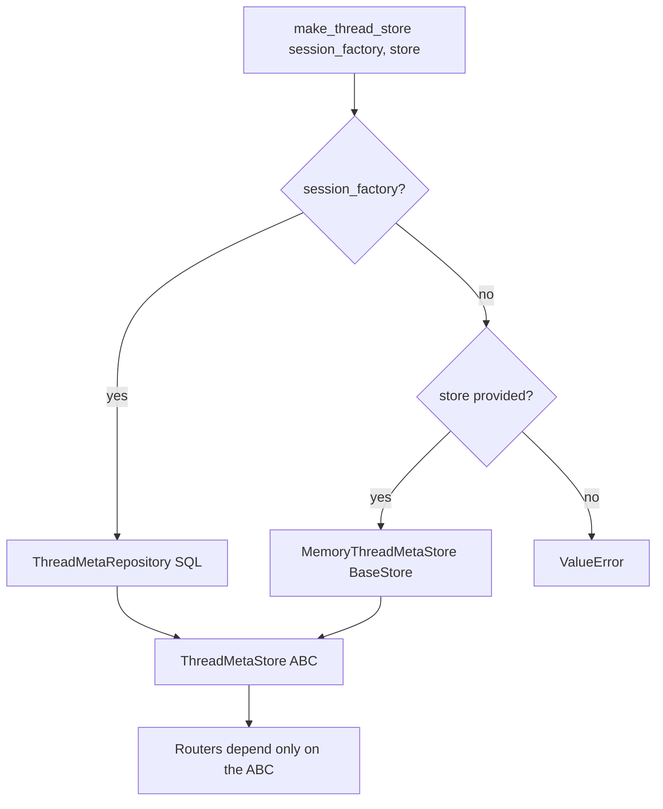
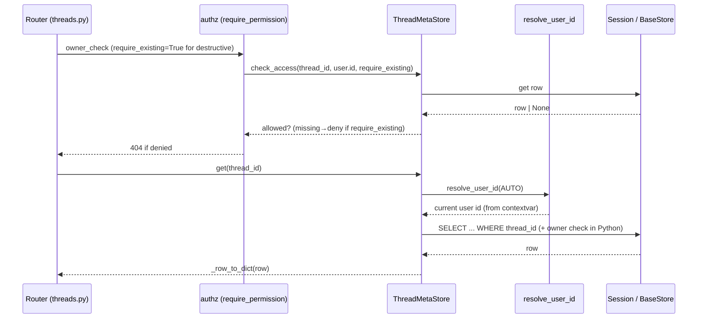
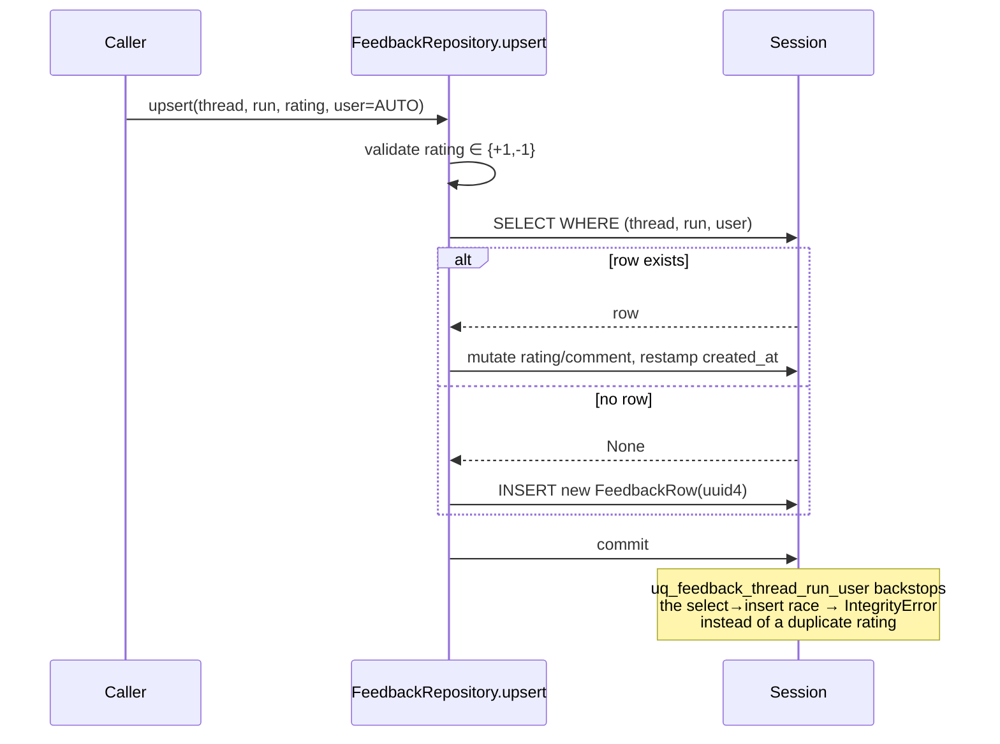
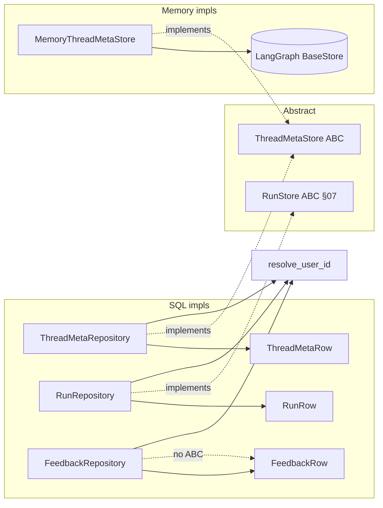

# Section 18c — Persistence: Repositories (Phase 3)

## Purpose

Phase 3 is the **data-access layer** — the repositories that sit on top of the Phase-2
ORM models and turn them into an API the rest of the backend actually calls. Where the
models (`18b`) defined _what_ a row looks like, the repositories define _how_ you read,
write, filter, and aggregate those rows safely.

Three repositories live here, plus one abstract interface and one in-memory twin:

- **`ThreadMetaStore`** (abstract) → `ThreadMetaRepository` (SQL) / `MemoryThreadMetaStore` (LangGraph `BaseStore`)
- **`RunRepository`** (SQL) implementing the `RunStore` interface from §07
- **`FeedbackRepository`** (SQL only — no ABC, no memory twin)

The unifying theme: **per-user data isolation is enforced at the repository boundary**,
not in routers and not in the database. Every owner-scoped method takes a `user_id`
parameter with three-state (`AUTO` / `str` / `None`) semantics, resolves it through
`resolve_user_id()`, and applies (or deliberately skips) a `WHERE user_id == ...` filter.
The repositories are also where the two backends (SQL vs in-memory) are made to return
**byte-identical dicts**, so callers never branch on which backend is live.

## Key Files

| File                                  | Role                                                                                                                   |
| ------------------------------------- | ---------------------------------------------------------------------------------------------------------------------- |
| `persistence/thread_meta/base.py`     | Abstract `ThreadMetaStore` ABC + `InvalidMetadataFilterError`; the CRUD contract both backends satisfy                 |
| `persistence/thread_meta/memory.py`   | `MemoryThreadMetaStore` — wraps a LangGraph `BaseStore` `("threads",)` namespace (used when `database.backend=memory`) |
| `persistence/thread_meta/sql.py`      | `ThreadMetaRepository` — SQLAlchemy impl; metadata JSON filtering, owner isolation, two-mode `check_access`            |
| `persistence/run/sql.py`              | `RunRepository` — implements `RunStore`; run lifecycle writes, token rollups, thread-level aggregation                 |
| `persistence/feedback/sql.py`         | `FeedbackRepository` — 👍/👎 ratings; read-then-write upsert backed by a unique constraint                             |
| `persistence/thread_meta/__init__.py` | `make_thread_store()` factory — picks SQL vs memory by which backend is available                                      |
| `runtime/user_context.py`             | `resolve_user_id()` + the `AUTO`/`_AutoSentinel` sentinel — the isolation primitive every method calls                 |

## Important Concepts

### 1. Three-state `user_id` and `resolve_user_id()`

Every owner-scoped method signs with `user_id: str | None | _AutoSentinel = AUTO`. The
sentinel exists to distinguish three genuinely different intents that `None` alone could
not encode:

- **`AUTO`** (default) — _"resolve the current user from the request contextvar."_ Raises
  `RuntimeError` if no user is in context. This is the normal request-scoped path.
- **explicit `str`** — _"use this id verbatim."_ For tests and admin-override flows.
- **explicit `None`** — _"skip the owner filter entirely."_ Reserved for migration scripts
  and CLI tools that must see all rows.

`resolve_user_id()` also coerces the resolved id to `str` at the boundary, because
`User.id` is a `UUID` on the API surface but the DB column is `String(64)` and aiosqlite
can't bind a raw `UUID` to a VARCHAR. Doing it once here avoids rippling a type change
through every caller. See [[soft-references-repository-pattern]] for why ownership is a
plain indexed column rather than an FK.

### 2. `_row_to_dict` — the backend-parity adapter

Each SQL repo has a static `_row_to_dict` that does two mechanical fixes on top of
`Base.to_dict()`:

1. **Reserved-name un-dodge** — `metadata_json → metadata` (and `kwargs_json → kwargs` for
   runs). The models had to name the column `*_json` because `metadata` is reserved on
   `DeclarativeBase`; the repo restores the public name.
2. **Datetime → ISO string** — so SQL rows match the in-memory backend, which stores
   timestamps as ISO strings already.

This is the single seam that lets `MemoryThreadMetaStore` and `ThreadMetaRepository` be
swapped with zero caller changes.

### 3. Owner isolation is _selective_, by design

Not every method filters by owner — and the exceptions are deliberate:

| Method                                                                             | Owner check? | Why                                                                                                  |
| ---------------------------------------------------------------------------------- | ------------ | ---------------------------------------------------------------------------------------------------- |
| `get` / `delete` / `update_metadata` / `search` / `list_by_thread`                 | **yes**      | user-request paths                                                                                   |
| `RunRepository.update_status` / `update_run_completion`                            | **no**       | called by trusted background workers keyed by `run_id` — the worker already owns the run it executes |
| `RunRepository.list_pending`                                                       | **no**       | scheduler/recovery sweep must see orphaned runs across all users                                     |
| `FeedbackRepository.aggregate_by_run` / `RunRepository.aggregate_tokens_by_thread` | **no**       | run-level aggregate sentiment/usage, not a per-user view                                             |

### 4. Two-mode `check_access` (the delete-idempotence security fix)

`check_access(thread_id, user_id, require_existing=False)` answers "may this user touch
this thread?" with two distinct meanings:

- **`require_existing=False`** (read paths) — a _missing_ row is **accessible** (untracked
  legacy thread → backward-compat). Null owner is shared. Else exact match.
- **`require_existing=True`** (destructive paths) — a missing row is **denied**. This
  closes a real gap: once a thread row is deleted, a permissive check would make the now
  -missing row appear "ownable" by _any_ user, letting one user re-target another's
  just-deleted thread. Both backends implement this identically so authz behaves the same
  regardless of `database.backend`.

### 5. Metadata filtering & SQL-injection defense (SQL only)

`ThreadMetaRepository.search` lets clients filter on arbitrary JSON metadata keys. Each
key is validated by `json_match` (§18 `json_compat.py`) _before_ any dialect-specific JSON
SQL is emitted; an unsafe key raises and is skipped + logged. Only if **every** key is
rejected does it raise `InvalidMetadataFilterError` (→ Gateway 400). A _partial_ rejection
silently narrows the filter — best-effort by design. The memory backend has no such path
because a `BaseStore` filter dict has no injection surface.

### 6. Session-per-method

Every repo method opens its own short-lived `async with self._sf() as session`. Runs in
particular are updated by background workers that may live for minutes; holding a DB
connection open across that window would exhaust the pool. The cost is no cross-method
transaction — each call is its own atomic unit.

## Execution Flow

### Backend selection (`make_thread_store`)

### An owner-scoped read (Gateway → repository → row)

### Feedback upsert (race-safe via unique constraint)

## Architecture Diagrams

### Repository ↔ model ↔ interface map

## My Insights

- **The repository layer is where DeerFlow's multi-tenancy actually lives.** The models
  are tenancy-agnostic (just an indexed `user_id` column); the database has no row-level
  security. Isolation is an _application invariant_ enforced consistently by
  `resolve_user_id` + a `WHERE` clause. That's a pragmatic SQLite-first choice: it works
  identically on SQLite and Postgres without needing RLS, at the cost of one missed
  `WHERE` clause being a cross-tenant leak. The discipline is real but unenforced by the
  engine — exactly the trade-off [[soft-references-repository-pattern]] makes for FKs too.

- **The sentinel is the unsung hero.** Using a singleton `_AutoSentinel` instead of
  overloading `None` is what lets "caller said nothing" (→ use my identity) and "caller
  explicitly wants no filter" (→ migration) coexist. Collapsing those two onto `None`
  would make every migration script a latent isolation bypass _or_ make every request
  path raise. The sentinel buys both safety (default raises if no context) and an escape
  hatch (explicit `None`).

- **Backend parity is enforced by convention, not types.** `MemoryThreadMetaStore` and
  `ThreadMetaRepository` return `dict`, not a shared dataclass, so nothing _forces_ their
  outputs to match — only the discipline of mirrored `_row_to_dict` / `_item_to_dict`.
  This is fragile: a new field added to one backend won't fail to compile if forgotten in
  the other. A typed return (or a shared `_to_public_dict`) would make the parity
  invariant machine-checked. (Logged as an open question.)

- **Feedback's asymmetry is telling.** It has no ABC and no memory twin because feedback
  is a SQL-only feature; the memory backend is for ephemeral/test runs where ratings don't
  matter. Rather than build a no-op memory feedback store for symmetry, the design just
  omits it. Honest minimalism over premature abstraction.

- **Aggregations are pushed into SQL deliberately.** `aggregate_tokens_by_thread`
  (GROUP BY model) and `aggregate_by_run` (case()-sum) do their arithmetic in the database
  rather than pulling rows into Python. Combined with the denormalized token columns on
  `RunRow` (written once on completion), the run-listing and token dashboards stay a single
  query each — the read path is optimized at the cost of write-time duplication.

## Open Questions

- Backend parity between `MemoryThreadMetaStore` and `ThreadMetaRepository` is enforced
  only by mirrored hand-written dict builders. Is there a regression test that asserts the
  two return identical key sets? (`test_memory_thread_meta_isolation.py` exists — does it
  cover shape parity or only isolation?)
- `rating` has no DB `CHECK` constraint; the `+1/-1` invariant is Python-only. A direct DB
  write of an out-of-range rating would make `aggregate_by_run` report
  `total > positive + negative`. Is this acceptable given no path other than the repo
  writes feedback, or should a CHECK be added when Postgres becomes primary?
- `upsert` re-stamps `created_at` on every edit (there is no `updated_at` on feedback).
  Does any consumer rely on `created_at` meaning "first created" rather than "last
  modified"?

## Links to Related Sections

- [[18b-orm-models]] — the ORM models these repositories read and write (Phase 2)
- [[soft-references-repository-pattern]] — the cross-cutting "no FK / no relationship()" philosophy this layer relies on
- [[07f-run-orchestration]] — `RunStore` consumers; how `RunRepository` writes are driven by the run worker
