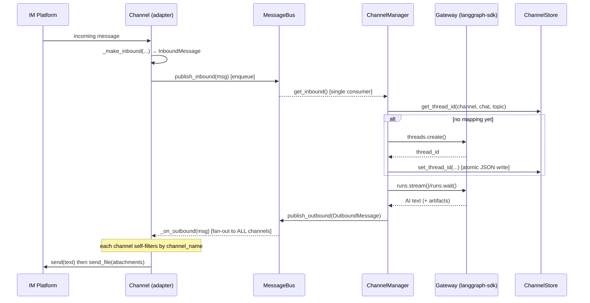
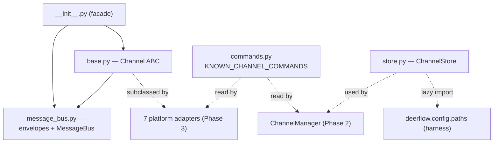

# Section 19a — Channels: Phase 1 Primitives

> Phase 1 of Section 19 (Backend: Channels / IM Integrations).
> Covers the four primitives that every platform adapter is built on top of:
> the package facade, the `Channel` contract, the shared command vocabulary, and
> the conversation→thread persistence store.
> Phases 2–4 (message bus internals, service, manager, the 7 platform adapters,
> and the HTTP router) are documented separately; the Section 19 index file is
> created once all phases are complete.

## Purpose

The channels subsystem bridges external IM platforms (Slack, Telegram, Discord,
Feishu/Lark, DingTalk, WeChat, WeCom) to the DeerFlow agent. Crucially, channels
do **not** call the agent runtime directly — they talk to Gateway over the
`langgraph-sdk` HTTP client, exactly like the web frontend does. That keeps thread
and run lifecycle server-side and means a channel adapter is "just another client."

Phase 1 establishes the vocabulary the rest of the subsystem speaks:

- **What a channel _is_** — the abstract `Channel` lifecycle contract (`base.py`).
- **What flows between channels and the agent** — `InboundMessage` / `OutboundMessage`
  envelopes (defined in `message_bus.py`, re-exported by the package facade).
- **What commands exist** — the single authoritative slash-command set (`commands.py`).
- **How a chat remembers its thread** — the JSON-backed conversation→thread store (`store.py`).

This is a deliberately primitives-first layering: contract + envelopes + vocabulary +
persistence are all defined before a single line of platform-specific code.

## Key Files

- `backend/app/channels/__init__.py` — package facade. Re-exports only `Channel`,
  `InboundMessage`, `OutboundMessage`, `MessageBus`. Orchestration entry points
  (`ChannelManager`, `start_channel_service`) and concrete adapters are intentionally
  **not** exported — callers deep-import them.
- `backend/app/channels/base.py` — the abstract `Channel` base class. Defines the
  `start`/`stop`/`send` contract plus shared plumbing (`_on_outbound`, `_make_inbound`)
  and optional template-method hooks (`supports_streaming`, `send_file`, `receive_file`).
- `backend/app/channels/commands.py` — `KNOWN_CHANNEL_COMMANDS`, the frozenset of slash
  commands (`/bootstrap`, `/new`, `/status`, `/models`, `/memory`, `/help`).
- `backend/app/channels/store.py` — `ChannelStore`, a JSON-file KV store mapping
  `channel:chat[:topic]` → `{thread_id, user_id, created_at, updated_at}`.
- `backend/app/channels/message_bus.py` _(read as a dependency; full annotation in Phase 2)_ —
  defines the `InboundMessage`, `OutboundMessage`, `ResolvedAttachment` dataclasses and
  the `InboundMessageType` enum that `base.py` depends on.

## Important Concepts

- **Channel as a Gateway client** — adapters reach the agent through `langgraph-sdk`,
  not in-process. The whole subsystem is an HTTP client of Gateway. (See backend
  CLAUDE.md "IM Channels System".)

- **The two message envelopes** —
  - `InboundMessage`: platform → agent. Carries `channel_name`, `chat_id`, `user_id`,
    `text`, `msg_type` (CHAT vs COMMAND), `thread_ts`, `topic_id`, `files`, `metadata`.
  - `OutboundMessage`: agent → platform. Carries the same routing fields plus `text`,
    `artifacts`, `attachments` (`ResolvedAttachment`), and `is_final` (streaming flag).

- **`supports_streaming` capability flag** — default `False`. The manager reads it to
  pick `runs.stream()` (incremental card patching for Feishu/DingTalk) vs `runs.wait()`
  (one-shot reply for Slack/Telegram). Adapters opt in by overriding the property.

- **Broadcast-and-self-filter routing** — `Channel._on_outbound` is registered with the
  bus, every channel receives _every_ outbound message, and each one discards what isn't
  `msg.channel_name == self.name`. Routing lives in the channel, not the bus; fan-out is
  O(channels) per outbound message.

- **Template-method hooks with safe defaults** — `send_file` returns `False`
  (no upload support), `receive_file` is a no-op passthrough. `FeishuChannel` overrides
  `receive_file` to download inbound attachments into the sandbox and rewrite `msg.text`
  with their paths.

- **Text-before-files, abort-on-text-failure** — `_on_outbound` sends text first, then
  uploads attachments. If the text send raises, it returns before uploading any file, to
  avoid "files with no accompanying text" partial deliveries.

- **Single source of truth for commands** — both the per-platform parsers and the
  manager dispatcher import `KNOWN_CHANNEL_COMMANDS`, so the detection set and the
  handling set can never drift.

- **Conversation→thread persistence** — `ChannelStore` is what lets a chat resume the
  same agent thread across messages. Key scheme: `channel:chat` for flat conversations,
  `channel:chat:topic` for threaded ones (see "The dual key format" below).

## Execution Flow

The bus decouples channels from the dispatcher in both directions: inbound is a queue
(single consumer), outbound is a callback fan-out (every channel subscribes).



Phase 1 owns the left half (envelope creation, the `Channel` contract, the store
lookup/write); Phases 2–3 own `MessageBus` internals, `ChannelManager`, and the adapters.

## Architecture Diagrams

Dependency map of the Phase 1 primitives:



## The dual key format (deep dive)

`ChannelStore` keys come in two shapes:

1. `channel_name:chat_id` — flat conversation (the chat itself is the unit).
2. `channel_name:chat_id:topic_id` — threaded conversation (a sub-thread is the unit).

**These are not two schemas — they are one hierarchical key with an optional trailing
segment.** `channel:chat` is the degenerate case of `channel:chat:topic` with the topic
absent. Lookups are exact-match via `_key()`, so the two shapes occupy disjoint key
spaces and never collide.

### Why both shapes exist — they mirror each platform's conversation model

Each adapter chooses the granularity that matches its UX (confirmed from the adapter
source in Phase 1 study):

| Adapter                      | `topic_id` source                                         | Resulting key          |
| ---------------------------- | --------------------------------------------------------- | ---------------------- |
| Telegram private chat        | `None`                                                    | `telegram:chat`        |
| Telegram reply / forum topic | `reply.message_id` / `msg_id`                             | `telegram:chat:topic`  |
| Slack                        | `thread_ts`                                               | `slack:chat:thread_ts` |
| DingTalk P2P                 | `None`                                                    | flat                   |
| DingTalk group               | `msg_id` (each msg → new topic)                           | `dingtalk:chat:topic`  |
| Feishu                       | `root_id or msg_id` (reply = same topic, new = new topic) | `feishu:chat:topic`    |
| WeCom                        | `user_id` (keep same thread)                              | `wecom:chat:topic`     |
| WeChat                       | always `None`                                             | flat                   |

So the key encodes **"the finest-grained conversation unit that maps to one DeerFlow
thread."** Flat platforms get flat keys; threaded platforms get three-part keys.

### What the second segment buys: a free cascade delete

`remove(channel, chat)` _without_ a topic does a boundary-safe prefix sweep
(`k == prefix or k.startswith(prefix + ":")`) and deletes the base key **plus every
`chat:topic` child** in one call. You get parent/child hierarchy and cheap cascade
cleanup without nesting the JSON. The `prefix + ":"` guard prevents chat `12` from
matching chat `123`.

### Dry-run examples

Starting from an empty store:

```text
# Slack thread reply → topic = thread_ts
set_thread_id("slack", "C123", "t-aaa", topic_id="1700.0001", user_id="U9")
  store.json:
    "slack:C123:1700.0001": { thread_id: "t-aaa", user_id: "U9", ... }

# Telegram private chat → topic_id None → flat key
set_thread_id("telegram", "55501", "t-bbb", user_id="42")
  store.json adds:
    "telegram:55501": { thread_id: "t-bbb", ... }

# Same Telegram GROUP, a loose message AND a reply-chain can coexist:
set_thread_id("telegram", "-100777", "t-ccc")              # loose → flat
set_thread_id("telegram", "-100777", "t-ddd", topic_id="987")  # reply → topic
  store.json now has TWO entries for one group:
    "telegram:-100777":     { thread_id: "t-ccc", ... }
    "telegram:-100777:987": { thread_id: "t-ddd", ... }

# Lookups are exact — no cross-talk:
get_thread_id("telegram", "-100777")              -> "t-ccc"
get_thread_id("telegram", "-100777", "987")       -> "t-ddd"
get_thread_id("telegram", "-100777", "999")       -> None    # new topic = new thread

# Cascade delete: removing the chat without a topic wipes base + all topics
remove("telegram", "-100777")                     -> True (deletes both -100777 keys)
remove("telegram", "55501", topic_id="x")         -> False  (no such topic key)
```

## My Insights

- **The subsystem is a client, not a peer of the runtime.** Treating channels as
  `langgraph-sdk` clients (same path as the frontend) is the single most important design
  decision: it means channels inherit thread/run semantics, auth, and CSRF handling for
  free, and the harness→app boundary stays clean (channels live in `app/`, never imported
  by the harness). The `store.py` lazy import of `deerflow.config.paths` is a small but
  telling instance of respecting that boundary at import time.

- **Primitives-first layering pays off.** By fixing the `Channel` contract, the two
  envelopes, the command set, and the store before any adapter, all 7 adapters reduce to
  "translate platform events ↔ `InboundMessage`/`OutboundMessage`, override 2–3 hooks."
  That's why the adapters can differ wildly (Feishu card patching vs Telegram one-shot)
  while sharing one spine.

- **The dual key format is the abstraction working, not noise.** It is the store faithfully
  representing each platform's notion of "a conversation." The fact that a Telegram group
  can hold both a flat entry and topic entries is intentional (loose chatter vs focused
  thread), even though it can _look_ like duplicate rows.

- **Risk surface is concentrated in `store.py`.** Two things stand out:
  1. **Silent total reset on corruption** — a `JSONDecodeError` logs a warning and starts
     fresh, wiping every conversation→thread binding. Recoverable (threads just restart)
     but a silent data-loss path.
  2. **Asymmetric locking** — only writes take `self._lock`; `get_thread_id` and
     `list_entries` read unlocked. `list_entries` iterating `self._data.items()` during a
     concurrent write could raise _"dict changed size during iteration."_

- **Atomic write is the right call** — temp-file-in-same-dir + `os.replace` mirrors the
  memory subsystem. A crash mid-write can't corrupt the live store. The remaining gap is
  read-side concurrency, not write atomicity.

## Confusions / things to confirm in Phase 2

- **Is the unlocked read path actually concurrently reachable?** The dispatcher
  (`_dispatch_loop`) is a single async task, but channel adapters run on their own tasks
  and some call `list_entries` (e.g. `/status`). If those run on a different thread than
  the dispatcher's writes, the iteration race is real. Confirm the threading model in
  `manager.py`/`service.py`.

- **No-colon-in-IDs invariant is implicit.** `list_entries` uses `key.split(":", 2)`.
  A `chat_id` containing a `:` would be mis-parsed (a 2-part key with a colon in the chat
  id would look like a 3-part topic key). Platform IDs don't contain colons today, but the
  assumption is neither validated nor documented.

## Open Questions

Logged to `notes/questions/open-questions.md` under "Section 19":

- ChannelStore read path is unlocked while writes hold `self._lock`; confirm whether
  `list_entries`/`get_thread_id` can run concurrently with `set_thread_id`/`remove`.

## Links to Related Sections

- [[18c-repositories]] — the persistence-layer repositories use the same atomic-write /
  store discipline; `ChannelStore` is a simpler JSON-file cousin.
- [[10-memory-system]] — memory `storage.py` uses the identical temp-file + rename atomic
  write pattern that `ChannelStore._save` follows.
- [[05b-api-endpoints-overview]] — the channels HTTP management surface
  (`routers/channels.py`) is documented in Phase 4.
- Phase 2/3 (forthcoming): `MessageBus` internals, `ChannelService`, `ChannelManager`,
  and the 7 platform adapters.
