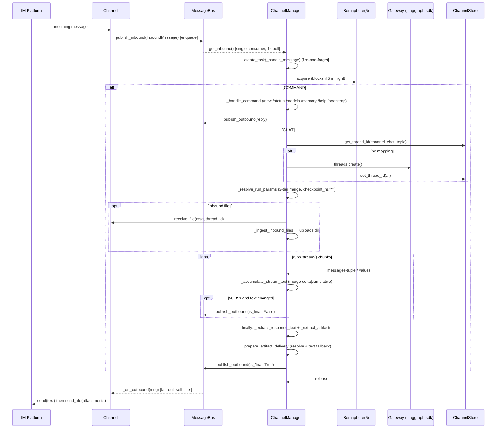
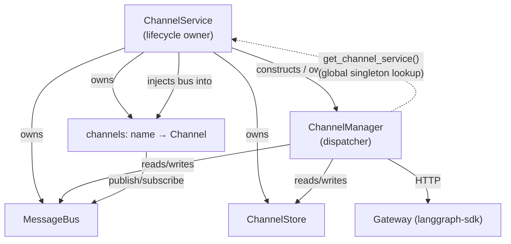
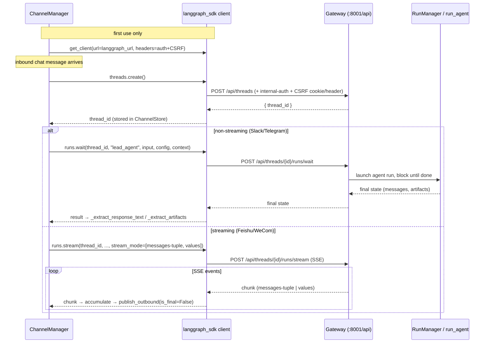

# Section 19b — Channels: Phase 2 Core Infrastructure

> Phase 2 of Section 19 (Backend: Channels / IM Integrations).
> Covers the three components that sit between the Phase 1 primitives and the
> Phase 3 platform adapters: the in-process pub/sub bus, the lifecycle owner,
> and the dispatcher that bridges inbound messages to the DeerFlow agent.
> Phase 3 (the 7 platform adapters) and Phase 4 (the HTTP router) are documented
> separately; the Section 19 index file is created once all phases are complete.

## Purpose

Phase 1 defined _what_ flows (the `InboundMessage`/`OutboundMessage` envelopes,
the `Channel` contract, the command set, the conversation→thread store). Phase 2
defines _how it flows_:

- **`message_bus.py`** — the `MessageBus`, an async pub/sub hub that decouples
  channels from the dispatcher in both directions.
- **`service.py`** — `ChannelService`, the lifecycle owner: reads `config.yaml`,
  instantiates enabled channels, owns the singleton bus + store, and starts the
  manager. Wired into the Gateway FastAPI lifespan.
- **`manager.py`** — `ChannelManager`, the dispatcher and the heart of the
  subsystem: the single consumer of the inbound queue, the owner of the
  `langgraph-sdk` client, and the translator between IM messages and agent runs.

Together these three are the "spine" every adapter plugs into. An adapter only
has to translate platform events ↔ envelopes and publish/subscribe on the bus;
everything about threads, runs, concurrency, artifacts, and streaming lives here.

## Key Files

- `backend/app/channels/message_bus.py` — `MessageBus` + the three dataclasses
  (`InboundMessage`, `OutboundMessage`, `ResolvedAttachment`) and the
  `InboundMessageType` enum. Inbound = one `asyncio.Queue` (fan-in); outbound =
  a list of async callbacks (fan-out).
- `backend/app/channels/service.py` — `ChannelService` + module-singleton
  accessors (`get_channel_service`, `start_channel_service`, `stop_channel_service`).
  Two name-keyed registries: `_CHANNEL_REGISTRY` (name → import path, lazy) and
  `_CHANNEL_CREDENTIAL_KEYS` (name → creds that signal "user meant to enable this").
- `backend/app/channels/manager.py` — `ChannelManager` class plus a large toolkit
  of module-level pure helpers for parsing LangGraph's message/stream shapes
  (`_extract_response_text`, `_extract_artifacts`, `_accumulate_stream_text`,
  `_resolve_attachments`, `_prepare_artifact_delivery`, `_ingest_inbound_files`, …).

## Important Concepts

### The bus: asymmetric by design

- **Inbound is a single queue (fan-in).** Many channels call `publish_inbound`;
  exactly one consumer — `ChannelManager._dispatch_loop` — drains it via
  `get_inbound`. There are no competing consumers.
- **Outbound is a callback list (fan-out).** `publish_outbound` calls _every_
  registered listener sequentially, each wrapped in its own `try/except`. Routing
  is **not** the bus's job: each channel's `_on_outbound` self-filters on
  `msg.channel_name == self.name` (see 19a). One slow/failing channel delays the
  others but its exception is swallowed (logged only) so siblings still receive.
- **`asyncio.Queue` is not thread-safe.** Channels whose SDK runs on its own
  thread (Slack, Discord) must publish via `asyncio.run_coroutine_threadsafe`, not
  a bare `await` — the queue is bound to the dispatcher's event loop.

### Service: lifecycle + failure isolation

- **`config.pop` is load-bearing.** `start()` iterates `self._config.items()`
  treating _every remaining key_ as a channel name. Service-level keys
  (`langgraph_url`, `gateway_url`, `session`) are **popped** out first
  (`_resolve_service_url`) so they're never mistaken for channels.
- **Lazy per-channel import.** `_start_channel` resolves `"module:Class"` via
  `resolve_class` only when starting that channel, so a missing optional SDK
  (e.g. `slack_sdk`) fails _only that channel_, not the whole service.
- **Post-start liveness gate.** After `await channel.start()`, if
  `not channel.is_running` the channel is rolled back out of `_channels`. The
  registry only ever holds genuinely live channels; `get_status` recomputes
  `running` from live state, not config.
- **Disabled-with-creds warning.** A channel that has credentials but
  `enabled: false` logs a loud warning — the common "set tokens, forgot
  `enabled: true`" footgun.
- **Startup/teardown ordering.** `start()` brings the manager up _before_ any
  channel publishes; `stop()` reverses it (channels first, then manager).
- **`channels` rides in via `model_extra`.** It is not a formal `AppConfig`
  schema field — it's read from `model_extra` (Pydantic `extra="allow"`), so it
  stays loosely typed.

### Manager: the dispatcher

- **Two run paths, chosen by capability.** `_channel_supports_streaming` decides
  between `runs.wait()` (block for the whole run, extract one final reply —
  Slack/Telegram) and `_handle_streaming_chat` → `runs.stream()` (incremental
  `is_final=False` partials + one terminal `is_final=True` — Feishu/WeCom).
- **Per-thread serialization via `multitask_strategy="reject"`.** A second
  concurrent message on the same thread → `ConflictError` → caught by
  `_is_thread_busy_error` → user gets the friendly `THREAD_BUSY_MESSAGE`. There is
  **no per-thread queue**; the user is told to wait.
- **Global concurrency via one semaphore.** `_handle_message` wraps work in
  `async with self._semaphore` (`max_concurrency=5`). This is a _system-wide_
  throughput cap, not per-user — see "Two-layer concurrency" below.
- **Three-tier session config.** `_resolve_run_params` merges
  `default_session < per-channel < per-user` for `assistant_id`, `config`,
  `context`. It pins `checkpoint_ns=""` so follow-up turns resume the same
  checkpoint, and rewrites a custom `assistant_id` into `lead_agent` +
  `context["agent_name"]` (custom agents are lead_agent + a name, not separate
  LangGraph assistants).
- **Artifacts come from tool _calls_, not state.** `_extract_artifacts` reads the
  current turn's `present_files` tool calls (messages after the last human), not
  the cumulative `ThreadState.artifacts` — otherwise every reply would re-attach
  every prior file.
- **Outbound security envelope.** `_resolve_attachments` only accepts paths under
  `/mnt/user-data/outputs/` and re-verifies with `relative_to(outputs_dir)` after
  resolution — defense-in-depth against exfiltrating uploads/workspace files over
  an IM channel via a crafted or traversal path.
- **Streaming throttle.** Partials are coalesced to ~3/sec
  (`STREAM_UPDATE_MIN_INTERVAL_SECONDS = 0.35`) and skipped when text is
  unchanged, because Feishu/WeCom card-patch APIs rate-limit. The `finally` block
  _always_ emits exactly one `is_final=True` frame (success, error, or busy) so
  channels can stop their streaming card.
- **Auth: a Gateway client that authenticates as a service.** `_get_client`
  builds the `langgraph-sdk` client with internal-auth headers **plus a
  self-issued CSRF token** sent as a matching cookie+header pair, so
  `CSRFMiddleware` accepts state-changing requests without a browser session.

## Execution Flow

Full inbound→outbound trace for a streaming chat message (the non-streaming path
is the same minus the partial updates, ending in a single `runs.wait`):



## Architecture Diagrams

Ownership vs runtime call direction — the circular dependency between Service and
Manager (see "Design critique" below):



The dashed edge is the smell: Manager reaches _up_ to its owner through a module
global to look up live `Channel` instances (for `supports_streaming` and
`receive_file`).

## Two-layer concurrency (deep dive)

A frequent confusion: what does `max_concurrency=5` actually limit? There are
**two independent layers**, and the semaphore is _not_ per-user.

| Layer                         | Scope                                            | Limit                             | Enforced at                                                                                        |
| ----------------------------- | ------------------------------------------------ | --------------------------------- | -------------------------------------------------------------------------------------------------- |
| `_semaphore`                  | **Global** — whole manager, all users + channels | 5 concurrent message handlers     | `Semaphore(self._max_concurrency)` in `start()`; `async with self._semaphore` in `_handle_message` |
| `multitask_strategy="reject"` | **Per thread** (per `channel:chat:topic`)        | 1 concurrent run; extras rejected | `runs.wait()` / `runs.stream()` calls                                                              |

- The semaphore counts **in-flight message handlers globally**; it has no
  knowledge of `user_id`, `chat_id`, or `thread_id`. 5 slots could be 5 different
  users, or one user across 5 different chats/topics, or any mix.
- A single conversation thread can never run two agent runs at once — even if 5
  messages from the same chat acquire the semaphore, only the first run executes;
  the rest get `ConflictError` → `THREAD_BUSY_MESSAGE`.

**Precise statement:** DeerFlow processes at most 5 messages at once system-wide,
and at most 1 per conversation thread. The 5 is a backend-protection throttle, not
a per-user fairness quota — one busy user opening many threads can consume all 5
slots and starve others (no per-user partitioning).

## `_prepare_artifact_delivery` (dry run)

This helper resolves artifact paths to real attachments _and_ appends filename
text fallbacks so files stay discoverable even when upload is skipped/fails. It can
append **up to two** text blocks — unresolved first, then resolved — and the 2nd
return value (`attachments`) only ever contains files that physically resolved.

Helpers it leans on:

- `_resolve_attachments` → keeps only `/mnt/user-data/outputs/` paths that exist
  on disk and pass the traversal guard.
- `_format_artifact_text` → basenames only; 1 path → `"Created File: 📎 <name>"`,
  N paths → `"Created Files: 📎 a、b"` (note the `、` separator).

```text
# Ex 1 — no artifacts (short-circuit)
in:  text="Here is your answer.", artifacts=[]
out: ("Here is your answer.", [])

# Ex 2 — one artifact, resolves
in:  text="Done!", artifacts=["/mnt/user-data/outputs/report.pdf"]  (exists)
out: ("Done!\n\nCreated File: 📎 report.pdf", [RA(report.pdf)])
     # NOTE: filename appended as text EVEN on success — the upload + the text both happen

# Ex 3 — one artifact, fails to resolve (missing on disk)
in:  text="Done!", artifacts=["/mnt/user-data/outputs/missing.pdf"]  (not on disk)
out: ("Done!\n\nCreated File: 📎 missing.pdf", [])
     # user sees the filename, but NO file is attached

# Ex 4 — mixed: one resolves, one doesn't
in:  text="Here you go.", artifacts=[".../a.pdf" (exists), ".../b.png" (missing)]
out: ("Here you go.\n\nCreated File: 📎 b.png\n\nCreated File: 📎 a.pdf", [RA(a.pdf)])
     # ordering quirk: UNRESOLVED block first, then RESOLVED; two singular lines, not one merged block

# Ex 5 — empty response text, two resolved
in:  text="", artifacts=[".../x.csv", ".../y.csv"]  (both exist)
out: ("Created Files: 📎 x.csv、y.csv", [RA(x.csv), RA(y.csv)])
     # the `if response_text else` guard avoids a leading "\n\n" when there's no prose
```

Takeaways: `attachments` = only files that resolved; the text mirrors _everything_
the agent claimed via `present_files`; mixed batches never merge into one
"Created Files:" line; the `if response_text else` guard on both branches prevents
a stray leading newline.

## My Insights

- **The bus is the entire decoupling story, and it's deliberately dumb.** It does
  no routing, no filtering, no retries — fan-in queue one way, fan-out callbacks
  the other. All intelligence (routing by name, throttling, serialization) lives
  in the manager and the channels. This is what lets adapters be trivial and the
  manager be the single place to reason about agent interaction.

- **`gateway_url` vs `langgraph_url` is an asymmetric-by-design footgun.**
  - `langgraph_url` default `http://localhost:8001/api` — used as the SDK _base_,
    which appends its own subpaths (`/threads`, `/runs`), so it must carry `/api`.
  - `gateway_url` default `http://localhost:8001` (no `/api`) — used by
    `_fetch_gateway`, where the **caller** writes the full path
    (`_fetch_gateway("/api/models")`). `f"{gateway_url}{path}"` →
    `http://localhost:8001/api/models`, a real Gateway route (both `models` and
    `memory` routers declare `prefix="/api"`). Port 8001 is the **Gateway
    backend**, not the frontend (3000) or Nginx (2026).
  - The trap: an operator who mirrors `langgraph_url` and sets
    `gateway_url: http://gateway:8001/api` silently breaks `/models` and
    `/memory` commands with `…/api/api/...` 404s. The two keys _look_ symmetric in
    config but are not.

- **Service ↔ Manager is a circular dependency (mild smell, not broken).** Service
  constructs and owns Manager; Manager reaches back into Service through the
  `get_channel_service()` module global to look up live `Channel` instances
  (`_channel_supports_streaming`, and `receive_file` in `_handle_chat`). This is a
  **service-locator + layering inversion**: the dependency is invisible in
  Manager's constructor signature, which hurts testability and explains the
  defensive `if service:` / `if channel:` guards and the static
  `CHANNEL_CAPABILITIES` fallback. It is _not_ a construction-time cycle (the
  lookup is lazy, runtime-only), so there's no init deadlock.
  - **Clean fix:** inject a `channel_lookup: Callable[[str], Channel | None]` into
    Manager's constructor and have Service pass `self.get_channel`. Manager then
    depends on an _abstraction_, the import cycle and the global both vanish, and
    tests pass a stub lambda. Note `supports_streaming` barely needs the live
    instance (there's already the static `CHANNEL_CAPABILITIES` table) — the
    injection really exists to serve `receive_file`.

- **Failure isolation is the dominant theme across all three files.** Per-callback
  try/except in the bus, per-channel try/except + lazy import + liveness rollback
  in the service, per-message fire-and-forget tasks with an error callback +
  busy-error normalization in the manager. The subsystem is built to keep running
  when any single channel, message, or run misbehaves.

- **The manager is mostly pure functions.** The genuinely tricky logic
  (extracting the "what did the agent just say" reply, merging delta vs cumulative
  stream text, sourcing fresh artifacts, the outbound security guard) is in
  stateless module-level helpers. The class itself is thin orchestration. That's a
  good shape — the hard parts are independently testable.

## Confusions / things confirmed this phase

- **Threading model behind the unlocked `ChannelStore` reads (carried from 19a).**
  Confirmed: the dispatcher (`_dispatch_loop`) is a single async task, but each
  message is handled in its _own_ `create_task` (`_handle_message`), and threaded
  channel SDKs (Slack/Discord) publish via `run_coroutine_threadsafe`. So multiple
  `_handle_message` tasks _can_ touch the store concurrently, and `/status`
  commands call `get_thread_id` unlocked while another task writes. The
  "dict changed size during iteration" race on `list_entries` is therefore
  plausible in practice, not just in theory — still worth a real fix.

- **`gateway_url` proof (resolved).** Confirmed by tracing the call sites
  (`_fetch_gateway("/api/models"|"/api/memory")`), the concatenation
  (`f"{self._gateway_url}{path}"`), and the router prefixes (`APIRouter(prefix="/api")`
  for both `models` and `memory`). It hits the Gateway backend, never the frontend.

## Open Questions

Appended to `notes/questions/open-questions.md` under "Section 19":

- Service ↔ Manager circular dependency via `get_channel_service()` global —
  should Manager take an injected `channel_lookup` instead?
- `resolve_class(import_path, base_class=None)` skips `Channel`-subclass
  validation — intentional flexibility or a missing guard?
- Per-thread serialization _rejects_ concurrent messages rather than queueing —
  is "tell the user to retry" the intended UX for all platforms, including
  streaming ones (Feishu/WeCom)?
- `gateway_url` must omit `/api` while `langgraph_url` must include it — should
  this be validated/normalized to prevent the `…/api/api/...` misconfig?

## The langgraph-sdk client: why the URL, and the workflow (deep dive)

A recurring question: the manager points the `langgraph-sdk` client at
`langgraph_url` (default `http://localhost:8001/api`, the Gateway backend) — why
does the SDK need a URL, and what is the request workflow?

### Why the SDK needs a URL at all

The `langgraph_sdk` client is **not** an in-process handle to the agent — it is a
generic **remote HTTP client** that speaks the LangGraph Server REST protocol (the
same protocol LangGraph Cloud / `langgraph dev` expose). Every method —
`threads.create()`, `runs.wait()`, `runs.stream()` — is a typed wrapper that
serializes the call into an HTTP request and parses the response. So it must be
told **where the server lives**, and it **appends the protocol's own paths** to
that base:

| SDK call (manager.py)                                     | HTTP request produced                               |
| --------------------------------------------------------- | --------------------------------------------------- |
| `client.threads.create()` ([:756], [:997])                | `POST {base}/threads`                               |
| `client.runs.wait(thread_id, assistant_id, …)` ([:820])   | `POST {base}/threads/{thread_id}/runs/wait`         |
| `client.runs.stream(thread_id, assistant_id, …)` ([:887]) | `POST {base}/threads/{thread_id}/runs/stream` (SSE) |

With `base = http://localhost:8001/api`, `threads.create()` resolves to
`http://localhost:8001/api/threads`. **This is exactly why `langgraph_url` carries
the `/api` suffix and `gateway_url` does not** (see the URL footgun above): the SDK
writes the path tail itself, so the prefix must live in the base.

DeerFlow's Gateway _implements_ this LangGraph-compatible protocol on its native
`/api/*` routers — so to the SDK, the Gateway looks like any LangGraph Server. The
channel points **directly** at Gateway :8001, bypassing Nginx; the Nginx
`/api/langgraph/*` → `/api/*` rewrite only matters for the browser, which goes
through the proxy. The server-side channel worker skips it.

### Why channels talk over HTTP instead of calling the runtime in-process

`app.*` is allowed to import `deerflow.*`, so the runtime _could_ be invoked
directly. The deliberate choice to be "just another client, same as the frontend"
buys:

- **Unified thread/run lifecycle** — threads, runs, checkpoints, persistence all
  managed server-side in one place; a conversation is the same object whether
  started from the web UI or from Slack.
- **Server-side concurrency policy** — `multitask_strategy="reject"` is enforced by
  the Gateway runtime, not re-implemented in the channel.
- **One auth/CSRF surface** — the channel authenticates like every other client
  rather than reaching past the security layer.
- **Decoupling** — the channel never needs to know how the agent is built, only the
  REST contract.

### The end-to-end workflow

The client is built lazily and reused as a singleton (`_get_client`, [:655]):



Step by step:

1. **Build client (once)** — [:663-670]. `get_client(url=self._langgraph_url,
headers={…})`. The headers make the channel a _trusted_ client:
   `create_internal_auth_headers()` (service-to-service identity) **plus** a
   self-issued CSRF token sent as a matching `X-CSRF-Token` header and `Cookie`
   pair, so the Gateway's `CSRFMiddleware` accepts state-changing POSTs without a
   browser session.
2. **Resolve/create thread** — look up `(channel, chat, topic)` in `ChannelStore`;
   on a miss call `client.threads.create()` ([:756]) → `POST /api/threads`, then
   persist the returned `thread_id`. This is what gives multi-turn continuity.
3. **Run the agent** — `client.runs.wait(...)` ([:820]) or
   `client.runs.stream(...)` ([:887]). `assistant_id` (`"lead_agent"`), `config`
   (with `checkpoint_ns=""`, `thread_id`), and `context` are serialized into the
   request body. The Gateway hands these to `RunManager`/`run_agent`, which runs
   the LangGraph graph and persists checkpoints under that `thread_id`.
4. **Receive result** — for `wait`, the final state dict returns and the manager
   extracts the reply + artifacts; for `stream`, SSE chunks return and the manager
   publishes throttled partial outbounds, then one `is_final=True`.

**In one line:** `langgraph_url` is the address of the LangGraph-protocol server
(the Gateway), and the SDK is the typed HTTP client that turns
`threads.create()` / `runs.wait()` / `runs.stream()` into REST calls against
`{langgraph_url}/threads/...` — the channel driving the agent exactly the way the
web frontend does.

## Links to Related Sections

- [[19a-channel-primitives]] — Phase 1: the `Channel` contract, envelopes, command
  set, and `ChannelStore` that this phase builds on.
- [[07-langgraph-runtime]] — the `runs.wait`/`runs.stream` + `multitask_strategy`
  semantics the manager depends on live in the runtime/run-lifecycle layer.
- [[05b-api-endpoints-overview]] — the Gateway routers (`/api/models`,
  `/api/memory`, threads/runs) the manager calls as a client.
- [[06-auth-authorization]] — internal auth + CSRF that `_get_client` uses to
  authenticate channel→Gateway requests as a service.
- Phase 3/4 (forthcoming): the 7 platform adapters and `routers/channels.py`.
