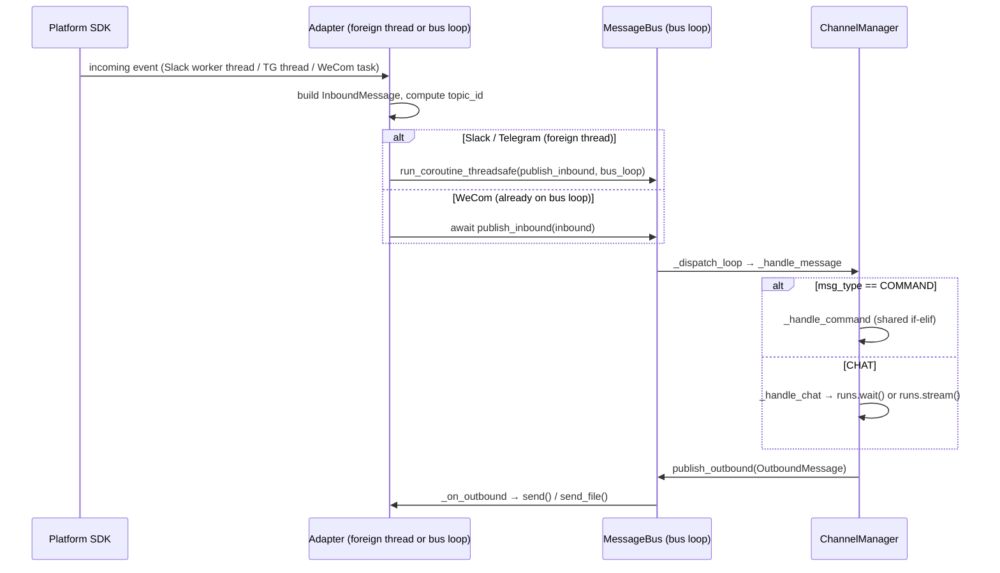
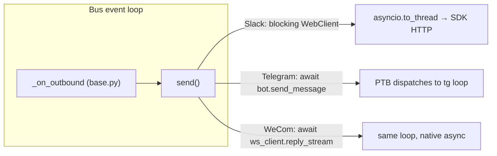
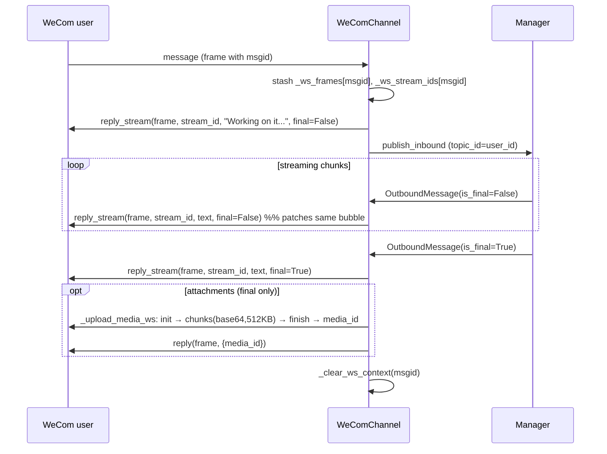

# Channels — Platform Adapters (Phase 3a: Slack, Telegram, WeCom)

## Purpose

Phase 3 of Section 19 covers the **concrete platform adapters** — the classes that
translate a specific messaging platform's SDK into DeerFlow's internal `MessageBus`
protocol. Each adapter subclasses `Channel` (`app/channels/base.py`) and implements
`start` / `stop` / `send` (+ optional `send_file`, `receive_file`,
`supports_streaming`). This file documents the first three adapters studied —
**Slack, Telegram, WeCom** — chosen because together they exhibit the _three
distinct concurrency models_ every other adapter is a variation of.

The single most important lesson of this phase: **an adapter is glue between two
worlds — an external SDK's concurrency model and DeerFlow's single async event
loop with a non-thread-safe `asyncio.Queue` at its centre.** Most adapter
complexity is bridging code, not business logic. The business logic (thread
mapping, command dispatch) is shared and lives in `manager.py`.

## Key Files

- `app/channels/slack.py` — Slack adapter. Socket Mode (outbound WebSocket). SDK runs
  its own **worker thread** with _no_ event loop.
- `app/channels/telegram.py` — Telegram adapter. Long-polling. SDK (python-telegram-bot)
  needs its **own event loop in a dedicated thread**.
- `app/channels/wecom.py` — WeCom/WeWork adapter. Native-**async** WebSocket SDK; runs
  as an `asyncio.Task` on the bus loop. Supports streaming + chunked media upload.
- `app/channels/base.py` — the `Channel` ABC: `_make_inbound`, `_on_outbound`,
  `supports_streaming`, `receive_file`.
- `app/channels/commands.py` — `KNOWN_CHANNEL_COMMANDS` (authoritative command set).
- `app/channels/manager.py` — `_handle_command` (the shared if-elif), `_handle_chat`,
  streaming vs `runs.wait()` selection.

## Important Concepts

### The two-worlds problem

DeerFlow's channel subsystem runs on **one asyncio event loop** (the "bus loop").
The `MessageBus` queue is an `asyncio.Queue` — **not thread-safe**. So any code
running on a _different_ thread that wants to enqueue an inbound message must hand
the work back to the bus loop with `asyncio.run_coroutine_threadsafe(coro, loop)`.
Symmetrically, code on the bus loop that must call a _blocking_ SDK API offloads
with `asyncio.to_thread(...)`.

### Three concurrency models (the heart of this phase)

| Concern                   | **Slack**                                   | **Telegram**                                          | **WeCom**                                    |
| ------------------------- | ------------------------------------------- | ----------------------------------------------------- | -------------------------------------------- |
| Transport                 | Socket Mode WebSocket                       | Long-polling                                          | WebSocket                                    |
| SDK nature                | sync, owns a worker **thread** (no loop)    | async, but needs **its own loop**                     | **natively async**                           |
| How it's run off-blocking | `run_in_executor(None, connect)`            | `threading.Thread(_run_polling)` + `new_event_loop()` | `asyncio.create_task(connect())` on bus loop |
| # event loops             | 1 (the bus loop)                            | 2 (bus loop + tg loop)                                | 1 (the bus loop)                             |
| Inbound bridge            | `run_coroutine_threadsafe(..., self._loop)` | `run_coroutine_threadsafe(..., self._main_loop)`      | none needed (already on bus loop)            |
| Outbound bridge           | `asyncio.to_thread(WebClient.…)`            | `await bot.…` (PTB dispatches to tg loop)             | `await ws_client.…` (same loop)              |
| Captured-loop attr        | `self._loop`                                | `self._main_loop` + `self._tg_loop`                   | —                                            |

WeCom is the cleanest because its SDK is already async — no bridging, no captured
loop. Telegram is the most involved because it needs a _whole second loop_ and
bridges in both directions. Slack sits in between: one loop, but the SDK callback
fires on a foreign thread so inbound still needs `run_coroutine_threadsafe`.

### Conversation continuity: `topic_id`

Every adapter must map platform messages onto DeerFlow threads. The key is
`inbound.topic_id`, used by the store as `channel:chat[:topic]` →
`thread_id`. Each platform solves it differently:

- **Slack** — native threads. `thread_ts = event.thread_ts or event.ts`. A reply in
  a thread reuses the root `ts` (same topic); a top-level message uses its own `ts`
  (new topic). Continuity is bound to the _visual Slack thread_.
- **Telegram** — no native threads. Private chat → `topic_id = None` → one
  persistent thread per user. Group chat → reply-to id (continue) or own msg id
  (new). Continuity is partly emulated.
- **WeCom** — no thread concept at all. `chat_id = topic_id = user_id` → exactly
  one persistent thread per user.

### Streaming vs one-shot (`supports_streaming`)

`Channel.supports_streaming` (default `False`) tells the manager which run mode to
use: `runs.wait()` (one final reply) vs `runs.stream()` (incremental updates).

- Slack / Telegram → `False` → one-shot. They post a "Working on it..." reply, then
  one final answer.
- WeCom → `True` → streaming. The manager emits multiple `OutboundMessage`s with
  `is_final=False` … then one `is_final=True`, and the adapter patches a single
  streaming bubble in place (`reply_stream`).

### Command handling is shared, not per-adapter

A frequent confusion: each adapter appears to "handle commands", but it only
**tags** a message as `COMMAND`. The actual dispatch (the if-elif over
`new/status/models/memory/help/bootstrap`) lives once in
`manager._handle_command`. Adapters only differ in _how a slash-command reaches
the bus_:

- **Slack** — catch-all message handler sees the text; `text.startswith("/")` sets
  `msg_type=COMMAND`.
- **Telegram** — PTB's text handler is `filters.TEXT & ~filters.COMMAND`, which
  **excludes** slash-commands, so each command must be explicitly registered with a
  `CommandHandler` that routes to `_cmd_generic` (which sets `msg_type=COMMAND`).
- **WeCom** — `_publish_ws_inbound` sets `COMMAND` when `text.startswith("/")`.

All three converge at `manager._handle_command`.

## Execution Flow

### Inbound: platform message → agent run



### Outbound: who bridges where



### WeCom streaming + media upload (the most complex adapter)



## My Insights

- **Adapters are a study in "impedance matching".** The same logical operation —
  "a message arrived, run the agent, stream back" — needs three different plumbing
  strategies purely because Slack's SDK is thread-based, Telegram's wants its own
  loop, and WeCom's is natively async. The _design_ (capability flags +
  `_make_inbound`/`_on_outbound` template methods on the base class) is what keeps
  this from becoming chaos: each adapter only fills in the platform-specific glue.

- **The base class quietly encodes the contract.** `_on_outbound` self-filters by
  `channel_name` (bus fan-out is O(channels), routing is in the adapter), sends text
  before files, and skips files if the text send failed. WeCom overrides
  `_on_outbound` purely to add `_clear_ws_context` on `is_final` — a nice example of
  a template method extended for lifecycle cleanup.

- **`supports_streaming` is a tiny flag with large consequences.** A single boolean
  flips the manager between two entirely different run-driving code paths
  (`runs.wait` vs `runs.stream`) and changes the adapter's `send`/`send_file`
  semantics (WeCom defers all file uploads until `is_final`, returning `True` on
  non-final calls to avoid spurious "skipped" warnings).

- **Emulated threading is cosmetic and coarser than native.** Telegram's
  `_last_bot_message` chains the bot's replies via `reply_to_message_id`, but it's
  keyed by `chat_id` only — so in a group with two logical `topic_id` threads, the
  visual chain doesn't respect the split. Slack's native `thread_ts` has no such
  problem.

- **WeCom couples to SDK internals.** `_send_ws_upload_command` reaches into the
  private `ws_client._ws_manager.send_reply`, guarded by a version check that fails
  loudly. It works, but it's the most brittle line in the three adapters — a SDK
  refactor would break media upload.

## Confusions Resolved (from the study session)

- **"Why are Telegram's `add_handler` commands different from `commands.py`?"** They
  serve different purposes. `commands.py:KNOWN_CHANNEL_COMMANDS` is the authoritative
  _dispatch_ set used by `manager._handle_command`. Telegram's `add_handler` list is
  PTB _routing plumbing_ — required because PTB's text handler excludes
  slash-commands. They overlap but are maintained separately, which causes drift
  (see Open Questions: `/bootstrap`).

- **"Slack handles commands with an if-elif?"** No. The if-else in Slack's
  `_handle_message_event` is only a _type detector_ (`COMMAND` vs `CHAT`). The real
  if-elif command handler is in `manager._handle_command`, shared by all adapters.

- **"Why does `_last_bot_message` exist?"** See the dry-run below — without it, the
  bot's replies float as orphaned messages in a busy chat; with it, they chain into
  a visible thread via `reply_to_message_id`.

- **"Do I need a Slack manifest?"** No — DeerFlow only reads `bot_token` + `app_token`
  from `config.yaml`. The manifest is a Slack-side convenience to set up scopes
  (`chat:write`, `reactions:write`, `files:write`), event subscriptions
  (`message.*`, `app_mention`), and Socket Mode in one shot.

## Dry-Run Examples

### Telegram `_last_bot_message` — emulated threading in a group

Telegram assigns increasing `message_id` per chat. With the cursor:

| step | who   | msg_id | code effect                                                   |
| ---- | ----- | ------ | ------------------------------------------------------------- |
| 1    | Alice | 100    | "What's the weather?"                                         |
| 2    | Bot   | 101    | `_last_bot_message["G"]` empty → no reply_to. Set `["G"]=101` |
| 3    | Bob   | 102    | "Summarize this PDF"                                          |
| 4    | Bot   | 103    | `reply_to=101` → answer **quotes msg 101**. Set `["G"]=103`   |

Result: the bot's messages chain visibly even though Alice's and Bob's messages are
interleaved. **Without** the cursor, msgs 101 and 103 would float with no context in
the scrolling group chat. Caveat: the cursor is chat-wide, not topic-wide.

### Slack `thread_ts` continuity

```python
thread_ts = event.get("thread_ts") or event.get("ts", "")
```

- Reply inside a thread → `thread_ts` present → all replies resolve to the **same**
  root ts → one DeerFlow thread (memory of prior turns).
- Top-level message → falls back to own `ts` → unique → fresh DeerFlow thread.

So a user who starts a _new top-level message_ (instead of replying in-thread) gets
a brand-new conversation with no memory of the earlier exchange.

### WeCom streaming lifecycle

One inbound `msgid` → allocate `stream_id`, stash `frame`+`stream_id` → open stream
with "Working on it..." (`final=False`) → each manager chunk patches the same bubble
via `reply_stream(..., final=False)` → final chunk `reply_stream(..., final=True)` →
files uploaded (chunked) only now → `_clear_ws_context(msgid)`.

## Open Questions

- **Telegram `/bootstrap` drift.** `/bootstrap` is in `KNOWN_CHANNEL_COMMANDS` and
  handled by the manager, but Telegram never registers a `CommandHandler` for it, and
  PTB's text handler excludes commands → `/bootstrap` is **silently swallowed** on
  Telegram. Fix: register PTB handlers by iterating `KNOWN_CHANNEL_COMMANDS`.
- **Telegram running-reply for instant commands.** `_cmd_generic` sends "Working on
  it..." even for `/help` / `/status`, which resolve instantly. Intended only for
  long-running commands?
- **Telegram `_last_bot_message` race.** Updated by both `send` and `send_file`,
  keyed by `chat_id`; concurrent outbounds in one chat could anchor a reply onto the
  wrong message. Does the manager serialize outbound per chat?
- **WeCom SDK-internals coupling.** `_send_ws_upload_command` depends on the private
  `_ws_manager.send_reply`; brittle across SDK versions.

## Links to Related Sections

- [[19a-channel-primitives]] — base class, commands, store (the contract these adapters fill in)
- [[19b-channels-core-infrastructure]] — message bus, service, manager (where shared dispatch + streaming selection live)
- Section 07 — LangGraph Runtime (`runs.wait` / `runs.stream` that the manager calls)
