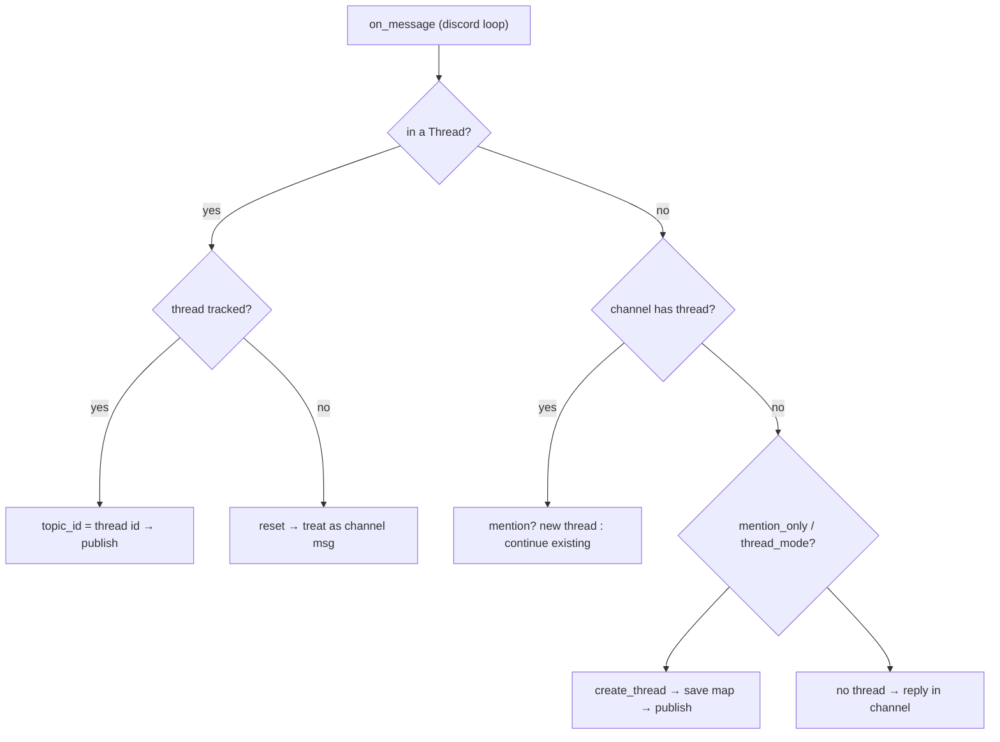
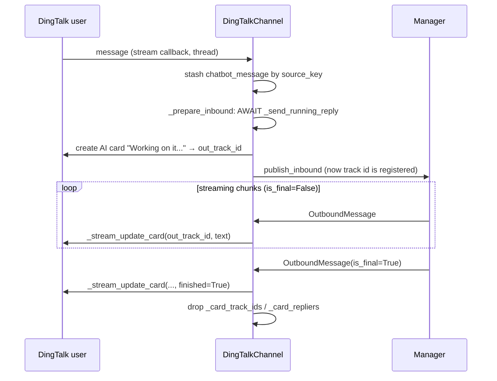
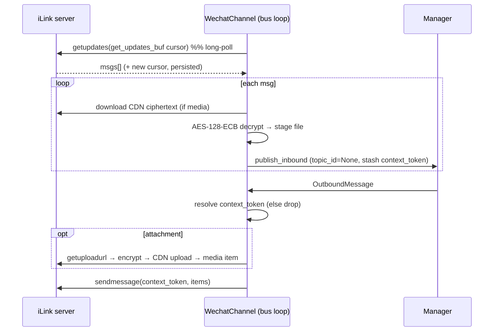
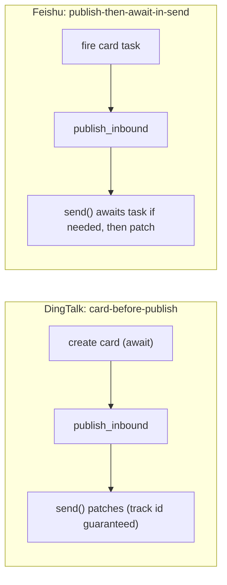

# Channels — Platform Adapters (Phase 3b: Discord, DingTalk, Feishu, WeChat)

## Purpose

The second half of Section 19's platform adapters. Where
[[19c-channels-platform-adapters]] used Slack/Telegram/WeCom to teach the **three
concurrency models**, this file covers the four remaining adapters — **Discord,
DingTalk, Feishu, WeChat** — chosen because each pushes on a _different feature
axis_ beyond raw plumbing:

- **Discord** — the only adapter that routes via **native platform thread objects**
  and therefore needs its **own persistence layer**.
- **DingTalk** — **config-gated streaming**: the same class is one-shot or streaming
  purely on whether `card_template_id` is set.
- **Feishu** — **always streaming** via interactive cards; the only adapter that
  overrides `receive_file`; ships a notable **SDK loop-patch hack**.
- **WeChat** — the **largest** adapter: no SDK at all, raw HTTP long-polling,
  hand-rolled **AES-128 media crypto**, and an interactive **QR-login bootstrap**.

The lesson of 19c still holds — _an adapter is glue between an external SDK's
concurrency model and DeerFlow's single async bus loop_ — but this phase adds a
second lesson: **the shared business logic (thread mapping, command dispatch,
run-mode selection) lives in `manager.py`; what each adapter adds on top is a
platform's idea of "a conversation" and "a rich reply".**

## Key Files

- `app/channels/discord.py` — Discord adapter. `discord.py` SDK, dedicated thread +
  own loop. Native `Thread` routing, persisted to `discord_threads.json`.
  One-shot (`supports_streaming=False`).
- `app/channels/dingtalk.py` — DingTalk adapter. `dingtalk-stream` WebSocket on a
  dedicated thread. AI-Card streaming **iff** `card_template_id`. Markdown
  downgrade for the weak `sampleMarkdown` renderer.
- `app/channels/feishu.py` — Feishu/Lark adapter. `lark-oapi` WS on a dedicated
  thread with a module-level loop monkey-patch. Always-streaming interactive
  cards; overrides `receive_file` to pull inbound files into the sandbox.
- `app/channels/wechat.py` — WeChat iLink adapter. No SDK; raw `httpx`
  long-polling as a Task on the bus loop. AES-128-ECB media crypto, CDN
  upload/download, QR-login bootstrap, disk-persisted cursor + auth.
- `app/channels/base.py` — the `Channel` ABC (`supports_streaming`,
  `receive_file`, `_on_outbound`, `_make_inbound`).
- `app/channels/manager.py` — shared dispatch, `runs.wait()` vs `runs.stream()`
  selection keyed off `supports_streaming`.

## Important Concepts

### Concurrency model recap (where these four sit)

| Adapter      | SDK nature                   | How it's run off-blocking                            | # loops  | Inbound bridge                         |
| ------------ | ---------------------------- | ---------------------------------------------------- | -------- | -------------------------------------- |
| **Discord**  | async, owns its own loop     | `threading.Thread(_run_client)` + `new_event_loop()` | 2        | `run_coroutine_threadsafe(_main_loop)` |
| **DingTalk** | sync stream client, threaded | `threading.Thread(_run_stream)`                      | 2 (impl) | `run_coroutine_threadsafe(_main_loop)` |
| **Feishu**   | async but loop-captive       | `threading.Thread(_run_ws)` + patched module loop    | 2        | `run_coroutine_threadsafe(_main_loop)` |
| **WeChat**   | none (raw httpx)             | `create_task(_poll_loop)` on the bus loop            | 1        | none — already on bus loop             |

So Discord/DingTalk/Feishu are all "dedicated thread + bridge inbound" (Telegram's
model); WeChat is "natively async on the bus loop" (WeCom's model). **No new
concurrency model appears in phase 3b — they're variations of the two from 19c.**

### Conversation continuity: four more `topic_id` strategies

`inbound.topic_id` is the key the store maps to a DeerFlow thread
(`channel:chat[:topic]`). Each platform answers "what is a conversation?"
differently:

| Adapter      | `topic_id`                         | Continuity model                                             |
| ------------ | ---------------------------------- | ------------------------------------------------------------ |
| **Discord**  | the Discord **thread id** (native) | one DeerFlow thread per Discord thread; bot **creates** them |
| **DingTalk** | P2P → `None`; Group → `msg_id`     | P2P = one thread per user; Group = one-shot per message      |
| **Feishu**   | `root_id or msg_id`                | reply-in-thread continues; fresh message = new topic         |
| **WeChat**   | hardwired `None`                   | one persistent thread per user (`chat_id = user_id`)         |

The standout is **Discord**: for everyone else, `topic_id` is _derived from the
inbound payload_. For Discord, the bot **creates** a Thread object and must
**remember** the `channel_id → thread_id` mapping itself — hence a dedicated
`discord_threads.json` (see deep dive below).

### Streaming vs one-shot — and that it's orthogonal to size/complexity

`supports_streaming` flips the manager between `runs.wait()` (one final reply) and
`runs.stream()` (incremental updates patched into one bubble).

| Adapter      | `supports_streaming`     | Why                                                    |
| ------------ | ------------------------ | ------------------------------------------------------ |
| **Discord**  | `False`                  | plain text replies, chunked at 2000 chars              |
| **DingTalk** | `bool(card_template_id)` | streaming only when an AI-Card template is configured  |
| **Feishu**   | `True`                   | interactive cards natively support in-place patching   |
| **WeChat**   | `False`                  | despite being the biggest adapter — it's one-shot text |

A nice illustration that **streaming capability ≠ adapter complexity**: WeChat is
~1300 lines and one-shot; Feishu is ~700 lines and fully streaming.

### Two flavours of "create the running card"

Both streaming adapters open a placeholder card on inbound, then patch it. They
differ on **ordering relative to `publish_inbound`** — a subtle but important
design choice:

- **DingTalk** (`_prepare_inbound`): _awaits_ card creation **before**
  `publish_inbound`. The card's `out_track_id` must be registered before the
  manager can emit streaming outbounds, or `send()` would spawn duplicate posts.
  → simpler `send()`, slightly higher inbound latency.
- **Feishu** (`_prepare_inbound`): fires the running card **non-blockingly** and
  publishes immediately; `send()` later _awaits the in-flight task_ if the card
  isn't ready yet (`_send_card_message`).
  → lower inbound latency, more race-handling in `send()`.

### Streaming correlation: matching an outbound reply to its card

Both streaming adapters need an outbound `OutboundMessage` to find _the same card_
its inbound question created. They build a **source key** from message identity:

- **DingTalk** — `_make_card_source_key` (inbound) and
  `_make_card_source_key_from_outbound` must hash equal. Outbound falls back
  `message_id → thread_ts`. Mismatch ⇒ the reply can't find its card ⇒ duplicate.
- **Feishu** — keyed directly on `msg.thread_ts` (= source `message_id`), looked up
  in `_running_card_ids` / `_running_card_tasks`.

### Command handling is still shared

As in 19c, adapters only **tag** a message `COMMAND` (`text.startswith("/")` or
`_is_*_command`). The actual if-elif dispatch lives once in
`manager._handle_command`. DingTalk and Feishu both use the
`KNOWN_CHANNEL_COMMANDS` set to decide the tag, so absolute paths like
`/mnt/...` aren't mistaken for commands.

## Execution Flow

### Discord — channel message → native thread routing



### DingTalk — AI-Card streaming lifecycle



### Feishu — running card with race handling

```mermaid
sequenceDiagram
    participant U as Feishu user
    participant F as FeishuChannel
    participant Mgr as Manager
    U->>F: message (lark thread)
    F->>F: _prepare_inbound: fire add_reaction(OK) + ensure_running_card_started (NON-blocking)
    F->>Mgr: publish_inbound (immediately)
    F-->>U: (async) reply interactive card "Working on it..." → running_card_id
    loop chunks
        Mgr->>F: OutboundMessage
        alt card ready
            F->>U: _update_card(running_card_id, text)  %% patch in place
        else card task still running
            F->>F: await running_card_task, then patch
        else card failed & is_final
            F->>U: _reply_card(source, text)  %% fresh reply fallback
        end
    end
    Mgr->>F: is_final
    F->>U: add_reaction(DONE); drop running_card_id
```

### WeChat — long-poll + encrypted media



## Architecture Diagrams

### Two ordering strategies for the running card



## My Insights

- **Discord is the odd one out on identity ownership.** Slack/Telegram/Feishu all
  read the thread key out of the inbound payload. Discord _creates_ server-side
  Thread objects, and the platform doesn't echo the `channel→thread` association on
  later channel messages — so the bot must persist its own map
  (`discord_threads.json`). Bot-owned state that must survive restarts is exactly
  what justifies a persistence layer (and exactly what creates the
  orphaned-thread failure mode).

- **`supports_streaming` is a per-install switch, not just per-class (DingTalk).**
  The same `DingTalkChannel` is one-shot or streaming purely on whether
  `card_template_id` is configured. That single bool changes the manager's
  run-driver _and_ the adapter's `send()` semantics. It's the cleanest example in
  the codebase of behaviour selected by config rather than by type.

- **Streaming correlation is the fragile part.** Both card adapters rebuild a
  "source key" independently for inbound and outbound and rely on them hashing
  equal. There's no shared object — just two functions that must agree. DingTalk's
  `message_id → thread_ts` fallback is the kind of implicit contract that breaks
  silently (a duplicate post) if the manager ever stops copying `message_id` into
  outbound metadata.

- **Feishu's loop monkey-patch is the most brittle line in the whole subsystem.**
  `_ws_client_mod.loop = loop` reaches into lark-oapi internals to dodge a
  uvloop-vs-`run_until_complete` conflict. It works, but it's coupling to an
  undocumented module global — a sibling to WeCom's `_ws_manager.send_reply`
  reach-in noted in 19c. Two different SDKs, same "poke the internals" smell.

- **WeChat shows what "no SDK" costs.** Half the file is things an SDK would
  normally hide: AES-128-ECB encrypt/decrypt, CDN upload URL construction, MD5
  sizing, multi-encoding AES-key parsing, QR-login polling, cursor + auth
  persistence. The defensiveness in `_resolve_media_aes_key` (every field name ×
  every encoding) is a direct readout of how unstable the upstream contract is.

- **`receive_file` is a template-method hook only Feishu fills.** The base class
  declares it as a no-op; Feishu overrides it to download inbound files into the
  thread's sandbox and rewrite `[image]`/`[file]` placeholders into virtual paths
  the model can actually read. It's the inbound mirror of `send_file`, and a clean
  example of the base class anticipating an extension point most platforms don't
  need.

## Confusions Resolved (from the study session)

- **"Why does Discord need a persistence layer when Slack/Telegram don't?"**
  Because Discord's thread identity is _bot-created_, not carried in the inbound
  payload. Slack puts `thread_ts` in every event; Telegram puts
  `reply_to_message_id`; both are re-derivable for free. Discord's `channel→thread`
  map exists only in the bot, and the threads outlive the process, so it must be
  persisted (`discord_threads.json`). It's also a _separate_ store from
  `ChannelStore`: Discord's map answers "which Discord thread is this channel's
  conversation?" (producing `topic_id`), then `ChannelStore` answers "which
  DeerFlow thread does that `topic_id` map to?".

- **"Is DingTalk always streaming because it's a 'card' channel?"** No —
  streaming is gated on `card_template_id`. Without a template it falls back to
  `sampleMarkdown` one-shot posts (with markdown downgraded for the weak renderer).
  Feishu, by contrast, is _always_ streaming.

- **"Why does Discord's in-thread `if` short-circuit and `return`?"** Because a
  message already inside a tracked Discord thread is self-identifying — the thread
  _is_ the topic, so no mention gating or thread creation is needed. The big
  channel-level routing block below only applies to messages in a bare channel.

- **"Why is WeChat so much bigger than the others?"** It has no vendor SDK. Every
  concern other adapters delegate to a library (transport, media encryption,
  upload, auth) is implemented by hand against the raw iLink HTTP API.

## Dry-Run Examples

### Discord — fresh @-mention replaces an existing thread

`mention_only=True`, channel `C` already maps to thread `T1`:

| step | event                              | routing decision                                               |
| ---- | ---------------------------------- | -------------------------------------------------------------- |
| 1    | message in thread `T1` (tracked)   | self-identifying → `topic_id=T1`, publish, **return**          |
| 2    | message in channel `C`, no `@`     | `mention_only` + no `@` + not allowed → **skip**               |
| 3    | message in channel `C`, **`@bot`** | fresh mention → `create_thread` → `T2`, **replace** map `C→T2` |
| 4    | message in thread `T1` again       | still tracked → continues `T1` (old conversation lives on)     |

So a new `@` means "new conversation", while the old thread keeps serving its own
in-thread continuations.

### DingTalk — group vs P2P topic policy

```python
topic_id = msg_id if conversation_type == GROUP else None
```

- **P2P**: every message from user `U` → `topic_id=None` → same DeerFlow thread →
  the agent remembers the prior turns.
- **Group**: each message → `topic_id=msg_id` → a brand-new DeerFlow thread →
  every group question is one-shot, no cross-message memory.

### DingTalk — streaming correlation must agree

```text
inbound  key = type:staff:conv:message_id
outbound key = type:staff:conv:(message_id or thread_ts)
```

If the manager copies the original `message_id` into outbound metadata, both keys
equal `…:M1` → `send()` finds `out_track_id` → patches the card. If it didn't,
outbound would fall back to `thread_ts`; as long as `thread_ts == M1` they still
match. A drift between these two would surface as a _duplicate_ card per reply.

### Feishu — running card race

1. Inbound → `_prepare_inbound` fires `ensure_running_card_started` (task A) and
   publishes immediately.
2. Manager emits chunk 1 _before_ task A finishes → `_send_card_message` sees no
   `running_card_id`, finds the in-flight task, `await`s it → gets the id → patches.
3. Chunk 2 → id cached → straight patch.
4. `is_final` → patch, drop `running_card_id`, add `DONE` reaction.

If task A finished with **no** id (card creation failed) and it's not final, the
code logs and skips rather than creating a duplicate; on the final chunk it falls
back to a fresh `_reply_card`.

### WeChat — encrypted outbound image

1. Read file → `aes_key = secrets.token_bytes(16)`.
2. `getuploadurl` (rawsize, md5, encrypted filesize, aeskey hex).
3. `_encrypt_aes_128_ecb(plaintext, aes_key)` → upload ciphertext to CDN
   (`x-encrypted-param` returned becomes the download param).
4. `sendmessage` with an image item carrying the base64-encoded aes key + encrypted
   query param + ciphertext size. The receiver reverses this to decrypt.

## Open Questions

See `notes/questions/open-questions.md` → Section 19, Phase 3 entries for
`discord.py`, `dingtalk.py`, `feishu.py`, `wechat.py`. Highlights:

- **Discord** — `send_file` fd leak on failure; two thread-identity stores can drift;
  orphaned-thread proliferation after a failed mapping load; fire-and-forget
  `_publish` hides back-pressure.
- **DingTalk** — streaming correlation depends on the manager copying `message_id`
  into outbound metadata (implicit contract); card-create-before-publish adds
  inbound latency.
- **Feishu** — the lark-oapi module-loop monkey-patch is brittle across SDK
  versions; `_send_card_message` race matrix is intricate and only partially tested.
- **WeChat** — hand-rolled AES + multi-encoding key parsing tracks an unstable
  upstream contract; `-14` token expiry stops the channel with no auto-recovery;
  `context_token`-less outbounds are silently dropped.

## Links to Related Sections

- [[19a-channel-primitives]] — base class, commands, store (the contract these adapters fill in)
- [[19b-channels-core-infrastructure]] — message bus, service, manager (shared dispatch + streaming selection)
- [[19c-channels-platform-adapters]] — phase 3a (Slack, Telegram, WeCom); the three concurrency models these four reuse
- Section 07 — LangGraph Runtime (`runs.wait` / `runs.stream` the manager drives off `supports_streaming`)
- Section 15 — Sandbox (Feishu `receive_file` stages inbound files into the thread sandbox)
