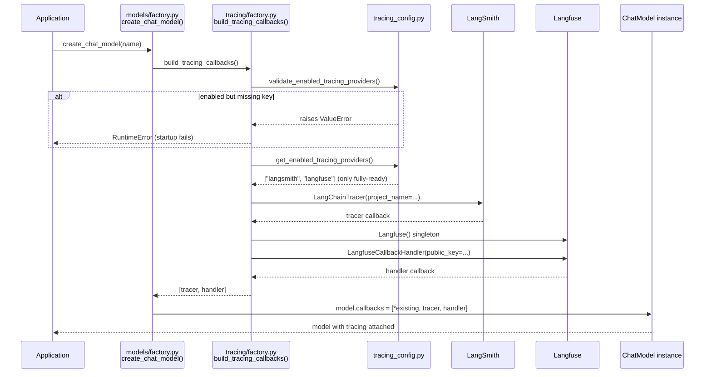

# Tracing & Observability

## Purpose

DeerFlow's observability stack is split across two independent layers with different scopes, audiences, and availability requirements. The **journal** (`runtime/journal.py`) is always-on internal infrastructure that records run lifecycle events into DeerFlow's own local storage — it is a core system requirement for the runs API, cancellation, and pagination. The **external tracing layer** (`tracing/factory.py`) is an optional integration that attaches LangChain callback handlers to every LLM model instance, shipping fine-grained call traces to remote SaaS platforms (LangSmith or Langfuse). A third artifact, `scripts/tool-error-degradation-detection.sh`, is a standalone verification script with no automated callers — it exists to be run manually when middleware changes could affect tool-error-handling behavior.

## Key Files

- `backend/packages/harness/deerflow/tracing/factory.py` — Tracing factory; builds LangChain callback handlers for all enabled providers; sole entry point for external tracing
- `backend/packages/harness/deerflow/config/tracing_config.py` — Tracing config; reads exclusively from env vars (not config.yaml); one config class per provider
- `backend/packages/harness/deerflow/runtime/journal.py` — Per-run audit log; writes structured lifecycle events for each DeerFlow run [annotated §07]
- `scripts/tool-error-degradation-detection.sh` — Standalone operational verifier; detects whether `ToolErrorHandlingMiddleware` correctly downgrades tool exceptions in both lead and subagent chains

## Important Concepts

### Two-Layer Observability Stack

The two layers answer orthogonal questions at different granularities and serve different consumers:

| Question                                         | Journal | LangSmith / Langfuse |
| ------------------------------------------------ | ------- | -------------------- |
| Did this run succeed or fail?                    | ✓       | —                    |
| When did the run start and end?                  | ✓       | —                    |
| What did the LLM receive as exact input?         | —       | ✓                    |
| How much did this run cost in tokens?            | —       | ✓                    |
| Which specific LLM call inside the run was slow? | —       | ✓                    |
| Why did the model give a bad answer?             | —       | ✓                    |
| How many runs has this user completed?           | ✓       | —                    |

**Granularity gap**: A single DeerFlow run can involve dozens of LLM calls — the lead agent reasoning loop, tool calls, subagent dispatches, summarization, title generation, memory extraction. The journal records **one entry** for the whole run. LangSmith/Langfuse records a **separate trace** for each model invocation, with the full prompt/response payload and latency.

**Availability gap**: The journal is mandatory infrastructure — the runs API can't function without it. External tracing is an optional debugging add-on activated only when API keys are configured. This separation means a misconfigured tracing key never breaks the core run lifecycle.

**Audience gap**: The journal is consumed by DeerFlow's own services (runs router, cancellation logic, stream join, pagination). External tracing is consumed by humans on remote dashboards debugging prompt regressions or monitoring token costs.

### Env-Var-Only Config

Tracing is the **only config subsystem** in DeerFlow that reads exclusively from environment variables — not from `config.yaml` and with no hot-reload path. Changing tracing requires a process restart.

This is a deliberate alignment with LangChain's own env-var conventions. Any LangChain getting-started guide that tells you to `export LANGSMITH_API_KEY=...` just works with DeerFlow without reading DeerFlow-specific docs. The standard variables are all supported:

| Provider  | Env vars                                                                                                                         |
| --------- | -------------------------------------------------------------------------------------------------------------------------------- |
| LangSmith | `LANGSMITH_TRACING`, `LANGCHAIN_TRACING_V2`, `LANGSMITH_API_KEY`, `LANGCHAIN_API_KEY`, `LANGSMITH_PROJECT`, `LANGSMITH_ENDPOINT` |
| Langfuse  | `LANGFUSE_TRACING`, `LANGFUSE_PUBLIC_KEY`, `LANGFUSE_SECRET_KEY`, `LANGFUSE_BASE_URL`                                            |

Legacy `LANGCHAIN_*` aliases are accepted alongside the newer `LANGSMITH_*` names so configs written for older LangChain versions still work without changes.

### Two-Phase Provider Validation

`build_tracing_callbacks()` applies a two-phase check before creating any callback:

**Phase 1 — validate**: `validate_enabled_tracing_providers()` iterates every provider with `enabled=True`, regardless of whether credentials are present, and raises a `ValueError` for any that are missing required keys.

```python
# Example: LANGFUSE_TRACING=true but LANGFUSE_PUBLIC_KEY not set
# → ValueError: "Langfuse tracing is enabled but required settings are missing: LANGFUSE_PUBLIC_KEY"
```

**Phase 2 — create**: `get_enabled_tracing_providers()` returns only **fully-ready** providers (enabled=True AND all credentials present). Callbacks are created only for this set.

The distinction between `explicitly_enabled_providers` (enabled flag, ignoring keys) and `enabled_providers` (enabled flag AND keys present) is the mechanism behind this two-phase pattern. Result: providers enabled in config but missing credentials cause a loud startup error; providers not enabled at all are silently skipped.

### Lazy Optional Imports

Both provider factory functions use local imports inside the function body:

```python
def _create_langsmith_tracer(config) -> Any:
    from langchain_core.tracers.langchain import LangChainTracer   # local import
    return LangChainTracer(project_name=config.project)

def _create_langfuse_handler(config) -> Any:
    from langfuse import Langfuse                                   # local import
    from langfuse.langchain import CallbackHandler as LangfuseCallbackHandler
    ...
```

`langchain_core` and `langfuse` are optional packages. DeerFlow runs without them — the `ImportError` only fires when the provider is actually enabled and `build_tracing_callbacks()` is called. This is the same lazy-import pattern used by model providers (`models/`) and avoids making external observability tools hard dependencies.

### Langfuse 4+ Singleton Contract

`_create_langfuse_handler()` follows a mandatory two-step initialization:

```python
Langfuse(                                         # step 1: register global singleton with credentials
    secret_key=config.secret_key,
    public_key=config.public_key,
    host=config.host,
)
return LangfuseCallbackHandler(public_key=...)    # step 2: attach handler to that singleton
```

In Langfuse 4+, project credentials are managed through a centralized client singleton. The `CallbackHandler` attaches to that singleton rather than holding its own credentials. The `Langfuse()` call must happen first — reversing the order causes the handler to attach to an unconfigured client, silently breaking authentication with no error at construction time.

The test `test_create_langfuse_handler_initializes_client_before_handler` asserts the exact call order by recording `("client", kwargs)` and `("handler", kwargs)` in a `calls` list and asserting `calls[0][0] == "client"`.

### Integration Point — models/factory.py

`build_tracing_callbacks()` is called once per model creation inside `create_chat_model()` in `models/factory.py`. Callbacks are appended to the model post-instantiation:

```python
callbacks = build_tracing_callbacks()
if callbacks:
    existing_callbacks = model_instance.callbacks or []
    model_instance.callbacks = [*existing_callbacks, *callbacks]
```

This means every LLM model instance in the system — lead agent, subagents, summarization, title generation, memory extraction — carries the same tracing callbacks. All LLM events from any part of the system flow through the same external tracing pipeline. The model factory is the single centralization point; the tracing layer itself has no awareness of which feature created the model.

### Multi-Provider Fan-Out

`build_tracing_callbacks()` returns a list. Both LangSmith and Langfuse can be active simultaneously — the list will contain one callback per enabled provider. This is useful for teams migrating between providers or running side-by-side cost/latency comparisons without duplicating work.

## Execution Flow — External Tracing



## tool-error-degradation-detection.sh — Deep Dive

### What It Is

This script has **no automated callers**. It is not referenced by any Makefile target, CI workflow, or other script. It is a standalone verification tool intended to be run manually before merging changes that touch the middleware chain — specifically any change that could affect `ToolErrorHandlingMiddleware` (position 8 in the lead agent chain).

### What It Detects

The core question: _does the current branch correctly convert a tool exception into an error `ToolMessage` so the run can continue, rather than propagating the exception and aborting the entire tool call sequence?_

This is the behavior `ToolErrorHandlingMiddleware` provides. Without it, a single failing tool call (e.g., a Tavily SSL handshake failure during `web_search`) would propagate an uncaught exception up through the chain and abort all subsequent tool calls for that turn — including ones that would have succeeded.

### Architecture of the Embedded Python Script

The script runs `uv run python -u - <<'PY' ... PY` — an inline Python heredoc executed in the backend virtualenv without needing a separate `.py` file.

**Step 1 — Synthetic tool calls**

```python
TOOL_CALLS = [
    {"name": "web_search", "id": "tc-fail", "args": {"query": "latest agent news"}},
    {"name": "web_fetch",  "id": "tc-ok",   "args": {"url": "https://example.com"}},
]
```

`web_search` is wired to throw `SSLError(ssl.SSLEOFError(...))` — a real-world failure mode from a Tavily connection drop. `web_fetch` is wired to return a success `ToolMessage`. This pair simulates the exact scenario where one tool fails mid-sequence.

**Step 2 — Load real middleware chains**

```python
lead_middlewares = _build_middlewares({"configurable": {}}, model_name=model_name)
sub_middlewares  = _build_sub_middlewares()
```

These are the actual production middleware stacks loaded from the live `config.yaml`, not mocks. The script verifies the real chain, not a simplified test double.

`_build_sub_middlewares()` has a resilient fallback: if `build_subagent_runtime_middlewares` is absent (older branch), it builds a minimal chain with `ThreadDataMiddleware + SandboxMiddleware`. This allows the script to run against branches where the subagent builder was not yet added — though on such branches the subagent test will fail with exit code 9, surfacing the missing middleware.

**Step 3 — Extract and compose tool-call wrappers**

```python
def _collect_sync_wrappers(middlewares):
    return [m.wrap_tool_call for m in middlewares
            if m.__class__.wrap_tool_call is not AgentMiddleware.wrap_tool_call
            or m.__class__.awrap_tool_call is not AgentMiddleware.awrap_tool_call]
```

This filters to only middlewares that override `wrap_tool_call` or `awrap_tool_call`, isolating the tool-wrapping layer from `before_agent`, `after_agent`, and `before/after_model` hooks which are irrelevant here.

`_compose_sync` / `_compose_async` build the composed onion manually:

```python
for wrapper in reversed(wrappers):   # reversed = last-in-list becomes innermost
    previous = execute
    def execute(req, wrapper=wrapper, previous=previous):
        return wrapper(req, previous)
```

`reversed(wrappers)` replicates how LangGraph applies middleware — the last wrapper in the list wraps innermost around the handler. The closure captures `wrapper` and `previous` explicitly to avoid the classic Python loop-variable capture bug.

**Step 4 — Run both sync and async variants**

The script tests both `wrap_tool_call` (sync) and `awrap_tool_call` (async) for both the lead and subagent chains — four test paths total. Both code paths exist independently in the middleware implementation; either could be broken by a change without affecting the other.

**Step 5 — Validate outputs**

```python
# Expected:
outputs[0] = ToolMessage(status="error",   text="Error: Tool 'web_search' failed: ...")
outputs[1] = ToolMessage(status="success", text="web_fetch success")
```

If `any_crash` is `True` (an exception escaped the composed chain), exit code 9 is returned.

### Exit Codes

| Code | Meaning                                                                        |
| ---- | ------------------------------------------------------------------------------ |
| 0    | PASS — tool error correctly downgraded; conversation flow continues            |
| 1    | `uv` not found in PATH                                                         |
| 2    | Wrong number of tool outputs (sequence aborted)                                |
| 3    | Outputs are not `ToolMessage` instances                                        |
| 4    | First tool output is not `status="error"`                                      |
| 5    | Second tool output is not `status="success"`                                   |
| 6    | Error text missing from first output                                           |
| 7    | Success text missing from second output                                        |
| 8    | No model configured in `config.yaml`                                           |
| 9    | Tool exception propagated — conversation flow aborted (no effective downgrade) |

### Dry-Run Trace

**PASS case** (`ToolErrorHandlingMiddleware` is present in the chain):

```
[STEP 1] Prepare simulated Tavily SSL handshake failure.
[STEP 2] Load current branch middleware chains.
[STEP 3] Simulate two sequential tool calls and check whether conversation flow aborts.

  Tool call 1: web_search  →  SSLError raised
    ↓ ToolErrorHandlingMiddleware.wrap_tool_call catches it
    ↓ returns ToolMessage(status="error", content="Error: Tool 'web_search' failed: ...")
  Tool call 2: web_fetch   →  handler returns ToolMessage(status="success", content="web_fetch success")

[INFO] lead/sync:     no crash, outputs preserved (error + success).
[INFO] lead/async:    no crash, outputs preserved (error + success).
[INFO] subagent/sync: no crash, outputs preserved (error + success).
[INFO] subagent/async:no crash, outputs preserved (error + success).
[PASS] Tool exceptions were downgraded; conversation flow continued with remaining tool results.
Exit: 0
```

**FAIL case** (`ToolErrorHandlingMiddleware` missing — e.g., accidentally removed):

```
  Tool call 1: web_search  →  SSLError raised
    ↓ no error-handling wrapper in chain
    ↓ SSLError propagates out of the composed executor
    outputs = []   ← sequence stopped, web_fetch never ran

[INFO] lead/sync: conversation aborted after tool error (SSLError: ...).
[FAIL] Tool exception caused conversation flow to abort (no effective downgrade).
Exit: 9
```

## Architecture Diagram — Two-Layer Observability

```mermaid
graph TD
    subgraph "Run Lifecycle — always-on"
        RM[RunManager] -->|start / complete / cancel| J[journal.py]
        J -->|structured events| ES[Event Store<br/>local DB / JSONL]
        ES -->|consumed by| API[Runs API<br/>status · history · pagination]
    end

    subgraph "LLM Call Layer — optional"
        MF[models/factory.py<br/>create_chat_model] -->|calls| TF[tracing/factory.py<br/>build_tracing_callbacks]
        TF -->|reads env vars| TC[tracing_config.py]
        TF -->|returns callback list| CB[model.callbacks]
        CB -->|on every LLM call| LS[LangSmith<br/>langchain_core.tracers]
        CB -->|on every LLM call| LF[Langfuse<br/>langfuse.langchain]
    end

    subgraph "Operational Verification — manual only"
        SCRIPT[tool-error-degradation<br/>-detection.sh]
        SCRIPT -->|loads production chain| MC[lead + subagent<br/>middleware chains]
        SCRIPT -->|simulates SSL error| MC
        SCRIPT -->|validates outputs| RESULT[exit 0 PASS / exit 9 FAIL]
    end
```



## My Insights

**Tracing as a decoration, not a core concern.** The factory pattern (`build_tracing_callbacks` → `model.callbacks = [...]`) treats external tracing as a post-instantiation decoration on the model object. The model factory doesn't know which feature is creating the model. This cleanly separates "what model to create" from "how to observe it." Adding a third provider (say, OpenTelemetry) requires changes in only two files: `tracing_config.py` (add a config class) and `tracing/factory.py` (add a branch in `build_tracing_callbacks`).

**Multi-provider is structural, not a special case.** Because `build_tracing_callbacks` returns a list and the model factory appends it, supporting multiple simultaneous providers costs nothing architecturally. Teams migrating from LangSmith to Langfuse can run both in parallel during the transition without any dual-write logic — it falls out naturally from the list design.

**The detection script is infrastructure-as-documentation.** `tool-error-degradation-detection.sh` has no callers, but its very existence documents a critical behavioral invariant: _a failing tool call must not abort the rest of the sequence_. The granular exit codes (2–9) make it diagnostic enough to pinpoint exactly which variant broke (lead/subagent, sync/async). Hooking it into a `make smoke-test` target would be straightforward — the script already returns machine-readable exit codes.

**Langfuse singleton is a process-global side effect.** The `Langfuse()` call in `_create_langfuse_handler` registers a process-wide singleton. In normal operation this is fine because `get_tracing_config()` itself is a singleton (double-checked locking), so `_create_langfuse_handler` is called at most once per process. But in tests, the `_tracing_config = None` reset in the `clear_tracing_env` autouse fixture is essential — without it, a previous test's singleton credentials would leak into the next test, producing false results.

**The env-var-only design is the right call for tracing.** Config hot-reload (the pattern used by `app_config.py`) works for things like model selection or memory debounce time — changes that should take effect without restarting the server. Tracing is different: attaching or detaching a callback handler mid-process would leave existing in-flight LLM calls with stale callback references. Requiring a process restart for tracing changes avoids this consistency problem.

## Open Questions

- `tool-error-degradation-detection.sh` has no CI integration — was this intentional (manual-only by design) or a gap? A `make test-degradation` target would be low-effort.
- The `_build_sub_middlewares()` fallback (bare `ThreadDataMiddleware + SandboxMiddleware` without `ToolErrorHandlingMiddleware`) will always produce exit code 9 on an old branch. Is that the intended behavior (surface the missing middleware) or a script bug?
- LangSmith's `LangChainTracer` constructor takes only `project_name` — credentials are read from `LANGSMITH_API_KEY` via LangChain's own env-var lookup, not from the `config` object. `tracing_config.py` reads and validates the key, but `_create_langsmith_tracer` never passes it to the tracer. The key is consumed by LangChain internally. Worth confirming this is expected and not a missed argument.

## Links to Related Sections

- [[07-langgraph-runtime]] — `journal.py` lives in the runtime package; `RunManager` writes lifecycle events the journal records
- [[09-middleware-pipeline]] — `ToolErrorHandlingMiddleware` (pos 8) is the exact middleware the detection script verifies; `SandboxAuditMiddleware` (pos 7) is the complementary security-logging layer in the same zone
- [[16-model-layer]] — `models/factory.py` is the sole callsite for `build_tracing_callbacks()`; callbacks are attached at model creation
- [[17-config-system]] — `tracing_config.py` was annotated here; env-var-only config is the key distinction from every other config module
