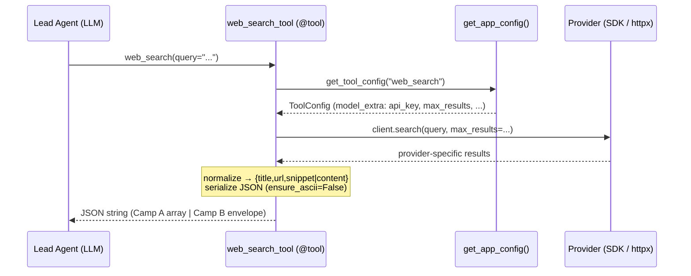
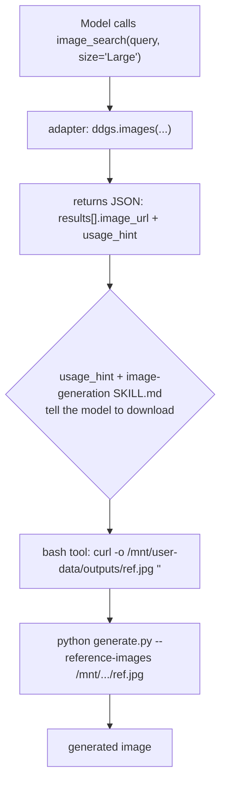

# Community Integrations — Phase 1: Search & Fetch Adapters

> Section 21 sub-file. Covers the six single-file `web_search` / `web_fetch` / `image_search`
> adapters under `deerflow/community/*/tools.py`. The Section 21 index
> (`21-community-integrations.md`) and Phase 2 (Jina, InfoQuest) are created later.

## Purpose

DeerFlow's web-search capability is **pluggable**: the lead agent calls a tool named
`web_search`, but _which_ provider answers is decided entirely in `config.yaml`. Each
provider gets one tiny adapter file that wraps a vendor SDK (or raw HTTP) into a LangChain
`@tool`, normalizes the provider's response into a small JSON shape, and returns a string.
Phase 1 is the family of these adapters:

| Provider                  | Auth                             | Transport                   | Tools defined                  |
| ------------------------- | -------------------------------- | --------------------------- | ------------------------------ |
| Tavily                    | API key (or `TAVILY_API_KEY`)    | `tavily` SDK                | `web_search`, `web_fetch`      |
| DuckDuckGo (`ddg_search`) | **none** (keyless)               | `ddgs` lib (lazy import)    | `web_search`                   |
| Serper                    | API key (or `SERPER_API_KEY`)    | raw `httpx` → Google Serper | `web_search`                   |
| Exa                       | API key (or `EXA_API_KEY`)       | `exa_py` SDK (neural)       | `web_search`, `web_fetch`      |
| Firecrawl                 | API key (or `FIRECRAWL_API_KEY`) | `firecrawl` SDK             | `web_search`, `web_fetch`      |
| Image Search              | **none** (keyless)               | `ddgs.images` (lazy import) | `image_search` (distinct slot) |

## Key Files

- `community/tavily/tools.py` — reference adapter; managed search + 4 KB page fetch.
- `community/ddg_search/tools.py` — keyless text search; the de-facto schema template.
- `community/serper/tools.py` — raw-HTTP Google Search; richest error handling.
- `community/exa/tools.py` — neural search; richest config surface; per-tool config.
- `community/firecrawl/tools.py` — structural twin of Exa; markdown page extraction.
- `community/image_search/tools.py` — DuckDuckGo image search for generation references; **separate `image_search` tool slot**, not a `web_search` backend.

## Important Concepts

### 1. The `@tool("web_search")` swap contract

Every search adapter registers under the **same tool name** `web_search`:

```python
@tool("web_search", parse_docstring=True)
def web_search_tool(query: str) -> str: ...
```

That name is the contract that makes providers interchangeable. In `config.yaml`:

```yaml
tools:
  - name: web_search # ← must equal the @tool name
    group: web
    use: deerflow.community.tavily.tools:web_search_tool # ← reflection path
    max_results: 5
    api_key: $TAVILY_API_KEY
```

- `name` must match the registered tool name so `get_tool_config("web_search")` resolves
  _that provider's_ extras.
- `use` is a reflection path (`module:variable`) — `resolve_variable()` imports the tool at
  assembly time, the same mechanism used for models and sandbox providers.
- Swapping Tavily → DDG → Serper is a one-line `use:` change; no code edits.

`parse_docstring=True` makes LangChain derive the tool's argument schema from the Google-style
`Args:` block in the docstring — so the **docstring is the model-facing API**.

### 2. Open-schema config (`extra="allow"`)

`ToolConfig` (`config/tool_config.py`) sets `model_config = ConfigDict(extra="allow")`. Any key
in `config.yaml` that isn't a declared field (`name`, `group`, `use`) lands on
`config.model_extra`. That's how provider-specific params travel without ever touching the
schema:

- Tavily: `api_key`, `max_results`
- Exa: `api_key`, `max_results`, `search_type`, `contents_max_characters`
- InfoQuest (Phase 2): `search_time_range`, `image_size`, …

Adding a new provider with new knobs requires **zero** changes to `ToolConfig`.

### 3. `$VAR` env resolution vs SDK env fallback (two different paths)

There are two distinct ways an API key reaches a provider, and they behave differently:

**Path A — `$TAVILY_API_KEY` in `config.yaml` → `model_extra["api_key"]`** (explicit, eager,
strict). Resolved by `AppConfig.resolve_env_variables()` at load time, _before_
`model_validate`:

```python
# app_config.py
config_data = cls.resolve_env_variables(config_data)   # walks the dict
...
if config.startswith("$"):
    env_value = os.getenv(config[1:])
    if env_value is None:
        raise ValueError(...)        # ⚠️ missing var ABORTS STARTUP
    return env_value
```

`.env` is loaded by `load_dotenv()` at _import time_ (`app_config.py:35`), so it's already in
`os.environ` before resolution runs.

**Path B — omit `api_key`; the vendor SDK reads the env var itself** (lazy, soft). Tavily/Exa/
Firecrawl pass `api_key=None` to their SDK, which falls back to its own env var and fails only
at call time if it's missing. This path never touches `app_config`.

|                   | Path A (`api_key: $VAR`)          | Path B (omit `api_key`)      |
| ----------------- | --------------------------------- | ---------------------------- |
| Resolver          | DeerFlow `resolve_env_variables`  | vendor SDK                   |
| Missing var       | hard `ValueError`, startup aborts | `None` → fails at first call |
| In `model_extra`? | yes                               | no                           |

Serper is the hybrid: it resolves config-then-env **in-app** with explicit empty/whitespace
guards (`_get_api_key()`), instead of delegating either path.

### 4. The two normalization camps (the central finding)

The six adapters split into **two consistent camps** on _both_ result shape and error
convention:

| Camp             | result key | envelope                        | error shape           | members                |
| ---------------- | ---------- | ------------------------------- | --------------------- | ---------------------- |
| **A — "Tavily"** | `snippet`  | bare JSON array                 | `"Error: ..."` string | tavily, exa, firecrawl |
| **B — "DDG"**    | `content`  | `{query,total_results,results}` | `{"error":...}` JSON  | ddg_search, serper     |

Test docstrings in `tests/test_serper_tools.py` explicitly say Serper matches _ddg_search_
behaviour and convention — so **DDG is the intended template and Tavily is the outlier**, not
the reverse. There is no shared normalizer reconciling the camps: a user who swaps Tavily↔Serper
silently changes the JSON keys and envelope the model sees. (Logged as an open question.)

### 5. Per-tool config (Exa / Firecrawl)

Exa and Firecrawl parameterize their client by tool name:

```python
def _get_exa_client(tool_name: str = "web_search") -> Exa: ...
# web_fetch calls _get_exa_client("web_fetch")
```

So `web_search` and `web_fetch` can read **separate** config entries, each with its own
`api_key`. Tavily, by contrast, shares one `web_search` config across both tools.

### 6. `web_fetch` truncation

Tavily/Exa/Firecrawl all cap fetched page bodies at **4096 chars** via a hardcoded `[:4096]`
slice (Exa and Tavily also request the cap at the API layer — belt-and-suspenders). Unlike
`max_results`, this cap is **not** config-driven, and there's no ellipsis/marker — long pages
are silently clipped. For full-content extraction the Phase 2 adapters (Jina, InfoQuest) are the
alternative.

## Execution Flow

### Search call (provider-agnostic)



### Image-search → reference-image generation (dry-run)

There is **no dedicated download tool**. `image_search` returns URLs; the agent downloads with
the general-purpose `bash` tool (`curl`/`wget`) into the sandbox, then feeds the local paths to
the image-generation skill. The orchestration lives in natural language (`usage_hint` +
`SKILL.md`), not in code.



Concrete sequence as it would appear in a run:

```text
image_search(query="Japanese woman street photography 1990s", size="Large")
    "usage_hint": "Use the 'image_url' values as reference images ... Download them first if needed." }

bash(description="download reference",
     command="curl -sL -o /mnt/user-data/outputs/ref1.jpg 'https://.../thumb.jpg'")

bash(description="generate image",
     command="python /mnt/skills/.../image-generation/scripts/generate.py \
              --reference-images /mnt/user-data/outputs/ref1.jpg --prompt '...'")
```

This is a deliberate **capability-composition** design: `image_search` = discovery,
`bash` = acquisition, `generate.py` (skill) = consumption. Each tool stays single-purpose;
adding "download" needs no new tool because `bash` already fetches anything.

## My Insights

- **The contract is a string, not an interface.** There is no `SearchProvider` ABC. The unifying
  contract is purely the registered tool name `web_search` plus the informal "return a JSON
  string" convention. This is wonderfully low-friction to extend (one file, ~40 lines) but buys
  no guarantees: the missing structural contract is exactly why the two normalization camps were
  able to drift apart unnoticed. A `Protocol` or a shared `normalize()` helper would have caught
  it.
- **Docstrings are production prompts.** With `parse_docstring=True`, the docstring _is_ the tool
  schema. `image_search`'s verbose "When to use" block isn't documentation for humans — it's the
  steering prompt that makes the model search references before generating. Editing that docstring
  changes agent behaviour.
- **Results can carry their own instructions.** `image_search` embeds a `usage_hint` field _in
  the result payload_. Guidance is delivered twice: at schema-time (docstring) and at result-time
  (usage_hint). The tool result doubles as a mini-prompt.
- **Errors as values, not exceptions.** Every adapter returns failures inline (string or JSON) so
  the agent reads them as the tool result and can recover, rather than aborting the run. The
  _form_ of that error is, again, camp-dependent.
- **Defensiveness signals SDK distrust.** Firecrawl uses `getattr(item, "title", "")`; DDG uses
  `r.get("href", r.get("link", ""))`. The fallback chains are hedges against unstable vendor
  return shapes — a recurring theme across community integrations.

## Confusions / Things that surprised me

- **`image_url` is actually a thumbnail.** In `image_search`, both `image_url` and
  `thumbnail_url` map to `r["thumbnail"]`; the full-resolution `r["image"]` from `ddgs.images()`
  is never read. For a tool whose entire purpose is high-fidelity references, this silently feeds
  low-res thumbnails into generation. Strong bug candidate.
- **No download tool, and that's fine.** I initially expected a `download_file` tool to pair with
  `image_search`. There isn't one — `bash` + `curl` is the intended path, wired together by
  natural-language hints. Took a trace through the image-generation skill to confirm.
- **Schema inconsistency is partly intentional.** The Tavily↔DDG divergence isn't random: test
  docstrings show DDG/Serper were written to one convention and Tavily to another. But "partly
  intentional" still means a provider swap changes the model-visible contract with no
  reconciliation.
- **`$VAR` resolution is eager and fatal.** A typo'd `$TAVILY_API_KEY` doesn't degrade search —
  it blocks the _entire app_ from starting. Surprising blast radius for a single optional tool.

## Open Questions

Logged in `questions/open-questions.md` under "Section 21":

1. `image_search` returns thumbnails as "reference images" — should `image_url` be `r.get("image")`?
2. Search-adapter schema drift (snippet/content, array/envelope, string/JSON errors) — intentional, or should a shared normalizer unify the six?
3. `web_fetch` 4096-char cap is hardcoded — should it be a config knob like Exa's `contents_max_characters`?

## Links to Related Sections

- [[09-middleware-pipeline]] — tool calls flow through `ToolErrorHandlingMiddleware` / `SandboxAuditMiddleware` before/after these adapters run.
- [[12-tools-system]] — `get_available_tools()` assembles config-defined tools (these adapters) via `resolve_variable()`.
- [[15-sandbox]] — the `bash` tool that downloads `image_search` URLs lives here.
- [[17-config-system]] — `AppConfig.resolve_env_variables()` and `ToolConfig` open-schema (`extra="allow"`).
- `21b` (Phase 2) — Jina + InfoQuest client/tools pattern (full-content fetch alternatives).
