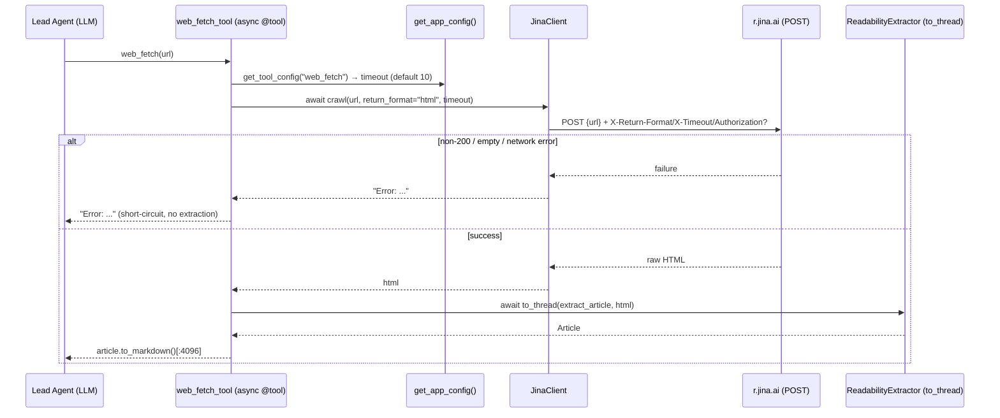
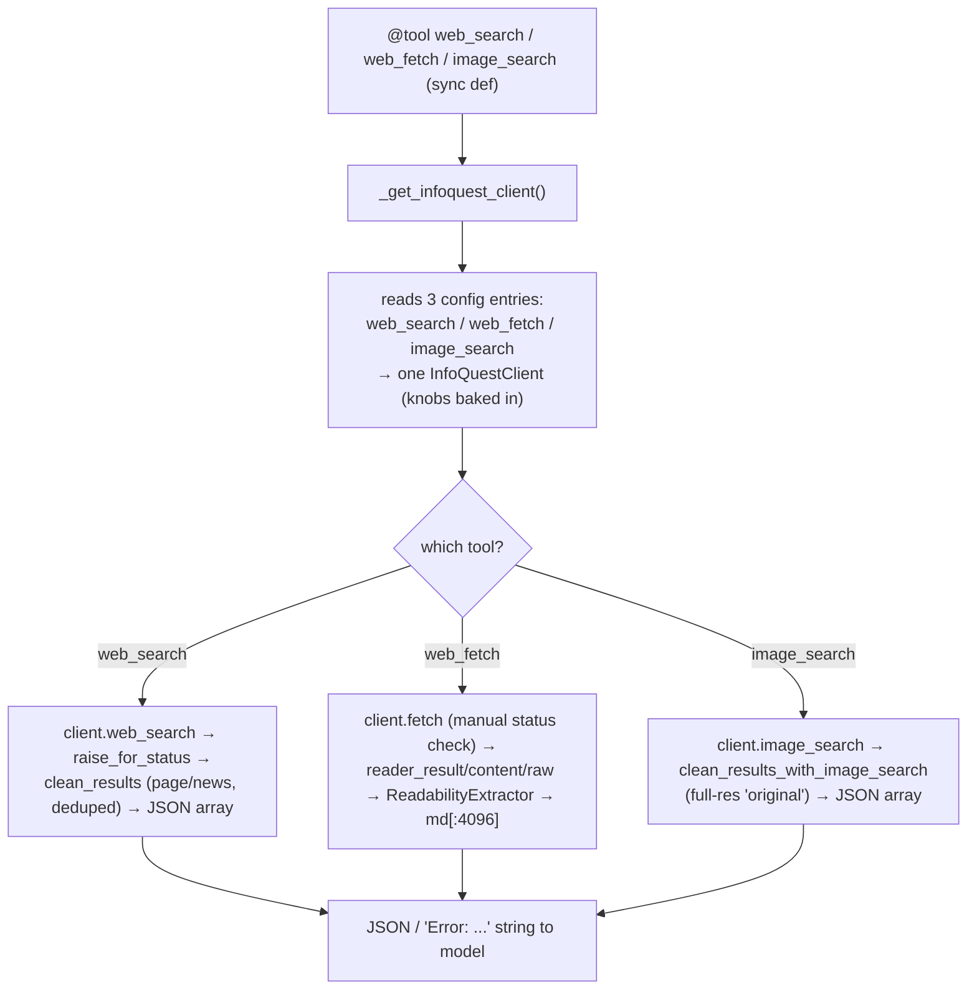
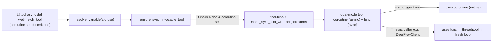

# Community Integrations — Phase 2: Client + Tools Fetch Providers

> Section 21 sub-file. Covers the two **client + tools** web providers under
> `deerflow/community/{jina_ai,infoquest}/` — Jina AI (fetch-only) and BytePlus InfoQuest
> (the full-suite provider). The Phase 1 single-file search adapters are documented in
> [[21a-search-adapters]]; the AIO sandbox (Phase 3) is documented in [[15-sandbox]].

## Purpose

Phase 2 providers register the **same** tool slots as Phase 1 — `web_search`, `web_fetch`,
`image_search` — so they are drop-in interchangeable via the `@tool("...")` swap contract. What
makes them a distinct family is _how_ they integrate the external provider: instead of wrapping a
managed vendor SDK that returns pre-cleaned content, they **hand-roll an HTTP client** against the
provider's REST endpoint, retrieve **raw HTML**, and run DeerFlow's **own** content extraction
(`utils/readability.py`) locally. The provider is treated as a _fetch substrate_, not a smart
search product. That single decision — own the extraction — is what forces the two-file
`*_client.py` + `tools.py` structure that names this phase.

## Key Files

- `community/jina_ai/jina_client.py` — 44-line async HTTP wrapper over Jina Reader (`r.jina.ai`); one `crawl()` method, stateless, env-only key, errors-as-values.
- `community/jina_ai/tools.py` — async `web_fetch` tool; `JinaClient.crawl(html)` → `ReadabilityExtractor` (offloaded via `asyncio.to_thread`) → markdown `[:4096]`.
- `community/infoquest/infoquest_client.py` — ~400-line **synchronous** client for BytePlus InfoQuest; stateful, config-tuned; three capabilities (`fetch`, `web_search`, `image_search`) across two hosts; carries its own result normalizer (`clean_results`).
- `community/infoquest/tools.py` — sync `web_search` + `web_fetch` + `image_search` tools (the only provider filling **all three** slots from one file); per-tool config stitched from three config entries into one shared client.
- `deerflow/utils/readability.py` — shared `ReadabilityExtractor` + `Article`; Node Readability.js with a pure-Python fallback. The reused extraction IP both providers depend on.

## Important Concepts

### 1. The client + tools seam (why Phase 2 has two files)

Because extraction is **local and shared**, the integration splits along a clean seam:

| Layer         | Responsibility                                                                   | Tested by                                                    |
| ------------- | -------------------------------------------------------------------------------- | ------------------------------------------------------------ |
| `*_client.py` | "get the bytes" — transport, headers, auth, errors-as-values                     | `test_jina_client.py`, `test_infoquest_client.py` (directly) |
| `tools.py`    | "extract + truncate + register `@tool`" — uses the shared `ReadabilityExtractor` | same files, via `web_fetch_tool.ainvoke`                     |

Phase 1 has no such seam: the **vendor SDK _is_ the client**, so one flat `tools.py` suffices.

### 2. Content-extraction ownership — the headline difference vs Phase 1

|                               | Phase 1 fetch (Tavily/Exa/Firecrawl)     | Phase 2 (Jina/InfoQuest)                          |
| ----------------------------- | ---------------------------------------- | ------------------------------------------------- |
| What the provider returns     | **pre-cleaned** `raw_content` / markdown | **raw HTML**                                      |
| Who extracts readable content | the vendor (server-side)                 | **DeerFlow**, via `ReadabilityExtractor`          |
| Swapping between providers    | changes content _and_ result schema      | **identical extraction quality** (same extractor) |

Jina _could_ return markdown directly, but `tools.py` deliberately requests
`X-Return-Format: html` so DeerFlow runs its own extractor — an explicit "don't trust the vendor's
extraction" choice. InfoQuest's `reader_result` is likewise fed back through `extract_article`.

### 3. Async (Jina) vs sync (InfoQuest) — and why neither breaks compatibility

- **Jina** is `async def` + `httpx.AsyncClient`. Because an async tool runs _directly on the event
  loop_, its blocking readability step is offloaded with `asyncio.to_thread`.
- **InfoQuest** is sync `def` + `requests`. A sync tool is run by LangChain in a **threadpool**
  (`run_in_executor`), so blocking `requests` never touches the loop — no `to_thread` needed.

> ⚠️ The naive "make InfoQuest async" — adding `async def` while keeping `requests` — is _strictly
> worse_: it moves a blocking call onto the event loop. A correct conversion means rewriting the
> whole client to `httpx.AsyncClient` **and** wrapping readability in `to_thread`.

**Compatibility is guaranteed in both directions** by the tool layer, independent of this choice:

- _async tool ← sync caller_ — `get_available_tools` runs `_ensure_sync_invocable_tool`
  (`tools/tools.py:96`), which **attaches** a sync wrapper (`tools/sync.py:make_sync_tool_wrapper`)
  as `tool.func` on any tool that has a `coroutine` but no `func`. The tool becomes **dual-mode**
  (keeps `coroutine`, gains `func`); it is _not_ converted. The normal async agent run still uses
  the native `coroutine`; the wrapper only fires for sync callers like `DeerFlowClient`.
- _sync tool ← async caller_ — LangChain's `BaseTool.ainvoke` runs `func` in an executor when there
  is no `coroutine`.

So the async-vs-sync decision is about **efficiency under concurrency**, not compatibility. The
real argument for async is avoiding **threadpool saturation** when many runs call these tools at
once (the default executor is bounded); absent a measured bottleneck, sync-in-threadpool is fine
and lower-risk.

The sync wrapper's clever bit (`tools/sync.py:32-35`): you can't call `asyncio.run()` inside a
running loop, so it submits to a shared 10-worker pool where a _fresh_ loop runs the coroutine,
blocking only that worker thread.

### 4. Errors-as-values — and how the model actually handles them

Every client method returns `"Error: ..."` **strings**, never raises (InfoQuest's search raw-layer
`raise_for_status()` is the one internal exception, caught and re-stringified upstream).

What happens to that string:

1. It becomes ordinary `ToolMessage` content — indistinguishable from success except by its text.
   The _tool layer_ uses `startswith("Error:")` to short-circuit before extraction; once it reaches
   the model it is plain prose.
2. **No framework retry.** `ToolErrorHandlingMiddleware` (pos 8) only catches tool _exceptions_
   (these adapters never raise), and `LLMErrorHandlingMiddleware` (pos 5) retries only _model-API_
   failures. Neither re-invokes the tool.
3. **The model decides** — retry (same/corrected args; the `web_fetch` docstring actively steers URL
   formatting), pivot to `web_search`, or report failure. Errors-as-values exist precisely so the
   run _recovers_ instead of aborting.
4. **`LoopDetectionMiddleware` (pos 17) is the only backstop** against a runaway retry: it hashes
   identical tool-call sets per thread → injects a "wrap up" warning at **3**, and **strips all
   `tool_calls`** to force a final answer at **5**.

### 5. Why these endpoints are POST (not GET) for retrieval

DeerFlow doesn't choose the verb — Jina and InfoQuest _define_ these as POST endpoints. The vendors
chose POST because:

- the payload **contains a URL** — nesting a URL (with its own `?query`/`#fragment`) inside another
  URL's query string needs fragile double percent-encoding; a JSON body avoids it;
- the request carries **rich structured params** (format, timeouts, time_range, site, search_type,
  image_size) that don't fit cleanly in a query string, and GET has no standard body;
- **URL-length limits** (~2–8 KB at proxies) would clip long URLs/params;
- **caching/logging hygiene** — GET URLs get cached by CDNs and written to access logs; POST bodies
  don't, and you don't want live crawl results served stale;
- semantically it is an **action with side effects** (a headless-browser crawl; a _metered, billable_
  search credit) — not the safe, idempotent, cacheable retrieval GET is designed for.

(Jina _also_ offers a GET form `r.jina.ai/<url>`, but POST+JSON is the cleaner programmatic path
once headers and options are involved.)

### 6. InfoQuest: the full-suite, stateful outlier

- **All three slots from one client** (`web_search`/`web_fetch`/`image_search`) — Jina is fetch-only.
- **Stateful & config-tuned**: the constructor bakes in six knobs (`fetch_time`, `fetch_timeout`,
  `fetch_navigation_timeout`, `search_time_range`, `image_search_time_range`, `image_size`); `-1` /
  `"i"` are "use server default" sentinels. `tools.py` stitches these from **three separate** config
  entries (one per tool slot) into the single shared client.
- **Carries its own normalizer** (`clean_results`): flattens `organic` → `type:page` and
  `top_stories` → `type:news` into one URL-deduped list, emitting **both** `desc` and `snippet`
  (snippet=desc) — the only adapter that hedges to satisfy _either_ normalization camp from
  [[21a-search-adapters]].
- **Higher image fidelity**: `clean_results_with_image_search` uses `result["original"]` (full
  resolution), directly contrasting the ddgs `image_search` adapter, which returns thumbnails
  (a strong bug candidate flagged in 21a).

## Execution Flow

### Jina `web_fetch` (async)



### InfoQuest (sync; one client, three capabilities)



### Dual-mode tool assembly (how an async tool becomes sync-callable)



## My Insights

- **Phase 1 = "buy", Phase 2 = "rent the pipe, build the value".** Phase 1 integrates a managed
  search/extraction product and normalizes its output. Phase 2 uses the provider only to retrieve
  bytes — often because no good SDK exists, or to get _consistent_ extraction across sources — and
  owns the extraction itself. That's the whole reason for the client/tools split.
- **The shared `ReadabilityExtractor` is the real product here.** Two providers, one extractor,
  identical output quality. Swapping Jina↔InfoQuest doesn't change content fidelity — a sharp
  contrast with the Phase 1 schema/quality drift. The extractor (Node Readability.js + Python
  fallback, multimodal `Article.to_message`) is more sophisticated than any single adapter.
- **Compatibility ≠ efficiency.** The async/sync question feels like a correctness issue but isn't —
  `_ensure_sync_invocable_tool` and LangChain's `ainvoke` bridge both directions. The only real
  stake is threadpool saturation under concurrency. So "match Jina and InfoQuest" is best achieved
  by making _Jina sync_ (delete its async complexity) unless you can measure an I/O-thread
  bottleneck — the opposite of the intuitive "make everything async".
- **Errors-as-values is an agency-handoff pattern.** The framework deliberately declines to retry;
  it hands the failure to the model as readable text and lets the model reason about recovery, with
  `LoopDetectionMiddleware` as the only guardrail. The _form_ of the error is still camp-dependent
  (string vs JSON), so the model sees inconsistent failures across providers.
- **POST-for-read is honest semantics, not a quirk.** A crawler/search call is a billable,
  side-effecting action, so GET's "safe/idempotent/cacheable" contract would be a lie. The
  URL-in-payload encoding problem just makes POST the practical choice too.

## Confusions / Things that surprised me

- **My first annotation was wrong, and the fix is the lesson.** I initially annotated InfoQuest's
  blocking `requests` as "the async tool layer must offload via `to_thread`" — copying the Jina
  mental model. But InfoQuest's tools are **sync**, so LangChain threadpools them automatically and
  no offload is needed. The takeaway: async-awareness is a property of the _tool signature_, not the
  client. Corrected in-place.
- **"Async tool" doesn't mean "async-only".** I expected the async Jina tool to be unusable from
  sync `DeerFlowClient`. It isn't — `get_available_tools` quietly attaches a sync wrapper, making it
  dual-mode. The wrapper even survives being called from inside a running loop by escaping to a
  threadpool with a fresh loop.
- **InfoQuest's image cleaner relies on dict-by-reference.** `clean_result["title"]` is set _after_
  the dict is appended to the results list; it works only because the appended item is the same
  object. And an image with no `"original"` field is silently dropped (never appended). Fragile, but
  functional.
- **InfoQuest's `fetch()` "neither field" path doesn't error.** When the JSON has neither
  `reader_result` nor `content`, it logs a warning and **falls through** to `return response.text` —
  handing the model raw JSON instead of an `"Error:"` string. Inconsistent with every other failure
  path in the same method.
- **Two error idioms in one client.** `fetch()` checks `status_code` manually and returns `"Error:"`;
  the search raw-layer uses `raise_for_status()` (raises). Both end as `"Error:"` strings to the
  model, but the internal inconsistency is real.

## Dry-run examples

### A failing fetch the model recovers from (errors-as-values + agency)

```text
web_fetch(url="https://example.com/report")
→ "Error: Jina API returned status 429: Rate limited"     # plain ToolMessage content

# No framework retry. The model reads the 429 and decides to pivot:
web_search(query="example.com Q2 report summary")
→ [ {"title": "...", "url": "https://example.com/q2", "snippet": "..."}, ... ]

web_fetch(url="https://example.com/q2")
→ "# Q2 Report\n\n..."                                     # success after the model's own recovery
```

If instead the model stubbornly repeats the same failing call, `LoopDetectionMiddleware` injects a
"wrap up" message at the 3rd identical call and force-strips `tool_calls` at the 5th.

### InfoQuest as a full-suite provider (one config block, three slots)

```yaml
# config.yaml — all three slots point at InfoQuest, each with its own knobs
tools:
  - name: web_search
    use: deerflow.community.infoquest.tools:web_search_tool
    search_time_range: 30 # → InfoQuestClient(search_time_range=30)
  - name: web_fetch
    use: deerflow.community.infoquest.tools:web_fetch_tool
    timeout: 20 # → fetch_timeout=20
    navigation_timeout: 15 # → fetch_navigation_timeout=15
  - name: image_search
    use: deerflow.community.infoquest.tools:image_search_tool
    image_search_time_range: 90 # validated to 1–365
    image_size: l # validated to l|m|i  → full-res references
```

```text
image_search(query="art deco lobby interior")
→ [ {"image_url": "https://.../original-hi-res.jpg", "title": "..."}, ... ]   # full-res 'original'
```

### Mixing phases (the swap contract in action)

```yaml
tools:
  - name: web_search
    use: deerflow.community.serper.tools:web_search_tool # Phase 1 (Camp B JSON)
  - name: web_fetch
    use: deerflow.community.jina_ai.tools:web_fetch_tool # Phase 2 (local extraction)
```

Perfectly valid — the `@tool` name is the only contract. But the model now sees Serper's Camp-B
search envelope alongside Jina's locally-extracted markdown: capability is uniform, _schema_ is not.

## Open Questions

Logged in `questions/open-questions.md` under "Section 21":

1. Should InfoQuest/Jina tools be async for concurrency, or should Jina be made sync to match
   InfoQuest? (Compatibility is already bridged; only threadpool saturation argues for async.)
2. InfoQuest `fetch()`'s "neither field" path returns raw JSON instead of an `"Error:"` string —
   intentional graceful degradation or a gap?
3. `clean_results` emitting both `desc` and `snippet` is the only attempt to bridge the two-camps
   schism — should this double-key hedge be the standard normalization across _all_ adapters?
   (Extends 21a open question #2.)
4. `Article.to_message()` (the multimodal/vision path in `utils/readability.py`) is unused by
   `web_fetch` (only `to_markdown()` is called) — who, if anyone, consumes it?

## Links to Related Sections

- [[21a-search-adapters]] — Phase 1 single-file search adapters; the swap contract, two-camps schism, image thumbnail bug this phase contrasts.
- [[12-tools-system]] — `get_available_tools()` + `_ensure_sync_invocable_tool` + `tools/sync.py` (the dual-mode wrapper assembly).
- [[09-middleware-pipeline]] — `ToolErrorHandlingMiddleware`, `LLMErrorHandlingMiddleware`, `LoopDetectionMiddleware` that frame how tool errors/retries are handled.
- [[15-sandbox]] — the `bash` tool used to download `image_search` URLs; AIO sandbox (Phase 3 of this section).
- [[17-config-system]] — `ToolConfig` open-schema (`extra="allow"`) feeding per-tool `model_extra` knobs.
