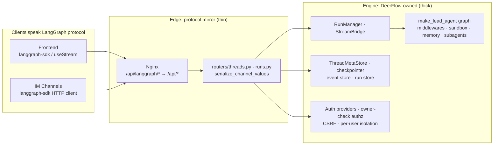

# Pattern: Protocol Mirror as an Anti-Corruption Layer

> _"Adopt the contract, own the implementation."_

## Where it appears

- `backend/app/gateway/routers/threads.py` — re-implements the LangGraph Platform
  thread/state/history REST surface
- `backend/app/gateway/routers/runs.py`, `routers/thread_runs.py` — the run lifecycle surface
- `backend/packages/harness/deerflow/runtime/serialization.py:serialize_channel_values`
  — emits the exact LangGraph Platform wire format the frontend `useStream` hook expects
- Nginx exposes the Gateway at `/api/langgraph/*` and rewrites to the native `/api/*` routers
- Consumers that speak the protocol as **clients**: the Next.js frontend (`langgraph-sdk` +
  `useStream`) and the IM channels (`langgraph-sdk` HTTP client, `app/channels/manager.py`)

## The pattern

DeerFlow speaks the **LangGraph Platform REST wire protocol** without running LangGraph's
actual server. The Gateway is a hand-written FastAPI implementation of a third-party API
contract. This is a textbook **Anti-Corruption Layer** (Evans, DDD): the external protocol
is honoured at the boundary, but it is never allowed to dictate the internal domain model.

## Why DeerFlow does this

1. **Free, battle-tested client ecosystem.** Speaking the wire format means the frontend
   reuses LangGraph's mature streaming/state-reconciliation client (`useStream`), and the
   channels reuse `langgraph-sdk` — plus LangGraph Studio compatibility — for ~zero cost.
   This is _why_ `threads.py` works so hard to look LangGraph-shaped (the `success`→`idle`
   status remap in `worker.py:417`, the `writes` metadata key, channel-value serialization).
2. **Total control over the runtime.** Everything that differentiates DeerFlow lives in the
   engine, not the protocol: per-user isolation (`get_effective_user_id`), owner-check authz,
   the security-hardened `ThreadMetaStore` (reserved-metadata stripping), the sandbox
   lifecycle, custom checkpointer/event-store/run-store, token accounting, the `continue_`
   disconnect mode, and **embedded mode** (`DeerFlowClient`, in-process, no HTTP).
   The harness/app split exists so the runtime is a publishable, independent package.

## The trade-off (the reason this is a _pattern_, not a free lunch)

Mirroring a protocol means tracking its evolution. A LangGraph wire-protocol change forces a
Gateway migration. But the risk is **bounded and cheap**:

- Versions are **pinned** (`langgraph-sdk`, `langgraph-checkpoint==4.0.2`), so upgrades are deliberate.
- The mirrored surface is small and stable (threads, runs, state, history, store).
- Translation is concentrated in a few seams (`serialize_channel_values`,
  `_derive_thread_status`, metadata handling), so a protocol change touches few files.

Concrete drift already observed: `metadata["writes"]` (set in `update_thread_state`) was a
documented field of LangGraph's `CheckpointMetadata` in `langgraph-checkpoint` 2.0.x, but was
**removed from the typed schema by 4.0.2**. It still round-trips only because the TypedDict is
`total=False` (untyped extra keys are persisted). This is the archetype of the maintenance cost.

### The proportionate mitigation: a contract test, not a rewrite

DeerFlow already has `TestGatewayConformance` validating `DeerFlowClient` output against the
Gateway's Pydantic response models. The **symmetric guard is missing**: a test that drives the
Gateway with a pinned `langgraph-sdk` and asserts the endpoints behave, catching wire-format
drift at upgrade time. That — not adopting LangGraph's real server — is the right hedge.

## Why "just use the LangGraph server directly" does **not** fit

The instructive asymmetry: the **graph layer is already portable** (`make_lead_agent` in
`langgraph.json`; middlewares/sandbox/memory/subagents all live _inside_ the graph and would
run on the official server unchanged). But the **server layer you'd be replacing is exactly
where the differentiation lives**, and much of it has no clean home in LangGraph Server:

| Concern                                                                                  | Fits official LangGraph Server?                                                      |
| ---------------------------------------------------------------------------------------- | ------------------------------------------------------------------------------------ |
| Graph + middlewares + sandbox + memory + subagents                                       | ✅ Runs as-is (it's in the graph)                                                    |
| Frontend / IM channels                                                                   | ✅ Already `langgraph-sdk` clients — just repoint the URL                            |
| Auth (JWT/local providers, owner-check, CSRF, internal auth)                             | ⚠️ Rewrite as LangGraph `Auth` handlers; move ownership into thread metadata         |
| `ThreadMetaStore` search + `success`→`idle` status + validated filters                   | ⚠️ Native `/threads/search` exists, but custom status/security model doesn't map 1:1 |
| uploads, artifacts, skills, mcp, memory, models, feedback, suggestions, agents, channels | ❌ No native equivalent — mount as custom app or run a side Gateway                  |
| token-usage endpoints, `continue_` disconnect, join-SSE, custom event store              | ❌ No / partial native equivalent                                                    |
| **Embedded mode (`DeerFlowClient`, in-process)**                                         | ❌ Can't embed a server — lost or maintained in parallel                             |
| Per-user-scoped persistence                                                              | ⚠️ Reconcile DeerFlow schema with the server's managed Postgres                      |

**The irony:** because they mirrored the protocol, _client_ migration is trivial — but _server_
migration is hard, because all the value-add sits in the server layer being torn out. The thin
mirror is the cheap part to maintain; wholesale adoption is expensive precisely where DeerFlow
adds value. Net assessment: **keep the mirror.** It trades a small, controllable maintenance
cost for permanent independence from LangChain's server lifecycle, auth model, deployment
constraints, and licensing — and adoption would still leave a Gateway running for everything
LangGraph doesn't do.

## Generalised takeaway

When you depend on an external system's _interface_ but need to own its _behaviour_:

- Re-implement the **contract** at the edge; keep the translation surface thin and few-filed.
- Pin the external version so drift is opt-in.
- Guard the boundary with a **contract/conformance test** in both directions.
- Keep all domain differentiation behind the layer, never leaking the external model inward.

## Links to Related Sections

- [[05-api-reference]] — the per-router API reference this pattern underpins
- [[05a-gateway-api]] — Gateway bootstrap, middleware, deps
- [[07-langgraph-runtime]] — the owned engine (RunManager, StreamBridge, checkpointer) the mirror fronts
- See `notes/questions/open-questions.md` → Section 05 (routers/threads.py) for the
  drift/contract-test open questions this pattern raises
